Errata for MIPI I3C Basic Specification v1.1.1 

Errata 01 11-Mar-2022 

## **Errata 01 for** 

## **MIPI I3C Basic Specification** 

**(Improved Inter Integrated Circuit)** 

## **Specification Version 1.1.1** 

## **Specification Dated 9 June 2021** 

Specification MIPI Board Adopted 23 July 2021 

## **Errata 01 Dated 11 March 2022** 

Errata MIPI Board Approved 23 March 2022 

## *** IMPORTANT NOTE TO IMPLEMENTERS *** 

- The issue(s) listed in this Errata document will be corrected in the next edition of this MIPI Specification. 

- Implementations should observe all Corrections listed here. 

- The location of each Correction is also marked in the attached copy of the MIPI Specification. To reduce the risk of incorrect implementations, we suggest you consider discarding any previous copies of this MIPI Specification not so marked. 

- This MIPI Specification as modified by the corrections listed in this Errata document is also a MIPI Specification, as the MIPI Bylaws defines the term. 

- **MIPI member companies’ rights and obligations apply to the modified MIPI Specification as defined in the MIPI Membership Agreement and MIPI Bylaws.** 

Copyright © 2021–2022 MIPI Alliance, Inc. **Public Release Edition** 

Errata for MIPI I3C Basic Specification v1.1.1 

Errata 01 11-Mar-2022 

|**Item**|**Spec**<br>**Page**<br>**Number**|**PDF**<br>**Page**<br>**Number**|**Correction**|
|---|---|---|---|
|1|6|34|**Editorial or Technical:**Editorial<br>**Location:**Section 1.3 I3C Key Features, line 154<br>**Correction:**Replace unit “Ms” with “ms”<br>**Reason:**To correct a typo.<br>**Technical Impact:**None|
|2|6|34|**Editorial or Technical:**Editorial<br>**Location:**Section 1.3 I3C Key Features, line 155 & line 161<br>**Correction:**Replace unit “mJ” (milli-Joules) with “µJ” (micro-Joules)<br>**Reason:**To correct a technical authoring error.<br>**Technical Impact:**None|
|3|41|69|**Editorial or Technical:**Editorial<br>**Location:**Section 5.1.2.1.1 Role of I3C Target Acting as an I2C Target with<br>Static Address, lines 897 and 901<br>**Corrections:**<br>**Change:**<br>Line 897: “…with Open Drain timing parameters (per**_Table_**<br>**_86_**)…”<br>Line 901: “…with Open Drain timing parameters, …”<br>**To:**<br>Line 897: “…with FM/FM+ timing parameters (per**_Table 85_**)…”<br>Line 901: “…with FM/FM+ timing parameters, …”<br>**Reason:**Error during drafting. The existing text only referred to Open Drain<br>timing parameters, but a properly defined Spike Filter would filter<br>out the START followed by 7’h7E if it were sent too quickly by the<br>Controller. To ensure that it is not filtered out, the Controller must<br>send the START followed by 7’h7E using valid FM/FM+ timing<br>parameters, so that this might be seen with the Spike Filter<br>enabled.<br>**Technical Impact:**None|
|4|50|78|**Editorial or Technical:**Editorial<br>**Location:**Section 5.1.2.2.5 I3C Target Address Restrictions, Table 8,<br>column Binary<br>**Corrections:**<br>Row 7’h06:**Change:**“**000 0011**”**To:**“**000 0110**”<br>Row 7’h07:**Change:**“**000 0011**”**To:**“**000 0111**”<br>**Reason:**To correct two typos. The Hex values are correct, but the Binary<br>values are not.<br>**Technical Impact:**None|


Copyright © 2021–2022 MIPI Alliance, Inc. **Public Release Edition** 

2 

Errata for MIPI I3C Basic Specification v1.1.1 

Errata 01 11-Mar-2022 

|5|81|109|**Editorial or Technical:**Technical<br>**Location:**Section 5.1.5.3, line 1913<br>**Correction:**<br>**Change:**<br>After “an SDR Frame”, insert:<br>”addressed to the Broadcast Address (7’h7E / W) and”<br>**Reason:**To correct inconsistencies and restore details regarding the<br>eligibility of a passive Hot-Joining Target to emit a Hot-Join<br>request. These details were lost during v1.1.1 drafting.<br>A passive Hot-Joining Target needs to see that it is on an I3C<br>Bus, which is only determined by an SDR Frame with START<br>followed by the Broadcast Address.<br>**Technical Impact:**Low|
|---|---|---|---|
|6|81|109|**Editorial or Technical:**Technical<br>**Location:**Section 5.1.5.3, lines 1916–1917<br>**Correction:**<br>**Change:**<br>“Since a passive Hot-Joining Target does not necessarily have<br>an internal timer that would otherwise be used to wait for the<br>Bus Idle Condition, it must clearly recognize a START that<br>another Device might issue…”<br>**To:**<br>“A passive Hot-Joining Target does not necessarily use or<br>enable an internal timer that would otherwise be used to wait<br>for the Bus Idle Condition (i.e., to emit the Hot-Join Request).<br>If it does, then it must clearly recognize a START with the<br>Broadcast Address (7’h7E) that another Device might issue…”<br>**Reason:**<br>(1) The existing text could be interpreted to mean that no internal<br>timer is needed. The I3C WG has realized that although an internal<br>timer is not strictly needed to emit the Hot-Join Request, it is indeed<br>needed after that.<br>(2) To synchronize with the Correction in Errata Item 5.<br>**Technical Impact:**Low|
|7|81|109|**Editorial or Technical:**Technical<br>**Location:**Section 5.1.5.3, line 1919<br>**Correction:**<br>**Change:**<br>“In practice, this means that a passive Hot-Joining Target will:”<br>**To:**<br>“In practice, this means that a passive Hot-Joining Target will<br>first determine that it is indeed on an I3C Bus in SDR Mode<br>(per the conditions above), and then it will:”<br>**Reason:**<br>(1) To prevent possible misinterpretation of passive Hot-Joining<br>Target requirements. A passive Hot-Joining Target must determine<br>that it is on an I3C Bus. If the Target has no internal timer to use in<br>detecting the Bus Idle Condition, then the only way to detect an I3C<br>Bus is to observe that the Frame end with the STOP condition. This<br>prevents mistaken perceptions of START and STOP that might<br>occur in HDR Modes.<br>(2) To synchronize with the Corrections in Errata Item 5 and Errata<br>Item 6.<br>**Technical Impact:**Low|


Copyright © 2021–2022 MIPI Alliance, Inc. 

3 

**Public Release Edition** 

Errata for MIPI I3C Basic Specification v1.1.1 

Errata 01 11-Mar-2022 

|8|118|146|**Editorial or Technical:**Editorial<br>**Location:**Section 5.1.9.3 CCC Command Definitions, Table 16, row 0x07<br>ENTDAA CCC, column  “CCC is Required / Conditional / Optional”<br>**Correction:**<br>**Change:**“R” (i.e., Required)**To:**“C” (i.e., Conditional)<br>**Reason:**To resolve a contradiction. Per the Description column, the<br>ENTDAA CCC is only required on the conditions that the Target<br>does not have an assigned Static Address, or that the Target<br>supports Hot-Join. In addition, both Section 5.1.4.2 and table<br>footnote 9 state that although ENTDAA is an essential CCC for<br>typical I3C buses, Targets that will only be used in special-purpose<br>buses may omit ENTDAA support, i.e., that ENTDAA is<br>Conditional.<br>**Technical Impact:**None|
|---|---|---|---|
|9|130|158|**Editorial or Technical:**Technical<br>**Section:**Section 5.1.9.3.5 Set/Get Max Write Length (SETMWL/GETMWL)<br>CCCs, lines 2991–2992<br>**Correction #1:**<br>**Change:**<br>“The minimum value that Max Write Length can be set to is 16<br>bytes.”<br>**To:**<br>“The Target should define the minimum possible value that can<br>be set as the Max Write Length.<br>**_Note:_**<br>_If the Controller sends a MWL value (via SETMWL) that the_<br>_Target does not support, then the Target should leave the_<br>_MWL value unchanged, so that it would return that value on_<br>_the next use of GETMWL. In version 1.0 of this I3C Basic_<br>_Specification, the minimum defined MWL value was 8_<br>_bytes._”<br>**Reason:**<br>Together with Errata Items 10 & 11, this reverses a requirement,<br>introduced in I3C Basic v1.1.1, that the Max Write Length must<br>be at least 16 bytes. This is being done because some I3C<br>Basic Targets that complied with I3C Basic version 1.0<br>supported a minimum of 8 bytes which was permitted under I3C<br>Basic v1.0.<br>Removing the defined minimum MWL value allows the Target to<br>determine its own minimum, based on its supported capabilities<br>and content protocol.<br>**Technical Impact:**Implementers are no longer constrained to 16-byte<br>minimum (or 8-byte minimum, as defined in I3C Basic v1.0).|


Copyright © 2021–2022 MIPI Alliance, Inc. 

4 

**Public Release Edition** 

Errata for MIPI I3C Basic Specification v1.1.1 

Errata 01 11-Mar-2022 

|10|130|158|**Editorial or Technical:**Technical<br>**Location:**Section 5.1.9.3.5, line 2994<br>**Correction:**Delete “and this limit is greater than 16 bytes”<br>**Reason:**See Errata Item 9.<br>**Technical Impact:**See Errata Item 9.|
|---|---|---|---|
|11|130|158|**Editorial or Technical:**Technical<br>**Location:**Section 5.1.9.3.5, lines 2995–2996<br>**Correction:**Delete “A return of 0 by the Target to GETMWL means a value<br>less than 16 bytes.”<br>**Reason:**See Errata Item 9.<br>**Technical Impact:**See Errata Item 9.|
|12|132|160|**Editorial or Technical:**Technical<br>**Location:**Section 5.1.9.3.6 Set/Get Max Read Length<br>(SETMRL/GETMRL) CCCs, lines 3004–3005<br>**Correction #1:**<br>**Change:**<br>“The minimum value to which Max Read Length can be set is<br>16 bytes. A return of 0 by the Target to GETMRL means a<br>value less than 16 bytes.”<br>**To:**<br>“The Target should define the minimum possible value that can<br>be set as the Max Read Length.”<br>**_Note:_**<br>_If the Controller sends a MRL value (via SETMRL) that the_<br>_Target does not support, then the Target should leave the_<br>_MRL value unchanged, so that it would return that value on_<br>_the next use of GETMRL._”<br>**Reason:**Together with Errata Items 13 & 14, this reverses a requirement,<br>introduced in I3C Basic v1.1.1, that the Max Read Length must be<br>at least 16 bytes. This is being done for consistency with Errata<br>Items 9–11, and because some I3C Basic Targets that complied<br>with I3C Basic version 1.0 supported a minimum of 8 bytes which<br>was permitted under I3C Basic v1.0.<br>Removing the defined minimum MRL value allows the Target to<br>determine its own minimum, based on its supported capabilities<br>and content protocol<br>**Technical Impact:**Implementers are no longer constrained to 16-byte<br>minimum.|


Copyright © 2021–2022 MIPI Alliance, Inc. 

5 

**Public Release Edition** 

Errata for MIPI I3C Basic Specification v1.1.1 

Errata 01 11-Mar-2022 

|13|132|160|**Editorial or Technical:**Technical<br>**Location:**Section 5.1.9.3.6 Set/Get Max Read Length<br>(SETMRL/GETMRL) CCCs, line 3010<br>**Correction:**<br>After “This CCC is required if”, insert:<br>“both (a)”.<br>**Reason:**See Errata Item 12.<br>**Technical Impact:**See Errata Item 12.|
|---|---|---|---|
|14|132|160|**Editorial or Technical:**Technical<br>**Location:**Section 5.1.9.3.6 Set/Get Max Read Length<br>(SETMRL/GETMRL) CCCs, line 3011<br>**Correction:**<br>After “that the Target may return per Message”, insert:<br>“, and (b) this limit is greater than 16 bytes.”<br>**Reason:**See Errata Item 12.<br>**Technical Impact:**See Errata Item 12.|


Copyright © 2021–2022 MIPI Alliance, Inc. **Public Release Edition** 

6 

Errata for MIPI I3C Basic Specification v1.1.1 

Errata 01 11-Mar-2022 

|15|134|162|**Editorial or Technical:**Editorial<br>**Section:**Section 5.1.9.3.7 Define List of Targets CCC (DEFTGTS),<br>Figure 42 DEFTGTS Format<br>**Correction:**<br>Replace Figure 42 with the figure below.<br>The replacement figure adds annotations to the byte fields**Dynamic**<br>**Addr of AC**and**Static Addr (7’h7E)**in the Active Controller<br>description, to clarify that they both have the value 1’b0.<br>In addition, all occurrences of “Addr” are expanded to “Address”.<br>**Reason:**To clarify bit field usage for the Dynamic Address and Static<br>Address of the Active Controller.<br>These Active Controller bytes use the same formats as the Target or<br>Groups bytes, i.e., the Device Address is in bits[7:1] and bit[0] contains<br>a padding bit with value 1’b0.<br>**Technical Impact:**None. This figure update only adds clarification.|
|---|---|---|---|
|**Target Addr**<br>/RnW / ACK<br>**7’h7E**<br>/ W / ACK<br>**Count**<br>/ T<br>**Static**<br>**Address**<br>**(7'h7E) /**<br>**1'b0**<br>/ T<br>**S**<br>**Sr**<br>**7’h7E**<br>/ W / ACK<br>**Broadcast**<br>**DEFTGTS **<br>**CCC**<br>/ T<br>**BCR Type**<br>**of AC**<br>/ T<br>**DCR Type**<br>**of AC**<br>/ T<br>**Dynamic**<br>**Address**<br>**of AC /**<br>**1'b0**<br>/ T<br>**Static**<br>**Address**<br>**/ 1'b0**<br>/ T<br>**BCR Type**<br>**of Target**<br>**or Group**<br>/ T<br>**DCR Type**<br>**of Target**<br>**or Group**<br>/ T<br>**Target or**<br>**Group**<br>**Address**<br>**/ 1'b0**<br>/ T<br>**Sr**<br>**P**<br>**_Next CCC_**<br>**_Describes Active Controller (AC)_**<br>**_Describes First Target or Group_**<br>**_End of this Broadcast CCC_**<br>**_Repeat to describe all additional Targets,_**<br>**_followed by Groups, with this Broadcast CCC_**<br>**Figure 52 DEFTGTS Format**||||


Copyright © 2021–2022 MIPI Alliance, Inc. 

7 

**Public Release Edition** 

Errata for MIPI I3C Basic Specification v1.1.1 

Errata 01 11-Mar-2022 

|16|138|166|**Editorial or Technical:**Editorial<br>**Location:**Section 5.1.9.3.10 Set Dynamic Address from Static Address<br>(SETDASA) CCC, after line 3056<br>**Correction:**<br>**Add:**<br>“**_Note:_**<br>_Per Section 5.1.4, only the SETNEWDA and RSTDAA CCCs will_<br>_cause a Target that already has an assigned Dynamic Address_<br>_to change or lose its address. Targets that support the SETDASA_<br>_CCC shall not respond to this CCC if a Dynamic Address has_<br>_already been assigned (i.e., by any of the CCCs that set or_<br>_assign a Dynamic Address). If a Dynamic Address has already_<br>_been assigned, then the Target shall NACK this CCC and ignore_<br>_the command._”<br>**Reason:**To clarify requirements for Target response to the SETDASA CCC<br>if a Dynamic Address was previously assigned. These<br>requirements are already clearly stated in Section 5.1.4.<br>**Technical Impact:**None|
|---|---|---|---|
|17|185|213|**Editorial or Technical:**Editorial<br>**Location:**Section 5.1.9.3.23 Set All Addresses to Static Address<br>(SETAASA) CCC, after line 3548<br>**Correction:**<br>**Add:**<br>“**_Note:_**<br>_Per_**_Section 5.1.4_**_, only the SETNEWDA and RSTDAA CCCs will_<br>_cause a Target that already has an assigned Dynamic Address_<br>_to change or lose its address. Targets that support the SETAASA_<br>_CCC shall not respond to this CCC if a Dynamic Address has_<br>_already been assigned (i.e., by any of the CCCs that set or_<br>_assign a Dynamic Address). If a Dynamic Address has already_<br>_been assigned, then the Target shall ignore this command.”_<br>**Reason:**To clarify requirements for Target response to the SETAASA CCC<br>if a Dynamic Address was previously assigned. These<br>requirements are already clearly stated in Section 5.1.4.<br>**Technical Impact:**None|
|18|189|217|**Editorial or Technical:**Editorial<br>**Location:**Section 5.1.9.3.26, line 3575<br>**Correction:**<br>**Change:**<br>“…Direct Read (**_Figure 77_**), and Direct Write (**_Figure 78_**),…”<br>**To:**<br>“…Direct Write (**_Figure 77_**), and Direct Read (**_Figure 78_**),…”<br>**Reason:**Correct two typos.<br>**Technical Impact:**None|


Copyright © 2021–2022 MIPI Alliance, Inc. 

8 

**Public Release Edition** 

Errata for MIPI I3C Basic Specification v1.1.1 

Errata 01 11-Mar-2022 

||19|191|219|**Editorial or Technical:**Technical<br>**Location:**Section 5.1.9.3.26 Target Reset Action (RSTACT) CCC,<br>Table 53 RSTACT Defining Byte Values,<br>rows 0x00–0x7F, column “Notes”<br>**Correction:**<br>**Change:**<br>“**GET:**Returns currently<br>set Defining Byte value<br>(i.e., previously<br>received in Direct SET)<br>or 0x00”<br>**To:**<br>“**GET:**Returns currently<br>set Defining Byte value<br>(i.e., previously<br>received in Direct SET)<br>or 0x80”<br>**Reason:**<br>For the Direct Read form of the RSTACT CCC for reset actions,<br>changes the default GET value from 0x00 to 0x80. This is being<br>done because the existing default value, 0x00, is the same as the<br>value for Defining Byte 0x00 (i.e., No Reset Action), which results in<br>ambiguity and confusion for I3C Controller Devices that attempt to<br>configure an I3C Target Device with that Defining Byte value (i.e., No<br>Reset Action).<br>Note that the definition of 0x00 as the default read value was<br>introduced in I3C v1.1. As a result, system integrators should make<br>allowances for existing I3C Target Devices that return the prior value<br>before accepting any Defining Byte (i.e., including 0x00). In some<br>cases, it may be necessary for a Controller Device to test a Target<br>Device to ensure that it has actually accepted a new Defining Byte<br>value, before using the Target Reset Pattern.<br>**Technical Impact:**Medium|
|---|---|---|---|---|


Copyright © 2021–2022 MIPI Alliance, Inc. 

9 

**Public Release Edition** 

Errata for MIPI I3C Basic Specification v1.1.1 

Errata 01 11-Mar-2022 

|20|222|250|**Editorial or Technical:**Editorial<br>**Location:**Section 5.1.11.3 Target Reset Pattern, after line 4236<br>**Correction:**<br>**Add:**<br>“**_Note:_**<br>_Similar to the HDR Exit Pattern, the Controller shall observe the_<br>_minimum timing while sending the Target Reset Pattern, as_<br>_defined by_**_tDIG_H_**_minimum value (see_**_Section 5.2.1.1.1_**_and_<br>**_Section 6.2_**_). This shall apply to all transitions on both SDA and_<br>_SCL._”<br>**Reason:**To state the timing requirements for the Target Reset Pattern<br>explicitly. In the existing text, the minimum timing was only defined<br>implicitly (i.e., for the HDR Exit Pattern), not stated explicitly.<br>**Technical Impact:**None|
|---|---|---|---|
|21|362|390|**Editorial or Technical:**Technical<br>**Location:**Section 6.1 Timing Specification,<br>Table 83 I3C Low Voltage / High Capacitive Load I/O Stage<br>Characteristics for Push-Pull Mode and Open Drain Mode,<br>Column “Conditions”, Row “Pull-Up for Open Drain”<br>**Correction:**Change “100 ns”**To:**“120 ns”<br>**Reason:**To synchronize I3C Basic’s max rise time value with the most<br>current value in the JEDEC JESD403 Sideband Bus specification<br>(MIPI did not account for JEDEC’s decision to use 120 ns).<br>**Technical Impact:**Increases allowed max rise time for compliant I3C<br>Target devices, ensuring interoperability with JEDEC JESD403.|
|22|383|411|**Editorial or Technical:**Editorial<br>**Location:**Section 6.2 Timing Specification,<br>Table 90 Timing and Drive for Continuation of Frame Using<br>Repeated START,<br>Column “Sr”<br>**Correction:**<br>**Change:**“START”**To:**“Repeated START”<br>**Reason:**To correct a typo that was present in earlier I3C and I3C Basic<br>Specification versions, including I3C Basic v1.0.<br>**Technical Impact:**None|


Copyright © 2021–2022 MIPI Alliance, Inc. **Public Release Edition** 

10 

## **Specification for I3C Basic[SM]** 

## **Improved Inter Integrated Circuit** 

**Version 1.1.1 9 June 2021** 

MIPI Board Adopted 23 July 2021 **Public Release Edition** 

Further technical changes to this document are expected as work continues in the I3C Ad Hoc Working Group. 

Copyright © 2016–2021 MIPI Alliance, Inc. 

Specification for I3C Basic 

Version 1.1.1 09-Jun-2021 

## **NOTICE OF DISCLAIMER** 

The material contained herein is provided on an “AS IS” basis. To the maximum extent permitted by applicable law, this material is provided AS IS AND WITH ALL FAULTS, and the authors and developers of this material and MIPI Alliance Inc. (“MIPI”) hereby disclaim all other warranties and conditions, either express, implied or statutory, including, but not limited to, any (if any) implied warranties, duties or conditions of merchantability, of fitness for a particular purpose, of accuracy or completeness of responses, of results, of workmanlike effort, of lack of viruses, and of lack of negligence. ALSO, THERE IS NO WARRANTY OR CONDITION OF TITLE, QUIET ENJOYMENT, QUIET POSSESSION, CORRESPONDENCE TO DESCRIPTION OR NON-INFRINGEMENT WITH REGARD TO THIS MATERIAL. 

IN NO EVENT WILL ANY AUTHOR OR DEVELOPER OF THIS MATERIAL OR MIPI BE LIABLE TO ANY OTHER PARTY FOR THE COST OF PROCURING SUBSTITUTE GOODS OR SERVICES, LOST PROFITS, LOSS OF USE, LOSS OF DATA, OR ANY INCIDENTAL, CONSEQUENTIAL, DIRECT, INDIRECT, OR SPECIAL DAMAGES WHETHER UNDER CONTRACT, TORT, WARRANTY, OR OTHERWISE, ARISING IN ANY WAY OUT OF THIS OR ANY OTHER AGREEMENT RELATING TO THIS MATERIAL, WHETHER OR NOT SUCH PARTY HAD ADVANCE NOTICE OF THE POSSIBILITY OF SUCH DAMAGES. 

The material contained herein is not a license, either expressly or impliedly, to any IPR owned or controlled by any of the authors or developers of this material or MIPI. Any license to use this material is granted separately from this document. This material is protected by copyright laws, and may not be reproduced, republished, distributed, transmitted, displayed, broadcast or otherwise exploited in any manner without the express prior written permission of MIPI Alliance. MIPI, MIPI Alliance and the dotted rainbow arch and all related trademarks, service marks, tradenames, and other intellectual property are the exclusive property of MIPI Alliance Inc. and cannot be used without its express prior written permission. The use or implementation of this material may involve or require the use of intellectual property rights (“IPR”) including (but not limited to) patents, patent applications, or copyrights owned by one or more parties, whether or not members of MIPI. MIPI does not make any search or investigation for IPR, nor does MIPI require or request the disclosure of any IPR or claims of IPR as respects the contents of this material or otherwise. 

Without limiting the generality of the disclaimers stated above, users of this material are further notified that MIPI: (a) does not evaluate, test or verify the accuracy, soundness or credibility of the contents of this material; (b) does not monitor or enforce compliance with the contents of this material; and (c) does not certify, test, or in any manner investigate products or services or any claims of compliance with MIPI specifications or related material. 

Questions pertaining to this material, or the terms or conditions of its provision, should be addressed to: 

MIPI Alliance, Inc. c/o IEEE-ISTO 445 Hoes Lane, Piscataway New Jersey 08854, United States Attn: Managing Director 

ii 

Copyright © 2016–2021 MIPI Alliance, Inc. **Public Release Edition** 

Version 1.1.1 09-Jun-2021 

Specification for I3C Basic 

## **Contents** 

|Figures|Figures|<br>..................................................................................................................................... ix|
|---|---|---|
|Tables||................................................................................................................................... xiv|
|Release||History ............................................................................................................................ xvii|
|Preface||to the I3C Basic Specification ............................................................................................. 1|
||1 What is MIPI I3C Basic? ....................................................................................................................... 1||
||2 Motivation<br>....................................................................................................................................... 1||
||3 IPR Status<br>....................................................................................................................................... 1||
||4 Relationship to MIPI I3C v1.x Specifications ....................................................................................... 2||
|||4.1 I3C v1.1.1 Functions Not Included in I3C Basic ....................................................................... 2|
|||4.2 Organization of This Specification ............................................................................................ 2|
|||4.3 I3C Basic v1.1.1 as an Update of I3C Basic v1.0 ...................................................................... 2|
||5 How I3C Basic Devices Work with I3C v1.x Devices .......................................................................... 2||
|1|Introduction ................................................................................................................................ 3||
||1.1|Scope<br>....................................................................................................................................... 4|
||1.2|I3C Purpose ..................................................................................................................................... 4|
||1.3|I3C Key Features ............................................................................................................................. 4|
|2|Terminology ............................................................................................................................... 8||
||2.1|Use of Special Terms ....................................................................................................................... 8|
||2.2|Definitions ....................................................................................................................................... 8|
||2.3|Abbreviations ................................................................................................................................ 13|
||2.4|Acronyms  ..................................................................................................................................... 14|
|3|References ................................................................................................................................ 15||
||3.1|Normative References ................................................................................................................... 15|
||3.2|Informative References ................................................................................................................. 15|
|4|Technical Overview (Informative) ........................................................................................... 17||
||4.1|I3C Fundamental Principles .......................................................................................................... 18|
||4.2|I3C Controller and Target Devices ................................................................................................ 21|
|||4.2.1<br>I3C Controller Device ....................................................................................................... 22|
|||4.2.1.1<br>I3C Controller Device Roles .............................................................................23|
|||4.2.2<br>I3C Target Device ............................................................................................................. 24|
|||4.2.2.1<br>I3C Target Device Roles ...................................................................................25|
|5|I3C|Protocol ............................................................................................................................. 27|
||5.1|Single Data Rate (SDR) Mode ...................................................................................................... 29|
|||5.1.1<br>Bus Configuration ............................................................................................................. 30|
|||5.1.1.1<br>I3C Device Characteristics ...............................................................................31|
|||5.1.1.2<br>I3C Characteristics Registers ............................................................................34|
|||5.1.1.2.1<br>Bus Characteristics Register (BCR) ..............................................35|
|||5.1.1.2.2<br>Device Characteristics Register (DCR) .........................................36|
|||5.1.1.2.3<br>Legacy Virtual Register (LVR) .....................................................36|
|||5.1.2<br>Bus Communication ......................................................................................................... 37|
|||5.1.2.1<br>Role of I3C Target ............................................................................................39|
|||5.1.2.1.1<br>Role of I3C Target Acting as an I2C Target with Static Address ...41|
|||5.1.2.1.2<br>Composite Devices and Virtual Targets ........................................42|
|||5.1.2.1.3<br>Targets Supporting Group Addresses ............................................43|


Copyright © 2016–2021 MIPI Alliance, Inc. **Public Release Edition** 

Specification for I3C Basic 

Version 1.1.1 09-Jun-2021 

||5.1.2.2|I3C Address Header ..........................................................................................44|
|---|---|---|
|||5.1.2.2.1<br>I3C Address Arbitration ................................................................45|
|||5.1.2.2.2<br>I3C Address Arbitration Optimization ..........................................46|
|||5.1.2.2.3<br>Consequence of Controller Starting a Frame with|
|||I3C Target Address ........................................................................48|
|||5.1.2.2.4<br>Address Header Following a Repeated START is Push-Pull ........49|
|||5.1.2.2.5<br>I3C Target Address Restrictions ....................................................49|
||5.1.2.3|I3C SDR Data Words ........................................................................................51|
|||5.1.2.3.1<br>Transition from Address ACK to SDR Controller Write Data ......51|
|||5.1.2.3.2<br>Transition from Address ACK to Mandatory Byte during IBI ......52|
|||5.1.2.3.3<br>Ninth Bit of SDR Controller Written Data as Parity .....................55|
|||5.1.2.3.4<br>Ninth Bit of SDR Target Returned (Read) Data as End-of-Data ...56|
||5.1.2.4|Use of Clock Speed to Prevent Legacy I2C Devices from Seeing I3C Traffic .57|
|||5.1.2.4.1<br>Use of Duty Cycle to Achieve Lower Effective Speed|
|||in a Mixed Fast Bus .......................................................................58|
||5.1.2.5|Controller Clock Stalling ..................................................................................59|
|||5.1.2.5.1<br>I3C/I2C Transfer, ACK/NACK Phase ...........................................60|
|||5.1.2.5.2<br>Write Data Transfer, Parity Bit ......................................................60|
|||5.1.2.5.3<br>I3C Read Transfer, Transition Bit .................................................61|
|||5.1.2.5.4<br>Dynamic Address Assignment, First Bit of Assigned Address ......63|
|5.1.3|Bus Conditions .................................................................................................................. 64||
||5.1.3.1|Open Drain Pull-Up and High-Keeper..............................................................64|
||5.1.3.2|Bus Condition Timing .......................................................................................65|
|||5.1.3.2.1<br>Bus Free Condition .......................................................................65|
|||5.1.3.2.2<br>Bus Available Condition ................................................................65|
|||5.1.3.2.3<br>Bus Idle Condition ........................................................................65|
||5.1.3.3|Activity States ...................................................................................................66|
|5.1.4|Bus Initialization and Dynamic Address Assignment Mode ............................................. 67||
||5.1.4.1|Device Requirements for Dynamic Address Assignment .................................68|
|||5.1.4.1.1<br>Target Device 48-bit Provisioned ID .............................................68|
|||5.1.4.1.2<br>Unique Identifiability Methods .....................................................68|
||5.1.4.2|Bus Initialization Sequence with Dynamic Address Assignment .....................69|
||5.1.4.3|Provisioned ID Collision Detection and Correction .........................................73|
||5.1.4.4|Group Address Assignment Procedure .............................................................74|
|5.1.5|Hot-Join|Mechanism ......................................................................................................... 76|
||5.1.5.1|Failsafe Device Pads .........................................................................................80|
||5.1.5.2|Legacy I2C Buses and Hot-Join ........................................................................80|
||5.1.5.3|Passive Hot-Join ...............................................................................................81|
|5.1.6|In-Band|Interrupt .............................................................................................................. 82|
||5.1.6.1|Priority Level ....................................................................................................82|
||5.1.6.2|I3C Target Interrupt Request .............................................................................82|
|||5.1.6.2.1<br>Mandatory Data Byte ....................................................................84|
|||5.1.6.2.2<br>Pending Read Notification ............................................................86|
||5.1.6.3|I3C Secondary Controller Requests to be Active Controller ............................88|
||5.1.6.4|I3C Active Controller Initiating a Transaction ..................................................88|
|5.1.7|I3C Bus|with Multiple Controllers .................................................................................... 89|
||5.1.7.1|Preparing for Handoff .......................................................................................90|
||5.1.7.2|Controller to Controller Handoff Procedure .....................................................93|


iv 

Copyright © 2016–2021 MIPI Alliance, Inc. **Public Release Edition** 

Version 1.1.1 09-Jun-2021 

Specification for I3C Basic 

||5.1.7.3|Secondary|Controller Functions .......................................................................95|
|---|---|---|---|
|||5.1.7.3.1|Hardware and Software Requirements ..........................................96|
|||5.1.7.3.2|Minimum Bus Management Procedures .......................................96|
|||5.1.7.3.3|Bus Configuration Procedures ......................................................97|
|||5.1.7.3.4|Reduced Functionality Secondary Controllers ..............................97|
|||5.1.7.3.5|In-Band Interrupt Handling ...........................................................98|
|||5.1.7.3.6|Hot-Join Management ...................................................................98|
|||5.1.7.3.7|Group Address Management .........................................................98|
|||5.1.7.3.8|Multi-Lane Management ...............................................................99|
|||5.1.7.3.9|Interoperability Among Controllers Based on Different|
||||I3C Versions ................................................................................100|
|5.1.8|Timing Control ................................................................................................................ 101|||
||5.1.8.1|General Principles ...........................................................................................102||
||5.1.8.2|Synchronous Systems and Events ...................................................................102||
||5.1.8.3|Asynchronous Systems and Events ................................................................103||
|||5.1.8.3.1|Async Mode 0: Asynchronous Basic Mode ................................106|
|||5.1.8.3.2|Async Mode 1: Asynchronous Advanced Mode .........................108|
|||5.1.8.3.3|Async Mode 2: Async High-Precision Low-Power Mode ..........108|
|||5.1.8.3.4|Async Mode 3: Async High-Precision Triggerable Mode ...........108|
|5.1.9|Common|Command|Codes (CCC) ................................................................................. 109|
||5.1.9.1|CCC Command Formats ................................................................................. 110||
||5.1.9.2|Broadcast|CCCs vs Direct CCCs .................................................................... 113|
|||5.1.9.2.1|End of a CCC Command ............................................................. 113|
|||5.1.9.2.2|Framing Model for Direct CCC Commands ............................... 114|
|||5.1.9.2.3|Retry Model for Direct GET CCC Commands ........................... 116|
||5.1.9.3|CCC Command Definitions ............................................................................ 117||
|||5.1.9.3.1|Enable/Disable Target Events Command (ENEC/DISEC) .........125|
|||5.1.9.3.2|Enter Activity State 0–3 (ENTAS0–ENTAS3) ............................127|
|||5.1.9.3.3|Reset Dynamic Address Assignment (RSTDAA) .......................129|
|||5.1.9.3.4|Enter Dynamic Address Assignment (ENTDAA) .......................129|
|||5.1.9.3.5|Set/Get Max Write Length (SETMWL/GETMWL) ...................130|
|||5.1.9.3.6|Set/Get Max Read Length (SETMRL/GETMRL) ......................132|
|||5.1.9.3.7|Define List of Targets (DEFTGTS) .............................................134|
|||5.1.9.3.8|Enter Test Mode (ENTTM) .........................................................136|
|||5.1.9.3.9|Enter HDR Mode 0–7 (ENTHDR0–ENTHDR7) ........................137|
|||5.1.9.3.10|Set Dynamic Address from Static Address (SETDASA) ............138|
|||5.1.9.3.11|Set New Dynamic Address (SETNEWDA) ................................140|
|||5.1.9.3.12|Get Provisioned ID (GETPID) ....................................................141|
|||5.1.9.3.13|Get Bus Characteristics Register (GETBCR)..............................142|
|||5.1.9.3.14|Get Device Characteristics Register (GETDCR) ........................143|
|||5.1.9.3.15|Get Device Status (GETSTATUS) ..............................................144|
|||5.1.9.3.16|Get Accept Controller Role (GETACCCR).................................150|
|||5.1.9.3.17|Set Bridge Targets (SETBRGTGT) .............................................152|
|||5.1.9.3.18|Get Max Data Speed (GETMXDS) .............................................154|
|||5.1.9.3.19|Get Optional Feature Capabilities (GETCAPS) ..........................163|
|||5.1.9.3.20|Set Route (SETROUTE) .............................................................179|
|||5.1.9.3.21|Set Exchange Timing Information (SETXTIME) .......................181|
|||5.1.9.3.22|Get Exchange Timing Support Information (GETXTIME) ........183|
|||5.1.9.3.23|Set All Addresses to Static Address (SETAASA) .......................185|
|||5.1.9.3.24|Device to Device(s) Tunneling Control (D2DXFER) .................185|
|||5.1.9.3.25|Data Transfer Ending Procedure Control (ENDXFER) ..............186|
|||5.1.9.3.26|Target Reset Action (RSTACT) ...................................................189|
|||5.1.9.3.27|Set Group Address (SETGRPA) ..................................................193|
|||5.1.9.3.28|Reset Group Address (RSTGRPA) ..............................................194|
|||5.1.9.3.29|Define List of Group Addresses (DEFGRPA) .............................196|


Copyright © 2016–2021 MIPI Alliance, Inc. **Public Release Edition** 

Specification for I3C Basic 

Version 1.1.1 09-Jun-2021 

||||5.1.9.3.30|Multi-Lane Data Transfer Control (MLANE) .............................197|
|---|---|---|---|---|
||||5.1.9.3.31|Set Bus Context (SETBUSCON) ................................................204|
|||5.1.9.4|Direct CCCs and Group Addresses .................................................................207||
||5.1.10|Error Detection and||Recovery Methods for SDR ........................................................... 209|
|||5.1.10.1|SDR Error Detection and Recovery Methods for I3C Target Devices ............209||
||||5.1.10.1.1|Error Type TE0 ............................................................................210|
||||5.1.10.1.2|Error Type TE1 ............................................................................ 211|
||||5.1.10.1.3|Error Type TE2 ............................................................................ 211|
||||5.1.10.1.4|Error Type TE3 ............................................................................ 211|
||||5.1.10.1.5|Error Type TE4 ............................................................................ 211|
||||5.1.10.1.6|Error Type TE5 ............................................................................212|
||||5.1.10.1.7|Error Type TE6 (Optional) ..........................................................212|
||||5.1.10.1.8|Error Type DBR (Optional) .........................................................213|
||||5.1.10.1.9|Optional Recovery Method for Error Types TE0 and TE1 ..........214|
|||5.1.10.2|SDR Error Detection and Recovery Methods for I3C Controller Devices .....215||
||||5.1.10.2.1|Error Type CE0 ...........................................................................215|
||||5.1.10.2.2|Error Type CE1 (Optional) ..........................................................215|
||||5.1.10.2.3|Error Type CE2 ...........................................................................216|
||||5.1.10.2.4|Error Type CE3 ...........................................................................216|
||||5.1.10.2.5|Controller Error Detection and Escalation Handling ..................217|
||||5.1.10.2.6|Controller Stuck SDA Handling ..................................................218|
||||5.1.10.2.7|Controller Recovery After a Crash or Unexpected Reset ............219|
||5.1.11|Target Reset .................................................................................................................... 220|||
|||5.1.11.1|Theory of|Operation........................................................................................220|
|||5.1.11.2|RSTACT CCC ................................................................................................222||
|||5.1.11.3|Target Reset Pattern ........................................................................................222||
|||5.1.11.4|Full/Chip Reset Behavior ................................................................................223||
||||5.1.11.4.1|Primary Controller Behavior After Full/Chip Reset ....................224|
|||5.1.11.5|Wake from Target Reset Behavior ..................................................................224||
||5.1.12|Monitoring Device Early Termination Capability ........................................................... 225|||
||5.1.13|Device to Device(s)||Tunneling ....................................................................................... 226|
|5.2|High Data Rate (HDR) Modes .................................................................................................... 227||||
||5.2.1|HDR Common Flows and Framing ................................................................................ 229|||
|||5.2.1.1|HDR Exit|Pattern and HDR Restart Pattern ...................................................229|
||||5.2.1.1.1|HDR Exit Pattern ........................................................................229|
||||5.2.1.1.2|HDR Restart Pattern ....................................................................230|
||||5.2.1.1.3|HDR Exit Pattern Detector ..........................................................231|
||||5.2.1.1.4|HDR Restart and Exit Pattern Detector .......................................233|
||||5.2.1.1.5|Compatibility of HDR Pattern Detection and Ternary Modes ....234|
|||5.2.1.2|CCC Framing in HDR Modes.........................................................................235||
||||5.2.1.2.1|Elements, Framing and Modality ................................................238|
||||5.2.1.2.2|Broadcast Address ACK ..............................................................246|
||||5.2.1.2.3|Direct CCC ACK/NACK and Retry ............................................247|
||||5.2.1.2.4|Implications for Device and Bus Configuration ..........................248|
||||5.2.1.2.5|Implications for Multi-Lane ........................................................248|
||||5.2.1.2.6|Implications for Group Addressing .............................................250|
||||5.2.1.2.7|Bus Efficiency .............................................................................251|
|||5.2.1.3|Transition|to HDR Mode Transfer ..................................................................252|
||||5.2.1.3.1|Entering the HDR Mode After ENTHDRx CCC ........................253|
||||5.2.1.3.2|Next HDR Mode Transfer After HDR Restart Pattern ................254|


vi 

Copyright © 2016–2021 MIPI Alliance, Inc. **Public Release Edition** 

Version 1.1.1 09-Jun-2021 

Specification for I3C Basic 

|||5.2.2|HDR Double Data Rate Mode (HDR-DDR) .................................................................. 255|HDR Double Data Rate Mode (HDR-DDR) .................................................................. 255|
|---|---|---|---|---|
||||5.2.2.1|HDR-DDR Overview .....................................................................................259|
||||5.2.2.2|HDR-DDR Command Coding ........................................................................265|
|||||5.2.2.2.1<br>CCC Transmission in HDR-DDR Mode .....................................268|
||||5.2.2.3|HDR-DDR Flow Control Elements ................................................................276|
|||||5.2.2.3.1<br>Command to Write Data to Target ...............................................276|
|||||5.2.2.3.2<br>Command to Read Data from Target ...........................................280|
|||||5.2.2.3.3<br>End of a Complete Data Frame Transfer .....................................284|
|||||5.2.2.3.4<br>HDR-DDR Early Transfer Termination Set-Up ..........................284|
|||||5.2.2.3.5<br>Controller Ends or Continues the Read Transfer .........................286|
|||||5.2.2.3.6<br>Target Ends or Continues the Write Transfer ..............................292|
||||5.2.2.4|HDR-DDR Error Detection ............................................................................298|
||||5.2.2.5|HDR-DDR CRC-5 Algorithm.........................................................................299|
|||5.2.3|HDR Ternary Modes (HDR-TSP / HDR-TSL) ............................................................... 300||
|||5.2.4|HDR Bulk Transport Mode (HDR-BT) .......................................................................... 301||
||||5.2.4.1|SDA Lane Bit Packing: Data Bytes (Commands, Data, CRC) .......................304|
||||5.2.4.2|SDA Lane Bit Packing: Transition Bytes ........................................................305|
||||5.2.4.3|HDR-BT Mode Structured Protocol Elements ...............................................306|
|||||5.2.4.3.1<br>Header Block ...............................................................................307|
|||||5.2.4.3.2<br>Data Blocks .................................................................................309|
|||||5.2.4.3.3<br>CRC Block ..................................................................................310|
|||||5.2.4.3.4<br>Data Block Delay Mechanism .....................................................315|
|||||5.2.4.3.5<br>Performance ................................................................................317|
||||5.2.4.4|CCC Transmission in HDR-BT Mode ............................................................318|
|||||5.2.4.4.1<br>HDR-BT CCC Header Block ......................................................320|
|||||5.2.4.4.2<br>HDR-BT CCC Data Block ..........................................................321|
|||||5.2.4.4.3<br>HDR-BT CRC Block ..................................................................321|
|||||5.2.4.4.4<br>HDR-BT CCC Indicator Block ACK ..........................................322|
|||||5.2.4.4.5<br>HDR-BT CCC Write Segment ....................................................322|
|||||5.2.4.4.6<br>HDR-BT CCC Read Segment .....................................................323|
|||||5.2.4.4.7<br>HDR-BT CCC End Procedures ...................................................323|
||||5.2.4.5|Options ............................................................................................................326|
||||5.2.4.6|Diagrams .........................................................................................................327|
||||5.2.4.7|Transfer Flow Control .....................................................................................333|
||5.3|Multi-Lane (ML) Data Transfer .................................................................................................. 335|||
|||5.3.1|ML Data|Transfer Setup .................................................................................................. 336|
||||5.3.1.1|ML Device Configuration ...............................................................................336|
|||||5.3.1.1.1<br>ML Devices with Group Addresses .............................................338|
|||||5.3.1.1.2<br>ML Devices with Multiple Dynamic Addresses ..........................341|
||||5.3.1.2|The ML Frame ................................................................................................343|
|||5.3.2|ML Frame Formats ......................................................................................................... 344||
||||5.3.2.1|SDR Based ML Frame Formats ......................................................................344|
||||5.3.2.2|HDR-DDR Based ML Frame Formats ...........................................................344|
||||5.3.2.3|HDR-TSP Based ML Frame Formats .............................................................344|
||||5.3.2.4|HDR-BT Based ML Frame Formats ...............................................................345|
|||||5.3.2.4.1<br>HDR-BT Codings and Interoperability for CCCs .......................349|
|||||5.3.2.4.2<br>HDR-BT DUAL Coding .............................................................357|
|||||5.3.2.4.3<br>HDR-BT QUAD Coding .............................................................358|
|6|I3C|Electrical Specifications .................................................................................................. 359|||
||6.1|DC I/O|Characteristics ................................................................................................................ 359||
||6.2|Timing|Specification ................................................................................................................... 364||


Copyright © 2016–2021 MIPI Alliance, Inc. **Public Release Edition** 

vii 

Specification for I3C Basic 

Version 1.1.1 09-Jun-2021 

|Annex A|I3C Communication Format Details ......................................................................... 385|
|---|---|
|A.1|I3C CCC Transfers ...................................................................................................................... 385|
|A.2|I3C Private Write and Read Transfers ......................................................................................... 386|
|A.3|Legacy I2C Write and Read Transfers on the I3C Bus ................................................................ 388|
|A.4|Dynamic Address and Enter HDR ............................................................................................... 390|
|Annex B|SDR Mode Error Type Origins ................................................................................. 393|
|B.1|Error Types in I3C CCC Transfers .............................................................................................. 393|
|B.2|Error Types in I3C Private Read and Write Transfers ................................................................. 394|
|B.3|Error Types in Dynamic Address Arbitration .............................................................................. 396|
|Annex C|I3C Controller FSMs ................................................................................................ 397|
|Annex D|Typical I3C Protocol Communications ..................................................................... 405|
|D.1|Typical SDR Private Read ........................................................................................................... 405|
|D.2|Typical Direct CCC in SDR Mode .............................................................................................. 406|
|D.3|Typical Broadcast CCC in SDR Mode ........................................................................................ 407|
|D.4|Typical HDR-DDR Read ............................................................................................................. 408|
|D.5|Typical HDR-TSL Read .............................................................................................................. 408|
|D.6|Typical HDR-TSP Read .............................................................................................................. 408|
|D.7|Typical HDR-BT Read ................................................................................................................ 409|
|Annex E|MIPI I3C Basic Specification Supplemental Patent Licensing Terms ...................... 411|
|Attachment A<br>................................................................................................................................... 413||
|Annex F|I3C Basic Development Companies ......................................................................... 415|


viii 

Copyright © 2016–2021 MIPI Alliance, Inc. **Public Release Edition** 

Version 1.1.1 09-Jun-2021 

Specification for I3C Basic 

## **Figures** 

Figure 1 I3C System Diagram ......................................................................................................................... 3 Figure 2 I3C vs. I[2] C FM+ Data Blocks Bit Rates in Mbps (12.5 MHz Clock) ............................................... 5 Figure 3 I3C vs. I[2] C FM+ 1 kB Effective Data Transfer Times in Ms ............................................................ 6 Figure 4 I3C vs. I2C FM+ Energy per 1 kB Effective Data Block, in mJ ....................................................... 6 Figure 5 I3C Multi-Lane Effective Bit Rates, in Mbps ................................................................................... 7 Figure 6 Example of Data Traffic on the I3C Bus ......................................................................................... 18 Figure 7 I3C Communication Flow ............................................................................................................... 19 Figure 8 I3C Controller Device Block Diagram ............................................................................................ 22 Figure 9 I3C Target Device Block Diagram .................................................................................................. 25 Figure 10 I3C Bus with I[2] C Devices and I3C Devices .................................................................................. 30 Figure 11 I3C Minimal Bus with I3C Target Devices ................................................................................... 31 Figure 12 Address Header Comparison ......................................................................................................... 38 Figure 13 Address Arbitration During Header ............................................................................................... 47 Figure 14 Transition from Address ACK to Mandatory Byte During IBI ..................................................... 53 Figure 15 Transition from IBI Address NACK to Repeated START or STOP .............................................. 54 Figure 16 Controller Clock Stalling in ACK Phase ....................................................................................... 60 Figure 17 Controller Clock Stalling in Write Parity Bit ................................................................................ 60 Figure 18 Controller Clock Stalling in T-Bit Before Next Read Data ........................................................... 61 Figure 19 Controller Clock Stalling in T-Bit Before STOP ........................................................................... 61 Figure 20 Controller Clock Stalling in Low T-Bit Before Repeated START ................................................ 62 Figure 21 Controller Clock Stalling in High T-Bit Before Repeated START ................................................ 62 Figure 22 Controller Clock Stalling in High T-Bit Before Repeated START and STOP .............................. 63 Figure 23 Controller Clock Stalling in Dynamic Address First Bit ............................................................... 63 Figure 24 Bus Condition Timing ................................................................................................................... 65 Figure 25 Dynamic Address Assignment Transaction ................................................................................... 71 Figure 26 IBI Sequence with Mandatory Data Byte ...................................................................................... 83 Figure 27 Pre-Handoff Steps Flow ................................................................................................................ 90 Figure 28 Graphical Representation of Async Mode 0 Timestamp Interpolation ....................................... 104 Figure 29 Example of Asynchronous Mode 0 Timestamp Data Transfer .................................................... 106 Figure 30 CCC Broadcast General Frame Format ....................................................................................... 111 Figure 31 CCC Direct General Frame Format............................................................................................. 111 Figure 32 ENEC/DISEC Format 1: Direct .................................................................................................. 125 Figure 33 ENEC/DISEC Format 2: Broadcast ............................................................................................ 125 Figure 34 ENTASx Format 1: Direct ........................................................................................................... 127 Figure 35 ENTASx Format 2: Broadcast ..................................................................................................... 128 Figure 36 RSTDAA Format ........................................................................................................................ 129 Figure 37 ENTDAA Format ........................................................................................................................ 129 Figure 38 Direct SETMWL/GETMWL Format .......................................................................................... 130 Figure 39 Broadcast SETMWL Format ....................................................................................................... 131 Figure 40 Direct SETMRL/GETMRL Format ............................................................................................ 132 Figure 41 Broadcast SETMRL Format ........................................................................................................ 133 Figure 42 DEFTGTS Format ....................................................................................................................... 134 Figure 43 ENTTM Format .......................................................................................................................... 136 

Copyright © 2016–2021 MIPI Alliance, Inc. **Public Release Edition** 

Specification for I3C Basic 

Version 1.1.1 09-Jun-2021 

Figure 44 SETDASA Format 1: Primary ..................................................................................................... 138 Figure 45 SETDASA Format 2: Point-to-Point ........................................................................................... 139 Figure 46 SETNEWDA Format .................................................................................................................. 140 Figure 47 GETPID Format .......................................................................................................................... 141 Figure 48 GETBCR Format ........................................................................................................................ 142 Figure 49 GETDCR Format ........................................................................................................................ 143 Figure 50 GETSTATUS Format 1 ............................................................................................................... 144 Figure 51 GETSTATUS Format 2 ............................................................................................................... 147 Figure 52 GETSTATUS Format 2 with Defining Byte PRECR .................................................................. 149 Figure 53 GETACCCR Format 1: Accepted ............................................................................................... 151 Figure 54 GETACCCR Format 2: Not Accepted ........................................................................................ 151 Figure 55 GETACCCR Format 3: Incorrect Cancel .................................................................................... 151 Figure 56 SETBRGTGT Format ................................................................................................................. 152 Figure 57 Components of Clock-to-Data Turnaround Delay (tSCO) ............................................................. 155 Figure 58 GETMXDS Format 1: Without Turnaround ............................................................................... 157 Figure 59 GETMXDS Format 2: With Turnaround ..................................................................................... 157 Figure 60 GETMXDS Format 3: With Defining Byte ................................................................................ 159 Figure 61 GETMXDS Format 3 With Defining Byte CRHDLY ................................................................. 161 Figure 62 GETCAPS Format 1 ................................................................................................................... 163 Figure 63 GETCAPS Format 2 ................................................................................................................... 168 Figure 64 GETCAPS Format 2 with Defining Byte TESTPAT ................................................................... 170 Figure 65 GETCAPS Format 2 with Defining Byte CRCAPS .................................................................... 172 Figure 66 GETCAPS Format 2 with Defining Byte DBGCAPS ................................................................ 174 Figure 67 GETCAPS Format 2 with Defining Byte VTCAPS .................................................................... 176 Figure 68 SETROUTE Format .................................................................................................................... 179 Figure 69 Example Routing Device ............................................................................................................ 180 Figure 70 SETXTIME Format 1: Broadcast ............................................................................................... 181 Figure 71 SETXTIME Format 2: Direct ..................................................................................................... 182 Figure 72 GETXTIME Format .................................................................................................................... 183 Figure 73 SETAASA Format ....................................................................................................................... 185 Figure 74 ENDXFER Format 1: Broadcast ................................................................................................. 186 Figure 75 ENDXFER Format 2: Direct ....................................................................................................... 187 Figure 76 RSTACT Format 1: Broadcast .................................................................................................... 189 Figure 77 RSTACT Format 2: Direct Write ................................................................................................ 190 Figure 78 RSTACT Format 3: Direct Read ................................................................................................. 190 Figure 79 SETGRPA Format ....................................................................................................................... 193 Figure 80 RSTGRPA Format 1: Direct ........................................................................................................ 194 Figure 81 Resetting a Group Address with the RSTGRPA Direct CCC ...................................................... 195 Figure 82 RSTGRPA Format 2: Broadcast .................................................................................................. 195 Figure 83 DEFGRPA Format....................................................................................................................... 196 Figure 84 MLANE Format 1: Broadcast ..................................................................................................... 197 Figure 85 MLANE Format 2: Direct ........................................................................................................... 198 Figure 86 MLANE Direct GET Version of SET/GET CCC (SDR Mode Only) ......................................... 198 Figure 87 SETBUSCON Format ................................................................................................................. 205 Figure 88 Example Waveform for Error Type TE0 ..................................................................................... 210 

Copyright © 2016–2021 MIPI Alliance, Inc. **Public Release Edition** 

x 

Version 1.1.1 09-Jun-2021 

Specification for I3C Basic 

Figure 89 Target Reset Operations Flow ..................................................................................................... 221 Figure 90 Target Reset Pattern..................................................................................................................... 222 Figure 91 HDR Exit Pattern Followed by STOP ......................................................................................... 229 Figure 92 HDR Restart with Next Edge ...................................................................................................... 230 Figure 93 Example HDR Exit Pattern Detector (Schematic) ...................................................................... 231 Figure 94 Metastable Changes on SCL and SDA Do Not Break the Exit Pattern Detector ........................ 231 Figure 95 Combined HDR Restart and Exit Pattern Detector (Schematic) ................................................. 233 Figure 96 Begin Broadcast CCC Per HDR Mode ....................................................................................... 241 Figure 97 Begin Direct CCC Per HDR Mode ............................................................................................. 242 Figure 98 End of CCC Procedures Per HDR Mode .................................................................................... 244 Figure 99 Entering HDR Mode After ENTHDRx CCC (Dedicated Edge Clock) ....................................... 253 Figure 100 Next HDR Mode Transfer After HDR Restart Pattern (Dedicated Edge Clock) ....................... 254 Figure 101 HDR-DDR Word Formats ......................................................................................................... 256 Figure 102 HDR-DDR Preamble Bits State Diagram ................................................................................. 258 Figure 103 Typical HDR-DDR Mode Frame .............................................................................................. 261 Figure 104 HDR-DDR CRC and HDR Restart Pattern or HDR Exit Pattern in Write Transaction ............ 262 Figure 105 HDR-DDR CRC and HDR Restart Pattern or HDR Exit Pattern in Read Transaction ............. 264 Figure 106 HDR-DDR Command Code After ENTHDR0 ......................................................................... 266 Figure 107 HDR-DDR Command Code After HDR Restart Pattern........................................................... 267 Figure 108 HDR-DDR Broadcast CCC Format .......................................................................................... 268 Figure 109 HDR-DDR Direct CCC Format ................................................................................................ 269 Figure 110 HDR-DDR CCC End Procedures .............................................................................................. 275 Figure 111 Target Accepts DDR WRITE Command from Controller ......................................................... 277 Figure 112 Target Does Not Respond to DDR WRITE Command from Controller ................................... 279 Figure 113 Target Accepts DDR READ Command from Controller .......................................................... 281 Figure 114 Target Does Not Respond to DDR READ Command from Controller ..................................... 283 Figure 115 Controller Ends DDR Read and Provides Either HDR Restart Pattern or HDR Exit Pattern ... 287 Figure 116 Controller Ends DDR Read and Target Provides CRC ............................................................. 289 Figure 117 Controller Continues DDR Read from Target ........................................................................... 291 Figure 118 Target Requests DDR Write Termination and Controller Provides HDR Restart Pattern or HDR Exit Pattern ................................................................................................................. 293 Figure 119 Target Requests DDR Write Termination and Controller Provides CRC .................................. 295 Figure 120 Target Continues the DDR Write From Controller .................................................................... 297 Figure 121 HDR-BT Header Block After ENTHDR3 ................................................................................. 302 Figure 122 HDR-BT Header Block After HDR Restart Pattern .................................................................. 302 Figure 123 Typical HDR-BT Mode Frame .................................................................................................. 303 Figure 124 Begin Broadcast CCC in HDR-BT ........................................................................................... 318 Figure 125 Begin Direct CCC in HDR-BT ................................................................................................. 319 Figure 126 HDR-BT CCC End Procedure Options ..................................................................................... 325 Figure 127 Header Block for Single Lane ................................................................................................... 327 Figure 128 Header Block for Dual Lane and Quad Lane ............................................................................ 328 Figure 129 Data Block for Single Lane ....................................................................................................... 329 Figure 130 Data Block for Dual Lane and Quad Lane ................................................................................ 330 Figure 131 CRC Block for Single Lane ...................................................................................................... 331 Figure 132 CRC Block for Dual Lane ......................................................................................................... 331 

Copyright © 2016–2021 MIPI Alliance, Inc. **Public Release Edition** 

Specification for I3C Basic 

Version 1.1.1 09-Jun-2021 

Figure 133 CRC Block for Quad Lane ........................................................................................................ 332 Figure 134 HDR-BT Flow Control for Write Transfers .............................................................................. 333 Figure 135 HDR-BT Flow Control for Read Transfers ............................................................................... 334 Figure 136 Typical ML I3C Frame Based on HDR-BT Mode (Coding 0) .................................................. 346 Figure 137 Typical ML I3C Frame Based on HDR-BT Mode (Coding 3) .................................................. 347 Figure 138 Typical ML I3C Frame Based on HDR-BT Mode (Coding 7) .................................................. 348 Figure 139 Valid State Transitions for HDR-BT Data Transfer Codings .................................................... 353 Figure 140 I3C Legacy Mode Timing ......................................................................................................... 370 Figure 141 tDIG_H and tDIG_L ......................................................................................................................... 370 Figure 142 I3C Write Address ACK ............................................................................................................ 371 Figure 143 I3C Write Address NACK ......................................................................................................... 372 Figure 144 I3C START Timing ................................................................................................................... 373 Figure 145 I3C STOP Timing ...................................................................................................................... 373 Figure 146 I3C Controller Out Timing ........................................................................................................ 374 Figure 147 I3C SDR Target Out Timing ..................................................................................................... 374 Figure 148 Controller SDR Timing ............................................................................................................. 375 Figure 149 Controller DDR Timing ............................................................................................................ 375 Figure 150 T-Bit When Target Ends Read and Controller Generates STOP ............................................... 376 Figure 151 T-Bit When Target Ends Read and Controller Generates Repeated START ............................. 377 Figure 152 T-Bit When Target and Controller Agree to Continue Read Message ....................................... 378 Figure 153 T-Bit When Controller Ends Read with Repeated START and STOP ...................................... 379 Figure 154 T-Bit When Controller Ends Read via Repeated START and Further Transfer ........................ 380 Figure 155 Controller to Controller Bus Handoff........................................................................................ 381 Figure 156 I[2] C Spike Filter Behavior .......................................................................................................... 382 Figure 157 I3C CCC Transfers .................................................................................................................... 385 Figure 158 I3C Private Write and Read Transfers with 7’h7E Address ...................................................... 386 Figure 159 I3C Private Write and Read Transfers without 7’h7E Address ................................................. 387 Figure 160 Legacy I[2] C Write and Read Transfers in I3C Bus with 7’h7E Address .................................... 388 Figure 161 Legacy I[2] C Write and Read Transfers in I3C Bus without 7’h7E Address ............................... 389 Figure 162 Dynamic Address Allocation ENTDAA CCC Bus Modal ........................................................ 390 Figure 163 Enter HDR Mode CCC Bus Modal ........................................................................................... 391 Figure 164 Error Type Origins: I3C CCC Transfers .................................................................................... 393 Figure 165 Error Type Origins: I3C Private Write & Read Transfers with 7’h7E Address ......................... 394 Figure 166 Error Type Origins: I3C Private Write & Read Transfers without 7’h7E Address .................... 395 Figure 167 Error Type Origins: Dynamic Address Arbitration .................................................................... 396 Figure 168 I3C Primary Controller FSM ..................................................................................................... 397 Figure 169 In-Band Interrupt (Target Interrupt) Request FSM ................................................................... 398 Figure 170 Dynamic Address Assignment FSM.......................................................................................... 399 Figure 171 Hot-Join FSM ............................................................................................................................ 400 Figure 172 Controller Role Request FSM ................................................................................................... 401 Figure 173 Controller Regaining Bus Ownership FSM .............................................................................. 402 Figure 174 HDR-DDR Mode FSM ............................................................................................................. 403 Figure 175 I[2] C Legacy Controller FSM ...................................................................................................... 404 Figure 176 Example Communication Using I3C SDR Mode with Private Read ........................................ 405 Figure 177 Example Communication Using I3C SDR Mode with Direct CCC.......................................... 406 

xii 

Copyright © 2016–2021 MIPI Alliance, Inc. **Public Release Edition** 

Version 1.1.1 09-Jun-2021 

Specification for I3C Basic 

Figure 178 Example Communication Using I3C SDR Mode with Broadcast CCC .................................... 407 Figure 179 Example Communication Using HDR-DDR Protocol .............................................................. 408 Figure 180 Example Communication Using HDR-BT Protocol ................................................................. 409 

Copyright © 2016–2021 MIPI Alliance, Inc. **Public Release Edition** 

xiii 

Specification for I3C Basic 

Version 1.1.1 09-Jun-2021 

## **Tables** 

Table 1 Roles for I3C Compatible Devices ................................................................................................... 21 Table 2 I3C Devices Roles vs Responsibilities ............................................................................................. 32 Table 3 I[2] C Features Allowed in I3C Targets ................................................................................................ 33 Table 4 Legacy I[2] C-Only Target Categories and Characteristics ................................................................... 33 Table 5 Bus Characteristics Register (BCR) .................................................................................................. 35 Table 6 I3C Device Characteristics Register (DCR) ..................................................................................... 36 Table 7 Legacy I[2] C Virtual Register (LVR) ................................................................................................... 36 Table 8 I3C Target Address Restrictions ....................................................................................................... 50 Table 9 Available Options for Bus Operating Parameters, Per I3C Bus Configuration ................................. 57 Table 10 Controller Clock Stall Times .......................................................................................................... 59 Table 11 Activity States ................................................................................................................................. 66 Table 12 Mandatory Data Byte Field Format ................................................................................................ 84 Table 13 Mandatory Data Byte Value Ranges ............................................................................................... 85 Table 14 Asynchronous Timing Control Mode Supported in I3C Basic ..................................................... 103 Table 15 CCC Frame Field Definitions ....................................................................................................... 112 Table 16 I3C Common Command Codes .................................................................................................... 118 Table 17 Enable/Disable Target Events Command Codes (ENEC/DISEC) ................................................ 125 Table 18 Enable Target Events Command Byte Format .............................................................................. 126 Table 19 Disable Target Events Command Byte Format ............................................................................. 126 Table 20 Enter Activity State 0–3 Command Codes (ENTAS0–ENTAS3) ................................................. 127 Table 21 Enter Activity State CCCs (ENTASx) .......................................................................................... 128 Table 22 Set/Get Max Write Length Command Codes (SETMWL/GETMWL) ......................................... 130 Table 23 Set/Get Max Read Length Command Codes (SETMRL/GETMRL) ........................................... 132 Table 24 DEFTGTS Data Bytes for Target or Group .................................................................................. 135 Table 25 ENTTM Test Mode Byte Values ................................................................................................... 136 Table 26 Enter HDR Mode CCCs (ENTHDRx) .......................................................................................... 137 Table 27 GETSTATUS MSB-LSB Format 1 ............................................................................................... 145 Table 28 GETSTATUS Format 2 Defining Byte Values .............................................................................. 147 Table 29 Status Bytes for GETSTATUS Format 2 with Defining Byte PRECR ......................................... 149 Table 30 maxWr Byte Format ..................................................................................................................... 158 Table 31 maxRd Byte Format ...................................................................................................................... 158 Table 32 maxRdTurn Format ....................................................................................................................... 159 Table 33 GETMXDS Defining Byte Values ................................................................................................ 160 Table 34 CRHDLY1 Byte Format ............................................................................................................... 162 Table 35 GETCAP1 Byte Format ................................................................................................................ 164 Table 36 GETCAP2 Byte Format ................................................................................................................ 165 Table 37 GETCAP3 Byte Format ................................................................................................................ 166 Table 38 GETCAP4 Byte Format ................................................................................................................ 167 Table 39 GETCAPS Format 2 Defining Byte Values .................................................................................. 169 Table 40 TESTPAT Message Format ........................................................................................................... 171 Table 41 CRCAP1 Byte Format .................................................................................................................. 172 Table 42 CRCAP2 Byte Format .................................................................................................................. 173 Table 43 DBGCAPS Message Format ........................................................................................................ 175 

xiv 

Copyright © 2016–2021 MIPI Alliance, Inc. **Public Release Edition** 

Version 1.1.1 09-Jun-2021 

Specification for I3C Basic 

Table 44 VTCAP1 Byte Format .................................................................................................................. 177 Table 45 VTCAP2 Byte Format .................................................................................................................. 178 Table 46 Set Exchange Timing Information Command Codes (SETXTIME) ............................................ 181 Table 47 SETXTIME Sub-Command Byte Values ..................................................................................... 182 Table 48 GETXTIME Supported Modes Byte Fields.................................................................................. 183 Table 49 GETXTIME State Byte Fields ...................................................................................................... 184 Table 50 Data Transfer Ending Procedure Control Command Codes (ENDXFER) ................................... 186 Table 51 ENDXFER Defining Byte Values ................................................................................................. 188 Table 52 Target Reset Action Command Codes (RSTACT) ........................................................................ 189 Table 53 RSTACT Defining Byte Values .................................................................................................... 191 Table 54 Reset Group Address Command Codes (RSTGRPA) ................................................................... 194 Table 55 Multi-Lane Data Transfer Control Command Codes (MLANE) .................................................. 197 Table 56 MLANE Defining Bytes and Data Bytes ...................................................................................... 199 Table 57 SETBUSCON Context Values ...................................................................................................... 206 Table 58 Direct CCC Support for Group Addresses .................................................................................... 208 Table 59 SDR Target Error Types ................................................................................................................ 209 Table 60 SDR Controller Error Types ......................................................................................................... 215 Table 61 CCCs Permitted in HDR Modes, with Notes and Limitations ...................................................... 236 Table 62 CCCs Not Permitted in HDR Modes ............................................................................................ 237 Table 63 HDR CCC Details Per HDR Mode ............................................................................................... 245 Table 64 HDR-DDR Preamble Values......................................................................................................... 257 Table 65 HDR-DDR Word Format: Command, Data, Reserved ................................................................. 259 Table 66 HDR-DDR Word Formats ............................................................................................................ 260 Table 67 HDR-DDR Command Word Format ............................................................................................ 265 Table 68 Read and Write Command Spaces for HDR-DDR Mode ............................................................. 265 Table 69 ENDXFER CCC Additional Data Byte for Sub-Command 0xF7 (HDR-DDR Protocol) ............ 285 Table 70 Data Byte Bit Packing: Single Lane ............................................................................................. 304 Table 71 Data Byte Bit Packing: Dual Lane ................................................................................................ 304 Table 72 Data Byte Bit Packing: Quad Lane ............................................................................................... 304 Table 73 Transition Byte Bit Packing: Single Lane ..................................................................................... 305 Table 74 Transition Byte Bit Packing: Dual Lane with Bit2 Swizzle .......................................................... 305 Table 75 Transition Byte Bit Packing: Quad Lane with Bit4 Swizzle ......................................................... 305 Table 76 Example CRC Checksum Calculations ........................................................................................ 312 Table 77 Bus Efficiency .............................................................................................................................. 317 Table 78 ML Lane Configurations ............................................................................................................... 337 Table 79 All ML Frame Formats ................................................................................................................. 344 Table 80 HDR-BT Frame Formats in Multi-Lane ....................................................................................... 345 Table 81 HDR-BT Frame Format Details and Coding Interoperability for CCCs in Multi-Lane ............... 349 Table 82 I3C I/O Stage Characteristics Common to Push-Pull Mode and Open Drain Mode .................... 360 Table 83 I3C Low Voltage / High Capacitive Load I/O Stage Characteristics for Push-Pull Mode and Open Drain Mode.............................................................................................................. 362 Table 84 Legacy I[2] C Device Requirements When Operating on I3C .......................................................... 363 Table 85 I3C Timing Requirements When Communicating With I[2] C Legacy Devices .............................. 365 Table 86 I3C Open Drain Timing Parameters ............................................................................................. 366 Table 87 I3C Push-Pull Timing Parameters for SDR, ML, HDR-DDR, and HDR-BT Modes ................... 368 

Copyright © 2016–2021 MIPI Alliance, Inc. **Public Release Edition** 

xv 

Specification for I3C Basic 

Version 1.1.1 09-Jun-2021 

Table 88 Timing and Drive for Start of New Frame: No Contention on A6 ................................................ 383 Table 89 Timing and Drive for Start of New Frame: With Contention on A6 ............................................. 383 Table 90 Timing and Drive for Continuation of Frame Using Repeated START ........................................ 383 

xvi 

Copyright © 2016–2021 MIPI Alliance, Inc. **Public Release Edition** 

Version 1.1.1 09-Jun-2021 

Specification for I3C Basic 

## **Release History** 

||||
|---|---|---|
|**Date**|**Version**|**Description**|
|08-Oct-2018|v1.0|Initial Board Adopted release.|
|–|v1.1|(**_Note:_**Version number 1.1 was not used.)|
|23-Jul-2021|v1.1.1|Board Adopted release.|


Copyright © 2016–2021 MIPI Alliance, Inc. **Public Release Edition** 

xvii 

Specification for I3C Basic 

Version 1.1.1 09-Jun-2021 

This page intentionally left blank. 

xviii 

Copyright © 2016–2021 MIPI Alliance, Inc. **Public Release Edition** 

Version 1.1.1 09-Jun-2021 

Specification for I3C Basic 

## **Preface to the I3C Basic Specification** 

## **1 What is MIPI I3C Basic?** 

- **`1`** MIPI I3C Basic is a feature-reduced, lower-complexity version of the powerful, flexible, and efficient MIPI **`2`** I3C interface _**[MIPI02]**_ , suitable for a broad range of device interconnect applications including sensor and **`3`** memory interfacing. 

## **2 Motivation** 

**`4`** MIPI Alliance considers I3C technology to have significant advantages over the widely adopted legacy **`5`** interfaces currently used for similar applications, and wishes to see I3C technology broadly deployed in the **`6`** industry. Being aware that some advanced I3C v1.x features are not needed for many common applications, **`7`** and that some potential users might regard MIPI Alliance membership as a barrier, the MIPI Board of **`8`** Directors decided to make the I3C Basic Specification freely available without requiring a MIPI Alliance **`9`** membership, and to facilitate a royalty free licensing environment for all implementers, as described further below. 

```
10
```

## **3 IPR Status** 

```
11
```

```
12
```

```
13
```

```
14
```

```
15
```

```
16
```

```
17
```

```
18
```

```
19
```

```
20
```

```
21
```

```
22
```

```
23
```

```
24
```

```
25
```

```
26
```

```
27
```

```
28
```

```
29
```

MIPI Alliance’s regular intellectual property rights-related terms apply only by and among members. To address this issue, MIPI Alliance created a set of supplemental patent licensing terms for the current and future versions of the I3C Basic Specification, attached to this document as _**Annex E**_ . MIPI required that all members participating in the development of the I3C Basic Specification agree to these additional terms. These terms include an obligation to license applicable patent claims to both member and non-member implementers, for uses both in mobile devices and otherwise, on “RAND-Z” terms: that is, under royalty free (the Z references zero royalty) and otherwise reasonable and non-discriminatory terms. 

As described in _**Annex E**_ , any implementer that wishes to benefit from the RAND-Z obligation must also commit to license other implementers under the same RAND-Z terms. This reciprocity requirement is intended to expand royalty free license obligations through the broader I3C Basic ecosystem. 

The MIPI member companies that joined the I3C Basic Specification development effort and manifest agreement to the terms in _**Annex E**_ are listed in _**Annex F**_ . _**Annex F**_ also notes if and when any party terminates their agreement to these terms (subject to certain ongoing license obligations, as described in the terms). 

The I3C Basic IPR terms are intended to create a robust royalty free environment for implementers. However, no set of IPR terms can comprehensively address all potential risks. The terms apply only to those parties that agree to them, and the scope of application is limited to what is described in the terms. Implementers must ultimately make their own risk assessment, and the disclaimers described elsewhere in this document remain in full force and effect. 

Copyright © 2016–2021 MIPI Alliance, Inc. **Public Release Edition** 

Specification for I3C Basic 

Version 1.1.1 09-Jun-2021 

## **4 Relationship to MIPI I3C v1.x Specifications** 

**`30`** The MIPI I3C Basic v1.1.1 Specification is a subset of the MIPI I3C v1.1.1 Specification. In the I3C Basic **`31`** Specification, the terms “I3C,” “I3C Device,” and “I3C Bus” should be interpreted as referring to both I3C **`32`** v1.1.1 and I3C Basic v1.1.1. 

**`33`** In addition, I3C Basic v1.1.1: 

- **`34`** • Addresses all issues addressed by Errata 01 for I3C v1.1 

- **`35`** • Includes numerous fixes, clarifications, and editorial improvements planned for inclusion in v1.1.1 **`36`** of the MIPI I3C Specification. In general, these are not new feature additions, but represent the **`37`** latest understanding and definition of I3C v1.1.1 features and capabilities. 

## **4.1 I3C v1.1.1 Functions Not Included in I3C Basic** 

> **`38`** The following functions of the I3C v1.1.1 Specification have been removed from the I3C Basic v1.1.1 **`39`** Specification. Companies interested in implementing these functions should join MIPI Alliance to enjoy **`40`** member IPR licensing. 

- **`41`** • Timing Control ( _**Section 5.1.8**_ ), namely the portions addressing: 

- **`42`** • Synchronous Time Control 

- **`43`** 

   - Asynchronous Time Control (Modes 1–3) 

- **`44`** • Monitoring Device Early Termination Capability ( _**Section 5.1.12**_ ) 

- **`45`** 

   - Device to Device(s) Tunneling ( _**Section 5.1.13**_ ) 

- **`46`** • HDR Ternary Modes (HDR-TSP and HDR-TSL) ( _**Section 5.2.3**_ ) 

- **`47`** • Multi-Lane support for SDR Mode, HDR-DDR Mode, and HDR-TSP Mode ( _**Section 5.3.2**_ ) 

## **4.2 Organization of This Specification** 

**`48`** The structure of this Specification, i.e., the naming and numbering of Section headings, is consistent with the **`49`** I3C v1.1.1 Specification. In order to preserve alignment with the I3C v1.1.1 Specification’s structure, **`50`** numerous references to I3C v1.1.1 functions and capabilities that were removed for I3C Basic v1.1.1 are **`51`** retained. In many cases the associated section headings are retained with a note that the content is only **`52`** available in the full I3C v1.1.1 Specification. 

## **4.3 I3C Basic v1.1.1 as an Update of I3C Basic v1.0** 

> **`53`** I3C Basic v1.1.1 is an updated, clarified version of I3C Basic with a simpler relationship to the full I3C **`54`** Specification. 

**`55`** While I3C Basic v1.0 represented a reduced set of the full I3C v1.0 Specification’s features, it also included **`56`** a number of additional functions not present in the full I3C v1.0. That is, I3C Basic v1.0 was not a strict **`57`** subset of the full I3C v1.0. 

**`58`** In Version 1.1, the full I3C Specification incorporated all of these additional functions; further, all new **`59`** features in I3C Basic v1.1.1 are also included in the full I3C v1.1.1 Specification. As a result, I3C Basic **`60`** v1.1.1 is a strict subset of the full I3C v1.1.1 Specification. 

## **5 How I3C Basic Devices Work with I3C v1.x Devices** 

**`61`** MIPI I3C Basic Devices, whether Primary Controller, Secondary Controller, or Target, are intended to be **`62`** interoperable with I3C v1.x Devices for the set of optional features that are mutually supported by the **`63`** connected Devices. It is easiest to view I3C Basic as a subset of I3C, with a specific set of additional, optional **`64`** features that are only offered to MIPI Alliance Members. 

Copyright © 2016–2021 MIPI Alliance, Inc. **Public Release Edition** 

2 

Version 1.1.1 09-Jun-2021 

Specification for I3C Basic 

## **1 Introduction** 

**`65`** I[2] C was introduced many years ago to provide a low cost method for connecting a processor to a set of devices **`66`** to support the needs of consumer electronics; various flavors of I[2] C have continued to be widely used in **`67`** many industries where its low cost ability to connect a set of devices (AKA Multi-Drop) has served the needs **`68`** reasonably well, although often with the need for side-band pins, and often with interoperability challenges. 

**`69`** In mobile wireless devices the I[2] C tradition continued, but changing requirements had made I[2] C more and **`70`** more problematic: with the increasing use of sensors, this started creating fragmentation in terms of choice **`71`** of bus, including I[2] C, SPI, and UART to address bandwidth and other issues. Further, none of those buses **`72`** addressed the pin count problems made far worse with more complex end-devices, including the need for **`73`** various per-device GPIOs in parallel to the bus to cover interrupt (Target Device notifying Controller), sleep **`74`** and reset signals, and so on. On top of that, the increasing number of devices with increasing amounts of data **`75`** to send/receive has put pressure on bus bandwidth and latency. Adding more buses adds more pins, more **`76`** traces, and more power. 

**`77`** The MIPI I3C interface has been developed to address these sensor integration concerns, as well as those **`78`** historically encountered while using I[2] C, SPI, and UART in any product, by providing a fast, low cost, low **`79`** power and managed, two-wire digital interface. MIPI worked to address a set of key issues across: **`80`** performance, power, extraneous pins (e.g., Targets interrupting and reset control), interoperability, bus **`81`** management, and error-handling/stuck-bus protections; it chose to do all of this while maintaining back- **`82`** wards compatibility with legacy I[2] C, to aid in transition and evolution. 

**==> picture [337 x 292] intentionally omitted <==**

**----- Start of picture text -----**<br>
Out-of-Band Interrupt<br>I [2] C Target<br>I3C Bus<br>( SDA & SCL ) Legacy<br>I [2] C Device(s)<br>I3C Primary Controller<br>I3C Target<br>I3C Device(s)<br>Host Controller<br>May be SDR-Only<br>May be SDR-Only<br>I3C Secondary Controller<br>I3C Smart Device(s) /<br>Hub(s) / Engine(s)<br>May be SDR-Only<br>**----- End of picture text -----**<br>


**Figure 1 I3C System Diagram** 

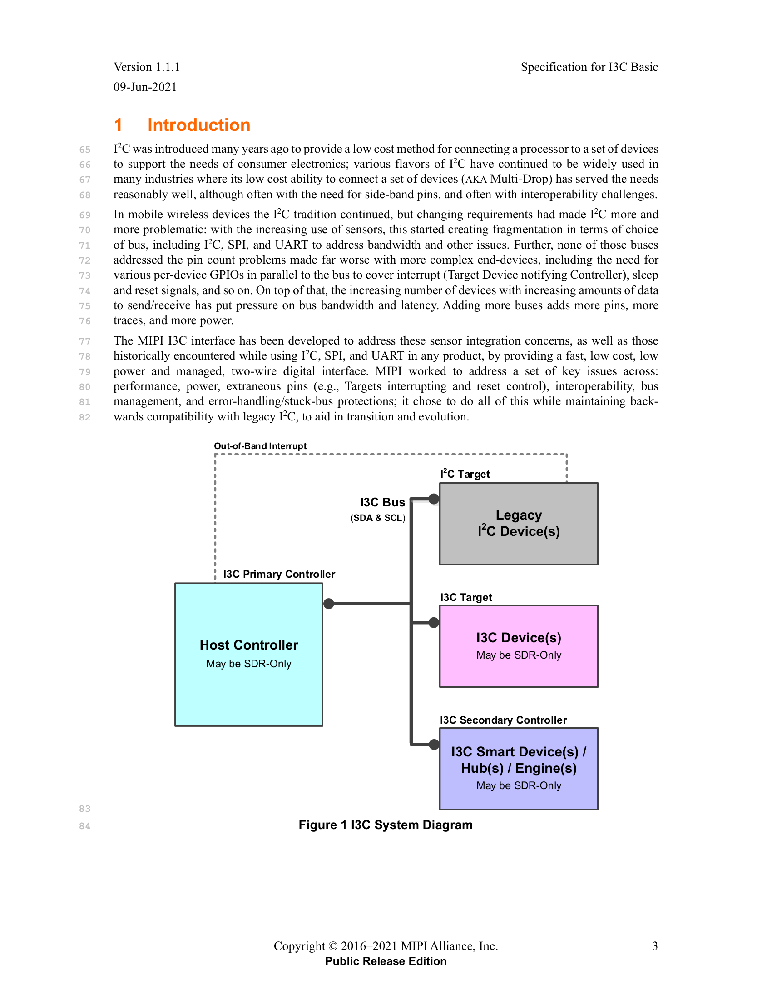

```
83
84
```

Copyright © 2016–2021 MIPI Alliance, Inc. **Public Release Edition** 

3 

Specification for I3C Basic 

Version 1.1.1 09-Jun-2021 

## **1.1 Scope** 

- **`85`** The following topics are in scope for this Specification: 

- **`86`** • I3C interface protocols and commands 

- **`87`** • Electrical specifications, such as timing and voltage levels 

- **`88`** • Support for specific classes of Devices (e.g., sensors) 

- **`89`** The following topics are out of scope for this Specification: 

- **`90`** • Mechanical, system, and implementation details within an I3C Device 

- **`91`** • ESD (Electrostatic Discharge) structures 

- **`92`** • System power management 

- **`93`** • Use case specific data or format definitions besides Bus management command codes 

## **1.2 I3C Purpose** 

**`94`** The I3C interface is intended to improve upon the features of the I[2] C interface _**[NXP01]**_ , preserving backward **`95`** compatibility. This Specification defines a standard Multi-Drop interface between Host processors and **`96`** peripheral Devices (e.g., sensors). 

- **`97`** Implementing the I3C Specification greatly increases the flexibility system designers have to supplant **`98`** incumbent interfaces (i.e., I[2] C, SPI, UART) and support a wide array of Devices of increasing complexity **`99`** and diversity in their system (e.g., sensor subsystem) and at as low a cost as possible. 

## **1.3 I3C Key Features** 

- **`100`** Two main concerns are paramount for the I3C interface: The use of as little energy as possible in transporting **`101`** data and control, while reducing the number of physical pins used by the interface. 

- **`102`** Therefore, the I3C interface features: 

- **`103`** • Two-wire serial interface up to 12.5 MHz using Push-Pull 

- **`104`** • Legacy I[2] C Device co-existence on the same Bus (with some limitations) 

- **`105`** • Dynamic Addressing while supporting Static Addressing for Legacy I[2] C Devices 

- **`106`** • Legacy I[2] C messaging 

- **`107`** • I[2] C-like Single Data Rate messaging (SDR) 

- **`108`** • Optional High Data Rate messaging Modes (HDR): 

- **`109`** • HDR-DDR for Double Data Rate 

- **`110`** • **NOT INCLUDED IN I3C BASIC:** HDR-TSL for Ternary Symbol Legacy-inclusive-Bus **`111`** (I[2] C Devices allowed) 

- **`112`** • **NOT INCLUDED IN I3C BASIC:** HDR-TSP for Ternary Symbol for Pure Bus (no I[2] C **`113`** Devices allowed) 

- **`114`** • HDR-BT for Bulk Transport 

- **`115`** • Multi-Drop a multitude of physically and virtually attached Devices 

- **`116`** • Multi-Controller capability 

- **`117`** • In-Band Interrupt support 

- **`118`** • Hot-Join support 

- **`119`** • **NOT INCLUDED IN I3C BASIC:** Synchronous Timing Support 

- **`120`** • Asynchronous Time Stamping (for Mode 0 only) 

- **`121`** • Grouped Addressing 

- **`122`** • Target Reset without additional wires 

- **`123`** • **NOT INCLUDED IN I3C BASIC:** Monitoring Device Early Termination 

Copyright © 2016–2021 MIPI Alliance, Inc. **Public Release Edition** 

4 

Version 1.1.1 09-Jun-2021 

Specification for I3C Basic 

- **`124`** • **NOT INCLUDED IN I3C BASIC:** Device to Device(s) Tunneling 

- **`125`** • Multi-Lane Data Transfer, for some HDR Modes included in I3C Basic 

- **`126`** _**Note:**_ 

- **`127`** _Multi-Lane Data Transfers for SDR Mode and HDR-DDR Mode is not included in I3C Basic_ 

**`128`** The I3C interface provides major efficiencies in Bus power while providing greater significant speed **`129`** improvements over I[2] C. _**Figure 2**_ through _**Figure 5**_ show different Bus Mode options that provide tradeoffs **`130`** for performance/power vs. target Device complexity. The following conditions were assumed for all **`131`** calculations: 

- **`132`** • Devices are in close vicinity: 

- **`133`** • Targets clustered close to Controller 

- **`134`** • No delay on the wires 

- **`135`** • Total leakage on each wire: 4 µA 

- **`136`** • Driver’s internal resistance: 90 Ω 

- **`137`** • Total Bus capacitance: 50 pF 

- **`138`** • Bus main clock: 12.5 MHz 

- **`139`** • V ~~DD~~ = 1.8V 

- ~~**`140`** • Pull-Up resistor on Open-Drain: 2833 Ω~~ 

- ~~**`141`** • Equal probability for 1 and 0 on data transmission~~ 

- ~~**`142`**~~ ~~_**Figure 2**_ shows the Raw and Effective single-Lane bit rates of the I3C Modes compared to I[2] C FM+ (1 MHz).~~ 

## **`143`** 

**==> picture [430 x 176] intentionally omitted <==**

**----- Start of picture text -----**<br>
40<br>35<br>30<br>25<br>20<br>15<br>10<br>5<br>0<br>HDR-TSP HDR-TSL HDR-DDR SDR I2C 1 MHz<br>RAW EFFECTIVE<br>**----- End of picture text -----**<br>


**==> picture [59 x 7] intentionally omitted <==**

**----- Start of picture text -----**<br>
144  Note:<br>**----- End of picture text -----**<br>


- **`145`** _HDR-TSP Mode and HDR-TSL Mode are not included in I3C Basic._ 

- **`146`** _To gain access to these HDR Modes, please contact MIPI Alliance._ 

**`147` Figure 2 I3C vs. I[2] C FM+ Data Blocks Bit Rates in Mbps (12.5 MHz Clock)** 

Copyright © 2016–2021 MIPI Alliance, Inc. **Public Release Edition** 

~~Specification for I3C Basic~~ 

~~Version 1.1.1 09-Jun-2021~~ 

~~**`148`**~~ ~~_**Figure 3**_ shows the effective single lane transfer time of 1 kB block of data for the I3C Modes compared to~~ ~~**`149`** I~~[2] ~~C FM+ (1 MHz).~~ 

```
150
```

**==> picture [430 x 180] intentionally omitted <==**

**----- Start of picture text -----**<br>
9<br>8<br>7<br>6<br>5<br>4<br>3<br>2<br>1<br>0<br>HDR-TSP HDR-TSL DDR SDR I2C 1 MHz<br>**----- End of picture text -----**<br>


## ~~**`151`**~~ ~~_**Note:**_~~ 

~~**`152`**~~ ~~_HDR-TSP Mode and HDR-TSL Mode are not included in I3C Basic._~~ 

**`153`** _To gain access to these HDR Modes, please contact MIPI Alliance._ ~~**`154` Figure 3 I3C vs. I**~~ **[2]** ~~**C FM+ 1 kB Effective Data Transfer Times in Ms See Errata 01, Item**~~ **1** 

**`155`** ~~_**Figure 4**_ shows the amount of Energy (mJ) consumed for an effective single lane of 1 kB block of data for~~ ~~**`156`** the I3C Modes compared to I[2] C FM+ (1 MHz).~~ 

## ~~**See Errata 01, Item 2**~~ 

**==> picture [430 x 184] intentionally omitted <==**

**----- Start of picture text -----**<br>
9<br>8<br>7<br>6<br>5<br>4<br>3<br>2<br>1<br>0<br>HDR-TSP HDR-TSL DDR SDR I2C 1 MHz<br>MIN AVG MAX<br>**----- End of picture text -----**<br>


~~**`157 158`**~~ ~~_**Note:**_~~ ~~**`159`**~~ ~~_HDR-TSP Mode and HDR-TSL Mode are not included in I3C Basic._~~ **`160`** _To gain access to these HDR Modes, please contact MIPI Alliance._ 

**`161` Figure 4 I3C vs. I2C FM+ Energy per 1 kB Effective Data Block, in mJ** 

~~Copyright © 2016–2021 MIPI Alliance, Inc.~~ **Public Release Edition** 

~~6~~ 

~~Version 1.1.1 09-Jun-2021~~ 

~~Specification for I3C Basic~~ 

**`162`** ~~_**Figure 5**_ shows the Effective Bitrates (Mbps) of the different I3C Modes over Multi-Lane.~~ 

**==> picture [430 x 154] intentionally omitted <==**

**----- Start of picture text -----**<br>
100<br>80<br>60<br>40<br>20<br>0<br>HDR-BT HDR-TSP HDR-DDR SDR<br>SINGLE LANE DUAL LANE QUAD LANE<br>**----- End of picture text -----**<br>


~~**`163`**~~ **`164`** _**Note:**_ **`165`** _Multi-Lane support for HDR-TSP Mode and SDR Mode are not included in I3C Basic._ **`166`** _To gain access to these capabilities, please contact MIPI Alliance._ 

**`167` Figure 5 I3C Multi-Lane Effective Bit Rates, in Mbps** 

Copyright © 2016–2021 MIPI Alliance, Inc. **Public Release Edition** 

7 

Specification for I3C Basic 

Version 1.1.1 09-Jun-2021 

## **2 Terminology** 

## **2.1 Use of Special Terms** 

**`168`** The MIPI Alliance has adopted Section 13.1 of the _IEEE Standards Style Manual_ , which dictates use of the **`169`** words ‘shall’, ‘should’, ‘may’, and ‘can’ in the development of documentation, as follows: 

**`170`** The word _shall_ is used to indicate mandatory requirements strictly to be followed in order **`171`** to conform to the Specification and from which no deviation is permitted ( _shall_ equals _is_ **`172`** _required to_ ). 

**`173`** The use of the word _must_ is deprecated and shall not be used when stating mandatory **`174`** requirements; _must_ is used only to describe unavoidable situations. 

**`175`** The use of the word _will_ is deprecated and shall not be used when stating mandatory **`176`** requirements; _will_ is only used in statements of fact. 

**`177`** The word _should_ is used to indicate that among several possibilities one is recommended **`178`** as particularly suitable, without mentioning or excluding others; or that a certain course of **`179`** action is preferred but not necessarily required; or that (in the negative form) a certain **`180`** course of action is deprecated but not prohibited ( _should_ equals _is recommended that_ ). 

- **`181`** The word _may_ is used to indicate a course of action permissible within the limits of the **`182`** Specification ( _may_ equals _is permitted to_ ). 

**`183`** The word _can_ is used for statements of possibility and capability, whether material, **`184`** physical, or causal ( _can_ equals _is able to_ ). 

**`185`** All sections are normative, unless they are explicitly indicated to be informative. 

**`186`** All quoted voltage and frequency values in the informative sections represent their typical values. 

## **2.2 Definitions** 

**`187` 1-Wire:** A communication bus protocol. 

- **`188` ACK:** Short for ‘acknowledge’. See also **NACK** . 

**`189` Active Controller:** The I3C Device that presently has control (i.e., the Controller Role) of the I3C Bus. 

**`190` Address Arbitration:** Process for determining arbitrated Addresses to resolve contention. 

- **`191` Address:** A set of bits designating a Device or the location of a register. 

- **`192` Arbitrable:** Subject to decision by Arbitration. 

- **`193` Arbitration:** If two Devices start transmission at the same time, then Arbitration is required to determine **`194`** Bus control. Arbitration could also be required during a Target transmission if a Controller addresses multiple **`195`** Targets. 

**`196` Bit Banged:** When GPIOs are manually changed by software to follow a protocol. For example, software **`197`** could operate in I[2] C Controller mode quite easily by writing the SCL pin and reading/writing the SDA pin in **`198`** between. 

- **`199` Bridge Device:** Device on the I3C Bus that allows conversion from the native I3C Bus protocol to another **`200`** protocol (such as SPI, UART etc.). 

- **`201` Broadcast:** A command intended for multiple Target Devices, using the Broadcast Address 7’h7E. 

- **`202` Bus:** The physical and logical implementation of the SCL and SDA lines. 

- **`203` Bus Available Condition:** A period during which the Bus Free Condition, after a STOP and before a START, **`204`** is sustained continuously for a duration of at least tAVAL (see _**Table 86**_ and _**Section 5.1.3.2.2**_ ). 

Copyright © 2016–2021 MIPI Alliance, Inc. **Public Release Edition** 

8 

Version 1.1.1 09-Jun-2021 

Specification for I3C Basic 

- **`205` Bus Free Condition:** A period after a STOP and before a START with a duration of at least tCAS (see _**Table**_ **`206`** _**86**_ ) for a Pure Bus, and at least tBUF (see _**Table 85**_ , _**Table 86**_ , and _**Section 5.1.3.2**_ ) for a Mixed Bus. 

- **`207` Bus Idle Condition:** A period during which the Bus Free Condition, after a STOP and before a START, is **`208`** sustained continuously for a duration of at least tIDLE (see _**Table 86**_ and _**Section 5.1.3.2.3**_ ). 

- **`209` Bus Turnaround:** When a transmitting Device sends a command, and then the receiving Device takes over **`210`** the I3C Bus in order to respond. 

- **`211` Characteristics:** Quantification of a Device’s available features and capabilities. 

- **`212` Clock to Data Turnaround Time:** The time duration between reception of an SCL edge and the start of **`213`** driving an SDA change. See tSCO in _**Table 87**_ . 

- **`214` Coding:** See Data Transfer Coding. 

- **`215` Controller:** An I3C Device that is capable of controlling the I3C Bus. 

- **`216`** _**Note:**_ 

- **`217`** _In previous versions of the I3C and I3C Basic Specifications, a Controller Device was called a “Master_ **`218`** _Device”. This version of the I3C Basic Specification (as well as the I3C v1.1.1 Specification) has_ **`219`** _deprecated the term “Master”, and now uses the updated normative term “Controller.” Please note_ **`220`** _that the technical definition of such a Device, and its Role on an I3C Bus, are unchanged._ 

- **`221`** _Unless specified otherwise, a Controller as a Device (or its Role) is a generic term between I3C Basic_ **`222`** _and I3C. Such a Device may comply with either this I3C Basic Specification or a compatible version_ **`223`** _of the full I3C Specification_ _**[MIPI08]** in cases where this distinction is not technically pertinent._ 

- **`224` Controller Role:** Control of the I3C Bus, in a Controller role. See **Active Controller** . 

- **`225` Controller Role Request:** A method whereby a Controller-capable Device (i.e., a Secondary Controller) **`226`** requests to become the next Active Controller of the Bus, using a form of interrupt request (i.e., In-Band **`227`** Interrupt). 

- **`228` CRC-5:** Cyclic Redundancy Check with fifth-order polynomial length: 

- **`229`** CRC-5 = X[5] + X[2] + X[0] 

- **`230` CRC-16:** Cyclic Redundancy Check with sixteenth-order polynomial length, as defined by ANSI and used **`231`** in USB (also known as CRC-16-IBM): 

- **`232`** 

CRC-16 = X[16 ] + X[15 ] + X[2 ] + 1 

- **`233` CRC-32:** Cyclic Redundancy Check with thirty-second-order polynomial length: 

- **`234`** CRC-32 = X[32] + X[26] + X[23] + X[22] + X[16] + X[12] + X[11] + X[10] + X[8] + X[7] + X[5] + X[4] + X[2] + X + 1 

- **`235` Data Transfer Coding:** A specific contract for extending an I3C Mode to use additional Data Lanes (i.e., **`236`** Multi-Lane). The contract may include changes to the framing, flow, and data bit/byte packing of the **`237`** structured protocol elements. In some sections of this Specification related to Multi-Lane, a Data Transfer **`238`** Coding may also be referred to as simply a Coding. 

- **`239` Device:** A Controller or Target. 

- **`240` Device ID:** Defines a Device’s characteristic or function within a sensor system. 

- **`241` Dynamic Address:** A Device Address that is assigned or allocated during initialization of the Bus. Usually **`242`** occurs after power up. 

- **`243` Failsafe:** An I3C Device Bus pad is considered Failsafe if its leakage does not increase when it is unpowered. **`244`** A pad may be unpowered because the Device is unpowered, because its IO rail is unpowered or clamped, or **`245`** both. Failsafe only matters for some Hot-Join Devices. 

- **`246` Flow Element:** A structured protocol element, such as a Word or a Block, used as portion of the framing of 

- **`247`** a given flow to indicate various phases of data transmission to define the Frame, as well as other necessary **`248`** conditions such as Bus Turnaround. 

Copyright © 2016–2021 MIPI Alliance, Inc. **Public Release Edition** 

Specification for I3C Basic 

Version 1.1.1 09-Jun-2021 

- **`249` Frame:** A Frame begins with a START, followed by the Address of the Target(s), Data, and finally a STOP. **`250` High:** Defines a signal level that is a logical ‘1’. 

- **`251` High Data Rate (HDR):** High Data Rate Modes that achieve higher speed by transferring data on both clock **`252`** edges. 

- **`253` High-Keeper:** A weak Pull-Up type Device used when SDA, and sometimes SCL, is in High-Z with respect **`254`** to all Devices. 

- **`255` Host:** Hardware and software that provides the core functionality of a mobile device. 

- **`256` Hot-Join:** Targets that join the Bus after it is already started, whether because they were not powered 

- **`257`** previously or because they were physically inserted into the Bus; the Hot-Join mechanism allows the Target **`258`** to notify the Controller that it is ready to get a Dynamic Address. 

- **`259` Hot-Join Request:** A method whereby a Target joins the Bus and requests a Dynamic Address from the **`260`** Controller, using a special Interrupt request with a reserved I3C Address. 

- **`261` Hot-Joining Device:** A Device that is currently attempting to join the Bus (i.e., as a Target or Secondary **`262`** Controller) using the Hot-Join Request. 

- **`263` In-Band Interrupt (IBI):** A method whereby a Target Device emits its Address into the arbitrated Address **`264`** header on the I3C Bus to notify the Controller of an interrupt. 

- **`265` I[2] C Device:** A Controller or Target that meets the requirements of the I[2] C Specification _**[NXP01]**_ . 

- **`266` I3C Basic Device:** A Controller or Target that meets the requirements of this I3C Basic specification (not the 

- **`267`** full I3C Specification _**[MIPI08]**_ ). That is, an I3C Basic Device supports only the I3C Basic core capabilities 

- **`268`** plus any optional features and capabilities defined in this I3C Basic Specification; it does not support any **`269`** optional features defined only in the full I3C Specification. 

- **`270`** _**Note:**_ 

- **`271`** _An I3C Basic Device is defined to be interoperable with I3C with respect to the core capabilities that_ **`272`** _I3C and I3C Basic share, and with respect to I3C Basic’s optional features and capabilities._ 

- **`273`** _See the_ _**Preface** for an overview of I3C v1.1.1 functions not included in I3C Basic and how I3C Basic_ 

- **`274`** _Devices work with I3C v1.x Devices; see also other sections in this Specification that define the_ **`275`** _specific features._ 

- **`276` I3C Basic Controller:** An I3C Basic Device that is Controller-capable, i.e., that can hold the Controller Role **`277`** of an I3C Bus. See also Controller and I3C Basic Device. 

- **`278` I3C Controller:** See Controller. 

- **`279` I3C Device:** A Controller or Target that meets the requirements of either this I3C Basic Specification, or of 

- **`280`** a version of the full I3C Specification that is interoperable with I3C Basic (e.g., I3C v1.1.1 _**[MIPI08]**_ ). 

- **`281`** _**Note:**_ 

- **`282`** _In this Specification, I3C Device typically describes compatibility with I3C in a generic sense. An I3C_ **`283`** _Device does not always imply an I3C Basic Device, since an I3C Device can support either I3C or I3C_ **`284`** _Basic where such distinctions are not technically pertinent. However, in cases where an I3C Bus_ **`285`** _contains both I3C Basic Devices and other I3C Devices that comply with the full I3C Specification and_ **`286`** _that also use features or capabilities that are not included in I3C Basic, there might be restrictions on_ **`287`** _which features or capabilities can be used with such an I3C Basic Device, and certain compatibility_ **`288`** _concerns should be understood and addressed. See the_ _**Preface** Prefacefor an overview._ 

- **`289` I3C Master:** Deprecated term, see Controller. 

- **`290` I3C Slave:** Deprecated term, see Target. 

- **`291` I3C Target:** See Target. 

- **`292` Legacy I[2] C:** I3C maintains the industry standard architecture of I[2] C and supports existing I[2] C Target Devices. **`293`** I3C does not support I[2] C Bus Controllers. 

Copyright © 2016–2021 MIPI Alliance, Inc. **Public Release Edition** 

10 

Version 1.1.1 09-Jun-2021 

Specification for I3C Basic 

- **`294`** 

## _**Note:**_ 

- **`295`** _A Legacy I[2] C “Target” Device is defined to have the same meaning as an I[2] C “Slave” Device, as_ **`296`** _defined in the current version of the I[2] C Specification_ _**[NXP01]** ._ 

- **`297` Low:** Defines a signal level that is a logical ‘0’. 

- **`298` Master:** Deprecated term, see Controller. 

- **`299` Message:** A packetized communication between Devices. 

- **`300` Minimal Bus:** An I3C Bus with one Controller Device (potentially with reduced functionality), and one 

- **`301`** active Target Device with a fixed and reserved Target Address value of 7’h01. Additional Read-only Target **`302`** Devices may optionally also be present in a Minimal Bus, but there can be no additional Read-Write Target **`303`** Devices. 

- **`304` MIPI Manufacturer ID:** A two-byte/16-bit unique identifier for a vendor of a MIPI compliant Device **`305`** _**[MIPI01]**_ . 

- **`306` Mixed Bus:** An I3C Bus topology with both I[2] C and I3C Devices present on the I3C Bus. May be either a **`307`** Mixed Fast Bus or a Mixed Slow/Limited Bus. 

- **`308` Mixed Fast Bus:** I3C Bus topology with both I[2] C and I3C Devices present on the I3C Bus, where the I[2] **`309`** Devices have a true I[2] C 50 ns Spike Filter on the SCL line. 

- **`310` Mixed Slow/Limited Bus:** I3C Bus topology with both I[2] C and I3C Devices present on the I3C Bus, where **`311`** the I[2] C Devices do not have a true I[2] C 50 ns Spike Filter on the SCL line. 

- **`312` Mode:** Distinguishes different data transfer methods used in I3C and I3C Basic, including Legacy I[2] C Mode, 

- **`313`** Single Data Rate Mode (SDR), High Data Rate Mode (HDR), Dual Data Rate Mode (HDR-DDR), and HDR 

- **`314`** Bulk Transport Mode (HDR-BT). Note that I3C Basic does not include support for the HDR Ternary Modes 

- **`315`** that are defined in the full I3C Specification: Ternary Symbol Legacy Mode (HDR-TSL) and Ternary Symbol **`316`** for Pure Bus Mode (HDR-TSP). 

- **`317` Multi-Controller:** Multiple Bus Controllers present on the Bus. Used when multiple nodes on the Bus need **`318`** to initiate a transfer. 

- **`319` Multi-Drop:** A Bus that communicates through a process of Arbitration to determine which Device sends **`320`** information at any point. The other Devices listen for data they are intended to receive. 

- **`321` Multi-Lane:** A method of using more physical wires (i.e., additional Data Lanes along with the SDA Lane) **`322`** to achieve higher data transfer rates in various I3C Modes. 

- **`323` NACK** : Short for “not acknowledge”, which means No ACK was asserted. See also **ACK** . 

- **`324` Offline Capable:** An Offline Capable Device is able to disconnect from the physical I3C Bus and/or is able 

- **`325`** to ignore I3C traffic on the I3C Bus. A Device’s Offline capability is one of the capabilities reflected in its **`326`** Bus Characterization Register. 

- **`327` Open Drain:** High-Z with an active Pull-Down. Typically used in conjunction with a passive Pull-Up. 

- **`328` Park:** Logic level High set by the Controller (or Target on Read) before turning around the Bus to allow the **`329`** other to drive to Logic level Low or not (will be held High by weak Pull-Up). 

- **`330` Peripheral:** The portion of the logic of a Device that implements the I3C Bus protocol, usually including 

- **`331`** any FIFOs or other buffers, and an interface to the rest of the system, such as an internal bus to a processor. 

- **`332` Preamble** : The bits preceding the data Words in HDR-DDR. 

- **`333` Primary Controller:** The Controller-capable I3C Device that initializes the I3C Bus and performs **`334`** configuration of all Target Devices. It acts as the authority for the Bus in its initial state, and becomes the **`335`** first Active Controller once the Bus is configured. 

- **`336` Pull-Down:** Active mechanism used to pull the Bus to a logical Low state. 

- **`337` Pull-Up:** Mechanism used to pull the Bus to a logical High state. The mechanism may be either active or **`338`** passive. 

Copyright © 2016–2021 MIPI Alliance, Inc. **Public Release Edition** 

Specification for I3C Basic 

Version 1.1.1 09-Jun-2021 

- **`339` Pure Bus:** A Bus topology with only I3C Devices present. No I[2] C Devices are permitted on a Pure Bus. **`340` Push-Pull:** Active Pull-Down and active Pull-Up on output driver. 

- **`341` Read Segment:** A series of Flow Elements that comprise a Read transaction addressing a Target, within the **`342`** framing of a given HDR Mode. Usually part of a Direct SET CCC flow. 

- **`343` Repeated START:** Two or more instances of a START in a row without an intervening STOP. A Repeated 

- **`344`** START is used in circumstances where the Controller wishes to continue communicating on the I3C Bus **`345`** without having to first generate a STOP. In this Specification, a Repeated START is abbreviated as ‘Sr’. This **`346`** is equivalent to Repeated START in I[2] C _**[NXP01]**_ . 

- **`347` Route:** Path through a Device connecting two different I3C Buses. A given Device may contain one or more **`348`** Routes. 

- **`349` Routing Device:** Device on the I3C Bus that allows conversations between two or more different I3C Buses 

- **`350`** through integrated logic on the given Device. The Routing Device (as distinct from a Bridge Device) **`351`** buffers/queues the transactions, causing the Device to be non-transparent. 

- **`352` SDR-Only:** An SDR-Only Device supports only SDR Mode, i.e., does not support HDR Mode. 

- **`353` Secondary Controller:** A Controller-capable I3C Device that initially acts as a Target, but can also accept **`354`** the Controller Role from any Active Controller (including the Primary Controller). Once a Secondary **`355`** Controller accepts the Controller Role it becomes the new Active Controller, and may then pass the Controller **`356`** Role along: either back to the previous Active Controller, or on to any other Controller-capable Device **`357`** present on the I3C Bus. 

- **`358` Segment:** A series of Flow Elements that comprise either a Read or Write transaction addressing a Target or **`359`** Group, within the framing of a given HDR Mode. Usually part of a Direct CCC flow. 

- **`360` Single Data Rate (SDR):** Single Data Rate transfers data on only one edge of the clock. 

- **`361` Slave:** Deprecated term; see **Target** . 

- **`362` Spike Filter:** A filter that removes SCL (and SDA) spikes shorter than 50 ns in duration. See Input Filter (tSP **`363`** parameter) in the I[2] C Specification _**[NXP01]**_ . Also known as a glitch filter. 

- **`364` Stall:** The act of the I3C Controller holding the SCL line Low under specific transitory conditions. 

- **`365` START:** START is the I3C Bus condition of a High to Low transition on the SDA line while the SCL line **`366`** remains High. In this Specification, a START is abbreviated as ‘S’. 

- **`367` START Request:** A method for a Target to force the Controller to issue a START on an idled I3C Bus. 

- **`368` Static Address:** A Device Address that is fixed and cannot be changed. 

- **`369` STOP:** STOP is the I3C Bus condition of a Low to High transition on the SDA line while the SCL line **`370`** remains High. In this Specification, a STOP is abbreviated as ‘P’. 

- **`371` Swizzle:** To swap or interleave bits. 

- **`372` T-Bit:** Transition bit, an alternative to the ACK/NACK mechanism. 

- **`373` Target:** A Target Device can only respond to either Common or individual commands from a Controller. **`374`** _**Note:**_ 

- **`375`** _In previous versions of the I3C Basic Specification (as well as some previous versions of the full_ **`376`** _I3C Specification), a Target Device was called a “Slave” Device. This version of the I3C Basic_ **`377`** _Specification has deprecated the term “Slave” and now uses the updated normative term “Target”._ **`378`** _Please note that the technical definition of such a Device, and its Role on an I3C Bus, are_ **`379`** _unchanged. Unless specified otherwise, a Target as a Device (or its Role) is a generic term_ **`380`** _between I3C Basic and I3C. Such a Device may comply with either this I3C Basic Specification or_ **`381`** _a compatible version of the full I3C Specification_ _**[MIPI08]** in cases where this distinction is not_ **`382`** _technically pertinent._ 

- **`383` Target Reset:** The Target Reset mechanism allows the Controller to request a reset of specific Target Devices, **`384`** including: reset of the I3C Peripheral, reset of the whole Device, and wake from deepest sleep. Target Reset 

Copyright © 2016–2021 MIPI Alliance, Inc. **Public Release Edition** 

12 

Version 1.1.1 09-Jun-2021 

Specification for I3C Basic 

- **`385`** uses a specialized pattern of Bus activity (specifically, an extension of the HDR Exit pattern) that cannot **`386`** occur in any other way in the I3C protocol. 

- **`387` Termination Marker:** A Flow Element or other unique HDR Pattern that signifies the end of a specific Flow **`388`** Element, a Segment, or the data message sent by the Controller as part of a Broadcast CCC flow. 

- **`389` Ternary Mode:** These Modes are defined in the full I3C Specification, and I3C Basic does not include **`390`** support for them: HDR-TSP (Ternary Symbol for Pure Bus) Mode and HDR-TSL (Ternary Symbol Legacy) **`391`** Mode. 

- **`392`** 

   - **Timestamping:** The act of determining and assigning the time at which an event occurred. 

- **`393` Timing Control:** Methods of exchanging and controlling system timing information, with the intent to **`394`** synchronize and/or Timestamp I3C Bus Devices and events. See _**Section 5.1.8**_ . 

- **`395` Virtual Target:** A physical Device that represents multiple I3C Targets, often implemented as multiple Target **`396`** Devices sharing a common set of I3C pads. Additionally, there can be multiple Virtual Targets inside a single 

- **`397`** Device or a Bridge/Hub that manages the Bus connection. See also _**Table 5**_ , _**Section 5.1.2.1.2**_ , and **`398`** _**Section 5.1.9.3.19**_ . 

- **`399` Virtual Target Detect Operation:** A method for determining which Virtual Targets share the same Peripheral **`400`** logic within a particular I3C Device. 

- **`401`** 

   - **Word:** Transmission containing 16 payload bits and two parity bits. 

- **`402` Write Segment:** A series of Flow Elements that comprise a Write transaction addressing a Target or Group, **`403`** within the framing of a given HDR Mode. Usually part of a Direct SET CCC flow. 

## **2.3 Abbreviations** 

- **`404`** ACK Acknowledge 

- **`405`** e.g. For example (Latin: exempli gratia) 

- **`406`** High-Z An output driver that is set to high impedance mode (cannot source or sink current) 

- **`407`** i.e. That is (Latin: id est) 

- **`408`** NACK Not Acknowledge 

- **`409`** P STOP 

- **`410`** PHY Physical Layer 

- **`411`** S START 

- **`412`** Sr Repeated START 

- **`413`** T Transition Bit 

Copyright © 2016–2021 MIPI Alliance, Inc. **Public Release Edition** 

13 

Specification for I3C Basic 

Version 1.1.1 09-Jun-2021 

||**2.4**|**Acronyms**|**Acronyms**|
|---|---|---|---|
|**`414`**|AXI||Advanced eXtensible Interface|
|**`415`**|BCR||Bus Characteristics Register|
|**`416`**|CCC||Common Command Code|
|**`417`**|CRC||Cyclic Redundancy Check|
|**`418`**|CRR||Controller Role Request|
|**`419`**|D2DT||Device to Device(s) Tunneling|
|**`420`**|DCR||Device Characteristics Register|
|**`421`**|DDR||Double Data Rate|
|**`422`**|ESD||Electro Static Discharge|
|**`423`**|FSM||Finite State Machine|
|**`424`**|HDR||High Data Rate|
|**`425`**|HDR-DDR||HDR Double Data Rate Mode|
|**`426`**|IBI||In-Band Interrupt|
|**`427`**|IMU||Inertial Measurement Unit|
|**`428`**|LCR||Legacy Characteristics Register|
|**`429`**|LIN||Local Interconnect Network|
|**`430`**|LSB||Least Significant Byte|
|**`431`**|LSb||Least Significant Bit|
|**`432`**|Mbps||Megabits per second|
|**`433`**|MHz||Mega Hertz|
|**`434`**|MID||MIPI Manufacturer Identification**_[MIPI01]_**|
|**`435`**|MSB||Most Significant Byte|
|**`436`**|MSb||Most Significant Bit|
|**`437`**|NVMEM||Non-Volatile Memory|
|**`438`**|OCP||Open Core Protocol|
|**`439`**|OD||Open Drain|
|**`440`**|SCL||Serial Clock|
|**`441`**|SDA||Serial Data|
|**`442`**|SDR||Single Data Rate|
|**`443`**|SPI||Serial Peripheral Interface|
|**`444`**|SRFF||State Retention Flip-Flop|
|**`445`**|TSL||Ternary Symbol Legacy|
|**`446`**|TSP||Ternary Symbol for Pure Bus (no I2C Devices)|
|**`447`**|UART||Universal Asynchronous Receiver Transmitter|


Copyright © 2016–2021 MIPI Alliance, Inc. **Public Release Edition** 

14 

Version 1.1.1 09-Jun-2021 

Specification for I3C Basic 

## **3 References** 

## **3.1 Normative References** 

- **`448`** [MCTP01] _MCTP I3C Transport Binding Specification_ , version 1.0 or newer, DMTF, In Press. **`449`** [MIPI01] MIPI Alliance, Inc., “MIPI Alliance Manufacturer ID Page”, https://mid.mipi.org, last **`450`** accessed 9 June 2021. **`451`** [MIPI02] MIPI Alliance, Inc., “Current I3C Device Characteristic Register (DCR) Assignments”, **`452`** https://www.mipi.org/MIPI_I3C_device_characteristics_register, last accessed **`453`** 9 June 2021. **`454`** [MIPI04] _MIPI Alliance Specification for Debug for I3C_ , version 1.0, MIPI Alliance, Inc., **`455`** 21 April 2020. **`456`** [MIPI05] MIPI Alliance, Inc., “I3C Mandatory Data Byte (MDB) Assignments”, **`457`** https://www.mipi.org/MIPI_I3C_mandatory_data_byte_values_public, last accessed **`458`** 9 June 2021. **`459`** [MIPI07] MIPI Alliance, Inc., “I3C SETBUSCON Table”, **`460`** https://www.mipi.org/MIPI_I3C_bus_context_byte_values_public, last accessed **`461`** 9 June 2021. **3.2 Informative References** 

- **`462`** [MIPI03] _System Integrators Application Note for MIPI I3C v1.0 and I3C Basic v1.0_ , App Note **`463`** version 1.0, MIPI Alliance, Inc., 8 December 2018 (approved 8 December 2018). **`464`** [MIPI06] _MIPI Alliance Application Notes for MIPI I3C v1.1.1_ , App Note version 1.0, **`465`** MIPI Alliance, Inc., In Press. **`466`** [MIPI08] _MIPI Alliance Specification for I3C® (Improved Inter Integrated Circuit)_ , version 1.1.1, **`467`** MIPI Alliance, Inc., 11 June 2021. **`468`** [NXP01] UM10204, _I[2] C-bus specification and user manual_ , Rev. 6, NXP Semiconductors N.V., **`469`** 4 April 2014. **`470`** [USB01] _Universal Serial Bus 3.1 Specification_ , Revision 1.0, **`471`** http://www.usb.org/developers/docs/usb_31_072715.zip, Hewlett-Packard Company **`472`** _et al._ , 26 July 2013. 

Copyright © 2016–2021 MIPI Alliance, Inc. **Public Release Edition** 

15 

Specification for I3C Basic 

Version 1.1.1 09-Jun-2021 

This page intentionally left blank. 

Copyright © 2016–2021 MIPI Alliance, Inc. **Public Release Edition** 

16 

Version 1.1.1 09-Jun-2021 

Specification for I3C Basic 

## **4 Technical Overview (Informative)** 

**`473`** This Section generally describes the I3C Bus, the I3C interface, and I3C Controller and Target Devices. 

**`474`** I3C is a two-wire bidirectional serial Bus, optimized for multiple Target Devices (e.g., sensors) and controlled **`475`** by only one I3C Controller Device at a time. I3C is backward compatible with many Legacy I[2] C Devices, **`476`** but I3C Devices also support significantly higher speeds, new communication Modes, and new Device roles, **`477`** including an ability to change Device Roles over time (i.e., the initial Controller can cooperatively pass the **`478`** Controller role to another I3C Device (i.e., Secondary Controller) on the Bus, if the second I3C Device **`479`** supports that feature). 

**`480`** I3C Basic is a subset of I3C, and is defined to be interoperable with I3C. In this I3C Basic Specification, the **`481`** definition of I3C includes: 

- **`482`** • Support for many Legacy I[2] C Target Devices and Messages 

- **`483`** • **I3C Single Data Rate (SDR) Mode:** New I3C enhanced version of the I[2] C protocol supporting **`484`** private Messages, and adding two kinds of standard built-in Messages: 

```
485
```

```
486
```

   - **Broadcast Messages** , which are sent to all I3C Targets on the Bus 

   - **Direct Messages** , which are addressed to specific Targets 

- **`487`** • **I3C High Data Rate (HDR) Modes:** Additional optional Modes that add significant functionality: 

- **`488`** • **Dual Data Rate (HDR-DDR) Mode:** Uses same signaling as SDR Mode (i.e., is not significantly **`489`** different from the I[2] C protocol), but runs at about 2x the speed of SDR 

- **`490`** • **Bulk Transport (HDR-BT) Mode:** Gives the highest possible throughput using a **`491`** Clock-and-Data transmission model leveraging dual data rate over single-, dual-, or quad- **`492`** Lane configurations 

**`493`** Readers interested in a detailed, low-level introduction to the operation of the I3C Bus for each of the defined **`494`** I3C Modes are encouraged to study and compare the example waveforms shown in informative _**Annex C**_ . 

Copyright © 2016–2021 MIPI Alliance, Inc. **Public Release Edition** 

17 

Specification for I3C Basic 

Version 1.1.1 09-Jun-2021 

## **4.1 I3C Fundamental Principles** 

**`495`** I3C supports several communication formats, all sharing a two-wire interface. 

**`496`** The two wires are designated SDA and SCL: 

## **`497`** 

   - **SDA** (Serial Data) is a bidirectional data pin 

- **`498`** • **SCL** (Serial Clock) can be either a clock pin or a Bi-directional data pin while in certain HDR **`499`** Modes 

- **`500`** An I3C Bus supports the mixing of various Message types: 

- **`501`** 1. I[2] C-like SDR Messages, with SCL clock speeds up to 12.5 MHz 

- **`502`** 2. Broadcast and Direct Common Command Code (CCC) Messages that allow the Controller to **`503`** communicate to all or one of the Targets on the I3C Bus, respectively 

- **`504`** 3. HDR Mode Messages, which achieve higher data rates per equivalent clock cycle 

## **`505`** 

   4. I[2] C Messages to Legacy I[2] C Targets 

- **`506`** 5. Target-initiated START Request to the Controller, for example to send an In-Band Interrupt or to **`507`** request the Controller role 

## **`508`** 

```
509
510
```

An example traffic pattern on the I3C Bus is shown in _**Figure 6**_ . 

**==> picture [387 x 49] intentionally omitted <==**

**----- Start of picture text -----**<br>
SDR (I [2] C-Like) HDR: In-Band<br>One or more, R/W One or more  Interrupt HDR<br>(Controller to Target) Commands (Initiated by Target)<br>**----- End of picture text -----**<br>


**Figure 6 Example of Data Traffic on the I3C Bus** 

Copyright © 2016–2021 MIPI Alliance, Inc. **Public Release Edition** 

18 

Version 1.1.1 09-Jun-2021 

Specification for I3C Basic 

- **`511`** _**Figure 7**_ illustrates how I3C communication is initiated: 

- **`512`** • All I3C communication occurs within a Frame. The Frame begins with a START, followed by one **`513`** or more transfers, and a STOP. 

- **`514`** • For the HDR Modes that are either supported in I3C Basic, or are tolerated by I3C Basic Devices: 

- **`515`** • First the dedicated Broadcast I3C Address (7’h7E) is issued to all Targets on the I3C Bus. 

- **`516`** • Then one of the Enter HDR CCCs is issued, indicating that the Controller is entering an HDR **`517`** Mode. Each HDR Mode has its own EnterHDR CCC. 

- **`518`** • This is followed by one or more HDR transfers. 

- **`519`** • HDR Mode is ended by using the HDR Exit Pattern protocol. 

**==> picture [362 x 478] intentionally omitted <==**

**----- Start of picture text -----**<br>
STOP Bus Free LEGEND<br>Continuing Process<br>End to START or STOP<br>START START End of Message<br>Including<br>NACK End of Message<br>Repeated START<br>Bus at SDR Speed<br>Bus at High Speed<br>Legacy I [2] C I3C SDR I3C SDR  I3C SDR I3C HDR<br>Message w/o CCC [(2)] Broadcast  Direct CCC Mode<br>CCC [(1)]<br>7'h7E  Entry 7'h7E  7'h7E  7'h7E<br>Static Addr, R<br>(broadcast),  W,  (broadcast),  W,  (broadcast),  W,  (broadcast),  W,<br>or W, ACK ACK ACK ACK ACK<br>Repeated<br>Data, ACK START CCC Broadcast CCC Direct CCC Enter HDR<br>Dynamic Addr,<br>ACK R or W, ACK Defining<br>Continue Optional Data,  Byte<br>T<br>Repeated  HDR Mode<br>Data, T Continue START<br>until<br>HDR Exit<br>Pattern<br>Dynamic Addr,<br>Continue R or W, ACK<br>Data, T<br>Continue<br>Must use Repeated START,<br>STOP or Repeated START 7'h7E to exit Direct CCC<br>framing before SDR messages<br>START (1) Not shown: Dynamic Address Assignment<br>process (ENTDAA CCC)<br>STOP (2) Not shown: May omit 7'h7E, Repeated START<br>for subsequent SDR Private Writes/Reads<br>Next Target<br>2C NACK<br>2C NACKI I3C NACK Done Entry<br>Done, I<br>Done Exit to STOP<br>**----- End of picture text -----**<br>


**Figure 7 I3C Communication Flow** 

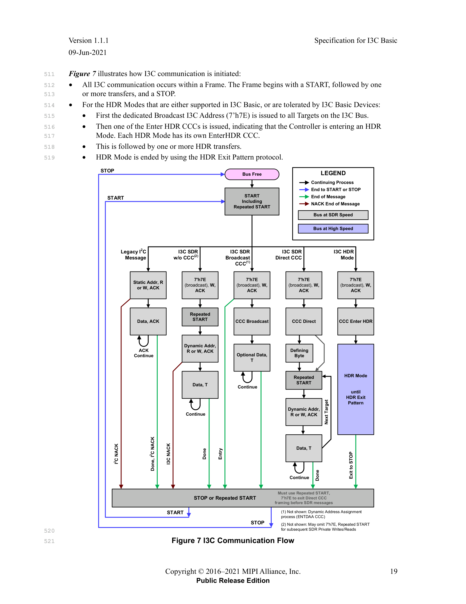

```
520
521
```

Copyright © 2016–2021 MIPI Alliance, Inc. **Public Release Edition** 

19 

Specification for I3C Basic 

Version 1.1.1 09-Jun-2021 

- **`522`** I3C is based on a Frame encapsulation approach. A Frame includes a Data Payload. The transfer protocol for **`523`** the Data Payload is either SDR or HDR. Frames are bordered by I[2] C-like Bus management. 

- **`524`** The I3C Frame always includes at least the START, the Header, the Data, and the STOP. 

- **`525`** The Header following a START allows for Bus Arbitration. The Controller uses the Header to address Target 

- **`526`** Device(s). I3C Target Devices(s) may use the Header Arbitration for multiple purposes: for In-Band Interrupt, **`527`** for Hot-Join, and for Secondary Controller functionality. 

- **`528`** Common Command Codes (CCCs) are used to enter the High Data Rate (HDR) Modes. It is important to **`529`** understand that I3C Bus activity for the HDR Message does not follow the Legacy I[2] C format. Supported 

- **`530`** HDR protocols use the SDA line and the SCL line to transfer commands, data, and other control information, **`531`** using alternate formats specified in _**Section 5.2**_ . 

- **`532`** I3C allows only one Controller to have control of the I3C Bus at a time. Mechanisms for handoff of the **`533`** Controller role from one Device to another Device are provided. 

Copyright © 2016–2021 MIPI Alliance, Inc. **Public Release Edition** 

20 

Version 1.1.1 09-Jun-2021 

Specification for I3C Basic 

## **4.2 I3C Controller and Target Devices** 

**`534`** A given I3C Bus always has one Controller and one or more Targets. This Section generally describes I3C **`535`** Controller Devices and I3C Target Devices. 

**`536`** A given I3C Device can be designed to function either solely as an I3C Controller, solely as an I3C Target, **`537`** or with both I3C Controller and I3C Target capabilities. 

**`538`** An I3C Device with both I3C Controller and I3C Target capabilities cannot function as both Controller and **`539`** Target at the same time, instead it must be configured either as an I3C Target Device or as an I3C Controller **`540`** Device. Such an I3C Device can be initially configured (initialized) on an I3C Bus either as the Controller of **`541`** that I3C Bus, or as a Target on that I3C Bus. However for that I3C Bus to function properly, only one of the **`542`** multiple I3C Devices on the Bus can be initially configured (initialized) as an I3C Controller Device. That **`543`** I3C Device will have the “Primary Controller” Device Role, and will be the first I3C Device on the Bus to **`544`** serve as Active Controller; all other I3C Devices and Legacy I[2] C Devices on the I3C Bus will be initially **`545`** configured (initialized) as Targets. 

**`546`** I3C introduces the concept of Active Controller, defined as the I3C Controller Device on the I3C Bus that is **`547`** functioning as Controller (i.e., the one that is controlling the Bus) at the present time. Only one I3C Device **`548`** on an I3C Bus can serve as Active Controller at a time. However after initial Bus configuration the Active **`549`** Controller function can be cooperatively passed from the Active Controller to any other I3C Device on the **`550`** Bus with I3C Controller Device capability, using provided I3C commands (CCCs). 

**`551`** I3C defines several Controller and Target Device Roles (see _**Table 1**_ and _**Table 2**_ ) to reflect the functional **`552`** capabilities of a given I3C Controller or Target Device. A given I3C Device must support at least one Device **`553`** Role, and can be designed to support multiple Device Roles. Every I3C Device exposes the Device Roles it **`554`** supports via its Bus Characteristics Register (BCR, see _**Section 5.1.1.2.1**_ ). 

```
555
```

**Table 1 Roles for I3C Compatible Devices** 

|**Device**<br>**Type**|**Device Role**|**Description**|
|---|---|---|
|**I3C**<br>**Controller**1|I3C Primary Controller|Initially configures I3C Bus, has HDR support|
||SDR-Only Primary Controller|Initially configures I3C Bus, no HDR support|
||I3C Secondary Controller|Can control the Bus but currently functioning as Target|
||SDR-Only Secondary<br>Controller|Can control the Bus but currently functioning as Target,<br>no HDR support|
|**I3C Target**2|I3C Target|Ordinary I3C Target, no Controller capability|
||SDR-Only Target|Ordinary I3C Target, no Controller capability,<br>no HDR support|
||I2C Target|No I3C Controller or I3C Target capabilities|
|**_Note:_**<br>_1)_<br>_Applies to Controller-only Devices. In a Multi-Controller context, a Controller Device may also_<br>_implement functionality to join the Bus acting in a Target role._<br>_2)_<br>_Applies to Target-only Devices._|||


Copyright © 2016–2021 MIPI Alliance, Inc. **Public Release Edition** 

21 

Specification for I3C Basic 

Version 1.1.1 09-Jun-2021 

## **4.2.1 I3C Controller Device** 

> **`556`** An I3C Bus requires there to be exactly one I3C Device at a time functioning as an I3C Controller Device. **`557`** In I3C terms, this I3C Controller Device is the Active Controller at that time. In typical applications, the **`558`** Active Controller is the I3C Device on the Bus that sends the majority of the I3C Commands (CCC), **`559`** addressing either all Targets (Broadcast CCCs) or specific individual Targets (Directed CCCs). The Active **`560`** Controller is also the only Device on the I3C Bus allowed to send I[2] C Messages. 

- **`561`** In addition to sending I3C Commands and I[2] C Messages, an I3C Controller Device also: 

- **`562`** • Generates the Bus clock when in SDR Mode, HDR-DDR Mode, and HDR-BT Mode 

- **`563`** • I3C Targets may optionally generate the Bus clock in HDR-BT Mode, for Read transfers. 

- **`564`** • Note that there is no traditional clock in HDR-Ternary Modes. 

- **`565`** • Manages Pull-Up structures 

- **`566`** • Manages Dynamic Address Assignment while acting as the Active Controller. 

- **`567`** There are methods based on SETDASA, SETAASA, or ENTDAA (including Hot-Join events). 

- **`568`** • Manages START Requests from I3C Target Devices on the Bus along with Address Arbitration **`569`** requests: 

- **`570`** • Generate In-Band Interrupts 

- **`571`** • For Hot-Join events 

- **`572`** • To become Active Controller 

- **`573`** • Supports I[2] C Legacy Target Devices 

- **`574`** • Supports I3C SDR Mode 

- **`575`** In addition, an I3C Controller Device can optionally support any combination of I3C’s defined HDR Modes. 

- **`576`** 

_**Figure 8**_ is a block diagram of a typical generic I3C Controller Device. 

**==> picture [290 x 241] intentionally omitted <==**

**----- Start of picture text -----**<br>
Generic Logic Processor<br>e.g. SoC / MCU / FSM / etc.<br>COMMS INTERFACE<br>I3C CORE - CONTROLLER<br>Bus Management Block PHY Layer<br>Configuration Registers IO PADSDA<br>CLOCK &<br>DATA<br>Pseudo-Random Number Generator Recovery IO PAD<br>SCL<br>Dynamic Address and  ACTIVE<br>Priority Levels Allocation DRIVER<br>& PUR<br>In-Band Interrupt & Hot-Join  SDA<br>Management,<br>CONTROLLER level ACTIVE<br>DRIVER<br>Data Packet Generator  & PUR<br>HDR and/or I [2] C SCL<br>COMMS INTERFACE Bus Management<br>I3C CORE - CONTROLLER Block PHY Layer<br>**----- End of picture text -----**<br>


**Figure 8 I3C Controller Device Block Diagram** 

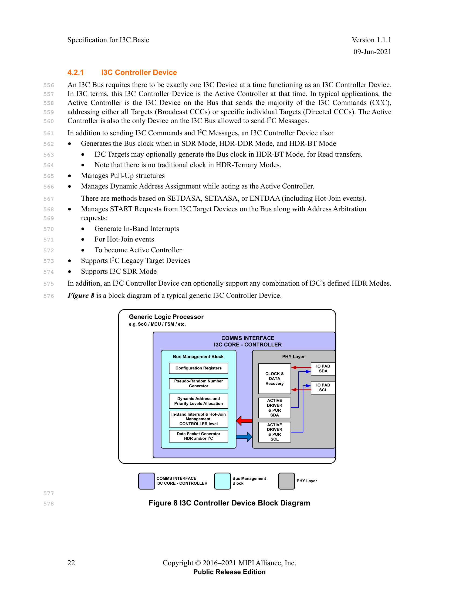

```
577
578
```

Copyright © 2016–2021 MIPI Alliance, Inc. **Public Release Edition** 

22 

Version 1.1.1 09-Jun-2021 

Specification for I3C Basic 

## **4.2.1.1 I3C Controller Device Roles** 

> **`579`** All I3C Controller Devices support one of the two Primary Controller Device Roles, and may also support **`580`** one of the two Secondary Controller Device Roles. 

## **`581` Primary Controller Device Roles:** 

- **`582`** • **Primary Controller:** The I3C Controller Device on the I3C Bus that initially configures the I3C **`583`** Bus and serves as the first Active Controller. Only one I3C Device on a given I3C Bus can take **`584`** the Primary Controller role, i.e., the role cannot be passed on to any other I3C Device on the I3C **`585`** Bus. Supports both SDR Mode and at least one HDR Mode. 

- **`586`** • **SDR-Only Primary Controller:** A Primary Controller that only supports I3C’s SDR Mode, i.e., does **`587`** not support any of the HDR Modes. 

## **`588` Secondary Controller Device Roles:** 

- **`589`** • **I3C Secondary Controller:** Any I3C Device on the I3C Bus, other than the Active Controller, with **`590`** I3C Controller Capability. There can be multiple Secondary Controllers on an I3C Bus at the same **`591`** time. By definition, a Secondary Controller functions as an I3C Target Device until and unless it **`592`** eventually becomes Active Controller. Supports both SDR Mode and at least one HDR Mode. 

- **`593`** • **SDR-Only Secondary Controller:** A Secondary Controller that only supports I3C’s SDR Mode, i.e., **`594`** does not support any of the HDR Modes. 

- **`595`** See also _**Table 2**_ and _**Table 3**_ . 

- **`596`** _**Note:**_ 

- **`597`** _Active Controller is not formally defined as an I3C Device Role, and is not exposed in the I3C_ **`598`** _Device’s Bus Characteristics Register (BCR, see_ _**Section 5.1.1.2.1** )._ 

Copyright © 2016–2021 MIPI Alliance, Inc. **Public Release Edition** 

23 

Specification for I3C Basic 

Version 1.1.1 09-Jun-2021 

## **4.2.2 I3C Target Device** 

- **`599`** The maximum number of Devices that an I3C Bus supports will depend on trace length, capacitive load per **`600`** Device, and the types of Devices (I[2] C vs. I3C) present on the Bus, because these factors affect clock frequency **`601`** requirements. 

- **`602`** _**Note:**_ 

- **`603`** _Previous versions of the I3C Basic Specification (as well as some previous versions of the full I3C_ **`604`** _Specification) listed a maximum number of 11 I3C Target Devices. This limit was calculated based on_ **`605`** _typical electrical parameters (see_ _**Section 6** )._ 

- **`606`** An I3C Target Device listens to the I3C Bus for relevant I3C Commands (CCCs) sent by the Active Controller 

- **`607`** and responds accordingly. This includes all Broadcast Commands (CCC), and any Directed Commands **`608`** (CCC) addressed specifically to that I3C Target Device and supported by that I3C Target Device. 

- **`609`** In addition to responding to I3C Commands, an I3C Target Device always supports I3C SDR Mode. 

- **`610`** An I3C Target Device does not generate the Bus clock, and always follows the Bus clock generated by the **`611`** Active Controller, except during: 

- **`612`** • Read transfers in HDR-BT Mode (optional, at implementer discretion) 

- **`613`** For addressing, an I3C Target Device supports at least one of the Dynamic Address Assignment methods: **`614`** based on SETDASA, SETAASA, or ENTDAA. 

- **`615`** In addition, an I3C Target Device can optionally: 

- **`616`** • Request In-Band Interrupts 

- **`617`** • Generate Hot-Join events 

- **`618`** • Request to become Active Controller, if the I3C Target Device also has I3C Controller Device **`619`** capability (i.e., an I3C Secondary Controller Device) 

- **`620`** • Support any combination of I3C’s defined HDR Modes 

- **`621`** While functioning as a Target, an I3C Target Device functions in one of the Target Device Roles detailed in **`622`** _**Section 4.2.2.1**_ . 

- **`623`** _**Figure 9**_ is a block diagram of a typical generic I3C Target Device. 

Copyright © 2016–2021 MIPI Alliance, Inc. **Public Release Edition** 

24 

Version 1.1.1 09-Jun-2021 

Specification for I3C Basic 

**==> picture [266 x 221] intentionally omitted <==**

**----- Start of picture text -----**<br>
Generic Logic Processor<br>e.g. SoC / MCU / FSM / etc.<br>COMMS INTERFACE<br>I3C CORE - TARGET<br>Bus Management Block PHY Layer<br>Configuration Registers IO PADSDA<br>CLOCK &<br>DATA<br>Pseudo-Random Number Generator Recovery IO PAD<br>SCL<br>Dynamic Address Capture ACTIVE<br>DRIVER<br>& Open Drain<br>In-Band Interrupt & Hot-Join  SDA<br>Management, Target level<br>ACTIVE<br>DRIVER<br>Data Packet Generator  & Open Drain<br>HDR and/or I [2] C SCL<br>COMMS INTERFACEI3C CORE - TARGET Bus Management Block PHY Layer<br>**----- End of picture text -----**<br>


**`624 625` Figure 9 I3C Target Device Block Diagram** 

## **4.2.2.1 I3C Target Device Roles** 

## **`626`** 

All I3C Target Devices support one of the two I3C Target Device Roles: 

- **`627`** • **I3C Target :** An ordinary I3C Target Device without Controller capability. Supports both SDR **`628`** Mode and at least one HDR Mode. 

- **`629`** • **SDR-Only I3C Target:** An I3C Target without Controller capability that only supports I3C’s SDR **`630`** Mode (i.e., does not support any of the HDR Modes). 

## **`631`** _**Note:**_ 

- **`632`** _An additional Target Device Role is defined for I[2] C Target, however this is not relevant for an I3C_ **`633`** _Target Device._ 

- **`634`** See also _**Table 1**_ and _**Table 2**_ . 

Copyright © 2016–2021 MIPI Alliance, Inc. **Public Release Edition** 

25 

Specification for I3C Basic 

Version 1.1.1 09-Jun-2021 

This page intentionally left blank. 

Copyright © 2016–2021 MIPI Alliance, Inc. **Public Release Edition** 

26 

Version 1.1.1 09-Jun-2021 

Specification for I3C Basic 

## **5 I3C Protocol** 

- **`635`** This Section specifies the communication protocols for all defined I3C Modes: 

- **`636`** • **Single Data Rate (SDR) Mode:** See _**Section 5.1**_ 

- **`637`** • **High Data Rate (HDR) Modes:** See _**Section 5.2**_ 

- **`638`** • NOT INCLUDED IN I3C BASIC: HDR Ternary Symbol Pure-bus (HDR-TSP) Mode: See **`639`** _**Section 5.2.3**_ 

- **`640`** • NOT INCLUDED IN I3C BASIC: HDR Ternary Symbol Legacy-inclusive-bus (HDR-TSL) **`641`** Mode: See _**Section 5.2.3**_ 

- **`642`** • HDR Double Data Rate (HDR-DDR) Mode: See _**Section 5.2.2**_ 

- **`643`** • HDR Bulk Transport Mode: See _**Section 5.2.4**_ 

- **`644`** It is important to note that the I3C Bus is always initialized and configured in SDR Mode, never in any of **`645`** the HDR Modes. (The procedure for entering an HDR Mode from SDR Mode is detailed in _**Section 5.2.1**_ .) 

- **`646`** As a result, most of the essential basic I3C protocol specifications are found in _**Section 5.1**_ , including: 

|**Subject**|**Section**|
|---|---|
|Bus Configuration|**_5.1.1_**|
|Bus Communication|**_5.1.2_**|
|Bus Conditions|**_5.1.3_**|
|Bus Initialization and<br>Dynamic Address Assignment Mode|**_5.1.4_**|
|Hot-Join Mechanism|**_5.1.5_**|
|In-Band Interrupt|**_5.1.6_**|
|I3C Bus with Multiple Controllers|**_5.1.7_**|
|Timing Control|**_5.1.8_**|
|Common Command Codes (CCC)|**_5.1.9_**|
|Error Detection and Recovery Methods for SDR|**_5.1.10_**|
|Target Reset|**_5.1.11_**|


Copyright © 2016–2021 MIPI Alliance, Inc. **Public Release Edition** 

27 

Specification for I3C Basic 

Version 1.1.1 09-Jun-2021 

This page intentionally left blank. 

Copyright © 2016–2021 MIPI Alliance, Inc. **Public Release Edition** 

28 

Version 1.1.1 09-Jun-2021 

Specification for I3C Basic 

## **5.1 Single Data Rate (SDR) Mode** 

- **`647`** This Section specifies the communication protocols for Single Data Rate (SDR) Mode. 

- **`648`** SDR Mode is the default Mode of the I3C Bus. SDR Mode is also used to enter other Modes, sub-Modes, **`649`** and states (as described in _**Section 5.1**_ and _**Section 5.2**_ ); and for built-in features such as Common Commands **`650`** (CCCs), In-Band Interrupts, and transition from I[2] C to I3C by assignment of a Dynamic Address. 

- **`651`** I3C SDR Mode is significantly similar to the I[2] C protocol _**[NXP01]**_ in terms of procedures and conditions, **`652`** and as a result I3C Devices and many Legacy I[2] C Target Devices (but not Legacy I[2] C Controller Devices) **`653`** can coexist on the same I3C Bus. However, SDR Mode also includes numerous new features not present in **`654`** I[2] C. For the procedures and conditions that I3C shares with I[2] C, SDR Mode closely follows the definitions **`655`** in the I[2] C Specification. I[2] C traffic from an I3C Controller to an I[2] C Target will be properly ignored by all **`656`** I3C Targets, because the I3C protocol is designed to allow I[2] C traffic. I3C traffic from an I3C Controller to **`657`** an I3C Target will not be seen by most Legacy I[2] C Target Devices, because the I[2] C Spike Filter is opaque to **`658`** I3C’s higher clock speed. 

Copyright © 2016–2021 MIPI Alliance, Inc. **Public Release Edition** 

29 

Specification for I3C Basic 

Version 1.1.1 09-Jun-2021 

## **5.1.1 Bus Configuration** 

> **`659`** The I3C Bus can be configured as the link among several clients, in a flexible and efficient manner. At the **`660`** system architecture level, seven roles are defined for I3C compatible Devices (see _**Table 1**_ ). 

- **`661`** An example block diagram of I3C interconnections is shown in _**Figure 10**_ . In this figure the color blue **`662`** indicates Devices with a Controller role, the color pink indicates Devices with an I3C Target role, and the **`663`** color purple indicates Devices with an I[2] C Target role. 

- **`664`** 

_**Note:**_ 

- **`665`** _I3C Secondary Controller Devices have the ability to function in either Controller or Target roles at_ **`666`** _different times, using the same Dynamic Address. In_ _**Figure 10** , the I3C Primary Controller is the_ **`667`** _Active Controller of the Bus, so the I3C Secondary Controller acts as a Target (i.e., its Controller_ **`668`** _capability is not active)._ 

**`669`** _I3C Devices may also present multiple simultaneous roles. In_ _**Figure 10** , a typical I3C composite_ **`670`** _Device is shown that presents multiple Virtual Targets on the I3C Bus, where each Virtual Target has_ **`671`** _a separate Dynamic Address. Such a composite I3C Device uses shared Peripheral logic to handle_ **`672`** _transfers for its Virtual Targets, which are active simultaneously, per_ _**Section 5.1.2.1.2** . Other types of_ **`673`** _composite I3C Devices are possible, and might include support for other roles (i.e., Secondary_ **`674`** _Controller)._ 

**`675`** _I3C Devices may also enable connections to other buses, either as a Bridge Device (i.e., to a different_ **`676`** _bus such as I[2] C or SPI) or as a Routing Device (to another I3C Bus). Such Devices might present_ **`677`** _one or more Virtual Targets on this I3C Bus that may be used to communicate through the Bridge_ **`678`** _Device or Routing Device._ 

**==> picture [339 x 259] intentionally omitted <==**

**----- Start of picture text -----**<br>
I3C I3C I [2] C<br>TARGET TARGET TARGET<br>SDA<br>I3C<br>PRIMARY<br>CONTROLLER SCL<br>_ op o te<br>SHARED PERIPHERAL I3C SECONDARY CONTROLLER I3C<br>BRIDGING<br>or<br>I3C I3C I3C I3C ROUTING<br>VIRTUAL VIRTUAL CONTROLLER TARGET<br>TARGET TARGET (not active) (active)<br>LLC®<br>LEGEND<br>I3C CONTROLLER<br>I3C DEVICE<br>(incl. Primary  I3C TARGET I [2] C TARGET<br>with multiple roles<br>Controller)<br>**----- End of picture text -----**<br>


**`679 680`** 

**Figure 10 I3C Bus with I[2] C Devices and I3C Devices** 

![Figure 10 I3C Bus with I[2] C Devices and I3C Devices](figures/fig_010_p057.png)

Copyright © 2016–2021 MIPI Alliance, Inc. **Public Release Edition** 

30 

Version 1.1.1 09-Jun-2021 

Specification for I3C Basic 

**`681`** _**Figure 11**_ shows another example block diagram, with an I3C Minimal Bus use case for simple point-to- **`682`** point communications. In this use case a single Controller assigns the same Dynamic Address to one or more **`683`** I3C Target Devices, only one of which supports Read transactions and In-Band Interrupts. 

```
684
685
```

**==> picture [279 x 192] intentionally omitted <==**

**----- Start of picture text -----**<br>
I3C I3C<br>TARGET TARGET<br>Address 7'h01 Address 7'h01*<br>w/o IBI<br>SDA<br>I3C<br>PRIMARY<br>CONTROLLER SCL<br>LEGEND<br>I3C PRIMARY  I3C TARGET I3C TARGET<br>CONTROLLER (with IBI) (w/o IBI)<br>**----- End of picture text -----**<br>


**Figure 11 I3C Minimal Bus with I3C Target Devices** 

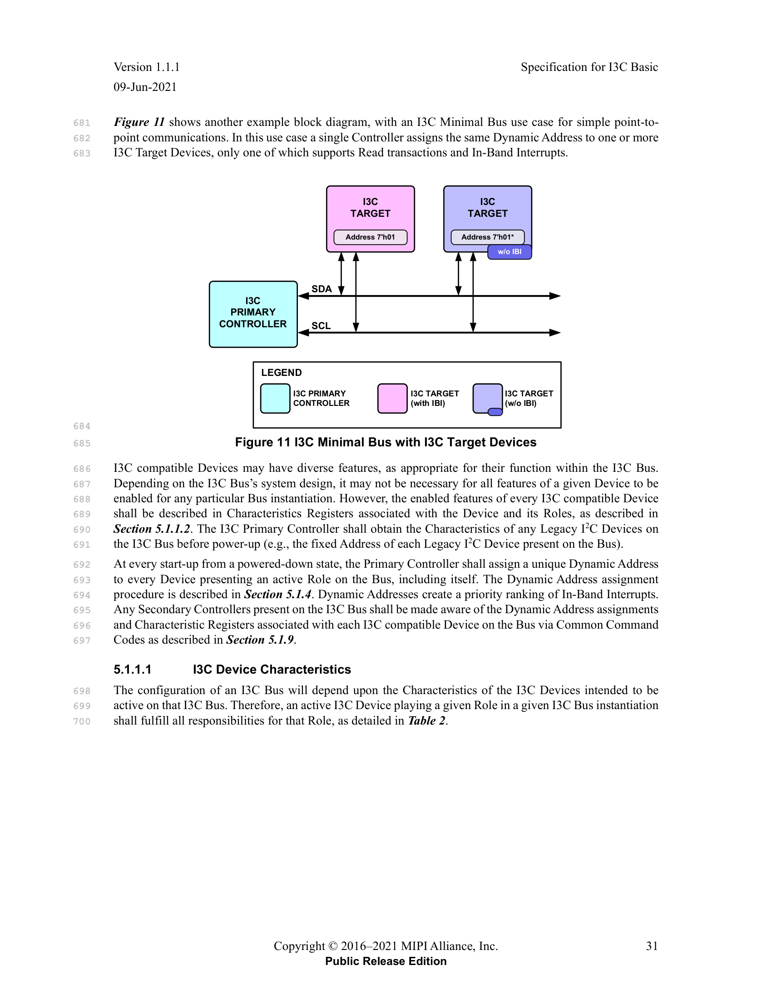

**`686`** I3C compatible Devices may have diverse features, as appropriate for their function within the I3C Bus. **`687`** Depending on the I3C Bus’s system design, it may not be necessary for all features of a given Device to be **`688`** enabled for any particular Bus instantiation. However, the enabled features of every I3C compatible Device **`689`** shall be described in Characteristics Registers associated with the Device and its Roles, as described in **`690`** _**Section 5.1.1.2**_ . The I3C Primary Controller shall obtain the Characteristics of any Legacy I[2] C Devices on **`691`** the I3C Bus before power-up (e.g., the fixed Address of each Legacy I[2] C Device present on the Bus). 

**`692`** At every start-up from a powered-down state, the Primary Controller shall assign a unique Dynamic Address **`693`** to every Device presenting an active Role on the Bus, including itself. The Dynamic Address assignment **`694`** procedure is described in _**Section 5.1.4**_ . Dynamic Addresses create a priority ranking of In-Band Interrupts. **`695`** Any Secondary Controllers present on the I3C Bus shall be made aware of the Dynamic Address assignments **`696`** and Characteristic Registers associated with each I3C compatible Device on the Bus via Common Command **`697`** Codes as described in _**Section 5.1.9**_ . 

## **5.1.1.1 I3C Device Characteristics** 

> **`698`** The configuration of an I3C Bus will depend upon the Characteristics of the I3C Devices intended to be **`699`** active on that I3C Bus. Therefore, an active I3C Device playing a given Role in a given I3C Bus instantiation **`700`** shall fulfill all responsibilities for that Role, as detailed in _**Table 2**_ . 

Copyright © 2016–2021 MIPI Alliance, Inc. **Public Release Edition** 

31 

Specification for I3C 

Version 1.1.1 09-Jun-2021 

```
701
```

## **Table 2 I3C Devices Roles vs Responsibilities** 

|**Responsibilities /**<br>**Features**|**Comments**|**Roles**|**Roles**|**Roles**|**Roles**|**Roles**|**Roles**|
|---|---|---|---|---|---|---|---|
|||**Primary**<br>**Controller**|**Secondary**<br>**Controller**|**SDR-Only**<br>**Primary**<br>**Controller**|**SDR-Only**<br>**Secondary**<br>**Controller**|**Target**|**SDR-Only**<br>**Target**|
|**Manages SDA**<br>**Arbitration**|For Address Arbitration,<br>In-Band Interrupt, Hot-Join,<br>Dynamic Address, as<br>appropriate|Y|Y|Y|Y|N|N|
|**Dynamic Address**<br>**Assignment**|Controller assigns Dynamic<br>Address|Y|Optional3|Y|Optional3|N|N|
|**Hot-Join Dynamic**<br>**Address Assignment**|Controller capable of Dynamic<br>Address assignment after Hot-<br>Join|Y|Optional3|Y|Optional3|N|N|
|**Self Dynamic Address**<br>**Assignment**|Only Primary Controller can<br>self-assign a Dynamic Address|Y|N|Y|N|N|N|
|**Static I2C Address1**|–|N/A|Optional|N/A|Optional|Optional|Optional|
|**Memory for Targets’**<br>**Addresses and**<br>**Characteristics**|Retaining registers|Y|Y|Y|Y|N|N|
|**HDR Target capable**|Supports being accessed in at<br>least one HDR Mode|Y|Y|N|N|Y|N|
|**HDR Controller**<br>**capable**|Supports Bus control in at<br>least one HDR Mode|Y|Y|N|N|||
|||||||N/A|N/A|
|||||||||
|**HDR Exit Pattern**<br>**Generation capable2**|Able to generate the HDR Exit<br>Pattern on the Bus for error<br>recovery|Y|Y|Y|Y|N|N|
|**HDR Tolerant**|Recognizes HDR Exit Pattern|Y|Y|Y|Y|Y|Y|
|**_Note:_**<br>_1) A Static Address may be used to more quickly assign a Dynamic Address. See_**_Section 5.1.4_**_._<br>_2) All Targets require an HDR Exit Pattern Detector, even Targets that are not HDR capable._<br>_3)_ _A Secondary Controller may assign a Dynamic Address using the ENTDAA CCC while it is the Active Controller (i.e., when it holds the Controller Role,_<br>_per_**_Section 5.1.7.3.3_**_). Some Secondary Controllers might have limited capabilities or reduced functionality while acting as the Active Controller of the_<br>_I3C Bus. See_**_Section 5.1.7.3.4_**_and_**_Section 5.1.7.3.6_**_. However, only the Primary Controller may assign Dynamic Addresses using the SETDASA_<br>_and/or SETAASA CCCs (i.e., during Bus Initialization), per_**_Section 5.1.4.2_**_._||||||||


Copyright © 2016–2021 MIPI Alliance, Inc. **Public Release Edition** 

32 

Version 1.1.1 09-Jun-2021 

Specification for I3C Basic 

**`702`** The I3C protocol supports a subset of I[2] C Target features. For example, an I3C Target can have a Static **`703`** Address but also support Dynamic Addressing. A Device shall not have a 50 ns Spike Filter enabled when **`704`** used in an I3C Bus operating at full clock speed. These differences are summarized in _**Table 3**_ . When used **`705`** in an I3C system, I3C Targets shall enable or disable appropriate I[2] C features as shown in _**Table 3**_ . 

```
706
```

**Table 3 I[2] C Features Allowed in I3C Targets** 

|**I2C Feature When Used**<br>**on an I3C Bus**|**Required**<br>**on I3C**|**Desirable**<br>**on I3C**|**Not Used**<br>**on I3C**|**Not Allowed**<br>**on I3C**|**Note**|
|---|---|---|---|---|---|
|Fm/Fm+ Speed|X|–|–|–|2, 3, 4|
|HS Speed|–|–|X|–|3|
|UFm Speed|–|–|X|–|3|
|Static I2C Address|–|X|–|–|–|
|50 ns Spike Filter|–|–|X|X<br>(Shall<br>disable)|3|
|Clock Stretch|–|–|–|X|–|
|20 mA Open Drain Driver|–|–|X|–|1, 3|
|Matches I2C AC Timing|–|–|X|–|2, 3|
|I2C Extended Address (10 bit)|–|–|X|–|3|
|I3C Reserved Addresses|–|–|–|X|–|
|**_Note:_**<br>_1)_<br>_See_**_Table 82_**_and_**_Table 85_**<br>_2)_<br>_I3C drive and timing requirements are different from I2C._<br>_3)_<br>_If an I3C Target has I2C features intended for use on an I2C Bus, then they will not be used on an_<br>_I3C Bus. As stated in_**_Section 5.1.1.1_**_, once the Target sees a 7’h7E, it will disable I2C features_<br>_that are not used by I3C._<br>_4)_<br>_For a Mixed Bus, timing requirements when communicating with I2C-only Devices may depend on_<br>_the maximum SCL clock frequency supported by such I2C-only Devices. See_**_Table 84_**_and_**_Table_**<br>**_85_**_._||||||


**`707`** Performance of an I3C Bus is heavily dependent upon any I[2] C-only Devices that may be connected to that **`708`** Bus. Consequently, all I[2] C-only Devices permitted on any instantiation of an I3C Bus must be compliant with **`709`** one of the categories detailed in _**Table 4**_ . Furthermore (and as referenced in _**Table 84**_ ), no I[2] C or I3C Device **`710`** present on an I3C Bus shall have an I[2] C Static Address that matches any of the Addresses associated with **`711`** Error Type TE0 (see _**Table 59**_ ). 

```
712
```

**Table 4 Legacy I[2] C-Only Target Categories and Characteristics** 

|**Index Specific**|**I2C-Only Devices**<br>**Index 0**|**I2C-Only Devices**<br>**Index 1**|**I2C-Only Devices**<br>**Index 2**|
|---|---|---|---|
|50 ns IO Spike Filter1|Y|N|N|
|Max SCL clock frequency (fSCL) tolerant2|N/A|Y|N|
|**_Note:_**<br>_1)_<br>_Allows tolerance of HDR Modes and SDR at SCL High periods of tDIG_H_MIXED or less_<br>_2)_<br>_Allows compliance up to maximum SDR SCL clock frequency (fSCL) _||||


Copyright © 2016–2021 MIPI Alliance, Inc. **Public Release Edition** 

33 

Specification for I3C Basic 

Version 1.1.1 09-Jun-2021 

## **5.1.1.2 I3C Characteristics Registers** 

> **`713`** I3C Characteristics Registers describe and define an I3C compatible Device’s capabilities and functions on **`714`** the I3C Bus, as the Device services a given system. Devices without I3C Characteristics Registers shall not **`715`** be connected to a common I3C Bus. 

**`716`** There are three Characteristics Register types: 

- **`717`** • **Bus Characteristics Register** (BCR, see _**Section 5.1.1.2.1**_ ) 

- **`718`** • **Device Characteristics Register** (DCR, see _**Section 5.1.1.2.2**_ ) 

- **`719`** • **Legacy Virtual Register** (LVR, see _**Section 5.1.1.2.3**_ ) 

- **`720`** Every I3C compatible Device shall have associated Characteristics Registers, depending on the Device type: 

- **`721`** • Every I3C compliant Device (as defined in _**Table 2**_ ) that holds one active role shall have one Bus **`722`** Characteristics Register, and one Device Characteristics Register; these are associated with the **`723`** Dynamic Address. 

- **`724`** • I3C compliant Devices that hold multiple active roles might use a single shared Bus **`725`** Characteristics Register and Device Characteristics Register that applies to all such active roles; or **`726`** one pair of such registers for each active role, associated with each role’s Dynamic Address. 

- **`727`** • Composite I3C Devices that present multiple Virtual Targets should usually have separate Bus **`728`** Characteristics Registers and Device Characteristics Registers, i.e., one set for each Virtual **`729`** Target, associated with its Dynamic Address. 

- **`730`** • Every Legacy I[2] C Device to be connected to an I3C Bus shall have one associated Legacy Virtual **`731`** Register. Since these are Legacy Devices, it is understood that this register will exist virtually, for **`732`** example as part of the Device’s driver. 

Copyright © 2016–2021 MIPI Alliance, Inc. **Public Release Edition** 

34 

Version 1.1.1 09-Jun-2021 

Specification for I3C Basic 

## **5.1.1.2.1 Bus Characteristics Register (BCR)** 

> **`733`** Each I3C Device that is connected to the I3C Bus shall have an associated read-only Bus Characteristics **`734`** Register (BCR). This read-only register describes the I3C compliant Device’s role and capabilities for use in **`735`** Dynamic Address assignment and Common Command Codes. The bits within the BCR shall conform to the **`736`** Descriptions presented in in _**Table 5**_ . 

```
737
```

**Table 5 Bus Characteristics Register (BCR)** 

|**Bit**|**Name**|**Description**|**Notes**|
|---|---|---|---|
|**BCR[7]**|**Device Role[1]**|**2’b00:**I3C Target<br>**2’b01:**I3C Controller capable<br>**2’b10:**Reserved for future definition by MIPI Alliance<br>I3C WG<br>**2’b11:**Reserved for future definition by MIPI Alliance<br>I3C WG|1|
|**BCR[6]**|**Device Role[0]**|||
|**BCR[5]**|**Advanced Capabilities**|**1:**Supports optional advanced capabilities.<br>Use GETCAPS CCC (**_Section 5.1.9.3.19_**) to<br>determine which ones.<br>**0:**Does not support optional advanced capabilities|2|
|**BCR[4]**|**Virtual Target Support**|**0:**Is not a Virtual Target and does not expose other<br>downstream Device(s)<br>**1:**Is a Virtual Target, or exposes other downstream<br>Device(s)|3|
|**BCR[3]**|**Offline Capable**|**0:**Device will always respond to I3C Bus commands<br>**1:**Device will not always respond to I3C Bus<br>commands|4|
|**BCR[2]**|**IBI Payload**|**0:**No data bytes follow the accepted IBI<br>**1:**One data byte (MDB) shall follow the accepted<br>IBI, and additional data bytes may follow; see<br>also the Set/Get Maximum Read Length CCC<br>(**_Section 5.1.9.3.6_**). Data byte continuation is<br>indicated by T-Bit per**_Section 5.1.2.3.4_**.<br>See also**_Section 5.1.8_**on use of IBI Payloads for<br>TimingControl.|–|
|**BCR[1]**|**IBI Request Capable**|**0:**Not Capable<br>**1:**Capable|–|
|**BCR[0]**|**Max Data Speed Limitation**|**0:**No Limitation<br>**1:**Limitation|5|
|**_Note:_**<br>_1) The BCR Device Role bits for any I3C Device capable of acting as I3C Controller (either Primary_<br>_Controller or Secondary Controller) are 2’b01. The Primary Controller identifies itself to the_<br>_Targets with the DEFTGTS CCC (_**_Section 5.1.9.3.7_**_); its Static Address is the value 7’h7E._<br>_2) In I3C v1.0, bit BCR[5] only indicated HDR support, and that the Controller should use the_<br>_GETHDRCAPS CCC to determine what HDR Modes were supported. In I3C v1.1 and above, bit_<br>_BCR[5] now indicates that the Controller should use the same CCC (now renamed GETCAPS) to_<br>_determine what advanced features the I3C Device supports, including (but no longer limited to)_<br>_HDR. Note that the I3C v1.0 method is fully interoperable with the I3C v1.1 and above method._<br>_3). In I3C v1.0, bit BCR[4] only indicated Bridge Devices required to comply with the I3C_<br>_Specification. In I3C v1.1 and above, bit BCR[4] now indicates that the Device is a Virtual Target_<br>_or exposes other downstream Devices, and that the Controller should use the GETCAPS CCC_<br>_with Defining Byte VTCAPS (_**_Section 5.1.9.3.19_**_) to determine what features and capabilities the_<br>_I3C Device supports, including (but no longer limited to) Bridge Devices._<br>_4) Offline Capable Devices retain the Dynamic Address, and are specified in_**_Section 2.2_**_._<br>_5) Controller shall use the GETMXDS CCC to interrogate the Target for specific limitation._||||


Copyright © 2016–2021 MIPI Alliance, Inc. **Public Release Edition** 

35 

Specification for I3C Basic 

Version 1.1.1 09-Jun-2021 

> **`738`** Each I3C Device that is connected to the I3C Bus shall have an associated read-only Device Characteristics **`739`** Register (DCR). This read-only register describes the I3C compliant Device type (e.g., accelerometer, **`740`** gyroscope, etc.) for use in Dynamic Address assignment and Common Command Codes. The bits within the **`741`** DCR shall conform to the Descriptions presented in _**Table 6**_ . 

## **5.1.1.2.2 Device Characteristics Register (DCR)** 

```
742
```

```
743
```

MIPI Alliance maintains a public registry of approved and pending DCR value assignments _**[MIPI02]**_ . 

**Table 6 I3C Device Characteristics Register (DCR)** 

|**Bit**|**Name**|**Description**|
|---|---|---|
|**DCR[7]**|**Device ID[7]**|255 available codes for describing the type of sensor, or Device.<br>Examples: Accelerometer, gyroscope, composite Devices.<br>Default value is 8’b0: Generic Device|
|**DCR[6]**|**Device ID[6]**||
|**DCR[5]**|**Device ID[5]**||
|**DCR[4]**|**Device ID[4]**||
|**DCR[3]**|**Device ID[3]**||
|**DCR[2]**|**Device ID[2]**||
|**DCR[1]**|**Device ID[1]**||
|**DCR[0]**|**Device ID[0]**||


## **5.1.1.2.3 Legacy Virtual Register (LVR)** 

> **`744`** Each Legacy I[2] C Device that can be connected to the I3C Bus shall have an associated read-only Legacy **`745`** Virtual Register (LVR) describing the Device’s significant features. Since these are Legacy I[2] C Devices, it is **`746`** understood that this register will exist virtually, for example as part of the Device’s driver. When Legacy I[2] C **`747`** Devices are present on an I3C Bus, LVR data determines allowed Modes and maximum SCL clock frequency. **`748`** The bits within the LVR shall conform to the descriptions in _**Table 7**_ . 

**`749`** All LVRs shall be established by the higher-level entity controlling the I3C Bus, and shall be transferred to **`750`** the I3C Bus Primary Controller prior to Bus configuration. The LVR content for all I[2] C Devices is always **`751`** known by the Primary Controller. The Primary Controller shall transfer the LVR content for all I[2] C Devices **`752`** to Secondary Controllers by using the DEFTGTS CCC (see _**Section 5.1.9.3.7**_ ). 

```
753
```

**Table 7 Legacy I[2] C Virtual Register (LVR)** 

|**Bits**|**Name**|**Values**|
|---|---|---|
|**LVR[7:5]**|**Legacy I2C-Only [2:0]**<br>per**_Table 4_**|**3’b000:**Index 0: Spike Filter, Max SCL clock freq tolerant N/A<br>**3’b001:**Index 1: No Spike Filter, Max SCL clock freq tolerant<br>**3’b010:**Index 2: No Spike Filter, Not Max SCL clock freq tolerant|
|||**3’b011 – 3’b111:**Index 3 – 7: Reserved|
|**LVR[4]**|**I2C Mode Indicator**|**0:**I2C Fm+<br>**1:**I2C Fm|
|**LVR[3:0]**|MIPI Alliance I3C WG<br>Reserved|**0:**Reserved|
|||**1 – 15:**15 available codes for describing the Device capabilities<br>and function on the sensors’ system.|


Copyright © 2016–2021 MIPI Alliance, Inc. **Public Release Edition** 

36 

Version 1.1.1 09-Jun-2021 

Specification for I3C Basic 

## **5.1.2 Bus Communication** 

> **`754`** The primary protocol and Mode of I3C is SDR (Single Data Rate) Mode. The SDR protocol is based on the **`755`** I[2] C standard protocol _**[NXP01]**_ , with a few notable variations: 

- **`756`** • The I3C START and STOP (as shown in _**Figure 147**_ and _**Figure 150**_ , respectively) are identical to the **`757`** I[2] C START and STOP in their signaling, but they may vary from I[2] C in their timing. Compare _**Table 86**_ **`758`** vs. _**Table 85**_ . 

- **`759`** _**Note:**_ 

- **`760`** _In I3C SDR (but not HDR), a STOP or Repeated START is tolerated (i.e., may appear) any time_ **`761`** _that SCL is High while the Controller controls SDA or SDA is Open-Drain. This is unlike I[2] C, which_ **`762`** _wants STOP or Repeated START only after a NACK of an address, or after ACK/NACK of data._ **`763`** _Although I3C SDR also prefers STOP and Repeated START to be used only in those situations,_ **`764`** _and after an I3C Broadcast Address is ACKed, it does not disallow them in any other location._ **`765`** _However, appearance of a STOP or Repeated START in the middle of an Address or in the middle_ **`766`** _of data is interpreted to cancel that Address or data._ 

- **`767`** • The I3C Address Header is identical to the I[2] C Address Header in bit form and in signaling, but it may **`768`** vary from I[2] C in its timing. See _**Section 5.1.2.2**_ , _**Table 86**_ , and _**Table 87**_ . 

- **`769`** • The Data 9-bit Words use the same bit count as I[2] C, but differ in the ninth bit, as explained in **`770`** _**Section 5.1.2.3**_ . 

- **`771`** • In I3C, the SCL line is only driven by the Controller. Normally this drive is Push-Pull, but it can also be **`772`** Open Drain. 

- **`773`** Because the bit count is the same for Address Header and Data Word, the I3C Target only needs to know **`774`** whether a Message is an I3C Messages (vs. is an I[2] C Message) if the Message is addressed to that Target **`775`** (either directly or by Broadcast). 

- **`776`** An I3C Message is defined as everything from the initial START (or Repeated START) to the next Repeated **`777`** START or STOP. 

- **`778`** An I3C Message is an SDR Message if: 

- **`779`** • The Address in the Address Header is 7’h7E (the I3C Broadcast Address). All I3C Targets shall match **`780`** Address value 7’h7E. No I[2] C Target will match Address 7’h7E, because that value is reserved and unused **`781`** in I[2] C. 

- **`782`** • The Address in the Address Header matches the Target’s Dynamic Address (as assigned by the I3C **`783`** Controller per _**Section 5.1.4**_ ). All I3C Targets shall match their own Dynamic Address. (It is permitted **`784`** to then NACK the Header if needed.) 

- **`785`** All I3C Targets shall ignore all Messages with Addresses other than 7’h7E or the I3C Controller Assigned 

- **`786`** Address, and shall await either the Repeated START or the STOP. I3C Targets shall not transmit on the Bus **`787`** in response to a non-matching Address. 

- **`788`** _**Note:**_ 

**`789`** _Legacy I[2] C Targets will ignore any Message not addressed to them, and will await the next START or_ **`790`** _STOP. Per_ _**Section 5.1.2.4** , Legacy I[2] C Targets may also not see some or all of I3C Messages and_ **`791`** _Modes due to the speed of SCL signaling._ 

Copyright © 2016–2021 MIPI Alliance, Inc. **Public Release Edition** 

37 

Specification for I3C Basic 

Version 1.1.1 09-Jun-2021 

```
792
793
```

**==> picture [362 x 178] intentionally omitted <==**

**----- Start of picture text -----**<br>
S or I3C RESERVED BYTE R/W<br>ACK<br>Sr  (7'h7E) (0)<br>I3C Address Header<br>DATA T P<br>with Broadcast Address<br>S or<br>I3C TARGET ADDRESS R/W ACK<br>Sr<br>I3C Address Header<br>with Dynamic Address<br>S or ACK /<br>I [2] C TARGET ADDRESS R/W ACK DATA P<br>Sr NACK<br>I [2] C Address Header<br>with Static Address<br>**----- End of picture text -----**<br>


**Figure 12 Address Header Comparison** 

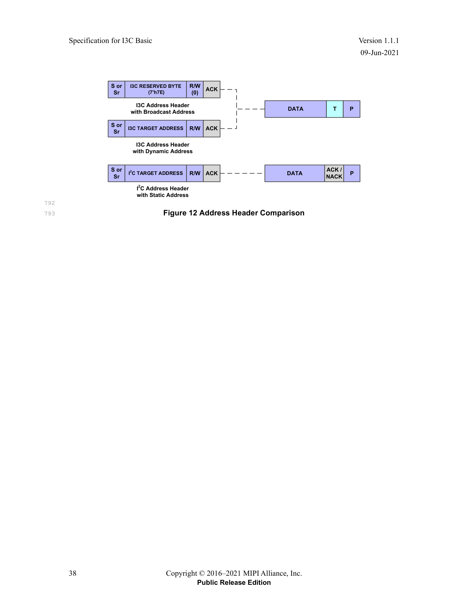

Copyright © 2016–2021 MIPI Alliance, Inc. **Public Release Edition** 

38 

Version 1.1.1 09-Jun-2021 

Specification for I3C Basic 

## **5.1.2.1 Role of I3C Target** 

> **`794`** An I3C Target is a functional role that is embodied or presented by an I3C Device. Such a Device may be a **`795`** standalone physical Device that presents only one Target, or it may be a composite Device that presents **`796`** multiple Virtual Targets using shared Peripheral logic. In either case, each Target (which may be a Virtual **`797`** Target) presented on the I3C Bus may be assigned its own unique Dynamic Address, and the Controller can **`798`** address it independently for transfers. 

- **`799`** _**Note:**_ 

- **`800`** _Many such I3C Device implementations are possible that might embody or present one or more_ **`801`** _active I3C Target roles. For composite I3C Devices that present multiple Virtual Targets, the shared_ **`802`** _Peripheral logic might handle many of the underlying functions that would normally be handled by_ **`803`** _internal logic for a single, standalone I3C Device that only presented a single Target on the I3C Bus._ **`804`** _For simplicity, the remainder of this section treats both options equally, referring to “Target” in a_ **`805`** _generic sense. See_ _**Section 5.1.2.1.2** for special exceptions._ 

- **`806`** The I3C Target does not have to know whether it is on a Legacy I[2] C Bus or an I3C Bus. If it has an I[2] C Static **`807`** Address, then it may participate using that Address (per _**Section 5.1.2.1.1**_ ) up until it is assigned a Dynamic **`808`** Address. Once assigned a Dynamic Address, unless asked to Reset, it shall only operate as an I3C Target. 

- **`809`** An I3C Capable Target may act as an I[2] C Device before it gets its Dynamic Address (DA) assigned. However, **`810`** the Target shall ACK the START with Address 7’h7E. (The only exception would be if the Target is choosing **`811`** to remain an I[2] C-only Device on a given Bus or use, in which case it would leave its 50 ns Spike Filter **`812`** enabled.) 

## **`813` Before Receiving a Dynamic Address** 

**`814`** Targets that do recognize START and the 7’h7E Address may see any CCC, not just ENTDAA (see **`815`** _**Section 5.1.9.3.4**_ ), and shall behave as follows: 

- **`816`** • The Target shall appropriately process all required Broadcast CCCs, including ENTDAA, **`817`** RSTDAA (see _**Section 5.1.9.3.3**_ ), ENEC (see _**Section 5.1.9.3.1**_ ), and DISEC (see **`818`** _**Section 5.1.9.3.1**_ ). 

- **`819`** Examples of appropriate processing: 

- **`820`** • RSTDAA has no effect, since no Dynamic Address is assigned 

- **`821`** • For a Target Device intended to be used on I3C Buses that only use SETAASA and/or **`822`** SETDASA to assign a Dynamic Address to it, ENTDAA support is optional. 

- **`823`** • If the Target would never issue a Controller Role Request, then the DISEC CCC for the **`824`** Controller Role Request can be ignored. 

- **`825`** • The Target shall recognize the CCCs ENTHDR0 through ENTHDR7 (see _**Section 5.1.9.3.9**_ ), and **`826`** then wait for the HDR Exit Pattern. 

- **`827`** • The Target may choose to understand and process the SETDASA CCC (see _**Section 5.1.9.3.10**_ ) **`828`** when its Static Address matches. 

- **`829`** • The Target may choose to understand and process the SETAASA CCC (see _**Section 5.1.9.3.23**_ ). 

- **`830`** • The Target shall disregard all Directed CCC commands, but shall properly recognize the ends of **`831`** Directed CCCs (i.e., either Repeated START followed by 7’h7E, or STOP). 

- **`832`** • When no Dynamic Address has been assigned yet, the Target may either support or ignore non- **`833`** Required and Conditionally Required Broadcast CCCs. 

- **`834`** This is true even if the Target supports any of these CCCs after being assigned a Dynamic **`835`** Address. For example, the Target may choose to only support Test Mode only when no Dynamic **`836`** Address is assigned. 

- **`837`** • The I3C Target shall ignore TE0 type errors related to incorrect Addresses only (see _**Table 59**_ ). 

Copyright © 2016–2021 MIPI Alliance, Inc. **Public Release Edition** 

39 

Specification for I3C Basic 

Version 1.1.1 09-Jun-2021 

## **`838` Address Header Matching** 

- **`839`** The role of an I3C Target shall be as follows: **`840`** 1. Following a START or a Repeated START, at any speed conforming to _**Section 6**_ of this **`841`** Specification, the I3C Target shall attempt to match the Address to the I3C Broadcast Address **`842`** (7’h7E) or to its own Dynamic Address, once assigned. 

- **`843`** If the Target also supports Group Address capabilities (per _**Section 5.1.4.4**_ ), then it shall also **`844`** attempt to match the Address to any of its assigned Group Addresses. 

- **`845`** If any match is found, then the I3C Target shall treat that Message as I3C SDR. 

- **`846`** 2. If the Message is addressed to the Target’s Dynamic Address, then the Target may ACK or **`847`** passively NACK the Address Header: **`848`** a. If the Target ACKs the Address Header, then the Target shall process the Message as I3C **`849`** SDR, following all rules as outlined in this Section. **`850`** b. If the Target NACKs the Address Header (does not drive the ACK bit Low), then the Target **`851`** should disregard any bits that follow, up until the next Repeated START or STOP. 

- **`852`** 3. If the Message is addressed to any of the Target’s assigned Group Addresses, with a Write (RnW **`853`** bit is 0), then the Target may ACK or passively NACK the Address Header: **`854`** a. If the Target ACKs the Address Header, then the Target shall process the Message as **`855`** described above (i.e., in the same manner as an I3C SDR Write to its Dynamic Address). **`856`** 4. If the Message is addressed to the I3C Broadcast Address (7’h7E), with a Write (RnW bit is 0), **`857`** then the Target shall process that Message at least through the first byte of data (if any data is **`858`** present in the Message): **`859`** a. If there is a byte of data in a 7’h7E Broadcast Message, then the Message is a CCC (Common **`860`** Command Code) Command, per _**Section 5.1.9**_ . **`861`** b. The I3C Target shall process all applicable Required CCC commands, per _**Section 5.1.9.3**_ . A **`862`** command may be either Always Required, or only Conditionally Required, per _**Table 16**_ . **`863` For Required CCCs:** The Target shall always remain ready to respond to certain Direct **`864`** CCCs sent to its Dynamic Address, such as **Get Device Status** (GETSTATUS, see **`865`** _**Section 5.1.9.3.15**_ ) even if the Target (or its inner system) is processing previously sent **`866`** Messages, and might not be able to process or ACK other CCCs or Messages (see **`867`** _**Section 5.1.10.2.5**_ ). **`868`** c. If the CCC command changes the Mode of the I3C Bus, then the I3C Target shall handle the **`869`** new Mode in one of two ways. 

```
870
```

## **Either:** 

- **`871`** i. If the new Mode is Dynamic Address Assignment Mode (see _**Section 5.1.4**_ ), and required **`872`** for all I3C Targets, then the Target shall participate if it does not have a current Dynamic **`873`** Address; otherwise, the Target shall await the STOP that indicates exit from Dynamic **`874`** Address Assignment Mode. **`875` Or:** **`876`** ii. If the new Mode is HDR (High Data Rate) Mode, then the Target may either enter into **`877`** HDR Mode if supported (per _**Section 5.2.1.3.1**_ ), or else enable its HDR Exit Pattern **`878`** detector (per _**Section 5.2.1**_ and _**Section 5.2.1.1.3**_ ) to await the exit from HDR Mode. 

Copyright © 2016–2021 MIPI Alliance, Inc. **Public Release Edition** 

40 

Version 1.1.1 09-Jun-2021 

Specification for I3C Basic 

- **`879`** 5. If the Message is not addressed to the I3C Broadcast Address (7’h7E) or to any of the Target’s **`880`** currently assigned Addresses (i.e., Dynamic Address or Group Address), then the I3C Target shall **`881`** await either a Repeated START or a STOP. The Target may record/monitor the bits as they pass (if **`882`** desired), but the only obligation is to wait for either a Repeated START or a STOP: 

- **`883`** _**Note:**_ 

- **`884`** _Repeated START and STOP are specified in_ _**Section 2.2** and_ _**Section 6.2** , and are similar to I[2] C._ **`885`** _In both cases, I3C timing may or may not be the same as with I[2] C._ 

## **5.1.2.1.1 Role of I3C Target Acting as an I[2] C Target with Static Address** 

> **`886`** As noted in other Sections, I3C Targets are capable of acting as standard I[2] C Targets as long as they have an **`887`** I[2] C Static Address. 

**`888`** There are two situations: 

- **`889`** 1. They are on a Legacy I[2] C Bus, and so all messaging is coming from a Legacy I[2] C Controller. 

- **`890`** 2. They are on an I3C Bus, but the I3C Controller is not assigning them a Dynamic Address, so they **`891`** continue to operate as an I[2] C Target; Messages to/from its I[2] C Static Address use the I[2] C protocol. 

- **`892`** For operation on an I[2] C Bus, the Target may use an I[2] C Fm/Fm+ Spike Filter of 50 ns (or more) if it has one. 

- **`893`** For operation on an I3C Bus, the Target may have an I[2] C Fm/Fm+ Spike Filter of 50 ns (or more), which it **`894`** shall disable once it sees a Message from an I3C Controller, notably the first I3C Address Header after Bus **`895`** initialization (i.e., a START followed by 7’h7E and a RnW bit of 0; see _**Section 5.1.2.2**_ ). To support the **`896`** disabling of the Spike Filter, the I3C Controller shall emit at least the first such I3C Address Header with **`897`** Open Drain timing parameters (per _**Table 86**_ ) such that the High and Low periods are long enough to be seen **`898`** with the Spike Filter enabled (see _**Section 5.1.2.2.2**_ ). 

## **`899`** _**Note:**_ **See Errata 01, Item 3** 

- **`900`** _If the Target has such a Spike Filter enabled, and sees the Controller send such an I3C Address_ **`901`** _Header with Open Drain timing parameters, then it shall disable the Spike Filter after the ACK (i.e.,_ **`902`** _after acknowledging the I3C Broadcast Address)._ 

- **`903`** An I3C Target acting as an I[2] C Target will operate correctly on an I3C Bus with the Spike Filter disabled, or **`904`** without ever having a Spike Filter, because of two strict requirements on all conforming I3C Targets: 

- **`905`** 1. An I3C Target shall recognize all required Broadcast CCCs and act appropriately for each one, **`906`** even if the Target has not yet received a Dynamic Address. This notably includes the ENTHDRn **`907`** CCCs (see _**Section 5.1.9.2**_ and _**Table 16**_ ). 

- **`908`** 2. An I3C Target shall recognize the HDR Exit Pattern (see _**Section 5.2.1.1.1**_ ). 

- **`909`** As a result of these two requirements, it is safe for an I3C Target acting as an I[2] C Target to see the short SCL 

- **`910`** High periods (unlike a Legacy I[2] C Device). As a result, it can operate correctly as an I[2] C Target on an I3C **`911`** Bus without a Spike Filter (unlike Legacy I[2] C Targets). 

Copyright © 2016–2021 MIPI Alliance, Inc. **Public Release Edition** 

41 

Specification for I3C Basic 

Version 1.1.1 09-Jun-2021 

## **5.1.2.1.2 Composite Devices and Virtual Targets** 

- **`912`** As noted above, a Virtual Target is presented by an I3C Device that also presents other such Virtual Targets **`913`** on the I3C Bus, and must manage the communications for all such Virtual Targets. In this manner, a Virtual **`914`** Target can be considered a function of such a composite I3C Device that holds multiple active Target roles **`915`** simultaneously. The I3C Device shall maintain separate configuration for each Virtual Target, including the **`916`** assigned Dynamic Address. 

- **`917`** During Dynamic Address Assignment (see _**Section 5.1.4.2**_ ) the shared Peripheral logic manages the **`918`** interaction with the I3C Controller and other I3C Targets on the Bus, for the ENTDAA procedure. This **`919`** includes managing Address Arbitration while providing the 48-bit Provisioned ID, and ensuring that all active **`920`** Virtual Targets are able to receive Dynamic Addresses. The shared Peripheral logic also initiates the Hot-Join **`921`** Request (per _**Section 5.1.5**_ ) during Bus Initialization or whenever necessary. 

- **`922`** _**Note:**_ 

- **`923`** _A Device that presents multiple Virtual Targets might also support the SETDASA and/or SETAASA_ **`924`** _CCCs, instead of the ENTDAA CCC. If so, then each Virtual Target must have a unique Static_ **`925`** _Address._ 

- **`926`** Once Dynamic Addresses are assigned, the shared Peripheral logic typically handles many of the underlying **`927`** communications with the I3C Bus in SDR Mode, while each Virtual Target receives data for Private Write **`928`** transfers addressed to its Dynamic Address, and also provides data to the shared Peripheral logic for **`929`** responding to Private Read transfers and raising In-Band Interrupt requests. 

- **`930`** The shared Peripheral logic also handles the signaling and framing for HDR Modes (if supported, per **`931`** _**Section 5.2.1**_ ) as well as participation in Broadcast and Direct CCC flows, both in SDR Mode (per **`932`** _**Section 5.1.9.1**_ ) as well as any HDR Modes in which CCCs might be supported (per _**Section 5.2.1.2**_ ). 

- **`933`** The shared Peripheral logic also handles the reset flows involving the RSTACT CCC with the Target Reset **`934`** Pattern (see _**Section 5.1.11**_ ), and generates appropriate internal reset messaging to Virtual Target functions **`935`** based on the type of reset. In most cases, a Device that reports as Virtual Target capable should indicate this **`936`** via Bit[4] of the BCR (per _**Section 5.1.1.2.1**_ ) and also report additional capabilities using the GETCAPS **`937`** CCC with Defining Byte VTCAPS (see _**Section 5.1.9.3.19**_ ). 

- **`938`** Depending on the implementation, certain actions or CCCs sent to one Virtual Target’s Dynamic Address **`939`** may cause side effects for other Virtual Targets presented by the same composite Device, or within the shared **`940`** Peripheral logic itself. In some cases, certain features and capabilities that are reported by Virtual Target’s **`941`** Dynamic Address (e.g., by the GETCAPS CCC) shall actually apply equally to the entire Device (i.e., to all **`942`** Virtual Targets and the shared Peripheral logic). 

Copyright © 2016–2021 MIPI Alliance, Inc. **Public Release Edition** 

42 

Version 1.1.1 09-Jun-2021 

Specification for I3C Basic 

## **5.1.2.1.3 Targets Supporting Group Addresses** 

- **`943`** If a Target supports Group Addressing (per _**Section 5.1.4.4**_ ), then it will typically have a single set of **`944`** capabilities or other configurable parameters that pertain to either the Target, or, in special cases, the Device **`945`** or its Peripheral logic. 

- **`946`** • If such capabilities are accessible via a Direct GET CCC (e.g., the GETCAPS CCC, **`947`** _**Section 5.1.9.3.19**_ ), then these shall be assumed to apply to the Target and all its assigned 

- **`948`** Addresses, including any assigned Group Addresses, unless specified otherwise in the particular **`949`** Direct CCC’s definition. 

- **`950`** • If such configuration can be set via a Direct SET CCC (per _**Section 5.1.9.3**_ ), then these shall also **`951`** apply to the whole Target, with exceptions and limitations noted in _**Section 5.1.9.4**_ . 

- **`952`** For such capabilities or other configurable parameters, the Target should accept (i.e., should ACK) such **`953`** Direct SET CCCs that might be sent to any assigned Dynamic Addresses or assigned Group Addresses, unless **`954`** the Direct CCC format is not supported for a Group Address, or a particular Direct CCC defines a different 

- **`955`** use or format that applies when sent to an assigned Group Address (e.g., the MLANE CCC, see **`956`** _**Section 5.1.9.3.30**_ ). 

Copyright © 2016–2021 MIPI Alliance, Inc. **Public Release Edition** 

43 

Specification for I3C Basic 

Version 1.1.1 09-Jun-2021 

## **5.1.2.2 I3C Address Header** 

- **`957`** The I3C Address Header follows either a START, or a Repeated START. The format is the same as I[2] C: 7 **`958`** bits of Address, 1 bit of RnW, and 1 bit of ACK/NACK. 

- **`959`** The Address Header following a START is an Arbitrable Address Header, as explained in _**Section 5.1.2.2.1**_ **`960`** This means the START and at least the first Address bit and ACK/NACK are issued on SDA using Open **`961`** Drain Bus drive, similar to I[2] C. However, some of the Arbitrable Address Header may be driven on SDA **`962`** using Push-Pull and higher speed (see _**Section 5.1.2.2.2**_ ). 

- **`963`** The Address Header following a Repeated START is always driven on SDA using Push-Pull, with the **`964`** exception of the ACK/NACK (see _**Section 5.1.2.2.4**_ ). 

- **`965`** Using the I3C Arbitrable Address Header, I3C Targets may transmit any of three requests to the I3C **`966`** Controller: 

- **`967`** 1. **An In-Band Interrupt** , per _**Section 5.1.6**_ . This is equivalent to toggling a wire to get the Controller’s **`968`** attention. The In-Band Interrupt request shall be made using the Target’s Dynamic Address with a **`969`** RnW bit of 1. 

- **`970`** 2. **A Controller Role Request** , per _**Section 5.1.7**_ . An I3C Device shall not make such a request unless **`971`** it is marked as a Controller-capable Device in its BCR register, per _**Section 5.1.1.2.1**_ . The **`972`** Controller Role Request may be made by a Secondary Controller wishing to gain the Controller **`973`** Role from the Active Controller, or by the Primary Controller after it has relinquished the **`974`** Controller Role and now wishes to regain it from the Active Controller. The Controller Role **`975`** Request shall include the Device’s Dynamic Address with a RnW bit of 0. 

- **`976`** 3. **A Hot-Join Request** , per _**Section 5.1.5**_ . An I3C Target shall only make such a request when **`977`** becoming available after the I3C Bus is operational. The Hot-Join Request shall be made using the **`978`** reserved Hot-Join Address (i.e., 7’h02). 

- **`979`** The I3C Targets shall make these requests to the I3C Controller in only two Bus conditions: 

- **`980`** 1. A START (but not a Repeated START) is issued on the Bus following a Bus Free Condition, per **`981`** _**Section 5.1.3**_ . The Target may transmit its Dynamic Address or the Hot-Join Address (7’h02) **`982`** following the START, by adhering to the I3C Address Arbitration rules per _**Section 5.1.2.2.1**_ . 

- **`983`** 2. The Bus is in a Bus Available Condition, per _**Section 5.1.3**_ , so the Target may issue a START by **`984`** pulling the SDA Low. 

- **`985`** a. If the Target pulls SDA Low, then the Controller shall pull SCL Low within **tCAS** (see _**Table**_ **`986`** _**86**_ ). 

- **`987`** b. The Controller shall also pull SDA Low (overlapping the Target pulling it Low). 

- **`988`** c. Once the Controller has pulled SCL Low, the Target shall control the SDA line in Open Drain **`989`** mode (i.e., either pull Low, or release High). 

- **`990`** d. The Target may then issue its Address in the normal way (condition 1 above). 

Copyright © 2016–2021 MIPI Alliance, Inc. **Public Release Edition** 

44 

Version 1.1.1 09-Jun-2021 

Specification for I3C Basic 

## **5.1.2.2.1 I3C Address Arbitration** 

- **`991`** An Address Header following a START (but not a Repeated START) is subject to Arbitration, meaning both **`992`** the Controller and one or more Targets may attempt to drive an Address onto the Bus, using SDA. Such **`993`** Address Headers are defined as Arbitrable Address Headers. 

- **`994`** The Arbitration model follows the common Open Drain approach. All Devices (whether Controller or Target) **`995`** that are transmitting an Address shall then follow the same rule: 

- **`996`** 1. If the current bit to transmit is a 0, then the Device shall drive SDA Low after the falling edge of **`997`** SCL and hold Low until the next falling edge of SCL. **`998`** _**Note:**_ 

- **`999`** _Other Devices may also be driving SDA Low, but that is acceptable._ 

- **`1000`** 2. If the current bit to transmit is a 1, then the Device shall not drive SDA, but rather shall High-Z **`1001`** SDA on the falling edge of SCL. 

- **`1002`** a. Additionally, the Device shall monitor the SDA on the rising edge of SCL to determine **`1003`** whether another Device has driven SDA Low. 

- **`1004`** b. If another Device has driven the SDA Low, then the Device has ‘lost’ the Arbitration and shall **`1005`** not further participate in this Address Header. That is, the Device shall not transmit any more **`1006`** bits, but may wait for a future START (but not a Repeated START). 

Copyright © 2016–2021 MIPI Alliance, Inc. **Public Release Edition** 

45 

Specification for I3C Basic 

Version 1.1.1 09-Jun-2021 

## **5.1.2.2.2 I3C Address Arbitration Optimization** 

> **`1007`** I3C Address Arbitration may optionally be optimized, as detailed in this Section. 

**`1008`** The Controller shall not apply the optimizations described in this Section for the first I3C Address Header **`1009`** (i.e., START followed by 7’h7E and an RnW bit of 0) after Bus initialization. This permits any I3C Target **`1010`** with an I[2] C Spike Filter to detect that it is on an I3C Bus, and as a result disable the Spike Filter. The **`1011`** Controller may skip this requirement only if it knows that no I3C Target on the Bus has such a Spike Filter. 

**`1012`** As previously described in _**Section 5.1.2.2**_ , an I3C Controller Device assigns 7-bit Dynamic Addresses with **`1013`** values in the range 7’h03 to 7’h7B. However, because the I3C Controller treats the entire 9-bit Arbitrable **`1014`** Address Header as Open Drain, it has no way to detect whether an I3C Target Device might be transmitting **`1015`** its own Address during some (or all) of the Address Header. 

**`1016`** For I3C Secondary Controllers and I3C Targets that can request In-Band Interrupts, the I3C Controller is **`1017`** typically free to restrict assigned Dynamic Addresses to the lower half of the available range (7’h03 to 7’h3F), **`1018`** thus leaving the value of Address bit A6 (the first Address bit after the START) as 0 in all such assigned **`1019`** Dynamic Addresses. For other I3C Targets that cannot request In-Band Interrupts, the I3C Controller restricts **`1020`** assigned Dynamic Addresses to the upper half of the available range (7’h40 to 7’h7B), thus leaving the value **`1021`** of Address bit A6 as 1 in all such assigned Dynamic Addresses. 

- **`1022`** _**Note:**_ 

**`1023`** _This Dynamic Address Assignment strategy is not always possible, since some I3C Targets might not_ **`1024`** _support arbitrary Dynamic Address values in the available range (i.e., when an I3C Target has an I[2] C_ **`1025`** _Static Address and also does not support the SETNEWDA CCC; see_ _**Section 5.1.9.3.11** )._ 

**`1026`** Having restricted Dynamic Addresses in this manner, the I3C Controller may then optionally optimize the **`1027`** Arbitrable Address Header as follows: 

- **`1028`** • If the I3C Controller is transmitting a 1 value (i.e., High-Z on SDA), as it would when transmitting **`1029`** 7’h7E, then it can monitor SDA on the rising edge of SCL. If SDA has the value 1 (i.e., if SDA is **`1030`** not being driven by any Target), then the I3C Controller may optionally transmit the remainder of **`1031`** the Address Header (up until the ACK/NACK) in Push-Pull mode. See _**Figure 13**_ , upper **`1032`** waveform. 

- **`1033`** • If the I3C Controller is transmitting a 0 value (i.e., is driving SDA Low), or if SDA was driven **`1034`** Low by a Target, then the I3C Controller shall transmit the remainder of the Address Header using **`1035`** Open Drain. 

- **`1036`** • If the I3C Controller intends to transmit solely to other I3C Devices (i.e., not to any I[2] C Devices), **`1037`** then it may optionally maintain the SCL pulse width below 50 ns, with the result that any I[2] C **`1038`** Devices present on the Bus will see only a 0 value. This shorter pulse width produces a higher data **`1039`** rate, because for Open Drain Arbitration only the Low time is extended. See _**Figure 13**_ , middle **`1040`** waveform. 

- **`1041`** • If the I3C Controller intends to transmit to any I[2] C Devices, then it must use the slower I[2] C timing. **`1042`** See _**Figure 13**_ , lower waveform. 

**`1043`** The upper waveform of _**Figure 13**_ illustrates this optimization. When the I3C Controller sees a value of 1 for **`1044`** Address bit A6, but previously made sure that all Dynamic Addresses assigned to such Targets have a 0 in **`1045`** bit A6, then the I3C Controller knows that the line was not being driven by any such Target (i.e., for an In- **`1046`** Band Interrupt request or a Controller Role Request). 

Copyright © 2016–2021 MIPI Alliance, Inc. **Public Release Edition** 

46 

Version 1.1.1 09-Jun-2021 

Specification for I3C Basic 

**==> picture [459 x 289] intentionally omitted <==**

**----- Start of picture text -----**<br>
SDA A6 A5 A4 A3 A2 A1 A0 R/W<br>SCL<br>I3C Address Header (A5:A0; R/W) In Push-Pull<br>I [2] C on Bus, but excluded from transaction<br>SDA A6 A5 A4 A3 A2 A1 A0 R/W<br>SCL<br>I3C Address Header (A5:A0; R/W) In Open-Drain<br>I [2] C on Bus, but excluded from transaction<br>SDA A6 A5 A4 A3 A2 A1 A0 R/W<br>SCL<br>I3C Address Header (A5:A0; R/W) In Open-Drain<br>Includes I [2] C in transaction<br>1047<br>1048<br>**----- End of picture text -----**<br>


**Figure 13 Address Arbitration During Header** 

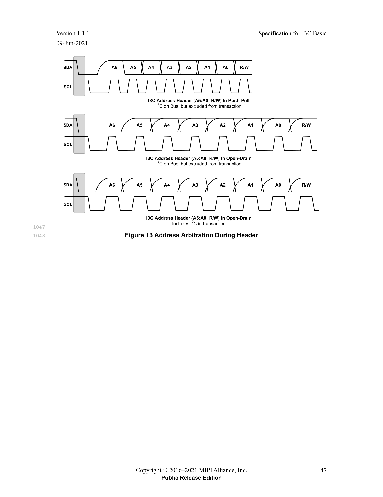

Copyright © 2016–2021 MIPI Alliance, Inc. **Public Release Edition** 

47 

Specification for I3C Basic 

Version 1.1.1 09-Jun-2021 

## **5.1.2.2.3 Consequence of Controller Starting a Frame with I3C Target Address** 

> **`1049`** The I3C Controller normally should start a Frame with 7’h7E (for all I3C Messages) or an I[2] C Static Address **`1050`** (when sending only to a Legacy I[2] C Target). 

**`1051`** In both cases the Address may be arbitrated, and so the Controller shall monitor to see whether an In-Band **`1052`** Interrupt request, a Controller Role Request (i.e., Secondary Controller requests to become the Active **`1053`** Controller), or a Hot-Join Request has been made. 

- **`1054`** • If not, then the Controller may proceed normally. 

- **`1055`** • If so, then the Controller may ACK or NACK that request and then proceed accordingly. 

- **`1056`** If the Controller chooses to start an I3C Message with an I3C Dynamic Address, then special provisions shall **`1057`** be made because that same I3C Target may be initiating an IBI or a Controller Role Request. So, one of three **`1058`** things may happen: 

- **`1059`** 1. The Addresses match, but the difference is caught on the RnW bit, and the Controller was **`1060`** initiating a Private Write (i.e., RnW = 0) while the Target was attempting to send an IBI request **`1061`** (i.e., RnW = 1). 

- **`1062`** In this case, the Controller wins (i.e., an IBI with RnW = 1 loses), and the Target shall ACK or **`1063`** NACK the Private Write. The Target shall defer its IBI, and may retry at a later opportunity. 

- **`1064`** 2. The Addresses match, but the difference is caught on the RnW bit, and the Controller was **`1065`** initiating a Private Read (i.e., RnW = 1) while the Target was attempting to send a Controller Role **`1066`** Request (i.e., RnW = 0). 

**`1067`** In this case, the Target wins (i.e., a Private Read with RnW = 1 loses), and the Controller must **`1068`** ACK or NACK the Controller Role Request. The Controller shall defer its Private Read, and may **`1069`** retry at a later opportunity. 

- **`1070`** 3. The Addresses match and the RnW bits also match, and so neither Controller nor Target will ACK **`1071`** since both are expecting the other side to provide ACK. As a result, each side might think it had **`1072`** “won” arbitration, but neither side would continue, as each would subsequently see that the other **`1073`** did not provide ACK. 

- **`1074`** a. If RnW = 0 (i.e., if the Controller was initiating a Private Write while the Target was **`1075`** attempting to send a Controller Role Request), then the Target shall defer its Controller Role **`1076`** Request, and may retry at a later opportunity. 

- **`1077`** b. If RnW = 1 (i.e., if the Controller was initiating a Private Read while the Target was **`1078`** attempting to send an IBI request), then the Target shall defer its IBI request, and may retry at **`1079`** a later opportunity. 

**`1080`** For either value of RnW: Due to the NACK, the Controller shall defer the Private Write or Private **`1081`** Read, and should typically transmit the Target Address again after a Repeated START (i.e., the **`1082`** next one or any one prior to a STOP in the Frame). Since the Address Header following a **`1083`** Repeated START is not arbitrated, the Controller will always win (see _**Section 5.1.2.2.4**_ ). **`1084`** This allows the Controller to determine whether the Target intended to provide the same RnW bit **`1085`** (i.e., which may have led to this NACK situation), or whether it may have simply chosen not to **`1086`** support this transaction. In this manner, the Controller can avoid a ‘live-lock’ situation. 

Copyright © 2016–2021 MIPI Alliance, Inc. **Public Release Edition** 

48 

Version 1.1.1 09-Jun-2021 

Specification for I3C Basic 

## **5.1.2.2.4 Address Header Following a Repeated START is Push-Pull** 

- **`1087`** The Address transmitted by the I3C Controller following a Repeated START shall not be arbitrated. That is, **`1088`** no I3C Target shall attempt to transmit its own Dynamic Address nor the reserved Hot-Join Address (i.e., **`1089`** 7’h02) following a Repeated START. 

**`1090`** As a result, the Address Header (i.e., the 7 bits of Address plus the RnW bit) shall be transmitted on SDA **`1091`** using Push-Pull mode when the Message is not to a Legacy I[2] C Target. The ACK/NACK bit that follows the **`1092`** RnW bit is always Open Drain to allow the Target to ACK or passively NACK its Address. 

## **5.1.2.2.5 I3C Target Address Restrictions** 

> **`1093`** The I3C Target Address space is dependent on decisions by the Controller. That is, the Controller may choose **`1094`** the Dynamic Addresses from a set of values, observing optional and non-optional restrictions as follows. **`1095`** These restrictions are also illustrated in _**Table 8**_ . 

- **`1096`** • The I3C Controller shall not use any of 7’h00, 7’h01, 7’h02, 7’h7E, 7’h7F. All are reserved for **`1097`** I3C. 

- **`1098`** • The I3C Controller shall not use any of 7’h3E, 7’h5E, 7’h6E, 7’h76, 7’h7A, 7’h7C, 7’h7F. All are **`1099`** prohibited since I3C Targets will interpret an I3C Address Header with any of these Addresses as a **`1100`** Broadcast Address (7’h7E) with a single-bit error. See Error Type TE0, _**Section 5.1.10.1.1**_ . 

- **`1101`** • The I3C Controller may choose to not use 7’h03, marked in I[2] C as reserved. 

- **`1102`** • The I3C Controller shall not use 7’h04, 7’h05, 7’h06, 7’h07 if any Legacy I[2] C Devices are present **`1103`** on the Bus that support I[2] C “High-Speed Mode”. 

- **`1104`** • The I3C Controller shall not use 7’h7C or 7’h7D if any Legacy I[2] C Devices are present on the Bus **`1105`** that support I[2] C Device ID Mode. 

- **`1106`** • The I3C Controller shall not use 7’h78, 7’h79, 7’h7A, 7’h7B if any Legacy I[2] C Devices are **`1107`** present on the Bus that support I[2] C Extended Address Mode and have an Extended Address or **`1108`** would be impacted by the Extended Address mechanism. 

Copyright © 2016–2021 MIPI Alliance, Inc. **Public Release Edition** 

49 

Specification for I3C Basic 

Version 1.1.1 09-Jun-2021 

```
1109
```

**Table 8 I3C Target Address Restrictions** 

|**`1109`**|**T**|**T**|**able 8 I3C Target**|**Address Restrictions**|
|---|---|---|---|---|
|**See Errata 01,**<br>**Item 4**|**Target Dynamic Address**||**Restriction**|**Description**|
||**Binary**|**Hex**|||
||**000 0000**|**7’h00**|**Shall not use**|I3C Reserved|
||**000 0001**|**7’h01**|**Shall not use**|I3C Reserved: For use with SETDASA CCC in special<br>Point-to-Point Communication. See**_Section 5.1.9.3.10_**.|
||**000 0010**|**7’h02**|**Shall not use**|I3C Reserved: Hot-Join Address|
||**000 0011**|**7’h03**|**Optional**|Marked ‘Reserved’ by I2C|
||**000 0100**|**7’h04**|**Conditional**|Available for use only if no Legacy I2C Devices supporting<br>I2C “High-Speed Mode” are present on the Bus|
||**000 0101**|**7’h05**|||
||**000 0011**|**7’h06**|||
||**000 0011**|**7’h07**|||
||**000 1000**<br>**011 1101**|**7’h08 – 7’h3D**|**Available for use**|54 Addresses|
||**011 1110**|**7’h3E**|**Shall not use**|I3C Reserved: Broadcast Address single bit error detect|
||**011 1111**<br>**101 1101**|**7’h3F – 7’h5D**|**Available for use**|31 Addresses|
||**101 1110**|**7’h5E**|**Shall not use**|I3C Reserved: Broadcast Address single bit error detect|
||**101 1111**<br>**110 1101**|**7’h5F – 7’h6D**|**Available for use**|15 Addresses|
||**110 1110**|**7’h6E**|**Shall not use**|I3C Reserved: Broadcast Address single bit error detect|
||**110 1111**<br>**111 0101**|**7’h6F – 7’h75**|**Available for use**|7 Addresses|
||**111 0110**|**7’h76**|**Shall not use**|I3C Reserved: Broadcast Address single bit error detect|
||**111 0111**|**7’h77**|**Available for use**|1 Address|
||**111 1000**|**7’h78**|**Conditional**|Available for use only if no Legacy I2C Devices are present<br>on the Bus that both a) support I2C “Extended Address<br>Mode”, and b) either have an Extended Address, or would<br>be impacted by the Extended Address mechanism|
||**111 1001**|**7’h79**|||
||**111 1010**|**7’h7A**|**Shall not use**|I3C Reserved: Broadcast Address single bit error detect|
||**111 1011**|**7’h7B**|**Conditional**|Available for use only if no Legacy I2C Devices are present<br>on the Bus that both a) support I2C “Extended Address<br>Mode”, and b) either have an Extended Address, or would<br>be impacted by the Extended Address mechanism|
||**111 1100**|**7’h7C**|**Shall not use**|I3C Reserved: Broadcast Address single bit error detect<br>(Also not available for use if any Legacy I2C Devices<br>supporting I2C “Device ID Mode” are present on the Bus.)|
||**111 1101**|**7’h7D**|**Conditional**|Available for use only if no Legacy I2C Devices supporting<br>I2C “Device ID Mode” are on the Bus|
||**111 1110**|**7’h7E**|**Shall not use**|I3C Reserved: Broadcast Address single bit error detect<br>(See Error Type TE0,**_Section 5.1.10.1.1_**.)|
||**111 1111**|**7’h7F**|**Shall not use**|I3C Reserved: Broadcast Address single bit error detect|


Copyright © 2016–2021 MIPI Alliance, Inc. **Public Release Edition** 

50 

Version 1.1.1 09-Jun-2021 

Specification for I3C Basic 

## **5.1.2.3 I3C SDR Data Words** 

> **`1110`** In I3C SDR, the Data Words match I[2] C only in the sense that they are both 9 bits long. I3C SDR Data Words **`1111`** differ from I[2] C in three ways, as detailed in _**Sub-Sections 5.1.2.3.1**_ , _**5.1.2.3.2**_ , and _**5.1.2.3.4**_ . **`1112`** In summary: 

- **`1113`** 1. **Handoff from Address ACK to SDR Controller Write Data:** When performing an SDR Write, the **`1114`** handoff from the Target’s Address Header ACK to the Controller’s first Data bit is different in I3C. **`1115`** I[2] C is Open Drain, so overlap from the ACK Low into the first bit is harmless. By contrast, I3C is **`1116`** Push-Pull and so this handoff is specified (see _**Section 5.1.2.3.1**_ ). 

- **`1117`** 2. **Ninth Bit of SDR Controller Written Data as Parity:** In I[2] C, the ninth Data bit written by the **`1118`** Controller is an ACK by the Target. By contrast, in I3C the ninth Data bit written by the Controller **`1119`** is the Parity of the preceding eight Data bits. Therefore, in I3C the Target shall not drive the SDA **`1120`** line for Data written by the Controller in SDR. In SDR terms, the ninth bit of Write data is referred **`1121`** to as the T-Bit (for ‘Transition’) (see _**Section 5.1.2.3.2**_ ). 

- **`1122`** 3. **Ninth Bit of SDR Target Returned (Read) Data as End-of-Data:** In I[2] C, the ninth Data bit from **`1123`** Target to Controller is an ACK by the Controller. By contrast, in I3C this bit allows the Target to **`1124`** end a Read, and allows the Controller to Abort a Read. In SDR terms, the ninth bit of Read data is **`1125`** referred to as the T-Bit (for ‘Transition’) (see _**Section 5.1.2.3.4**_ ). 

- **`1126`** _**Note:**_ 

- **`1127`** _A Target should have an SDA Read detector that determines if the SCL clock has not changed for_ **`1128`** _100 µs or more, so that it can abandon the read by switching SDA to High-Z and waiting for_ **`1129`** _Repeated START or STOP._ 

## **5.1.2.3.1 Transition from Address ACK to SDR Controller Write Data** 

> **`1130`** The end of any Address Header (whether Arbitrated or not) is an ACK or NACK by the one or more addressed **`1131`** Targets, using Open Drain on SDA: 

- **`1132`** • If 7’h7E, then it is the ACK of all I3C Targets on the Bus. 

- **`1133`** • If a single Target Address, then it is the ACK (or NACK) of the addressed Target, or a NACK if no **`1134`** such Target is on the Bus. 

**`1135`** When the Address Header results in an ACK, and the Message is SDR Write from Controller, the SDA line **`1136`** has to be turned from Open Drain to Push-Pull for the first data bit. To do that safely, I3C SDR specifies how **`1137`** the handoff is to occur. This is summarized below and shown in _**Figure 142**_ . 

- **`1138`** 1. The I3C Target shall hold the SDA line Low during the ACK (while SCL is Low). 

- **`1139`** • This shall be an Open Drain SCL Low period. 

- **`1140`** 2. After the I3C Target sees the rising edge of SCL, it releases the SDA line to High-Z. 

- **`1141`** • The I3C Target shall release the SDA line using normal (Push-Pull) timing (release the SDA **`1142`** line as soon as it sees SCL rising). 

- **`1143`** 3. After the rising edge of SCL, the I3C Controller shall drive the SDA line Low. 

- **`1144`** • As a result, both Controller and Target will be driving the SDA line Low for a short overlap **`1145`** (which is safe). 

- **`1146`** • The SCL High period may be as short as the minimal tDIG_H, per _**Section 6.2**_ . 

- **`1147`** 4. On the falling edge of SCL the I3C Controller shall begin driving data on the SDA line, using **`1148`** Push-Pull drive as shown in _**Figure 142**_ . 

**`1149`** When the Address Header results in a NACK, the Controller may choose to: 

**`1150` either:** 

- **`1151`** 1. Continue the transaction, by generating a Repeated START 

**`1152` or:** 

- **`1153`** 2. Relinquish the Bus, by generating a STOP as shown in _**Figure 143**_ . 

Copyright © 2016–2021 MIPI Alliance, Inc. **Public Release Edition** 

51 

Specification for I3C Basic 

Version 1.1.1 09-Jun-2021 

## **5.1.2.3.2 Transition from Address ACK to Mandatory Byte during IBI** 

> **`1154`** The end of any IBI Address Header during an IBI request (whether the Address Header is Arbitrated or not) **`1155`** is either an ACK or a NACK by the Controller, using Open Drain on SDA. 

**`1156`** If the Controller detects one of the Target Addresses, and if the Controller chooses to receive the request, then **`1157`** the Controller will ACK the request per _**Section 5.1.6.2**_ . 

- **`1158`** • **ACK:** When the IBI Target Address Header results in an ACK, and the Target Device is capable of **`1159`** sending a Mandatory Byte, then the SDA line has to be turned from Open Drain to Push-Pull for **`1160`** the first data bit. To do that safely, I3C SDR specifies how the handoff is to occur. This is **`1161`** summarized below and shown in _**Figure 14**_ . 

- **`1162`** 1. The I3C Controller shall hold the SDA line Low during the ACK (i.e., while the SCL line is **`1163`** Low). This shall be an Open Drain SCL Low period. 

- **`1164`** 2. After the rising edge of the SCL line, the I3C Target shall drive the SDA line Low as soon as **`1165`** possible. As a result, both Controller and Target will be driving the SDA line Low for a short **`1166`** overlap (which is safe). 

- **`1167`** 3. After (A) a minimum of the tSCO time reported by the Target Device, (B) a predetermined safe **`1168`** time that could guarantee the takeover by all Targets, or (C) the Controller may optionally **`1169`** keep the SDA line Low until the next falling edge of the SCL line in order to be in full control **`1170`** of the SDA line and make sure it accommodates all tSCO values from different Targets, the I3C **`1171`** Controller may release the SDA line. The SCL High period may be as short as the minimal **`1172`** tDIG_H, per _**Section 6.2**_ . 

- **`1173`** 4. On the falling edge of SCL, the I3C Target shall begin driving data on the SDA line, using **`1174`** Push-Pull drive as shown in _**Figure 14**_ . 

- **`1175`** • **NACK:** When the Address Header results in a NACK, as shown in _**Figure 15**_ , the Controller may **`1176`** choose to: 

```
1177
```

## **either:** 

- **`1178`** • Continue the transaction, by generating a Repeated START, 

**`1179` or:** 

- **`1180`** • Relinquish the Bus by generating a STOP. 

Copyright © 2016–2021 MIPI Alliance, Inc. **Public Release Edition** 

52 

Version 1.1.1 09-Jun-2021 

Specification for I3C Basic 

**==> picture [538 x 349] intentionally omitted <==**

**----- Start of picture text -----**<br>
SDR Transfer<br>SDA A6 A5 A0 RnW ACK D7 D6 D0 T 0.7 X VDD<br>0.3 X VDD<br>SCL C1 C2 C7 C8 C9 C1 C2 C8 C9 0.7 X VDD<br>0.3 X VDD<br>= Open-Drain Pull-Up class Transition from  SCL clocks are shown identical for OD and PP<br>Open-Drain to  even though they differ substantially<br>= High Speed Active Push-Pull Drive Push-Pull<br>0.7 X VDD<br>SDA RnW ACK D7 D6<br>0.3 X VDD<br>CR_SDA 0.7 X VDD<br>0.3 X VDD<br>0.7 X VDD<br>TGT_SDA<br>0.3 X VDD<br>0.7 X VDD<br>SCL C8 C9 C1 C2 0.3 X VDD<br>Open-Drain<br>Timing  tSCO* tSCO* tSCO* Push-Pull Push-Pull<br>parameters used >tSCO* or Push-PullOpen-Drain  >tSCO* or Push-PullOpen-Drain<br>NOTE:<br>= Active Drive by Controller or Target<br>Open-Drain: Controller drives and then releases SDA after a<br>suitable delay from SCL edges  = Open-Drain Pull-Up class by Controller<br>= High-Z by Controller<br>Push-Pull: Target drives SDA after its tSCO from SCL edges = High-Z by Target<br>**----- End of picture text -----**<br>


_*tSCO is depicted for informative purposes only_ 

```
1181
1182
```

**Figure 14 Transition from Address ACK to Mandatory Byte During IBI** 

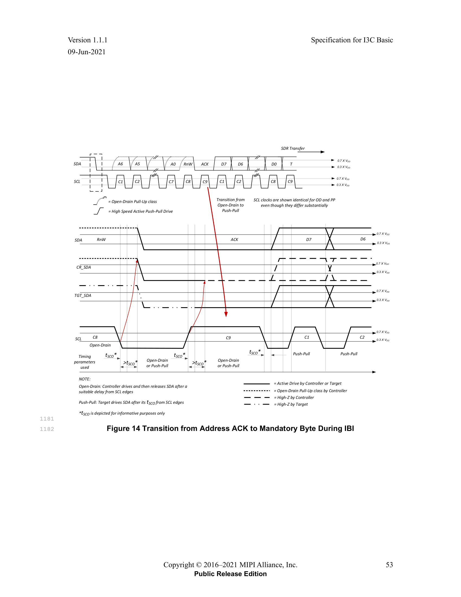

Copyright © 2016–2021 MIPI Alliance, Inc. **Public Release Edition** 

53 

Specification for I3C Basic 

Version 1.1.1 09-Jun-2021 

**==> picture [416 x 443] intentionally omitted <==**

**----- Start of picture text -----**<br>
STOP<br>SDA A6 A5 A0 RnW NACK Repeated START0.3 X V0.7 X VDDDD<br>SCL C9 0.3 X V0.7 X VDDDD<br>Transition from<br>= Open-Drain Pull-Up class<br>Open-Drain to<br>= High Speed Active Push-Pull Drive Push-Pull<br>0.7 X VDD<br>SDA 0.3 X VDD<br>0.7 X VDD<br>CR_SDA<br>0.3 X VDD<br>0.7 X VDD<br>TGT_SDA<br>0.3 X VDD<br>0.7 X VDD<br>SCL C9 0.3 X VDD<br>Open-Drain<br>Timing  Open-Drain  Push-Pull Push-Pull<br>parameters used or Push-Pull tSU_PP<br>NOTE:<br>Open-Drain: Controller releases SDA after a  = Active Drive by Controller or Target<br>suitable delay from SCL edges<br>= Open-Drain Pull-Up class by Controller<br>Push-Pull: Controller drives SDA after a<br>= High-Z by Target<br>suitable delay from SCL edges<br>= Controller drives Push-Pull HIGH,<br>prepares for Repeated START<br>= Master drives Push-Pull LOW,<br>prepares for STOP<br>**----- End of picture text -----**<br>


**`1183 1184` Figure 15 Transition from IBI Address NACK to Repeated START or STOP** 

Copyright © 2016–2021 MIPI Alliance, Inc. **Public Release Edition** 

54 

Version 1.1.1 09-Jun-2021 

Specification for I3C Basic 

## **5.1.2.3.3 Ninth Bit of SDR Controller Written Data as Parity** 

- **`1185`** The ninth data bit of each SDR Data Word written by the I3C Controller (also referred to as the T-Bit) is a **`1186`** Parity bit, calculated using odd parity. Parity can help in detecting noise-caused errors on the line. The value **`1187`** of this Parity bit shall be the XOR of the 8 Data bits with 1, i.e.: XOR( Data[7:0], 1 ). 

## **`1188` Examples** 

- **`1189`** • If all eight data bits are 1’s (0xFF), then the Parity bit value will be 1. 

- **`1190`** • If all eight data bits are 0’s (0x00), then the Parity bit value will be 1. 

- **`1191`** • If an odd number of bits in the Data Word are 1’s (e.g., 0xFE or 0x01), then the Parity bit value **`1192`** will be 0. 

- **`1193`** T (Parity) bit writes shall always be kept valid through the SCL High period. In the case of a T-Bit **`1194`** representing the last data byte, the write is therefore kept valid through the SCL High period, and the next 

- **`1195`** SCL Low can then be used to either change the SDA, or not change the SDA, in preparation for the Repeated **`1196`** START or STOP that follows. 

Copyright © 2016–2021 MIPI Alliance, Inc. **Public Release Edition** 

55 

Specification for I3C Basic 

Version 1.1.1 09-Jun-2021 

## **5.1.2.3.4 Ninth Bit of SDR Target Returned (Read) Data as End-of-Data** 

> **`1197`** In I[2] C, Read from Target has the issue that only the Controller ends the Read, so the Target has no ability to **`1198`** control the amount of data it returns. In I3C SDR, by contrast, the Target controls the number of data Words **`1199`** it returns; but it also allows the I3C Controller to abort the Read prematurely when necessary. 

**`1200`** This mechanism is controlled purely by the ninth (T) Data bit of each SDR Data Word returned by the I3C **`1201`** Target. The ninth bit is returned by the Target in one of three ways, as explained below. 

```
1202
```

   - The I3C Target returns the ninth bit as 0 (SDA Low) to end the Message: 

- **`1203`** • The Target shall set SDA Low on the falling edge of SCL. **`1204`** • On the following rising edge of SCL, the Target shall set SDA to High-Z. **`1205`** • The I3C Controller shall drive SDA Low on the rising edge of SCL, thereby overlapping with **`1206`** the Target. 

- **`1207`** • The I3C Controller then shall issue either a STOP as shown in _**Figure 150**_ , or a Repeated **`1208`** START as shown in _**Figure 151**_ (on the next clock, or one after, per the normal I[2] C procedure **`1209`** for setting up SDA to issue a Repeated START). 

- **`1210`** • The I3C Target returns the ninth bit as 1 (SDA High) to continue the Message (and permit the **`1211`** Controller to abort the Message): 

- **`1212`** • The Target shall set SDA High on the falling edge of SCL. 

- **`1213`** • On the following rising edge of SCL, the Target shall set SDA to High-Z, thereby Parking the **`1214`** Bus for the SCL High period: 

- **`1215`** • If the I3C Controller is able to continue the reply from the Target, then it shall do nothing. **`1216`** The weak Pull-Up resistor on SDA will keep SDA High during the SCL High period, as **`1217`** shown in _**Figure 152**_ . 

- **`1218`** • If the I3C Controller wants to abort the Message, then it shall drive SDA Low after the **`1219`** rising edge of SCL, thereby terminating the Message with a Repeated START. The I3C **`1220`** Controller then takes control starting with the falling edge of SCL. The Controller shall **`1221`** ensure enough delay after SCL rising before driving SDA Low to ensure no contention. In **`1222`** order to achieve this delay, the Controller might have to extend the SCL High period. **`1223`** Since the transition of SDA Low when SCL is High is a Repeated START, the Controller **`1224`** may begin a new Address (see _**Figure 154**_ ), or it may issue a STOP in the next cycle (see **`1225`** _**Figure 153**_ ). However in a Mixed Bus the Controller should extend the SCL Low period, **`1226`** in order to ensure that any Spike Filters for Legacy I[2] C Devices properly reset. 

- **`1227`** • The Target shall monitor the SDA on the falling edge of SCL: 

      - If SDA is High, then the Target shall continue with the next data value. 

**`1228`**  If SDA is High, then the Target shall continue with the next data value. **`1229`** • If SDA is Low (i.e., if there has been a Repeated START), then the Message has been **`1230`** aborted, and the Target shall not drive SDA after that. 

Copyright © 2016–2021 MIPI Alliance, Inc. **Public Release Edition** 

56 

Version 1.1.1 09-Jun-2021 

Specification for I3C Basic 

## **5.1.2.4 Use of Clock Speed to Prevent Legacy I[2] C Devices from Seeing I3C Traffic** 

> **`1231`** In a system, there are three possible I3C Bus Configurations: 

- **`1232`** 1. **Pure Bus:** Only I3C Devices are present on the Bus. 

- **`1233`** 2. **Mixed Fast Bus:** Both I3C Devices and Legacy I[2] C Devices are present on the Bus, such that the **`1234`** Legacy I[2] C Devices are restricted to ones that are generally permissible (i.e., Target-only, and no **`1235`** Target clock stretching), and that have a true I[2] C 50 ns Spike Filter on SCL. (I.e., I[2] C Devices that **`1236`** do not ‘see’ the SCL line as High when the High duration is less than 50 ns, across all **`1237`** temperatures and processes.) 

- **`1238`** 3. **Mixed Slow/Limited Bus:** Both I3C Devices and Legacy I[2] C Devices are present on the Bus, such **`1239`** that the Legacy I[2] C Devices are restricted to ones that are generally permissible (i.e., Target-only, **`1240`** and no Target clock stretching), but that do not have a true I[2] C 50 ns Spike Filter on SCL. 

**`1241`** The Bus designer’s choice of Bus Configuration affects what speed options are available for I3C SDR, as **`1242`** well as what HDR Modes are possible at various clock speeds. _**Table 9**_ shows the possible options for each **`1243`** Bus Configuration. 

**`1244` Table 9 Available Options for Bus Operating Parameters, Per I3C Bus Configuration** 

|**Bus Operating**<br>**Parameter**|**Available Options Per Bus Configuration**|**Available Options Per Bus Configuration**|**Available Options Per Bus Configuration**|
|---|---|---|---|
||**Pure Bus**|**Mixed Fast Bus**|**Mixed Slow /**<br>**Limited Bus**|
|**SDR Mode Speed**|fSCL(Min) to fSCL(Max)|I2C Messages: Fm or Fm+,<br>I3C Messages: SCL High from<br>tDIG_H_MIXED(Min) to tDIG_H_MIXED(Max)<br>(see**_Section 5.1.2.4.1_**)|Fm or Fm+<br>only1|
|**HDR-DDR Mode**|fSCL(Min) to fSCL(Max)|SCL High from tDIG_H_MIXED(Min) to<br>tDIG_H_MIXED(Max)<br>(see**_Section 5.1.2.4.1_**)|No|
|**HDR-TSP Mode**|HDR-TSP Mode is not included in I3C Basic||No|
|**HDR-TSL Mode**|HDR-TSL Mode is not included in I3C Basic||No|
|**HDR-BT Mode**|fSCL(Min) to fSCL(Max)|SCL High from tDIG_H_MIXED(Min)<br>to tDIG_H_MIXED(Max)<br>(see**_Section 5.1.2.4.1_**)|No|
|**_Note:_**<br>_1)_<br>_May be faster if all Legacy I2C Devices are index 1, per_**_Table 4_**||||


Copyright © 2016–2021 MIPI Alliance, Inc. **Public Release Edition** 

57 

Specification for I3C Basic 

Version 1.1.1 09-Jun-2021 

## **5.1.2.4.1 Use of Duty Cycle to Achieve Lower Effective Speed in a Mixed Fast Bus** 

> **`1245`** An I3C Pure Bus may simply change the clock speed to any frequency in the allowed speed range, as outlined **`1246`** in _**Section 6**_ . By contrast, a Mixed Fast Bus wanting to clock faster than the slowest Legacy I[2] C Device needs **`1247`** to take advantage of the Spike Filter, i.e., shall ensure that the SCL High period is shorter than the Spike **`1248`** Filter, in order to prevent the Legacy I[2] C Devices from seeing the SCL High period (see tDIG_H_MIXED in _**Table**_ **`1249`** _**87**_ ). As a result, the Legacy I[2] C Device ‘sees’ the SCL as staying Low the whole period. 

**`1250`** However, a Mixed Fast Bus I3C Controller can change the effective Bus frequency by varying the duty-cycle **`1251`** of SCL. This allows running the data rate slower, for example to accommodate Targets that need a lower rate **`1252`** as defined by GETMXDS CCC (see _**Section 5.1.9.3.18**_ ). It may also be necessary to accommodate Legacy **`1253`** I[2] C Devices with Spike Filters that need a longer Low period in order to function properly. 

**`1254`** In this model the SCL High period shall never exceed tDIG_H_MIXED, thus staying below the 50 ns required by **`1255`** the I[2] C Spike Filter; however, the Low period is free to be any length permitted by I3C’s allowed clock **`1256`** frequency range. For example, depending on the clock generation capability of the I3C Controller, the SCL **`1257`** Low period may be a multiple of the High period, or it may be any multiple of some higher frequency clock **`1258`** capable of providing a High period less than or equal to tDIG_H_MIXED, but greater than the minimum SCL High **`1259`** period as defined in _**Table 85**_ . 

**`1260` Example 1:** An SCL High period of 40 ns, plus a Low period of 280 ns, yields a total clock period of 320 ns **`1261`** which corresponds to a frequency of 3.125 MHz. 

**`1262` Example 2:** In order to ensure that the Legacy I[2] C Device Spike Filters continue tracking SCL as Low, an **`1263`** SCL High period of 40 ns could be used with a Low period of 80 ns, yielding a total clock period of 120 ns **`1264`** which corresponds to a frequency of 8.3 MHz. 

**`1265`** Such adjustment of the clock Duty Cycle brings three benefits: 

- **`1266`** • It remains hidden from Legacy I[2] C Devices, while still significantly increasing the SDR, **`1267`** HDR-DDR, and HDR-BT data rate. 

- **`1268`** • It ensures a longer Low period, so that Legacy I[2] C Device Spike Filters continue to track SCL as **`1269`** Low. 

- **`1270`** • It is easy for a Controller to generate, and has no impact on I3C Targets (which just react to clock **`1271`** edges). 

**`1272`** This model works because all I3C Targets must be able to accommodate 12.5 MHz as a clock rate, so the **`1273`** shorter High period will not impact them. 

**`1274`** Note that this Duty Cycle technique does not resolve issues of long Buses with high line capacitance. This is **`1275`** because the short High period may be insufficient for SDA propagation, even if the Low period is long **`1276`** enough. 

Copyright © 2016–2021 MIPI Alliance, Inc. **Public Release Edition** 

58 

Version 1.1.1 09-Jun-2021 

Specification for I3C Basic 

## **5.1.2.5 Controller Clock Stalling** 

> **`1277`** In SDR Mode the I3C Controller may Stall the I3C Bus during the SCL Low period, but only under the **`1278`** specific, transitory conditions described in this Section. 

**`1279`** Stalling may be necessary for either of two reasons: 

- **`1280`** 1. The absolute or relative timing of a Message to a specific Target, or to all Targets, needs to be **`1281`** carefully controlled. Clock Stalling provides the Controller with fine-grained data timing control. 

- **`1282`** 2. The I3C Controller needs to internally synchronize data. This may be due to parts of the **`1283`** Controller’s system waking up in response to data, to changing state, or to otherwise needing time **`1284`** during a transaction. 

**`1285`** Note that Stalling impacts Bus performance. For example, it will reduce the Bus capacity and increase the **`1286`** latency of any Devices issuing In-Band Interrupts. 

**`1287`** To Stall the Bus, the I3C Controller shall hold SCL Low while the Bus is in one of the four following **`1288`** conditions, each of which is detailed below: 

- **`1289`** 1. I3C/I[2] C Transfer, ACK/NACK Phase 

- **`1290`** 2. Write Data Transfer, Parity Bit 

- **`1291`** 3. I3C Read Transfer, Transition Bit 

- **`1292`** 4. Dynamic Address Assignment, First Bit of Assigned Address 

**`1293`** The maximum Stall time (SCL Low period) shall be 15 ms; note, this is an absolute maximum. The Controller **`1294`** should use the shortest Stall duration possible given current circumstances, per _**Table 10**_ . 

```
1295
```

## **Table 10 Controller Clock Stall Times** 

|**Condition**|**Section**|**Maximum**<br>**Stall Time**|
|---|---|---|
|I3C/I2C Transfer, ACK/NACK Phase|**_5.1.2.5.1_**|100 µs|
|Write Data Transfer, Parity Bit|**_5.1.2.5.2_**|100 µs|
|I3C Read Transfer, Transition Bit|**_5.1.2.5.3_**|100 µs|
|Dynamic Address Assignment, First Bit of Assigned Address|**_5.1.2.5.4_**|15 ms|


**`1296`** In all cases, after Stalling the SCL Low period, the continuation of the clock (i.e., the first SCL rising edge **`1297`** after the extended Low period) shall follow the normal rules for I3C SDR (for I3C SDR Messages), or for **`1298`** I[2] C (for I[2] C Messages) including rise time, change in SDA (if any) before SCL rise, next bit, etc. For example, **`1299`** the I3C Controller might choose to terminate the Frame after this Stalled bit with a STOP; but in this case **`1300`** the Controller is required to observe the requirements for STOP timing, as appropriate. 

**`1301`** It is recommended to use Controller Clock Stalling only when necessary and unavoidable. In all other **`1302`** circumstances the Controller should avoid Controller Clock Stalling because of its negative impacts on Bus **`1303`** performance. In order to help guide system designers, Data Sheets for I3C Controller Devices should include **`1304`** appropriately detailed SCL Stalling parameters. 

Copyright © 2016–2021 MIPI Alliance, Inc. **Public Release Edition** 

59 

Specification for I3C Basic 

Version 1.1.1 09-Jun-2021 

## **5.1.2.5.1 I3C/I[2] C Transfer, ACK/NACK Phase** 

> **`1305`** Controller Clock Stalling during the ACK/NACK phase of the I3C/I[2] C transfer (see _**Figure 16**_ ) indicates one **`1306`** of the following: 

- **`1307`** • The Controller can allow the I3C/I[2] C Target to prepare to receive data (for write transfers) or **`1308`** transmit data (for read transfers) 

- **`1309`** • The Controller can Stall SCL during write or read transfers to Legacy I[2] C Targets in case of **`1310`** underrun and overflow situations 

- **`1311`** • The Controller can Stall the clock during the ACK/NACK phase of the incoming In-Band **`1312`** Interrupt (Target Interrupt Request or Controller Role Request), to decide whether to ACK or **`1313`** NACK depending upon the incoming In-Band Interrupt **`1314`** • The Controller can allow the Target to respond with data for the directed GET CCC commands if **`1315`** the Target is not ready with the CCC data to be returned 

**==> picture [281 x 143] intentionally omitted <==**

**----- Start of picture text -----**<br>
ACK/<br>A0 RnW<br>NACK<br>SDA<br>C7 C8 C9<br>SCL<br>Target on Open-Drain mode<br>Controller drives Push-Pull<br>Controller extends SCL LOW<br>**----- End of picture text -----**<br>


**`1316 1317` Figure 16 Controller Clock Stalling in ACK Phase** 

## **5.1.2.5.2 Write Data Transfer, Parity Bit** 

> **`1318`** The Controller can Stall SCL between data bytes of an I3C Write Data transfer, by Stalling the clock during **`1319`** the Low period of the Parity Bit, in case of underrun situations. See _**Figure 17**_ . 

**==> picture [277 x 124] intentionally omitted <==**

**----- Start of picture text -----**<br>
D0 T<br>SDA<br>C8 C9<br>SCL<br>Controller drives Push-Pull<br>Controller extends SCL LOW<br>**----- End of picture text -----**<br>


```
1320
1321
```

## **Figure 17 Controller Clock Stalling in Write Parity Bit** 

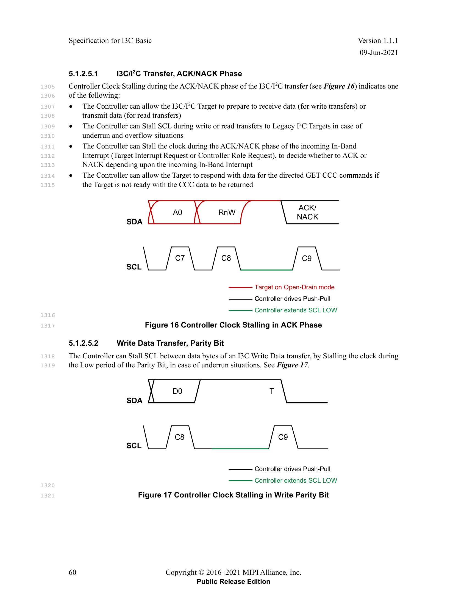

Copyright © 2016–2021 MIPI Alliance, Inc. **Public Release Edition** 

60 

Version 1.1.1 09-Jun-2021 

Specification for I3C Basic 

## **5.1.2.5.3 I3C Read Transfer, Transition Bit** 

> **`1322`** The Controller can Stall SCL between data bytes of an I3C Read Data transfer, or before terminating, by **`1323`** Stalling the clock during the Low period of the Transition Bit, in case of overflow situations. See _**Figure 18**_ **`1324`** through _**Figure 22**_ . 

**==> picture [302 x 136] intentionally omitted <==**

**----- Start of picture text -----**<br>
D0 T D7<br>SDA<br>C8 C9 C1<br>SCL<br>Target drives Push-Pull<br>Controller drives Push-Pull<br>Controller extends SCL LOW<br>**----- End of picture text -----**<br>


```
1325
1326
```

**Figure 18 Controller Clock Stalling in T-Bit Before Next Read Data** 

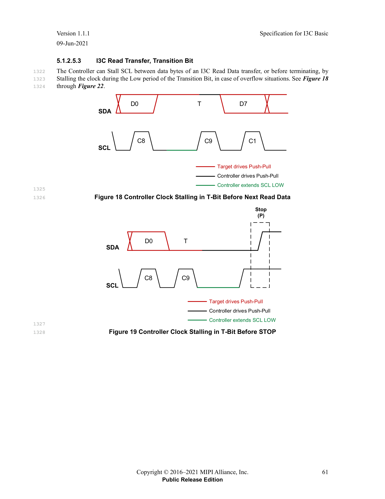

**==> picture [279 x 182] intentionally omitted <==**

**----- Start of picture text -----**<br>
Stop<br>(P)<br>D0 T<br>SDA<br>C8 C9<br>SCL<br>Target drives Push-Pull<br>Controller drives Push-Pull<br>Controller extends SCL LOW<br>**----- End of picture text -----**<br>


```
1327
1328
```

**Figure 19 Controller Clock Stalling in T-Bit Before STOP** 


Copyright © 2016–2021 MIPI Alliance, Inc. **Public Release Edition** 

61 

Specification for I3C Basic 

Version 1.1.1 09-Jun-2021 

**==> picture [275 x 190] intentionally omitted <==**

**----- Start of picture text -----**<br>
Repeated<br>START<br>(Sr)<br>D0 T<br>SDA<br>C8 C9<br>SCL<br>Target drives Push-Pull<br>Controller drives Push-Pull<br>Controller extends SCL LOW<br>**----- End of picture text -----**<br>


**`1329 1330` Figure 20 Controller Clock Stalling in Low T-Bit Before Repeated START** 

**==> picture [295 x 177] intentionally omitted <==**

**----- Start of picture text -----**<br>
Repeated<br>START (Sr)<br>D0 T<br>SDA<br>C8 C9<br>SCL<br>Target drives Push-Pull<br>Controller drives Push-Pull<br>Controller extends SCL LOW<br>**----- End of picture text -----**<br>


**`1331 1332` Figure 21 Controller Clock Stalling in High T-Bit Before Repeated START** 

Copyright © 2016–2021 MIPI Alliance, Inc. **Public Release Edition** 

62 

Version 1.1.1 09-Jun-2021 

Specification for I3C Basic 

**==> picture [295 x 178] intentionally omitted <==**

**----- Start of picture text -----**<br>
Repeated  STOP<br>START (Sr) (P)<br>D0 T<br>SDA<br>C8 C9<br>SCL<br>Target drives Push-Pull<br>Controller drives Push-Pull<br>Controller extends SCL LOW<br>**----- End of picture text -----**<br>


## **`1333 1334` Figure 22 Controller Clock Stalling in High T-Bit Before Repeated START and STOP** 

## **5.1.2.5.4 Dynamic Address Assignment, First Bit of Assigned Address** 

> **`1335`** The Controller can Stall SCL during the Low period of the first bit of the Assigned Address phase of the **`1336`** Enter Dynamic Address Assignment CCC command (ENTDAA, see _**Section 5.1.9.3.4**_ ), for example to gain **`1337`** time to assign the Dynamic Address to the Device based on the Target’s Bus Characteristics Register BCR **`1338`** (see _**Section 5.1.1.2.1**_ ) and Device Characteristics Register DCR (see _**Section 5.1.1.2.2**_ ) bytes. See _**Figure**_ **`1339`** _**23**_ . 

**==> picture [309 x 131] intentionally omitted <==**

**----- Start of picture text -----**<br>
DCR[1] DCR[0] DA[6] DA[5]<br>SDA<br>C63 C64 C1<br>SCL<br>Target on Open-Drain mode<br>Controller drives Push-Pull<br>Controller extends SCL LOW<br>**----- End of picture text -----**<br>


**`1340 1341` Figure 23 Controller Clock Stalling in Dynamic Address First Bit** 

Copyright © 2016–2021 MIPI Alliance, Inc. **Public Release Edition** 

63 

Specification for I3C Basic 

Version 1.1.1 09-Jun-2021 

## **5.1.3 Bus Conditions** 

> **`1342`** This Specification defines Open Drain Pull-Up and High-Keeper, as well as three distinct conditions in which **`1343`** the I3C Bus shall be considered inactive: Bus Free, Bus Available, and Bus Idle. 

## **5.1.3.1 Open Drain Pull-Up and High-Keeper** 

> **`1344`** I3C Controller Devices shall provide an active Open Drain class Pull-Up, to be engaged whenever the Bus **`1345`** is in Open Drain mode (with exceptions, detailed below, where a weak Pull-Up may be used). 

**`1346`** This active Pull-Up shall be implemented either: 

- **`1347`** 1. As a passive resistance from VDD, or 

- **`1348`** 2. As a passive resistance from a current source, or 

- **`1349`** 3. In any other method that both: 

- **`1350`** a. Balances its current sourcing in order to ensure that SDA rises within trDA (see _**Table 85**_ ), and 

- **`1351`** b. Is not so strong as to prevent a Target with the minimum IOL driver (see _**Table 82**_ ) from **`1352`** driving SDA Low within trDA (see _**Table 85**_ ). 

**`1353`** In addition to the active Open Drain class Pull-Up, a High-Keeper is also required on the Bus. A High-Keeper **`1354`** is generally used for a Controller-to-Target or Target-to-Controller handoff, and for optional termination uses **`1355`** where the Controller can signal a termination by driving SDA Low while Parked High. 

**`1356`** The High-Keeper on the Bus shall be strong enough to prevent system leakage (i.e., the sum of the leakage **`1357`** of all Devices on the Bus) from pulling SDA, and sometimes SCL, Low. The High-Keeper on the Bus shall **`1358`** also be weak enough that a Target with the minimum IOL driver (see _**Table 82**_ ) is able to pull SDA, SCL, or **`1359`** both Low within the Minimum tDIG_L period. 

**`1360`** The Controller may provide the High-Keeper on the Bus. If the Controller does so, then the Controller shall **`1361`** also provide a way to disable its High-Keeper. Reasons to disable a Controller-provided High-Keeper might **`1362`** include that the High-Keeper is not strong enough for the present system leakage, or other reasons. 

**`1363`** A Controller-provided High-Keeper may optionally be implemented using a single, common Pull-Up Device **`1364`** capable of supporting both the active Open Drain class Pull-Up function and the weak High-Keeper class **`1365`** Pull-Up function. 

**`1366`** Whether implemented as a single combined Pull-Up, or as two separate Pull-Ups, the Controller should **`1367`** switch SCL and SDA, each independently, between three Pull-Up states as needed, based on Bus state: 

- **`1368`** 1. No Pull-Up (High-Z) 

- **`1369`** 2. High-Keeper Pull-Up 

- **`1370`** 3. Open Drain Pull-Up 

**`1371`** The Bus shall have High-Keepers on SDA and SCL. When adequate High-Keepers cannot be provided by **`1372`** the Controller, then the system designer is required to handle this externally. Reasons why the Controller **`1373`** would be unable to provide adequate High-Keepers might include that the Controller does not support High- **`1374`** Keepers, that the Controller-provided High-Keepers are not strong enough for present needs, or that the Bus **`1375`** is too long to use the Controller-provided High-Keepers. 

**`1376`** The system High-Keepers on SCL and SDA may be implemented as one or more passive resistors tied to **`1377`** VDD, or they may be active Bus-Keeper Devices that turn off when the respective line is pulled below some **`1378`** threshold. The system High-Keepers on SCL and SDA shall be sized so as to balance between system leakage **`1379`** and the requirement that I3C Devices be able to pull the corresponding line Low within the tDIG_L period. **`1380`** _**Note:**_ 

**`1381`** _The Controller may choose to not use the Open Drain class Pull-Up in cases of Open Drain mode_ **`1382`** _where the SDA happens to be already High (i.e., is coming into the SCL Falling edge). In that case,_ **`1383`** _the Controller may choose to rely solely upon the High-Keeper, in order to use less power if and when_ **`1384`** _a Target drives SDA Low._ 

Copyright © 2016–2021 MIPI Alliance, Inc. **Public Release Edition** 

64 

Version 1.1.1 09-Jun-2021 

Specification for I3C Basic 

## **5.1.3.2 Bus Condition Timing** 

> **`1385`** After a STOP, three defined timing conditions are used to create permission for a Controller or a Target to **`1386`** take defined actions leading to a START: the Bus Free Condition, the Bus Available Condition, and the Bus **`1387`** Idle Condition. _**Figure 24**_ illustrates timing for each condition, and each condition is detailed in a sub-section **`1388`** below. 

**`1389 1390`** 

**==> picture [399 x 273] intentionally omitted <==**

**----- Start of picture text -----**<br>
Target recognizes the Bus Idle and<br>If Hot-Joining I3C Device wakes up  can Hot-Join, because SDA and SCL<br>at this point in time, it then starts to<br>are High for more than tIDLE (i.e., it<br>measure Bus condition (i.e., it does  does not need to see the STOP to do<br>not need to detect STOP).<br>this).<br>a eS<br>STOP  tIDLE START<br>Condition  Condition<br>Detect Detect<br>0.7 x VDD<br>SDA<br>0 .3 x VDD<br>SCL<br>tIDLE = 200 µS<br>Bus Idle Condition<br>tAVAL = 1.0 µS<br>Note:<br>Durations<br>Bus Available Condition<br>not drawn to<br>scale<br>tBUF = 1.3 µS<br>tBUF = 0.5 µS Bus Free Condition  for Mixed Bus with I [2] C FM Device<br>Bus Free Condition  for Mixed Bus with I [2] C FM+ Device<br>tCAS = 38.4 nS<br>Bus Free Condition  for Pure Bus<br>Figure 24 Bus Condition Timing<br>**----- End of picture text -----**<br>


## **5.1.3.2.1 Bus Free Condition** 

> **`1391`** The Bus Free Condition is defined as a period occurring after a STOP and before a START, and with the **`1392`** following duration: 

- **`1393`** • **For Pure Bus:** A duration of at least tCAS (see _**Table 86**_ ). 

- **`1394`** • **For Mixed Bus** (i.e., at least one Legacy I[2] C Device is present on the I3C Bus) **:** A duration of at **`1395`** least tBUF (see _**Table 85**_ ). Note that the value of tBUF depends upon whether any I[2] C FM Devices vs. **`1396`** I[2] C FM+ Devices are present on the Mixed Bus. 

## **5.1.3.2.2 Bus Available Condition** 

> **`1397`** The Bus Available Condition is defined as a period during which the Bus Free Condition is sustained **`1398`** continuously for a duration of at least **tAVAL** (see _**Table 86**_ ). A Target may only issue a START Request (e.g., **`1399`** for an In-Band Interrupt, or for a Controller Role Request) after a Bus Available Condition. 

## **5.1.3.2.3 Bus Idle Condition** 

> **`1400`** The I3C Bus Idle Condition is defined in order to help ensure Bus stability during Hot-Join events, and is **`1401`** defined as a period during which the SDA and SCL lines both sustain High level for a duration of at least **`1402`** tIDLE (see _**Table 86**_ ). 

Copyright © 2016–2021 MIPI Alliance, Inc. **Public Release Edition** 

65 

Specification for I3C Basic 

Version 1.1.1 09-Jun-2021 

## **5.1.3.3 Activity States** 

> **`1403`** I3C provides a mechanism for the Controller to inform Targets about expected upcoming levels of activity **`1404`** on the I3C Bus, in order to help the Targets better manage their internal states. Four Activity State levels from **`1405`** 0 through 3 are defined (see _**Table 11**_ ). **`1406`** 

## **Table 11 Activity States** 

||**Table 11 Activity States**||
|---|---|---|
|**Activity State**|**Activity Interval**|**CCC**|
|0|1 µs|ENTAS0|
|1|100 µs|ENTAS1|
|2|2 ms|ENTAS2|
|3|50 ms|ENTAS3|


**`1407`** The Activity State number serves as a hint to the Target, indicating how long it will be before the Controller **`1408`** directs Bus activity to that Target, and the likely latencies to expect in response to the Target pulling SDA **`1409`** Low (i.e., for the START Request to then generate an In-Band Interrupt Request or a Controller Role **`1410`** Request). 

**`1411`** The Controller uses CCC commands ENTAS0, ENTAS1, ENTAS2, and ENTAS3 (see _**Section 5.1.9.3.2**_ ) to **`1412`** communicate the four expected Bus Activity states to Targets. Each ENTASx CCC has both a Broadcast **`1413`** version and a Directed (per-Target) version. The Controller may switch to a different Activity State in any **`1414`** way, and at any time, by issuing the appropriate ENTASx CCC command. **`1415`** The Target may use the received Activity State hint to adjust internal settings such as power savings, FIFO **`1416`** trigger levels, timestamp counters and clock rates, and other suitable operating parameters. However Targets **`1417`** are not required to support the Activity States CCCs (ENTASx), and as a result could even ignore them **`1418`** completely. 

**`1419`** The Activity States mechanism is a basis for a general agreement between Controller and Target, i.e., that the **`1420`** Target may NACK any access occurring sooner than the general time factor. For example: If the Controller **`1421`** sends the ENTAS2 CCC, meaning the Controller is unlikely to initiate a request sooner than 2 ms from the **`1422`** time the CCC is sent, then a request arriving only 1 ms later could result in a NACK (although it will be **`1423`** ACKed if the request is repeated after the Target re-awakens). As a result, the Target shall wake up either **`1424`** upon any Bus activity, or upon matching 7’h7E and its own Dynamic Address. **`1425`** The Activity State CCCs also adjust the maximum value for I3C Bus timing parameter **tCAS** (Clock after **`1426`** START; see _**Table 86**_ ), the maximum amount of time that the Controller may take to generate the SCL clock **`1427`** (drive SCL Low) in response to the Target pulling SDA Low. Note that **tCAS** is only a worst-case number; it **`1428`** does not indicate whether or not the Controller will ACK the In-Band Interrupt Request or Controller Role **`1429`** Request. Further, the selected Activity State does not necessarily indicate the time at which the Controller **`1430`** will read additional data from a Target in response to an In-Band Interrupt; that is a private contract between **`1431`** Controller and Target. A Target that does not support the ENTASx CCCs shall have a **tCAS** maximum value **`1432`** of 50 ms (the ENTAS3 value). 

**`1433`** Activity States are not intended as a substitute for a more precise power mode, nor for any other mechanism **`1434`** that might be supported by private contract between Controller and Target. For example, if a Target has a **`1435`** Device power mode setting, then the Controller should use that mechanism to put the Target into the desired **`1436`** state. Likewise, a Target could provide a FIFO trigger level setting, relating to the amount of time that the **`1437`** Controller will have to read the FIFO contents in response to an In-Band Interrupt Request; if so, then the **`1438`** Controller should use that setting to match its internal latencies. 

Copyright © 2016–2021 MIPI Alliance, Inc. **Public Release Edition** 

66 

Version 1.1.1 09-Jun-2021 

Specification for I3C Basic 

## **5.1.4 Bus Initialization and Dynamic Address Assignment Mode** 

> **`1439`** The Controller-capable Device with the job of initializing the I3C Bus holds the special role of “Primary **`1440`** Controller”. The Primary Controller acts as the authority for the initial configuration of the Bus and all **`1441`** Devices, including any Legacy I[2] C Devices. Since it acts as the Bus’s first Active Controller, during Bus **`1442`** initialization it also performs the Dynamic Address Assignment procedure as part of configuring all I3C **`1443`** Devices that require a Dynamic Address. 

**`1444`** Additionally, either the Primary Controller or any Secondary Controller that supports Hot-Join may also **`1445`** subsequently perform the Dynamic Address Assignment procedure while acting as Active Controller, i.e., **`1446`** when a Device needs to be reset or when a new Device is connected to an already-configured I3C Bus and **`1447`** performs a Hot-Join Request. 

```
1448
```

```
1449
```

```
1450
```

As detailed in this Section, a Controller must be responsible for performing a Dynamic Address Assignment procedure, in order to provide a unique Dynamic Address to each I3C Device (i.e., with Target or Secondary Controller role) that is connected to the Bus. 

**`1451`** _**Note:**_ 

**`1452`** _For the remainder of this Section, the term ‘Controller’ applies to any capable Controller, including the_ **`1453`** _Primary Controller, performing the Dynamic Address Assignment procedure for any reason._ 

**`1454`** Once a Target or Secondary Controller receives a Dynamic Address, that Dynamic Address shall be used in **`1455`** all subsequent transactions on the I3C Bus, until and unless the Controller changes the Dynamic Address (if **`1456`** applicable). The only way for the Controller to change the Dynamic Address is by using either the RSTDAA **`1457`** CCC command (see _**Section 5.1.9.3.3**_ ) or the SETNEWDA CCC command (if applicable; see **`1458`** _**Section 5.1.9.3.11**_ ). The Controller might choose to change the Dynamic Address due to re-prioritization, **`1459`** unless the Target does not support the SETNEWDA CCC. 

**`1460`** The Controller controls the Dynamic Address Assignment process. This process includes an Address **`1461`** Arbitration procedure similar to I[2] C’s (see _**[NXP01]**_ at _**Sections 3.1**_ and _**3.1.8**_ ). The I3C Arbitration procedure **`1462`** differs from I[2] C by using the values of the 48-bit Provisioned ID and the Device’s I3C Characteristic **`1463`** Registers (that is, BCR and DCR), concatenated. The Device on the I3C Bus with the lowest concatenated **`1464`** value wins each Arbitration round in turn, and the Controller assigns a unique Dynamic Address to each **`1465`** winning Device. 

Copyright © 2016–2021 MIPI Alliance, Inc. **Public Release Edition** 

67 

Specification for I3C Basic 

Version 1.1.1 09-Jun-2021 

## **5.1.4.1 Device Requirements for Dynamic Address Assignment** 

> **`1466`** This Section describes the requirements for Target Devices to be identified by the Controller for assignment **`1467`** of a Dynamic Address. 

## **5.1.4.1.1 Target Device 48-bit Provisioned ID** 

> **`1468`** A Device that supports the Broadcast Command Code **Enter Dynamic Address Assignment** (ENTDAA) **`1469`** (see _**Section 5.1.4.2**_ ) shall have a 48-bit Provisioned ID. The Controller shall use this 48-bit Provisioned ID, **`1470`** unless the Device has a Static Address and the Controller uses the Static Address. 

**`1471`** The 48-bit Provisioned ID is composed of three parts: 

- **`1472`** 1. **Bits[47:33]: MIPI Manufacturer ID** _**[MIPI01]**_ (15 bits) 

- **`1473`** _Note:_ The Most Significant Bit of the MIPI Manufacturer ID is discarded, i.e. 

- **`1474`** only the 15 Least Significant Bits are used. 

- **`1475`** 2. **Bit[32]: Provisioned ID Type Selector** (One bit, 1’b1: Random Value, 1’b0: Vendor Fixed Value) 

- **`1476`** 3. **Bits[31:0]:** 32 bits containing either a **Vendor Fixed Value** or a **Random Value** , depending on the **`1477`** value of Bit[32]: 

```
1478
```

## **If the value of Bit[32] is 1’b0: Vendor Fixed Value, then:** 

- **`1479`** • **Bits[31:16]: Part ID:** The meaning of this 16-bit field is left to the Device vendor to define. 

- **`1480`** • **Bits[15:12]: Instance ID:** The value in this 4-bit field should identify the individual Device, **`1481`** using a method selected by the system designer. For example: straps, fuses, non-volatile **`1482`** memory, or another appropriate method. 

- **`1483`** • **Bits[11:0]:** The meaning of this 12-bit field is left for definition with additional meaning. **`1484`** For example: deeper Device Characteristics, which could optionally include Device **`1485`** Characteristic Register values. 

```
1486
```

**If the value of Bit[32] is 1’b1: Random Value, then:** 

- **`1487`** • **Bits[31:0]:** 32-bit value randomly generated by the Device. This value can be queried via **`1488`** General Test Mode, using the Command Code **Enter Test Mode (ENTTM)** (see **`1489`** _**Section 5.1.9.3.8**_ ). 

```
1490
```

## _**Note:**_ 

**`1491`** _Under Vendor Test Mode, the Device may provide a fully random or pseudo-random 32-bit value in_ **`1492`** _Bits[31:0] of its Provisioned ID (see_ _**Section 5.1.9.3.8** ). Bits[47:33] shall not be randomized._ 

## **5.1.4.1.2 Unique Identifiability Methods** 

> **`1493`** In order to support the Dynamic Address Assignment procedure, each I3C Device to be connected to an I3C **`1494`** Bus shall be uniquely identifiable before starting the procedure. Two mechanisms are defined: 

```
1495
```

   1. The Device shall have a 48-bit Provisioned ID (see _**Section 5.1.4.1.1**_ ) 

- **`1496`** 2. In addition, the Device may also optionally have a Static Address, in which case the Controller **`1497`** may use that Static Address (presuming it is known to the Controller). For example, an Address **`1498`** similar to what I[2] C specifies _**[NXP01]**_ . 

Copyright © 2016–2021 MIPI Alliance, Inc. **Public Release Edition** 

68 

Version 1.1.1 09-Jun-2021 

Specification for I3C Basic 

## **5.1.4.2 Bus Initialization Sequence with Dynamic Address Assignment** 

> **`1499`** Bus Initialization and Dynamic Address Assignment shall be executed according to the following sequence. **`1500`** See also _**Figure 170**_ , Dynamic Address Assignment FSM. 

**`1501`** The Dynamic Address Assignment process shall be performed in Open Drain mode, except that the Repeated **`1502`** START and 7’h7E/R may be either Open Drain or Push-Pull. For Open Drain the Controller shall drive the **`1503`** SCL line with clocks at the appropriate Open Drain speed for the Devices present on the I3C Bus. For **`1504`** Repeated START, the Primary Controller may optionally choose to actively drive the SDA line High, but **`1505`** only after the Target has safely released the SDA line. 

**`1506`** In the procedure below, steps 1 and 2 shall be performed only by the Primary Controller, and only during Bus **`1507`** initialization. Subsequent steps may be performed by any capable Controller holding the Active Controller **`1508`** role, for subsequent Dynamic Address Assignment as needed. 

- **`1509`** 1. The Primary Controller shall begin in an appropriately configured state, and shall have, either in **`1510`** its own non-volatile memory or as a result of having received it from the Host, the following data: 

```
1511
```

   - a. The number of I3C compliant Devices that need to receive a Dynamic Address, 

- **`1512`** b. The data for any I3C Devices resident on the I3C Bus that already have I[2] C Static Addresses, **`1513`** and 

- **`1514`** c. The data for any Legacy I[2] C Devices resident on the I3C Bus. 

- **`1515`** 2. The Primary Controller should assign Dynamic Addresses to any I3C Devices with a known Static **`1516`** Address, using the Command Code **Set Dynamic Address from Static Address** (SETDASA, see **`1517`** _**Section 5.1.9.3.10**_ ), or by assigning all I3C Devices their known I[2] C Static Address using the **`1518`** Command Code **Set All Addresses to Static Address** ( **SETAASA** ) (see _**Section 5.1.9.3.23**_ ). 

**`1519`** Under these pre-conditions, Targets supporting the SETAASA CCC and Targets only supporting **`1520`** the SETDASA CCC (see _**Section 5.1.9.3.10**_ ) can be mixed on the I3C Bus. Via SETDASA, the **`1521`** Controller will individually assign a Dynamic Address to each Target not supporting SETAASA. 

**`1522`** In a system that mixes I[2] C-capable Devices and non-I[2] C-capable Devices, the Controller should **`1523`** send the SETAASA CCC before sending the ENTDAA CCC (see _**Section 5.1.9.3.4**_ ), in order to **`1524`** assign Dynamic Addresses to the I3C-only Targets. In addition, any Target having a restricted **`1525`** Address (see _**Table 8**_ ) shall not support SETAASA. 

**`1526`** All I3C Target Devices shall support at least one of the aforementioned Dynamic Address **`1527`** assignment methods. 

- **`1528`** 3. If the Active Controller knows it has already assigned all Targets their Dynamic Address(es) in the **`1529`** preceding Bus initialization steps, then it may skip the remaining steps in this procedure (i.e., is **`1530`** permitted to not use the ENTDAA CCC). Otherwise, the Active Controller shall send the **`1531`** Broadcast Command Code **Enter Dynamic Address Assignment** (ENTDAA, see **`1532`** _**Section 5.1.9.3.4**_ ). 

**`1533`** _**Note:**_ 

**`1534`** _**A Target Device that does not implement the ENTDAA Broadcast Command Code**_ **`1535`** _**CANNOT BE RELIED ON TO BE ASSIGNED A DYNAMIC ADDRESS** on a generic I3C_ **`1536`** _Bus. DAA is an essential basic function of the generic I3C Bus, and ENTDAA should not be_ **`1537`** _omitted without careful consideration._ 

Copyright © 2016–2021 MIPI Alliance, Inc. **Public Release Edition** 

69 

Specification for I3C Basic 

Version 1.1.1 09-Jun-2021 

- **`1538`** 4. The Active Controller shall send a Repeated START, and the I3C Broadcast Address 7’h7E with **`1539`** RnW bit High (i.e., Read). Every I3C Device on the I3C Bus that supports Dynamic Address **`1540`** Assignment with ENTDAA and does not yet have an assigned Dynamic Address shall **`1541`** acknowledge the I3C Broadcast Address, except for Hot-Joining Devices that are not eligible to **`1542`** participate (per _**Section 5.1.5**_ ). 

- **`1543`** At least one I3C Device on the I3C Bus should acknowledge the I3C Broadcast Address in this **`1544`** step, if a Hot-Join Device had previously initiated a Hot-Join Request to signal that it needed a **`1545`** Dynamic Address and was eligible to participate in Dynamic Address Assignment with ENTDAA. **`1546`** _**Note:**_ **`1547`** _Per_ _**Section 5.1.5** , a Hot-Joining Device must first emit the Hot-Join Request at least once,_ **`1548`** _before it may ACK the I3C Broadcast Address 7’h7E with RnW bit High and participate in a_ **`1549`** _Dynamic Address Assignment procedure with ENTDAA. For example, a Hot-Joining Device_ **`1550`** _that uses the standard Hot-Join method must wait to determine that the Bus is Idle (see_ **`1551`** _**Section 5.1.3.2.3** ) before it may request a START as part of a Hot-Join Request. If such a_ **`1552`** _Device has not waited for the minimum time (i.e., Bus Idle Condition) to determine whether_ **`1553`** _the Bus is Idle, then it shall not emit the Hot-Join Request, and hence it cannot participate in_ **`1554`** _Dynamic Address Assignment with ENTDAA._ **`1555`** _This use of the I3C Broadcast Address (7’h7E) with RnW bit High (i.e., Read) is specific to_ **`1556`** _Dynamic Address Assignment Mode. It is also acceptable per the I[2] C Specification_ _**[NXP01]** ._ 

**`1557`** 5. The Active Controller shall drive only the SCL line. The Active Controller shall release the SDA **`1558`** line to a High-Z state, allowing SDA to go to High level via the Bus Pull-Up resistor. **`1559`** 6. Every I3C Device that is eligible to participate and responds to the I3C Broadcast Address sent in **`1560`** Step 4 shall drive the SDA line with its own 48-bit Provisioned ID (using Big Endian bit order), **`1561`** until it loses Dynamic Address Arbitration. **`1562`** The 48-bit Provisioned ID shall be transferred continuously, starting with the most significant bit **`1563`** (bit[47]), with no delimitation or ACK/NACK pulse. **`1564`** _**Note:**_ **`1565`** _As mentioned above, a Hot-Joining Device shall only participate in the Dynamic Address_ **`1566`** _Assignment procedure after emitting the Hot-Join Request (per_ **Section 5.1.5** _)._ 

- **`1567`** 7. The Active Controller shall continue to drive the SCL line with the same clock, while still **`1568`** releasing the SDA line. The I3C Device that did not yet lose the Arbitration shall then transfer its **`1569`** Bus Characteristics Register (BCR) and Device Characteristic Register(s) (DCR) per **`1570`** _**Section 5.1.1.2.2**_ , until it eventually loses Dynamic Address Arbitration. See also _**Section 5.1.4.3**_ . 

- **`1571`** 8. The Device whose concatenated Provisioned ID, BCR, and DCR has the lowest value will win the **`1572`** Arbitration round, due to the nature of Arbitration. 

**`1573`** _**Note:**_ 

**`1574`** _It is possible for multiple Devices to have the same concatenated value, although this is_ **`1575`** _highly improbable. See_ _**Section 5.1.4.3** ._ **`1576`** _Per_ _**Section 5.1.2.5.4** , the Controller can stall SCL after receiving the last bit of the DCR, if it_ **`1577`** _needs time to determine the correct Dynamic Address for the specific Device that has won_ **`1578`** _this Arbitration round._ 

Copyright © 2016–2021 MIPI Alliance, Inc. **Public Release Edition** 

70 

Version 1.1.1 09-Jun-2021 

Specification for I3C Basic 

- **`1579`** 9. The Active Controller shall transfer a 7-bit wide Dynamic Address for the winning Device, in **`1580`** Open Drain Mode. This Dynamic Address shall incorporate the priority level that the Active **`1581`** Controller assigns to the Device, per _**Section 5.1.6.2**_ . The Arbitration-winning Device shall **`1582`** acknowledge the assigned Dynamic Address. This Dynamic Address transfer procedure shall have **`1583`** the following steps: 

- **`1584`** • The Active Controller shall drive the 7-bit Dynamic Address, followed by a parity bit (PAR), **`1585`** which is calculated as odd parity. Odd parity is the inverse of the XOR of the 7 bits. Therefore **`1586`** ~XOR( dynamic_address[7:1] ) is placed in position 0. 

- **`1587`** • If the parity is valid, then the Target shall acknowledge receipt of the Dynamic Address on the **`1588`** next SCL clock. If the parity is invalid, then the Target shall passively NACK on the next **`1589`** SCL. 

- **`1590`** 10. The Active Controller shall repeat this procedure, jumping back to step 4 until there is no ACK **`1591`** from any Device present on the I3C Bus. 

- **`1592`** 11. This Dynamic Address Assignment procedure shall be ended by the Active Controller issuing a **`1593`** STOP. 

**`1594`** _**Figure 25**_ shows a typical Dynamic Address Assignment transaction using the flow that is entered with the **`1595`** ENTDAA CCC, including two iterations of steps 4–9 above. This Figure shows how the Controller may send **`1596`** the ENTDAA CCC after either a START or a Repeated START. 

**==> picture [503 x 360] intentionally omitted <==**

**----- Start of picture text -----**<br>
Always Push-Pull after Repeated START<br>Previous  Sr I3C Reserved Byte  ACK<br>transfer (7'h7E) (RnW=0)<br>Begins in Open Drain; Push-Pull is optional, if  I3C Modal Broadcast  T<br>I3C Address Arbitration optimization is used CCC (ENTDAA)<br>S  I3C Reserved Byte ACK<br>(7'h7E) (RnW=0)<br>Sr I3C Reserved Byte  ACK Read Data: 8 Bytes Assign 7-bit Dynamic  PAR ACK/<br>(7'h7E) (RnW=1) (48-bit Unique ID, BCR, DCR) Address to the Target NACK<br>Sr I3C Reserved Byte  ACK Read Data: 8 Bytes Assign 7-bit Dynamic  PAR ACK/<br>(7'h7E) (RnW=1) (48-bit Unique ID, BCR, DCR) Address to the Target NACK<br>Sr I3C Reserved Byte  NACK P LEGEND<br>(7'h7E) (RnW=1)<br>From Controller to Target Transition Bit<br>aa (Push-Pull and/or Open Drain) (Parity Bit for CCC)<br>ACK = Acknowledge (SDA Low)<br>NACK = Not Acknowledge (NACK) From Controller to Target ACK/NACK<br>SSr = START Condition= Repeated START Condition a (Open-Drain) a ACK (with Handoff) (Open-Drain)<br>P = STOP Condition<br>T = Transition Bit alternative to ACK/NACK From Target to Controller ACK [ACK/NACK]<br>PAR = Parity Bit a (Open-Drain) a (without Handoff)<br>1597<br>1598  Figure 25 Dynamic Address Assignment Transaction<br>**----- End of picture text -----**<br>


Copyright © 2016–2021 MIPI Alliance, Inc. **Public Release Edition** 

71 

Specification for I3C Basic 

Version 1.1.1 09-Jun-2021 

- **`1599`** Regarding this Dynamic Address Assignment procedure, note that: **`1600`** • The Active Controller may end the Dynamic Address Assignment procedure at any time, even if **`1601`** some of the pre-established I3C Devices have not yet received their Dynamic Addresses. **`1602`** • The Dynamic Address Assignment procedure can be started again any time the I3C Bus is in Bus **`1603`** Free Condition, using the Command Code **Enter Dynamic Address Assignment (ENTDAA)** (see **`1604`** _**Section 5.1.9.3.4**_ ). 

- **`1605`** • If a given Target does not acknowledge its assigned Dynamic Address, then the procedure requires **`1606`** the Active Controller to continue from step 4. The Target will then participate in the Address **`1607`** Arbitration using the same 48-bit Provisioned ID, and as a result the Target will win the **`1608`** Arbitration round. If the Target does not ACK the Dynamic Address a second time, then the Active **`1609`** Controller shall exit the Dynamic Address Assignment procedure and execute an error **`1610`** management procedure provided by the I3C Bus designer. 

- **`1611`** • Any Secondary Controllers wishing to receive the Dynamic Addresses assigned to all I3C Devices **`1612`** present on the I3C Bus can do one, or both, of the following: 

- **`1613`** • Follow the Dynamic Address Allocation procedure. If a Secondary Controller has been **`1614`** connected to the Bus since the Bus was initialized by the Primary Controller, then it will have **`1615`** received all the same data for all other I3C Devices that received a Dynamic Address. **`1616`** • Monitor the Bus and wait for the Active Controller to send the Command Code **Define List of** **`1617` Targets** (DEFTGTS, see _**Section 5.1.9.3.7**_ ), then acquire the Addresses and Characteristics of **`1618`** all Devices on the I3C Bus from the Broadcasted data. **`1619`** After the Dynamic Address Assignment process is complete, the Active Controller knows which Devices on **`1620`** the I3C Bus are Secondary Controllers. The Active Controller then addresses the Secondary Controllers with **`1621`** the Command Code **Define List of Targets** (DEFTGTS, see _**Section 5.1.9.3.7**_ ) and transfers the data for all **`1622`** Devices on the I3C Bus. 

Copyright © 2016–2021 MIPI Alliance, Inc. **Public Release Edition** 

72 

Version 1.1.1 09-Jun-2021 

Specification for I3C Basic 

## **5.1.4.3 Provisioned ID Collision Detection and Correction** 

> **`1623`** In the Dynamic Address Assignment procedure described in _**Section 5.1.4.2**_ , multiple I3C compliant Devices **`1624`** will receive the same Dynamic Address if they provide the Active Controller with both identical 48-bit **`1625`** Provisioned IDs, and identical Device Characteristic Register values. Although the probability of such a **`1626`** coincidence is quite small the potential does exist, and the I3C Bus will not operate properly under such **`1627`** conditions (at least the Instance IDs must be different, see _**Section 5.1.4.1.1**_ ). As a result the Primary **`1628`** Controller must test for this collision condition for any Devices present during Bus initialization, and resolve **`1629`** it if necessary, before the I3C Devices present on the I3C Bus can all be safely used together. 

**`1630`** During Bus initialization the Primary Controller knows the number of Devices resident on the I3C Bus **`1631`** requiring Dynamic Address Assignment (per procedure step 1.a. in _**Section 5.1.4.2**_ ), which enables detection **`1632`** of collision errors. At completion of the Dynamic Address Assignment procedure the Primary Controller shall **`1633`** compare this expected number to the final count of Static Addresses and Dynamic Addresses that were **`1634`** actually assigned. If fewer Dynamic Addresses were assigned than expected, then multiple Devices must **`1635`** have received the same Dynamic Address, i.e., a collision has occurred. 

- **`1636`** If this collision condition is detected, then the Primary Controller shall resolve it using the following method: 

- **`1637`** • The Primary Controller resets the Dynamic Address Assignment process by using the Broadcast **`1638`** Command Code **Reset Dynamic Address Assignment (RSTDAA)** (per _**Section 5.1.9.3.3**_ ), and **`1639`** then proceeding from step 3 of the procedure in _**Section 5.1.4.2**_ from step 8, until the sooner of **`1640` either:** 

- **`1641` a.** The expected number of I3C Devices is discovered, **or** 

- **`1642`** b. A set maximum number of attempts fail. If this limit is reached, then a system error message **`1643`** shall be sent to the Host. To avoid freezing the entire system, a limit of three (3) attempts is **`1644`** recommended. 

**`1645`** A Secondary Controller might not be able to test for this collision without also knowing how many Devices **`1646`** are expected to require Dynamic Address Assignment. Additionally, for Devices that are connected to the **`1647`** Bus after it is configured, a Controller might not be able to detect a collision if the Devices both join at the **`1648`** same time and have identical Provisioned IDs. 

Copyright © 2016–2021 MIPI Alliance, Inc. **Public Release Edition** 

73 

Specification for I3C Basic 

Version 1.1.1 09-Jun-2021 

## **5.1.4.4 Group Address Assignment Procedure** 

- **`1649`** As an optional feature, multiple I3C Target Devices can share a single Group Address, allowing a Controller **`1650`** Device to send a given I3C Message to all Target Devices in the Group at once rather than one at a time. In **`1651`** a Target that supports the Group Address capability, a Group Address is stored and exists alongside the **`1652`** Target’s unique Dynamic Address; i.e., both Addresses are in effect simultaneously. A Target can optionally **`1653`** be designed to support multiple Groups; such Targets store one Group Address for each Group in which the **`1654`** Target is included, up to the maximum number of supported Groups; all of the Group Addresses are in effect **`1655`** simultaneously. 

**`1656`** The Active Controller can write to a Group Address just as it would any I3C Dynamic Address. However, **`1657`** the Active Controller shall not attempt to read data from I3C Devices using a Group Address. Both rules **`1658`** apply for private SDR and HDR Messages, and for Broadcast and Direct Set CCC commands. 

**`1659`** An I3C Device with active Target role that has been assigned a Group Address shall not issue an In-Band **`1660`** Interrupt (IBI) using that Group Address. 

- **`1661`** The Active Controller can configure the Group Address function using the following CCC commands: 

- **`1662`** • **SETGRPA** (see _**Section 5.1.9.3.27**_ ): Assigns a Group Address to one or more I3C Targets, each **`1663`** selected via its Dynamic Address. (As a result, each such I3C Device must be assigned a Dynamic **`1664`** Address first, before the Group Address is assigned via SETGRPA.) 

- **`1665`** • **GETCAPS** (see _**Section 5.1.9.3.19**_ ): Gets the various capabilities of the I3C Targets on the I3C **`1666`** Bus, in particular whether the Group Address function is supported. 

- **`1667`** • **DEFTGTS** (see _**Section 5.1.9.3.7**_ ): Informs any Secondary Controllers about what Addresses, **`1668`** including any Group Addresses, have been assigned to the I3C Targets on the I3C Bus. 

- **`1669`** • **DEFGRPA** (see _**Section 5.1.9.3.29**_ ): Informs any Secondary Controllers that support the Group **`1670`** Address feature about what I3C Targets on the I3C Bus are included in each Group Address. 

- **`1671`** • **RSTGRPA** (see _**Section 5.1.9.3.28**_ ): Removes one or more I3C Targets from a Group by resetting **`1672`** their assigned Group Address, disbands a single Group, or removes all Groups and Group **`1673`** Addresses. 

**`1674`** To use the Group Address feature, the Active Controller must support the assignment of Group Addresses. **`1675`** The Active Controller shall use the following procedure to assign one or more Group Addresses to each **`1676`** desired I3C Device on the I3C Bus: 

**`1677`** 1. After the Active Controller assigns Dynamic Addresses to the I3C Devices on the I3C Bus (via the **`1678`** ENTDAA and/or SETDASA CCC), the Active Controller shall determine the capabilities of the **`1679`** I3C Devices on the I3C Bus via the GETCAPS CCC. **`1680`** GETCAPS allows the Active Controller to determine, among other things, which I3C **`1681`** Targets support the Group Address function. 

**`1682`** If an I3C Device joins the I3C Bus via Hot-Join, then the Active Controller shall **`1683`** determine that Device’s capabilities via the GETCAPS CCC following completion of the **`1684`** Hot-Join (i.e., only after assignment of a Dynamic Address via the ENTDAA CCC). 

- **`1685`** 2. If any of the I3C Targets on the I3C Bus support the Group Address feature, then the Active **`1686`** Controller shall assign the desired Group Address(es) to the desired I3C Targets via the SETGRPA **`1687`** CCC. 

**`1688`** The act of assigning a Group Address to a Target includes that Target in the indicated **`1689`** Group (i.e., as a member). 

**`1690`** If the Active Controller wishes to have multiple Groups, then it would continue to issue **`1691`** the SETGRPA CCC for as many additional times as needed to complete configuration of **`1692`** the desired Groups. An I3C Target capable of belonging to multiple Groups can be **`1693`** included in as many Groups as the Target is capable of supporting, if the Active **`1694`** Controller so desires. 

Copyright © 2016–2021 MIPI Alliance, Inc. **Public Release Edition** 

74 

Version 1.1.1 09-Jun-2021 

Specification for I3C Basic 

- **`1695`** 3. After the Active Controller assigns Group Addresses, the Active Controller shall use the **`1696`** DEFTGTS CCC to inform any Secondary Controllers about the Dynamic Addresses and Group **`1697`** Address(es) that were assigned. **`1698`** 4. If any Secondary Controllers support Group Addressing, then the Active Controller shall use the **`1699`** DEFGRPA CCC to inform them about the Group memberships that were assigned. **`1700`** If the Active Controller detects the disconnection of any I3C Devices from the I3C Bus, then the Active **`1701`** Controller shall execute step 4 of the above procedure. 

**`1702`** The Active Controller could use the RSTGRPA CCC to manage Group membership of Targets, and to modify **`1703`** the existing Groups, or reset all Groups and Group Addresses. **`1704`** In addition to resetting the Target’s Dynamic Address, the RSTDAA CCC shall also reset all of the Target’s **`1705`** Group Addresses if the Target supports the Group Address function. **`1706`** Group Addresses may also be used for write transactions that use Multi-Lane formatting, if supported by all **`1707`** Targets assigned to a Group Address (see _**Section 5.3.1.1.1**_ ). 

**`1708`** If an I3C Target supports the Group Address feature, and is presented by a composite Device that presents **`1709`** multiple Virtual Targets on the I3C Bus using shared Peripheral logic (per _**Section 5.1.2.1.2**_ ) then each Virtual **`1710`** Target shall report its Group Address capabilities using the GETCAPS CCC. Each such Virtual Target may **`1711`** optionally support multiple Groups, and the Device shall store all assigned Group Addresses for each Virtual **`1712`** Target. The Controller may assign any or all such Virtual Targets to as many Groups as each Virtual Target is **`1713`** capable of supporting, if the Active Controller so desires. The Device’s shared Peripheral logic shall match **`1714`** incoming Private Write transfers addressed to any such Group Addresses, and deliver them internally to **`1715`** appropriate logic for each Virtual Target function that has been assigned to that Group Address. 

Copyright © 2016–2021 MIPI Alliance, Inc. **Public Release Edition** 

75 

Specification for I3C Basic 

Version 1.1.1 09-Jun-2021 

## **5.1.5 Hot-Join Mechanism** 

> **`1716`** The I3C protocol supports a Hot-Join mechanism, to allow Targets to join the I3C Bus after it is already **`1717`** configured. 

## **`1718`** 

## _**Note:**_ 

**`1719`** _Hot-Join does not allow Targets to join the I3C Bus before the I3C Bus has been configured._ 

**`1720`** Hot-Join may be used for: 

- **`1721`** • I3C Devices mounted on the same board, but de-powered until needed. Such Devices shall not **`1722`** violate electrical limits for Targets when de-powered (or while transitioning) as defined in **`1723`** _**Section 6**_ , including capacitive load. 

- **`1724`** • I3C Devices mounted on a module/board that is physically inserted after the I3C Bus has already **`1725`** been configured. This specification does not attempt to address how that physical insertion is **`1726`** handled, however such insertion shall not disrupt the SCL and SDA lines, including respecting all **`1727`** electrical limits defined in _**Section 6**_ . 

**`1728`** Hot-Joining Devices (i.e., Hot-Joining Targets) may include any valid Device type that supports the I3C **`1729`** Target role, such as a Secondary Controller. After a Hot-Join, the Active Controller shall use the **DEFTGTS** **`1730`** CCC as described in _**Section 5.1.9.3.7**_ . To ensure that any Secondary Controllers are aware of all of the **`1731`** available Targets, the Controller shall immediately notify the I3C Bus if it discovers that any previously **`1732`** joined Targets are no longer present on the Bus (e.g., due either to non-response, or to mechanisms outside **`1733`** of the Bus). 

```
1734
```

## **Flow and Procedure** 

**`1735`** Since the Controller is not inherently aware when new Targets join the I3C Bus, the Hot-Join mechanism **`1736`** provides the following procedure for informing the Controller about new Targets. Each Target shall determine **`1737`** its eligibility to emit the special Hot-Join Request on the I3C Bus, per the method that it supports. 

- **`1738`** 1. As each Target connects to the I3C Bus, and when the Target determines that it is eligible to do so **`1739`** (per the Target Hot-Join Requirements below), the Target shall issue an In-Band Interrupt using **`1740`** the reserved Target Address (i.e., 7’h02) as an IBI, using W (write) after the START. 

**`1741`** This is a Hot-Join Request, and the Target shall issue this request at the appropriate time, based on **`1742`** whether it is using the standard Hot-Join method (i.e., based on the Bus Idle Condition) or a **`1743`** passive Hot-Join method (i.e., waiting for an SDR Frame ending with a STOP, per **`1744`** _**Section 5.1.5.3**_ ). 

**`1745`** _**Note:**_ 

**`1746`** _Unlike a typical In-Band Interrupt request, a Hot-Join Request does not have a data payload or a_ **`1747`** _Mandatory Data Byte._ 

**`1748`** This requests a Dynamic Address Assignment process using the ENTDAA CCC (see **`1749`** _**Section 5.1.4.2**_ ). 

Copyright © 2016–2021 MIPI Alliance, Inc. **Public Release Edition** 

76 

Version 1.1.1 09-Jun-2021 

Specification for I3C Basic 

|**`1750`**|2.|The|Active Controller shall either ACK the request, to indicate that it has seen the Hot-Join and|
|---|---|---|---|
|**`1751`**||will|assign a Dynamic Address at some point in the future; or NACK the request to reject the Hot-|
|**`1752`**||Join|and defer processing.|
|**`1753`**||a.|If the Active Controller NACKs the request, then the Target attempting to Hot-Join shall try|
|**`1754`**|||again, following the I3C Target Interrupt Request procedure (see**_Section 5.1.6.2_**).|
|**`1755`**||b.|If the Active Controller ACKs the request, then the Target knows that the Hot-Join was|
|**`1756`**|||accepted, and it shall wait for the Active Controller to initiate the Dynamic Address|
|**`1757`**|||Assignment procedure with ENTDAA (see**_Section 5.1.4.2_**). Once the Target has seen the|
|**`1758`**|||ACK of the Hot-Join Request, it shall**not**send another Hot-Join Request.|
|**`1759`**||c.|The Active Controller may choose to issue a Broadcast CCC to disable Hot-Join by setting the|
|**`1760`**|||DISHJ bit in the Command Code**Disable Target Events Command**(DISEC, see|
|**`1761`**|||**_Section 5.1.9.3.1_**). The Active Controller may do so after either a NACK or an ACK of the|
|**`1762`**|||Hot-Join Request, although this typically happens after a NACK. If another Target attempts to|
|**`1763`**|||Hot-Join before the Controller is ready to assign Dynamic Addresses to the Targets, then the|
|**`1764`**|||Controller might need to repeat this procedure.|
|**`1765`**||d.|Likewise, the Active Controller may choose to re-enable Hot-Join at a later time (i.e., after|
|**`1766`**|||using the DISEC CCC with DISHJ bit set, to disable Hot-Join). To do this, the Active|
|**`1767`**|||Controller may issue a Broadcast CCC to enable Hot-Join by setting the ENHJ bit in the|
|**`1768`**|||Command Code Enable Target Events Command (ENEC, see**_Section 5.1.9.3.1_**).|
|**`1769`**|||If any Hot-Joining Targets had previously received the DISEC CCC with DISHJ bit set,|
|**`1770`**|||then such Targets may choose to re-send the Hot-Join Request after receiving the ENEC|
|**`1771`**|||CCC with ENHJ bit set.|
|**`1772`**|3.|The|Active Controller should eventually issue a Broadcast Command Code**Enter Dynamic**|
|**`1773`**||**Address Assignment**(ENTDAA, see**_Section 5.1.9.3.4_**) to start the Dynamic Address Assignment||
|**`1774`**||process. Since only eligible Targets with no Dynamic Address shall participate, this allows the||
|**`1775`**||newly joined Target to receive its Dynamic Address.||
|**`1776`**||a.|If the Active Controller has limited capabilities (e.g., is a reduced functionality Secondary|
|**`1777`**|||Controller Device, per**_Section 5.1.7.3.4_**), then it may choose to not process the Hot-Join|
|**`1778`**|||Request, by using the NACK followed by the DISEC CCC (as listed above), and then it may|
|**`1779`**|||pass the Controller Role to a more capable Controller (per**_Section 5.1.7.3.6_**) at a later time.|
|**`1780`**||b.|A Target that supports Hot-Join (either via the standard method, or the passive method per|
|**`1781`**|||**_Section 5.1.5.3_**) is eligible to participate in Dynamic Address Assignment if and only if it has|
|**`1782`**|||issued the Hot-Join Request (i.e., using the reserved Target Address, 7’h02).|
|**`1783`**|||**_Note:_**|
|**`1784`**|||_Controller ACK in a Hot-Join Request does not imply that the Dynamic Address Assignment_|
|**`1785`**|||_will necessarily start immediately. The Controller may wait for a potentially prolonged period_|
|**`1786`**|||_before issuing the ENTDAA CCC._|
|**`1787`**|||**_Note:_**|
|**`1788`**|||_Hot-Join is only compatible with ENTDAA. Targets that do not support ENTDAA shall not_|
|**`1789`**|||_use Hot-Join._|
|**`1790`**|||If an**Enter Dynamic Address Assignment (ENTDAA)**Command Code is issued as|
|**`1791`**|||described in**_Section 5.1.9.3.4_**, then the Target shall transmit its 48-bit Provisioned ID per|
|**`1792`**|||the normal mechanism. Hot-Join Targets required to receive the same assigned Dynamic|
|**`1793`**|||Address every time they join can use a fixed-value ID, per**_Section 5.1.4.1.1_**.|


**`1794`** _**Figure 171**_ in _**Annex C**_ illustrates the Hot-Join flow, for both standard and passive Hot-Joining Targets. This **`1795`** flow diagram is strictly informative and does not provide every possible combination of paths. 

Copyright © 2016–2021 MIPI Alliance, Inc. **Public Release Edition** 

77 

Specification for I3C Basic 

Version 1.1.1 09-Jun-2021 

**`1796`** If a Target drops off the I3C Bus due to being detached or depowered, then the Controller might not be aware **`1797`** of this. The Controller may determine this condition by repeated attempts to contact the Target using a safe **`1798`** Command Code (i.e., a CCC that the Target is required to always respond to), such as **Get Device Status** **`1799`** (GETSTATUS, see _**Section 5.1.9.3.15**_ ). If the Controller determines that the Target is no longer part of the **`1800`** I3C Bus, then it shall either recycle that Target’s Dynamic Address, or else reserve that Target’s Dynamic **`1801`** Address in case that Target later re-joins the Bus. 

**`1802`** _**Note:**_ 

**`1803`** _If the Controller’s first attempt to emit the first I3C Address Header (i.e., emitted slowly to allow for I3C_ **`1804`** _Targets to disable Spike Filters) is converted into a Hot-Join, then the Controller needs to ACK it, then_ **`1805`** _emit STOP and attempt to emit the I3C Address Header again, per_ _**Section 5.1.2.1.1** ._ 

**`1806`** _A Hot-Joining Target may power-up at the same time as the Primary Controller (e.g., may be_ **`1807`** _connected to the I3C Bus when power is applied to the system). In that case, the Hot-Joining Target_ **`1808`** _might pull SDA Low even before the I3C Bus has been started, assuming that SCL and SDA are_ **`1809`** _being pulled up. If a Primary Controller needs 1 ms or more in order to start acting on the I3C Bus,_ **`1810`** _then that Primary Controller shall tolerate the situation of SDA being held Low when it is ready to_ **`1811`** _initialize the I3C Bus, or it may hold SDA and/or SCL Low until ready, keeping the Hot-Joining Target_ **`1812`** _from seeing the Bus Idle Condition._ 

**`1813`** _Hot-Joining Targets should implement some method that allows the system designer to prevent the_ **`1814`** _Device from attempting to Hot-Join when the Device is not being used as a Hot-Joining Target. For_ **`1815`** _example: either NVMEM or a pin strap could be used when such a Device is soldered onto the board_ **`1816`** _and powered with the rest of the I3C Bus._ 

**`1817` Target Hot-Join Requirements** 

**`1818`** A Hot-Joining Target (i.e., a Hot-Joining Device attempting to join with active Target role) should be ‘single- **`1819`** minded’ in nature, focusing exclusively on emitting the Hot-Join Request, until the Active Controller either **`1820`** ACKs the request (thereby indicating that it will eventually start the process of Dynamic Address **`1821`** Assignment) or NACKs the request (thereby indicating that the Target should continue providing Hot-Join **`1822`** Requests until the Active Controller either ACKs such a request, or sends the Broadcast DISEC CCC to **`1823`** disable Hot-Join, as mentioned above). 

- **`1824`** 1. The first time the Hot-Joining Target connects to the I3C Bus, the Target shall wait for the **`1825`** appropriate opportunity to send the Hot-Join Request, based on its eligibility: 

- **`1826`** a. A Hot-Joining Target using the standard method shall become eligible after waiting for a **`1827`** period of at least Bus Idle Condition ( **tIDLE** , see _**Table 86**_ ) and ensuring that the Bus remains **`1828`** Idle (i.e., that SDA and SCL are both High per _**Section 5.1.3.2.3**_ ). 

- **`1829`** b. A Hot-Joining Target using a passive method shall follow the conditions of eligibility defined **`1830`** in _**Section 5.1.5.3**_ . 

**`1831`** If multiple Hot-Joining Targets become eligible at the same time, then they could all attempt to **`1832`** emit the Hot-Join Request together (i.e., at the same time). This could apply to Hot-Joining Targets **`1833`** using any combination of standard or passive Hot-Join methods. 

- **`1834`** 2. The Hot-Joining Target shall, when eligible, send the Hot-Join Request on the I3C Bus, following **`1835`** a START. 

- **`1836`** a. The Hot-Join Request is an IBI from the reserved Target Address (i.e., 7’h02), with the RnW **`1837`** bit Low (i.e., Write). 

- **`1838`** b. The Target shall send the Hot-Join Request, by either waiting for a START, or requesting a **`1839`** START by pulling SDA Low (for the standard method only). After the START, the Target **`1840`** shall drive the Address of 7’h02 / W into the Arbitrable Address Header. 

**`1841`** _**Note:**_ 

**`1842`** _To issue a START, a Hot-Joining Target using the standard method must pull SDA Low; the_ **`1843`** _Target shall then wait for the Controller to drive SCL Low. This applies to the standard Hot-_ **`1844`** _Joining method only; a passive Hot-Joining Target that does not have a timer must wait for_ **`1845`** _another Device to drive a START Request, per_ _**Section 5.1.5.3** ._ 

Copyright © 2016–2021 MIPI Alliance, Inc. **Public Release Edition** 

78 

Version 1.1.1 09-Jun-2021 

Specification for I3C Basic 

- **`1846`** _In the case where multiple Hot-Joining Targets successfully emit the Hot-Join Request at the_ **`1847`** _same time, it would not be necessary for each of these eligible Targets to emit separate Hot-_ **`1848`** _Join Requests in succession with delays between each request. If a Hot-Join Request was_ **`1849`** _successfully emitted, and if the Active Controller responds to that Hot-Join Request, then_ **`1850`** _each such Target shall participate in a subsequent Dynamic Address Assignment procedure_ **`1851`** _with ENTDAA that would be initiated by the Active Controller._ **`1852`** c. The Target shall watch for the Active Controller to either ACK or NACK the Hot-Join **`1853`** Request. **`1854`** 3. The Hot-Joining Target shall conditionally continue sending the Hot-Join Request on each **`1855`** subsequent START (i.e., at the next appropriate opportunity) until and unless the Active Controller **`1856`** provides an ACK for the Hot-Join Request. **`1857`** Once such an eligible Target sees the Active Controller ACK the Hot-Join Request (i.e., one that it **`1858`** initiates or that it is eligible to initiate, per step 1), then it shall stop sending further Hot-Join **`1859`** Requests. **`1860`** 4. Once the Hot-Joining Target sees the Active Controller ACK or NACK the Hot-Join Request, it **`1861`** shall follow all normative requirements for the Role of an I3C Target per _**Section 5.1.2.1**_ (i.e., one **`1862`** that has not yet received its Dynamic Address). **`1863`** _**Note:**_ **`1864`** _A Hot-Joining Target that uses the standard Hot-Join method (i.e., based on the Bus Idle_ **`1865`** _Condition) shall not follow these normative requirements (i.e., as a Target that has not yet_ **`1866`** _received its Dynamic Address) until and unless it emits the first Hot-Join Request, and then_ **`1867`** _receives an ACK or NACK from the Active Controller. This is because the Bus Idle Condition is_ **`1868`** _related to the minimum time necessary to determine that the Bus is free and not in any HDR Mode_ **`1869`** _(i.e., no transfer is in progress)._ **`1870`** a. This shall include receiving and appropriately processing all required Broadcast CCCs. **`1871`** b. This may also include the Broadcast ENEC CCC with the ENHJ bit set, if the Target chooses **`1872`** to support re-sending Hot-Join Requests as a response to this Broadcast CCC, and if it **`1873`** previously received the Broadcast DISEC CCC with the DISHJ bit set. Note that this shall not **`1874`** affect whether the Target supports (or remains ready to respond to) the Broadcast ENTDAA **`1875`** CCC. **`1876`** c. The Target shall also remember that it has seen an ACK/NACK response to at least one **`1877`** Hot-Join Request, and it shall remain ready to respond to the Broadcast ENTDAA CCC for **`1878`** subsequent Dynamic Address Assignment. Note that this may follow immediately after any of **`1879`** the following: **`1880`** i. An ACK or a NACK, followed by a Repeated START; 

- **`1881`** ii. A STOP, followed by a delay (i.e., Bus Free Condition, or longer); or 

- **`1882`** iii. A Repeated START that is followed by other valid Bus traffic, such as Private Reads, **`1883`** Private Writes, and/or other CCCs. 

**`1884`** _**Note:**_ 

**`1885`** _Once the Target has emitted the Hot-Join Request, the Target shall remain ready to respond to the_ **`1886`** _Broadcast ENTDAA CCC, even if it sees a NACK to a Hot-Join Request, or a NACK followed by the_ **`1887`** _Broadcast DISEC CCC with the DISHJ bit set._ 

**`1888`** _If a Hot-Joining Target has not yet emitted the Hot-Join request, then it shall not be eligible to_ **`1889`** _participate in Dynamic Address Assignment with the ENTDAA CCC._ 

**`1890`** _A Hot-Join Request shall always follow a START, which means that this uses an Arbitrable Address_ **`1891`** _Header. Hot-Joining Targets should attempt to arbitrate the reserved Target Address (i.e., 7’h02), per_ **`1892`** _the conditions of eligibility to emit the Hot-Join Request (i.e., standard vs. passive Hot-Join method)._ **`1893`** _Since this reserved Target Address has a very low value, it will almost always have higher priority_ **`1894`** _over other I3C Target Addresses, which means it is very likely to win Arbitration._ 

Copyright © 2016–2021 MIPI Alliance, Inc. **Public Release Edition** 

79 

Specification for I3C Basic 

Version 1.1.1 09-Jun-2021 

## **5.1.5.1 Failsafe Device Pads** 

> **`1895`** Hot-Joining Devices shall be Failsafe, unless there is a protection method outside of the pad. Failsafe means **`1896`** that when the SCL and SDA pads are unpowered but wire-connected to the I3C Bus, they must not draw **`1897`** extra leakage current from the Bus. 

**`1898`** The Device SCL and SDA pads shall be designed so as to avoid drawing current from the system SCL and **`1899`** SDA lines, both when they are being held High and when they are being held Low. Such leakage may be **`1900`** avoided by using special connectors, or other isolation methods (e.g., physical connection order in a plug). **`1901`** This excess current should be avoided whether due to diode effect, rail tie for ESD, or clamps. The leakage **`1902`** current variation between unpowered and powered shall not exceed the normal variation range of an active **`1903`** pad, Ii, as specified in _**Section 6**_ , _**Table 82**_ . 

## **5.1.5.2 Legacy I[2] C Buses and Hot-Join** 

> **`1904`** Hot-Join is not compatible with Legacy I[2] C. A Target shall not attempt a Hot-Join when on a Legacy I[2] C Bus. **`1905`** This may be accomplished, with a Hot-Join capable Target, in one of two ways: **`1906`** 1. The Target may use a pin or NVMEM to allow the system designer to turn the feature off when it **`1907`** is not appropriate for the system, as noted in _**Section 5.1.5**_ . 

- **`1908`** 2. The Target may use a passive Hot-Join method per _**Section 5.1.5.3**_ . This prevents it trying to **`1909`** Hot-Join until it is sure it is on an I3C Bus. 

Copyright © 2016–2021 MIPI Alliance, Inc. **Public Release Edition** 

80 

Version 1.1.1 09-Jun-2021 

Specification for I3C Basic 

## **5.1.5.3 Passive Hot-Join** 

- **`1910`** The passive Hot-Join method works the same basic way as outlined in _**Section 5.1.5**_ , except with a **`1911`** modification to the conditions of eligibility for a Hot-Joining Target. **See Errata 01, Item 5** 

- **`1912`** A standard Hot-Joining Target must first wait for at least the Bus Idle Condition, and then it may pull SDA **`1913`** Low, or it may wait for a START. A passive Hot-Joining Target will first wait for an SDR Frame ending in **`1914`** STOP, and then wait for the next START, which must be issued by either the Active Controller or any other **`1915`** Target that can request a START. This ensures that the Target is on an I3C Bus. **`1916`** Since a passive Hot-Joining Target does not necessarily have an internal timer that would otherwise be used **See Errata 01,** **`1917`** to wait for the Bus Idle Condition, it must clearly recognize a START that another Device might issue (i.e., **Item 6** **`1918`** as opposed to a Repeated START). 

- **`1919`** In practice, this means that a passive Hot-Joining Target will: **See Errata 01, Item 7** 

**`1920` Either:** 

- **`1921`** • Wait for at least Bus Free Condition, if the Active Controller issues the next START (i.e., for the **`1922`** next I3C transaction in SDR Mode); **`1923` Or:** **`1924`** • Wait for at least Bus Available Condition, if another Target issues the next START (i.e., for an **`1925`** In-Band Interrupt Request or a Controller Role Request). **`1926`** Once a passive Hot-Joining Target recognizes the next START, it shall then issue the Hot-Join Address (i.e., **`1927`** the reserved Target Address, 7’h02) into the Arbitrable Address Header to emit its Hot-Join Request, in the **`1928`** same manner as a standard Hot-Joining Target. **`1929`** _**Note:**_ **`1930`** _Because a passive Hot-Join Target waits for a recognizable I3C Address Header, on some Buses this_ **`1931`** _could lead to a long delay before the Target is in fact Hot-Joined to the Bus._ **`1932`** _A Hot-Joining Target that uses such a passive Hot-Join method should still follow all normative_ **`1933`** _requirements for the Role of an I3C Target in_ _**Section 5.1.2.1** (i.e., one that has not yet received its_ **`1934`** _Dynamic Address), since it would have already seen an SDR Frame ending in STOP. In this case,_ **`1935`** _such a Target should also process any Broadcast CCCs that it might receive before it emits the Hot-_ **`1936`** _Join Request (such as ENEC/DISEC), except for the ENTDAA CCC since it would not be eligible to_ **`1937`** _participate in Dynamic Address Assignment before it emits the Hot-Join Request._ 

- **`1938`** _If a Hot-Joining Target supports both the passive and standard Hot-Join methods, then it may use_ **`1939`** _either method or both methods to emit the Hot-Join Request. For example, such a Target may_ 

- **`1940`** _opportunistically attempt to use a passive Hot-Join method if it clearly recognizes a START that_ **`1941`** _another Device has issued; or it may wait for at least the Bus Idle Condition and then issue its own_ **`1942`** _START, if the Bus remains Idle and no other Devices have issued a START during that period._ 

Copyright © 2016–2021 MIPI Alliance, Inc. **Public Release Edition** 

81 

Specification for I3C Basic 

Version 1.1.1 09-Jun-2021 

## **5.1.6 In-Band Interrupt** 

## **`1943`** 

This Section specifies I3C’s priority-based In-Band Interrupt mechanism. 

## **5.1.6.1 Priority Level** 

> **`1944`** In I3C, Priority Level controls the order in which In-Band Interrupt requests and Controller Role Requests **`1945`** from I3C Targets are processed. The Priority Level of each Target (or Secondary Controller) in an I3C Bus **`1946`** instantiation is encoded in its Address, with lower Addresses having higher Priority. That is, Targets with **`1947`** lower value Addresses and higher Priority Levels have their In-Band Interrupts and Controller Role Requests **`1948`** processed sooner than Targets with higher value Addresses and lower Priority Levels. This Priority Level **`1949`** ordering is a natural outcome of the I3C Address Arbitration behavior specified at _**Section 5.1.2.2.1**_ , where **`1950`** Address bits with value 0 prevail over bits with value 1. 

**`1951`** As a result, during each Dynamic Address Assignment operation (see _**Section 5.1.4**_ ) the Active Controller **`1952`** should assign lower Addresses to Targets for higher Priority In-Band Interrupt requests. 

## **5.1.6.2 I3C Target Interrupt Request** 

> **`1953`** In order to request an interrupt, an I3C Target shall emit its Address into the arbitrated Address header **`1954`** following a START (but not following a Repeated START). If no START is forthcoming within the Bus **`1955`** Available Condition, then the I3C Target may issue a START by pulling the SDA line Low, and then wait for **`1956`** the Active Controller to pull the SCL Low. 

**`1957`** If the Active Controller sets the SCL line Low, thus completing the START, and then provides clocks on the **`1958`** SCL line, then the Target shall drive the SDA line with its own Address, followed by an RnW bit with value **`1959`** 1’b1. If more than one Target has issued an IBI request after the same START, then the Active Controller **`1960`** shall process those IBIs in Priority Level order, per _**Section 5.1.6.1**_ . The Target(s) that lost the Arbitration **`1961`** may issue another IBI request, but shall not do so until after the Bus Available Condition. 

**`1962`** At that point, the Active Controller shall perform one of the following three actions: 

**`1963` Either:** 

**`1964`** 1. Accept the IBI by providing the ACK bit. The actions available to the Active Controller depend **`1965`** upon the value of the Target’s BCR[2] bit (in the Target’s BCR register): **`1966`** a. If the I3C Target’s BCR[2] bit is set to 1, then per _**Section 5.1.1.2.1**_ the Active Controller shall **`1967`** read the Mandatory Data Byte that follows the accepted IBI request at any ‘read’ clock speed **`1968`** allowable by the Target. This operation is similar to a ‘read’ from the Target and all the related **`1969`** rules apply. Note that the Active Controller cannot avoid receiving the Mandatory Data Byte, **`1970`** since it is transmitted in Push-Pull mode. **`1971`** After sending the Mandatory Data Byte, the Target may optionally send (i.e., or not send) **`1972`** additional IBI data bytes, up to the IBI payload size limit per _**Section 5.1.9.3.6**_ (the **`1973`** _**Set/Get Max Read Length**_ CCC). If the Target sends any such additional IBI data bytes, **`1974`** then the Active Controller may either accept or terminate them, depending upon (a) any **`1975`** private contract between Controller and Target regarding the meaning of these bytes, and **`1976`** (b) the Controller’s current willingness and/or ability to take them. After the Target sends **`1977`** any such additional IBI data bytes, the Active Controller may issue either a STOP, or a **`1978`** Repeated START, per the normal I3C protocol. 

**`1979`** If the Active Controller completes this transfer before all additional Data Bytes are read, **`1980`** then the Target shall not repeat the as-yet unserviced IBI request; the Active Controller **`1981`** has assessed the request, and will service it at a later time. Depending upon the character **`1982`** of the data, the Controller can either: **`1983`** i. Attempt to read either the full data (e.g., for short data packets), or **`1984`** ii. Continue from the position at which the transfer was interrupted (e.g., for FIFO **`1985`** transfers), or 

Copyright © 2016–2021 MIPI Alliance, Inc. **Public Release Edition** 

82 

Version 1.1.1 09-Jun-2021 

Specification for I3C Basic 

- iii. Abort the IBI service (e.g., for Timing Control information). 

**`1986`** Abort the IBI service (e.g., for Timing Control information). **`1987`** In all cases the specific follow-up actions shall be established by private contract between **`1988`** the Devices, bearing in mind the possibility for data to be corrupted in the meantime. **`1989`** One conceptual time diagram of this sequence is shown in _**Figure 26**_ . 

|**Open**<br>**Drain**|**Open Drain**|**Open Drain**|**Hand**<br>**Off**|**Push-Pull**|**Drive High or**<br>**Low, and**<br>**then High-Z**|**Push-Pull**|
|---|---|---|---|---|---|---|
|S|Target_addr_as_IBI/R|Controller_ACK|<br>SCL<br>High|Target_byte|<br>T|Sr|


```
1990
```

## **Figure 26 IBI Sequence with Mandatory Data Byte** 

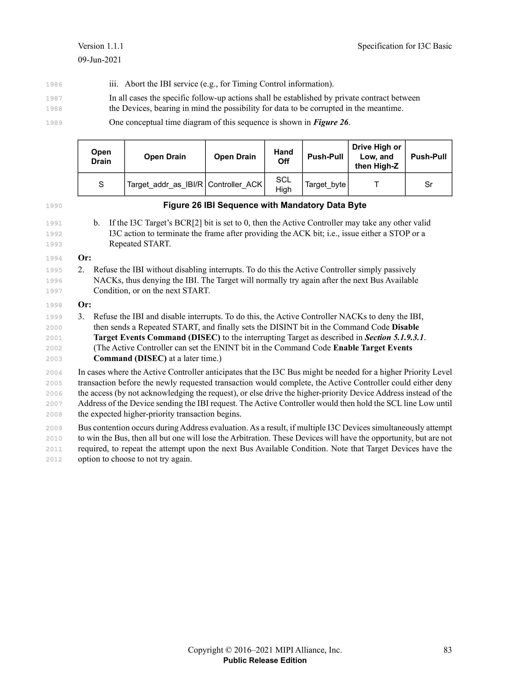

- **`1991`** b. If the I3C Target’s BCR[2] bit is set to 0, then the Active Controller may take any other valid **`1992`** I3C action to terminate the frame after providing the ACK bit; i.e., issue either a STOP or a **`1993`** Repeated START. 

**`1994` Or:** 

- **`1995`** 2. Refuse the IBI without disabling interrupts. To do this the Active Controller simply passively **`1996`** NACKs, thus denying the IBI. The Target will normally try again after the next Bus Available **`1997`** Condition, or on the next START. 

**`1998` Or:** 

- **`1999`** 3. Refuse the IBI and disable interrupts. To do this, the Active Controller NACKs to deny the IBI, **`2000`** then sends a Repeated START, and finally sets the DISINT bit in the Command Code **Disable** **`2001` Target Events Command (DISEC)** to the interrupting Target as described in _**Section 5.1.9.3.1**_ . **`2002`** (The Active Controller can set the ENINT bit in the Command Code **Enable Target Events** **`2003` Command (DISEC)** at a later time.) 

**`2004`** In cases where the Active Controller anticipates that the I3C Bus might be needed for a higher Priority Level **`2005`** transaction before the newly requested transaction would complete, the Active Controller could either deny **`2006`** the access (by not acknowledging the request), or else drive the higher-priority Device Address instead of the **`2007`** Address of the Device sending the IBI request. The Active Controller would then hold the SCL line Low until **`2008`** the expected higher-priority transaction begins. 

**`2009`** Bus contention occurs during Address evaluation. As a result, if multiple I3C Devices simultaneously attempt **`2010`** to win the Bus, then all but one will lose the Arbitration. These Devices will have the opportunity, but are not **`2011`** required, to repeat the attempt upon the next Bus Available Condition. Note that Target Devices have the **`2012`** option to choose to not try again. 

Copyright © 2016–2021 MIPI Alliance, Inc. **Public Release Edition** 

83 

Specification for I3C Basic 

Version 1.1.1 09-Jun-2021 

## **5.1.6.2.1 Mandatory Data Byte** 

> **`2013`** The Mandatory Data Byte of the IBI payload is the data that follows the Dynamic Address when a Device **`2014`** sends an IBI request. The availability of a Mandatory Data Byte, together with the payload information that **`2015`** follows it, is indicated by bit BCR[2] in the Bus Characteristics Register (see _**Section 5.1.1.2.1**_ ). 

**`2016`** It is called a Mandatory Data Byte because the Target Device takes over the line when the Controller ACKs **`2017`** the IBI request and the Target continues to send data; the Controller cannot decline the reception of the first **`2018`** byte, and must wait for the T-Bit to terminate any subsequent data. 

**`2019`** The Mandatory Data Byte provides the Controller additional information about the event that has happened, **`2020`** and is divided in two fields as shown in _**Table 12**_ : 

**`2021`** • **Interrupt Group Identifier:** The three most significant bits: MDB[7:5] **`2022`** Values for the Interrupt Group Identifier are defined by MIPI Alliance I3C WG for **`2023`** different use cases. **`2024`** • **Specific Interrupt Identifier:** The five least significant bits: MDB[4:0] **`2025`** MIPI Alliance maintains a web-based registry of defined MDB values _**[MIPI05]**_ . **`2026` Table 12 Mandatory Data Byte Field Format** 

|**Interrupt Group Identifier Field**|**Interrupt Group Identifier Field**|**Interrupt Group Identifier Field**||**Specific Interrupt Identifier Field**|**Specific Interrupt Identifier Field**|**Specific Interrupt Identifier Field**||
|---|---|---|---|---|---|---|---|
|MDB[7]|MDB[6]|MDB[5]|MDB[4]|MDB[3]|MDB[2]|MDB[1]|MDB[0]|


Copyright © 2016–2021 MIPI Alliance, Inc. **Public Release Edition** 

84 

Version 1.1.1 09-Jun-2021 

Specification for I3C Basic 

```
2027
```

**Table 13 Mandatory Data Byte Value Ranges** 

|**MDB**<br>**Category**|**Interrupt**<br>**Group**<br>**Identifier**|**Specific Interrupt**<br>**Identifier Value**|**Specific Interrupt**<br>**Identifier Value**|**Description**|
|---|---|---|---|---|
||**MDB[7:5]**|**MDB[4:0]**|||
|**User Defined**|3’b000|5’h00 – 5’h1F|**Vendor Reserved**|Defined by the vendor and reserved for<br>vendor definition|
|**I3C WG**|3’b001|5’h00 – 5’h0C|MIPI Alliance I3C WG|Defined and interpreted based on some<br>reserved values allocated by MIPI Alliance<br>I3C WG.<br>Indicates that the interrupt is related to a<br>specific functionality.|
||||Reserved||
|||5’h0D|**Error with additional data**<br>**bytes in IBIpayload**||
|||5’h0E|**Generic error, no**<br>**additional data bytes in IBI**<br>**payload**||
|||5’h0F – 5’h11|MIPI Alliance I3C WG||
||||Reserved||
|||5’h12|**Monitoring Devices**<br>**Interrupt Enabling**||
|||5’h13 – 5’h16|MIPI Alliance I3C WG||
||||Reserved||
|||5’h17|**D2DT Identifier**||
|||5’h18 – 5’h1F|MIPI Alliance I3C WG||
||||Reserved||
|**MIPI Groups**|3’b010|5’h00 – 5’h01|MIPI Alliance Camera WG<br>Reserved|Allocated and reserved by MIPI Alliance<br>Working Groups, and approved by MIPI<br>Alliance I3C WG.<br>Indicates that the interrupt is generated by a<br>Device that wants to send a specific MIPI<br>Alliance WG-related interrupt (e.g.,<br>Camera WG or Debug WG)|
|||5’h02 – 5’h1B|MIPI Alliance Reserved||
||||||
|||5’h1C – 5’h1D|**MIPI Alliance Debug WG**<br>**Reserved**||
|||5’h1E – 5’h1F|MIPI Alliance Reserved||
||||||
|**Non MIPI**<br>**Reserved**|3’b011|5’h00 – 5’h1F|**Non MIPI Reserved**|Allocated for uses outside of MIPI Alliance|
|**Timing**<br>**Information**|3’b100|5’h00 – 5’h1F|**Vendor Reserved**|May have any value defined by the vendor|
|**Pending**<br>**Read**<br>**Notification**|3’b101|5’h00 – 5’h0C|MIPI Alliance I3C WG|Indicates that the interrupt is generated by a<br>Device that wants to send a specific MIPI<br>Alliance WG-related or vendor-specific<br>interrupt, and has a data message that will<br>be returned on the next Private Read if<br>ACKed (see**_Section 5.1.6.2.2_**)|
||||Reserved||
|||5’h0D|**MIPI Alliance Debug WG**<br>**Reserved**||
|||5’h0E|**MCTP Packet**<br>**(for DMTF****_[MCTP01]_)**||
|||5’h0F|MIPI Alliance I3C WG||
||||Reserved||
|||5’h10 – 5’h1F|**Vendor Reserved**||
|Reserved|3’b110|—||Reserved|
|Reserved|3’b111|—||Reserved|


Copyright © 2016–2021 MIPI Alliance, Inc. **Public Release Edition** 

85 

Specification for I3C Basic 

Version 1.1.1 09-Jun-2021 

## **5.1.6.2.2 Pending Read Notification** 

> **`2028`** Target Devices that support In-Band Interrupt requests may also implement support for a particular Pending **`2029`** Read Notification contract, by which they may inform the Controller that there is data to be read for a specific **`2030`** purpose. Such a Target that expects that the Controller should also support this contract shall indicate its **`2031`** support by returning a value of 1’b1 in bit 6 of GETCAP3 byte (the third returned data byte, when the **`2032`** GETCAPS Format 1 CCC is sent (see _**Section 5.1.9.3.19**_ ). 

```
2033
2034
2035
2036
2037
```

To signal a Pending Read Notification, the Target shall send an IBI with a Mandatory Data Byte value (see _**Section 5.1.6.2.1**_ ) for which the first three bits (i.e., Interrupt Group Identifier) matches 3’b101. The remaining five bits in the Mandatory Data Byte value (i.e., the Specific Interrupt Identifier) may be specific for a particular type of Target, as assigned by MIPI Alliance I3C WG, or it may be any other value in the region reserved for a Vendor device. 

**`2038`** If the Controller accepts the IBI and reads the Mandatory Data Byte from the Target, then it shall signal **`2039`** acceptance of the Controller’s obligation to read the data, per this contract. The Target shall note that the **`2040`** MDB has been read, and treat the Pending Read Notification as active: i.e., it shall make the data available **`2041`** on the next Private Read request received from the Controller. However, if the Controller terminates the IBI **`2042`** before reading the MDB, or if the Controller NACKs the IBI, then it shall not signal acceptance, and the **`2043`** Target may try again at a later time. 

**`2044`** The Controller should also read any additional data bytes as part of the IBI payload (see _**Section 5.1.6.2**_ ), as **`2045`** the Target may add additional bytes specific to the type of Target or its function (per the Specific Interrupt **`2046`** Identifier) to provide context or further describe or classify the data that the Target will return on the next **`2047`** Private Read request. If present, the format and length of any additional bytes in the IBI payload shall depend **`2048`** on the Specific Interrupt Identifier. 

**`2049`** Once the IBI and its MDB has been serviced and accepted, the Controller is obligated to initiate a subsequent **`2050`** Private Read request to the Target, to read the data that has been made available and ready for this Private **`2051`** Read request. The Controller may do this immediately after the IBI has been serviced, or it may do this at a **`2052`** later time. However, the Controller should initiate this Private Read request before taking any actions that **`2053`** would either reset the Target Device (thereby causing the data to be lost), or before any other queued **`2054`** commands or actions initiated by its Host can initiate a Private Read for another purpose (thereby reading **`2055`** the data and associating it with another transaction). The Controller may queue up several Private Read **`2056`** Notifications from multiple Targets and process them in any order. 

**`2057`** The Private Read request may be done in SDR Mode, or in any supported HDR Mode using any HDR Read **`2058`** command value specific to that HDR Mode. The choice of whether to use an HDR Mode may be a private **`2059`** contract between the Controller and the Target, or it may be indicated in the Specific Interrupt Identifier or **`2060`** any additional data bytes in the IBI payload. **`2061`** _**Note:**_ 

**`2062`** _If the Target also supports any HDR Modes, then the Target may choose to support certain HDR_ **`2063`** _Read command values for the active Pending Read Notification, by private contract or by assignment._ **`2064`** _The Target may also continue to support HDR Reads for other purposes, using other HDR Read_ **`2065`** _command values, while it waits for the Controller to initiate the HDR Read for the active Pending_ **`2066`** _Read Notification._ 

**`2067`** Once the Controller has initiated the Private Read request, it should read the data from the Target, queue it **`2068`** for processing or transfer to its Host, and retain the association of the data with the IBI notification, including **`2069`** the specific MDB value as well as any additional bytes in the IBI payload. 

Copyright © 2016–2021 MIPI Alliance, Inc. **Public Release Edition** 

86 

Version 1.1.1 09-Jun-2021 

Specification for I3C Basic 

**`2070`** A Target may hold only one active Pending Read Notification at any time, while it is waiting for the Controller **`2071`** to read the data: **`2072`** • While the Target is waiting for the Controller to initiate a Private Read request for its active **`2073`** Pending Read Notification, it shall not send an IBI with a Mandatory Data Byte value to indicate **`2074`** another Pending Read Notification until after the Controller has initiated the expected Private **`2075`** Read request to consume the data for the active Pending Read Notification. 

- **`2076`** • However, the Target may send an IBI with another Mandatory Data Byte value (i.e., one that does **`2077`** not signal a Pending Read Notification) for other reasons, such as reporting error conditions or **`2078`** other types of interrupt events. 

- **`2079`** • If the Controller has serviced and accepted the IBI and its MDB, but has not initiated the expected **`2080`** Private Read request in a timely manner, then the Target may re-transmit the IBI with the same **`2081`** MDB (with additional data bytes, as described above) as a reminder. 

- **`2082`** • The Controller need not initiate multiple Private Read requests (i.e., one for each additional **`2083`** IBI with MDB for a Pending Read Notification); the most recent IBI shall be the notification **`2084`** to consume the data for the active Pending Read Notification. 

- **`2085`** • However, if the Controller does initiate additional Private Read requests due to additional IBIs **`2086`** as reminders, then the Target shall not accept such requests. 

- **`2087`** • The Target shall keep the data available for the Controller, to satisfy the expected Private Read **`2088`** request, unless it encounters an error (e.g., due to delayed read or other conditions). 

- **`2089`** • If the Target encounters an error or is unable to return the data, then it shall not accept the **`2090`** Private Read request (i.e., the Target shall NACK the read), and should also report this as an **`2091`** error (i.e., an IBI with another MDB value). 

**`2092`** By default, a Target should not attempt to send an IBI with a Mandatory Data Byte value to indicate a Pending 

**`2093`** Read Notification until it has been enabled to do so by the Controller. 

**`2094`** _**Note:**_ **`2095`** _The method for configuring a Target to enable or disable IBIs with Pending Read Notifications is not_ **`2096`** _defined by the I3C Basic Specification. This method might be a private contract between the_ **`2097`** _Controller and the Target, or it might be defined for specific assigned MDB values in_ _**Table 13** (i.e.,_ **`2098`** _with Interrupt Group Identifier value of 3’b101)._ 

Copyright © 2016–2021 MIPI Alliance, Inc. **Public Release Edition** 

87 

Specification for I3C Basic 

Version 1.1.1 09-Jun-2021 

## **5.1.6.3 I3C Secondary Controller Requests to be Active Controller** 

> **`2099`** When the I3C Secondary Controller requests to be an Active Controller: 

- **`2100`** 1. To perform the request, the I3C Secondary Controller shall wait for either a START (not a **`2101`** Repeated START), or a Bus Available Condition and issue its own START. 

- **`2102`** 2. After a START, the I3C Secondary Controller shall issue its own Dynamic Address on the I3C **`2103`** Bus, followed by the RnW bit of 0 to request to become Active Controller. 

- **`2104`** 3. If the I3C Secondary Controller wins the Arbitration by having the lower Dynamic Address, and if **`2105`** the Active Controller is currently willing to relinquish the Controller Role to the requester, then **`2106`** the Active Controller shall respond with ACK. 

- **`2107`** _**Figure 172**_ shows the Controller Role Request flow if the Secondary Controller wins the Arbitration. Any **`2108`** Controller-capable Device shall use this flow to request the Controller Role, including when a former Active **`2109`** Controller needs to regain the Controller Role after acting as a Target. 

**`2110`** After acknowledging the Controller Role Request, the Active Controller should prepare for Handoff in a **`2111`** timely manner ( _**see Section 5.1.7.1**_ ). The Secondary Controller should also remain ready to accept the **`2112`** Controller Role (i.e., not transition into a lower-power mode or a “deep sleep” state) and respond to all **`2113`** relevant CCCs that the Active Controller may use, as part of the process of preparing for Handoff. **`2114`** _**Section 5.1.7.2**_ specifies the process for passing the Controller Role. 

## **5.1.6.4 I3C Active Controller Initiating a Transaction** 

**`2115`** In order to ensure that any other I3C Device can initiate a Target Interrupt Request or a Controller Role **`2116`** Request, the I3C Active Controller may choose to initiate new Frames with a START (not a Repeated START) **`2117`** followed by the I3C Broadcast Address (7’h7E). This allows another Device to emit its Address into the **`2118`** arbitrated Address header, when the Bus would otherwise be busy and a Device might not be able to wait for **`2119`** the minimum Bus Available period to initiate its own START by pulling SDA Low. 

**`2120`** If the other Device wins the Arbitration, then it may drive its IBI Request, and the Active Controller may **`2121`** either ACK or NACK the request. However if no other Device attempts to emit its Address into the arbitrated **`2122`** Address header, then the Active Controller may follow with a Repeated START, or any other valid Bus **`2123`** activity. 

**`2124`** If the Active Controller instead drives the same Dynamic Address and RnW bit as a Target issuing an IBI or **`2125`** a Controller Role Request with its own Dynamic Address, then the Arbitration might not have a clear winner, **`2126`** and as a result a retry might be necessary in order to give the Target a chance to request an IBI or the Controller **`2127`** Role (see _**Section 5.1.2.2.3**_ ). 

Copyright © 2016–2021 MIPI Alliance, Inc. **Public Release Edition** 

88 

Version 1.1.1 09-Jun-2021 

Specification for I3C Basic 

## **5.1.7 I3C Bus with Multiple Controllers** 

> **`2128`** An I3C Bus may have multiple Controller-capable Devices, with varying capabilities and purposes. All **`2129`** Controller-capable Devices shall support the required Bus Management procedures while acting as Active **`2130`** Controller. Although only one I3C Controller-capable Device can act as Active Controller of the I3C Bus at **`2131`** any given time, the role of Active Controller may be passed between Controller-capable Devices, using the **`2132`** Controller to Controller Handoff Procedure (see _**Section 5.1.7.2**_ ). The state of a Controller-capable Device **`2133`** currently holding the role of Active Controller on the I3C Bus is referred to as the Controller Role. 

**`2134`** At least one Controller-capable Device shall support the required Bus Configuration procedures for a Bus. A **`2135`** Secondary Controller may perform some of these Bus Configuration procedures, as documented in **`2136`** _**Section 5.1.7.3**_ depending on the specific application for the I3C Bus and the intended use cases of the **`2137`** Secondary Controller. A Secondary Controller that cannot, or might not, perform all required Bus **`2138`** Configuration procedures should defer or pass the Controller Role to another suitable Controller-capable **`2139`** Device if it encounters a condition that it cannot or might not handle while acting as Active Controller. 

**`2140`** Additionally, the Controller-capable Device that has the job of initializing the I3C Bus holds the special role **`2141`** of Primary Controller. A Primary Controller Device is, by definition, the first Controller-capable Device to **`2142`** hold the Active Controller role. The Primary Controller acts as the authority for the initial configuration of **`2143`** the Bus and all Devices, including any Legacy I[2] C Devices. Therefore, the Primary Controller must be **`2144`** capable of all required Bus Configuration procedures. However, once the Bus has been initialized and **`2145`** configured, the Primary Controller can also pass the Controller Role to any other Controller-capable Device **`2146`** currently acting as Secondary Controller. 

**`2147`** Using the Handoff procedure, either multiple Controller-capable Devices can cooperatively pass the **`2148`** Controller Role back and forth, or else one Controller-capable Device can direct the flow of passing the **`2149`** Controller Role among other Controller-capable Devices according to the capabilities of any I3C Secondary **`2150`** Controllers on the Bus and the I3C Bus’s particular application. 

**`2151`** A Secondary Controller may request the Controller Role from the Active Controller using the Controller Role **`2152`** Request flow detailed in _**Section 5.1.6.3**_ . Alternately, the Active Controller may choose a particular **`2153`** Secondary Controller to receive the Controller Role, even if that Secondary Controller did not request the **`2154`** Controller Role. In either case, the names Active Controller and Secondary Controller largely reflect the **`2155`** Controller-capable Device’s current role at any given point in time. 

**`2156`** After acknowledging a Controller Role Request or choosing a Secondary Controller to receive the Controller **`2157`** Role, the Active Controller should: 

- **`2158`** 1. Prepare the Bus and the indicated Secondary Controller for Handoff (see _**Section 5.1.7.1**_ ); 

- **`2159`** 2. Pass the Controller Role to the indicated Secondary Controller using the Controller to Controller **`2160`** Handoff Procedure (see _**Section 5.1.7.2**_ ); and 

- **`2161`** 3. Monitor the Bus to ensure that the indicated Secondary Controller asserts its Controller Role (see **`2162`** _**Section 5.1.10.2.4**_ on Error Type CE3). 

**`2163`** The process for passing the Controller Role is the same in either direction: it is always initiated by the Active **`2164`** Controller (i.e., the Controller-capable Device holding the Controller Role at that point in time). In most **`2165`** cases the immediately previous Active Controller can request to receive the Controller Role back again, or **`2166`** the indicated Secondary Controller can automatically pass the Controller Role back once it has finished its **`2167`** tasks. However, in some Bus implementations it might be advisable to designate one Controller-capable **`2168`** Device to direct and manage the flow of passing the Controller Role to/from any Secondary Controllers. 

**`2169`** While acting as Active Controller, a Secondary Controller may choose not to handle any Bus Configuration **`2170`** procedures. In some circumstances, a Secondary Controller might be intended for a limited purpose or scope **`2171`** on a particular I3C Bus, and as a result might limit its activities while serving as Active Controller to some **`2172`** subset of what it is capable of performing; for example, by not supporting Bus Configuration procedures. 

Copyright © 2016–2021 MIPI Alliance, Inc. **Public Release Edition** 

89 

Specification for I3C Basic 

Version 1.1.1 09-Jun-2021 

## **5.1.7.1 Preparing for Handoff** 

> **`2173`** It may be necessary for the Active Controller to issue one or more commands on the I3C Bus to prepare other **`2174`** I3C Target Devices for the Handoff and ensure an optimal transition of the Controller Role, irrespective of **`2175`** whether the handoff is due to a Secondary Controller requesting the Controller Role via a Controller Role **`2176`** Request, or is due to the Active Controller having simply chosen to pass the Controller Role to a particular **`2177`** Secondary Controller. 

**`2178`** There are many possible variations of the steps that the Active Controller should take to prepare for a Handoff. **`2179`** _**Figure 27**_ presents a generalized flow, and this Section provides a recommended procedure. 

```
2180
2181
```

**==> picture [330 x 477] intentionally omitted <==**

**----- Start of picture text -----**<br>
Active Controller<br>Received<br>Controller  Send CCC Initiated by<br>Active<br>Role GETSTATUS<br>Controller<br>Request<br>Target responds<br>Target unresponsive<br>Disable Send CCC<br>Yes<br>interrupts? DISEC<br>Error<br>No<br>Multi-Lane Reset Target<br>re-config ML Frame<br>needed? formats<br>No<br>Send CCC<br>New Activity Yes Send CCC Deep sleep “DEFTGTS”<br>State needed? ENTASx resync?<br>Broadcast<br>No No<br>CCC “GETSTATUS”Target supports Yes Active Group Yes “DEFGRPA” Send CCC<br>Addresses?<br>+ Defining Byte? Broadcast(s)<br>No No<br>Controller  No<br>Role Target still Yes Poll until<br>Handoff processing? finished<br>Procedure<br>**----- End of picture text -----**<br>


**Figure 27 Pre-Handoff Steps Flow** 

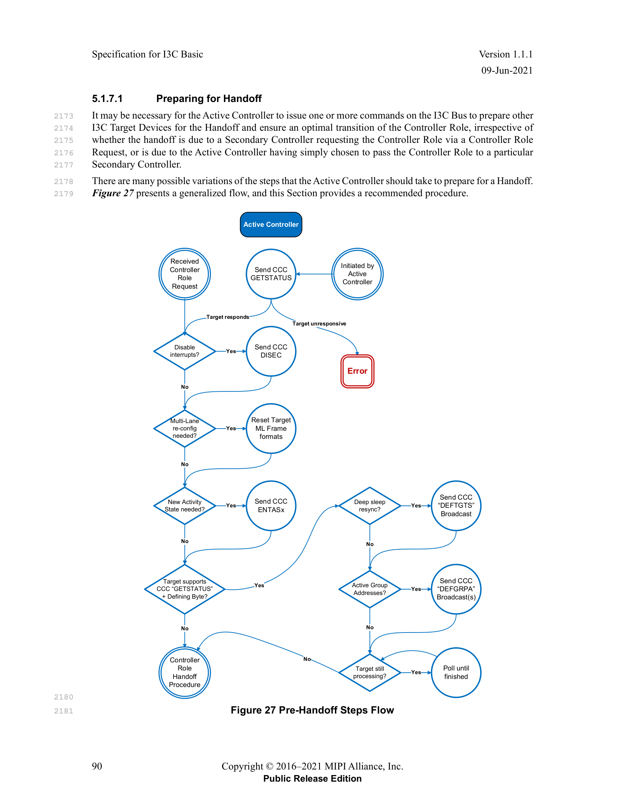

Copyright © 2016–2021 MIPI Alliance, Inc. 

90 

**Public Release Edition** 

Version 1.1.1 09-Jun-2021 

Specification for I3C Basic 

|**`2182`**|Recommended procedure:|
|---|---|
|**`2183`**|1. If the Active Controller intends to pass the Controller Role to a selected Secondary Controller that|
|**`2184`**|did not send a Controller Role Request, then the Active Controller should verify that the selected|
|**`2185`**|Secondary Controller is active and ready to respond to additional commands (see|
|**`2186`**|**_Section 5.1.9.3.15_**, the GETSTATUS CCC).|
|**`2187`**|**_Note:_**|
|**`2188`**|_If the Secondary Controller responds to the GETSTATUS CCC and returns a value of 2’b11 in bits_|
|**`2189`**|_7:6 (i.e., LSB) of the GETSTATUS Format 1 CCC (see_**_Table 27_**_), then this indicates that it is not_|
|**`2190`**|_able to participate in any subsequent steps to prepare for Handoff. The Active Controller should_|
|**`2191`**|_stop the procedure at this point, and may initiate an error recovery procedure._|
|**`2192`**|2. If the Active Controller needs to disable Hot-Joins, Target Interrupt Requests, or other Bus events|
|**`2193`**|that could interfere with the Handoff, then it should send the appropriate Broadcast or Direct|
|**`2194`**|CCCs to disable those events before the Handoff (see**_Section 5.1.9.3.1_**, the ENEC/DISEC CCCs).|
|**`2195`**|**_Note:_**|
|**`2196`**|_Once the Handoff is complete, the new Active Controller should re-enable any events that are_|
|**`2197`**|_disabled in this step._|
|**`2198`**|3. If the Active Controller is Multi-Lane capable, and does not have knowledge that the selected|
|**`2199`**|Secondary Controller supports and is configured to use the same Multi-Lane Modes and codings|
|**`2200`**|that any Multi-Lane capable Target Devices have been configured to use, then the Active|
|**`2201`**|Controller should re-configure the I3C Bus such that all Target Devices are configured to use an|
|**`2202`**|ML Frame format that is known to be supported by the selected Secondary Controller (see|
|**`2203`**|**_Section 5.1.9.3.30_**, the MLANE CCC).|
|**`2204`**|**_Note:_**|
|**`2205`**|_In some situations, ensuring maximum compatibility and preventing communication errors after_|
|**`2206`**|_Handoff might require resetting these Multi-Lane capable Target Devices to basic 2-Wire I3C_|
|**`2207`**|_Mode (i.e., 1-Lane)._|
|**`2208`**|4. If the Active Controller knows that the selected Secondary Controller must be put into a different|
|**`2209`**|Activity State before Handoff, then the Active Controller shall send the appropriate Broadcast or|
|**`2210`**|Direct CCCs to put the Bus (or selected Devices) into a different Activity State (see|
|**`2211`**|**_Section 5.1.9.3.18_**regarding the GETMXDS CCC with optional Defining Byte, and|
|**`2212`**|**_Section 5.1.9.3.2_**, the ENTASx CCCs).|
|**`2213`**|5. If the Active Controller determines that the indicated Secondary Controller has been in a “deep|
|**`2214`**|sleep” state and may need to be re-synchronized with the most current list of I3C Targets and|
|**`2215`**|Group Addresses, then the Active Controller should send the appropriate Broadcast CCCs (see|
|**`2216`**|**_Section 5.1.9.3.7_**, the DEFTGTS CCC, and**_Section 5.1.9.3.29_**, the DEFGRPA CCC). Afterwards,|
|**`2217`**|the Active Controller should poll the Secondary Controller to ensure that it has successfully|
|**`2218`**|processed this data and indicates that it is ready to accept the Controller Role (see|
|**`2219`**|**_Section 5.1.9.3.15_**regarding the GETSTATUS CCC with optional Defining Byte).|
|**`2220`**|While steps 2–4 can generally be performed in any order, step 5 (or any other steps requiring|
|**`2221`**|re-synchronization of data) should be done after steps 1–4, and immediately before checking for the|
|**`2222`**|Secondary Controller’s status in processing the Broadcast data (if this is supported and indicated).|
|**`2223`**|**_Figure 27_**presents a generalized flow of the steps the Active Controller should take to prepare for a Handoff.|


Copyright © 2016–2021 MIPI Alliance, Inc. **Public Release Edition** 

91 

Specification for I3C Basic 

Version 1.1.1 09-Jun-2021 

- **`2224`** Some of these steps require the Active Controller to determine some of the optional Secondary Controller **`2225`** features and capabilities advertised by the Secondary Controller. In most cases, these can be determined by **`2226`** reading the data returned by the Secondary Controller in response to various CCCs with a Defining Byte (see **`2227`** _**Section 5.1.9.3.18**_ regarding the GETMXDS CCC with optional Defining Byte, and _**Section 5.1.9.3.19**_ **`2228`** regarding the GETCAPS CCC with optional Defining Byte): 

- **`2229`** • If the Active Controller has not already gathered this information and needs to determine whether **`2230`** the Secondary Controller requires special handling based on these features and capabilities, then it **`2231`** shall do so before taking any related steps that would require this information. 

- **`2232`** • However, if the Active Controller has already gathered this information in advance, then it may **`2233`** rely on cached data, and does not need to gather it again. 

- **`2234`** • Once all the data has been gathered, the Active Controller must make its decisions relating to the **`2235`** pre-Handoff flow steps, based on the data returned from the Secondary Controller. 

- **`2236`** When the Active Controller has verified that the Bus is configured correctly, and the selected Secondary **`2237`** Controller indicates that it is ready to accept the Controller Role, the Active Controller shall initiate the **`2238`** Controller to Controller Handoff Procedure per _**Section 5.1.7.2**_ (next). 

Copyright © 2016–2021 MIPI Alliance, Inc. **Public Release Edition** 

92 

Version 1.1.1 09-Jun-2021 

Specification for I3C Basic 

## **5.1.7.2 Controller to Controller Handoff Procedure** 

- **`2239`** After the Active Controller has prepared for Handoff, the Active Controller shall then issue a GETACCCR **`2240`** CCC ( _**Section 5.1.9.3.16**_ ) followed by a STOP if the Handoff was successful, whereupon it shall release **`2241`** control of the SCL line, and therefore also releasing control of the I3C Bus (i.e., passing the Controller Role) **`2242`** to the selected Secondary Controller. 

**`2243`** Following the STOP and Bus Available Condition, the selected Secondary Controller assumes the role of the **`2244`** Active Controller and takes control of the I3C Bus. The former Active Controller should monitor the I3C Bus 

**`2245`** to ensure that the new Active Controller asserts its Controller Role, according to the flow described in **`2246`** _**Section 5.1.10.2.4**_ regarding Error Type CE3. 

**`2247`** _**Figure 155**_ presents a simplified and generalized picture of the Controller to Controller Handoff procedure. **`2248`** While there are many possible variations to this procedure, the most significant states are: 

- **`2249`** 1. At the end of data transfer from a successful GETACCCR CCC, the current Active Controller **`2250`** (indicated by ‘ **CCR** ’ in the Figure) controls SCL and SDA, and the new Controller-capable Device **`2251`** that will become the new Active Controller (indicated by ‘ **NCR** ’ in the Figure, initially acting as a **`2252`** Secondary Controller) has SCL and SDA in High-Z state. 

- **`2253`** 2. The **CCR** provides the rising edge of SCL, while keeping SDA Low 

- **`2254`** 3. After tSU_STO elapses, the **CCR** drives SDA High, using either an active drive or the Open Drain **`2255`** class Pull-Up. However, once SDA is High the Open Drain class Pull-Up shall be used. 

- **`2256`** 4. After the **CCR** determines that SDA is High, and after both its Clock to Data Turnaround Time **`2257`** (tSCO) and the time of flight elapse, it then takes two actions: 

- **`2258`** a. The **NCR** actively drives SCL High, overlapping with the **CCR** ’s active drive; and 

- **`2259`** b. The **NCR** enables its Open Drain class Pull-Up, in parallel with the **CCR** ’s Open Drain class **`2260`** Pull-Up 

- **`2261`** Neither of these actions conflicts with the **CCR** . 

**`2262`** _**Note:**_ 

- **`2263`** _Although tSCO generally applies to any Target Device, in this step it applies to the_ _**NCR** because_ **`2264`** _prior to the Bus transfer the_ _**NCR** performs in the Target role (i.e., as a Secondary Controller until it_ **`2265`** _receives the Controller Role)._ 

**`2266`** _In the Figure, tSCO is shown starting as if the_ _**CCR** has used the Open Drain drive of SDA High._ **`2267`** _This illustrates the worst condition for this stage of the Handoff, showing the latest possible_ **`2268`** _moment when the_ _**NCR** starts overlapping the line controls with the_ _**CCR** ._ 

- **`2269`** 5. After a time delay of tCRHPOverlap, the Active Controller (i.e., the **CCR** ): 

```
2270
```

```
2271
```

- a. Releases SCL to High-Z; and 

- b. Disables its Open Drain class Pull-Up on SDA and sets SDA to High-Z 

**`2272`** _**Note:**_ 

- **`2273`** _In the Figure, tCRHPOverlap is shown in the worst case: on the Open Drain drive of SDA, and where_ **`2274`** _the_ _**CCR** starts counting it from the lower side of the SDA rising edge. The_ _**CCR** must control the_ **`2275`** _lines until the_ _**NCR** could safely take over, and that is certain after tDIG_OD_L Min. As a result,_ **`2276`** _tCRHPOverlap is greater than or equal to tDIG_OD_L Min._ 

- **`2277`** 6. After tNEWCRLock (i.e., the time interval during which the **NCR** shall not drive SDA Low), the **NCR** **`2278`** may actively drive SDA Low, producing a START. 

**`2279`** The Targets may also drive SDA Low at this point, since SDA is held by an Open Drain class Pull- **`2280`** Up. The tNEWCRLock period timing parameter is similar to I3C’s tAVAL parameter and I[2] C’s tBUF **`2281`** parameter, and as such, requires different values for Pure Bus vs. Mixed Bus. 

**`2282`** In the Figure, tNEWCRLock is shown as starting at the SDA rising edge in Open Drain driving mode, **`2283`** similar to I3C’s tAVAL parameter and I[2] C’s tBUF parameter. 

- **`2284`** 7. After tCAS expires, the **NCR** may drive SCL Low, producing the first SCL falling edge. 

Copyright © 2016–2021 MIPI Alliance, Inc. **Public Release Edition** 

93 

Specification for I3C Basic 

Version 1.1.1 09-Jun-2021 

**`2285`** Following this SCL falling edge, the new Active Controller shall actively drive SCL, while also **`2286`** driving SDA in Open Drain mode with the Arbitrable Address. 

**`2287`** After the Handoff procedure, the new active Controller (i.e., **NCR** in the steps above) should issue a START **`2288`** to assert its Controller Role within 100 μs, or the time interval indicated by its Activity State (as reported by **`2289`** the GETMXDS CCC with optional Defining Byte, per _**Section 5.1.9.3.18**_ ), whichever is greater. If the new **`2290`** Active Controller has not issued a START, then it shall respond to SDA being pulled Low by pulling SCL **`2291`** Low; this is a START, and the new Active Controller may follow it with any valid Bus activity that is **`2292`** sufficient to assert the Controller Role. 

**`2293`** However, if the new Active Controller does not pull SCL Low within 100 μs of SDA being pulled Low, then **`2294`** it might lose the Controller Role to the former Active Controller (i.e., ‘ **CCR** ’ in the steps above). To avoid a **`2295`** hung Bus, the former Active Controller should detect whether the new Active Controller has taken over the **`2296`** Bus per the Error Type CE3 flow described in _**Section 5.1.10.2.4**_ . 

Copyright © 2016–2021 MIPI Alliance, Inc. **Public Release Edition** 

94 

Version 1.1.1 09-Jun-2021 

Specification for I3C Basic 

## **5.1.7.3 Secondary Controller Functions** 

> **`2297`** A Secondary Controller Device initially acts as a Target when it joins the Bus (either at Bus Initialization, or **`2298`** via Hot-Join) and, like any other Target, shall respond to the standard (i.e., Required) CCCs. **`2299`** A Secondary Controller shall indicate that it is a Controller-capable Device, by returning a value of 2’b01 in **`2300`** its BCR Device Role bits (see _**Table 5**_ ) when queried by the Active Controller. The Active Controller shall **`2301`** use this value to determine whether any Secondary Controllers are on the Bus, so it knows whether it is **`2302`** obligated to send out other CCCs (such as DEFTGTS or DEFGRPA) that contain Broadcast data that the **`2303`** Secondary Controller needs to use when it becomes Active Controller. 

**`2304`** Some Secondary Controllers may require special handling before becoming Active Controller, as listed in **`2305`** the steps to prepare for Handoff (see _**Section 5.1.7.1**_ ). Therefore, such Devices must advertise certain **`2306`** capabilities or status to the Active Controller, by supporting one or more optional Defining Bytes for the **`2307`** following CCCs: 

- **`2308`** • GETSTATUS Format 2 CCC with the PRECR Defining Byte (see _**Section 5.1.9.3.15**_ ) **`2309`** • GETMXDS Format 3 CCC with the CRHDLY Defining Byte (see _**Section 5.1.9.3.18**_ ) 

- **`2310`** • GETCAPS Format 2 CCC with the CRCAPS Defining Byte (see _**Section 5.1.9.3.19**_ ) 

**`2311`** A Secondary Controller may automatically enter lower-power modes or a “deep sleep” state based on **`2312`** inactivity, or via commands from other connected logic. Such a Secondary Controller should be capable of **`2313`** returning to an active state when it detects and responds to certain CCCs sent by the Active Controller, since **`2314`** the Active Controller may check to ensure that the Secondary Controller is online and ready to receive the **`2315`** Controller Role (see _**Section 5.1.10.2.5**_ ) before starting the process of preparing for Handoff (see **`2316`** _**Section 5.1.7.1**_ ). This is especially important for situations where the Active Controller is preparing to pass **`2317`** the Controller Role, but the Secondary Controller did not send a Controller Role Request. 

**`2318`** For such situations, the Secondary Controller must return from its lower-power mode or “deep sleep” state, **`2319`** respond to CCCs sent by the Active Controller to prepare for Handoff, and remain ready to receive the **`2320`** Controller Role, unless it is constrained from doing so. If the Secondary Controller is constrained or unable **`2321`** to participate, then it may indicate this status by responding to the GETSTATUS Format 1 CCC (see **`2322`** _**Section 5.1.9.3.15**_ ) and returning a value of 2’b11 in bits 7:6 (see _**Table 27**_ ). However, if the Secondary **`2323`** Controller is able to participate and it supports the GETSTATUS Format 2 CCC with the PRECR Defining **`2324`** Byte, then it shall treat this CCC and Defining Byte as a definitive indication that the Active Controller **`2325`** intends to pass the Controller Role in the near future. 

**`2326`** A Secondary Controller may initiate a Controller Role Request (see _**Section 5.1.6.3**_ ) to the Active Controller. **`2327`** A Secondary Controller may also accept the Controller Role from any Active Controller (including the **`2328`** Primary Controller), at which point it becomes the new Active Controller. 

**`2329`** Once granted control of the Bus by the previous Active Controller via the Controller to Controller Handoff **`2330`** procedure, the Secondary Controller maintains control until another Controller-capable Device is granted **`2331`** Bus control. After the Secondary Controller transitions to the Active Controller role, it could encounter Bus **`2332`** management activities besides the data transfers that it initiates itself, including: In-Band Interrupts, Hot-Join **`2333`** Requests, and Controller Role Requests from other Controller-capable Devices such as another Secondary **`2334`** Controller or the previous Active Controller. 

**`2335`** A Secondary Controller shall support the scenarios described in the following subsections _**5.1.7.3.1**_ through **`2336`** _**5.1.7.3.9**_ , according to its capabilities. 

**`2337`** Per _**Section 5.1.7.3.3**_ , the Secondary Controller may choose to perform some or all Bus Configuration **`2338`** procedures while acting as Active Controller. And per _**Section 5.1.7.3.4**_ , the Secondary Controller may also **`2339`** choose _**not**_ to perform any Bus Configuration procedures while acting as Active Controller. In either case, if **`2340`** the Secondary Controller receives a request (e.g., a Hot-Join Request) that it elects not to handle, then it may **`2341`** choose to defer the request by sending a DISEC CCC ( _**Section 5.1.9.3.1**_ ), and may also immediately pass the **`2342`** Controller Role along to a more capable Controller that can handling that request. Any Secondary Controller **`2343`** acting as Active Controller may still freely use Bus Management procedures, in addition to the ENEC/DISEC **`2344`** CCCs ( _**Section 5.1.9.3.1**_ ), to enable or disable requests on the Bus. 

Copyright © 2016–2021 MIPI Alliance, Inc. **Public Release Edition** 

95 

Specification for I3C Basic 

Version 1.1.1 09-Jun-2021 

## **5.1.7.3.1 Hardware and Software Requirements** 

> **`2345`** A Secondary Controller capable of acting as Active Controller shall have the following minimum hardware **`2346`** and software capabilities: 

- **`2347`** 1. Memory for: 

- **`2348`** a. All Bus Devices’ capabilities and functions at system level 

- **`2349`** b. Retaining the Dynamic Addresses of all I3C Bus Devices 

- **`2350`** c. Retaining the data transfer protocol that the I3C Bus Devices are capable of 

- **`2351`** d. Retaining the active Group Addresses, as well as the lists of all I3C Bus Devices assigned to **`2352`** these Group Addresses, if applicable and supported 

- **`2353`** e. Retaining the currently-configured Multi-Lane Modes and codings of all I3C Bus Devices **`2354`** that support Multi-Lane, if applicable and supported 

- **`2355`** 2. Link requirements for Targets that are intended to transmit In-Band Interrupt requests (IBI), e.g., **`2356`** the clock speed and the maximum length of data transfer 

- **`2357`** 3. Data transfer protocol capability needed for communicating to all I3C Bus Devices 

## **5.1.7.3.2 Minimum Bus Management Procedures** 

> **`2358`** A Secondary Controller capable of acting as Active Controller shall perform the following minimum Bus **`2359`** Management procedures: 

- **`2360`** 1. During Bus initialization, if a Secondary Controller is connected to the I3C Bus, then it shall **`2361`** monitor the Bus for the Primary Controller to send a DEFTGTS CCC. A Secondary Controller **`2362`** shall also monitor the Bus for any Active Controller to send a subsequent DEFTGTS CCC **`2363`** containing any updates as a result of Dynamic Address changes, or of subsequent Hot-Join **`2364`** Requests. Using the most recent Broadcast, the Secondary Controller shall acquire the Addresses **`2365`** and Characteristics of all Devices on the I3C Bus from the data in that DEFTGTS CCC (see **`2366`** _**Section 5.1.9.3.7**_ ). 

- **`2367`** A Secondary Controller may also monitor the Bus during Dynamic Address assignment (see **`2368`** _**Section 5.1.4.2**_ ). 

- **`2369`** 2. Manage the In-Band Interrupt procedure. The Secondary Controller needs to know the meaning of **`2370`** the interrupt from the Target. If the Secondary Controller accepts the IBI, then the Secondary **`2371`** Controller shall service the IBI appropriately (see _**Section 5.1.7.3.5**_ ). **`2372`** 3. Procedure for requesting transfer of Bus control to another Controller-capable Device, including **`2373`** the Primary Controller or any previous Active Controller. The Secondary Controller uses the **`2374`** GETACCCR CCC (Get Accept Controller Role, _**Section 5.1.9.3.16**_ ). The Secondary Controller **`2375`** should also handle Controller Role Requests from another Controller-capable Device. 

**`2376`** In addition, while acting as Active Controller a Secondary Controller may also utilize other CCCs to change **`2377`** the state of the Bus, or the state of any Devices, such as entering an Activity State, or disabling Target Events **`2378`** such as Interrupts or Controller Role Requests. If a Secondary Controller does so, then before passing the **`2379`** Controller Role to another Controller-capable Device the Secondary Controller should restore the state of the **`2380`** Bus, or the state of any Devices, to a prior state, or to a state known to be compatible with the prior state. 

Copyright © 2016–2021 MIPI Alliance, Inc. **Public Release Edition** 

96 

Version 1.1.1 09-Jun-2021 

Specification for I3C Basic 

## **5.1.7.3.3 Bus Configuration Procedures** 

> **`2381`** A Secondary Controller capable of changing the Bus Configuration while acting as Active Controller may **`2382`** perform any of the following Bus Configuration procedures: **`2383`** 1. Perform the Dynamic Address Assignment procedure for Hot-Join Devices: **`2384`** a. In order to be able to assign the correct priority level to the Hot-Join Device, the Secondary **`2385`** Controller needs to know all Bus Devices’ functionality at the system level. **`2386`** b. The Secondary Controller may also perform the Dynamic Address Assignment procedure **`2387`** while acting as Active Controller, without a Hot-Join event. It may also reset a Device’s **`2388`** Dynamic Address, or directly assign a Dynamic Address to a Device for any other reason. **`2389`** c. If the Secondary Controller changes the Bus Configuration for the above reasons while acting **`2390`** as Active Controller, then it shall issue the DEFTGTS CCC (Define List of Targets, **`2391`** _**Section 5.1.9.3.7**_ ) to ensure that other Controller-capable Devices have the same knowledge. 

**`2392`** 2. Manage Group Address assignments for other I3C Devices that support Group Addressing, if **`2393`** applicable and supported. **`2394`** To support Group Addressing, a Secondary Controller uses the following CCCs: **`2395`** • SETGRPA (Set Group Address), _**Section 5.1.9.3.27**_ **`2396`** • RSTGRPA (Reset Group Address), _**Section 5.1.9.3.28**_ **`2397`** • DEFGRPA (Define List of Group Addresses), _**Section 5.1.9.3.29**_ **`2398`** The Secondary Controller shall also monitor the Bus for an Active Controller to send DEFGRPA **`2399`** CCCs containing Group Address data, comprising lists of the I3C Target Devices assigned to each **`2400`** known Group Address, if any Group Addresses are known and reported in a DEFTGTS CCC. **`2401`** If the Secondary Controller changes any Group Address assignments while acting as Active **`2402`** Controller, then it shall send the appropriate Group Address data using the DEFTGTS **`2403`** ( _**Section 5.1.9.3.7**_ ) and DEFGRPA ( _**Section 5.1.9.3.29**_ ) CCCs to ensure that other Controller- **`2404`** capable Devices have the same knowledge. **`2405`** 3. Configure other Multi-Lane capable I3C Devices to use any supported Multi-Lane Modes and **`2406`** codings while acting as Active Controller, if applicable and supported. The Secondary Controller **`2407`** uses the MLANE CCC for this (Multi-Lane Data Transfer Control, _**Section 5.1.9.3.30**_ ). **`2408`** A Secondary Controller that can perform any of these Bus Configuration procedures shall advertise its **`2409`** support for these features and capabilities by providing the appropriate bit values in the CRCAP1 byte that **`2410`** is returned when an Active Controller sends the Direct GETCAPS Format 2 CCC with the optional CRCAPS **`2411`** Defining Byte (Secondary Controller Capabilities, see _**Section 5.1.9.3.19**_ ). 

**`2412`** In some cases, a Secondary Controller might not need to assign or change any Dynamic Addresses for any **`2413`** Devices, nor assign nor change Group Addresses for any Devices, nor change the Multi-Lane configurations **`2414`** of any Devices, while acting as Active Controller. The decision on whether to use these Bus Configuration **`2415`** procedures could depend upon the Secondary Controller’s available features and capabilities, upon **`2416`** instructions or settings received from another Controller (including the Primary Controller), or upon the **`2417`** specific use cases required for that Secondary Controller within the Bus. 

## **5.1.7.3.4 Reduced Functionality Secondary Controllers** 

**`2418`** Secondary Controllers are not required to implement or perform any Bus Configuration procedures. The **`2419`** Secondary Controller may defer or transfer the Bus control to another Controller-capable Device when **`2420`** needed; see _**Section 5.1.7.3.1**_ and _**Section 5.1.7.3.2**_ . 

**`2421`** A Secondary Controller with reduced functionality shall have the following minimum capabilities: 

- **`2422`** 1. Memory sufficient for retaining Device Addresses and Characteristics of any Targets it supports 

- **`2423`** 2. Memory sufficient for retaining the Device Address and Characteristics of the Controller to which **`2424`** it will return Bus control 

Copyright © 2016–2021 MIPI Alliance, Inc. **Public Release Edition** 

97 

Specification for I3C Basic 

Version 1.1.1 09-Jun-2021 

## **5.1.7.3.5 In-Band Interrupt Handling** 

> **`2425`** A Secondary Controller may either accept an In-Band-Interrupt request from a Target, or refuse it. **`2426`** Since the Target emits its Address in the Arbitrated Address header, the Secondary Controller may base the **`2427`** decision to accept or reject the IBI based on the Address (per _**Section 5.1.6**_ ) and/or the Secondary Controller’s **`2428`** intended use case. If a Secondary Controller elects to accept an IBI from a particular Target, then it shall **`2429`** service that IBI request normally per _**Section 5.1.6.2**_ . 

**`2430`** Some Secondary Controllers may elect to simply refuse IBIs from all Addresses, whereas other Secondary **`2431`** Controllers may base the decision on the Address in each IBI request. If a Secondary Controller elects to **`2432`** refuse an IBI from a particular Target for any reason, then it should issue the DISEC CCC to the interrupting **`2433`** Target, with the DISINT bit set (Disable Target Events Command, _**Section 5.1.9.3.1**_ ), and then defer IBI **`2434`** handling to another capable Controller. 

**`2435`** A Secondary Controller that refuses IBIs from all Target Addresses should also issue a Broadcast DISEC **`2436`** CCC with the DISINT bit set, to disable interrupts from all Targets. To avoid Target issues that might arise **`2437`** from an IBI not being accepted and serviced in a timely manner, a Secondary Controller that refuses an IBI **`2438`** should also plan to pass the Controller Role to another capable Controller within a reasonably short time after **`2439`** refusing that IBI. 

## **5.1.7.3.6 Hot-Join Management** 

> **`2440`** A Secondary Controller may either support Hot-Join Requests, or not support them. 

**`2441`** If a Secondary Controller supports Hot-Join Requests, then it may either manage the Hot-Join Request while **`2442`** acting as Active Controller per _**Section 5.1.5**_ , or else defer management to a capable Controller by issuing a **`2443`** Broadcast DISEC CCC to disable Hot-Join Requests by setting the DISHJ bit (Disable Target Events **`2444`** Command, _**Section 5.1.9.3.1**_ ). 

**`2445`** If a Secondary Controller does not support Hot-Join Requests, then it shall deny any Hot-Join Requests and **`2446`** defer management to another capable Controller. 

## **5.1.7.3.7 Group Address Management** 

> **`2447`** A Secondary Controller may either support Group Address commands, or not support them. 

**`2448`** If a Secondary Controller supports Group Address commands, then it can participate in the transfer of Group **`2449`** Address data and manage the Group Addresses of I3C Target Devices as described in _**Section 5.1.4.4**_ . If the **`2450`** Secondary Controller determines that it needs to perform this function while acting as Active Controller, then **`2451`** it may use the Group Address commands to set or reset Group Addresses for any I3C Targets that support **`2452`** Group Addressing. The Secondary Controller may also participate in the transfer of Group Address data to **`2453`** another Controller-capable Device using the DEFGRPA CCC (Define List of Group Addresses, **`2454`** _**Section 5.1.9.3.29**_ ). 

**`2455`** If a Secondary Controller does not support Group Addressing, then it shall not send these CCCs and cannot **`2456`** participate in the transfer of Group Address data, either before or after Handoff. 

**`2457`** If the Controller Role passes through a Secondary Controller that does not support Group Address **`2458`** management, and that does not use the DEFGRPA CCC to pass on any Group Address data received from **`2459`** the previous Active Controller to a future Controller, then it shall be the responsibility of either the previous **`2460`** Active Controller, or of a future Controller, to resolve any issues relating to this Secondary Controller’s lack **`2461`** of support for Group Addressing. 

Copyright © 2016–2021 MIPI Alliance, Inc. **Public Release Edition** 

98 

Version 1.1.1 09-Jun-2021 

Specification for I3C Basic 

## **5.1.7.3.8 Multi-Lane Management** 

## **`2462`** 

A Secondary Controller may either support Multi-Lane Data Transfer, or not support it. 

**`2463`** If while acting as Active Controller a Secondary Controller that supports Multi-Lane Data Transfer **`2464`** determines that it is necessary to configure other Multi-Lane capable I3C Devices as described in **`2465`** _**Section 5.3.1**_ , then it may do so. In this situation, the Secondary Controller shall rely upon the Active **`2466`** Controller to have configured the I3C Bus, and all Multi-Lane capable I3C Devices, to use a compatible **`2467`** Multi-Lane Frame format before the Secondary Controller accepts the Controller Role. 

**`2468`** However if a Secondary Controller does not support Multi-Lane Data Transfer, then the Active Controller **`2469`** shall configure the I3C Bus and all Multi-Lane capable I3C Devices to use basic 2-Wire I3C mode (i.e., **`2470`** 1-Lane) before passing the Controller Role to that Secondary Controller. **`2471`** _**Note:**_ **`2472`** _The following configuration advisory is provided in order to enable smooth transitions of the Controller_ **`2473`** _Role from other I3C Controller-capable Devices that might support Multi-Lane for HDR-DDR Mode_ **`2474`** _(as defined in version 1.1 or higher of the full I3C Specification):_ **`2475`** _Not all of the HDR Modes included in I3C Basic support Multi-Lane in I3C Basic. For example,_ **`2476`** _Multi-Lane support for HDR-DDR Mode is defined in the full I3C Specification, but is not included_ **`2477`** _in I3C Basic. As a result, HDR-DDR Mode may only be used in 2-Wire I3C Mode (i.e., 1-Lane) by_ **`2478`** _any I3C Controller Devices and any I3C Target Devices that comply with the I3C Basic_ **`2479`** _Specification._ 

**`2480`** _Passing the Controller Role to a Multi-Lane capable I3C Controller-capable Device that supports_ **`2481`** _I3C Basic could cause compatibility issues, if that I3C Controller-capable Device expects to use_ **`2482`** _HDR-DDR Mode while it is Active Controller, and some I3C Target Devices that were previously_ **`2483`** _configured to use Multi-Lane for HDR-DDR Mode (as defined in the full I3C Specification) have_ **`2484`** _not been re-configured to use basic 2-Wire I3C mode (i.e., 1-Lane)._ 

Copyright © 2016–2021 MIPI Alliance, Inc. **Public Release Edition** 

99 

Specification for I3C Basic 

Version 1.1.1 09-Jun-2021 

## **5.1.7.3.9 Interoperability Among Controllers Based on Different I3C Versions** 

> **`2485`** If multiple Controller-capable Devices on a given I3C Bus support different versions of the MIPI I3C **`2486`** Specification, then certain features or capabilities added in later I3C versions will not be supported (nor even **`2487`** known to exist) by Devices based on earlier I3C versions, raising potential interoperability issues. 

**`2488`** In particular, some features and capabilities added in I3C version 1.1 or I3C Basic v1.1.1 may require special **`2489`** handling during Controller Role Handoff and the recommended Handoff preparation flow. These potential **`2490`** issues could impact the new Active Controller after Handoff, or any subsequent communications between a **`2491`** Controller and a Target. 

**`2492`** To avoid leaving the Bus in a non-functioning state, the system designer must give the following situations **`2493`** careful consideration: 

- **`2494`** • **Use cases that depend upon features or capabilities introduced in I3C v1.1 or I3C Basic v1.1.1** , **`2495`** such as Multi-Lane Data Transfer, Group Addressing, or flow control in HDR Modes. 

**`2496`** A Controller based on an earlier version of I3C might not support these features or capabilities, **`2497`** and could potentially be negatively impacted if such features or capabilities were to be enabled. 

**`2498`** Additionally, a Controller that supports I3C Basic would not support all features and capabilities **`2499`** that are only included in the full I3C Specification, and the transition of the Controller Role could **`2500`** potentially be impacted if such features and capabilities were to be enabled. 

- **`2501`** • **Use cases that depend upon Target-initiated requests specified in a more recent I3C Specification** **`2502` version** , such as Device to Device Tunneling. 

**`2503`** A Controller based on an earlier version of I3C might not be able to understand and/or handle such **`2504`** requests. 

- **`2505`** • **Use cases that pass the Controller Role between Controllers based on different I3C Specification** **`2506` versions** . 

**`2507`** If a given Bus implementation calls for Controller Role Handoffs between multiple Controllers, **`2508`** and not all of those Controllers are based on the same version of the I3C Specification, then the **`2509`** system designer is responsible for ensuring smooth Controller Role Handoff between these **`2510`** Devices, without interoperability issues or loss of communications. In particular, some Controllers **`2511`** might require or expect special handling to prepare for a successful Handoff (see _**Section 5.1.7.1**_ ). 

Copyright © 2016–2021 MIPI Alliance, Inc. **Public Release Edition** 

100 

Version 1.1.1 09-Jun-2021 

Specification for I3C Basic 

## **5.1.8 Timing Control** 

- **`2512`** I3C Basic includes optional Timing Control and Timestamping of events generated by I3C Devices resident **`2513`** on the I3C Bus. This Timing Control framework allows uncertainties affecting the transmission or reception **`2514`** of timing information (for example: Bus activity, busy Controller or Target, operation latency, system jitter, **`2515`** etc.) to be nullified. 

- **`2516`** _**Note:**_ 

- **`2517`** _I3C Basic only includes some of the Timing Control modes and capabilities that the full I3C_ **`2518`** _Specification includes. To gain access to these additional Timing Control modes and capabilities,_ **`2519`** _please contact MIPI Alliance._ 

- **`2520`** The I3C Timing Control framework provides: 

- **`2521`** • Flexible implementation with significant capability enhancements 

- **`2522`** • Means for synchronizing the timing references/clocks, and subsequently the events, of Target **`2523`** Devices on the I3C Bus to the timing reference/clock of the Controller 

- **`2524`** This can result in reduced energy consumption at the system level. 

- **`2525`** • Transmission of timing information, with minimal complexity for the Target Devices 

- **`2526`** • Controllable timing accuracy, suitable for the intended use cases 

- **`2527`** I3C defines two forms of main systems and events for Timing Control: Synchronous mode and Asynchronous **`2528`** mode. These modes and their versions can be used independently and concurrently on a given I3C Bus, per **`2529`** the application-specific requirements, with only one restriction: a Target can enable only one Asynchronous **`2530`** mode variant at a time. 

- **`2531`** • **Synchronous Time Control** (see _**Section 5.1.8.2**_ ) **:** NOT INCLUDED IN I3C BASIC. 

- **`2532`** • **Asynchronous Time Control** (see _**Section 5.1.8.3**_ ) **:** Targets timestamp the moment at which they **`2533`** acquire sampled data, permitting the Controller to time-correlate samples received from multiple, **`2534`** different sensors in an easier and more accurate manner. Timestamping ensures that the Controller **`2535`** always has the time at which sensor data acquisition occurred (subject to the timing granularity **`2536`** supported), even if there are latencies in moving the data from the Target to the Controller. 

## **`2537`** _**Note:**_ 

**`2538`** _I3C Basic only includes Asynchronous Time Control (Mode 0). The full I3C Specification includes_ **`2539`** _additional Asynchronous Time Control Modes that provide different methods for measuring time_ **`2540`** _and/or calibrating timing, with increasing accuracy._ 

Copyright © 2016–2021 MIPI Alliance, Inc. **Public Release Edition** 

101 

Specification for I3C Basic 

Version 1.1.1 09-Jun-2021 

## **5.1.8.1 General Principles** 

> **`2541`** The exchange of timing information is based on agreements between the Controller and Targets. 

**`2542`** The elements of this agreement are: 

- **`2543`** 1. Two I3C Common Command Codes (CCCs): 

- **`2544`** • Set Exchange Timing Information (SETXTIME), see _**Section 5.1.9.3.21**_ , and 

- **`2545`** • Get Exchange Timing Information (GETXTIME), see _**Section 5.1.9.3.22**_ . 

**`2546`** These CCCs: 

- **`2547`** • Identify Bus events and markers (i.e., specific SDA edge and/or SCL edge), 

- **`2548`** • Transfer timing or control information (e.g., ‘abort’ command), 

- **`2549`** • Specify which timing control procedure is in effect, and 

- **`2550`** • Query the Target Device for Exchange Timing support details, such as which Timing Control **`2551`** Mode(s) are supported, the current Timing Control state, frequency, inaccuracy, etc. 

- **`2552`** 2. One defined and Mode-specific marker is sent by the Controller, and used to synchronize the **`2553`** Targets 

- **`2554`** 3. One data collection event is sent by the Target. It includes the time information previously **`2555`** requested by the Controller. 

## **5.1.8.2 Synchronous Systems and Events** 

> **`2556`** This section is not included in the I3C Basic Specification. To gain access to this capability, please contact **`2557`** MIPI Alliance. 

**`2558`** In systems where multiple sensors (or other Target Devices) provide periodically sampled data, it is **`2559`** advantageous to instruct the Targets to be able to collect the data at essentially synchronized times, so that **`2560`** the Controller can read several Targets’ data in a single system awake period. 

**`2561`** In a typical system, different Targets will sample their data at different, uncorrelated times. This is true even **`2562`** if all Targets are set to the same sampling frequency, because Target-to-Target oscillator accuracy differences **`2563`** will cause drift over time. In I3C’s Synchronous Time Control mechanism, the Controller periodically emits **`2564`** a synchronization pulse, called a SYNC Tick. This method permits all Target data sampling to occur very **`2565`** close together in time, so that Targets can prepare and activate their individual sampling mechanisms, even **`2566`** if there are variances across their clocks. 

Copyright © 2016–2021 MIPI Alliance, Inc. **Public Release Edition** 

102 

Version 1.1.1 09-Jun-2021 

Specification for I3C Basic 

## **5.1.8.3 Asynchronous Systems and Events** 

> **`2567`** In the full I3C Specification this section defines four variations (called Modes, summarized in _**Table 14**_ ) of **`2568`** a method for increasing the precision of the acquired time-of-occurrence for an event occurring in an I3C **`2569`** Target connected to an I3C Controller. The overall method is called Asynchronous Timing Control. In this **`2570`** version of the I3C Basic Specification, only Async Mode 0 is supported. **`2571`** The actual event itself may or may not be periodic, and the Controller and Target Devices need not use the **`2572`** same time base clock (source, frequency, or accuracy). The procedure can help address the large **`2573`** inaccuracies/offsets to the event’s acquired time-of-occurrence that IBI launch/acknowledge latencies can **`2574`** introduce. 

**`2575`** In I3C Asynchronous Timing Control, a Target Device timestamps events occurring within that Target, and **`2576`** then notifies the Controller about it by generating an In-Band Interrupt (IBI). The Target’s IBI may not reach **`2577`** the Controller immediately, either because the I3C Bus was busy, or because the Target lost IBI Arbitration, **`2578`** or because the Controller did not immediately accept the IBI. The Asynchronous mechanism allows the I3C **`2579`** Controller to convert the Target’s timestamp value to its own internal time scale, in terms of both timing **`2580`** resolution and timing accuracy. 

```
2581
```

## **Table 14 Asynchronous Timing Control Mode Supported in I3C Basic** 

|**Mode**|**Description**|**Supported**<br>**in I3C Basic**<br>**v1.1.1?**|
|---|---|---|
|**Async Mode 0:**<br>**Asynchronous**<br>**Basic Mode**|Simple for I3C Controller and I3C Target<br>Allows all I2C out-of-band interrupt usages to be replaced with I3C<br>In-Band Interrupt|Yes|
|**Async Mode 1:**<br>**Asynchronous**<br>**Advanced Mode**|Extension to Async Mode 0<br>If clock used by Target’s counter drifts, or is not accurate enough,<br>then the Controller must send an aperiodic event to limit the running<br>time of the Target’s timingcounter.|No|
|**Async Mode 2:**<br>**Asynchronous**<br>**High-Precision**<br>**Low-Power Mode**|Minimizes the time for which the clock driving the Target’s timer<br>counter needs to run. Devices can use burst clock sources, at the<br>cost of Controller overhead to measure time and correlate time<br>scales. Time reference is falling SCL when Controller ACK’s IBI|No|
|**Async Mode 3:**<br>**Asynchronous**<br>**High-Precision**<br>**Triggerable Low-**<br>**Power Mode**|Precision controlled trigger followed by precision time-stamp of<br>detected event.<br>Time stamp similar in operation to Mode 2, except time reference is<br>to sync signal preceding trigger.|No|


## **`2582`** 

## **Terminology** 

- **`2583`** • **T_C1:** Target counter from Event occurrence to a Controller-initiated end-of-count (EOT_C1) **`2584`** point depending on Mode (e.g., IBI Acknowledged point in Mode 0). 

- **`2585`** • **T_C2:** Target counter from EOT_C1 to a second Controller-initiated end-of-count, EOT_C2 (e.g., **`2586`** T-Bit of IBI Mandatory byte in Mode 0). 

- **`2587`** • **aBE:** Additional Bus Events, which are not used in Mode 0. These events are defined for other **`2588`** Async Modes, and are not supported in I3C Basic. 

**`2589`** _**Figure 28**_ illustrates the I3C Asynchronous Timing Control model. In this model, the I3C Controller Device **`2590`** maintains its own notion of time (“I3C Controller Ref Counter” in the Figure) using whatever timing source **`2591`** and units it needs; for example, a real-time clock, or a simple 32-bit rollover timer/counter. This notion of **`2592`** time allows the Controller to determine the relative timing among multiple events generated by different **`2593`** Targets. These relative time differences can then be used to correlate the Target-generated events, for example **`2594`** to support sensor fusion, to plot sensor events vs. absolute time, or for other purposes. 

Copyright © 2016–2021 MIPI Alliance, Inc. **Public Release Edition** 

103 

Specification for I3C Basic 

Version 1.1.1 09-Jun-2021 

**==> picture [314 x 286] intentionally omitted <==**

**----- Start of picture text -----**<br>
Event  IBI First<br>Occurred IBI  (mandatory)<br>In Target  ACK’d  Byte T Bit<br>Device (EOT_C1) (EOT_C2)<br>C_C2<br>C_REF<br>T_C1 T_C2<br>0 t<br>Time<br>Count<br>0<br>**----- End of picture text -----**<br>


**`2595 2596` Figure 28 Graphical Representation of Async Mode 0 Timestamp Interpolation** 

**`2597`** I3C Target Devices report the occurrence of sensor events to the I3C Controller using IBI, but because the **`2598`** IBI can be delayed before reaching the Controller, the Controller’s notion of time alone is not sufficient to **`2599`** accurately gauge event timing. For this reason, the Target maintains its own counter (“Target Device Counter **`2600`** (T_C1)” in _**Figure 28**_ ), driven by its own clock. At the time when the Target is able to generate the IBI to **`2601`** report the occurrence of a sensor event to the I3C Controller, the number of Target clocks elapsed since the **`2602`** event occurred (‘T_C1’ in the Figure) and the calibration period (‘T_C2’) shall be sent as IBI payload of the **`2603`** same IBI. **`2604`** The Target Device counts can be converted into Controller time via a Controller-provided method whereby **`2605`** the Target can measure the time between two points (‘EOT_C1’ and ‘EOT_C2’ in the Figure) as T_C1, in **`2606`** terms of number of its clock cycles whose approximate clock frequency is known to the Controller through **`2607`** the GETXTIME CCC, see _**Section 5.1.9.3.22**_ ). The Target then counts the time (T_C2) from EOT_C1 to **`2608`** EOT_C2, and then communicates both T_C1 and T_C2 to the Controller as IBI payload. This allows the **`2609`** Controller to correlate T_C1 and T_C2 with its own internal counter values C_REF and C_C2, respectively. **`2610`** The Controller knows the center clock frequency of the Target Device (again via the GETXTIME CCC), and **`2611`** can compare the Target-provided count with its expected value, given the known length of time reported by **`2612`** T_C2. The delta between the expected count and the actual count can be used as guidance to improve the **`2613`** accuracy of the SC2 value, derived from the GETXTIME CCC, and thereby the accuracy of the event’s **`2614`** calculated time-of-occurrence. **`2615`** Note that the higher the frequency of the Target clock vs. the effective SCL clock frequency during the T_C1- **`2616`** to-T_C2 measurement, the more accurate the error delta will be. This means that the Controller could gain **`2617`** more accuracy in the scale factor by extending the T_C1-to-T_C2 period. 

**`2618`** The Target shall report the T_C1 value as a 2-byte (16-bit) value, transmitting the Least Significant Byte first, **`2619`** and then the Most Significant Byte. The Target shall report the T_C2 value as a 1-byte value. If either count **`2620`** overflows (which can happen with a busy Bus with a large transaction), then the Target shall report values of **`2621`** all 1’b1 bits: 8’hFF for T_C2, and 16’hFFFF for T_C1. 

Copyright © 2016–2021 MIPI Alliance, Inc. **Public Release Edition** 

104 

Version 1.1.1 09-Jun-2021 

Specification for I3C Basic 

**`2622`** A Target may choose to not count T_C2 value if its counter’s clock source is insufficiently accurate, however **`2623`** in this case it shall report a value of 8’h00 for T_C2 in the IBI payload. A Controller receiving a T_C2 value **`2624`** of 8’h00 shall rely solely on the frequency value reported by GETXTIME for scaling. Targets having very **`2625`** stable clocks, especially when fast enough, could help the Controller achieve higher time-stamping accuracy **`2626`** by supporting and reporting the T_C2 count. 

**`2627`** In all supported Asynchronous Modes, the key points are: 

- **`2628`** 1. All I3C Devices supporting any of the Asynchronous Modes shall drive a Mandatory Byte after **`2629`** Acknowledgement of their IBI. As a result, the BCR[2] bit for these I3C Devices shall be set (i.e., **`2630`** shall have the value 1’b1). 

**`2631`** In the Mandatory Byte: 

- **`2632`** • **Bits[7:5]** shall be set to 3’b100, indicating that a timestamp follows. 

- **`2633`** • **Bits[4:0]** shall be set by the Target and read by the Controller. These bits are typically used to **`2634`** convey some aspect of the event, and are interpreted according to a private contract between **`2635`** the two Devices. 

- **`2636`** 2. Two mutually identifiable Events on the I3C Bus between I3C Controller and I3C Target Devices: 

- **`2637`** • **End of T_C1 (EOT_C1):** The T_C1 latch point and the start of the Calibration Window to count **`2638`** T_C2. 

**`2639`** The actual event used depends on which of the four Asynchronous Modes is being used. It could **`2640`** be either the IBI ACK point of the current IBI transaction, or an SCL edge, or some other event on **`2641`** the I3C Bus. **`2642`** • **End of T_C2 (EOT_C2):** The end of the Calibration Window. 

**`2643`** This event depends on which of the four Asynchronous Modes is being used. It could be either the **`2644`** T-Bit following the IBI’s Mandatory Byte for the current IBI transaction, or an SCL edge, or some **`2645`** other event on the I3C Bus. 

- **`2646`** 3. Additional common Events ( **aBE** ) are defined for other Asynchronous Modes, which are not **`2647`** supported in I3C Basic. 

- **`2648`** 4. After the Mandatory Byte, the Target shall send its timestamp values: 

- **`2649`** • **T_C1:** The 16-bit timing counter from the original sensor-generated event 

- **`2650`** • **T_C2:** An 8-bit reference/calibration count 

- **`2651`** • **aBE_TICKs:** An optional 1-byte value indicating the number of aBEs that the Target has **`2652`** detected, from the sensor event to the IBI-ACK. These are not defined for Asynchronous **`2653`** Mode 0. 

**`2654`** The values of both T_C1 and T_C2 are in terms of the Target’s time scale. The Controller will convert these **`2655`** values into its own time scale, taking into consideration the Target’s counter clock frequency as reported by **`2656`** the GETXTIME CCC. 

**`2657`** In cases where the aBE event is used, the Controller then can calculate when the event occurred by taking **`2658`** the timestamp of the aBE event indicated by the Target (by count) and subtracting the time in T_C1 (translated **`2659`** to Controller time resolution). 

**`2660`** In order to support a wide range of applications, several degrees of accuracy are required for such timing **`2661`** related information. As a result, I3C Basic provides Asynchronous Mode 0 which is detailed in **`2662`** _**Section 5.1.8.3.1**_ . Asynchronous Mode 0 provides a moderate level of accuracy, and presents a simple **`2663`** implementation for the Controller and/or Target. The SETXTIME CCC (see _**Section 5.1.9.3.21**_ ) is used to **`2664`** enter Asynchronous Mode 0, using the Sub-Command Byte field to select the desired Mode. 

**`2665`** _**Note:**_ 

**`2666`** _The full I3C Specification defines additional Timing Control modes that present additional choices,_ **`2667`** _including different levels of accuracy and distinct complexity tradeoff options for the Controller and/or_ **`2668`** _Target. I3C Controllers that support the full I3C Specification may optionally use the same SETXTIME_ **`2669`** _CCC to enter these other Timing Control modes, and I3C Targets that support the full I3C_ 

Copyright © 2016–2021 MIPI Alliance, Inc. **Public Release Edition** 

105 

Specification for I3C Basic 

Version 1.1.1 09-Jun-2021 

```
2670
```

```
2671
2672
```

```
2673
2674
```

_Specification might optionally implement support for such Timing Control modes. However, such Timing Control modes shall not be supported by or enabled by any I3C Devices that support the I3C Basic Specification._ 

_These other Timing Control modes are not included in I3C Basic. To gain access to these other Timing Control modes, please contact MIPI Alliance._ 

## **5.1.8.3.1 Async Mode 0: Asynchronous Basic Mode** 

> **`2675`** All I3C Basic Controller Devices capable of Asynchronous Timing Control procedures shall support Async **`2676`** Mode 0, Basic Asynchronous Timestamping. This Mode expects that a reasonably accurate and stable clock **`2677`** source is available in the Target to drive the timer counter. Note that in this Mode, the two SCL edges both **`2678`** occur after the Target and the Controller agree that the transaction was valid. 

**`2679`** To select Async Mode 0, the Controller sends the SETXTIME CCC (see _**Section 5.1.9.3.21**_ ) with the Sub- **`2680`** Command Enter Async Mode 0 (0xDF). 

**`2681` Terminology** 

```
2682
```

   - **EOT_C1:** First SCL positive-going edge after the IBI ACK for the Target Device 

- **`2683`** • **EOT_C2:** First SCL positive-going edge after the T-Bit of the IBI’s Mandatory Byte 

- **`2684`** • **aBE:** Not used 

**`2685`** _**Figure 29**_ graphically depicts Async Mode 0 timestamp data transfer from the Target to the Controller, **`2686`** allowing the Controller to calculate the time at which sensor data sampling has taken place. It is presumed **`2687`** that the Target is able to transfer the data within a time interval that the Target’s timing counter can **`2688`** meaningfully measure (i.e., that the clock driving the timing counter preserves a sufficiently stable frequency **`2689`** to increment it in a substantially linear manner with respect to time). 

**==> picture [442 x 267] intentionally omitted <==**

**----- Start of picture text -----**<br>
SENSOR SAMPLE EOT_C1  EOT_C2<br>(IBI Accepted) (T-Bit of Mandatory Byte)<br>SENSOR<br>Sensor starts T_C1 counter Sensor starts T_C2<br>Sensor schedules an IBI T_C1 Captured T_C2 Captured<br>Sensor’s Clock for Timer/Counter Sensor’s Clock for Timer/Counter<br>CONTROLLER<br>Controller’s (calculated)  C_REF Captured &<br>Timestamp C_TS C_C2 counter started C_C2 Captured<br>Virtual C_C1<br>First SCL Rising Edge After ACK or T Bit<br>LEGEND<br>T_C1<br>Bus Management I3C SDR SCL Mandatory Byte Read Byte1<br>Controller to Target  R ACK T<br>Target to Controller<br>T Bit - Transition I3C BUS<br>S ADDR (IBI)TARGET  R ACK MDB T T_C1 Byte1 T T_C1 Byte2 T T_C2 Byte1 T<br>**----- End of picture text -----**<br>


**`2690 2691` Figure 29 Example of Asynchronous Mode 0 Timestamp Data Transfer** 

Copyright © 2016–2021 MIPI Alliance, Inc. **Public Release Edition** 

106 

Version 1.1.1 09-Jun-2021 

Specification for I3C Basic 

**`2692`** _**Figure 29**_ illustrates the basic sequence of operations during a simple asynchronous time information **`2693`** transfer: 

- **`2694`** 1. The top black baseline shows the events visible outside of the Target and the Controller 

- **`2695`** 2. The middle (red) baseline shows the activity inside the Target’s timing counters 

- **`2696`** 3. The bottom black baseline presents the virtual and real activity inside the Controller’s timing **`2697`** counter 

**`2698`** In more detail, _**Figure 29**_ illustrates that: 

- **`2699`** 1. At sensor sampling/event time, the Target shall start its internal timing counter, and initiate the IBI **`2700`** request. 

- **`2701`** 2. If the IBI request is accepted, then: 

- **`2702`** a. Immediately: 

- **`2703`** • The Target shall record its internal timing counter, T_C1 

- **`2704`** • The Controller shall record its internal timing counter, C_REF 

- **`2705`** b. At the T-Bit of the IBI payload’s mandatory byte: 

- **`2706`** • The Target shall record its internal timing counter, T_C2 

- **`2707`** • The Controller shall record its internal timing counter, C_C2 

- **`2708`** c. The Target shall transfer the recorded T_C1 & T_C2 values in the prescribed order. 

- **`2709`** 3. If the IBI request is not accepted, then: 

- **`2710`** • The Target shall continue to increment its own counter for T_C1 

- **`2711`** • The Target shall wait for the next opportunity for the IBI request to be issued & accepted 

- **`2712`** • When the IBI request is eventually accepted, the Target shall proceed as described in step 2 **`2713`** above. 

- **`2714`** 4. Evaluating the timing counter data: 

**`2715`** If the numbers are non-zero, then the Controller calculates the real time interval based on its **`2716`** internal timing counter, using the formula: 

```
2717
```

C_TS = C_REF – C_C2 * T_C1 / T_C2 

- **`2718`** • If T_C1 is zero, then no time information is assigned to the event 

- **`2719`** • If T_C2 is zero, then the scaling shall be done based on the Target Device counter’s clock **`2720`** frequency as can be read with GETXTIME CCC. 

**`2721`** Note that the above method of recovering the target event’s timestamp is only suitable for periods during **`2722`** which the Target clock is appropriately stable. The calibration time available is the duration elapsed between **`2723`** EOT_C1 and EOT_C2, which in this mode is 9-bit durations on the I3C Bus for the Mandatory Byte. To **`2724`** enable better calibration for Targets using low-frequency clocks, the Controller may optionally use clock **`2725`** Stalling during the Mandatory Byte transfer, thus lengthening the calibration window; however, clock **`2726`** Stalling has the disadvantage that IBIs will consume more I3C Bus time. **`2727`** If better calibration is required and clock Stalling is not an option, then other, more refined procedures can **`2728`** be used. 

Copyright © 2016–2021 MIPI Alliance, Inc. **Public Release Edition** 

107 

Specification for I3C Basic 

Version 1.1.1 09-Jun-2021 

## **5.1.8.3.2 Async Mode 1: Asynchronous Advanced Mode** 

> **`2729`** This section is not included in the I3C Basic Specification. To gain access to these capabilities, please contact **`2730`** MIPI Alliance. 

## **5.1.8.3.3 Async Mode 2: Async High-Precision Low-Power Mode** 

> **`2731`** This section is not included in the I3C Basic Specification. To gain access to these capabilities, please contact **`2732`** MIPI Alliance. 

## **5.1.8.3.4 Async Mode 3: Async High-Precision Triggerable Mode** 

> **`2733`** This section is not included in the I3C Basic Specification. To gain access to these capabilities, please contact **`2734`** MIPI Alliance. 

Copyright © 2016–2021 MIPI Alliance, Inc. **Public Release Edition** 

108 

Version 1.1.1 09-Jun-2021 

Specification for I3C Basic 

## **5.1.9 Common Command Codes (CCC)** 

> **`2735`** Common Command Codes (CCCs) are I3C’s standardized command set. In SDR Mode, Target support for a **`2736`** number of CCCs is Required, some CCCs are Conditionally required, and others are entirely Optional to **`2737`** support (see _**Table 16**_ ). This Section specifies how SDR Mode CCCs are formatted and transmitted on the **`2738`** I3C Bus, how each CCC functions, and which CCCs are Required, Conditional, and Optional for Targets to **`2739`** support in SDR Mode. 

**`2740`** _**Note:**_ 

**`2741`** _In the HDR Modes, Targets are not required to support any of the CCC Commands listed in Table 14._ **`2742`** _Each manufacturer is free to choose to support any, all, or none of them in each supported HDR_ **`2743`** _Mode._ 

**`2744`** As detailed below, there are two main kinds of CCC: 

- **`2745`** • **Broadcast CCCs** : 

- **`2746`** • Are addressed to all I3C Target Devices on the I3C Bus. 

- **`2747`** • All Broadcast CCCs are Write CCCs. 

- **`2748`** • **Direct CCCs** : 

- **`2749`** • Are typically directed to a single, specifically-addressed Target on the I3C Bus, selected via **`2750`** its Dynamic Address. For some Direct Write CCCs a Group Address may also be used, per **`2751`** _**Section 5.1.9.4**_ . 

- **`2752`** • If the Direct CCC definition requires a Target response, then only the single, specifically- **`2753`** addressed Target will reply. **`2754`** • There are three types of Direct CCCs: Read, Write, and Read/Write. 

Copyright © 2016–2021 MIPI Alliance, Inc. **Public Release Edition** 

109 

Specification for I3C Basic 

Version 1.1.1 09-Jun-2021 

## **5.1.9.1 CCC Command Formats** 

> **`2755`** In SDR Mode, the CCC Command always starts with the I3C Broadcast Address, 7’h7E. That is, after a **`2756`** START or Repeated START, the Address field of a CCC Command shall always contain the value 7’h7E and **`2757`** the RnW bitfield shall always contain the value 1’b0 (Write). 

- **`2758`** All I3C Targets shall recognize: 

## **`2759`** 

   - The 7’h7E Broadcast Address, 

- **`2760`** • Their own Dynamic Address (once it has been assigned), and 

- **`2761`** • Optionally supported Group Addresses (once they have been assigned) 

**`2762`** _**Note:**_ 

**`2763`** _The 7’h7E value of I3C’s Broadcast Address is selected to avoid collision with any Legacy I[2] C_ **`2764`** _Devices that may potentially be present on the I3C Bus: Per the I[2] C specification (_ _**Section 3.1.2** of_ **`2765`** _**[NXP01]** ), no I[2] C Device will respond to the Address 7’h7E._ 

## **`2766`** _**Note:**_ 

**`2767`** _Formats for HDR Command Frames are different from the SDR Mode CCC Command format_ **`2768`** _described in this Section, and are specified separately for the HDR Modes (see_ _**Section 5.2.1.2** )._ 

**`2769`** CCC Commands are always available in SDR Mode and some CCC Commands are available in the HDR **`2770`** Modes, per _**Table 16**_ . Generally, CCCs that assign Dynamic Addresses, alter I3C Bus Modes, or transfer the **`2771`** I3C Bus Controller Role are not allowed within HDR Modes. 

- **`2772`** The I3C Controller shall issue a CCC Command both before and after I3C Dynamic Addresses are assigned. 

- **`2773`** There are four categories of CCC Command: 

- **`2774`** 1. **Broadcast Write:** A Broadcast Write CCC is seen by all I3C Targets. All Targets shall inspect every **`2775`** received Broadcast command, even if the Target then ignores the Broadcast command. 

**`2776`** Every Broadcast Write CCC Command ends with a Repeated START or a STOP. **`2777`** _**Note:**_ **`2778`** _If the CCC Command enters a Mode, then the new Mode ends according to its own rules._ 

**`2779`** 2. **Direct Read/Write:** A Direct Read/Write CCC may alternatively read or write data from/to one or **`2780`** more specific I3C Targets, one Target at a time, selected by the Target Dynamic Address(es). For **`2781`** example, it may Write to, and then Read back from, the same Target to verify that a change was **`2782`** accepted. 

- **`2783`** Every Direct Read/Write CCC Command ends with a STOP or a Repeated START, **`2784`** followed by the I3C Broadcast Address (7’h7E). 

**`2785`** _**Note:**_ 

**`2786`** _This type may also have data both provided with the CCC (code), as well as with each write._ 

- **`2787`** 3. **Direct Write:** A Direct Write CCC is directed to one or more specific I3C Targets, selected by the **`2788`** Target Dynamic Address(es). This CCC type is only permitted to Write. Generally, only legacy **`2789`** I3C v1.0 CCCs will be of this type. 

**`2790`** Every Direct Write CCC Command ends with either a STOP, or a Repeated START **`2791`** followed by the I3C Broadcast Address (7’h7E). 

**`2792`** 4. **Direct Read:** A Direct Read CCC reads data from one or more specific I3C Targets, one Target at a **`2793`** time, selected by the Target Dynamic Address(es). This CCC type is only permitted to Read. **`2794`** Generally, only legacy I3C v1.0 CCCs will be of this type. 

**`2795`** Every Direct Read CCC Command ends with either a STOP, or a Repeated START **`2796`** followed by the I3C Broadcast Address (7’h7E). 

Copyright © 2016–2021 MIPI Alliance, Inc. **Public Release Edition** 

110 

Version 1.1.1 09-Jun-2021 

Specification for I3C Basic 

```
2797
```

```
2798
```

```
2799
2800
```

All CCC Commands share the same general Frame format, which is shown in _**Figure 30**_ for Broadcast CCCs, and in _**Figure 31**_ for Direct CCCs. Each CCC Command has a unique Command Code. The fields within this Frame format are detailed in _**Table 15**_ . 

**==> picture [418 x 116] intentionally omitted <==**

**----- Start of picture text -----**<br>
End of this Broadcast CCC<br>P<br>S Defining<br>Broadcast  Data<br>7’h7E CCC Byte  (Optional) Target Addr<br>/ W / ACK (Optional) / RnW / ACK<br>/ T / T Sr<br>/ T<br>Sr 7’h7E<br>Next CCC<br>/ W / ACK<br>**----- End of picture text -----**<br>


**Figure 30 CCC Broadcast General Frame Format** 

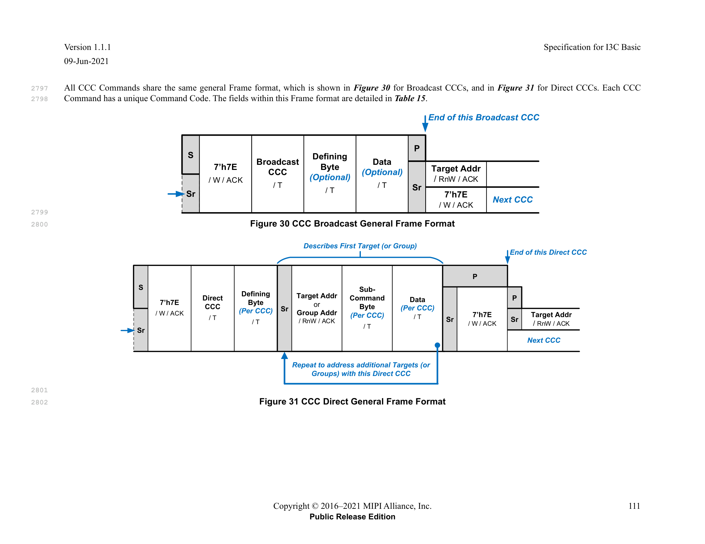

**==> picture [522 x 159] intentionally omitted <==**

**----- Start of picture text -----**<br>
Describes First Target (or Group)<br>End of this Direct CCC<br>P<br>S Sub-<br>Direct  Defining Target Addr Command  Data P<br>7’h7E CCC Byte  Sr or Byte  (Per CCC)<br>/ W / ACK / T (Per CCC) / T Group Addr / RnW / ACK (Per CCC) / T Sr / W / ACK 7’h7E Sr Target Addr / RnW / ACK<br>/ T<br>Sr<br>Next CCC<br>Repeat to address additional Targets (or<br>Groups) with this Direct CCC<br>**----- End of picture text -----**<br>


**Figure 31 CCC Direct General Frame Format** 


```
2801
2802
```

Copyright © 2016–2021 MIPI Alliance, Inc. 

111 

**Public Release Edition** 

Specification for I3C Basic 

Version 1.1.1 09-Jun-2021 

```
2803
```

**Table 15 CCC Frame Field Definitions** 

||**Table 15 CCC Frame Field Definitions**|**Table 15 CCC Frame Field Definitions**|
|---|---|---|
|**Field**|**Definition**||
|**S**or**Sr**|A CCC always begins with either START or Repeated START.||
|**I3C Address Header**|This field has three parts:||
||**7’h7E**|The CCC Frame starts with the global Broadcast Address, so that all<br>I3C Targets on the Bus will see the CCC Code that follows.|
||**W**|The RnW Bit is set to value 1’b0, indicating that the Controller is writing<br>a Message to the Targets.<br>This Message always includes the CCC Code, and may optionally<br>include further Data, depending upon the value of the CCC Code.|
||**ACK**|Acknowledgement (SDA driven Low) by all I3C Targets.|
|**Command Code / T**|An 8-bit value indicating which command is being sent, followed by a T-Bit.<br>All defined Command Code values are specified in**_Section 5.1.9.3_**.||
|**Defining Byte / T**<br>_(Per CCC)_|This field is used with Broadcast CCC Messages, and for some Direct<br>Read/Write CCC Messages. It is followed by a T-Bit.<br>**_Section 5.1.9.3_**specifies, for each defined CCC Code, the use of a Defining<br>Byte as a selector or Sub-Command, extending CCC capability or an action<br>associated with the CCC.<br>When the Defining Byte is used for a Direct CCC, it applies to all subsequent<br>Direct CCC Messages (i.e., segments) until the Controller sends a new Direct<br>CCC. For some Direct CCCs, a Defining Byte is optional; for others, it is<br>always required.||
|**Sub-Command Byte / T**<br>_(Per CCC)_|This field is used with some Direct CCCs. It is followed by a T-Bit.<br>In Direct CCC framing, this field always follows the Target Address (or Group<br>Address) for a specific Direct Write/SET CCC Message (i.e., segment) and<br>applies only to that Message.<br>**_Section 5.1.9.3_**specifies, for each defined CCC Code, whether a<br>Sub-Command Byte is required or optional.<br>**_Note:_**<br>_Sub-Command Bytes are not typically supported for Broadcast CCCs._||
|**Data / T**<br>_(Per CCC)_|This field is used with Broadcast CCC Messages, and for some Direct<br>Read/Write CCC Messages per Target (or, for some Write CCCs, per Group). It<br>is followed by a T-Bit.<br>**_Section 5.1.9.3_**specifies, for each defined CCC Code, how much Data (if any)<br>appears here.<br>**_Note:_**<br>_For Direct Read/GET CCCs, the Target shall use the T-Bit in the same_<br>_manner as a typical SDR Read transfer, per_**_Section 5.1.2.3.4_**_._||
|**Sr** **/ Broadcast Address**<br>_or_<br>**P**|A CCC always ends with either a STOP or a Repeated START and Broadcast<br>Address.||


Copyright © 2016–2021 MIPI Alliance, Inc. **Public Release Edition** 

112 

Version 1.1.1 09-Jun-2021 

Specification for I3C Basic 

## **5.1.9.2 Broadcast CCCs vs Direct CCCs** 

- **`2804`** The Command Code space is divided into Broadcast Commands and Direct Commands: 

- **`2805`** • **Broadcast Commands** are Command Codes 0x00 to 0x7F 

- **`2806`** • **Direct Commands** are Command Codes from 0x80 to 0xFE 

- **`2807`** • Command Code 0xFF is reserved. 

- **`2808`** As a result, a Target can easily determine whether a received Command is being Broadcast to all Targets on 

- **`2809`** the I3C Bus (1’b0), or is a Direct Command (1’b1) intended only for the particular Target, by inspecting Bit **`2810`** 7 (MSb) of the Command Code. 

## **5.1.9.2.1 End of a CCC Command** 

> **`2811`** A CCC Command shall end in one of the following three I3C Bus conditions: 

- **`2812`** • A STOP after the Command or Data 

- **`2813`** • For a Broadcast Command, a Repeated START (for any Address value) 

- **`2814`** • For a Direct Command, a Repeated START followed by 7’h7E (which may be the start of a new **`2815`** CCC, or may be followed by a Repeated START) 

**`2816`** If the CCC Command enters a Mode, then the Mode ends according to its own rules. 

- **`2817`** A 7’h7E following a Repeated START to end a Direct CCC may start another CCC, or may be followed by **`2818`** a Repeated START. 

- **`2819`** Although not a normal use, the Controller may terminate a Direct CCC Command without addressing any **`2820`** Target. 

- **`2821`** If the Controller invalidly terminates the data associated with a CCC prematurely, then the Target shall use **`2822`** best efforts to handle the termination and ascertain the proper course of action. That is, the Target may choose **`2823`** to disregard the event with no effect, or the Target may attempt to process the incomplete data. 

Copyright © 2016–2021 MIPI Alliance, Inc. **Public Release Edition** 

113 

Specification for I3C Basic 

Version 1.1.1 09-Jun-2021 

## **5.1.9.2.2 Framing Model for Direct CCC Commands** 

> **`2824`** In Direct CCC Commands the Frame contains first the Command Code, then one or more Repeated STARTs, **`2825`** then the Address of the Target, followed by Data, and finally either a STOP, or a Repeated START and 7’h7E. 

**`2826`** A single Direct CCC Command may also optionally address more than one Target Device. To do this, an **`2827`** additional block is inserted before the final 7’h7E for each additional desired Target Device (see _**Figure 31**_ ). **`2828`** Each such block consists of Repeated START, the Target Address of the additional desired Target Device, **`2829`** and the Data to be sent to or from that Target Device. Per _**Section 5.1.9.4**_ , a Group Address may also be used **`2830`** in the place of a Target Address for those Direct Write or Direct SET CCCs that can also be sent to an assigned **`2831`** Group. 

- **`2832`** With Direct Read/Write Direct CCC Commands, the Command Code may be followed by data, such as a **`2833`** Defining Byte. This will be explained in the details for each CCC. Further, each Target access may be a Write **`2834`** with 0 or more data bytes following from the Controller, or it may be a Read with 1 or more data bytes **`2835`** following from the Target, if it has ACKed the Read. The CCC Command Definition for each Direct CCC **`2836`** (see _**Section 5.1.9.3**_ ) will explain whether and how it uses the Write and Read. 

- **`2837`** Each addressed Target Device may either ACK or NACK the Direct CCC Command. For a Read request, the **`2838`** Target Device then returns the requested data in accordance with the SDR Read model, using the T-Bit to end **`2839`** the Read (see _**Section 5.1.2.3.4**_ ). 

- **`2840`** _**Note:**_ 

- **`2841`** _Future I3C CCC definitions could be extended so as to include additional data bytes beyond the ones_ **`2842`** _specified in this version of the I3C Specification. For this reason, all I3C Controller and Target Devices_ **`2843`** _shall ignore any additional, unrecognized data bytes (i.e., more data bytes than this Specification_ **`2844`** _defines for the given CCC Command)._ 

## **Target Handling of Unsupported Direct CCCs** 

**`2845`** If the Target detects an unsupported Direct CCC, then the Target shall generate NACK after its own matched **`2846`** (i.e., assigned) Address in the Direct CCC framing, and shall then wait for STOP or Repeated START. 

**`2847`** A CCC is considered unsupported in the following cases: 

- **`2848`** • If the Target detects a Command Code it does not support 

- **`2849`** • If the Target detects a Defining Byte it does not support, for a Command Code that it does support 

- **`2850`** • If the Target receives a matching Address (i.e., Dynamic or Group) with Write when it expects **`2851`** (based on that CCC’s definition) a Direct Read or Direct GET 

- **`2852`** • If the Target receives a matching Dynamic Address with Read when it expects (based on that **`2853`** CCC’s definition) a Direct Write or Direct SET 

**`2854`** _**Note:**_ 

- **`2855`** _Handling an unsupported CCC is not necessarily associated with Error Type TE5 (see_ 

**`2856`** _**Section 5.1.10.1.6** ), which defines how a Target handles illegally formatted CCCs. The effect of a_ **`2857`** _Target generating NACK for unsupported CCCs could seem identical to the I3C Controller._ 

- **`2858` Optional Defining Bytes** 

**`2859`** Starting with I3C Basic v1.1.1 and I3C v1.1, some Direct GET CCCs that earlier I3C versions defined as not **`2860`** having Defining Bytes may now optionally use Defining Bytes. This mechanism allows Target behavior to **`2861`** be extended, or for the Target to indicate alternate status or capabilities, based on the Defining Byte value. **`2862`** _**Note:**_ 

**`2863`** _This section does not apply to Direct CCCs that show the Defining Byte field as Required in_ _**Table 16**_ **`2864`** _as well as the CCC’s definition in this Specification._ 

**`2865`** In these cases, an I3C Target that supports Defining Bytes for such a CCC shall generally treat a Defining **`2866`** Byte value of zero as though the Defining Byte were not present; i.e., the same behavior as if the same CCC **`2867`** had been transmitted with no Defining Byte. 

Copyright © 2016–2021 MIPI Alliance, Inc. **Public Release Edition** 

114 

Version 1.1.1 09-Jun-2021 

Specification for I3C Basic 

- **`2868`** In order to properly distinguish a Direct CCC sent without a Defining Byte from one sent with a Defining **`2869`** Byte, each Target shall track the Command Code value as well as the Defining Byte value (if present), and **`2870`** then respond appropriately when it sees a Repeated START before its own matched Address. In effect, the **`2871`** Target can regard such a Direct CCC either as an 8-bit Command Code, or as a 16-bit Command Code that **`2872`** includes the optional Defining Byte. 

- **`2873`** If the Target supports a Direct CCC without a Defining Byte, but does not support that same Direct CCC **`2874`** when used with a particular Defining Byte value, then it shall NACK the Direct CCC Command after the **`2875`** Target Address. The Controller shall then assume that the Target does not support that particular Defining **`2876`** Byte for that Direct CCC; however, the Controller shall not infer the presence or absence of any particular **`2877`** Target feature or capability based solely upon the fact that the Target NACKed that particular combination **`2878`** of CCC and Defining Byte. The Controller should also not assume that the Target does not generally support **`2879`** the Direct CCC. 

- **`2880`** _**Note:**_ 

- **`2881`** _The Controller is responsible for determining whether the Target supports any given Defining Bytes_ **`2882`** _for a given CCC. Depending on the particular CCC, this can usually be determined by checking other_ **`2883`** _status bits or capabilities advertised by the Target, such as by reading a value returned from a Direct_ **`2884`** _GET CCC without a Defining Byte._ 

- **`2885`** _The Controller must also determine whether the Target supports Defining Bytes at all (i.e., whether_ **`2886`** _the Target complies with v1.1 or higher of either the I3C Basic Specification or the full I3C_ **`2887`** _Specification). If the Controller attempts to send a Direct CCC with a Defining Byte to a Target that_ **`2888`** _does not comply with either I3C Basic v1.1.1 or higher or I3C v1.1 or higher, then the results may be_ **`2889`** _undefined._ 

Copyright © 2016–2021 MIPI Alliance, Inc. **Public Release Edition** 

115 

Specification for I3C Basic 

Version 1.1.1 09-Jun-2021 

## **5.1.9.2.3 Retry Model for Direct GET CCC Commands** 

> **`2890`** I3C mandates a single-retry model for Direct GET CCC Commands. 

**`2891`** Recall that a Direct GET CCC Command first sends an overall GET command to all Targets using the **`2892`** Broadcast Address 7’h7E, and then sends individual Dynamic Address(es) for each Target, in order to **`2893`** stimulate per-Target response(s). This requires the Target to be in a state allowing an immediate response if **`2894`** its Address is transmitted, but also to be prepared for its Address not to be transmitted (and therefore for the **`2895`** Target not to have to actually respond). For Direct GET CCC Commands that the Target supports in hardware, **`2896`** such as those dealing with information locally known within the Target (like GETBCR), this requirement **`2897`** generally presents no issues. But for Direct GET CCCs supported by the Target’s system, or those supported **`2898`** by software in the Target, it’s possible that the Target might not be able to respond to the Direct GET CCC in **`2899`** time. 

**`2900`** Such situations are handled with the following single-retry model, which applies to Direct GET CCC **`2901`** Commands only. **`2902`** If a Target cannot provide a response to a Direct GET CCC Command in time, then: 

```
2903
```

   1. The Target shall NACK its Address. 

- **`2904`** 2. The Controller shall then emit a Repeated START, followed by the Target Address. Note that this **`2905`** is a second transmission of the Target Address. This gives the Target extra time to prepare its **`2906`** response. As a further measure to give the Target even more time to prepare its response, the **`2907`** Controller may optionally also employ a clock delay (per _**Section 5.1.2.5**_ ) after the Target’s NACK **`2908`** and before the Controller’s Repeated START. 

- **`2909`** 3. The Target should respond to the retry attempt in step 2 with an ACK, and then transmit the results **`2910`** requested by the Direct GET CCC. 

**`2911`** This Retry Model is limited to a single retry. Any Target still unable (for any reason) to respond to the retry **`2912`** attempt from step 2 will NACK it. If a Target NACKs the second attempt in step 2, then the Controller shall **`2913`** not attempt further retries to that Target. 

**`2914`** Note that step 2 only occurs if the Target NACKs the original Direct GET CCC request. As a result, this retry **`2915`** model never imposes a time penalty, except in cases where the Target actually needs the extra time. 

Copyright © 2016–2021 MIPI Alliance, Inc. **Public Release Edition** 

116 

Version 1.1.1 09-Jun-2021 

Specification for I3C Basic 

## **5.1.9.3 CCC Command Definitions** 

> **`2916`** _**Table 16**_ lists all defined I3C Common Command Codes (CCCs). See also _**Table 61**_ and _**Table 62**_ , which specify **`2917`** the HDR Modes in which each CCC can be used. Below _**Table 16**_ , a subsection details each defined CCC. 

**`2918`** In _**Table 16**_ : 

```
2919
```

```
2920
```

   - The **CCC is Required / Conditional / Optional** column indicates: 

      - **R** : The CCC is **Required** . It shall be supported by all I3C Controllers and by all I3C Targets. 

- **`2921`** • **C** : The CCC is **Conditionally required** . It shall be supported if the I3C Controller or I3C Target **`2922`** meets the “Required If:” condition shown in the Description column. 

- **`2923`** • **O** : The CCC is **Optional** . It may be supported by an I3C Controller or I3C Target at the discretion **`2924`** of the manufacturer. 

- **`2925`** • **N** : The CCC is **Not included** in I3C Basic. It shall not be supported by or used by any I3C Basic **`2926`** Devices. 

```
2927
```

## _**Note:**_ 

**`2928`** _Other I3C Controller Devices that comply with the full I3C Specification should not expect to use CCCs_ **`2929`** _indicated as_ _**Not included** with an I3C Basic Target Device, and must properly mitigate any resulting_ **`2930`** _interoperability issues._ 

**`2931`** When a non-Required CCC is supported by an I3C Device, it shall be implemented as defined in this **`2932`** Specification. 

- **`2933`** • The **CCC Framing** columns indicate, for CCC fields **Defining Byte** and **Sub-Command Byte** : 

   - **R** : The field is **Required** for this CCC (i.e., the CCC’s framing always includes the field). 

```
2934
```

- **`2935`** • **O** : The field is **Optional** for this CCC (i.e., the CCC’s framing allows the field to be either **`2936`** provided, or not provided). **`2937`** • **N** : The field is 

   - **N** : The field is **Not permitted** for this CCC (i.e., the CCC’s framing never includes the field). 

Copyright © 2016–2021 MIPI Alliance, Inc. **Public Release Edition** 

117 

Specification for I3C Basic 

Version 1.1.1 09-Jun-2021 

```
2938
```

## **Table 16 I3C Common Command Codes** 

|**Command**<br>**Code**|**CCC Type**|**CCC is**<br>**Required /**<br>**Conditional /**<br>**Optional**|**CCC Framing**|**CCC Framing**|**Command Name**<br>|**Detailed**<br>**in Section**|**Description**|
|---|---|---|---|---|---|---|---|
||||**Defining**<br>**Byte**|**Sub-**<br>**Command**<br>**Byte**||||
|**0x00**|||||**ENEC**||Enable Target event driven interrupts|
||Broadcast|R|N|N||**_5.1.9.3.1_**||
||||||Enable Events Command||Default State: On|
|||||||||
|**0x01**|||||**DISEC**||Disable Target event driven interrupts|
||Broadcast|R|N|N||**_5.1.9.3.1_**||
||||||Disable Events Command||Default State: Off|
|||||||||
|**0x02**|||||||Set Activity State 0 (normal operation).|
||Broadcast|C1|N|N|**ENTAS0**|**_5.1.9.3.2_**|Default State: On|
||||||Enter Activity State 0||**Required If:**Target supports any other ENTASx CCC(s)|
|||||||||
||||||||per**_Section 5.1.9.3.2_**|
|**0x03**|||||**ENTAS1**||Set Activity State 1|
||Broadcast|O1|N|N||**_5.1.9.3.2_**||
||||||Enter Activity State 1||Default State: Off|
|||||||||
|**0x04**|||||**ENTAS2**||Set Activity State 2|
||Broadcast|O1|N|N||**_5.1.9.3.2_**||
||||||Enter Activity State 2||Default State: Off|
|||||||||
|**0x05**|||||**ENTAS3**||Set Activity State 3|
||Broadcast|O1|N|N||**_5.1.9.3.2_**||
||||||Enter Activity State 3||Default State: Off|
|||||||||
|**0x06**|||||**RSTDAA**||Forget current Dynamic Address and wait for new|
||Broadcast|R|N|N||**_5.1.9.3.3_**||
||||||Reset Dynamic Address Assignment||assignment|
|||||||||
|**0x07**|||||||Controller has started the Dynamic Address Assignment|
||||||||procedure.|
||||||**ENTDAA**||Per**_Section 5.1.4.2_**a Target that supports Dynamic|
||Broadcast|R9|N|N||**_5.1.9.3.4_**|,<br>Address Assignment shall participate unless it already|
||||||Enter Dynamic Address Assignment|||
||**S**|**ee Errata 0**<br>**Item 8**|**1,**||||has an Address assigned.|
||||||||**Required If:**Target does not have an assigned Static|
||||||||Address, or supports Hot-Join per**_Section 5.1.5_**|
|**0x08**|||||||Controller defines Dynamic Address, DCR Type, and|
||Broadcast|C|N|N|**DEFTGTS**|**_5.1.9.3.7_**|Static Address (or 0) per Target|
||||||Define List of Targets||**Required If:**There are any Secondary Controllers per|
||||||||<br>**_Section 5.1.7_**|


Copyright © 2016–2021 MIPI Alliance, Inc. 

118 

**Public Release Edition** 

Version 1.1.1 

Specification for I3C Basic 

## 09-Jun-2021 

|**Command**<br>**Code**|**CCC Type**|**CCC is**<br>**Required /**<br>**Conditional /**<br>**Optional**|**CCC Framing**|**CCC Framing**|**Command Name**<br>|**Detailed**<br>**in Section**|**Description**|
|---|---|---|---|---|---|---|---|
||||**Defining**<br>**Byte**|**Sub-**<br>**Command**<br>**Byte**||||
|**0x09**||||||||
||Broadcast|R6|N|N|**SETMWL**|**_5.1.9.3.5_**|Maximum write length in a single command|
||||||Set Max Write Length|||
|||||||||
|**0x0A**||||||||
||Broadcast|R7|N|N|**SETMRL**|**_5.1.9.3.6_**|Maximum read length in a single command|
||||||Set Max Read Length|||
|||||||||
|**0x0B**|Broadcast|O|N|N|**ENTTM**<br>Enter Test Mode|**_5.1.9.3.8_**|Controller has entered Test Mode|
|**0x0C**|Broadcast|O|N|N|**SETBUSCON**<br>Set Bus Context|**_5.1.9.3.31_**|Controller specifies a higher-level protocol and/or I3C<br>specification version that the Bus will use|
|_0x0D – 0x11_|_–_|_N/A_|_–_|_–_|_MIPI Reserved_|**_–_**|_Reserved for future use by MIPI Alliance_|
|**0x12**|Broadcast|C|R|N|**ENDXFER**<br>Data Transfer Ending Procedure Control|**_5.1.9.3.25_**|Framework for Controllers and Targets to exchange set-<br>up parameters for ending data transfers in supported<br>HDR Modes<br>**Required If:**Target supports HDR Flow Control per<br>**_Section 5.2.2.3_**|
|_0x13 – 0x1E_|_–_|_N/A_|_–_|_–_|_MIPI Reserved_|**_–_**|_Reserved for future use by MIPI Alliance_|
|**0x1F**|N/A|C|_–_|_–_|**Reserved**<br>For use in special CCC flows for HDR Modes<br>only.|**_5.2.1.2.1_**|Dummy command code only, for use during CCC flows<br>in HDR Modes, to signal the end of CCC modality and<br>return to generic HDR transaction<br>**Required If:**Target supports CCC flows in HDR Modes<br>(e.g., HDR-DDR)|
|**0x20**|Broadcast|C3|N|N|**ENTHDR0**<br>Enter HDR Mode 0|**_5.1.9.3.9_**|Controller has entered HDR-DDR Mode<br>**Required If:**Target supports HDR Mode 0 per<br>**_Section 5.2_**|
|0x21|||||||Controller has entered HDR-TSP Mode|
||||||ENTHDR1|||
||Broadcast|N3|N|N||_5.1.9.3.9_||
||||||Enter HDR Mode 1||_This HDR Mode is not included in the I3C Basic_|
||||||||_Specification_|
|||||||||
|0x22|||||||Controller has entered HDR-TSL Mode|
||||||ENTHDR2|||
||Broadcast|N3|N|N||_5.1.9.3.9_||
||||||||_This HDR Mode is not included in the I3C Basic_|
||||||Enter HDR Mode 2|||
||||||||_Specification_|
|||||||||
|**0x23**|Broadcast|C_3_|N|N|**ENTHDR3**<br>Enter HDR Mode 3|**_5.1.9.3.9_**|Controller has entered HDR-BT Mode<br>**Required If:**Target supports HDR Mode 3 per<br>**_Section 5.2_**|


Copyright © 2016–2021 MIPI Alliance, Inc. **Public Release Edition** 

119 

Specification for I3C Basic 

Version 1.1.1 

09-Jun-2021 

|**Command**<br>**Code**|**CCC Type**|**CCC is**<br>**Required /**<br>**Conditional /**<br>**Optional**|**CCC Framing**|**CCC Framing**|**Command Name**<br>|**Detailed**<br>**in Section**|**Description**|
|---|---|---|---|---|---|---|---|
||||**Defining**<br>**Byte**|**Sub-**<br>**Command**<br>**Byte**||||
|0x24|||||||Controller has entered HDR – Future|
||||||ENTHDR4|||
||Broadcast|N_3_|N|N||_–_|_This HDR Mode is not included in the I3C Basic_|
||||||Enter HDR Mode 4||_Specification, and not yet defined in the full I3C_|
||||||||<br>_Specification_|
|0x25|||||||Controller has entered HDR – Future|
||||||ENTHDR5|||
||Broadcast|N_3_|N|N||_–_|_This HDR Mode is not included in the I3C Basic_|
||||||Enter HDR Mode 5||_Specification, and not yet defined in the full I3C_|
||||||||<br>_Specification_|
|0x26|||||||Controller has entered HDR – Future|
||||||ENTHDR6|||
||Broadcast|N_3_|N|N||_–_|_This HDR Mode is not included in the I3C Basic_|
||||||Enter HDR Mode 6||_Specification, and not yet defined in the full I3C_|
||||||||<br>_Specification_|
|0x27|||||||Controller has entered HDR – Future|
||||||ENTHDR7|||
||Broadcast|N_3_|N|N||_–_|_This HDR Mode is not included in the I3C Basic_|
||||||Enter HDR Mode 7||_Specification, and not yet defined in the full I3C_|
||||||||<br>_Specification_|
|**0x28**|Broadcast|C|N|R|**SETXTIME**<br>Exchange Timing Information|**_5.1.9.3.21_**|Framework for exchanging event timing information<br>**Required If:**Target supports any Timing Control mode<br>per**_Section 5.1.8_**|
|**0x29**|Broadcast|O|N|N|**SETAASA**<br>Set All Addresses to Static Addresses|**_5.1.9.3.23_**|Controller tells every Target with a Static Address to use<br>it as the Dynamic Address|
|**0x2A**|Broadcast|R|R|N|**RSTACT**<br>Target Reset Action|**_5.1.9.3.26_**|Configure and query Target Reset action and timing|
|**0x2B**|Broadcast|C|N|N|**DEFGRPA**<br>Define List of Group Address|**_5.1.9.3.29_**|Controller tells Secondary Controllers details about an<br>indicated Group Address<br>**Required If:**Device is a Secondary Controller and<br>supports Group Addressing per**_Section 5.1.4.4_**|
|**0x2C**|Broadcast|C|N|N|**RSTGRPA**<br>Reset Group Address|**_5.1.9.3.28_**|Controller removes a Target from an indicated Group<br>Address by resetting the assigned Group Address<br>**Required If:**Target supports Group Addressing per<br>**_Section 5.1.4.4_**|
|**0x2D**|Broadcast|C|R|N|**MLANE**<br>Multi-Lane Data Transfer Control|**_5.1.9.3.30_**|Control a Multi-Lane Data Transfer<br>**Required If:**Target supports Multi-Lane per**_Section 5.3_**|


Copyright © 2016–2021 MIPI Alliance, Inc. **Public Release Edition** 

120 

Version 1.1.1 

Specification for I3C Basic 

## 09-Jun-2021 

|**Command**<br>**Code**|**CCC Type**|**CCC is**<br>**Required /**<br>**Conditional /**<br>**Optional**|**CCC Framing**|**CCC Framing**|**Command Name**<br>|**Detailed**<br>**in Section**|**Description**|
|---|---|---|---|---|---|---|---|
||||**Defining**<br>**Byte**|**Sub-**<br>**Command**<br>**Byte**||||
|_0x2E – 0x48_|_–_|_N/A_|_–_|_–_|_MIPI I3C WG Reserved_|**_–_**|_Reserved for future use by MIPI Alliance I3C WG_|
|_0x49 – 0x4C_|||_–_|_–_|||_Reserved for future use by MIPI Alliance Camera_|
||_Broadcast_|_N/A_|||_MIPI Camera WG Reserved – Broadcast CCCs_|**_–_**||
||||||||_Working Group_|
|||||||||
|_0x4D – 0x57_|_Broadcast_|_N/A_|_–_|_–_|_MIPI Reserved – Broadcast CCCs_|**_–_**|_Reserved for future use by other MIPI Working Groups_|
|_0x58 – 0x5B_|_Broadcast_|_N/A_|_–_|_–_|_MIPI Debug WG Reserved – Broadcast CCCs_|**_–_**|_Reserved for use by MIPI Alliance Debug Working Group_|
|_0x5C – 0x60_|_Broadcast_|_N/A_|_–_|_–_|_MIPI RIO WG Reserved – Broadcast CCCs_|**_–_**|_Reserved for use by MIPI Alliance RIO Working Group_|
|**0x61 – 0x7F**|Broadcast|N/A|_–_|_–_|Vendor / Standards Extension –<br>Broadcast CCCs||For Vendor or Standards10use|
|||||||**_–_**||
|||||||||
|**0x80**|||||**ENEC**||Enable Target event driven interrupts|
||Direct|R|N|N||**_5.1.9.3.1_**||
||||||Enable Events Command||Default State: On|
|||||||||
|**0x81**|||||**DISEC**||Disable Target event driven interrupts|
||Direct|R|N|N||**_5.1.9.3.1_**||
||||||Disable Events Command||Default State: Off|
|||||||||
|**0x82**|Direct|C1|N|N|**ENTAS0**<br>Enter Activity State 0|**_5.1.9.3.2_**|Set Activity Mode to State 0 (normal operation).<br>Default State: On<br>**Required If:**Target supports any other ENTASx CCC<br>per**_Section 5.1.9.3.2_**|
|**0x83**|Direct|O1|N|N|**ENTAS1**<br>Enter Activity State 1|**_5.1.9.3.2_**|Set Activity State 1<br>Default State: Off|
|**0x84**|Direct|O1|N|N|**ENTAS2**<br>Enter Activity State 2|**_5.1.9.3.2_**|Set Activity State 2<br>Default State: Off|
|**0x85**|Direct|O1|N|N|**ENTAS3**<br>Enter Activity State 3|**_5.1.9.3.2_**|Set Activity State 3<br>Default State: Off|
|**0x86**|||||**_DEPRECATED:_**||v1.1 Controllers shall not use|
||Direct|R|_–_|_–_|RSTDAA Direct|**_5.1.9.3.3_**|<br>v1.0 Controllers should not use|
||||||Reset Dynamic Address Assignment||v1.1 Targets shall NACK|


Copyright © 2016–2021 MIPI Alliance, Inc. **Public Release Edition** 

121 

Specification for I3C Basic 

Version 1.1.1 

09-Jun-2021 

|**Command**<br>**Code**|**CCC Type**|**CCC is**<br>**Required /**<br>**Conditional /**<br>**Optional**|**CCC Framing**|**CCC Framing**|**Command Name**<br>|**Detailed**<br>**in Section**|**Description**|
|---|---|---|---|---|---|---|---|
||||**Defining**<br>**Byte**|**Sub-**<br>**Command**<br>**Byte**||||
|**0x87**|Direct Set|O|N|N|**SETDASA**<br>Set Dynamic Address from Static Address|**_5.1.9.3.10_**|Controller assigns a Dynamic Address to a Target with a<br>known Static Address.|
|**0x88**|Direct Set|C9|N|N|**SETNEWDA**<br>Set New Dynamic Address|**_5.1.9.3.11_**|Controller assigns a new Dynamic Address to any I3C<br>Target with an existing Dynamic Address<br>**Required If:**ENTDAA is supported|
|**0x89**|Direct Set|R2|N|N|**SETMWL**<br>Set Max Write Length|**_5.1.9.3.5_**|Maximum write length in a single command|
|**0x8A**|Direct Set|R2|N|N|**SETMRL**<br>Set Max Read Length|**_5.1.9.3.6_**|Maximum read length in a single command|
|**0x8B**|Direct Get|R2|N|N|**GETMWL**<br>Get Max Write Length|**_5.1.9.3.5_**|Get Target’s maximum possible write length|
|**0x8C**|Direct Get|R2|N|N|**GETMRL**<br>Get Max Read Length|**_5.1.9.3.6_**|Get Target’s maximum possible read length|
|**0x8D**|Direct Get|C|N|N|**GETPID**<br>Get Provisioned ID|**_5.1.9.3.12_**|Get Target’s Provisioned ID<br>**Required If:**ENTDAA is supported|
|**0x8E**|Direct Get|C|N|N|**GETBCR**<br>Get Bus Characteristics Register|**_5.1.9.3.13_**|Get Target’s Bus Characteristic Register (BCR)<br>**Required If:**ENTDAA is supported|
|**0x8F**|Direct Get|C|N|N|**GETDCR**<br>Get Device Characteristics Register|**_5.1.9.3.14_**|Get a Device’s Device Characteristics Register (DCR)<br>**Required If:**ENTDAA is supported|
|**0x90**|Direct Get|R|O|N|**GETSTATUS**<br>Get Device Status|**_5.1.9.3.15_**|Get a Device’s operating status|
|**0x91**|Direct Get|C|N|N|**GETACCCR**<br>Get Accept Controller Role|**_5.1.9.3.16_**|Active Controller is passing the Bus Controller Role to a<br>Secondary Controller and confirming its acceptance<br>**Required If:**There are Secondary Controllers per<br>**_Section 5.1.7_**|
|**0x92**|Direct|C|R|N|**ENDXFER**<br>Data Transfer Ending Procedure Control|**_5.1.9.3.25_**|Framework for Controllers and Targets to exchange set-<br>up parameters for ending data transfers in supported<br>HDR Modes<br>**Required If:**Target supports HDR Flow Control per<br>**_Section 5.2.2.3_**|


Copyright © 2016–2021 MIPI Alliance, Inc. **Public Release Edition** 

122 

Version 1.1.1 

Specification for I3C Basic 

## 09-Jun-2021 

|**Command**<br>**Code**|**CCC Type**|**CCC is**<br>**Required /**<br>**Conditional /**<br>**Optional**|**CCC Framing**|**CCC Framing**|**Command Name**<br>|**Detailed**<br>**in Section**|**Description**|
|---|---|---|---|---|---|---|---|
||||**Defining**<br>**Byte**|**Sub-**<br>**Command**<br>**Byte**||||
|**0x93**|Direct Set|O|N|N|**SETBRGTGT**<br>Set Bridge Targets|**_5.1.9.3.17_**|Controller tells Bridge (to/from I2C, SPI, UART, etc.) what<br>endpoints it is talking to (by Dynamic Address and<br>type/ID)|
|**0x94**|Direct Get|C4|O|N|**GETMXDS**<br>Get Max Data Speed|**_5.1.9.3.18_**|Controller asks Target for its SDR Mode maximum. Read<br>and Write data speeds (& optionally maximum Read<br>Turnaround time)<br>**Required If:**Target has BCR Bit[0] set to 1’b1 per<br>**_Section 5.1.1.2.1_**|
|**0x95**|Direct Get|C5, 8|O|N|**GETCAPS**<br>_(formerly_**_GETHDRCAPS_**_)_<br>Get Optional Feature Capabilities|**_5.1.9.3.19_**|Controller asks Target what optional capabilities it<br>supports<br>**Required If:**The Target’s I3C Basic version is v1.1 or<br>later|
|**0x96**|Direct|O|N|N|**SETROUTE**<br>Set Route|**_5.1.9.3.20_**|Controller tells Routing Device what Route(s) to enable|
|0x97||||||||
||Direct|N|_–_|_–_|D2DXFER|**_5.1.9.3.24_**|_This CCC is not included in the I3C Basic Specification._|
||||||Device to Device(s) Tunneling Control|||
|||||||||
|**0x98**|Direct|C|N|R|**SETXTIME**<br>Set Exchange Timing Information|**_5.1.9.3.21_**|Framework for exchanging event timing information<br>**Required If:**Target supports any Timing Control Mode<br>per**_Section 5.1.8_**|
|**0x99**|Direct|C|N|N|**GETXTIME**<br>Get Exchange Timing Information|**_5.1.9.3.22_**|Framework for exchanging event timing information<br>**Required If:**Target supports any Timing Control Mode<br>per**_Section 5.1.8_**|
|**0x9A**|Direct|R|R|N|**RSTACT**<br>Target Reset Action|**_5.1.9.3.26_**|Configure and query Target Reset action and timing|
|**0x9B**|Direct|C|N|N|**SETGRPA**<br>Set Group Address|**_5.1.9.3.29_**|Controller assigns Group Addresses<br>**Required If:**Target supports Group Addressing per<br>**_Section 5.1.4.4_**|
|**0x9C**|Direct|C|N|N|**RSTGRPA**<br>Reset Group Address|**_5.1.9.3.28_**|Controller removes a Target from an indicated Group<br>Address by resetting the assigned Group Address<br>**Required If:**Target supports Group Addressing per<br>**_Section 5.1.4.4_**|
|**0x9D**|Direct|C|R|N|**MLANE**<br>Multi-Lane Data Transfer Control|**_5.1.9.3.30_**|Control a Multi-Lane Data Transfer<br>**Required If:**Target supports Multi-Lane per**_Section 5.3_**|


Copyright © 2016–2021 MIPI Alliance, Inc. **Public Release Edition** 

123 

Specification for I3C Basic 

Version 1.1.1 

09-Jun-2021 

|**Command**<br>**Code**|**CCC Type**|**CCC is**<br>**Required /**<br>**Conditional /**<br>**Optional**|**CCC Framing**|**CCC Framing**|**Command Name**<br>|**Detailed**<br>**in Section**|**Description**|
|---|---|---|---|---|---|---|---|
||||**Defining**<br>**Byte**|**Sub-**<br>**Command**<br>**Byte**||||
|_0x9E_–_0xBF_|_Direct_|_N/A_|_–_|_–_|_MIPI I3C WG Reserved – Direct CCCs_|**_–_**|_Reserved for future use by MIPI Alliance I3C WG_|
|_0xC0_–_0xC3_|_Direct_|_N/A_|_–_|_–_|_MIPI Camera WG Reserved – Direct CCCs_|**_–_**|_Reserved for future use by MIPI Alliance Camera WG_|
|_0xC4_–_0xD6_|_Direct_|_N/A_|_–_|_–_|_MIPI Reserved – Direct CCCs_|**_–_**|_Reserved for future use by other MIPI Alliance WGs_|
|_0xD7_–_0xDA_|_Direct_|_N/A_|_–_|_–_|_MIPI Debug WG Reserved – Direct CCCs_|**_–_**|_Reserved for use by MIPI Alliance Debug WG_|
|_0xDB_–_0xDF_|_Direct_|_N/A_|_–_|_–_|_MIPI RIO WG Reserved – Direct CCCs_|**_–_**|_Reserved for use by MIPI Alliance RIO WG_|
|**0xE0 – 0xFE**|Direct|N/A|_–_|_–_|Vendor / Standards Extension – Direct CCCs|**_–_**|For Vendor or Standards10use|
|_0xFF_|_–_|_N/A_|_–_|_–_|_MIPI I3C WG Reserved_|**_–_**|_Reserved for future use by MIPI Alliance I3C WG_|
|**_Note:_**<br>_1) Target Devices may self-power-manage based on this information._<br>_2) Applies to Target Devices that support a variable limit on the maximum number of data bytes per Message, where that limit may exceed 16 bytes._<br>_3) All I3C compliant Targets shall recognize that the Bus is entering an HDR Mode, and detect the HDR Exit Pattern._<br>_4) This CCC shall be supported by Target Devices with Bus Control Register (BCR) Bit[0] set to 1’b1._<br>_5) This CCC shall be supported by Target Devices that support any HDR Mode._<br>_6) See_**_Section 5.1.9.3.5_Set/Get Max Write Length (SETMWL/GETMWL)**_._<br>_7) See_**_Section 5.1.9.3.6_Set/Get Max Read Length (SETMRL/GETMRL)**_._<br>_8) This CCC shall be supported by all I3C Basic v1.1.1 Devices. However, it was not included in v1.0 of the I3C Basic Specification (see_**_Section 5.1.9.3.19_**_)._<br>_9) A Target Device that will only ever be used on special-purpose I3C Buses that do not require Enter DAA may choose to not implement support for the ENTDAA CCC. (Such_<br>_special-purposes I3C Buses use static addresses via SETAASA/SETDASA instead of ENTDAA). Such a Target may also choose not to implement support for the_<br>_SETNEWDA CCC, per_**_Section 5.1.9.3.11_**_; in this case, the Target’s Static Address effectively becomes its fixed Dynamic Address._<br>_10) Standards use of Vendor CCC’s controlled by Bus Context. (See_**_Section 5.1.9.3.31_**_and public registry at_<br>_https://www.mipi.org/MIPI_I3C_bus_context_byte_values_public.html _**_[MIPI07]_**_._||||||||


Copyright © 2016–2021 MIPI Alliance, Inc. **Public Release Edition** 

124 

Version 1.1.1 09-Jun-2021 

Specification for I3C Basic 

## **5.1.9.3.1 Enable/Disable Target Events Command (ENEC/DISEC)** 

> **`2939`** These four Direct ( _**Figure 32**_ ) or Broadcast ( _**Figure 33**_ ) CCCs allows the Controller to control when Target-initiated traffic is allowed (i.e., Enabled) vs. is not **`2940`** allowed (i.e., Disabled) on the I3C Bus. This control governs a Target’s attempts to request an Interrupt (ENINT/DISINT), to request the Controller Role **`2941`** (ENCR/DISCR), or to signify a Hot-Join event (ENHJ/DISHJ). 

```
2942
```

```
2943
2944
```

**Table 17 Enable/Disable Target Events Command Codes (ENEC/DISEC)** 

|**Command**|**Command**|**Command**|**Command**||**Support**|**Support**|**Command Codes**|**Command Codes**|**Command Codes**|**Command Codes**|**Command Codes**|**Command Codes**||**Purpose**|**Purpose**|**Purpose**|**Purpose**|**Purpose**|
|---|---|---|---|---|---|---|---|---|---|---|---|---|---|---|---|---|---|---|
||||||||**Broadcast**|||**Direct**|||||||||
||**ENEC**||||Required||0x00|||0x80||||Enable Target Events|||||
||**DISEC**||||Required||0x01|||0x81||||Disable Target|||Events||
||||||||**_Describes First Target_**||||||||||||
||||||||||||||||||**_n o s rec_**||
||||||||||||||||||**P**||
|||**S**|**7’h7E**<br>/ W / ACK||**Direct**<br>**ENEC/**<br>**DISEC**<br>**CCC**<br>/ T||**Sr**|**Target Addr**<br>/ W / ACK||**Enable/**<br>**Disable Target**<br>**Events Byte**<br>/ T||||**P**|||||
||||||||||||||**Sr**||**7’h7E**<br>/ W / ACK||**P**||
|||**Sr**|||||||||||||||**Sr**|**Target Addr**<br>/RnW / ACK|
||||||||||||||||||**_Next CCC_**||
||||||||**_Repeat to address additional_**<br>**_Targets with this Direct CCC_**||||||||||||
||||||||||||||**1: Direct**||||||
||||||**S**|**7’h7E**<br>/ W / ACK||**Broadcast**<br>**ENEC/**<br>**DISEC**<br>**CCC**<br>/ T|**Enable/**<br>**Disable**<br>**Target**<br>**Events**<br>**Byte**<br>/ T||**P**||||||||
||||||||||||**Sr**|**Target Addr**<br>/RnW / ACK|||||||
||||||**Sr**||||||||||||||
|||||||||||||**7’h7E**<br>/ W / ACK||||**_Next CCC_**|||
||||||**Figure 33 ENEC/DISEC Format**||||||||||||||


```
2945
2946
```

Copyright © 2016–2021 MIPI Alliance, Inc. **Public Release Edition** 

125 

Specification for I3C Basic 

Version 1.1.1 09-Jun-2021 

**`2947`** _**Table 18**_ and _**Table 19**_ show the bits to set in the Target Events Byte to enable and disable, respectively, the four supported I3C Target/Secondary Controller event **`2948`** types. Reserved bits are for future MIPI use. 

```
2949
```

## **Table 18 Enable Target Events Command Byte Format** 

|**Bit 7**|**Bit 6**|**Bit 5**|**Bit 4**|**Bit 3**|**Bit 2**|**Bit 1**|**Bit 0**|
|---|---|---|---|---|---|---|---|
|Reserved||||ENHJ|Reserved|ENCR|ENINT|


```
2950
```

## **Table 19 Disable Target Events Command Byte Format** 

|**Bit 7**|**Bit 6**|**Bit 5**|**Bit 4**|**Bit 3**|**Bit 2**|**Bit 1**|**Bit 0**|
|---|---|---|---|---|---|---|---|
|Reserved||||DISHJ|Reserved|DISCR|DISINT|


**`2951`** The supported I3C Target/Secondary Controller event types are: 

- **`2952`** • **Target Interrupt Requests:** Enable (ENINT) / Disable (DISINT) **`2953`** These bits allow the Controller to control when Target-initiated (i.e., In-Band) Interrupts are (ENINT) and are not (DISINT) allowed on the I3C Bus. 

**`2954`** Note that this capability is enabled by default in Targets that support In-Band Interrupt capability. 

- **`2955`** • **Controller Role Requests:** Enable (ENCR) / Disable (DISCR) **`2956`** These bits allow the Active Controller to control when Controller Role Requests from Secondary Controllers are (ENCR) and are not (DISCR) allowed **`2957`** on the I3C Bus. 

**`2958`** This capability shall be enabled by default in Secondary Controllers that support Controller Role Request capability. 

- **`2959`** • **Hot-Join Event:** Enable (ENHJ) / Disable (DISHJ) **`2960`** These bits allow the Controller to control when Target-initiated Hot-Join is (ENHJ) and is not (DISHJ) allowed on the I3C Bus. The Controller can 

- **`2961`** Broadcast this CCC in order to command Devices to refrain from making Dynamic Address Assignment requests until later authorized by the Controller, **`2962`** in case the Controller isn’t ready to service the Hot-Joining Device(s). (Hot-Join events are asynchronous.) 

- **`2963`** This capability shall be enabled by default in Targets that support Hot-Join capability. 

Copyright © 2016–2021 MIPI Alliance, Inc. 

126 

**Public Release Edition** 

Version 1.1.1 09-Jun-2021 

Specification for I3C Basic 

> **`2964`** These four Direct ( _**Figure 34**_ ) and four Broadcast ( _**Figure 35**_ ) CCCs allow the Active Controller to inform one or all Target Devices that it will not be active on **`2965`** the I3C Bus for an approximated amount of time, so that the Target Devices may use a lower power state during that period (see _**Section 5.1.3.3**_ ). There is one **`2966`** Direct CCC and one Broadcast CCC per Activity State. 

```
2970
```

## **5.1.9.3.2 Enter Activity State 0–3 (ENTAS0–ENTAS3)** 

```
2967
```

```
2968
2969
```

## _**Note:**_ 

_These CCCs do not place any requirements on Target Devices; they merely signal the Active Controller’s intent to be inactive, i.e., a lower power state. However, all I3C Target Devices shall maintain I3C communications capabilities in all Activity States, regardless of the Active Controller’s state._ 

**Table 20 Enter Activity State 0–3 Command Codes (ENTAS0–ENTAS3)** 

|**Command**|**Command**|**Command**|**Command**|**Support**|**Support**||**Command Codes**|**Command Codes**|**Command Codes**|**Command Codes**|**Command Codes**|**Purpose**|**Purpose**|**Purpose**|
|---|---|---|---|---|---|---|---|---|---|---|---|---|---|---|
||||||||**Broadcast**||**Direct**||||||
|**ENTAS0**||||Conditional|||0x02||0x82|||Enter Activity State 0|||
|**ENTAS1**||||Optional|||0x03||0x83|||Enter Activity State 1|||
|**ENTAS2**||||Optional|||0x04||0x84|||Enter Activity State 2|||
|**ENTAS3**||||Optional|||0x05||0x85|||Enter Activity State 3|||
||||||||**_Describes First Target_**||||||**Sr**<br>**P**<br>**Target Addr**<br>/RnW / ACK<br>**_Next CCC_**<br>**_End of this Direct CCC_**||
||||||||||||||**_End of this Direct C_**||
||||||||||||||**P**||
|||**S**|**7’h7E**<br>/ W / ACK||**Direct**<br>**ENTASx**<br>**CCC**<br>/ T||**Sr**|**Target Addr**<br>/ W / ACK||||**P**|||
|||||||||||**Sr**|**7’h7E**<br>/ W / ACK||**P**||
|||**Sr**|||||||||||**Sr**|**Target Addr**<br>/RnW / ACK|
||||||||||||||**_Next CCC_**||
||||||||**_Repeat to address_**<br>**_additional Targets_**<br>**_with this Direct CCC_**||||||||


## **Figure 34 ENTASx Format 1: Direct** 

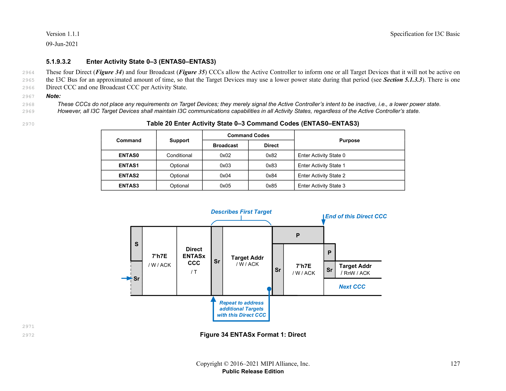

```
2971
2972
```

Copyright © 2016–2021 MIPI Alliance, Inc. **Public Release Edition** 

127 

Specification for I3C Basic 

Version 1.1.1 09-Jun-2021 

```
2973
2974
```

**==> picture [278 x 108] intentionally omitted <==**

**----- Start of picture text -----**<br>
End of this Broadcast CCC<br>P<br>S Broadcast<br>7’h7E ENTASx Target Addr<br>/ W / ACK CCC / RnW / ACK<br>/ T Sr<br>Sr 7’h7E<br>Next CCC<br>/ W / ACK<br>**----- End of picture text -----**<br>


**Figure 35 ENTASx Format 2: Broadcast** 

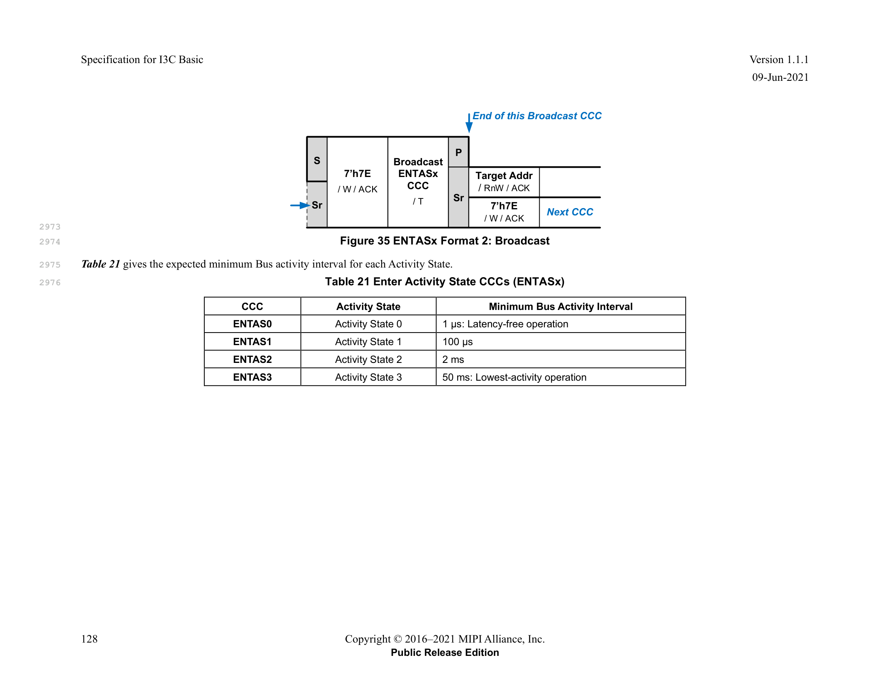

**`2975`** _**Table 21**_ gives the expected minimum Bus activity interval for each Activity State. **`2976`** 

**Table 21 Enter Activity State CCCs (ENTASx)** 

|**CCC**|**Activity State**|**Minimum Bus Activity Interval**|
|---|---|---|
|**ENTAS0**|Activity State 0|1 µs: Latency-free operation|
|**ENTAS1**|Activity State 1|100 µs|
|**ENTAS2**|Activity State 2|2 ms|
|**ENTAS3**|Activity State 3|50 ms: Lowest-activity operation|


Copyright © 2016–2021 MIPI Alliance, Inc. **Public Release Edition** 

128 

Version 1.1.1 09-Jun-2021 

Specification for I3C Basic 

```
2987
2988
```

## **5.1.9.3.3 Reset Dynamic Address Assignment (RSTDAA)** 

> **`2977`** This Broadcast CCC ( _**Figure 36**_ ) indicates to all I3C Devices that the Controller requires them to clear/reset their Controller-assigned Dynamic Address. If the I3C **`2978`** Device supports the Group Address feature, then receipt of an RSTDAA CCC shall also reset (clear) all of its assigned Group Addresses. After clearing their **`2979`** Dynamic Address, the Devices shall be ready to participate in an I3C procedure such as Dynamic Address Assignment ( _**Section 5.1.4**_ ), SETDASA **`2980`** ( _**Section 5.1.9.3.10**_ ), or SETAASA ( _**Section 5.1.9.3.23**_ ), or is configured to communicate via I[2] C (though without a Spike Filter). **`2981`** The Command Code for the RSTDAA Broadcast CCC is 0x06. Support for this CCC is required. 

```
2982
2983
```

**==> picture [278 x 108] intentionally omitted <==**

**----- Start of picture text -----**<br>
End of this Broadcast CCC<br>P<br>S Broadcast<br>7’h7E RSTDAA Target Addr<br>/ W / ACK CCC / RnW / ACK<br>/ T Sr<br>Sr 7’h7E<br>Next CCC<br>/ W / ACK<br>**----- End of picture text -----**<br>


**Figure 36 RSTDAA Format** 

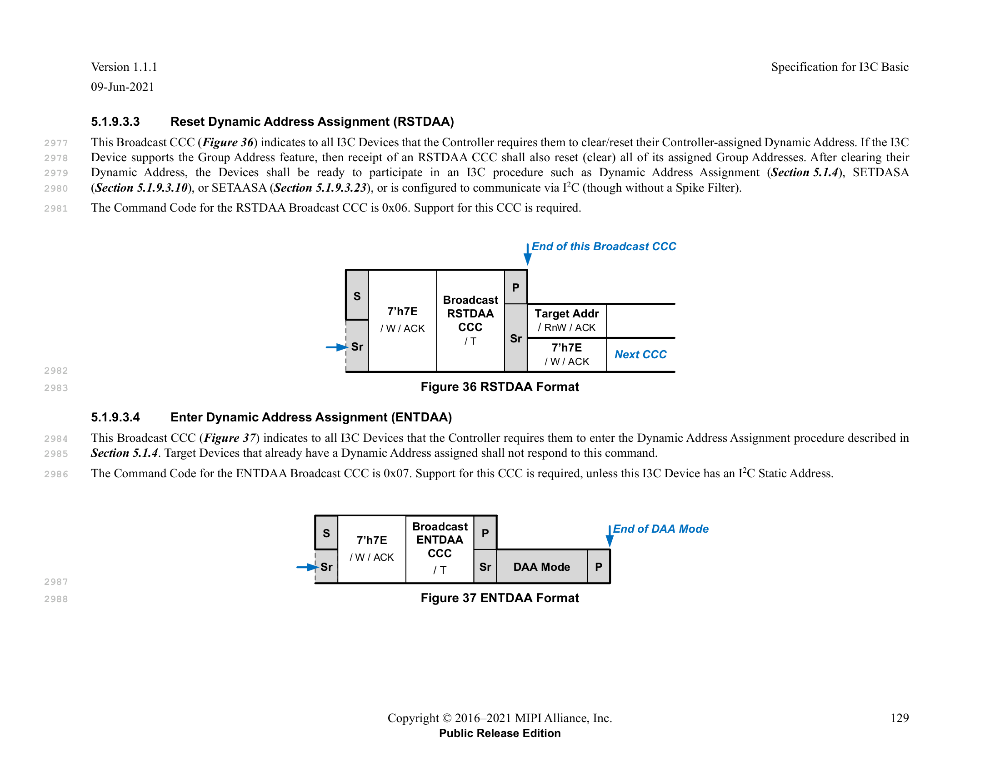

## **5.1.9.3.4 Enter Dynamic Address Assignment (ENTDAA)** 

> **`2984`** This Broadcast CCC ( _**Figure 37**_ ) indicates to all I3C Devices that the Controller requires them to enter the Dynamic Address Assignment procedure described in **`2985`** _**Section 5.1.4**_ . Target Devices that already have a Dynamic Address assigned shall not respond to this command. **`2986`** The Command Code for the ENTDAA Broadcast CCC is 0x07. Support for this CCC is required, unless this I3C Device has an I[2] C Static Address. 

**==> picture [324 x 72] intentionally omitted <==**

**----- Start of picture text -----**<br>
Broadcast  End of DAA Mode<br>S P<br>7’h7E ENTDAA<br>/ W / ACK CCC<br>Sr / T Sr DAA Mode P<br>Figure 37 ENTDAA Format<br>**----- End of picture text -----**<br>


Copyright © 2016–2021 MIPI Alliance, Inc. 

129 

**Public Release Edition** 

Specification for I3C Basic 

Version 1.1.1 09-Jun-2021 

```
2993
```

```
2994
2995
2996
```

```
2997
```

## **5.1.9.3.5 Set/Get Max Write Length (SETMWL/GETMWL)** 

> **`2989`** These Direct and Broadcast CCCs (Direct Set or Get in _**Figure 38**_ , Broadcast Set in _**Figure 39**_ ) allow the I3C Controller to Set or Get a maximum data write length **`2990`** in bytes for one or all Target Devices. This Max Write Length does not affect data write lengths for Broadcast CCCs, since their data payloads are defined for each **`2991`** CCC. The Set/Get Max Write Length value is transmitted over two bytes, with the most significant byte (MSB) transmitted first. The minimum value that Max **`2992`** Write Length can be set to is 16 bytes. **See Errata 01, Item 9** 

This CCC is required if (and only if) any private Write Message(s) and/or any extended Write CCC(s) implemented by the Target Device support a variable limit on the maximum number of data bytes per Message, and this limit is greater than 16 bytes. This allows the Target to limit the number of bytes the Controller sends. A Target Device with no such settable limit may optionally support this CCC, but is not expected to do so. A return of 0 by the Target to GETMWL means a value less than 16 bytes. **See Errata 01, Item 10** 

**See Errata 01, Item 11** 

## **Table 22 Set/Get Max Write Length Command Codes (SETMWL/GETMWL)** 

**==> picture [476 x 235] intentionally omitted <==**

**----- Start of picture text -----**<br>
Command Codes<br>Command  Support  Purpose<br>Broadcast  Direct<br>SETMWL  See above  0x09  0x89  Set Max Write Length<br>GETMWL  See above  – 0x8B  Get Max Write Length<br>Describes First Target<br>End of this Direct CCC<br>P<br>S Direct<br>SETMWL  P<br>7’h7E or  Target Addr MWL MSB  MWL LSB<br>Sr<br>/ W / ACK GETMWL  / RnW / ACK / T / T 7’h7E Target Addr<br>CCC Sr / W / ACK Sr / RnW / ACK<br>Sr / T<br>Next CCC<br>Repeat to address additional Targets<br>with this Direct CCC<br>**----- End of picture text -----**<br>


**Figure 38 Direct SETMWL/GETMWL Format** 

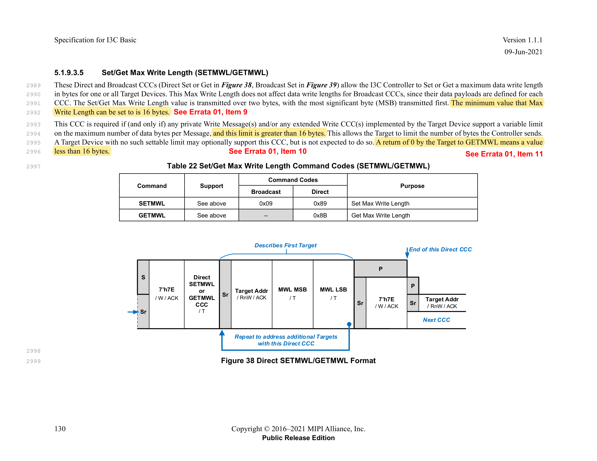

```
2998
2999
```

Copyright © 2016–2021 MIPI Alliance, Inc. 

130 

**Public Release Edition** 

Version 1.1.1 09-Jun-2021 

Specification for I3C Basic 

```
3000
3001
```

**==> picture [350 x 99] intentionally omitted <==**

**----- Start of picture text -----**<br>
End of this Broadcast CCC<br>P<br>S Broadcast<br>7’h7E SETMWL MWL MSB  MWL LSB  Target Addr<br>/ W / ACK CCC / T / T / RnW / ACK<br>/ T Sr<br>Sr 7’h7E<br>Next CCC<br>/ W / ACK<br>**----- End of picture text -----**<br>


**Figure 39 Broadcast SETMWL Format** 

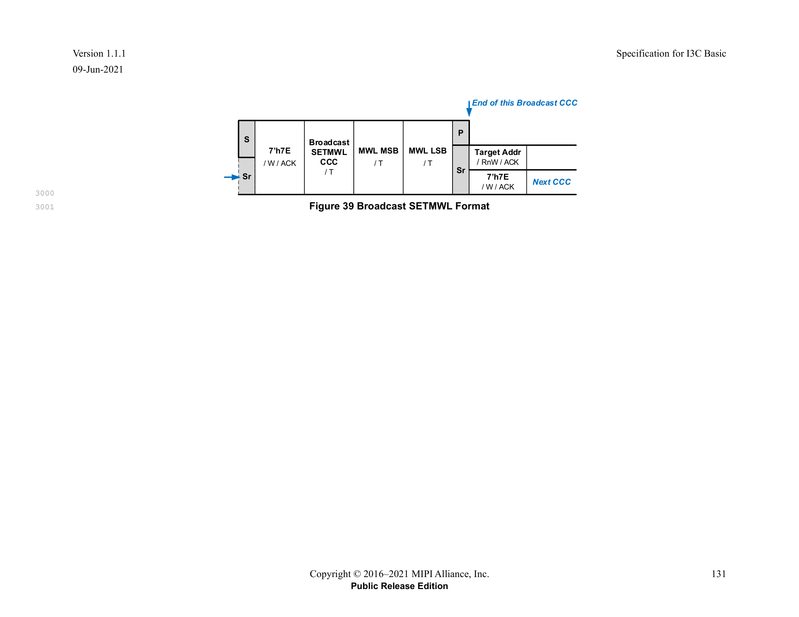

Copyright © 2016–2021 MIPI Alliance, Inc. 

131 

**Public Release Edition** 

Specification for I3C Basic 

Version 1.1.1 09-Jun-2021 

## **5.1.9.3.6 Set/Get Max Read Length (SETMRL/GETMRL)** 

> **`3002`** These Direct and Broadcast CCCs (Direct Set or Get in _**Figure 40**_ , Broadcast Set in _**Figure 41**_ ) allow the I3C Controller to Set or Get a maximum data read length, **`3003`** and optionally a maximum IBI payload size. 

**`3004`** The Set/Get Max Read Length value is transmitted over the first two bytes, with most significant byte (MSB) transmitted first. The minimum value to which Max **`3005`** Read Length can be set is 16 bytes. A return of 0 by the Target to GETMRL means a value less than 16 bytes. **See Errata 01, Item 12** 

**`3006`** For Devices with BCR bit 2 set to 1’b1, the Max IBI payload size value is added as a third byte, where a value of 0 indicates an unlimited payload size. If Timing **`3007`** Control is used, then the minimum IBI payload size is either four bytes or five bytes, per the Timing Control method that is supported. If Timing Control (see **`3008`** _**Section 5.1.8**_ ) is not used, then the minimum IBI payload size is one (one byte). 

- **`3009`** 

- **`3010`** 

- **`3011`** 

This CCC is optional for the Target, with two exceptions: 

   - **See Errata 01, Item 14** 

   - 1. This CCC is required if both (a) any private Read Request Message(s) and/or any extended Read Request CCC(s) implemented by the Target support a variable limit on the maximum number of data bytes that the Target may return per Message, and (b) this limit is greater than 16 bytes. 

- **`3012`** 2. This CCC is required if the Target both (a) supports an IBI Payload (as indicated with BCR bit 2), and (b) will transmit more than one byte of private **`3013`** payload (not counting Timing Control bytes, when Timing Control used). 

```
3014
```

## **See Errata 01, Item 13** 

**Table 23 Set/Get Max Read Length Command Codes (SETMRL/GETMRL)** 

**==> picture [476 x 223] intentionally omitted <==**

**----- Start of picture text -----**<br>
Command Codes<br>Command  Support  Purpose<br>Broadcast  Direct<br>SETMRL  See above  0x0A  0x8A  Set Max Read Length<br>GETMRL  See above  – 0x8C  Get Max Read Length<br>Describes First Target<br>End of this Direct CCC<br>P<br>S Direct<br>SETMRL  IBI Payload  P<br>7’h7E or  Target Addr MRL MSB  MRL LSB  Size<br>Sr<br>/ W / ACK GETMRL   / RnW / ACK / T / T (Optional) 7’h7E Target Addr<br>CCC / T Sr / W / ACK Sr / RnW / ACK<br>Sr / T<br>Next CCC<br>Repeat to address additional Targets<br>with this SETMRL/GETMRL CCC<br>**----- End of picture text -----**<br>


## **Figure 40 Direct SETMRL/GETMRL Format** 

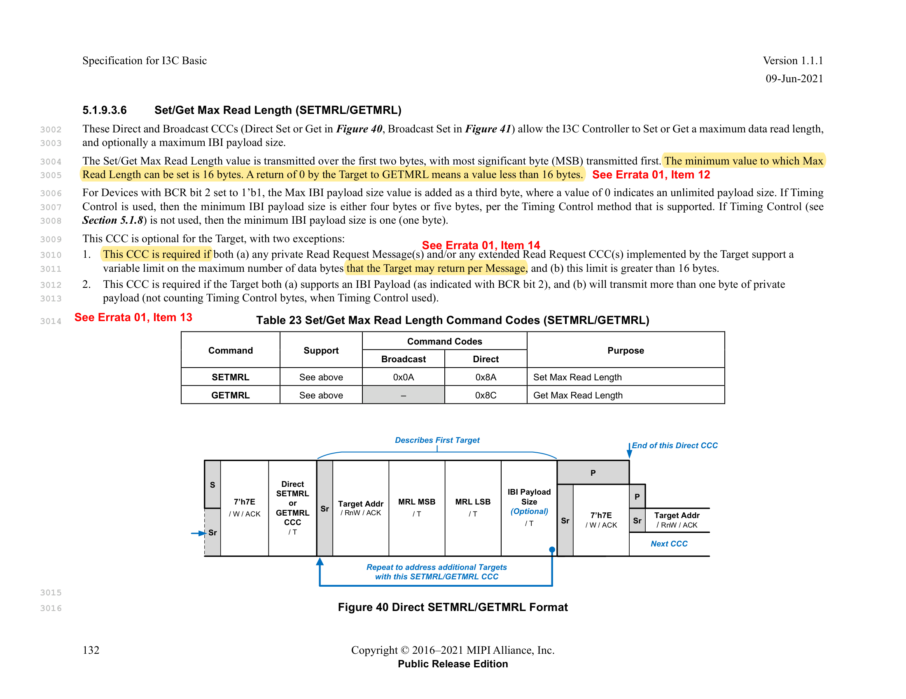

```
3015
3016
```

Copyright © 2016–2021 MIPI Alliance, Inc. **Public Release Edition** 

132 

Version 1.1.1 09-Jun-2021 

Specification for I3C Basic 

```
3017
3018
```

**==> picture [427 x 104] intentionally omitted <==**

**----- Start of picture text -----**<br>
End of this Broadcast CCC<br>IBI  P<br>S Broadcast<br>Payload<br>7’h7E SETMRL MRL MSB  MRL LSB  Size Target Addr<br>/ W / ACK CCC / T / T (Optional) / RnW / ACK<br>/ T Sr<br>Sr / T 7’h7E<br>Next CCC<br>/ W / ACK<br>**----- End of picture text -----**<br>


**Figure 41 Broadcast SETMRL Format** 

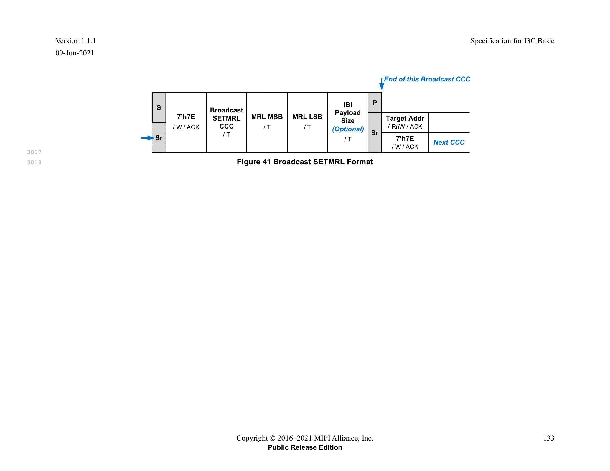

Copyright © 2016–2021 MIPI Alliance, Inc. 

133 

**Public Release Edition** 

Specification for I3C Basic 

Version 1.1.1 09-Jun-2021 

## **5.1.9.3.7 Define List of Targets (DEFTGTS)** 

**`3019`** _**Note:**_ 

```
3020
3021
```

_In previous versions of the I3C Basic Specification (as well as some versions of the full I3C Specification), this CCC was named “DEFSLVS”. The usage and data format for this CCC are unchanged._ 

**`3022`** This Broadcast CCC ( _**Figure 42**_ ) is only relevant to Secondary Controllers. This CCC tells Secondary Controller Devices what Targets (and Groups) are present **`3023`** on the I3C Bus, via four consecutive Data Bytes per Target (or Group). First the Active Controller identifies itself by transmitting its own data in the first set of **`3024`** four data bytes, using the value 7’h7E as the Static Address. Then each additional Target or Group on the I3C Bus is represented by a further set of four data bytes. 

**`3025`** If the Active Controller supports the Group Address function, then the Active Controller shall then send the Secondary Controllers any configured Group Address **`3026`** information, using the DEFTGTS CCC in the same manner used to transmit the Dynamic Address information. Each Group is treated as a virtual I3C Device on **`3027`** the I3C Bus, described by: Group Address, reserved DCR, BCR, and Static Address as defined below. The Group Address bytes may be transmitted within the **`3028`** same DEFTGTS CCC message as the Target Devices. 

**`3029`** The Command Code for the DEFTGTS Broadcast CCC is 0x08. All Secondary Controllers are required to support this CCC. 

||**_Describes Active Controller (AC)_**|**_Describes Active Controller (AC)_**|**_Describes Active Controller (AC)_**|**_Describes Active Controller (AC)_**|**_Describes Active Controller (AC)_**|**_Describes Active Controller (AC)_**|**_Describes Active Controller (AC)_**|**_Describes Active Controller (AC)_**|
|---|---|---|---|---|---|---|---|---|
||**S**|**7’h7E**<br>/ W / ACK|**Broadcast**<br>**DEFTGTS**<br>**CCC**<br>/ T|**Count**<br>/ T|**Dynamic**<br>**Addr of**<br>**AC**<br>/ T|**DCR Type**<br>**of AC**<br>/ T|**BCR Type**<br>**of AC**<br>/ T|**Static**<br>**Addr**<br>**(7'h7E)**<br>/ T|
||**Sr**||||||||


**==> picture [299 x 119] intentionally omitted <==**

**----- Start of picture text -----**<br>
Describes First Target or Group<br>End of this Broadcast CCC<br>P<br>Target or  DCR Type  BCR Type  Static<br>Group  Target Target Addr  Target Addr<br>Addr  or Group  or Group  / 1'b0  / RnW / ACK<br>/ 1'b0 / T / T / T Sr<br>/ T 7’h7E<br>Next CCC<br>/ W / ACK<br>Repeat to describe all additional Targets,<br>followed by Groups, with this Broadcast CCC<br>**----- End of picture text -----**<br>


## **Figure 42 DEFTGTS Format See Errata 01, Item 15** 

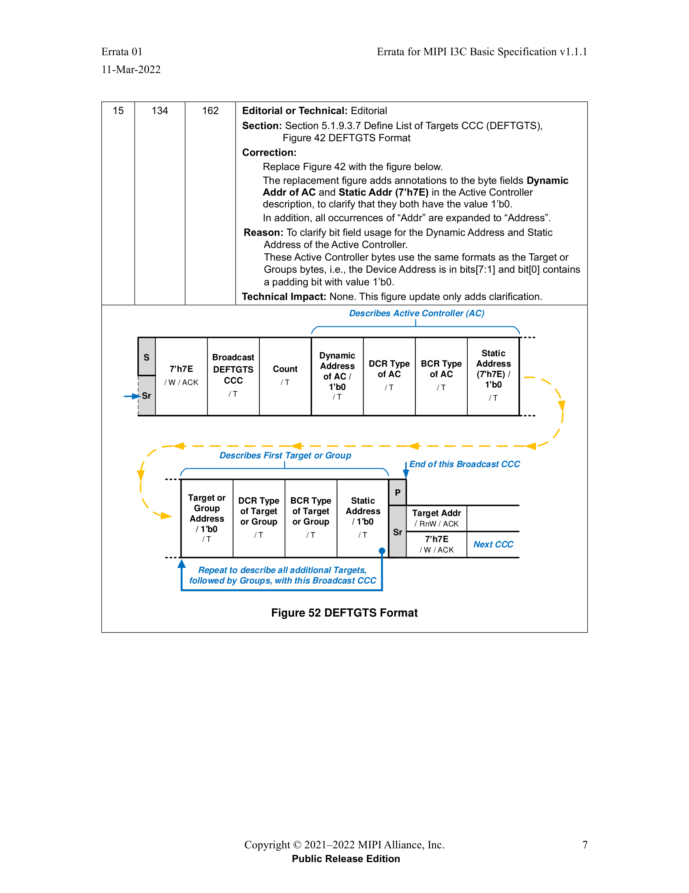

**Count** is the number of Targets and Groups present on the I3C Bus. Each Target or Group is represented by a set of four data bytes, as specified in _**Table 24**_ . 

```
3030
3031
```

```
3032
```

Copyright © 2016–2021 MIPI Alliance, Inc. **Public Release Edition** 

134 

Version 1.1.1 09-Jun-2021 

Specification for I3C Basic 

## **`3033`** 

## _**Note:**_ 

**`3034`** _For each configured Group Address, the DEFGRPA CCC (see_ _**Section 5.1.9.3.29** ) is used to provide more information about the Group, such as the list of_ **`3035`** _I3C Targets that have been assigned to that Group Address._ 

```
3036
```

## **Table 24 DEFTGTS Data Bytes for Target or Group** 

|**Field**|**Byte**|**For Target**|**For Group**|
|---|---|---|---|
|**Dynamic Address**|0|The 7 most significant bits (Bits[7:1]) shall contain the current<br>value of the Target’s assigned 7-bit Dynamic Address.<br>The least significant bit (Bit[0]) is filled with the value 1’b0.<br>For a Legacy I2C Device, this field shall contain the value 7’h00.|The Group Address|
|**DCR Type**|1|The Target’s Device Characteristics Register value, or the value<br>0x00 if unknown.<br>For a Legacy I2C Device, this field shall contain the value of the<br>Device’s Legacy Virtual Register (LVR).|This field shall contain the value 8’hFF (all 1’s), to indicate that a<br>Group is being described.<br>See**_Section 5.1.1.2.2_**for how to identify a Group value.|
|**BCR Type**|2|The Target’s Bus Characteristics Register value, or 0x00 if<br>unknown.|Reserved for Group information<br>This field shall not be used as a BCR.|
|**Static Address**|3|The Target’s original 7-bit static I2C Address in the 7 most<br>significant bits (Bits[7:1]), with the least significant bit (Bit[0])<br>filled with the value 1’b0.<br>If no Static Address, then the value shall be 7’h00.|Reserved for Group information|


**`3037`** The Active Controller shall not send the DEFTGTS CCC unless at least one Secondary Controller Device is present on the I3C Bus. The Active Controller shall **`3038`** send the DEFTGTS CCC following every Hot-Join event (i.e., after each Dynamic Address Assignment), and as necessary, i.e., when any Dynamic Address or **`3039`** Group Address changes must be sent to Secondary Controller Devices. 

Copyright © 2016–2021 MIPI Alliance, Inc. **Public Release Edition** 

135 

Specification for I3C Basic 

Version 1.1.1 09-Jun-2021 

## **5.1.9.3.8 Enter Test Mode (ENTTM)** 

**==> picture [689 x 183] intentionally omitted <==**

**----- Start of picture text -----**<br>
3040  This Broadcast CCC ( Figure 43 ) informs all I3C Devices that the Controller is entering a specified Test Mode during manufacturing or Device test. The Enter Test<br>3041  Mode command Frame format includes a byte that specifies which Test Mode to enter. Supporting I3C Devices shall enter the indicated Test Mode upon receipt of<br>3042  the Enter Test Mode CCC.  Table 25  lists the defined Test Mode byte values.<br>3043  The Command Code for the ENTTM Broadcast CCC is 0x0B. Support for this CCC is optional.<br>End of this Broadcast CCC<br>P<br>S Broadcast<br>Test Mode<br>7’h7E ENTTM Target Addr<br>Byte<br>/ W / ACK CCC / RnW / ACK<br>/ T / T Sr<br>Sr 7’h7E<br>Next CCC<br>/ W / ACK<br>3044<br>3045  Figure 43 ENTTM Format<br>**----- End of picture text -----**<br>


```
3046
```

**Table 25 ENTTM Test Mode Byte Values** 

|||**Table 25 ENTTM Test Mode Byte Values**|
|---|---|---|
|**Byte Value**|**I3C Test Mode**|**Description**|
|0x00|Exit Test Mode|This value removes all I3C Devices from Test Mode|
|0x01|Vendor Test Mode|This value indicates that I3C Devices shall return a random 32-bit value in the Provisioned ID during the Dynamic<br>Address Assignment procedure|
|0x02 – 0xFF|MIPI Reserved|Reserved for future use by MIPI Alliance|


Copyright © 2016–2021 MIPI Alliance, Inc. 

136 

**Public Release Edition** 

Version 1.1.1 09-Jun-2021 

Specification for I3C Basic 

## **5.1.9.3.9 Enter HDR Mode 0–7 (ENTHDR0–ENTHDR7)** 

> **`3047`** These eight Broadcast CCCs inform all I3C Devices that the Bus is being switched into the indicated HDR Mode. See the indicated Section of this Specification **`3048`** for further details on each HDR Mode. 

**`3049`** Support for each CCC shall depend on whether the I3C Device supports the associated HDR Mode (see _**Section 5.2**_ ). 

**`3050`** _**Note:**_ 

**`3051`** _Of the eight possible HDR Modes, only HDR Mode 0 (HDR-DDR) and HDR Mode 3 (HDR-BT) are included in I3C Basic. To gain access to the capabilities_ **`3052`** _of the other HDR Modes, please contact MIPI Alliance._ 

```
3053
```

## **Table 26 Enter HDR Mode CCCs (ENTHDRx)** 

|**Command**|**Command Code**<br>_(All are Broadcast)_|**Enter HDR Mode**|**HDR Mode Name**|**Supported in**<br>**I3C Basic?**|**See Section**|
|---|---|---|---|---|---|
|**ENTHDR0**|0x20|HDR Mode 0|HDR-DDR|Y|**_Section 5.2.2_**|
|ENTHDR1|0x21|HDR Mode 1|HDR-TSP|N|**_Section 5.2.3_**|
|ENTHDR2|0x22|HDR Mode 2|HDR-TSL|N|**_Section 5.2.3_**|
|**ENTHDR3**|0x23|HDR Mode 3|HDR-BT|Y|**_Section 5.2.4_**|
|ENTHDR4|0x24|HDR Mode 4|HDR Modes 4–7 are<br>Reserved for future definition<br>by MIPI Alliance|||
|ENTHDR5|0x25|HDR Mode 5||||
|ENTHDR6|0x26|HDR Mode 6||||
|ENTHDR7|0x27|HDR Mode 7||||


Copyright © 2016–2021 MIPI Alliance, Inc. 

137 

**Public Release Edition** 

Specification for I3C Basic 

Version 1.1.1 09-Jun-2021 

## **5.1.9.3.10 Set Dynamic Address from Static Address (SETDASA)** 

- **`3054`** This CCC ( _**Figure 44**_ and _**Figure 45**_ illustrate the two distinct command formats) allows the Controller to assign a Dynamic Address to one Target using the **`3055`** Target’s Static Address. This is faster than the ENTDAA Dynamic Address Assignment procedure (see _**Section 5.1.9.3.4**_ ). The SETDASA CCC should be used **`3056`** before the ENTDAA CCC is used; all Targets without assigned Dynamic Addresses will respond to the ENTDAA CCC. 

- **`3057`** _**Note:**_ **See Errata 01, Item 16** 

- **`3058`** _The SETDASA Command Code is unusual in that it addresses the desired I3C Target by its I[2] C Static Address, rather than by its assigned Dynamic_ **`3059`** _Address. As a result, this CCC can only be sent to a Target that has an I[2] C Static Address._ 

- **`3060`** _Per_ _**Section 5.1.4.2** , SETDASA is intended as an optimization. An I3C Target that supports SETDASA and does not support ENTDAA cannot be relied on to_ **`3061`** _be assigned a Dynamic Address on a generic I3C Bus, and also will not support Hot-Join (per_ _**Section 5.1.5** ). Use of SETDASA requires the I3C Controller_ **`3062`** _to have prior knowledge of the I3C Target. Dynamic Address Assignment with ENTDAA is generally recommended for most use cases._ 

**`3063`** The newly assigned Address is transmitted in the Dynamic Address Byte shown in _**Figure 44**_ , where the 7 most significant bits (Bits[7:1]) contain the 7-bit Dynamic **`3064`** Address, and the least significant bit (Bit[0]) is filled with the value 1’b0. 

- **`3065`** The Command Code for the SETDASA Direct CCC is 0x87. Support for this CCC is optional; however, the I3C Target that supports this CCC must have an I[2] C **`3066`** Static Address. 

||||||||||||||
|---|---|---|---|---|---|---|---|---|---|---|---|---|
|||||**_Describes First Target_**||||||**_End of this Direct CCC_**|||
|||||||||||**_End of this Direct C_**|||
|||||||||||**P**|||
||**S**|**7’h7E**<br>/ W / ACK|**Direct**<br>**SETDASA**<br>**CCC**<br>/ T|**Sr**|**Target Addr**<br>**(Static)**<br>/ W / ACK|**7-bit**<br>**Dynamic**<br>**Address**<br>**/ 1'b0**<br>/ T||**P**|||||
|||||||||**Sr**|**7’h7E**<br>/ W / ACK|**P**|||
||**Sr**|||||||||**Sr**|**Target Addr**<br>/RnW / ACK||
|||||||||||**_Next CCC_**|||
|||||**_Repeat to address additional_**<br>**_Targets with this Direct CCC_**|||||||||


## **Figure 44 SETDASA Format 1: Primary** 

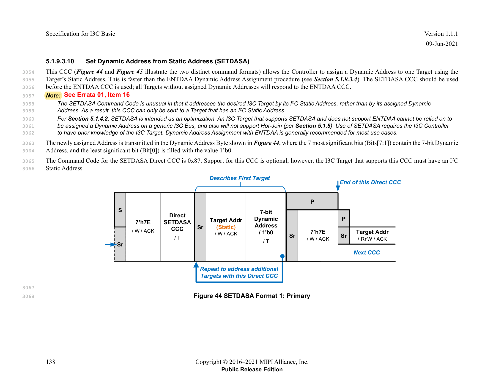

```
3067
3068
```

Copyright © 2016–2021 MIPI Alliance, Inc. **Public Release Edition** 

138 

Version 1.1.1 09-Jun-2021 

Specification for I3C Basic 

```
3069
```

```
3070
3071
```

```
3072
```

```
3073
```

```
3074
```

```
3075
3076
3077
```

```
3078
```

## **SETDASA Minimal Bus Point-to-Point Communication** 

The SETDASA CCC may also be specially used for simple point-to-point communication in I3C Minimal Bus use cases (per _**Section 5.1.1**_ and _**Figure 11**_ ). An I3C Minimal Bus is an I3C Bus with one I3C Controller Device (potentially with reduced functionality), and one I3C Target Device. In this special usage of the SETDASA CCC, the Controller Device both uses the fixed value 7’h01 as the Static Address, and uses the fixed (and reserved) value of 7’h01 as the Dynamic Address (see _**Figure 45**_ **)** . This special usage of the SETDASA CCC allows for simpler Controller Devices, and optionally simpler Target Devices intended for use specifically in Minimal Bus configurations. 

I3C Target Devices should support this special usage of the SETDASA CCC unless such support would make the Target Device unusable in a Minimal Bus use case. A Target Device supporting this special Minimal Bus usage of the SETDASA CCC shall match the Static Address 7’h01, and then accept 7’h01 as its new Dynamic Address (same as the natural result of SETDASA). The Target Device may choose to behave differently after receiving its Dynamic Address in this manner. 

- An I3C Controller shall not use this special form of the SETDASA CCC unless the I3C Bus is known to have precisely one Controller and: 

```
3079
```

## **Either:** 

- **`3080`** • One active I3C Target Device that is capable of supporting this special usage of the SETDASA CCC, **`3081` Or:** 

```
3082
3083
```

- One or more I3C Target Devices that act strictly as receivers, i.e., that do not use In-Band Interrupt and that will not be sent Read requests. This arrangement permits a single Controller Device to, in effect, Broadcast to the Target Devices. 

||||||||||**_End of this Direct CCC_**|**_End of this Direct CCC_**|
|---|---|---|---|---|---|---|---|---|---|---|
||||||||||**P**<br>**Sr**<br>**_Next CCC_**<br>**Target Addr**<br>/RnW / ACK||
||**S**|**7’h7E**<br>/ W / ACK|**Direct**<br>**SETDASA**<br>**CCC**<br>/ T|**Sr**|**7'h01**<br>**(Static)**<br>/ W / ACK|**7'h01**<br>**/ 1'b0**<br>/ T|**P**||**P**||
||||||||**Sr**|**7’h7E**<br>/ W / ACK|**P**||
||**Sr**||||||||**Sr**|**Target Addr**<br>/RnW / ACK|
||||||||||**_Next CCC_**||


**Figure 45 SETDASA Format 2: Point-to-Point** 

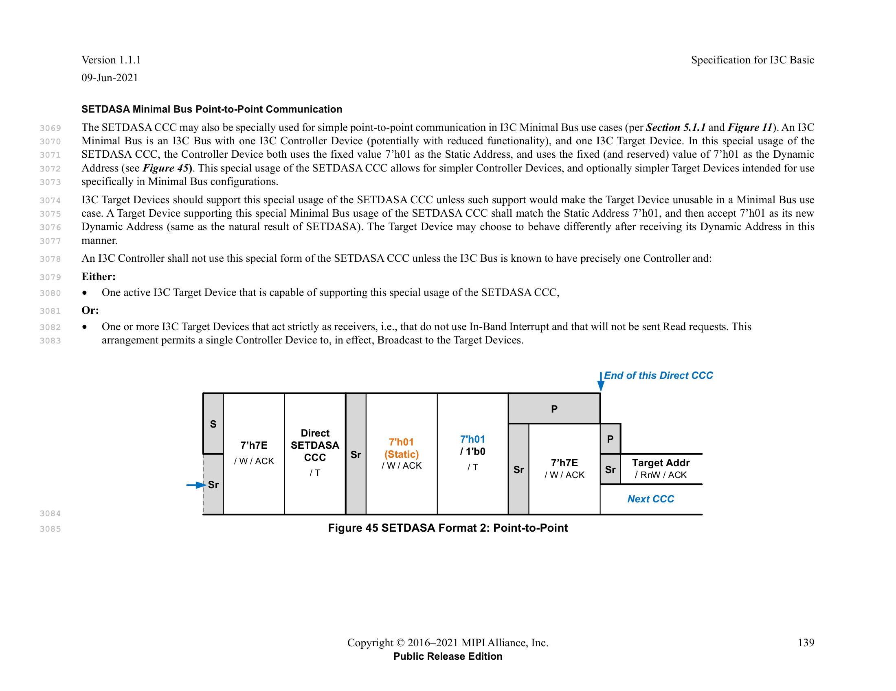

```
3084
3085
```

Copyright © 2016–2021 MIPI Alliance, Inc. **Public Release Edition** 

139 

Specification for I3C Basic 

Version 1.1.1 09-Jun-2021 

## **5.1.9.3.11 Set New Dynamic Address (SETNEWDA)** 

> **`3086`** This Direct CCC ( _**Figure 46**_ ) allows the I3C Controller to assign a new Dynamic Address to one I3C Target or Secondary Controller. In the Dynamic Address **`3087`** field, the 7 most significant bits (Bits[7:1]) contain the 7-bit Dynamic Address, and the least significant bit (Bit[0]) is filled with the value 1’b0. 

- **`3088`** If an I3C Target (or Secondary Controller) supports this CCC and accepts the new 7-bit Dynamic Address from the Controller via this CCC, then this shall change **`3089`** its current Dynamic Address. After accepting the new Dynamic Address, the Target (or Secondary Controller) shall respond to subsequent transactions that are **`3090`** directly addressed to this new Dynamic Address (per _**Section 5.1.2.1**_ ) and not to the previous Dynamic Address. 

- **`3091`** _**Note:**_ 

- **`3092`** _This CCC may only be used to change the currently assigned Dynamic Address, which must be initially assigned via any supported method (per_ **`3093`** _**Section 5.1.4.2** ). If an I3C Target (or Secondary Controller) has not received its Dynamic Address via the ENTDAA CCC (i.e., Dynamic Address_ **`3094`** _Assignment) or via the SETAASA and/or SETDASA CCCs (i.e., from an I[2] C Static Address), then it cannot respond to the SETNEWDA CCC._ 

- **`3095`** _In version 1.0 of the I3C Basic Specification, all I3C Targets were required to support this CCC. Starting with I3C Basic version 1.1, this CCC is now_ **`3096`** _required only for Targets that also implement support for Dynamic Address Assignment via the ENTDAA CCC (see_ _**Section 5.1.9.3.4** ). This CCC is now_ **`3097`** _optional for Targets that have I[2] C Static Addresses and do not support the ENTDAA CCC; therefore, such Targets must only receive Dynamic Addresses via_ **`3098`** _the SETAASA and/or SETDASA CCCs (per_ **Section 5.1.4.2** _). For most Targets with I[2] C Static Addresses and that do not support the ENTDAA CCC,_ **`3099`** _support for the SETNEWDA CCC is recommended; however, if such a Target does not support the SETNEWDA CCC, then it shall not respond (i.e., shall_ **`3100`** _NACK its current Dynamic Address)._ 

**`3101`** The Command Code for the SETNEWDA Direct CCC is 0x88. Support for this CCC is required, unless the I3C Target has an I[2] C Static Address and does not **`3102`** support the ENTDAA CCC. 

**==> picture [464 x 169] intentionally omitted <==**

**----- Start of picture text -----**<br>
Describes First Target<br>End of this Direct CCC<br>P<br>S New 7-bit<br>Direct<br>7’h7E SETNEWDA  Target Addr Dynamic  P<br>/ W / ACK CCC Sr (Current) / W / ACK Address/ 1'b0 7’h7E Target Addr<br>/ T Sr / W / ACK Sr / RnW / ACK<br>/ T<br>Sr<br>Next CCC<br>Repeat to address additional<br>Targets with this Direct CCC<br>**----- End of picture text -----**<br>


```
3103
3104
```

## **Figure 46 SETNEWDA Format** 

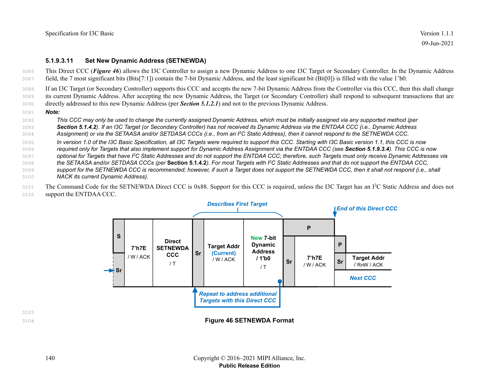

Copyright © 2016–2021 MIPI Alliance, Inc. 

140 

**Public Release Edition** 

Version 1.1.1 09-Jun-2021 

Specification for I3C Basic 

## **5.1.9.3.12 Get Provisioned ID (GETPID)** 

> **`3105`** This Direct CCC (see _**Figure 25**_ and _**Figure 47**_ ) is a Get request for one I3C Target Device to return its 48-bit Provisioned ID to the Controller, as described in **`3106`** _**Section 5.1.4**_ . Following transmission of the GETPID CCC, the 48-bit value is transmitted as 6 bytes, with MSB first. 

- **`3107`** The Command Code for the GETPID Direct CCC is 0x8D. If an I3C Target supports Dynamic Address Assignment with the ENTDAA CCC, then it shall also **`3108`** support this CCC. If an I3C Target does not support Dynamic Address Assignment with the ENTDAA CCC, then support for this CCC is optional. 

**==> picture [588 x 162] intentionally omitted <==**

**----- Start of picture text -----**<br>
Describes First Target<br>End of this Direct CCC<br>GETPID Bytes P<br>S<br>Direct<br>P<br>7’h7E GETPID   Target Addr<br>Sr<br>/ W / ACK CCC / R / ACK Byte 5  Byte 4  Byte 3  Byte 2  Byte 1  Byte 0  7’h7E Target Addr<br>/ T / T / T / T / T / T / T Sr / W / ACK Sr / RnW / ACK<br>Sr<br>Next CCC<br>Repeat to address additional Targets<br>with this Direct CCC<br>**----- End of picture text -----**<br>


```
3109
3110
```

**Figure 47 GETPID Format** 

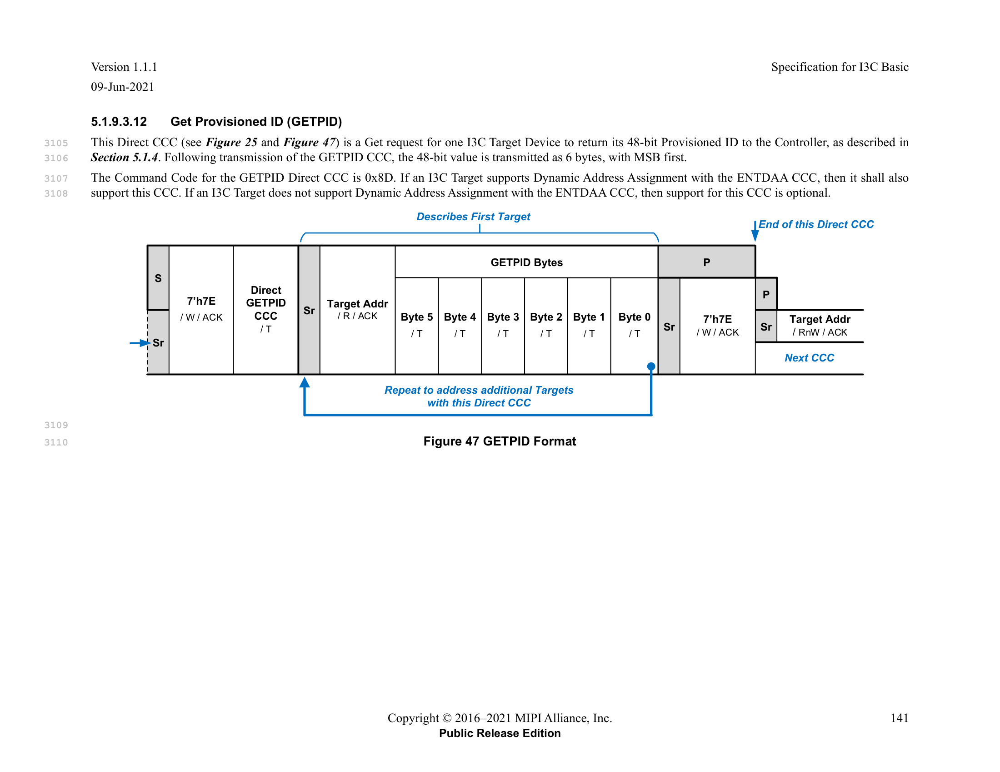

Copyright © 2016–2021 MIPI Alliance, Inc. 

141 

**Public Release Edition** 

Specification for I3C Basic 

Version 1.1.1 09-Jun-2021 

## **5.1.9.3.13 Get Bus Characteristics Register (GETBCR)** 

> **`3111`** This Direct CCC ( _**Figure 48**_ ) is a Get request for one I3C Target Device to return its Bus Characteristics Register (BCR) to the Controller, as described in **`3112`** _**Section 5.1.1.2.1**_ . The BCR value is transmitted in one byte, with the MSb transmitted first. 

- **`3113`** The Command Code for the GETBCR Direct CCC is 0x8E. If an I3C Target supports Dynamic Address Assignment with the ENTDAA CCC, then it shall also **`3114`** support this CCC. If an I3C Target does not support Dynamic Address Assignment with the ENTDAA CCC, then support for this CCC is optional. 

**==> picture [464 x 173] intentionally omitted <==**

**----- Start of picture text -----**<br>
Describes First Target<br>End of this Direct CCC<br>P<br>S<br>Direct<br>GETBCR  P<br>7’h7E GETBCR  Target Addr<br>/ W / ACK CCC / T Sr / R / ACK Byte  / T Sr / W / ACK 7’h7E Sr Target Addr / RnW / ACK<br>Sr<br>Next CCC<br>Repeat to address additional<br>Targets with this Direct CCC<br>**----- End of picture text -----**<br>


```
3115
3116
```

## **Figure 48 GETBCR Format** 

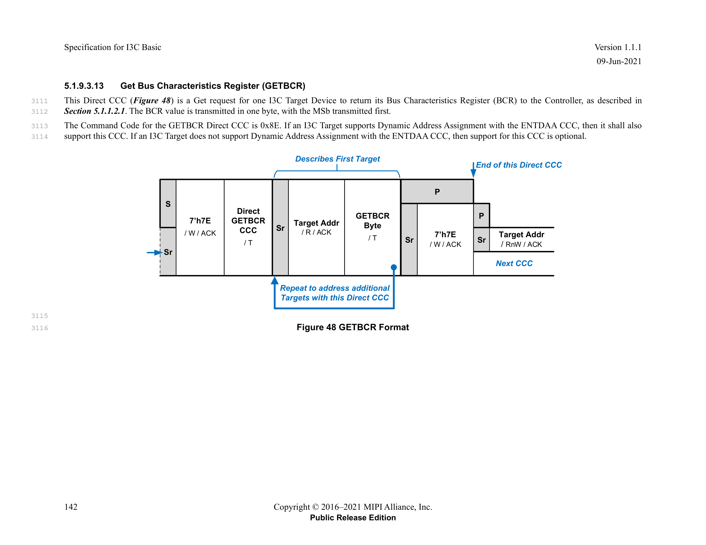

Copyright © 2016–2021 MIPI Alliance, Inc. 

142 

**Public Release Edition** 

Version 1.1.1 09-Jun-2021 

Specification for I3C Basic 

## **5.1.9.3.14 Get Device Characteristics Register (GETDCR)** 

> **`3117`** This Direct CCC ( _**Figure 49**_ ) is a Get request for one I3C Target Device to return its Device Characteristics Register (DCR) to the Controller, as described in **`3118`** _**Section 5.1.1.2.2**_ . The DCR value is transmitted in one byte, with the MSb transmitted first. 

**`3119`** The Command Code for the GETDCR Direct CCC is 0x8F. If an I3C Target supports Dynamic Address Assignment with the ENTDAA CCC, then it shall also **`3120`** support this CCC. If an I3C Target does not support Dynamic Address Assignment with the ENTDAA CCC, then support for this CCC is optional. 

**==> picture [464 x 169] intentionally omitted <==**

**----- Start of picture text -----**<br>
Describes First Target<br>End of this Direct CCC<br>P<br>S<br>Direct<br>GETDCR  P<br>/ W / ACK 7’h7E GETDCR CCC / T Sr Target Addr / R / ACK Byte  / T Sr / W / ACK 7’h7E Sr Target Addr / RnW / ACK<br>Sr<br>Next CCC<br>Repeat to address additional<br>Targets with this Direct CCC<br>**----- End of picture text -----**<br>


```
3121
3122
```

## **Figure 49 GETDCR Format** 

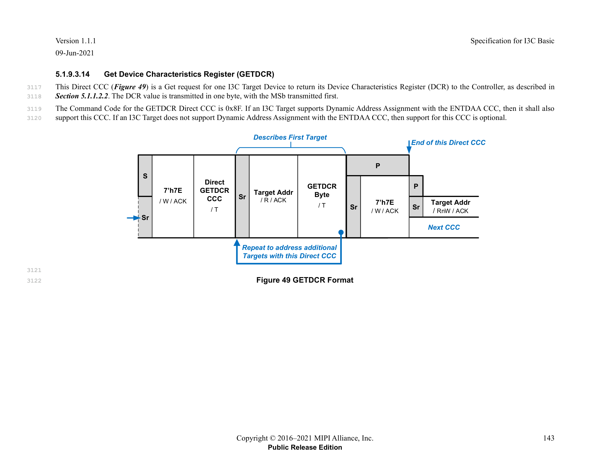

Copyright © 2016–2021 MIPI Alliance, Inc. 

143 

**Public Release Edition** 

Specification for I3C Basic 

Version 1.1.1 09-Jun-2021 

## **5.1.9.3.15 Get Device Status (GETSTATUS)** 

> **`3123`** This Direct CCC is a Get request for one I3C Target Device to return its current Status. 

- **`3124`** 

   - It has two formats: 

- **`3125`** • GETSTATUS Format 1 ( _**Figure 50**_ ) returns the two-byte format detailed in _**Table 27**_ . 

- **`3126`** • The optional GETSTATUS Format 2 ( _**Figure 51**_ ) adds a Defining Byte ( _**Table 28**_ ) and returns a variable number of data bytes. The number of data bytes **`3127`** returned and their format depend upon the Defining Byte value. GETSTATUS Format 2, including its Defining Byte value PRECR, is detailed below. 

- **`3128`** The Command Code for the GETSTATUS Direct CCC is 0x90. Support for this CCC is required. 

**==> picture [527 x 168] intentionally omitted <==**

**----- Start of picture text -----**<br>
Describes First Target<br>End of this Direct CCC<br>GETSTATUS P<br>S<br>Direct<br>P<br>7’h7E GETSTATUS   Target Addr<br>Sr<br>/ W / ACK CCC / R / ACK MSB  LSB  7’h7E Target Addr<br>/ T / T / T Sr / W / ACK Sr / RnW / ACK<br>Sr<br>Next CCC<br>Repeat to address additional Targets<br>with this Direct CCC<br>**----- End of picture text -----**<br>


```
3129
3130
```

**Figure 50 GETSTATUS Format 1** 

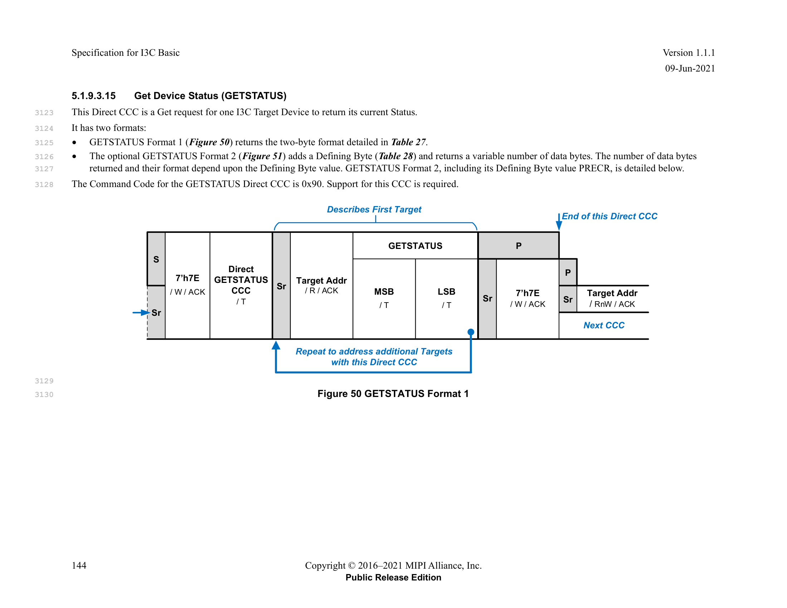

Copyright © 2016–2021 MIPI Alliance, Inc. 

144 

**Public Release Edition** 

Version 1.1.1 09-Jun-2021 

Specification for I3C Basic 

```
3131
```

## **Table 27 GETSTATUS MSB-LSB Format 1** 

||||**Table 27 GETSTATUS MSB-LSB Format 1**|
|---|---|---|---|
|**Byte**|**Bits**|**Field**|**Description**|
|**MSB**|**15:8**|**Vendor Reserved**|Reserved for vendor-specific meaning.|
|**LSB**|**7:6**|**Activity Mode**|Contains the two-bit ID of the Target Device’s current Activity Mode (i.e., its readiness to support data read of<br>sensor or related information).<br>A Controller-capable Device (i.e., Secondary Controller) must use this field to indicate when it is unable to<br>participate in any of the steps to prepare for Handoff of the Controller Role (see**_Section 5.1.7.1_**). If such a<br>Device is currently unable to participate, then it shall return a value of 2’b11. Any other value shall indicate that<br>the Device may be ready to participate.<br>For all other Target Devices, the meanings of the four possible values are not defined by this Specification;<br>instead, they depend upon a private contract between the Controller and each Target.|
||**5**|**Protocol Error**|1’b1: The Target detected a protocol error since the last Status read. The Target might or might not be able to<br>check for such errors. Note that this value self-clears upon every successful completion of a Controller read of<br>the Target’s Status.|
||4|Reserved|Reserved for future definition by MIPI Alliance I3C WG.|
||**3:0**|**Pending Interrupt**|Contains the interrupt number of any pending interrupt, or 0 if no interrupts are pending. This encoding allows for<br>up to 15 numbered interrupts. If more than one interrupt is set, then the highest priority interrupt shall be<br>returned.|


Copyright © 2016–2021 MIPI Alliance, Inc. 

145 

**Public Release Edition** 

Specification for I3C Basic 

Version 1.1.1 09-Jun-2021 

## **GETSTATUS Format 2** 

- **`3132`** The optional GETSTATUS Format 2 ( _**Figure 51**_ ) adds a Defining Byte ( _**Table 28**_ ) and returns a variable number of data bytes. The number of data bytes returned **`3133`** and their format depend upon the Defining Byte value. 

- **`3134`** Support for the GETSTATUS Format 2 CCC is optional, typically depending upon the Device’s role, capabilities, or other extended behavior. Before using **`3135`** GETSTATUS Format 2 for a given Target, a Controller shall determine whether that Target supports it. One way is to send the GETCAPS Format 1 CCC (no **`3136`** Defining Byte) and find that in Byte 3 (GETCAP3) of the data that the Target returns, bit 4 contains 1’b1 (see _**Table 37**_ ) 

- **`3137`** GETSTATUS Format 2 conforms to the CCC Direct General Frame Format ( _**Figure 31**_ ): 

- **`3138`** • **If the addressed Target Device does not support the given Defining Byte value for GETSTATUS Format 2:** Then the Target shall NACK its Target **`3139`** Address, thus terminating the Direct CCC. 

- **`3140`** • **If the addressed Target Device does support the given Defining Byte value for GETSTATUS Format 2:** Then the Target shall ACK its Target Address and **`3141`** return the requested data byte(s). The number of data bytes returned shall depend on the particular Defining Byte and its associated capabilities, as **`3142`** detailed below. 

- **`3143`** • **If the addressed Target Device is unable to immediately respond to the GETSTATUS Format 2 CCC with the given Defining Byte:** Then, per the Retry **`3144`** Model for Direct GET CCC Commands ( _**Section 5.1.9.2.3**_ ), the Target shall NACK the first attempt, and then the Controller shall attempt a single retry. **`3145`** If the Controller receives a NACK after a retry, then the Controller shall assume that the Target does not support the GETSTATUS Format 2 CCC with **`3146`** the given Defining Byte, and hence cannot return data describing any capabilities corresponding to that Defining Byte value. In most cases the 

- **`3147`** Controller can proceed as though it had read a value equivalent to all zeros as a default value. However, a NACK after a retry does not guarantee that the **`3148`** Target does not possess any capability or feature set associated with the given Defining Byte value. 

- **`3149`** A Target that supports the GETSTATUS Format 2 CCC (i.e., GETSTATUS with any optional Defining Bytes) shall return a value of 1’b1 in bit 4 of Byte 3 **`3150`** (GETCAP3), when the GETCAPS CCC is sent without a Defining Byte. A Controller that sees that bit set to 1’b1 will know that the Target is capable of supporting 

- **`3151`** at least one Defining Byte with the GETSTATUS Format 2 CCC. The ACK/NACK method explained above allows the Target to indicate which Defining Byte **`3152`** values it actually supports. 

Copyright © 2016–2021 MIPI Alliance, Inc. 

146 

**Public Release Edition** 

Version 1.1.1 09-Jun-2021 

Specification for I3C Basic 

## _**Describes First Target**_ 

||||||||||||||||||||
|---|---|---|---|---|---|---|---|---|---|---|---|---|---|---|---|---|---|---|
|**`3153`**<br>**`3154`**<br>**`3155`**|||||||**_Describes First Target_**|||||||||**P**<br>**Sr**<br>**Target Addr**<br>/RnW / ACK<br>**_Next CCC_**<br>**_End of this Direct CCC_**|||
|||||||||||||||||**_End of this Direct C_**|||
|||||||||||||||||**P**|||
|||**S**|**7’h7E**<br>/ W / ACK||**Direct**<br>**GETSTATUS**<br>**CCC**<br>/ T||**Defining**<br>**Byte**<br>/ T|**Sr**|**Target Addr**<br>/ R / ACK|**GETSTATUS Format 2**<br>**_Length Depends Upon Defining Byte_**||||**P**|||||
|||||||||||**Byte0**<br>/ T|**...**|**ByteN**<br>/ T||**Sr**|**7’h7E**<br>/ W / ACK|**P**|||
|||**Sr**||||||||||||||**Sr**|**Target Addr**<br>/RnW / ACK||
|||||||||||||||||**_Next CCC_**|||
||||||||**_Repeat to address additional Targets_**<br>**_with this Direct CCC_**||||||||||||
||||||||**Figure 51 GETSTATUS Format 2**<br>**Table 28 GETSTATUS Format 2 Defining Byte Values**||||||||||||
||**Value**|||**Encoding**|||**Description**|||||||||||**Data Bytes**<br>**Returned**|
||**0x00**|||**TGTSTAT**|||Returns Target Status (standard format). Equivalent to GETSTATUS Format 1 (without a<br>Byte).|||||||||Defining||2|
||**0x01 – 0x90**|||**Reserved**|||Reserved for future definition by MIPI Alliance I3C WG|||||||||||—|
||**0x91**|||**PRECR**|||Returns alternate Status format describing a Controller-capable Device (i.e., Secondary Controller)<br>per subsection below.<br>Recommended if an I3C Device is both compliant with I3C Basic Specification v1.1 or higher, and<br>advertises as Controller-capable (i.e., if the value of the BCR[7:6] bits is 2’b01).|||||||||||2|
||**0x92 – 0xBF**|||**Reserved**|||Reserved for future definition by MIPI Alliance I3C WG|||||||||||—|
||**0xC0 – 0xDF**|||**Reserved**|||Reserved for future definition by other MIPI Alliance WGs|||||||||||—|
||**0xE0 – 0xFE**|||**Vendor Extensions**|||For Vendor use|||||||||||—|
||**0xFF**|||**Reserved**|||Reserved for future definition by MIPI Alliance I3C WG|||||||||||—|


Copyright © 2016–2021 MIPI Alliance, Inc. **Public Release Edition** 

147 

Specification for I3C Basic 

Version 1.1.1 09-Jun-2021 

```
3162
```

```
3163
```

```
3164
```

```
3165
```

```
3166
3167
```

```
3168
```

```
3169
```

```
3170
```

```
3171
```

## **Get Secondary Controller Status (GETSTATUS Format 2, Defining Byte PRECR)** 

## **`3156`** _**Note:**_ 

## **`3157`** 

```
3158
```

```
3159
```

```
3160
```

```
3161
```

_This Section describes the GETSTATUS Format 2 CCC when the value of the Defining Byte is 0x91 (PRECR)_ 

Support for the GETSTATUS Format 2 CCC with the PRECR Defining Byte is optional. All Controller-capable Devices should support the GETSTATUS Format 2 CCC with the PRECR Defining Byte while in Target mode, if they might enter such a deep sleep state, or might require significant time to recover and/or resynchronize their internal state based on Broadcast data sent by the Active Controller. 

This Direct CCC ( _**Figure 52**_ ) allows the Active Controller to query a Controller-capable (i.e., Secondary Controller) I3C Device, to read the current state of the Device ( _**Table 29**_ ) in order to determine whether it entered a “deep sleep” state during which it might have missed any Broadcast DEFTGTS CCCs or DEFGRPA CCCs sent by the Active Controller, or is currently processing data from these Broadcast CCCs and is unable to safely accept the Controller Role until it has finished processing that data and updated its internal state. 

It is anticipated that some classes of Controller-capable Devices operating as a Secondary Controller (i.e., in Target mode) may enter a deep sleep state, and hence may not only miss these Broadcast CCCs while in that state, but may also require a significant amount of time (from the perspective of the Bus and the Active Controller) to process these Broadcast CCCs sent by the Active Controller in an attempt to re-synchronize all Secondary Controller Devices, in preparation for a Controller Role handoff. If such a Device has entered a deep sleep state, then the Device shall indicate this state until it has received at least one Broadcast DEFTGTS CCC from the Active Controller. It is also expected that such a Device will remain active for a sufficient amount of time (i.e., after indicating its current Secondary Controller Status and processing the Broadcast CCC data received from the Active Controller) to ensure that it does not re-enter a deep sleep state which would invalidate any efforts to bring it back online and up to date. 

```
3172
```

```
3173
```

```
3174
```

```
3175
```

```
3176
```

When receiving the GETSTATUS Format 2 CCC with the PRECR Defining Byte, the Device returns its Status using the two-byte format detailed in _**Table 29**_ . 

A Device that is not Controller-capable shall NACK its Target Address, to indicate that it does not support the GETSTATUS Format 2 CCC with the PRECR Defining Byte. 

It is the responsibility of the Active Controller to determine whether a Controller-capable Device supports the GETSTATUS Format 2 CCC with the PRECR Defining Byte, and whether the deep sleep handling and re-synchronization is necessary before a Controller Role handoff. 

**`3177` Resynchronization :** A Secondary Controller that may require re-synchronization due to a returning from a deep sleep state shall indicate this capability when the **`3178`** GETCAPS CCC is sent with a Defining Byte value of CRCAPS (see _**Section 5.1.9.3.19**_ ). A Controller that sees that this capability is indicated knows that it then **`3179`** needs to send the GETSTATUS Format 2 CCC with Defining Byte value PRECR to read the current Secondary Controller Status from this Device, in order to **`3180`** determine its need to re-synchronize from a deep sleep state, or check to see whether it is processing the Broadcast CCC data, before expecting this Device to **`3181`** successfully ACK the GETACCCR CCC as part of the Controller Role handoff. 

**`3182` Additional Time:** A Secondary Controller requiring additional time to process data from these Broadcast CCCs sent by the Active Controller shall indicate this **`3183`** capability when the GETCAPS CCC is sent with a Defining Byte value of CRCAPS (see _**Section 5.1.9.3.19**_ ). If the Controller sees that capability is indicated, then **`3184`** it shall send this CCC with Defining Byte value PRECR to poll the Device, in order to frequently check its Status and determine when it has finished processing **`3185`** this data. This Secondary Controller shall indicate its current processing Status, by returning a value of 1’b1 in Bit[1] in the alternate Status two-byte format detailed **`3186`** below, until it has finished processing the data and can accept the Controller Role. 

Copyright © 2016–2021 MIPI Alliance, Inc. 

148 

**Public Release Edition** 

Version 1.1.1 09-Jun-2021 

Specification for I3C Basic 

**==> picture [585 x 160] intentionally omitted <==**

**----- Start of picture text -----**<br>
Describes First Target<br>End of this Direct CCC<br>P<br>S<br>Direct  PRECR<br>7’h7E GETSTATUS  Defining Sr Target Addr PRECRMSB PRECRLSB P<br>/ W / ACK CCC Byte / R / ACK / T / T 7’h7E Target Addr<br>/ T / T Sr / W / ACK Sr / RnW / ACK<br>Sr<br>Next CCC<br>Repeat to address additional Targets<br>with this Direct CCC<br>**----- End of picture text -----**<br>


||||**_Repeat to address additional Targets_**<br>**_with this Direct CCC_**|
|---|---|---|---|
|**`3187`**||||
|**`3188`**||**Figure 52 GETSTATUS Format 2 with Defining Byte PRECR**||
|**`3189`**|**Table**|**29 Status Bytes for GETSTATUS Format 2 with Defining Byte PRECR**||


||||**Figure 52 GETSTATUS Format 2 with Defining Byte PRECR**<br>**Table 29 Status Bytes for GETSTATUS Format 2 with Defining Byte PRECR**|
|---|---|---|---|
|**Byte**|**Bits**|**Field**|**Description**|
|**MSB**|**15:8**|**Vendor Reserved**|Reserved for vendor-specific meaning.|
|**LSB**|**7:2**|**Reserved**|Reserved for future definition by MIPI Alliance I3C WG.|
||**1**|**Handoff Delay**<br>**NACK**|This bit indicates whether this Device is currently processing any DEFTGTS CCC (and DEFGRPA CCC, if supported)<br>Broadcasts that may have been sent by the Active Controller. It is expected that this Device might take significant time to<br>process the data in such Broadcasts.<br>**1’b1:**The Active Controller may wait to send GETACCCR CCC to this Device, or should at least be aware that any<br>attempts to send GETACCCR CCC to this Device will be met with a NACK response, until this bit is read again later with<br>a value of 1’b0, to indicate that the Device has finished processing the data in these Broadcasts and has updated its<br>internal state.<br>**1’b0:**This Device is not currently processing Broadcast data, or has finished processing this data; in either case, it can<br>safely accept the Controller Role.|
||**0**|**Deep Sleep**<br>**Detected**|This bit indicates whether this Device has entered a “deep sleep” state, in which it might have missed any DEFTGTS CCC<br>(and DEFGRPA CCC, if supported) Broadcasts sent by the Active Controller. Consequently, this Device’s internal state of<br>known Target Devices (and known Group Addresses, if applicable) should be considered outdated.<br>**1’b1:**The Active Controller is obligated to send a fresh Broadcast of DEFTGTS CCC (and DEFGRPA CCC, if applicable<br>and supported) to update this Device’s internal state before sending GETACCCR CCC to this Device.<br>**1’b0:**This Device has not entered a “deep sleep” state, or is not capable of doing so.|


Copyright © 2016–2021 MIPI Alliance, Inc. **Public Release Edition** 

149 

Specification for I3C Basic 

Version 1.1.1 09-Jun-2021 

## **5.1.9.3.16 Get Accept Controller Role (GETACCCR)** 

> **`3190`** This Direct GET CCC ( _**Figure 53**_ ) is used both to verify a Controller Role Request, if received earlier, and to allow the Active Controller to offer (i.e., to pass) the **`3191`** Controller Role to an I3C Secondary Controller, even if it was not previously requested. The GET is used to confirm acceptance; to do so, the Secondary Controller **`3192`** returns its 7-bit Dynamic Address as shown in _**Figure 53**_ . The value of the 7-bit Dynamic Address will be the same as the value of the Target Address. If the **`3193`** Secondary Controller does not accept, then it shall NACK the Get request as shown in _**Figure 54**_ . 

**`3194`** A Secondary Controller requesting the Controller Role will gain the Controller Role only if all three of the following steps occur in the indicated order. The Active **`3195`** Controller may offer the Controller Role after preparing for handoff as detailed in _**Section 5.1.7.1**_ . 

```
3196
```

   1. The Active Controller transmits a GETACCCR command to the Secondary Controller. 

- **`3197`** 2. The Secondary Controller correctly replies with its 7-bit Dynamic Address. The value of the 7-bit Dynamic Address will be the same as the value of the **`3198`** Target Address. 

**`3199`** If the Secondary Controller instead responds with NACK ( _**Figure 54**_ ), or with an incorrect 7-bit Address ( _**Figure 55**_ ), then: 

- **`3200`** • The Secondary Controller will not acquire the Controller Role 

```
3201
```

   - The GETACCCR command is canceled, and 

- **`3202`** • The Active Controller can then either (a) Retry the CCC, or (b) Simply issue a Repeated START followed by 7’h7E to cancel ( _**Figure 55**_ ). 

- **`3203`** 3. The Active Controller issues a STOP and then begins the Controller to Controller Handoff Procedure per _**Section 5.1.7.2**_ . 

**`3204`** If the Active Controller instead issues a Repeated START, then: 

```
3205
```

```
3206
```

   - The Secondary Controller will not gain the Controller Role 

   - The GETACCCR command is canceled ( _**Figure 55**_ ), and 

- **`3207`** • The Active Controller can then either (a) Retry the CCC, or (b) End the transaction by providing a STOP. 

**`3208`** The Command Code for the GETACCCR Direct CCC is 0x91. If a Controller-capable Device (e.g., a Primary Controller or Secondary Controller) intends to pass 

**`3209`** the Controller Role to another Controller-capable Device, then it shall support this CCC. All Secondary Controller Devices (i.e., those that initialize as Secondary **`3210`** Controllers) should support this CCC. 

Copyright © 2016–2021 MIPI Alliance, Inc. 

150 

**Public Release Edition** 

Version 1.1.1 09-Jun-2021 

Specification for I3C Basic 

```
3211
3212
```

**==> picture [271 x 111] intentionally omitted <==**

**----- Start of picture text -----**<br>
S 7-Bit<br>7’h7E GETACCCR Direct  Sr Target Addr(Secondary  Dynamic Address P<br>/ W / ACK CCC Controller) / PAR<br>/ T / R / ACK<br>/ T<br>Sr<br>Figure 53 GETACCCR Format 1: Accepted<br>**----- End of picture text -----**<br>


**`3213`** _**Note:**_ **`3214`** _The value of the 7-Bit Dynamic Address will be the same as the value of the Target Address, and PAR is odd parity: ~XOR( Target Address[7:1] )._ 

```
3215
3216
```

**==> picture [343 x 126] intentionally omitted <==**

**----- Start of picture text -----**<br>
Canceled End of this Direct CCC<br>P<br>S<br>Direct  Target Addr<br>Target Addr Sr<br>7’h7E GETACCCR  (Secondary  7’h7E / RnW / ACK<br>/ W / ACK CCC Sr Controller) Sr / W / ACK<br>/ T / R / NACK<br>Sr Next CCC<br>Figure 54 GETACCCR Format 2: Not Accepted<br>**----- End of picture text -----**<br>


```
3217
3218
```

**==> picture [416 x 132] intentionally omitted <==**

**----- Start of picture text -----**<br>
Canceled End of this Direct CCC<br>P<br>S Incorrect<br>Direct  7-Bit  Target Addr<br>Target Addr Sr<br>7’h7E GETACCCR  (Secondary  Dynamic  7’h7E / RnW / ACK<br>/ W / ACK CCC Sr Controller) Address Sr / W / ACK<br>/ T / R / ACK / PAR<br>Sr / T Next CCC<br>Figure 55 GETACCCR Format 3: Incorrect Cancel<br>**----- End of picture text -----**<br>


Copyright © 2016–2021 MIPI Alliance, Inc. **Public Release Edition** 

151 

Specification for I3C Basic 

Version 1.1.1 09-Jun-2021 

## **5.1.9.3.17 Set Bridge Targets (SETBRGTGT)** 

> **`3219`** This Direct CCC ( _**Figure 56**_ ) is only relevant to Bridge Devices. An I3C Controller shall only send this CCC to known Bridge Devices that accept it. **`3220`** The Command Code for the SETBRGTGT Direct CCC is 0x93. Support for this CCC is optional. 

**==> picture [562 x 162] intentionally omitted <==**

**----- Start of picture text -----**<br>
Describes One Bridged Target<br>k = Bridge index (values 0 through Count–1) End of this Direct CCC<br>P<br>S<br>Direct  Dynamic  ID k ID k P<br>7’h7E SETBRGTGT  Sr Target Addr Count Address k MSB LSB<br>/ W / ACK CCC / T / W / ACK / T / 1'b0/ T / T / T Sr / W / ACK 7’h7E Sr Target Addr / RnW / ACK<br>Sr<br>Next CCC<br>Repeat for all Targets<br>connected to this Bridge<br>**----- End of picture text -----**<br>


```
3221
3222
```

## **Figure 56 SETBRGTGT Format** 

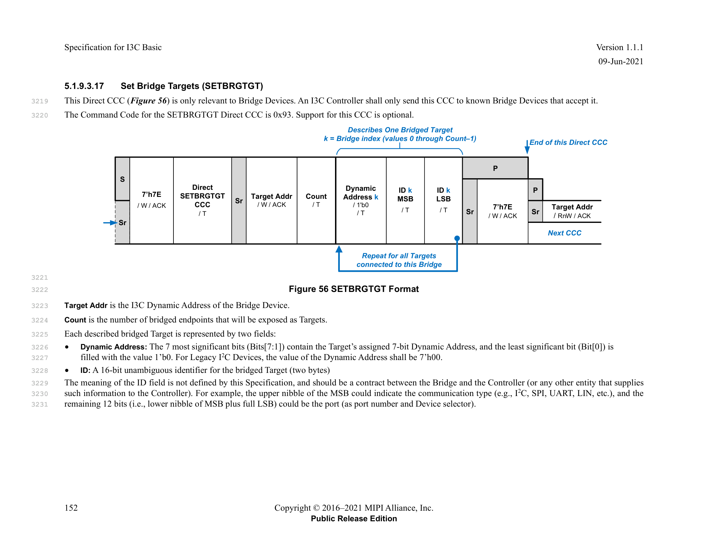

- **`3223` Target Addr** is the I3C Dynamic Address of the Bridge Device. 

- **`3224` Count** is the number of bridged endpoints that will be exposed as Targets. 

- **`3225`** Each described bridged Target is represented by two fields: 

- **`3226`** • **Dynamic Address:** The 7 most significant bits (Bits[7:1]) contain the Target’s assigned 7-bit Dynamic Address, and the least significant bit (Bit[0]) is **`3227`** filled with the value 1’b0. For Legacy I[2] C Devices, the value of the Dynamic Address shall be 7’h00. 

- **`3228`** • **ID:** A 16-bit unambiguous identifier for the bridged Target (two bytes) 

- **`3229`** The meaning of the ID field is not defined by this Specification, and should be a contract between the Bridge and the Controller (or any other entity that supplies 

- **`3230`** such information to the Controller). For example, the upper nibble of the MSB could indicate the communication type (e.g., I[2] C, SPI, UART, LIN, etc.), and the **`3231`** remaining 12 bits (i.e., lower nibble of MSB plus full LSB) could be the port (as port number and Device selector). 

Copyright © 2016–2021 MIPI Alliance, Inc. 

152 

**Public Release Edition** 

Specification for I3C Basic 

## Version 1.1.1 

09-Jun-2021 

## **`3232`** _**Note:**_ 

- **`3233`** _1. If the Controller needs to change the Dynamic Address of a bridged Target that was configured using SETBRGTGT, then the change shall be performed_ **`3234`** _using an updated SETBRGTGT, and not SETNEWDA._ 

- **`3235`** _2. The Controller shall not rely on each bridged Target having a unique BCR, DCR, or PID; so, use of GETBCR, GETDCR, and GETPID may return the_ **`3236`** _same result for each._ 

- **`3237`** _3. The Controller shall not rely on each bridged Target handling directed CCCs as unique. So, for example, SETMRL to one bridged Target may affect all_ **`3238`** _Targets accessed via the same bridge._ 

- **`3239`** _4. Use of GETMXDS is recommended for bridged Targets, such that each may return its own appropriate values based on protocol being bridged to._ 

Copyright © 2016–2021 MIPI Alliance, Inc. **Public Release Edition** 

153 

Specification for I3C Basic 

Version 1.1.1 09-Jun-2021 

```
3246
```

```
3247
3248
3249
```

```
3250
```

## **5.1.9.3.18 Get Max Data Speed (GETMXDS)** 

> **`3240`** The Controller uses this Direct CCC (there are three formats: _**Figure 58**_ , _**Figure 59**_ , and _**Figure 60**_ ) to determine the SDR Mode data speed limitations of one **`3241`** Target Device. The Controller is required to use this CCC only when Bit[0] of the addressed Target Device’s Bus Control Register (BCR) is set to 1’b1 (see _**Table**_ **`3242`** _**5**_ ). A Target Device is required to support this CCC only when Bit[0] of its Bus Control Register (BCR) is set to 1’b1 (see _**Table 5**_ ). 

```
3243
3244
3245
```

Bit[0] of the Bus Characteristics Register shall be set in any Target Device with a Clock-to-Data turnaround time greater than 12 ns. Target Devices within the tSCO delay range should not set the limitation bit (i.e., Bit[0]) unless other limitations exist. But Devices should support this CCC to allow better factoring of each number when computing the maximum effective frequency for reads, since the Controller/System-designer can be told the tSCO parameter along with line length (propagation time), line capacitance, number of Targets, and stubs if present. 

As shown in _**Figure 147**_ , the tSCO delay is the measurement of the total internal delay from the SCL input to the start of SDA output (see also _**[MIPI03]**_ ), excluding other factors like line capacitance and path delay that are factored out of the Device computation and put into the broader computation. The tSCO delay is applicable to both Controller Devices and Target Devices, since Controller Devices may behave as Target Devices in a Multi-Controller system based on the system configuration. 

Copyright © 2016–2021 MIPI Alliance, Inc. **Public Release Edition** 

154 

Version 1.1.1 09-Jun-2021 

Specification for I3C Basic 

**==> picture [543 x 221] intentionally omitted <==**

**----- Start of picture text -----**<br>
I3C Controller Device I3C Target Device<br>PHY Layer PHY Layer<br>t2 t4<br>D Q t1 PAD t3 PAD D Q<br>Clock<br>SCL<br>t8 t6<br>Q D t9 PAD t7 PAD Q D<br>iData<br>SDA<br>t5 = tSCO<br>**----- End of picture text -----**<br>


t1: Time from Clock Flop Q to Pad 

- t2: Time through output pad (PFET/NFET) 

   - (tested over 90 Ω, 50 pF line C) 

- t3: Time over wires pad-pad: Controller drive + Line Cap + Tpath 

- t4: Time through input pad of Target 

- t5: Time inside Target, from SCL input to SDA out (tSCO) 

   - (to gate drive of SDA) 

- t6: Time through output pad of Target 

- t7: Time over wires pad-pad: Target drive + Line Cap + Tpath 

- t8: Time through iData input pad (Schmitt input) 

- t9: Time from iData pad to D input for serializer 

**LEGEND Internal delay (excluding pads) PAD delays on a standard Bus model** 

**Figure 57 Components of Clock-to-Data Turnaround Delay (tSCO)** 

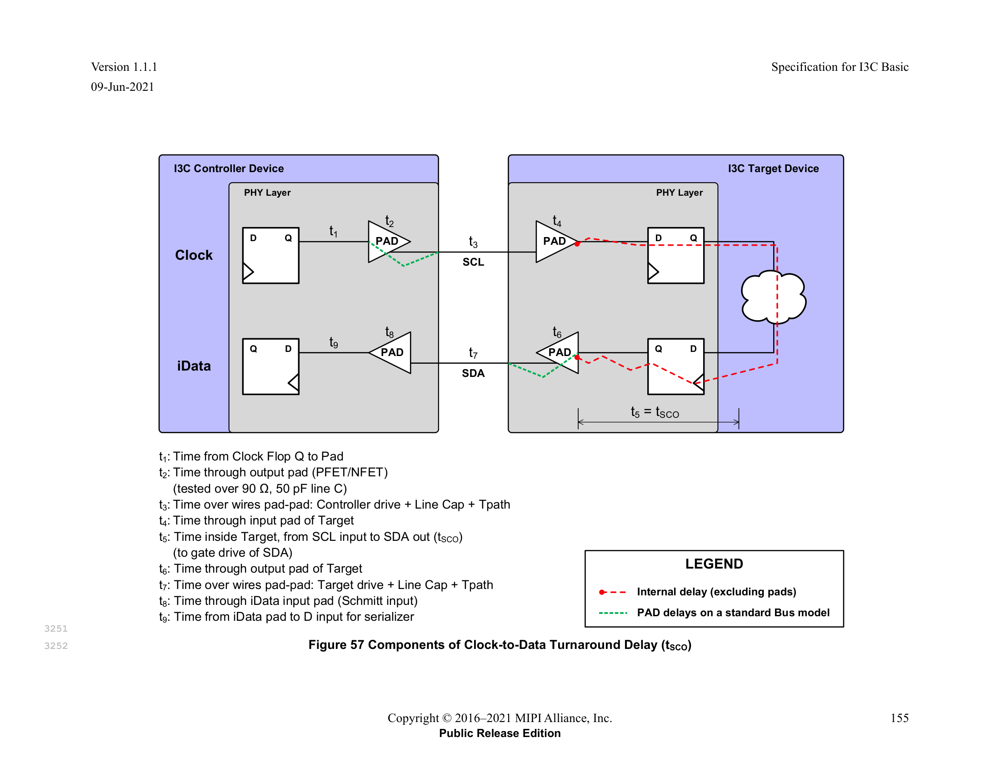

```
3251
3252
```

Copyright © 2016–2021 MIPI Alliance, Inc. 

155 

**Public Release Edition** 

Specification for I3C Basic 

Version 1.1.1 09-Jun-2021 

```
3257
```

```
3258
```

```
3259
```

```
3260
```

```
3261
```

```
3262
```

```
3263
```

```
3264
```

```
3265
```

```
3266
```

**`3253`** Any Target Devices with a Clock-to-Data turnaround (tSCO) delay greater than 12 ns shall set the Clock to Data Turnaround field of the maxRD Byte to 3’b111 and **`3254`** report this value to the Controller by private agreement. 

```
3255
```

```
3256
```

Maximum Read Turnaround Time is used to notify the Controller how long to wait before reading the data it requested. This allows the Controller to get the Target Device’s turnaround delay time for data read requests (excluding In-Band Interrupt responses). This is useful because some Targets may exhibit data read delays (as contrasted with CCC reads) due to clock-starting effects, bridging, slower inner processors, etc. The Controller can use the returned delay factor to avoid NACKs that would result from reading the Device too soon. The Target may have the data ready before the time reported, and the Controller can also estimate the time and retry reading before the maximum Read Turnaround time. The Controller should be aware that any NACKs for read requests from the Target before the maximum time is a normal condition, and no recovery methods are required; by contrast, NACKs after the maximum Data Turnaround time shall be dealt with accordingly. 

Bit[6] of the maxRd byte indicates whether the Controller may insert a STOP between the Write (index) and the Read. If the value of Bit[6] is 1’b1, then the Controller can use the extra time for other communications or end the communication and re-initiate it at the appropriate time. If the value of Bit[6] is 1’b0, then the Controller shall keep within one Frame. If the Maximum Read Turnaround time is more than a few micro-seconds, then the Target should permit STOP between the Write and Read. 

## _**Note:**_ 

**`3267`** _This CCC relates to bit data rates and Read Turnaround times, not data sizes. Data sizes are the subject of the CCCs Get Max Read Length (GETMRL, see_ **`3268`** _**Section 5.1.9.3.6** ) and Get Max Write Length (GETMWL, see_ _**Section 5.1.9.3.5** )._ 

- **`3269`** 

## **`3270`** 

The Target Device shall return: 

## **Either:** 

- **`3271`** • **GETMXDS Format 1:** Two data bytes containing the Target Device’s Maximum Write Speed and Maximum Read Speed (see _**Figure 58**_ ), 

## **`3272`** 

## **Or:** 

- **`3273`** • **GETMXDS Format 2:** Five data bytes containing the Target Device’s Maximum Write Speed, Maximum Read Speed, and a three-byte Maximum Read **`3274`** Turnaround Time (see _**Figure 59**_ ). 

- **`3275`** 

   - The Target signals which Format it is returning via the number of returned data bytes: Two bytes indicates Format 1, and five bytes indicates Format 2. 

- **`3276`** The Target’s selection of Format 1 vs. Format 2 should be based upon whether Maximum Read Turnaround Time needs to be communicated to the Controller **`3277`** Device. 

- **`3278`** Interpretation of the returned fields maxWr, maxRd, and (for Format 2 only) maxRdTurn is shown in _**Table 30**_ , _**Table 31**_ , and _**Table 32**_ respectively. 

- **`3279`** When reading the GETMXDS value from a Target, the SCL clock rate should be slowed (by frequency or duty cycle) to accommodate a possible slow Clock-to- **`3280`** Data turnaround (tSCO). This is only needed if the BCR bit has indicated a limitation. If BCR is not known (e.g., if SETDASA or SETAASA was used), then either **`3281`** read GETBCR slowly, or simply read GETMXDS slowly no matter what. See also _**Section 5.1.4**_ **BCR Use** in the _MIPI I3C System Integrators App Note_ _**[MIPI03]**_ 

- **`3282`** The Command Code for the GETMXDS Direct CCC is 0x94. Support for this CCC is required if Bit[0] of the I3C Target’s Bus Control Register (BCR) is set to **`3283`** 1’b1. 

Copyright © 2016–2021 MIPI Alliance, Inc. 

156 

**Public Release Edition** 

Version 1.1.1 09-Jun-2021 

Specification for I3C Basic 

**==> picture [590 x 387] intentionally omitted <==**

**----- Start of picture text -----**<br>
Describes First Target<br>End of this Direct CCC<br>P<br>S<br>Direct<br>P<br>7’h7E GETMXDS   Target Addr MaxWr  MaxRd<br>Sr<br>/ W / ACK CCC / R / ACK / T / T 7’h7E Target Addr<br>/ T Sr / W / ACK Sr / RnW / ACK<br>Sr<br>Next CCC<br>Repeat to address additional Targets<br>with this Direct CCC<br>Figure 58 GETMXDS Format 1: Without Turnaround<br>Describes First Target<br>End of this Direct CCC<br>P<br>S<br>Direct<br>3 Bytes P<br>7’h7E GETMXDS   Sr Target Addr MaxWr  MaxRd  MaxRdTurn<br>/ W / ACK CCC / T / R / ACK / T / T / T Sr / W / ACK 7’h7E Sr Target Addr / RnW / ACK<br>Sr<br>Next CCC<br>Repeat to address additional Targets<br>with this Direct CCC<br>**----- End of picture text -----**<br>


## **`3284 3285` Figure 58 GETMXDS Format 1: Without Turnaround** 

**Figure 59 GETMXDS Format 2: With Turnaround** 

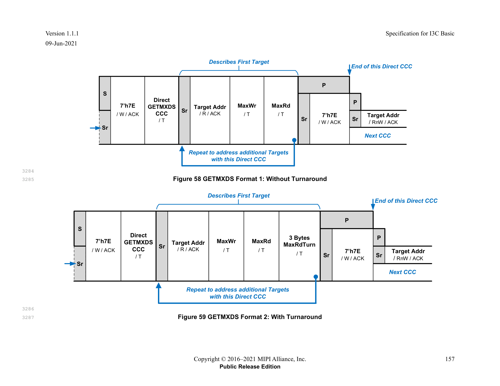

```
3286
```

```
3287
```

Copyright © 2016–2021 MIPI Alliance, Inc. **Public Release Edition** 

157 

Specification for I3C Basic 

Version 1.1.1 09-Jun-2021 

```
3288
```

```
3289
```

## **Table 30 maxWr Byte Format** 

||**Table 30 maxWr**|**Byte Format**|
|---|---|---|
|**Bits**|**Field**|**Description**|
|7:4|Reserved|Reserved for future use by MIPI Alliance|
|**3**|**Defining Byte Support**|Does this I3C Device support an optional Defining Byte for this CCC?<br>**0:**No<br>**1:**Yes|
|**2:0**|**Maximum Sustained Data Rate for non-CCC Messages**<br>**sent by Controller Device to Target Device**|**Values:**<br>**0:**fSCLMax (default value)<br>**1:**8 MHz<br>**2:**6 MHz<br>**3:**4 MHz<br>**4:**2 MHz<br>5–7: Reserved for future use by MIPI Alliance|


**Table 31 maxRd Byte Format** 

|**Bits**|**Field**|**Description**|
|---|---|---|
|7|Reserved|Reserved for future use by MIPI Alliance|
|**6**|**Write-to-Read Permits Stop Between**|If maxRdTurn is not 0, then this field is used to tell the Controller whether<br>the Target permits the Write-to-Read to be split by a STOP.<br>**0:**STOP would cancel the Read<br>**1:**The Target permits the Write-to-Read to be split by a STOP.|
|**5:3**|**Clock to Data Turnaround Time (tSCO) **|**Values:**<br>**0:**≤ 8 ns (default value)<br>**1:**≤ 9 ns<br>**2:**≤ 10 ns<br>**3:**≤ 11 ns<br>**4:**≤ 12 ns<br>5–6: Reserved for future use by MIPI Alliance<br>**7:**tSCOis > 12 ns, and is reported by private agreement|
|**2:0**|**Maximum Sustained Data Rate for non-CCC Messages**<br>**sent by Target Device to Controller Device**|**Values:**<br>**0:**fSCLMax (default value)<br>**1:**8 MHz<br>**2:**6 MHz<br>**3:**4 MHz<br>**4:**2 MHz<br>5–7: Reserved for future use by MIPI Alliance|


Copyright © 2016–2021 MIPI Alliance, Inc. 

158 

**Public Release Edition** 

Version 1.1.1 09-Jun-2021 

Specification for I3C Basic 

```
3290
```

**Table 32 maxRdTurn Format** 

|||**Table 32 maxRdTurn Format**|
|---|---|---|
|**Byte**|**Field**|**Description**|
|**0**|**Least Significant Byte**|Maximum Read Turnaround Time in µs.<br>24-bit field can encode turnaround times from 0.0 seconds to 16 seconds.|
|**1**|**Middle Byte**||
|**2**|**Most Significant Byte**||


## **GETMXDS Format 3** 

**`3291`** Additionally, some I3C Devices may support this CCC with an optional Defining Byte ( _**Figure 60**_ ), to return other capabilities based on the value of the Defining **`3292`** Byte. This support may be required as part of the Device’s role, capabilities, or other extended behavior. It is the Controller’s responsibility to determine whether **`3293`** the Device supports this CCC with an optional Defining Byte. The Controller may determine whether the Target has such support, by first sending this CCC without **`3294`** a Defining Byte, and checking for a value of 1’b1 in bit 3 of Byte 1 (maxWr) in the data read from the Target (see _**Table 31**_ ). 

**==> picture [572 x 169] intentionally omitted <==**

**----- Start of picture text -----**<br>
Describes First Target<br>End of this Direct CCC<br>P<br>S<br>Direct<br>7’h7E GETMXDS  Defining  Target Addr GET Byte(s)  P<br>/ W / ACK CCC / T Byte / T Sr / R / ACK / T Sr / W / ACK 7’h7E Sr Target Addr / RnW / ACK<br>Sr<br>Next CCC<br>Repeat to address additional Targets<br>with this Direct CCC<br>**----- End of picture text -----**<br>


```
3295
```

```
3296
```

## **Figure 60 GETMXDS Format 3: With Defining Byte** 

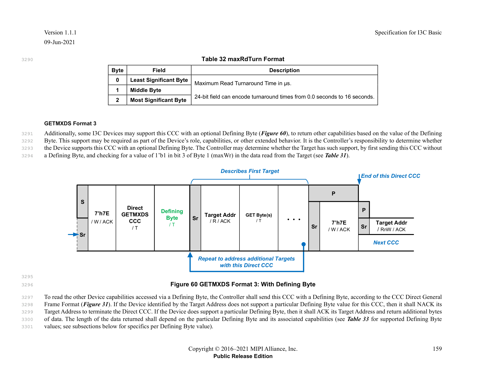

**`3297`** To read the other Device capabilities accessed via a Defining Byte, the Controller shall send this CCC with a Defining Byte, according to the CCC Direct General **`3298`** Frame Format ( _**Figure 31**_ ). If the Device identified by the Target Address does not support a particular Defining Byte value for this CCC, then it shall NACK its **`3299`** Target Address to terminate the Direct CCC. If the Device does support a particular Defining Byte, then it shall ACK its Target Address and return additional bytes **`3300`** of data. The length of the data returned shall depend on the particular Defining Byte and its associated capabilities (see _**Table 33**_ for supported Defining Byte **`3301`** values; see subsections below for specifics per Defining Byte value). 

Copyright © 2016–2021 MIPI Alliance, Inc. 

159 

**Public Release Edition** 

Specification for I3C Basic 

Version 1.1.1 09-Jun-2021 

```
3302
```

## **Table 33 GETMXDS Defining Byte Values** 

||**Table**|**33 GETMXDS Defining Byte Values**|
|---|---|---|
|**Value**|**Encoding**|**Description**|
|**0x00**|**WRRDTURN**|Describes standard (Target) Write/Read speed parameters, and optional Maximum Read<br>Turnaround time. Equivalent to the GETMXDS CCC without a Defining Byte.|
|0x01 – 0x90|Reserved|Reserved for future definition by MIPI Alliance I3C WG|
|**0x91**|**CRHDLY**|Describes delay parameters for a Controller-capable (i.e., Secondary Controller) Device,<br>and its expected Activity State during the Controller handoff (see subsection below).<br>Recommended if an I3C Device is compliant with version 1.1 or higher of the I3C Basic<br>Specification, and if it advertises itself as Controller-capable (i.e., if BCR bits 7:6 contain the<br>value 2’b01).|
|0x92 – 0xBF|Reserved|Reserved for future definition by MIPI Alliance I3C WG|
|0xC0 – 0xDF|Reserved|Reserved for future definition by other MIPI Alliance WGs|
|**0xE0 – 0xFE**|**Vendor Extensions**|For Vendor use|
|0xFF|Reserved|Reserved for future definition by MIPI Alliance I3C WG|


**`3303`** According to the Retry Model for Direct GET CCC Commands, if a Device cannot provide an immediate response to this CCC with a particular Defining Byte, **`3304`** then it shall NACK the first attempt, and then the Controller shall attempt a single retry (see _**Section 5.1.9.2.3**_ ). If the Controller receives a NACK after a retry, **`3305`** then the Controller shall assume that the Device does not support this CCC with this particular Defining Byte, and hence has no data that would be returned for **`3306`** any capabilities relating to that Defining Byte value. In most cases, the Controller may proceed as though it read a value equivalent to all zeros as a default value. **`3307`** However, a NACK after a retry should not be interpreted as meaning that the Device does not possess a capability or feature set associated with that Defining Byte **`3308`** value. 

```
3309
3310
3311
```

A Target that supports this CCC with any optional Defining Bytes shall return a value of 1’b1 in bit 3 of Byte 1 (maxWr) when this CCC is sent without a Defining Byte. If the Controller sees that bit set to 1’b1, then it knows that the Target is capable of supporting at least one Defining Byte with this CCC. The ACK/NACK method explained above allows the Target to indicate which Defining Byte values it actually supports. 

Copyright © 2016–2021 MIPI Alliance, Inc. **Public Release Edition** 

160 

Version 1.1.1 09-Jun-2021 

Specification for I3C Basic 

```
3312
```

```
3313
3314
3315
```

```
3316
3317
```

```
3318
```

```
3319
```

```
3320
```

## **Get Controller Handoff Delay Parameters (GETMXDS Format 3, Defining Byte CRHDLY)** 

This Direct CCC with Defining Byte value CRHDLY ( _**Figure 61**_ ) allows the Active Controller to query a Controller-capable (i.e., Secondary Controller) I3C Device, to read what optional Controller handoff delays or other timing parameters that Device will utilize. It is anticipated that a Device may advertise these parameters, to indicate whether it will enter an Activity State that requires the Active Controller to wait for an appropriate delay, before confirming its Controller Role or attempting the CE3 Error Recovery flow. 

It is recommended that all Controller-capable Devices should support this CCC with this Defining Byte in Target mode. If such a Device does not follow the default delay settings, or if it indicates other non-default timing parameters, then the Device shall support this Defining Byte. 

A Controller-capable Device may return one data byte, labeled CRHDLY1 per _**Figure 61**_ . 

A Device that is not Controller-capable shall NACK its Target Address, to indicate that it does not support this CCC with this particular Defining Byte. Fields within the CRHDLY1 Byte are detailed in _**Table 34**_ . 

**==> picture [532 x 168] intentionally omitted <==**

**----- Start of picture text -----**<br>
Describes First Target<br>End of this Direct CCC<br>P<br>S<br>Direct  CRHDLY<br>P<br>7’h7E GETMXDS  Defining  Target Addr CRHDLY1<br>Sr<br>/ W / ACK CCC Byte / R / ACK / T 7’h7E Target Addr<br>/ T / T Sr / W / ACK Sr / RnW / ACK<br>Sr<br>Next CCC<br>Repeat to address additional<br>Targets with this Direct CCC<br>**----- End of picture text -----**<br>


```
3321
```

```
3322
```

**Figure 61 GETMXDS Format 3 With Defining Byte CRHDLY** 

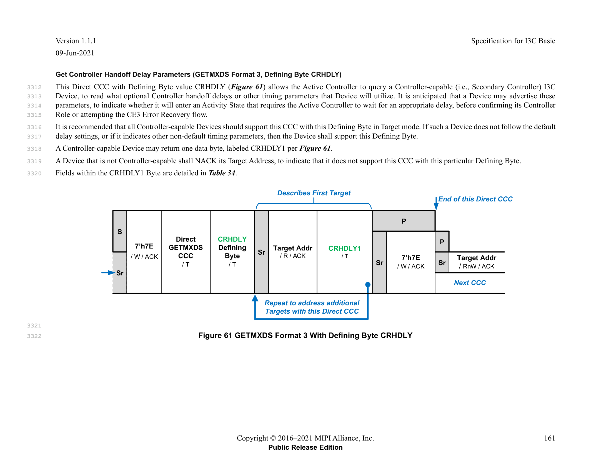

Copyright © 2016–2021 MIPI Alliance, Inc. 

161 

**Public Release Edition** 

Specification for I3C Basic 

Version 1.1.1 

09-Jun-2021 

```
3323
```

## **Table 34 CRHDLY1 Byte Format** 

|||**Table 34 CRHDLY1 Byte Format**|
|---|---|---|
|**Bits**|**Field**|**Description**|
|7:3|Reserved|Reserved for future definition by MIPI Alliance I3C WG|
|**2**|**Set Bus Activity State**|This bit indicates whether the Active Controller should set the Bus to the Activity State indicated in bits 1:0 before<br>handing the Controller Role off to this I3C Device as part of the normal flow.<br>**Values:**<br>**0:**The Active Controller should not set the Bus to any Activity State before handoff to this Device.<br>**1:**The Active Controller should set the Bus to the Activity State indicated by bits 1:0 before handoff to this Device.<br>_For the Activity States and their delay intervals, see_**_Table 11_**_._|
|**1:0**|**Controller Handoff Activity**<br>**State**|This 2-bit integer indicates whether this I3C Device initially acts with a given Activity State, after becoming Active<br>Controller on the Bus according to the Controller handoff flow. The indicated Activity State implies that the Device may<br>have a delayed response to Bus activity, and so the former Controller should wait the specified delay time for the<br>indicated Activity State before testing this Device, to confirm that it is controlling the Bus before initiating the CE3 error<br>recovery flow.<br>**Values:**<br>**0:**Acts according to Activity State 0.<br>**1:**Acts according to Activity State 1.<br>**2:**Acts according to Activity State 2.<br>**3:**Acts according to Activity State 3.<br>_For the Activity States and their delay intervals, see_**_Table 11_**_._<br>_For the Error Type CE3 recovery flow, see_**_Section 5.1.10.2.4_**_._|


Copyright © 2016–2021 MIPI Alliance, Inc. 

162 

**Public Release Edition** 

Version 1.1.1 09-Jun-2021 

Specification for I3C Basic 

## **5.1.9.3.19 Get Optional Feature Capabilities (GETCAPS)** 

> **`3324`** This Direct CCC allows the Controller to query an I3C Target to determine what optional I3C features that Target supports. It replaces the GETHDRCAP CCC, **`3325`** which was defined in version 1.0 of the full I3C Specification. 

```
3326
```

## _**Note:**_ 

- **`3327`** _All I3C Targets that support I3C Basic version 1.1 or greater shall support Format 1 of the GETCAPS CCC._ 

```
3328
```

## It has two formats: 

- **`3329`** • For **GETCAPS Format 1** ( _**Figure 62**_ ) the I3C Target may return the first 2, 3, or all 4 of the GETCAP1 through GETCAP4 Bytes shown in _**Figure 62**_ . **`3330`** Fields within each GETCAPx Byte are detailed in _**Table 35**_ through _**Table 38**_ . 

- **`3331`** • If the I3C Target supports I3C Basic version 1.1 or greater, then it must return at least the first 2 data bytes (GETCAP1 and GETCAP2). 

- **`3332`** • The optional **GETCAPS Format 2** ( _**Figure 63**_ ) adds a Defining Byte ( _**Table 39**_ ) and returns a variable number of data bytes. The number of data bytes **`3333`** returned and their format depend upon the Defining Byte value. GETCAPS Format 2 is detailed below. 

- **`3334`** The Command Code for the GETCAPS Direct CCC is 0x95. Support for this CCC is required for all I3C Targets. 

**==> picture [656 x 168] intentionally omitted <==**

**----- Start of picture text -----**<br>
Describes First Target<br>End of this Direct CCC<br>GETCAP1 Byte  GETCAP2 Byte  P<br>/ T / T<br>S<br>Direct<br>P<br>7’h7E GETCAPS  Target Addr GETCAP1 Byte  GETCAP2 Byte  GETCAP3 Byte<br>Sr<br>/ W / ACK CCC / R / ACK / T / T / T 7’h7E Target Addr<br>/ T Sr / W / ACK Sr / RnW / ACK<br>Sr<br>GETCAP1 Byte  GETCAP2 Byte  GETCAP3 Byte  GETCAP4 Byte<br>/ T / T / T / T Next CCC<br>Repeat to address additional Targets<br>with this Direct CCC<br>**----- End of picture text -----**<br>


```
3335
```

```
3336
```

```
3337
```

## _**Note:**_ 

## **Figure 62 GETCAPS Format 1** 

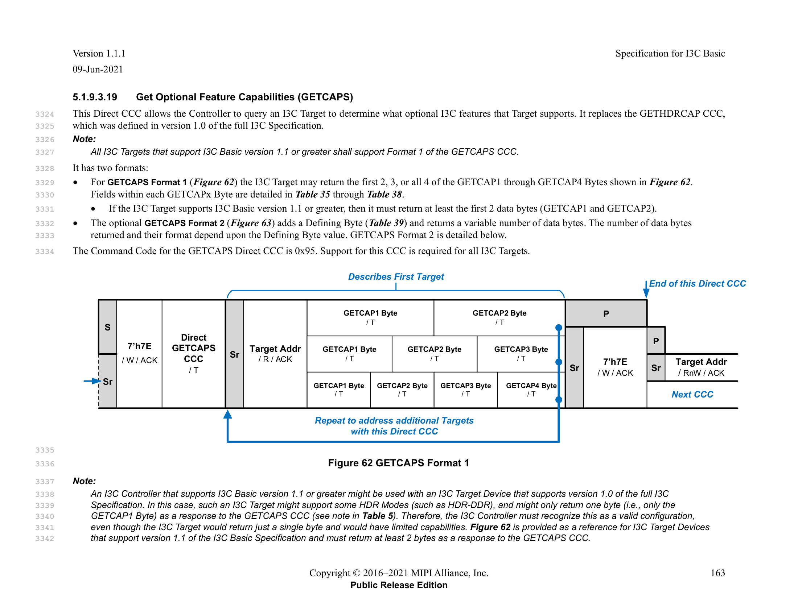

**`3338`** _An I3C Controller that supports I3C Basic version 1.1 or greater might be used with an I3C Target Device that supports version 1.0 of the full I3C_ **`3339`** _Specification. In this case, such an I3C Target might support some HDR Modes (such as HDR-DDR), and might only return one byte (i.e., only the_ **`3340`** _GETCAP1 Byte) as a response to the GETCAPS CCC (see note in_ _**Table 5** ). Therefore, the I3C Controller must recognize this as a valid configuration,_ **`3341`** _even though the I3C Target would return just a single byte and would have limited capabilities._ _**Figure 62** is provided as a reference for I3C Target Devices_ **`3342`** _that support version 1.1 of the I3C Basic Specification and must return at least 2 bytes as a response to the GETCAPS CCC._ 

Copyright © 2016–2021 MIPI Alliance, Inc. **Public Release Edition** 

163 

Specification for I3C Basic 

Version 1.1.1 

09-Jun-2021 

```
3343
```

## **Table 35 GETCAP1 Byte Format** 

|**Bit 7**|**Bit 6**|**Bit 5**|**Bit 4**|**Bit 3**|**Bit 2**|**Bit 1**|**Bit 0**|
|---|---|---|---|---|---|---|---|
|HDR Mode 7<br>**_Reserved_**|HDR Mode 6<br>**_Reserved_**|HDR Mode 5<br>**_Reserved_**|HDR Mode 4<br>**_Reserved_**|HDR Mode 3<br>(HDR-BT)|HDR Mode 2<br>**_Not included_**<br>**_in I3C Basic_**|HDR Mode 1<br>**_Not included_**<br>**_in I3C Basic_**|HDR Mode 0<br>(HDR-DDR)|


## _**Note:**_ 

## **`3344`** 

**`3345`** _The HDR Modes marked “Not included in I3C Basic” in_ _**Table 35** are defined in the full I3C Specification but not included in I3C Basic. To gain access to_ **`3346`** _these capabilities, please contact MIPI Alliance._ **`3347`** _An I3C Target that supports I3C Basic shall not indicate support for any of the HDR Modes marked “Not included in I3C Basic” in_ _**Table 35** ._ **`3348`** _An I3C Controller that supports any version of the I3C Basic Specification might receive a GETCAP1 Byte from an I3C Target that supports the full I3C_ **`3349`** _Specification, and might also support some of the HDR Modes marked “Not included in I3C Basic”. In such a case, the I3C Controller must ignore any such_ **`3350`** _HDR Modes in the GETCAP1 Byte that are indicated as supported by the I3C Target, as the I3C Controller would not have the capability to support such_ **`3351`** 

_An I3C Controller that supports any version of the I3C Basic Specification might receive a GETCAP1 Byte from an I3C Target that supports the full I3C Specification, and might also support some of the HDR Modes marked “Not included in I3C Basic”. In such a case, the I3C Controller must ignore any such HDR Modes in the GETCAP1 Byte that are indicated as supported by the I3C Target, as the I3C Controller would not have the capability to support such HDR Modes (since such HDR Modes are not included in the I3C Basic Specification)._ 

Copyright © 2016–2021 MIPI Alliance, Inc. 

164 

**Public Release Edition** 

Version 1.1.1 09-Jun-2021 

Specification for I3C Basic 

```
3352
```

## **Table 36 GETCAP2 Byte Format** 

|||**Table 36 GETCAP2 Byte Format**|
|---|---|---|
|**Bits**|**Field**|**Description**|
|**7**|**HDR-DDR Abort CRC**|Is this I3C Target capable of emitting the CRC Word when a transaction in HDR-DDR Mode is aborted?<br>**0:**No<br>**1:**Yes|
|**6**|**HDR-DDR Write Abort**|Is this I3C Target capable of issuing the Write Abort in HDR-DDR Mode?<br>**0:**No<br>**1:**Yes|
|**5:4**|**Group Address Capabilities**|This 2-bit integer indicates the Group Address function capabilities of this I3C Device.<br>**Values:**<br>**0:**Does not support Group Address function<br>**1:**Can be assigned one Group Address<br>**2:**Can be assigned two Group Addresses<br>**3:**Can be assigned three or more Group Addresses|
|**3:0**|**I3C Basic 1.x Specification**<br>**Version**|This 4-bit integer indicates the minor version number of the MIPI I3C Basic Specification with which this<br>I3C Basic v1.x Device complies. That is, the ‘x’ in “I3C Basic v1.x”.<br>**Examples:**<br>If Bits[3:0] are set to 4'b0001 (decimal 1), then the Device complies with I3C Basic v1.1.1 or possible future<br>v1.1.y<br>If Bits[3:0] are set to 4'b0010 (decimal 2), then the Device complies with possible future I3C Basic v1.2 or<br>v1.2.y<br>**_Note:_**<br>_An I3C Device that complies with the full I3C Specification shall use the same encoding to indicate the_<br>_version number of the full I3C Specification to which it complies._<br>**_Note:_**<br>_Bits[3:0] set to 4’b0000 is an illegal value._|


Copyright © 2016–2021 MIPI Alliance, Inc. 

165 

**Public Release Edition** 

Specification for I3C Basic 

Version 1.1.1 

09-Jun-2021 

```
3353
```

## **Table 37 GETCAP3 Byte Format** 

|||**Table 37 GETCAP3 Byte Format**|
|---|---|---|
|**Bit**|**Field**|**Description**|
|7|Reserved|Reserved for future definition by MIPI Alliance I3C WG|
|**6**|**IBI MDB Support for Pending**<br>**Read Notification**|Does this I3C Target expect that it can send In-Band Interrupt requests with a specific range of Mandatory<br>Data Byte values to indicate a Pending Read Notification, which the Controller shall then follow with a<br>Private Read request to fetch the data? (See**_Section 5.1.6.2.2_**.)<br>**0:**No<br>**1:**Yes|
|**5**|**HDR-BT CRC-32 Support**|Does this I3C Target support CRC-32 data integrity verification in HDR Bulk Transport Mode?<br>(See**_Section 5.2.4.3_**.)<br>**0:**No<br>**1:**Yes|
|**4**|**Defining Byte Support in**<br>**GETSTATUS**|Does this I3C Target support an optional Defining Byte for the GETSTATUS CCC?<br>**0:**No<br>**1:**Yes|
|**3**|**Defining Byte Support in**<br>**GETCAPS**|Does this I3C Target support an optional Defining Byte for this CCC (GETCAPS)?<br>**0:**No<br>**1:**Yes|
|2|Device to Device Transfer<br>(D2DXFER) IBI Capable|These capabilities are not included in the I3C Basic Specification. To gain access to them, please contact<br>MIPI Alliance.|
|1|Device to Device Transfer<br>(D2DXFER) Support||
|**0**|**Multi-Lane (ML)**<br>**Data Transfer Support**|Does this I3C Target support Multi-Lane (ML) Data Transfer?<br>(See**_Section 5.1.9.3.30_**and**_Section 5.3_**)<br>**0:**No<br>**1:**Yes|


```
3354
```

## _**Note:**_ 

**`3355`** _An I3C Target that supports I3C Basic shall not indicate support for any of the features or capabilities marked as “Not included in I3C Basic” in_ _**Table 37** ._ **`3356`** _An I3C Controller that supports supports any version of the I3C Basic Specification might receive a GETCAP3 Byte from an I3C Target that supports the full_ **`3357`** _I3C Specification, and might also support some of the features or capabilities marked as “Not included in I3C Basic”. In such a case, the I3C Controller must_ **`3358`** _ignore any such features or capabilities reported by the I3C Target, as the I3C Controller would not support them._ 

Copyright © 2016–2021 MIPI Alliance, Inc. 

166 

**Public Release Edition** 

Version 1.1.1 09-Jun-2021 

Specification for I3C Basic 

```
3359
```

## **Table 38 GETCAP4 Byte Format** 

|||**Table 38 GETCAP4 Byte Format**|
|---|---|---|
|**Bits**|**Field**|**Description**|
|7:0|Reserved|Reserved for future definition by MIPI Alliance I3C WG|


## **GETCAPS Format 2** 

**`3360`** The optional GETCAPS Format 2 ( _**Figure 63**_ ) adds a Defining Byte ( _**Table 39**_ ) and returns a variable number of data bytes. The number of data bytes returned and **`3361`** their format depend upon the Defining Byte value. 

- **`3362`** Support for the GETCAPS Format 2 CCC is optional, typically depending upon the Device’s role, capabilities, or other extended behavior. Before using GETCAPS **`3363`** Format 2 for a given Target, a Controller shall determine whether that Target supports it. One way is to send the GETCAPS Format 1 CCC (no Defining Byte) and **`3364`** find that in Byte 3 (GETCAP3) of the data that the Target returns, bit 4 contains 1’b1 (see _**Table 37**_ ) 

- **`3365`** 

GETCAPS Format 2 conforms to the CCC Direct General Frame Format ( _**Figure 31**_ ): 

- **`3366`** • **If the addressed Target Device does not support the given Defining Byte value for GETCAPS Format 2:** Then the Target shall NACK its Target Address, **`3367`** thus terminating the Direct CCC. 

- **`3368`** • **If the addressed Target Device does support the given Defining Byte value for GETCAPS Format 2:** Then the Target shall ACK its Target Address and **`3369`** return the requested data byte(s). The number of data bytes returned shall depend on the particular Defining Byte and its associated capabilities, as **`3370`** detailed below. 

- **`3371`** • **If the addressed Target Device is unable to immediately respond to the GETCAPS Format 2 CCC with the given Defining Byte:** Then, per the Retry **`3372`** Model for Direct GET CCC Commands ( _**Section 5.1.9.2.3**_ ), the Target shall NACK the first attempt, and then the Controller shall attempt a single retry. **`3373`** If the Controller receives a NACK after a retry, then the Controller shall assume that the Target does not support the GETSTATUS Format 2 CCC with **`3374`** the given Defining Byte, and hence cannot return data describing any capabilities corresponding to that Defining Byte value. In most cases the 

- **`3375`** Controller can proceed as though it had read a value equivalent to all zeros as a default value. However, a NACK after a retry does not guarantee that the **`3376`** Target does not possess any capability or feature set associated with the given Defining Byte value. 

- **`3377`** A Target that supports the GETCAPS Format 2 CCC (i.e., GETCAPS with any optional Defining Bytes) shall return a value of 1’b1 in bit 4 of Byte 3 (GETCAP3), **`3378`** when the GETCAPS CCC is sent without a Defining Byte. A Controller that sees that bit set to 1’b1 will know that the Target is capable of supporting at least one **`3379`** Defining Byte with the GETCAPS Format 2 CCC. The ACK/NACK method explained above allows the Target to indicate which Defining Byte values it actually **`3380`** supports. 

Copyright © 2016–2021 MIPI Alliance, Inc. 

167 

**Public Release Edition** 

Specification for I3C Basic 

Version 1.1.1 09-Jun-2021 

```
3381
3382
```

## _**Describes First Target**_ 

**==> picture [559 x 155] intentionally omitted <==**

**----- Start of picture text -----**<br>
Describes First Target<br>End of this Direct CCC<br>GETCAPS Format 2<br>P<br>Length Depends Upon Defining Byte<br>S<br>Direct<br>7’h7E GETCAPS  Defining  Target Addr P<br>Byte Sr<br>/ W / ACK CCC / T / T / R / ACK Byte0 / T ... ByteN / T Sr / W / ACK 7’h7E Sr Target Addr / RnW / ACK<br>Sr<br>Next CCC<br>Repeat to address additional Targets<br>with this Direct CCC<br>**----- End of picture text -----**<br>


**Figure 63 GETCAPS Format 2** 

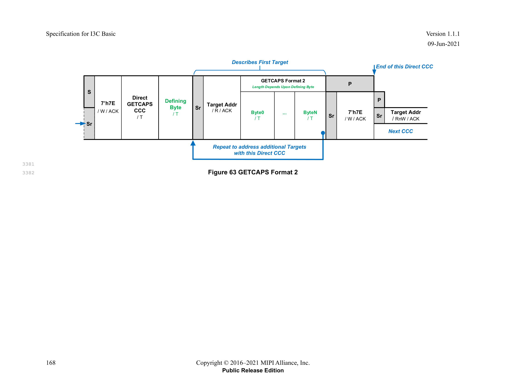

Copyright © 2016–2021 MIPI Alliance, Inc. **Public Release Edition** 

168 

Version 1.1.1 

Specification for I3C Basic 

```
3383
```

## 09-Jun-2021 

## **Table 39 GETCAPS Format 2 Defining Byte Values** 

|||**Table 39 GETCAPS Format 2 Defining Byte Values**||
|---|---|---|---|
|**Value**|**Encoding**|**Description**|**Data Bytes Returned**|
|**0x00**|**TGTCAPS**|Describes standard (Target) capabilities and features.<br>Equivalent to GETCAPS Format 1 (same CCC but without a Defining Byte).|**2 – 4**<br>(GETCAP1–GETCAP4)|
|0x01 – 0x59|Reserved|Reserved for future definition by MIPI Alliance I3C WG|—|
|**0x5A**|**TESTPAT**|Return a fixed 32-bit test pattern, to be used for signal integrity and speed testing (i.e.,<br>Debug test platforms).<br>Recommended if an I3C Device supports the MIPI Debug for I3C Specification as a Debug-<br>capable Target System (‘TS’, see**_[MIPI04]_**).|**4**<br>(TESTPAT1–TESTPAT4)|
|0x5B – 0x90|Reserved|Reserved for future definition by MIPI Alliance I3C WG|—|
|**0x91**|**CRCAPS**|Describes capabilities and features relating to a Controller-capable (i.e., a Secondary<br>Controller) Device, and its behavior during the Controller handoff (see below).<br>Recommended if an I3C Device is both compliant with the I3C Specification version 1.1 or<br>higher, and advertises as Controller-capable (i.e., the value of BCR[7:6] bits is 2’b01, see<br>**_Section 5.1.1.2.1_**).|**1 – 2**<br>(CRCAP1–CRCAP2)|
|0x92|Reserved|Reserved for future definition by MIPI Alliance I3C WG|—|
|**0x93**|**VTCAPS**|Describes capabilities and features relating to a Virtual Target capable Device.<br>Required if an I3C Device both is compliant with v1.1 or higher of the I3C Basic<br>Specification, and presents multiple Virtual Targets (i.e., the value of BCR[4] bit is 1’b1, see<br>**_Section 5.1.1.2.1_**).|**1 – 2**<br>(VTCAP1–VTCAP2)|
|0x94 – 0xBF|Reserved|Reserved for future definition by MIPI Alliance I3C WG|—|
|0xC0 – 0xD6|Reserved|Reserved for future definition by other MIPI Alliance WGs|—|
|**0xD7**|**DBGCAPS**|Describes capabilities and features relating to a Debug-capable Device conforming to the<br>MIPI Debug for I3C specification**_[MIPI04]_**.<br>Recommended if an I3C Device supports the MIPI Debug for I3C Specification as a Debug-<br>capable Target System (‘TS’, see**_[MIPI04]_**).|**1 – N**<br>(DBGCAP1–DBGCAPN)|
|0xD8 – 0xDF|Reserved|Reserved for future definition by other MIPI Alliance WGs|—|
|**0xE0 – 0xFE**|**Vendor Extensions**|For Vendor use|—|
|0xFF|Reserved|Reserved for future definition by MIPI Alliance I3C WG|—|


Copyright © 2016–2021 MIPI Alliance, Inc. **Public Release Edition** 

169 

Specification for I3C Basic 

Version 1.1.1 09-Jun-2021 

```
3392
```

```
3393
```

```
3394
```

```
3395
```

## **Read Fixed Test Pattern (GETCAPS Format 2, Defining Byte TESTPAT)** 

## **`3384`** 

```
3385
```

```
3386
```

```
3387
```

```
3388
```

```
3389
```

```
3390
```

```
3391
```

## _**Note:**_ 

_This Section describes the GETCAPS Format 2 CCC when the value of the Defining Byte is 0x5A (TESTPAT)_ 

This Direct CCC ( _**Figure 64**_ ) allows the Active Controller to request a Device to return a fixed 32-bit test pattern, which may be used by a Controller to test signal integrity of the I3C Bus or perform speed testing on the I3C Bus. This is useful for Bus implementations where a Controller may not be built into the system (i.e., a Debug probe joining the Bus as Secondary Controller) and might need to perform testing, in order to determine the maximum safe speed for communicating with a Device within a Debug-capable Target System (TS). 

All Debug-capable Devices should support this test pattern, and should return it when addressed by the GETCAPS Format 2 CCC with Defining Byte TESTPAT (0x5A) in Target mode. Additionally, any other Target Devices that share the same Bus as a Debug-capable Device should also support this test pattern. 

Per _**Figure 64**_ , a Device that supports this Defining Byte shall return a fixed 32-bit test pattern, consisting of the value 0xA55AA55A. The Active Controller may terminate the read on each byte boundary. 

A Device that does not support this test pattern shall NACK its Target Address, to indicate that it does not support the GETCAPS Format 2 CCC with Defining Byte TESTPAT (i.e., 0x5A). 

**`3396`** Additional Defining Bytes that return other test patterns may be defined at the discretion of the implementer, in order to perform more advanced signal integrity or **`3397`** speed testing procedures. 

**==> picture [600 x 201] intentionally omitted <==**

**----- Start of picture text -----**<br>
Returned by First Target<br>Fixed Test Pattern<br>Value 0xA55AA55A<br>End of this Direct CCC<br>P<br>S<br>Direct  TESTPAT  TESTPAT1 TESTPAT2 TESTPAT3 TESTPAT4 P<br>7’h7E GETCAPS  Defining  Target Addr Value 0xA5 Value 0x5A Value 0xA5 Value 0x5A<br>Sr<br>/ W / ACK CCC Byte / R / ACK 7’h7E Target Addr<br>/ T / T / T / T / T / T Sr / W / ACK Sr / RnW / ACK<br>Sr<br>Next CCC<br>Repeat to test additional Targets<br>with this Direct CCC<br>**----- End of picture text -----**<br>


```
3398
```

```
3399
```

## **Figure 64 GETCAPS Format 2 with Defining Byte TESTPAT** 

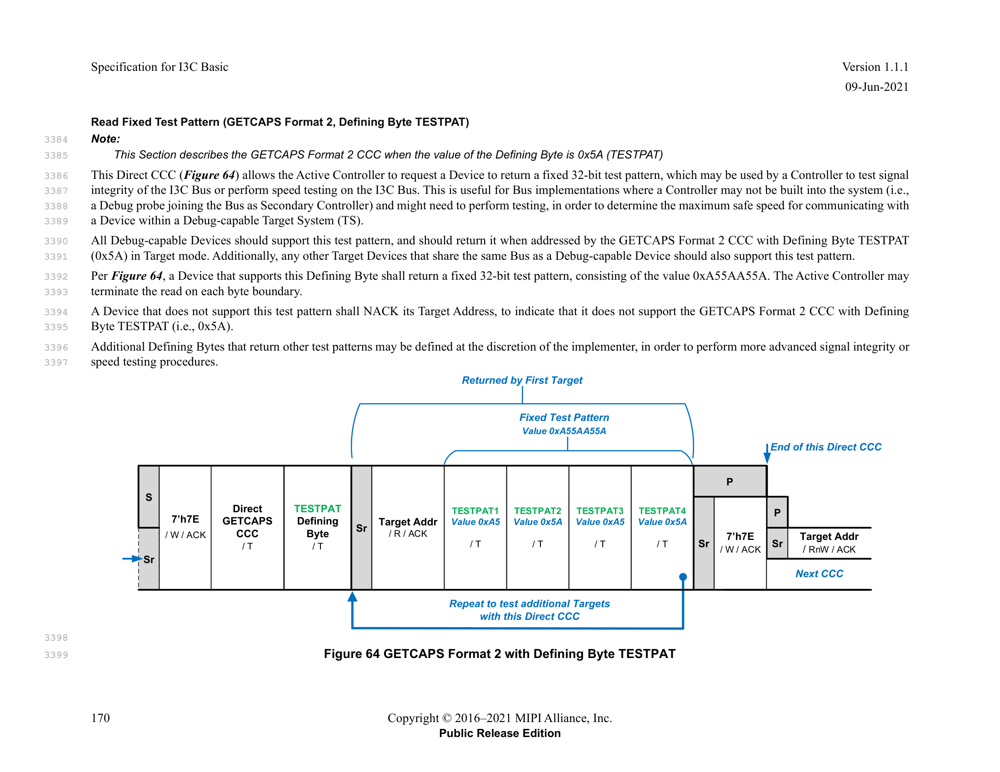

Copyright © 2016–2021 MIPI Alliance, Inc. 

170 

**Public Release Edition** 

Version 1.1.1 09-Jun-2021 

Specification for I3C Basic 

```
3400
```

## **Table 40 TESTPAT Message Format** 

|**Byte**|**Meaning**|**Description**|
|---|---|---|
|**TESTPAT1 – TESTPAT4**|**Fixed Test Pattern**|Four bytes containing the fixed test pattern value 0xA55AA55A.|


## **Get Controller Feature Capabilities (GETCAPS Format 2, Defining Byte CRCAPS)** 

## **`3401`** 

## **`3402`** 

## _**Note:**_ 

_This Section describes the GETCAPS Format 2 CCC when the value of the Defining Byte is 0x91 (CRCAPS)_ 

**`3403`** This Direct CCC ( _**Figure 65**_ ) allows the Active Controller to query a Controller-capable (Secondary Controller) I3C Device, to read what optional Controller **`3404`** features and capabilities that Device supports. An Active Controller might do this in order to determine whether a Controller-capable Device will abide by the **`3405`** Active Controller’s configuration or implied expectations regarding the overall Bus Controller Role flow. The Active Controller can use this information to decide **`3406`** whether to ACK or NACK a Controller Role Request (CRR) from this Controller-capable Device, in the event that errors or undesirable situations arise from any **`3407`** mismatch of configuration or expectations. 

```
3408
```

```
3409
```

```
3410
```

```
3411
```

```
3412
```

```
3413
```

```
3414
```

```
3415
```

All Controller-capable Devices should support the GETCAPS Format 2 CCC (with Defining Byte) in Target mode. If such a Device does not follow the default capability settings, or if it has restrictions or limitations on its capabilities while operating as Active Controller, then the Device shall support the GETCAPS Format 2 CCC (with Defining Byte). 

Per _**Figure 65**_ , a Controller-capable Device shall return either only the CRCAP1 data byte, or both data bytes CRCAP1 and CRCAP2, in that order. The Active Controller may terminate the read on each byte boundary. If only the one CRCAP1 data byte is returned, then the Active Controller may assume that the default values for the CRCAP2 data byte apply (i.e., as though CRCAP2 had been received with every bitfield set to 1’b0). 

A Device that is not Controller-capable shall NACK its Target Address, to indicate that it does not support the GETCAPS Format 2 CCC with Defining Byte CRCAPS (i.e., 0x91). 

**`3416`** Fields within the CRCAP1 and CRCAP2 data bytes indicate various Controller features and capabilities, as detailed in _**Table 41**_ and _**Table 42**_ , respectively. CRCAP1 **`3417`** generally addresses I3C Bus configuration, and CRCAP2 generally addresses Controller interaction with other I3C Devices. 

Copyright © 2016–2021 MIPI Alliance, Inc. 

171 

**Public Release Edition** 

Specification for I3C Basic 

Version 1.1.1 09-Jun-2021 

```
3418
3419
3420
```

||||||||||||||||
|---|---|---|---|---|---|---|---|---|---|---|---|---|---|---|
|||**_Describes First Target_**|||||||||||**P**<br>**Sr**<br>**Target Addr**<br>/RnW / ACK<br>**_Next CCC_**<br>**_End of this Direct CCC_**||
||||||||||||||**_End of this Direct C_**||
||||||||||||||**P**||
|||**S**|**7’h7E**|**Direct**<br>**GETCAPS**||**CRCAPS**<br>**Defining**||**Target Addr**|**CRCAPS1**<br>/ T||**P**||||
||||||||||||**Sr**|**7’h7E**<br>/ W / ACK|**P**||
|||**Sr**|/ W / ACK|**CCC**<br>/ T||**Byte**<br>/ T|**Sr**|/ R / ACK|**CRCAPS1**<br>/ T|**CRCAPS2**<br>/ T|||**Sr**|**Target Addr**<br>/RnW / ACK|
||||||||||||||**_Next CCC_**||
||||||**_Repeat to address additional Targets_**<br>**_with this Direct CCC_**||||||||||
||||||**Figure 65 GETCAPS Format 2 with Defining Byte CRCAPS**<br>**Table 41 CRCAP1 Byte Format**||||||||||
|**Bits**||**Field**|||**Description**||||||||||
|7:3|Reserved||||Reserved for future definition by MIPI Alliance I3C WG||||||||||
|**2**|**Multi-Lane Support**||||**1’b1:**This Device may use the MLANE CCC to change the ML configuration of other I3C Targets, to operate with<br>additional data Lanes (see**_Section 5.1.9.3.30_**).<br>**1’b0:**This Device shall not use the MLANE CCC to change the ML configuration of other I3C Targets. It shall either<br>use the I3C Bus as previously configured for ML transfers, or else reset I3C Targets to a default mode or<br>compatible ML configuration.||||||||||
|**1**|**Group Management Support**||||**1’b1:**This Device may support Group Address handoff or management capabilities. It may use the SETGRPA and<br>RSTGRPA CCCs to create groups, change Device membership, and remove Devices from groups. It shall also<br>use the DEFGRPA CCC to announce the current group membership data after making any changes.<br>**1’b0:**This Device does not support Group Address capabilities, and shall not use the SETGRPA or RSTGRPA CCCs.<br>It will ignore any DEFGRPA CCC Broadcasts while it is not Active Controller, and it shall not send DEFGRPA<br>CCC Broadcasts before a Controller Role handoff to another Controller-capable Device.||||||||||
|**0**|**Hot-Join Support**||||**1’b1:**This Device may support Hot-Join, and will ACK an I3C Target Hot-Join Request while it is Active Controller on<br>the Bus. It shall support Dynamic Address Assignment, and shall also send the DEFTGTS CCC to announce<br>the presence of newly joined I3C Targets to other Controller-capable Devices.<br>**1’b0:**This Device does not support Hot-Join, and will NACK any I3C Target Hot-Join Requests. It may also send<br>DISEC CCC with the DISHJ bit set to disable Hot-Join Requests.||||||||||


Copyright © 2016–2021 MIPI Alliance, Inc. **Public Release Edition** 

172 

Version 1.1.1 09-Jun-2021 

Specification for I3C Basic 

```
3421
```

## **Table 42 CRCAP2 Byte Format** 

|||**Table 42 CRCAP2 Byte Format**|
|---|---|---|
|**Bits**|**Field**|**Description**|
|7:4|Reserved|Reserved for future definition by MIPI Alliance I3C WG|
|**3**|**Delayed Controller**<br>**Handoff**|**1’b1:**This Device may need additional time to process Broadcast CCC data sent from the Active Controller, before it can<br>successfully complete the Controller Role Handoff Procedure and accept the Controller Role:<br>•If this Device indicates that it supports deep sleep re-synchronization (Bit 3) or indicates the “Handoff Delay<br>NACK” state (via the GETSTATUS CCC with the PRECR [i.e., 0x91] Defining Byte,**_Section 5.1.9.3.15_**), then<br>the Active Controller shall periodically check the value returned from the GETSTATUS CCC with the PRECR<br>Defining Byte to determine whether this Device is still processing data, or is ready to accept the Controller<br>Role.<br>•If this Device does not support Deep Sleep resynchronization, or if the Active Controller has exceeded its<br>timeout for checking the status of this Device, then this Device may restart the process by initiating a new<br>Controller Role Request.<br>**1’b0:**This Device does not need additional time to process Broadcast CCC data sent from the Active Controller. The<br>Active Controller may expect it to ACK the GETACCCR CCC as part of the Controller Role Handoff Procedure,<br>even if this Device did not initially send a Controller Role Request.|
|**2**|**Deep Sleep Capable**|**1’b1:**This Device may enter a deep sleep state during which it may miss some Broadcast DEFTGTS and DEFGRPA<br>CCCs sent by the Active Controller. It will require re-synchronization upon re-entering a normal operating state,<br>before it can accept the Controller Role with the GETACCCR CCC. The current status of the Device shall be<br>reported via the GETSTATUS CCC with the PRECR Defining Byte (i.e., 0x91, see**_Section 5.1.9.3.15_**).<br>**1’b0:**This Device shall remain active and continue to monitor the I3C Bus to listen for these Broadcast CCCs, and shall<br>not enter a deep sleep state from which it must be re-synchronized by the Active Controller before it can accept the<br>Controller Role.|
|**1**|**Controller Pass-Back**|**1’b1:**This Device shall automatically pass the Controller Role back to the former Active Controller from which it received<br>its Controller Role. It shall do so via the GETACCCR CCC, once it has finished performing any tasks that require it<br>to request and gain the Controller Role. This Device may also support a Controller Role Request from the former<br>Active Controller, or from any Controller-capable Device.<br>**1’b0:**This Device shall not automatically pass the Controller Role back to the former Active Controller. However, this<br>Device shall support a Controller Role Request from any Controller-capable Device.|
|**0**|**In-Band Interrupt Support**|**1’b1:**This Device may choose to accept an IBI request from any I3C Target, when operating as Active Controller on the<br>Bus. It may use the Target’s Address to determine whether to accept or refuse the IBI. It may selectively or globally<br>enable interrupts upon receiving the Controller Role, and shall disable interrupts before passing the Controller Role<br>on to another Controller-capable Device.<br>**1’b0:**This Device shall not accept any IBI requests, and will respond with NACK; it may also send the DISEC CCC with<br>the DISINT bit set, to disable interrupts (see**_Section 5.1.9.3.1_**).|


Copyright © 2016–2021 MIPI Alliance, Inc. **Public Release Edition** 

173 

Specification for I3C Basic 

Version 1.1.1 09-Jun-2021 

```
3428
3429
3430
3431
```

```
3435
```

```
3436
3437
```

## **Get Debug Feature Capabilities (GETCAPS Format 2, Defining Byte DBGCAPS)** 

## **`3422`** _**Note:**_ 

```
3423
```

```
3424
```

```
3425
```

```
3426
```

```
3427
```

_This Section describes the GETCAPS Format 2 CCC when the value of the Defining Byte is 0xD7 (DBGCAPS)_ 

This Direct CCC ( _**Figure 66**_ ) allows the Active Controller to query a Debug-capable I3C Device, to read the version of the MIPI Debug for I3C specification supported by that Device, as well as the optional Debug features and capabilities that Device supports. An Active Controller might do this in order to set up a session for a Debug software connection to the Device acting as part of a Debug-capable Target System (TS). 

All Debug-capable Devices should support the GETCAPS Format 2 CCC (with Defining Byte) in Target mode. 

Per _**Figure 66**_ , a Debug-capable Device shall return at least one data byte, with optional additional data bytes depending on the Debug features and capabilities of the Device. The total number of data bytes will depend upon the version and capabilities of the Device. The data bytes shall be returned in a defined order, depending on the MIPI Debug for I3C version, per _**Table 43**_ . The meaning and formatting of the data bytes is fully described in Section 5 of the MIPI Debug for I3C specification _**[MIPI04]**_ . 

```
3432
```

```
3433
```

```
3434
```

The Active Controller may terminate the read on each byte boundary. The Active Controller shall not make any assumptions about the presence of any Debug features or capabilities, beyond the contents of any data bytes received from the Device. 

These data bytes may be used by Debug software running on a Host system using a Debug-enabled Active Controller, in order to determine the Device’s Debug capabilities and configure the Debug software appropriately to access its Debug features and capabilities. 

A Device that is not Debug-capable shall NACK its Target Address, to indicate that it does not support the GETCAPS Format 2 CCC with Defining Byte DBGCAPS (0xD7). 

**==> picture [560 x 170] intentionally omitted <==**

**----- Start of picture text -----**<br>
Describes First Target<br>End of this Direct CCC<br>P<br>S<br>Direct  DBGCAPS<br>P<br>7’h7E GETCAPS  Defining  Sr Target Addr DBGCAP1 ...<br>/ W / ACK CCC Byte / R / ACK / T 7’h7E Target Addr<br>/ T / T Sr / W / ACK Sr / RnW / ACK<br>Sr<br>Next CCC<br>Repeat to address additional Targets<br>with this Direct CCC<br>**----- End of picture text -----**<br>


```
3439
```

**Figure 66 GETCAPS Format 2 with Defining Byte DBGCAPS** 

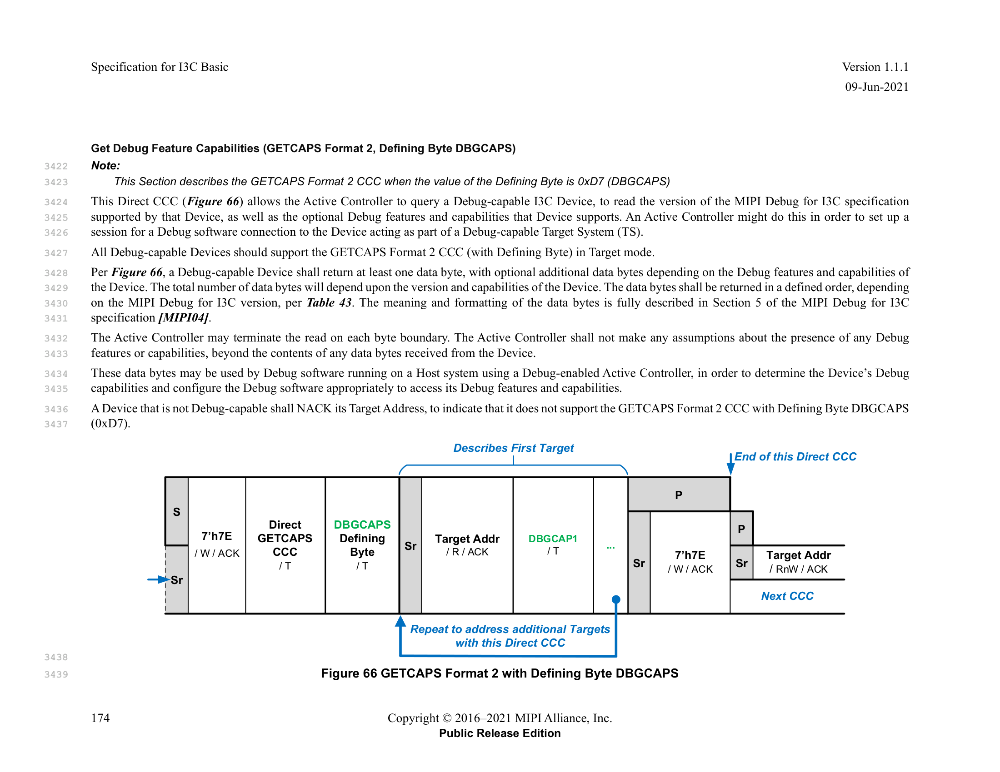

```
3438
```

Copyright © 2016–2021 MIPI Alliance, Inc. 

174 

**Public Release Edition** 

Version 1.1.1 09-Jun-2021 

Specification for I3C Basic 

```
3449
```

```
3450
```

```
3451
```

## **`3440`** 

## **Table 43 DBGCAPS Message Format** 

|**Byte**|**Meaning**|**Description**|
|---|---|---|
|**DBGCAP1**|**Debug for I3C Version**|This byte indicates the version of the MIPI Debug for I3C specification**_[MIPI04]_**<br>supported by this Device. (Required)|
|**DBGCAP2 – DBGCAP****_N_**|**Debug Features and Capabilities**|Number, meaning, and formatting of all subsequent bytes are defined in the MIPI<br>Debug for I3C specification**_[MIPI04]_**.|


## **Get Virtual Target Capabilities (GETCAPS Format 2, Defining Byte VTCAPS)** 

```
3441
```

```
3442
```

```
3443
3444
3445
```

```
3446
```

```
3447
```

```
3448
```

```
3452
```

```
3453
```

```
3454
```

```
3455
```

```
3456
```

```
3457
```

```
3458
```

```
3459
```

```
3460
```

```
3461
```

## _**Note:**_ 

_This Section describes the GETCAPS Format 2 CCC when the value of the Defining Byte is 0x93 (VTCAPS)_ 

This Direct CCC ( _**Figure 67**_ ) allows the Active Controller to query a Virtual Target capable I3C Device, to read what optional features and capabilities that Device supports. An Active Controller might do this in order to determine whether or how such a Device presents multiple Targets; whether other Virtual Target Addresses are presented by, controlled by, or embodied within this Device; whether this Device will request In-Band Interrupts; or how this Device will respond to other CCCs (e.g., RSTACT, ENTDAA, or GETPID). The Active Controller can use this information to fully configure the Bus and enable advanced applications using Virtual Targets with multiple Dynamic Addresses in a single Device. 

All Devices that report Virtual Target capabilities (i.e., that have BCR Bit[4] set to 1’b1; see _**Section 5.1.2.1.2**_ ) should support this CCC (GETCAPS Format 2 with Defining Byte VTCAPS [0x93]) in Target mode. If such a Device contains multiple Virtual Target Addresses, and if using other CCCs will have unexpected side effects on those Virtual Targets, then the Device shall support this CCC (i.e., GETCAPS Format 2 with Defining Byte VTCAPS [0x93]). 

Per _**Figure 67**_ , a Virtual Target capable Device shall return either only the VTCAP1 data byte, or both data bytes VTCAP1 and VTCAP2, in that order. The Active Controller may terminate the read on each byte boundary. If only the one VTCAP1 data byte is returned, then the Active Controller may assume that the default values for the VTCAP2 data byte apply (i.e., as though the VTCAP2 data byte had been received with every bitfield set to 1’b0). 

Fields within the VTCAP1 and VTCAP2 data bytes indicate various Virtual Target features and capabilities. _**Table 44**_ covers the features and capabilities dealing with the Device’s configuration, and _**Table 45**_ advertises how the Device handles any downstream Virtual Targets or other Devices, if those are supported. 

A Device that is Virtual Target capable and that has multiple Virtual Targets that use shared Peripheral logic shall also support the Virtual Target Detect Operation. The Controller can use the Virtual Target Detect Operation to detect the other Virtual Targets sharing that same Peripheral logic, if this is supported. This operation is controlled by the Active Controller using the RSTACT CCC with Defining Byte 0x04 (see _**Section 5.1.9.3.26**_ ). 

A Device that is Virtual Target capable and acts as a Bridge Device (see _**Section 5.1.9.3.17**_ ) or as a Routing Device (see _**Section 5.1.9.3.20**_ ) shall indicate how it should be configured by the Active Controller. It shall also indicate how it will configure any downstream Devices attached to its private Buses or Segments, and how it handles any upstream requests from those private Buses or Segments to this Bus. 

**`3462`** A Device that is not Virtual Target capable (i.e., that has BCR Bit[4] set to 1’b0) shall NACK its Target Address, to indicate that it does not support the GETCAPS **`3463`** Format 2 CCC with Defining Byte VTCAPS (0x93). 

Copyright © 2016–2021 MIPI Alliance, Inc. 

175 

**Public Release Edition** 

Specification for I3C Basic 

Version 1.1.1 09-Jun-2021 

**==> picture [558 x 169] intentionally omitted <==**

**----- Start of picture text -----**<br>
Describes First Target<br>End of this Direct CCC<br>P<br>VTCAP1<br>S<br>/ T<br>Direct  VTCAPS<br>7’h7E GETCAPS  Defining  Target  P<br>Sr Addr<br>/ W / ACK CCC Byte / R / ACK 7’h7E Target Addr<br>/ T / T VTCAP1 VTCAP2 Sr / W / ACK Sr / RnW / ACK<br>Sr<br>/ T / T<br>Next CCC<br>Repeat to address additional Targets<br>with this Direct CCC<br>**----- End of picture text -----**<br>


```
3464
3465
```

## **Figure 67 GETCAPS Format 2 with Defining Byte VTCAPS** 

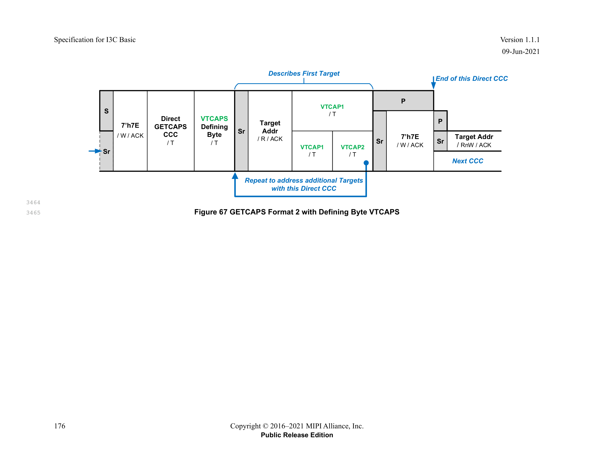

Copyright © 2016–2021 MIPI Alliance, Inc. **Public Release Edition** 

176 

Version 1.1.1 09-Jun-2021 

Specification for I3C Basic 

```
3466
```

## **Table 44 VTCAP1 Byte Format** 

|||**Table 44 VTCAP1 Byte Format**|
|---|---|---|
|**Bits**|**Field**|**Description**|
|7:6|Reserved|Reserved for future definition by MIPI Alliance I3C WG|
|**5**|**Shared Peripheral Detect**|**1’b0:**Device does not use shared Peripheral logic.<br>**1’b1:**Device uses shared Peripheral logic and supports the Virtual Target Detect operation as a Defining Byte for the<br>RSTACT CCC (see**_Section 5.1.9.3.26_**). Required for Virtual Target type 3’d5; Recommended for other Virtual<br>Target types. See MIPI I3C Application Note for System Integrators**_[MIPI03]_**.|
|**4**|**Side Effects**|**1’b0:**No impact on other Virtual Targets supported by this Device, if sending CCCs to reconfigure this Target’s<br>Dynamic Address.<br>**1’b1:**Configuration CCCs sent to this Virtual Target’s Dynamic Address may impact other Virtual Targets that are<br>connected to or exposed by this Device (example CCCs: SETNEWDA, SETMRL).|
|3|Reserved|Reserved for future definition by MIPI Alliance I3C WG|
|**2:0**|**Virtual Target Type**|**Values:**<br>**3’d0:**This Device does not support or declare any Virtual Target capabilities.<br>**3’d1:**This Device is a Bridge Device, and uses the SETBRGTGT CCC (**_Section 5.1.9.3.17_**) to configure its virtualized<br>(bridged) Targets.<br>**3’d2:**This Device is a Bridge Device, but does not require the use of the SETBRGTGT CCC; the Device will set up its<br>own bridged Targets.<br>**3’d3:**This Device is a Routing Device, and uses the SETROUTE CCC (**_Section 5.1.9.3.20_**) to configure its Routes to<br>one or more I3C Buses.<br>**3’d4:**This Device is a mixed-function Debug Virtual Target, which uses a single Target Address to access both Debug<br>functionality and application functionality.<br>**3’d5:**This Device supports multiple Virtual Target Addresses with shared Peripheral logic.<br>**3’d6:**This Device is a Hub that supports pass-through transactions to other Target Devices.<br>3’d7: Reserved|


Copyright © 2016–2021 MIPI Alliance, Inc. 

177 

**Public Release Edition** 

Specification for I3C Basic 

Version 1.1.1 

09-Jun-2021 

```
3467
```

## **Table 45 VTCAP2 Byte Format** 

|||**Table 45 VTCAP2 Byte Format**|
|---|---|---|
|**Bits**|**Field**|**Description**|
|7:5|Reserved|Reserved for future definition by MIPI Alliance I3C WG|
|**4:3**|**Bus Context and Conditions**<br>_Valid for Virtual Target types_<br>_3’d1, 3’d2, and 3’d3 only._|**2’d0:**Device manages all downstream Device configuration automatically.<br>**2’d1:**Device will re-broadcast any context and event enable/disable commands (i.e., SETBUSCON, ENEC, or<br>DISEC) to all downstream Devices when received from the Active Controller. Device can request Active<br>Controller to send a fresh configuration.<br>**2’d2:**Device will cache previously Broadcast context and event enable/disable configuration, and use that to<br>configure all new downstream Devices that join its downstream Bus segments.<br>2’d3**:**Reserved|
|**2**|**Address Remapping**<br>_Valid for Virtual Target types_<br>_3’d1, 3’d2, and 3’d3 only._|**1’b0:**Device will pass addresses of downstream Devices as they are assigned.<br>**1’b1:**Device will transparently re-map addresses of downstream Devices to mask them from this Bus.|
|**1:0**|**Interrupt Requests**<br>_Valid for Virtual Target types_<br>_3’d1, 3’d2, and 3’d3 only._|**Values:**<br>**2’d0:**Device will not coalesce or route interrupt requests from any downstream Devices.<br>**2’d1:**Device must coalesce interrupt requests from downstream Devices, using this Target Address.<br>**2’d2:**Device must route interrupt requests from downstream Devices using their Virtual Target Addresses.<br>**2’d3:**Device may do either (i.e., coalesce and/or route) when forwarding interrupts from downstream Devices.|


Copyright © 2016–2021 MIPI Alliance, Inc. 

178 

**Public Release Edition** 

Version 1.1.1 09-Jun-2021 

Specification for I3C Basic 

## **5.1.9.3.20 Set Route (SETROUTE)** 

> **`3468`** This Direct CCC ( _**Figure 68**_ ) is used by an I3C Controller to configure a Routing Device (Routing Devices are described below). Because this CCC is only relevant **`3469`** to Routing Devices, a Controller shall only send the SETROUTE CCC to a known Routing Device that accepts it. 

**`3470`** The Command Code for the SETROUTE Direct CCC is 0x96. Support for this CCC is optional. 

**==> picture [544 x 149] intentionally omitted <==**

**----- Start of picture text -----**<br>
Describes One Route to Other Network<br>k = Route index (values from 0 to Count–1)<br>End of this Direct CCC<br>P<br>S<br>Direct  Dynamic  Start Trans  P<br>/ W / ACK 7’h7E SETROUTE CCC / T Sr Target Addr / W / ACK Count / T Address  / 1'b0/ T k ID  / T k Count  / T k  Sr / W / ACK 7’h7E Sr Target Addr / RnW / ACK<br>Sr<br>Next CCC<br>Repeat for all Routes<br>**----- End of picture text -----**<br>


```
3471
```

## **`3472` Figure 68 SETROUTE Format** 

**`3473` Target Addr** is the Address of the Routing Device: either the Target’s original 7-bit static I[2] C Address, or else the current value of the Target’s assigned 7-bit **`3474`** Dynamic Address. This Target Address is used both for the Routing Device itself, and the other operations of the Device into which the routing behavior and logic **`3475`** is integrated. 

- **`3476` Count** is the number of configured Routes to be defined/assigned with this CCC (not the number of Routes the Routing Device provides). 

- **`3477`** Each Route is represented by three fields: 

- **`3478`** • **Dynamic Address:** The 7 most significant bits (Bits[7:1]) contain the current value of the Target’s assigned 7-bit Dynamic Address, and the least 

- **`3479`** significant bit (Bit[0]) is filled with the value 1’b0. This Address (not the Target Addr) is used when sending transactions to the associated I3C Bus. 

- **`3480`** • **ID:** An 8-bit identifier, implementation-specific to the Routing Device, identifying the specific Route to the I3C Bus endpoint provided by the Routing **`3481`** Device. 

- **`3482`** • **Start Trans Count:** An 8-bit value to which the Routing Device shall reset the transaction counter when initializing the Route. 

- **`3483`** The method by which the Controller is informed about the identifiers for the various Routes provided by the Routing Device is not defined by this Specification; 

- **`3484`** the Controller shall have prior knowledge of the identifiers, through either discovery registers or a priori knowledge. Although the identifiers used by the Routing **`3485`** Device are arbitrary, they shall be unique per I3C Bus endpoint. 

Copyright © 2016–2021 MIPI Alliance, Inc. 

179 

**Public Release Edition** 

Specification for I3C Basic 

Version 1.1.1 09-Jun-2021 

```
3489
3490
3491
```

```
3492
3493
3494
```

```
3495
```

- **`3486`** Only one Controller using the SETROUTE CCC shall configure a set of Routes at any given time. Any Controller accessing the Routing Device on any of the I3C **`3487`** Buses shall configure the Route(s). Only one Controller and its associated configured Routes shall be active at any given time. Each time a different Controller **`3488`** desires to configure its Route(s) through the Routing Device, it shall negotiate for ownership of the I3C Bus first. 

## **Routing Devices** 

A Routing Device enables an I3C Controller on a given I3C Bus to communicate to one or more other I3C Buses (see _**Figure 69**_ ). That is, a Routing Device enables a connection (also known as a Route), or multiple distinct connections, to exist between the connected I3C Buses. These I3C Buses are independent, and may have different sets of Dynamic Addresses. 

A Routing Device is distinguished from a Bridge Device, in that a Routing Device is not transparent; the transactions are relayed between the I3C Buses. Since the Routing Device inevitably incurs delays on the transactions, it shall handle transactions through buffers/queues in order to meet the transmit/receive requirements of the I3C protocol on each connected I3C Bus. Transactions from the Controller on its I3C Bus are queued by the Routing Device, and then sent to the other I3C Buses configured by the Controller. Each Route should have its own separate queue, in order to handle differences in timing and clocking. 

```
3496
```

```
3497
```

**==> picture [428 x 171] intentionally omitted <==**

**----- Start of picture text -----**<br>
Routing Device<br>Dynamic Address 0<br>Local Operations of the Device<br>(also contains any Routing<br>Queue I3C Bus A<br>configurations)<br>Dynamic<br>Target Address Dynamic Address 1<br>Controller’s<br>Queue Queue I3C Bus B<br>I3C Bus<br>Dynamic Address 2<br>Queue I3C Bus C<br>**----- End of picture text -----**<br>


**Figure 69 Example Routing Device** 

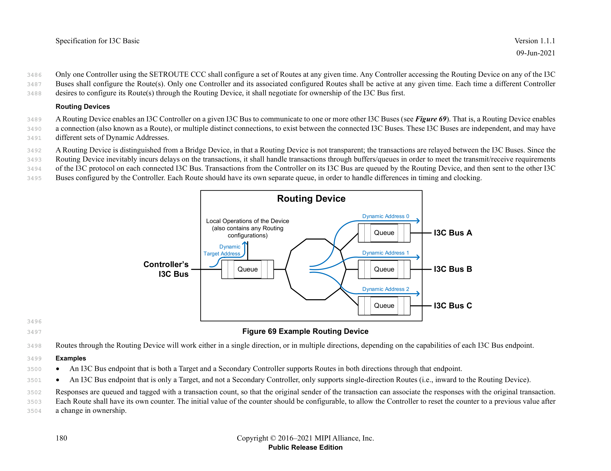

**`3498`** Routes through the Routing Device will work either in a single direction, or in multiple directions, depending on the capabilities of each I3C Bus endpoint. **`3499` Examples** 

## **`3500`** 

## **`3501`** 

```
3502
3503
```

```
3504
```

- An I3C Bus endpoint that is both a Target and a Secondary Controller supports Routes in both directions through that endpoint. 

- An I3C Bus endpoint that is only a Target, and not a Secondary Controller, only supports single-direction Routes (i.e., inward to the Routing Device). 

Responses are queued and tagged with a transaction count, so that the original sender of the transaction can associate the responses with the original transaction. Each Route shall have its own counter. The initial value of the counter should be configurable, to allow the Controller to reset the counter to a previous value after a change in ownership. 

Copyright © 2016–2021 MIPI Alliance, Inc. **Public Release Edition** 

180 

Version 1.1.1 09-Jun-2021 

Specification for I3C Basic 

```
3505
```

```
3506
3507
```

```
3508
3509
3510
```

```
3511
```

## **5.1.9.3.21 Set Exchange Timing Information (SETXTIME)** 

As detailed in _**Section 5.1.8**_ , the SETXTIME CCC provides the framework for Controller(s) and Target(s) to exchange event timing information for purposes such as synchronizing controls, collecting or reconstructing timestamps, and specifying the timing data procedure. The SETXTIME CCC is available both as a Broadcast Command ( _**Figure 70**_ ) and as a Direct Command ( _**Figure 71**_ ). 

The SETXTIME CCC always includes the one-byte Sub-Command field, which acts as an identifier that defines the specific function of the CCC. For some SubCommand values, additional Data Bytes follow. Interpretation of these additional Data Bytes depends upon the particular Sub-Command value, as detailed in _**Table 47**_ . 

## _**Note:**_ 

```
3512
3513
3514
```

```
3515
```

```
3516
3517
```

_Of the possible sub-commands that are defined, or that might be defined, for various Timing Control Modes in the full I3C Specification, I3C Basic includes only the ones that are required to enable or disable Async Mode 0 (Asynchronous Basic Mode). To gain access to the other Timing Control Modes and their sub-commands, please contact MIPI Alliance._ 

**Table 46 Set Exchange Timing Information Command Codes (SETXTIME)** 

|**Command**|**Command**|**Command**|**Support**|**Support**|**Command Codes**|**Command Codes**|**Command Codes**|**Command Codes**|**Purpose**|**Purpose**|**Purpose**|
|---|---|---|---|---|---|---|---|---|---|---|---|
||||||**Broadcast**||**Direct**|||||
|**SETXTIME**|||Conditional||0x28||0x98||Set Exchange Timing Information|||
|||||||||||**7’h7E**<br>/ W / ACK<br>**Target Addr**<br>/RnW / ACK<br>**_Next CCC_**<br>**_End of this Broadcast CCC_**||
||**S**|**7’h7E**<br>/ W / ACK||**Broadcast**<br>**SETXTIME**<br>**CCC**<br>/ T||**Sub-**<br>**Command**<br>**Byte**<br> / T||**Data**<br>**_(Optional)_**<br>/ T|**P**|||
||||||||||**Sr**|**Target Addr**<br>/RnW / ACK||
||**Sr**|||||||||||
|||||||||||**7’h7E**<br>/ W / ACK|**_Next CCC_**|


**Figure 70 SETXTIME Format 1: Broadcast** 

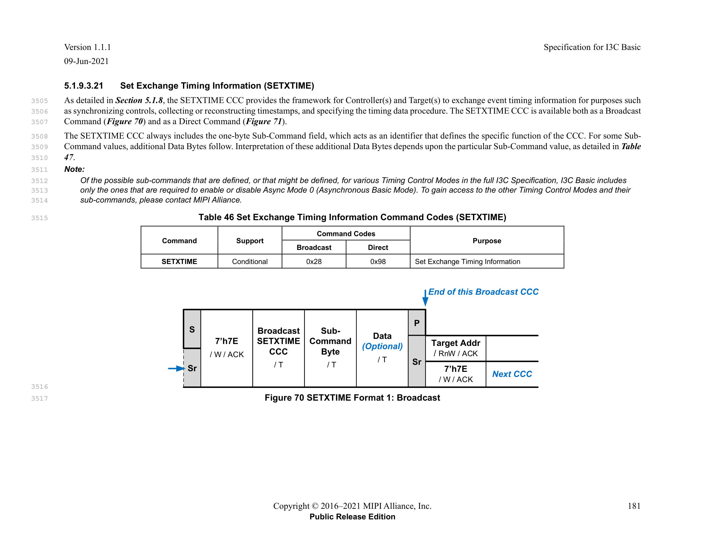

Copyright © 2016–2021 MIPI Alliance, Inc. 

181 

**Public Release Edition** 

Specification for I3C Basic 

Version 1.1.1 09-Jun-2021 

|**`3518`**<br>**`3519`**<br>**`3520`**|||||||**_Describes First Target_**|**_Describes First Target_**|**_Describes First Target_**|**_Describes First Target_**|**_Describes First Target_**|||**P**<br>**Sr**<br>**Target Addr**<br>/RnW / ACK<br>**_Next CCC_**<br>**_End of this Direct CCC_**|**P**<br>**Sr**<br>**Target Addr**<br>/RnW / ACK<br>**_Next CCC_**<br>**_End of this Direct CCC_**|**P**<br>**Sr**<br>**Target Addr**<br>/RnW / ACK<br>**_Next CCC_**<br>**_End of this Direct CCC_**|
|---|---|---|---|---|---|---|---|---|---|---|---|---|---|---|---|---|
||||||||||||||||||
|||||||||||||||**P**|||
||||**S**|**7’h7E**<br>/ W / ACK||**Direct**<br>**SETXTIME**<br>**CCC**<br>/ T|<br>**Sr**|**Target Addr**<br>/ W / ACK|**Sub-**<br>**Command**<br>**Byte**<br>/ T|**Data**<br>**_(Optional)_**<br>/ T||**P**|||||
|||||||||||||**Sr**|**7’h7E**<br>/ W / ACK|**P**|||
||||**Sr**|||||||||||**Sr**|**Target Addr**<br>/RnW / ACK||
|||||||||||||||**_Next CCC_**|||
||||||||**_Repeat to address additional Targets_**<br>**_with this Direct CCC_**||||||||||
||||||||**Figure 71 SETXTIME Format 2: Direct**<br>**Table 47 SETXTIME Sub-Command Byte Values**||||||||||
||**Sub-**<br>**Command**<br>**Value**|**Sub-Command**<br>**Function**|||||**Description**|||||||||**Additional**<br>**Data Bytes**|
||0x7F|Sync Tick ‘ST’|||These capabilities are not included in the I3C Basic Specification. To gain access to them, please contact MIPI<br>Alliance.|||||||||||None|
||0xBF|DelayTime ‘DT’||||||||||||||One byte|
||**0xDF**|**Enter Async Mode 0**|||Commands all I3C Targets and Controllers on the Bus to operate in Async Basic Mode. See**_Section 5.1.8.3.1_**.<br>Anchor points: In-Band Interrupt ACK and T-Bit after the first In-Band Interrupt Payload byte.<br>Upon receiving this Sub-Command, all I3C Devices shall reset all internal counts. All I3C Controllers that<br>support TimingControl shall support Async Mode 0.|||||||||||None|
||0xEF|Enter Async Mode 1|||These capabilities are not included in the I3C Basic Specification. To gain access to them, please contact MIPI<br>Alliance.|||||||||||None|
||0xF7|Enter Async Mode 2||||||||||||||None|
||0xFB|Enter Async Mode 3||||||||||||||None|
||0xFD|Async Trigger<br>(for Async Mode 3)||||||||||||||None|
||0x3F|TPH||||||||||||||One or more bytes|
||0x9F|TU||||||||||||||One byte|
||0x8F|ODR||||||||||||||One byte|
||**0xFF**|**Exit**|||Commands all I3C Targets to exit from the enabled timingmodes,or to turn timingcontrol off entirely.|||||||||||None|
||All Others|Reserved|||Available Sub-Command values for future definition of new SETXTIME CCC Sub-Commands|||||||||||(For future definition)|


Copyright © 2016–2021 MIPI Alliance, Inc. 

182 

**Public Release Edition** 

Version 1.1.1 09-Jun-2021 

Specification for I3C Basic 

## **5.1.9.3.22 Get Exchange Timing Support Information (GETXTIME)** 

> **`3521`** This Direct CCC ( _**Figure 72**_ ), whose use is further detailed in _**Section 5.1.8**_ , provides the framework for the Controller to query the Exchange Timing capabilities **`3522`** supported by the I3C Targets. The GETXTIME CCC causes the addressed Target to return four data bytes containing key information on supported Timing Control **`3523`** modes, current state, and internal oscillator/clock frequency and inaccuracy. 

**`3524`** The Command Code for the GETXTIME Direct CCC is 0x99. Support for this CCC is required if an I3C Target supports any Timing Control modes (see **`3525`** _**Section 5.1.8**_ ). 

**==> picture [635 x 165] intentionally omitted <==**

**----- Start of picture text -----**<br>
Describes First Target<br>End of this Direct CCC<br>P<br>S<br>Direct  Supported<br>State  Frequency Inaccuracy P<br>7’h7E GETXTIME  Sr Target Addr Modes  Byte  Byte  Byte<br>/ W / ACK CCC / T / R / ACK Byte  / T / T / T / T Sr / W / ACK 7’h7E Sr Target Addr / RnW / ACK<br>Sr<br>Next CCC<br>Repeat to address additional Targets<br>with this Direct CCC<br>**----- End of picture text -----**<br>


```
3526
```

```
3527
```

## **Figure 72 GETXTIME Format** 

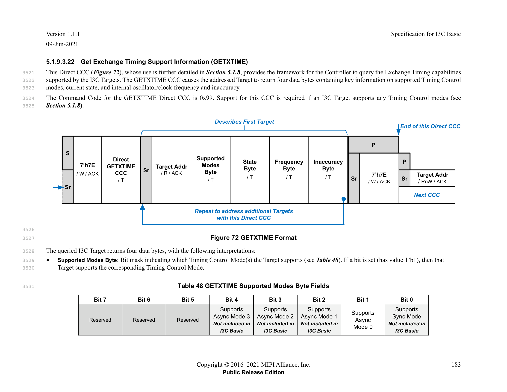

- **`3528`** 

The queried I3C Target returns four data bytes, with the following interpretations: 

- **`3529`** • **Supported Modes Byte:** Bit mask indicating which Timing Control Mode(s) the Target supports (see _**Table 48**_ ). If a bit is set (has value 1’b1), then that **`3530`** Target supports the corresponding Timing Control Mode. 

```
3531
```

**Table 48 GETXTIME Supported Modes Byte Fields** 

|**Bit 7**|**Bit 6**|**Bit 5**|**Bit 4**|**Bit 3**|**Bit 2**|**Bit 1**|**Bit 0**|
|---|---|---|---|---|---|---|---|
|Reserved|||Supports|Supports|Supports|Supports<br>Async<br>Mode 0|Supports|
||Reserved|Reserved|Async Mode 3|Async Mode 2|Async Mode 1||Sync Mode|
||||**_Not included in_**|**_Not included in_**|**_Not included in_**||**_Not included in_**|
||||**_I3C Basic_**|**_I3C Basic_**|**_I3C Basic_**||**_I3C Basic_**|


Copyright © 2016–2021 MIPI Alliance, Inc. 

183 

**Public Release Edition** 

Specification for I3C Basic 

Version 1.1.1 

09-Jun-2021 

- **`3532`** • **State Byte:** Bit mask indicating which Timing Control Mode (if any) is currently enabled for the Target, and whether any counter overflows have **`3533`** occurred since the most recent previous check (see _**Table 49**_ ). If a Timing Control Mode bit is set (has value 1’b1), then that Target has currently enabled **`3534`** the corresponding Timing Control Mode. If the Overflow bit is set (has value 1’b1), then that Target experienced a counter overflow since the most **`3535`** recent previous check. 

```
3536
```

## **Table 49 GETXTIME State Byte Fields** 

|**Bit 7**||||**Timing Control Mode Bits**|**Timing Control Mode Bits**|**Timing Control Mode Bits**||
|---|---|---|---|---|---|---|---|
||**Bit 6**|**Bit 5**||||||
||||**Bit 4**|**Bit 3**|**Bit 2**|**Bit 1**|**Bit 0**|
|||||||||
|**Overflow**|||Async Mode 3|Async Mode 2|Async Mode 1|Async Mode 0<br>Enabled<br>|Sync Mode|
||Reserved|Reserved|Enabled|Enabled|Enabled||Enabled|
||||**_Not included in_**|**_Not included in_**|**_Not included in_**||**_Not included in_**|
||||**_I3C Basic_**|**_I3C Basic_**|**_I3C Basic_**||**_I3C Basic_**|


## **`3537`** 

## _**Note:**_ 

**`3538`** _The Timing Control Modes marked “Not included in I3C Basic” in_ _**Table 49** are defined in the full I3C Specification but not included in I3C Basic. To gain_ **`3539`** _access to these capabilities, please contact MIPI Alliance._ 

**`3540`** _An I3C Target that supports I3C Basic shall not indicate support for any of the Timing Control Modes marked “Not included in I3C Basic” in_ _**Table 49** , and_ **`3541`** _shall not report any of them as Enabled._ 

- **`3542`** • **Frequency Byte:** This byte represents the frequency of the Target’s internal oscillator, in increments of 0.5 MHz (i.e., 500 KHz), up to 127.5 MHz. The **`3543`** value 0 is an exception, and indicates an internal oscillator frequency of approximately 32 KHz. 

```
3544
```

**Example:** A value of 8’d20 represents an oscillator frequency of 10.0 MHz. 

- **`3545`** • **Inaccuracy Byte:** This byte represents the maximum variation of the Target’s internal oscillator in 1/10[th] percent (0.1%) increments, up to 25.5%. 

- **`3546` Example:** A value of 8’d25 represents a maximum frequency variation of 2.5%. 

Copyright © 2016–2021 MIPI Alliance, Inc. 

184 

**Public Release Edition** 

Version 1.1.1 09-Jun-2021 

Specification for I3C Basic 

## **5.1.9.3.23 Set All Addresses to Static Address (SETAASA)** 

> **`3547`** This CCC ( _**Figure 73**_ ) allows the Controller to request that all connected Targets that have I[2] C Static Addresses use their I[2] C Static Address as their Dynamic **`3548`** Address. This is the fastest method to assign I3C Dynamic Addresses to all I3C Targets with I[2] C Static Addresses (see _**Section 5.1.4.2**_ ). 

- **`3549`** _**Note:**_ **See Errata 01, Item 17** 

- **`3550`** _Per_ _**Section 5.1.4.2** , SETAASA is intended as an optimization. An I3C Target that supports SETAASA and does not support ENTDAA cannot be relied on to_ **`3551`** _be assigned a Dynamic Address on a generic I3C Bus, and also will not support Hot-Join (per_ **Section 5.1.5** _). Use of SETAASA requires the I3C Controller_ **`3552`** _to have prior knowledge of the I3C Target, as well as all other I3C Targets that support SETAASA. Dynamic Address Assignment with ENTDAA is_ **`3553`** _recommended for most use cases._ 

**`3554`** The Command Code for the SETAASA Broadcast CCC is 0x29. Support for this CCC is optional; however, any I3C Target that supports this CCC shall have an **`3555`** I[2] C Static Address. 

```
3556
3557
```

**==> picture [276 x 106] intentionally omitted <==**

**----- Start of picture text -----**<br>
End of this Broadcast CCC<br>P<br>S Broadcast<br>7’h7E SETAASA  Target Addr<br>/ W / ACK CCC / RnW / ACK<br>/ T Sr<br>Sr 7’h7E<br>Next CCC<br>/ W / ACK<br>**----- End of picture text -----**<br>


**Figure 73 SETAASA Format** 

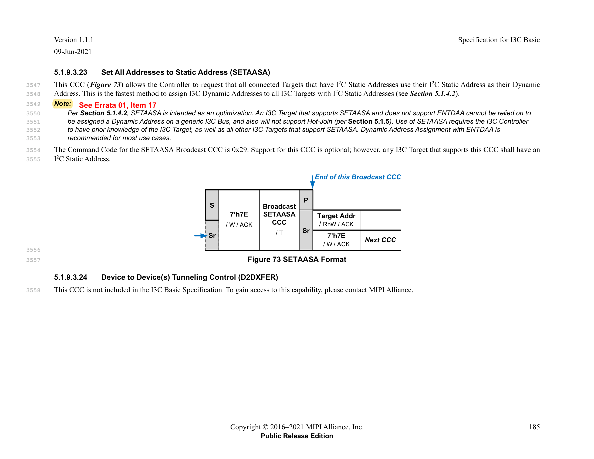

## **5.1.9.3.24 Device to Device(s) Tunneling Control (D2DXFER)** 

> **`3558`** This CCC is not included in the I3C Basic Specification. To gain access to this capability, please contact MIPI Alliance. 

Copyright © 2016–2021 MIPI Alliance, Inc. **Public Release Edition** 

185 

Specification for I3C Basic 

Version 1.1.1 09-Jun-2021 

```
3570
3571
```

## **5.1.9.3.25 Data Transfer Ending Procedure Control (ENDXFER)** 

> **`3559`** As detailed in _**Section 5.2.2.3**_ , the ENDXFER CCC provides the framework for Controllers and Targets to exchange set-up parameters for ending data transfers in **`3560`** supported HDR Modes. The ENDXFER CCC is available as both a Broadcast Command ( _**Figure 74**_ ) and a Direct Command ( _**Figure 75**_ ). **`3561`** _**Note:**_ 

```
3561
```

_Whereas the full I3C Specification includes several ENDXFER sub-commands, I3C Basic only includes the ones that are required to exchange set-up parameters for ending data transfers in HDR-DDR Mode. The additional sub-commands in the full I3C Specification define exchange of set-up parameters for other HDR Modes that are not included in the I3C Basic Specification, and enable other features and capabilities that not included in I3C Basic. To gain access to the other sub-commands and their related features and capabilities, please contact MIPI Alliance._ 

- **`3562`** 

- **`3563`** 

- **`3564`** 

- **`3565`** 

The ENDXFER CCC always includes the one-byte Defining Byte field, which acts as a sub-command identifier defining the specific function of the CCC. For some Sub-Commands (i.e., for some values of the Defining Byte field), additional Data Bytes follow. Interpretation of these additional Data Bytes depends upon the particular Defining Byte value, as detailed in _**Table 51**_ . 

```
3566
```

```
3567
3568
```

```
3569
```

**Table 50 Data Transfer Ending Procedure Control Command Codes (ENDXFER)** 

**==> picture [476 x 179] intentionally omitted <==**

**----- Start of picture text -----**<br>
Command Codes<br>Command  Support  Purpose<br>Broadcast  Direct<br>ENDXFER  Conditional  0x12  0x92  Data Transfer Ending Procedure Control<br>End of this Broadcast CCC<br>P<br>S Broadcast<br>Defining  Data<br>7’h7E ENDXFER  Target Addr<br>Byte  (Optional)<br>/ W / ACK CCC / RnW / ACK<br>/ T / T / T Sr<br>Sr 7’h7E<br>Next CCC<br>/ W / ACK<br>**----- End of picture text -----**<br>


**Figure 74 ENDXFER Format 1: Broadcast** 

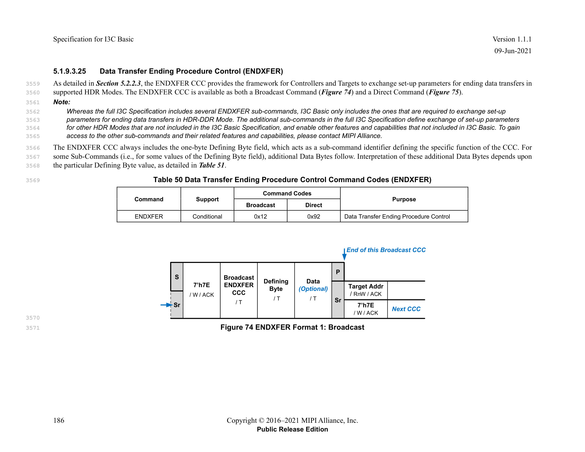

Copyright © 2016–2021 MIPI Alliance, Inc. 

186 

**Public Release Edition** 

Version 1.1.1 09-Jun-2021 

Specification for I3C Basic 

```
3572
3573
```

**==> picture [478 x 156] intentionally omitted <==**

**----- Start of picture text -----**<br>
Describes First Target<br>End of this Direct CCC<br>P<br>S<br>Direct<br>Defining  P<br>/ W / ACK 7’h7E ENDXFER CCC / T Byte / T Sr Target Addr / RnW / ACK Data / T Sr / W / ACK 7’h7E Sr Target Addr / RnW / ACK<br>Sr<br>Next CCC<br>Repeat to address additional<br>Targets with this ENDXFER CCC<br>**----- End of picture text -----**<br>


**Figure 75 ENDXFER Format 2: Direct** 

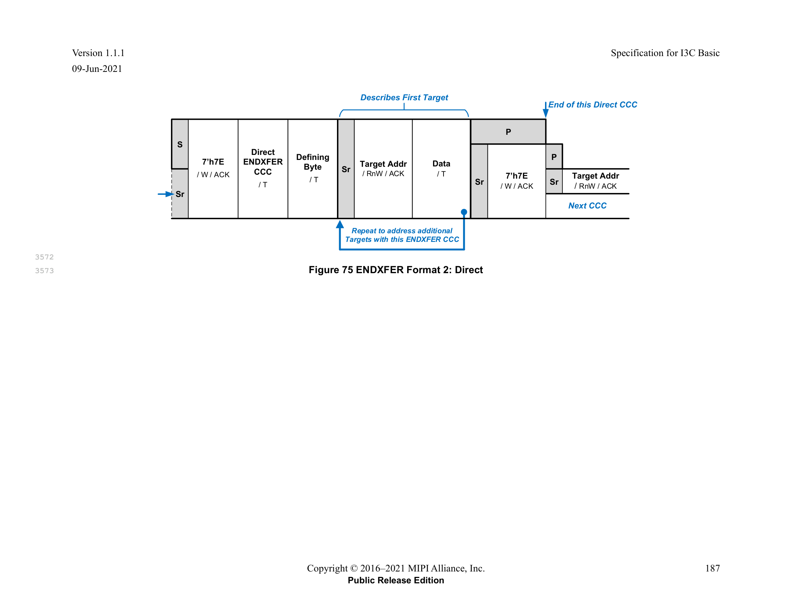

Copyright © 2016–2021 MIPI Alliance, Inc. **Public Release Edition** 

187 

Specification for I3C Basic 

Version 1.1.1 09-Jun-2021 

```
3574
```

## **Table 51 ENDXFER Defining Byte Values** 

|**Defining**<br>**Byte**<br>**Value**|**Sub-Command Function**|**Description**|**Additional**<br>**Data Bytes**|
|---|---|---|---|
|0x7F|Sub-commands for<br>HDR-TSL and HDR-TSP<br>protocols|These capabilities are not included in the I3C Basic<br>Specification. To gain access to them, please contact MIPI<br>Alliance.|One Byte|
|0x55|||One Byte|
|**0xF7**|For HDR-DDR protocol:<br>**SET/GET Data Transfer**<br>**Early Termination**<br>**Parameters**|SET and GET the parameters for the Data Transfer Early<br>Termination procedure, for the HDR-DDR protocol (see<br>**_Section 5.2.2.3.4_**).|One Byte<br>**Bits[7:6]: CRC Word Indicator**<br>**2’b11:**No CRC Word follows Early Termination request<br>**2’b01:**CRC Word follows Early Termination request<br>(Checksum uses CRC-5 algorithm per**_Section 5.2.2.5_**)<br>Other: Reserved for future definition by MIPI Alliance<br>**Bit[5]: Enable WRITE Early Termination Request**<br>**1’b0:**Enable<br>**1’b1:**Disable<br>**Bit[4]: Enable ACK/NACK Capability for WRITE Command**<br>**1’b0:**Enable<br>**1’b1:**Disable<br>**Bits[3:0]:**Reserved for future use|
|**0xAA**|For HDR-DDR protocol:<br>**Confirm Set-up and**<br>**Initiate Data Transfer**<br>using Data Transfer Early<br>Termination Procedure|Commands either all I3C Devices on the Bus, or else only<br>some directly addressed Devices on the Bus, to begin<br>operating using the Data Transfer Early Termination<br>procedure, as previously set up and confirmed using<br>ENDXFER sub-command 0xF7.|One Byte<br>**For WRITE:**The value 0xAA<br>**For READ:**The value of the currently enabled Additional Data byte, as<br>it pertains to ENDXFER sub-command 0xF7.|
|0xFC|Sub-command for<br>Monitoring Device Early<br>Termination Capability|These capabilities are not included in the I3C Basic<br>Specification. To gain access to them, please contact MIPI<br>Alliance.|One Byte|
|All Other<br>Values|Reserved|Defining Byte values reserved and available for future<br>definition<br>(i.e., for new ENDXFER Sub-Commands)|Reserved for future definition|


Copyright © 2016–2021 MIPI Alliance, Inc. 

188 

**Public Release Edition** 

Version 1.1.1 09-Jun-2021 

Specification for I3C Basic 

## **5.1.9.3.26 Target Reset Action (RSTACT) See Errata 01, Item 18** 

> **`3575`** This Broadcast ( _**Figure 76**_ ), Direct Read ( _**Figure 77**_ ), and Direct Write ( _**Figure 78**_ ) CCC is used to configure the next Target Reset action, and may be used to **`3576`** retrieve a Target’s reset recovery timing. The RSTACT CCC is used in conjunction with the Target Reset Pattern ( _**Section 5.1.11.3**_ ), i.e., the reset action previously **`3577`** configured in a Target via the RSTACT CCC is triggered when the immediately following Target Reset Pattern is received. 

```
3578
```

   - The RSTACT CCC uses a Defining Byte ( _**Table 53**_ ). 

- **`3579`** • For the Broadcast and Direct Write formats, the Defining Byte indicates which Target Reset action (including to take no action) is to be configured **`3580`** (values 0x00 through 0x7F). 

- **`3581`** • Defining Bytes 0x00 and 0x01 are required: A Target shall support these operations, and shall ACK its Target Address if issued as a Direct CCC. 

- **`3582`** • Support for other Defining Bytes (values 0x02 through 0x7F) is optional, and depends on other conditions or support for other capabilities. If a **`3583`** Target does not support such an operation, then it shall NACK its Target Address for such a Defining Byte, as well as any related Defining Bytes **`3584`** defined for the Direct Read format (values 0x82 through 0xFF) if issued as a Direct CCC. 

- **`3585`** • For the Direct Read format, the Defining Byte may also indicate the Controller’s desire to read back the Target’s reset recovering timing or other **`3586`** parameters for the operation (values 0x81 through 0xFF). 

- **`3587`** • If the CCC is NACKed and the related reset operation is supported, then the Controller should assume the default reset return times of 1 ms to reset **`3588`** the Peripheral (i.e., the reset operation for Defining Byte 0x01) and 1 second to reset the whole Target Device (i.e., the reset operation for Defining **`3589`** Byte 0x02). 

```
3590
```

## **Table 52 Target Reset Action Command Codes (RSTACT)** 

**==> picture [476 x 185] intentionally omitted <==**

**----- Start of picture text -----**<br>
Command Codes<br>Command  Support  Purpose<br>Broadcast  Direct<br>RSTACT  Required  0x2A  0x9A  Target Reset Action<br>End of this Broadcast CCC<br>P<br>S<br>Broadcast<br>Defining<br>7’h7E RSTACT  Target Addr<br>/ W / ACK CCC Byte / RnW / ACK<br>/ T / T Sr<br>Sr 7’h7E<br>Next CCC<br>/ W / ACK<br>**----- End of picture text -----**<br>


**Figure 76 RSTACT Format 1: Broadcast** 

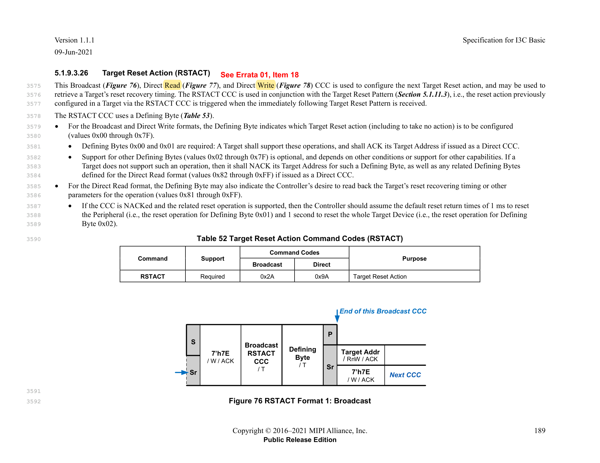

```
3591
3592
```

Copyright © 2016–2021 MIPI Alliance, Inc. 

189 

**Public Release Edition** 

Specification for I3C Basic 

Version 1.1.1 09-Jun-2021 

```
3593
3594
```

## _**Describes First Target**_ 

**==> picture [523 x 382] intentionally omitted <==**

**----- Start of picture text -----**<br>
Describes First Target<br>End of this Direct CCC<br>P<br>S<br>Direct  P<br>Defining<br>7’h7E RSTACT  Target Addr<br>/ W / ACK CCC / T Byte  / T Sr / RnW / ACK Sr / W / ACK 7’h7E Sr Target Addr / RnW / ACK<br>Sr<br>Next CCC<br>Repeat for<br>additional<br>Targets<br>Figure 77 RSTACT Format 2: Direct Write<br>Describes First Target End of this Direct CCC<br>P<br>S<br>Direct  P<br>Defining  Returned<br>7’h7E RSTACT  Target Addr<br>/ W / ACK CCC / T Byte / T Sr / RnW / ACK Data / T Sr / W / ACK 7’h7E Sr Target Addr / RnW / ACK<br>Sr<br>Next CCC<br>Repeat for additional Targets<br>**----- End of picture text -----**<br>


```
3595
```

```
3596
```

**Figure 78 RSTACT Format 3: Direct Read** 

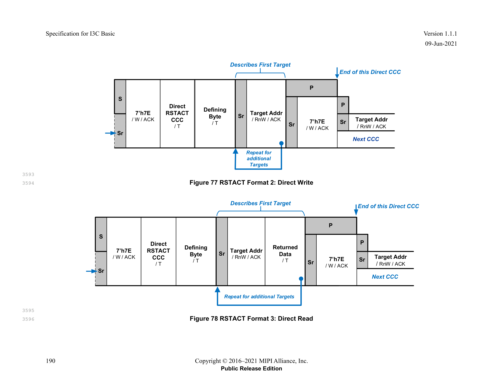

Copyright © 2016–2021 MIPI Alliance, Inc. **Public Release Edition** 

190 

Version 1.1.1 09-Jun-2021 

Specification for I3C Basic 

```
3597
```

## **Table 53 RSTACT Defining Byte Values** 

||**Table 53 RSTACT Defining Byte Values**||||
|---|---|---|---|---|
|**Defining**<br>**Byte Value**|**Description**|**NACK**<br>**Means**<br>**Default Of**|**Notes**|**SET / GET**|
|0x00|**No Reset on Target Reset Pattern**|–|**SET:**No data (Defining<br>Byte is the value)<br>**GET:**Returns currently<br>set Defining Byte value<br>(i.e., previously<br>received in Direct SET)<br>or 0x00<br>**See Errata 01,**<br>**Item 19**|SET / GET|
|0x01|**Reset the I3C Peripheral Only**(Default)|–||SET / GET|
|0x02|**Reset the Whole Target**|Not<br>supported||SET / GET|
|0x03|**Debug Network Adaptor Reset**<br>(The Target shall not reset the I3C Peripheral)|Debug for<br>I3C not<br>supported||SET / GET|
|0x04<br>(Direct CCC<br>only)|**Virtual Target Detect**<br>• **SET:**The Target shall not prepare for reset, but shall set a flag in its shared<br>Peripheral logic that can be read by all other linked Virtual Targets. This flag can<br>be cleared with Defining Byte 0x00 (Direct or Broadcast)<br>• **GET:**The Target shall return 0x01 if the flag is set, i.e., if a previous SET<br>operation was directed to any linked Virtual Target in this Device (including itself),<br>without an intervening use of Defining Byte 0x00. The Target shall return 0x00 if<br>no SET was received, or if the flag was cleared by the RSTACT CCC with<br>Defining Byte 0x00 (No Reset on the Target Reset Pattern)|Device is<br>not Virtual<br>Target<br>capable||SET / GET|
|0x05 – 0x3F|Reserved by MIPI|–||–|
|0x40 – 0x7F|Reserved for Vendors and external standards|–||–|
|0x80|Reserved by MIPI|–|**SET:**Ignored (not<br>used)<br>**GET:**Returns the time,<br>based upon the<br>Defining Byte|–|
|0x81|**Return Time to Reset Peripheral**|1 ms||GET|
|0x82|**Return Time to Reset Whole Target**|1 s||GET|
|0x83|**Return Time for Debug Network Adaptor Reset**|100 ms||GET|
|0x84|**Return Virtual Target Indication**<br>Return 0x01 if this Target is a Virtual Target and supports Defining Byte 0x04 (Virtual<br>Target Detect). Otherwise return 0x00.|Target is<br>not Virtual||GET|
|0x85 – 0xBF|Reserved for timing for MIPI reserved values|–||GET|
|0xC0 – 0xFF|Reserved for timing for Vendor and external standards reserved values|–||GET|


Copyright © 2016–2021 MIPI Alliance, Inc. **Public Release Edition** 

191 

Specification for I3C Basic 

Version 1.1.1 09-Jun-2021 

## **`3598`** 

```
3599
```

## _**Note:**_ 

   _1. The Target shall clear its reset action (as configured via the RSTACT CCC) upon receipt of the next START (but not Repeated START)._ 

- **`3600`** _2. The Defining Byte value for a Debug Network Adaptor Reset operation (Defining Byte 0x03) is intended for Target Devices that support the MIPI Debug_ **`3601`** _for I3C specification_ _**[MIPI04]** . Support for this reset operation is strongly recommended for any Debug-capable I3C Device that supports MIPI Debug for_ **`3602`** _I3C as a Debug-capable Target System (TS). A Target Device that does not support this reset operation shall NACK its Target Address for this Defining Byte_ **`3603`** _(if issued as a Direct CCC) or ignore the RSTACT CCC (if issued as a Broadcast CCC)._ 

- **`3604`** _The Debug Network Adaptor Reset operation (Defining Byte 0x03) does not reset the I3C Peripheral or its Target Address; it only resets the Device’s_ **`3605`** _Debug for I3C Network Adaptors and all attached Debug Function logic. If issued as a Broadcast CCC, then it shall only affect Targets that support a_ **`3606`** _Debug Network Adaptor reset operation._ 

- **`3607`** _3. The Defining Byte value for a Virtual Target Detect operation (Defining Byte 0x04) is intended for composite Devices that support multiple Virtual Targets_ **`3608`** _that share the same Peripheral logic (see_ _**Section 5.1.2.1.2** ). Support for this Defining Byte is required for any such Device that reports Virtual Target_ **`3609`** _capabilities (i.e., BCR bit[4] is set to 1’b1, and GETCAPS CCC with Defining Byte VTCAPS indicates multiple Virtual Targets using shared Peripheral logic)._ **`3610`** _A Device that does not support this operation shall NACK its Target Address for this Defining Byte (if issued as a Direct CCC)._ 

**`3611`** _• This operation does not configure a Target or its shared Peripheral logic for any defined Target Reset action. It is only used for identification and_ **`3612`** _association of any linked Virtual Targets._ **`3613`** 

   - _This Defining Byte is only supported with Direct CCCs, not Broadcast CCCs._ 

- **`3614`** _• The flag that resides in the shared Peripheral logic and which is set by Defining Byte 0x04 shall not be accessible or writeable from any_ **`3615`** _application-specific logic connected to any Virtual Target. The state of this flag may only be accessed by a Controller, via this CCC (RSTACT) with this_ **`3616`** _Defining Byte (0x04); or cleared by using this CCC (RSTACT) with Defining Byte 0x00._ **`3617`** _• Additionally, if a shared Peripheral is implemented in a manner that passes incoming RSTACT CCC events as messages up to application-specific_ **`3618`** _queues or buffers for any Virtual Targets, then the shared Peripheral shall not pass any RSTACT CCC events as messages if they contain Defining Byte_ **`3619`** _0x04 or 0x84, as these messages might notify a Virtual Target that the flag is being set or accessed by a Controller._ 

**`3620`** _4. The Reset the Whole Target operation (Defining Byte 0x02) is optional, but support for this reset operation is recommended. A Target Device that does_ **`3621`** _not support this reset operation shall NACK its Target Address for this Defining Byte (if issued as a Direct CCC) or ignore the RSTACT CCC (if issued as a_ **`3622`** _Broadcast CCC)._ 

Copyright © 2016–2021 MIPI Alliance, Inc. 

192 

**Public Release Edition** 

Version 1.1.1 09-Jun-2021 

Specification for I3C Basic 

## **5.1.9.3.27 Set Group Address (SETGRPA)** 

> **`3623`** This Direct CCC ( _**Figure 79**_ ) allows the Active Controller to assign a Group Address to an I3C Target supporting the Group Address feature. The Target will then **`3624`** respond to both the configured Group Address and its Dynamic Address. If multiple I3C Targets are configured with the same Group Address, then a single Message **`3625`** sent by the Active Controller to that Group Address will be received by all of those I3C Targets simultaneously. 

- **`3626`** 

## _**Note:**_ 

- **`3627`** _In this CCC, an I3C Target to be assigned a Group Address is indicated by its Dynamic Address. As a result, this CCC cannot be used until the Target has_ **`3628`** _been assigned a Dynamic Address._ 

**`3629`** If the Target supports multiple Group Addresses, then the same Dynamic Address can be used in multiple SETGRPA CCCs (up to the maximum number of Group **`3630`** Addresses supported by the I3C Device), supplying a different Group Address in each instance. The Target will then respond to any of the configured Group **`3631`** Addresses, in addition to its Dynamic Address. 

**`3632`** When a Target is assigned to the maximum number of groups that it is capable of supporting, the Target shall inform the Controller that this maximum capability **`3633`** has been reached by NACKing the Target Address for this Direct CCC. 

- **`3634`** The Group Address to be assigned is transmitted in the Group Address byte shown in _**Figure 79**_ , where the 7 most significant bits (Bits[7:1]) contain the 7-bit **`3635`** Group Address, and the least significant bit (Bit[0]) is filled with the value 1’b0. 

- **`3636`** 

The Command Code for the SETGRPA Direct CCC is 0x9B. Support for this CCC is required if the I3C Target supports Group Addressing (per _**Section 5.1.4.4**_ ). 

**==> picture [470 x 169] intentionally omitted <==**

**----- Start of picture text -----**<br>
Describes First Target<br>End of this Direct CCC<br>P<br>S<br>Direct  7-bit Group<br>P<br>7’h7E SETGRPA  Target Addr Address<br>/ W / ACK CCC Sr / W / ACK / 1'b0 7’h7E Target Addr<br>/ T / T Sr / W / ACK Sr / RnW / ACK<br>Sr<br>Next CCC<br>Repeat to address additional<br>Targets with this Direct CCC<br>**----- End of picture text -----**<br>


```
3637
3638
```

## **Figure 79 SETGRPA Format** 

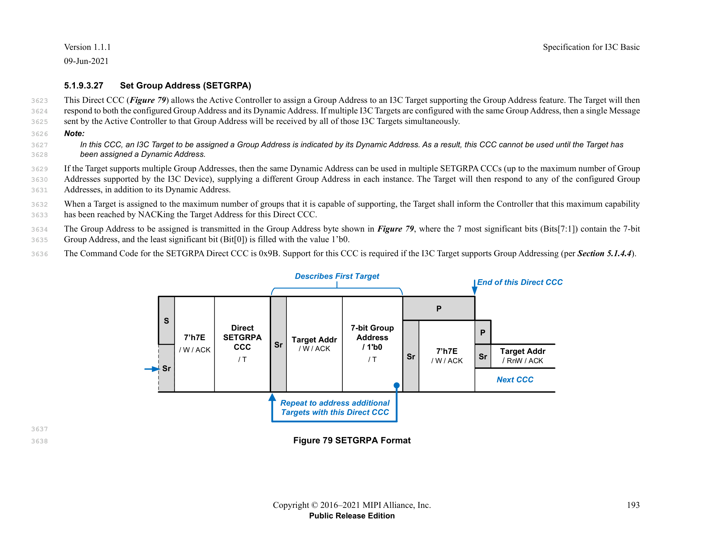

Copyright © 2016–2021 MIPI Alliance, Inc. **Public Release Edition** 

193 

Specification for I3C Basic 

Version 1.1.1 09-Jun-2021 

## **5.1.9.3.28 Reset Group Address (RSTGRPA)** 

```
3639
```

   - This CCC is available in Direct and Broadcast versions: 

- **`3640`** • **Direct** ( _**Figure 80**_ ) **:** This CCC allows the Active Controller to remove one or more I3C Target Devices from a Group by resetting their assigned Group **`3641`** Address. If a Group Address is used instead of a Target Address ( _**Figure 81**_ ), then this CCC also allows the Active Controller to disband the indicated **`3642`** Group (i.e., the assigned Group Address is reset for all Devices in the Group, with the result that no Devices remain in the Group). 

- **`3643`** • **Broadcast** ( _**Figure 82**_ ) **:** This CCC allows the Active Controller to disband all Groups, by resetting the assigned Group Address for all Devices with the **`3644`** result that no Devices remain in any Group. 

```
3645
```

**Table 54 Reset Group Address Command Codes (RSTGRPA)** 

|**Command**|**Support**|**CCC Codes**|**CCC Codes**|**Purpose**|
|---|---|---|---|---|
|||**Broadcast**|**Direct**||
|**RSTGRPA**|Conditional|0x2C|0x9C|Reset Group Address|


**==> picture [402 x 176] intentionally omitted <==**

**----- Start of picture text -----**<br>
Describes First Target<br>End of this Direct CCC<br>P<br>S<br>Direct<br>P<br>7’h7E RSTGRPA   Target Addr<br>/ W / ACK CCC Sr / W / ACK 7’h7E Target Addr<br>/ T Sr / W / ACK Sr / RnW / ACK<br>Sr<br>Next CCC<br>Repeat to address additional<br>Targets with this Direct CCC<br>**----- End of picture text -----**<br>


## **Figure 80 RSTGRPA Format 1: Direct** 

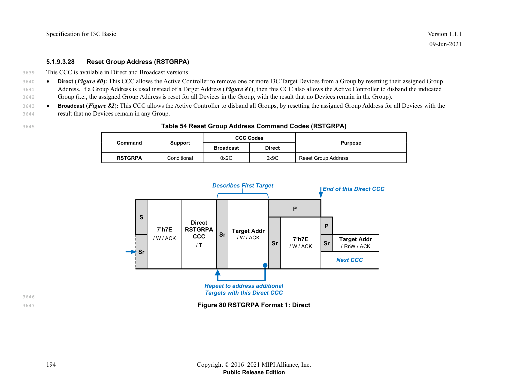

```
3646
3647
```

Copyright © 2016–2021 MIPI Alliance, Inc. **Public Release Edition** 

194 

Version 1.1.1 09-Jun-2021 

Specification for I3C Basic 

```
3648
3649
```

```
3650
3651
```

**==> picture [402 x 179] intentionally omitted <==**

**----- Start of picture text -----**<br>
Describes First Group<br>End of this Direct CCC<br>P<br>S<br>Direct<br>P<br>7’h7E RSTGRPA   Group Addr<br>/ W / ACK CCC Sr / W / ACK 7’h7E Target Addr<br>/ T Sr / W / ACK Sr / RnW / ACK<br>Sr<br>Next CCC<br>Repeat to address additional<br>Groups/Targets with this Direct CCC<br>**----- End of picture text -----**<br>


**Figure 81 Resetting a Group Address with the RSTGRPA Direct CCC** 

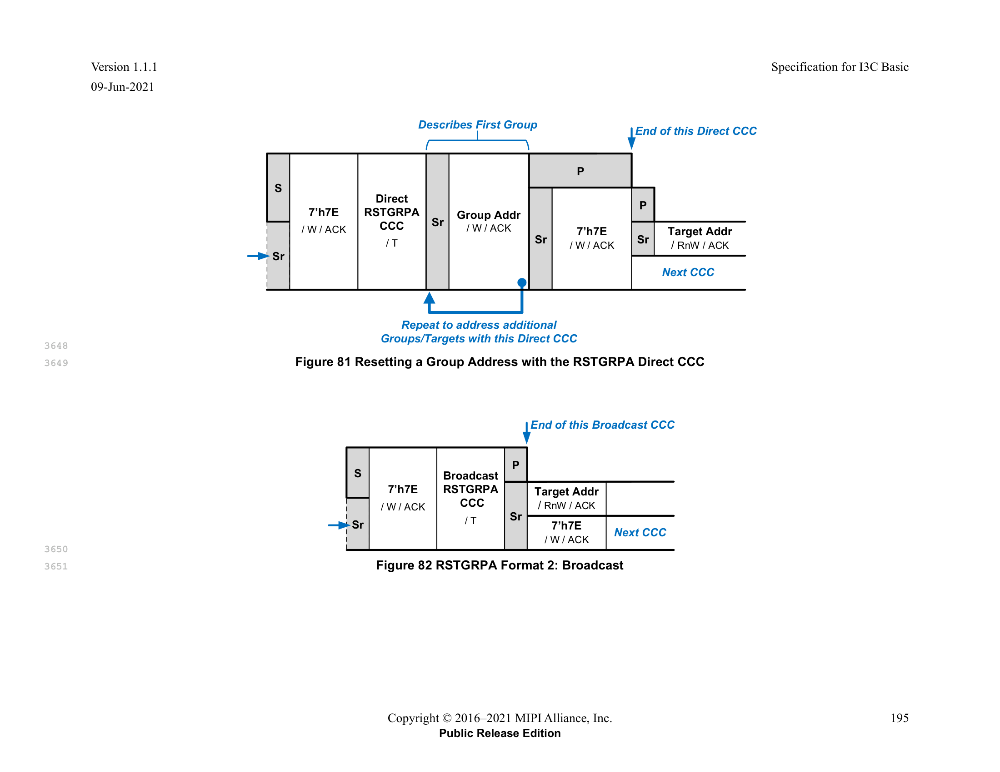

**==> picture [274 x 108] intentionally omitted <==**

**----- Start of picture text -----**<br>
End of this Broadcast CCC<br>P<br>S Broadcast<br>7’h7E RSTGRPA Target Addr<br>/ W / ACK  CCC / RnW / ACK<br>Sr / T Sr 7’h7E<br>Next CCC<br>/ W / ACK<br>**----- End of picture text -----**<br>


**Figure 82 RSTGRPA Format 2: Broadcast** 


Copyright © 2016–2021 MIPI Alliance, Inc. 

195 

**Public Release Edition** 

Specification for I3C Basic 

Version 1.1.1 09-Jun-2021 

## **5.1.9.3.29 Define List of Group Addresses (DEFGRPA)** 

> **`3652`** This Broadcast CCC ( _**Figure 83**_ ) is only relevant to Secondary Controllers (as with the DEFTGTS CCC; see _**Section 5.1.9.3.7**_ ). The DEFGRPA CCC tells the **`3653`** Secondary Controller more details about a particular Group, including the list of I3C Targets that are members of the Group. If multiple Groups have been **`3654`** configured, then the Active Controller should issue one DEFGRPA CCC for each configured Group. Each use of the DEFGRPA CCC shall include the Group **`3655`** Address that uniquely identifies the Group, as well as the Dynamic Addresses of its I3C Targets. 

**`3656`** The Command Code for the DEFGRPA Broadcast CCC is 0x2B. Support for this CCC is required if an I3C Secondary Controller supports Group Addressing (per **`3657`** _**Section 5.1.4.4**_ ), as well as handoff and/or management of Group Addresses, as part of Controller Role Handoff. 

```
3658
3659
```

||**Dynamic**<br>**Addr**<br>**(Target)**<br>**/ 1'b0**<br> / T<br>**Count**<br> / T<br>**Dynamic**<br>**Addr**<br>**(Target)**<br>**/ 1'b0**<br> / T<br>**S**<br>**Sr**<br>**Broadcast**<br>**DEFGRPA**<br>**CCC**<br>/ T<br>**Group**<br>**Addr**<br>**/ 1'b0**<br> / T<br>**Group**<br>**Descriptor**<br> / T<br>**_One Dynamic Addr for each_**<br>**_Target in this Group_**<br>**7’h7E**<br>/ W / ACK|**Dynamic**<br>**Addr**<br>**(Target)**<br>**/ 1'b0**<br> / T<br>**Count**<br> / T<br>**Dynamic**<br>**Addr**<br>**(Target)**<br>**/ 1'b0**<br> / T<br>**S**<br>**Sr**<br>**Broadcast**<br>**DEFGRPA**<br>**CCC**<br>/ T<br>**Group**<br>**Addr**<br>**/ 1'b0**<br> / T<br>**Group**<br>**Descriptor**<br> / T<br>**_One Dynamic Addr for each_**<br>**_Target in this Group_**<br>**7’h7E**<br>/ W / ACK|**Dynamic**<br>**Addr**<br>**(Target)**<br>**/ 1'b0**<br> / T<br>**Count**<br> / T<br>**Dynamic**<br>**Addr**<br>**(Target)**<br>**/ 1'b0**<br> / T<br>**S**<br>**Sr**<br>**Broadcast**<br>**DEFGRPA**<br>**CCC**<br>/ T<br>**Group**<br>**Addr**<br>**/ 1'b0**<br> / T<br>**Group**<br>**Descriptor**<br> / T<br>**_One Dynamic Addr for each_**<br>**_Target in this Group_**<br>**7’h7E**<br>/ W / ACK|**Dynamic**<br>**Addr**<br>**(Target)**<br>**/ 1'b0**<br> / T<br>**Count**<br> / T<br>**Dynamic**<br>**Addr**<br>**(Target)**<br>**/ 1'b0**<br> / T<br>**S**<br>**Sr**<br>**Broadcast**<br>**DEFGRPA**<br>**CCC**<br>/ T<br>**Group**<br>**Addr**<br>**/ 1'b0**<br> / T<br>**Group**<br>**Descriptor**<br> / T<br>**_One Dynamic Addr for each_**<br>**_Target in this Group_**<br>**7’h7E**<br>/ W / ACK|**Dynamic**<br>**Addr**<br>**(Target)**<br>**/ 1'b0**<br> / T<br>**Count**<br> / T<br>**Dynamic**<br>**Addr**<br>**(Target)**<br>**/ 1'b0**<br> / T<br>**S**<br>**Sr**<br>**Broadcast**<br>**DEFGRPA**<br>**CCC**<br>/ T<br>**Group**<br>**Addr**<br>**/ 1'b0**<br> / T<br>**Group**<br>**Descriptor**<br> / T<br>**_One Dynamic Addr for each_**<br>**_Target in this Group_**<br>**7’h7E**<br>/ W / ACK|**Dynamic**<br>**Addr**<br>**(Target)**<br>**/ 1'b0**<br> / T<br>**Count**<br> / T<br>**Dynamic**<br>**Addr**<br>**(Target)**<br>**/ 1'b0**<br> / T<br>**S**<br>**Sr**<br>**Broadcast**<br>**DEFGRPA**<br>**CCC**<br>/ T<br>**Group**<br>**Addr**<br>**/ 1'b0**<br> / T<br>**Group**<br>**Descriptor**<br> / T<br>**_One Dynamic Addr for each_**<br>**_Target in this Group_**<br>**7’h7E**<br>/ W / ACK|**Dynamic**<br>**Addr**<br>**(Target)**<br>**/ 1'b0**<br> / T<br>**Count**<br> / T<br>**Dynamic**<br>**Addr**<br>**(Target)**<br>**/ 1'b0**<br> / T<br>**S**<br>**Sr**<br>**Broadcast**<br>**DEFGRPA**<br>**CCC**<br>/ T<br>**Group**<br>**Addr**<br>**/ 1'b0**<br> / T<br>**Group**<br>**Descriptor**<br> / T<br>**_One Dynamic Addr for each_**<br>**_Target in this Group_**<br>**7’h7E**<br>/ W / ACK|**Dynamic**<br>**Addr**<br>**(Target)**<br>**/ 1'b0**<br> / T<br>**Count**<br> / T<br>**Dynamic**<br>**Addr**<br>**(Target)**<br>**/ 1'b0**<br> / T<br>**S**<br>**Sr**<br>**Broadcast**<br>**DEFGRPA**<br>**CCC**<br>/ T<br>**Group**<br>**Addr**<br>**/ 1'b0**<br> / T<br>**Group**<br>**Descriptor**<br> / T<br>**_One Dynamic Addr for each_**<br>**_Target in this Group_**<br>**7’h7E**<br>/ W / ACK|**Dynamic**<br>**Addr**<br>**(Target)**<br>**/ 1'b0**<br> / T<br>**Count**<br> / T<br>**Dynamic**<br>**Addr**<br>**(Target)**<br>**/ 1'b0**<br> / T<br>**S**<br>**Sr**<br>**Broadcast**<br>**DEFGRPA**<br>**CCC**<br>/ T<br>**Group**<br>**Addr**<br>**/ 1'b0**<br> / T<br>**Group**<br>**Descriptor**<br> / T<br>**_One Dynamic Addr for each_**<br>**_Target in this Group_**<br>**7’h7E**<br>/ W / ACK|**Dynamic**<br>**Addr**<br>**(Target)**<br>**/ 1'b0**<br> / T<br>**Count**<br> / T<br>**Dynamic**<br>**Addr**<br>**(Target)**<br>**/ 1'b0**<br> / T<br>**S**<br>**Sr**<br>**Broadcast**<br>**DEFGRPA**<br>**CCC**<br>/ T<br>**Group**<br>**Addr**<br>**/ 1'b0**<br> / T<br>**Group**<br>**Descriptor**<br> / T<br>**_One Dynamic Addr for each_**<br>**_Target in this Group_**<br>**7’h7E**<br>/ W / ACK|**Dynamic**<br>**Addr**<br>**(Target)**<br>**/ 1'b0**<br> / T<br>**Count**<br> / T<br>**Dynamic**<br>**Addr**<br>**(Target)**<br>**/ 1'b0**<br> / T<br>**S**<br>**Sr**<br>**Broadcast**<br>**DEFGRPA**<br>**CCC**<br>/ T<br>**Group**<br>**Addr**<br>**/ 1'b0**<br> / T<br>**Group**<br>**Descriptor**<br> / T<br>**_One Dynamic Addr for each_**<br>**_Target in this Group_**<br>**7’h7E**<br>/ W / ACK||||
|---|---|---|---|---|---|---|---|---|---|---|---|---|---|---|
||||||||||||||**_End of this Broadcast CCC_**||
||||||||||||||||
||||||||||||||**7’h7E**<br>/ W / ACK<br>**Target Addr**<br>/RnW / ACK<br>**_Next CCC_**||
||||||||||||||||
||**S**|**7’h7E**<br>/ W / ACK|**Broadcast**<br>**DEFGRPA**<br>**CCC**<br>/ T|**Group**<br>**Addr**<br>**/ 1'b0**<br> / T|**Group**<br>**Descriptor**<br> / T|**Count**<br> / T|**Dynamic**<br>**Addr**<br>**(Target)**<br>**/ 1'b0**<br> / T||||**Dynamic**<br>**Addr**<br>**(Target)**<br>**/ 1'b0**<br> / T|**P**|||
|||||||||||||**Sr**|**Target Addr**<br>/RnW / ACK||
||**Sr**||||||||||||||
||||||||||||||**7’h7E**<br>/ W / ACK|**_Next CCC_**|


## **Figure 83 DEFGRPA Format** 

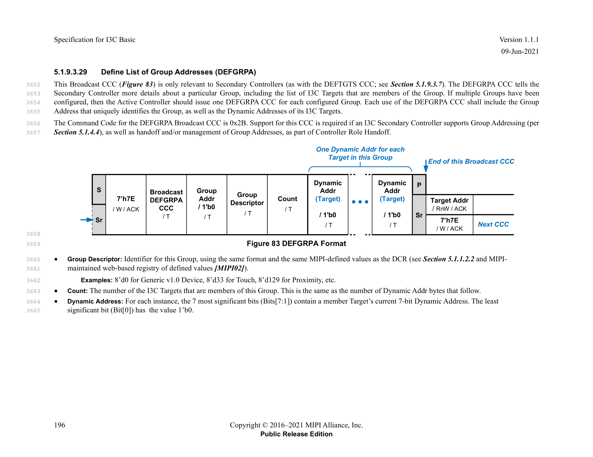

- **`3660`** • **Group Descriptor:** Identifier for this Group, using the same format and the same MIPI-defined values as the DCR (see _**Section 5.1.1.2.2**_ and MIPI- **`3661`** maintained web-based registry of defined values _**[MIPI02]**_ ). 

- **`3662` Examples:** 8’d0 for Generic v1.0 Device, 8’d33 for Touch, 8’d129 for Proximity, etc. 

- **`3663`** • **Count:** The number of the I3C Targets that are members of this Group. This is the same as the number of Dynamic Addr bytes that follow. 

- **`3664`** • **Dynamic Address:** For each instance, the 7 most significant bits (Bits[7:1]) contain a member Target’s current 7-bit Dynamic Address. The least **`3665`** significant bit (Bit[0]) has the value 1’b0. 

Copyright © 2016–2021 MIPI Alliance, Inc. **Public Release Edition** 

196 

Version 1.1.1 09-Jun-2021 

Specification for I3C Basic 

## **5.1.9.3.30 Multi-Lane Data Transfer Control (MLANE)** 

> **`3666`** The MLANE CCC is available in Broadcast ( _**Figure 84**_ ) and Direct ( _**Figure 85**_ ) versions. It is used to set up and control ML functionality for ML-capable Target **`3667`** Devices (see _**Section 5.3.1**_ ) by setting or getting, for a given I3C Mode ( _**Table 56**_ ), the number of Additional Data Lanes ( _**Table 78**_ ) and Data Transfer Coding **`3668`** number (see _**Section 5.3.2**_ ) to use while communicating to the Target using that I3C Mode. 

- **`3669`** This CCC always includes the one-byte Defining Byte field, which acts as a GET, SET, or SET/GET sub-command. Many of the defined sub-commands that have **`3670`** Broadcast CCC or Direct SET CCC versions also require one or more additional Data Bytes, as detailed in _**Table 56**_ . 

- **`3671`** 

## _**Note:**_ 

- **`3672`** _**For SDR Mode Only:** The GET version of the SET/GET MLANE CCC requires the addressed Target to provide the DATA/T values on the Additional Data_ **`3673`** _Lanes (i.e., on SDA[1] for DUAL Lane configurations, and on SDA[1], SDA[2], and SDA[3] for QUAD Lane configurations). The Controller can use this to_ **`3674`** _test whether the Target is connected to the Additional Data Lanes. Since I3C Basic only supports Multi-Lane transfers for HDR-BT Mode, this shall apply for_ **`3675`** _Defining Byte 0x23 only._ _**Figure 86** shows the CCC GET format for QUAD Lane configurations; the version for DUAL Lane configurations does not use_ **`3676`** _SDA[2] or SDA[3]._ 

**`3677`** _**For HDR Modes:** See MLANE Command Name in_ _**Table 61** for details on the format of the Target’s response to the Format 2 (Direct GET) MLANE CCC_ **`3678`** _while in HDR Modes._ 

```
3679
```

**Table 55 Multi-Lane Data Transfer Control Command Codes (MLANE)** 

|**Command**|**Support**|**Support**|**Command Codes**|**Command Codes**|**Command Codes**|**Command Codes**|**Purpose**|**Purpose**|**Purpose**|
|---|---|---|---|---|---|---|---|---|---|
||||**Broadcast**||**Direct**|||||
|**MLANE**|Conditional||0x2D||0x9D||Multi-Lane Data Transfer Control|||
|**SDA[0]**||||||||**7’h7E**<br>/ W / ACK<br>**Target Addr**<br>/RnW / ACK<br>**_Next CCC_**<br>**_End of this Broadcast CCC_**||
||**S**|**7’h7E**<br>/ W / ACK|**Broadcast**<br>**MLANE**<br>**CCC**<br>/ T|**Defining**<br>**Byte**<br> / T||**Data**<br>**_(Optional)_**<br>/ T|**P**|||
||||||||**Sr**|**Target Addr**<br>/RnW / ACK||
||**Sr**|||||||||
|||||||||**7’h7E**<br>/ W / ACK|**_Next CCC_**|


**Figure 84 MLANE Format 1: Broadcast** 

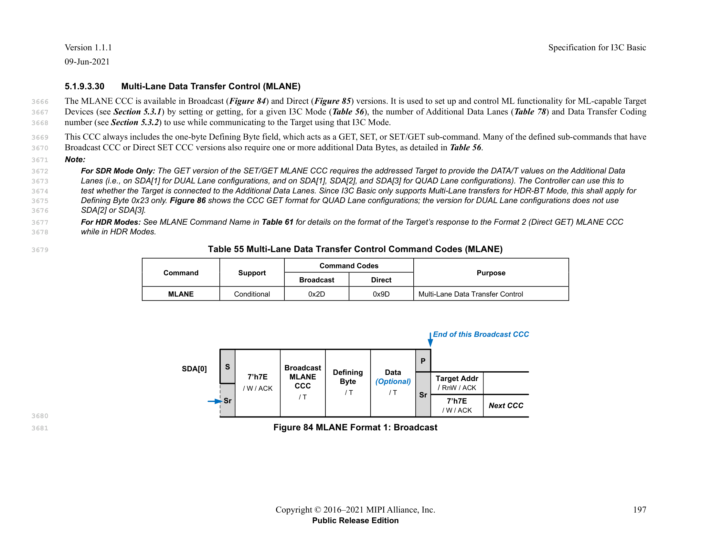

```
3680
3681
```

Copyright © 2016–2021 MIPI Alliance, Inc. **Public Release Edition** 

197 

Specification for I3C Basic 

Version 1.1.1 09-Jun-2021 

```
3682
3683
```

**==> picture [482 x 421] intentionally omitted <==**

**----- Start of picture text -----**<br>
Describes First Target<br>End of this Direct CCC<br>P<br>S<br>Direct<br>SDA[0] / W / ACK 7’h7E MLANE CCC / T Defining Byte / T Sr Target Addr / RnW / ACK Data / T Sr / W / ACK 7’h7E SrP Target Addr / RnW / ACK<br>Sr<br>Next CCC<br>Repeat to address additional<br>Targets with this MLANE CCC<br>Figure 85 MLANE Format 2: Direct<br>Describes First Target –  Data / T  provided on Additional Data Lanes<br>SDA[3] High-Z Data  / T High-Z<br>SDA[2] High-Z Data  / T High-Z<br>SDA[1] High-Z Data  / T High-Z<br>End of this Direct CCC<br>P<br>S<br>Direct<br>SDA[0] / W / ACK 7’h7E MLANE CCC / T Defining Byte / T Sr Target Addr/ R / ACK Data / T Sr / W / ACK 7’h7E SrP Target Addr / RnW / ACK<br>Sr<br>Next CCC<br>Repeat to address additional<br>Targets and test connectivity<br>with this MLANE CCC<br>**----- End of picture text -----**<br>


**Figure 86 MLANE Direct GET Version of SET/GET CCC (SDR Mode Only)** 

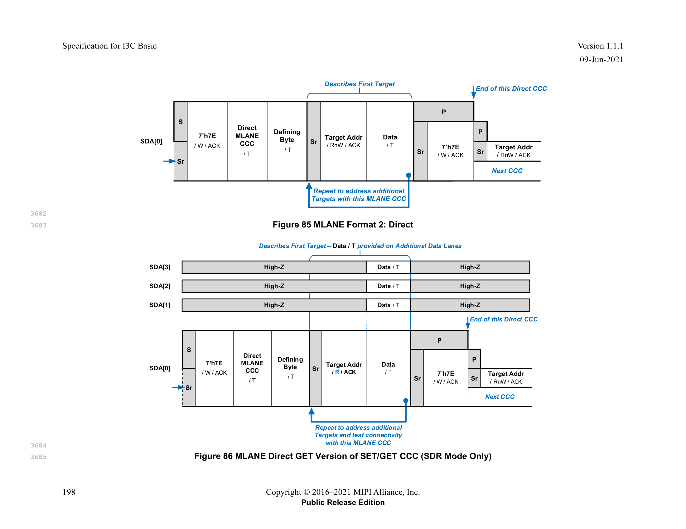

```
3684
3685
```

Copyright © 2016–2021 MIPI Alliance, Inc. **Public Release Edition** 

198 

Version 1.1.1 

Specification for I3C Basic 

09-Jun-2021 

```
3686
```

## **Table 56 MLANE Defining Bytes and Data Bytes** 

|**Defining**<br>**Byte Value**|**Sub-Command**<br>**Function**|**Description**|**Additional Data Bytes**|
|---|---|---|---|
|0xFF|**Get ML**<br>**Capabilities**<br>Direct Read<br>Get only|The directly addressed I3C Target responds with a 2-byte description of supported ML Frame<br>formats, in every I3C Mode for which ML is supported:<br>**Example:**For a Target capable of ML on HDR-BT (Sub-Command 0x23), with all supported<br>codings (i.e., Coding 0 and Coding 3) on Dual Lanes, two byte pairs are needed. The first byte of<br>both pairs is the HDR-BT value (0x23). The second byte of the first pair is {5’d0, 3’d1} or 0x01, and<br>the second byte of the second pair is {5’d3, 3’d1} or 0x19.<br>The addressed Target therefore transfers the four bytes: 0x23, 0x01, 0x23, 0x19|One byte pair per every I3C Mode for which the Target supports<br>ML functionality.<br>Within each byte pair:<br>**First Byte:**Identifier for the I3C Mode supported<br>(same values used in the Sub-Command<br>Function column at left):<br>**0x23: HDR-BT**<br>**_Note:_**_Multi-Lane in other I3C Modes is not supported in_<br>_I3C Basic_<br>**Second Byte:**3-bit number of Additional Data Lanes<br>and 5-bit Data Transfer Coding number,<br>formatted as described below|
|0x7F|**Reset ML**<br>Broadcast or<br>Direct Set|**Broadcast SET:**All I3C Targets return to Basic 2-wire I3C mode and a default Data Transfer<br>Coding, for all supported ML Frame formats.<br>**Direct SET:**The directly addressed Target returns to Basic 2-wire I3C mode and a default Data<br>Transfer Coding, for all supported ML Frame formats. If the Target also supports separate Group<br>ML configurations (see 0x9B and 0x9C), then these shall also be reset to the same default state.|No additional data bytes for this sub-command. Target(s) now<br>return to a default state, where they can be addressed in Basic<br>2-wire I3C mode. Useful before a Controller Handoff to an I3C<br>Secondary Controller that is not connected to additional Lanes.|


Copyright © 2016–2021 MIPI Alliance, Inc. **Public Release Edition** 

199 

Specification for I3C Basic 

Version 1.1.1 

09-Jun-2021 

|**Defining**<br>**Byte Value**|**Sub-Command**<br>**Function**|**Description**|**Additional Data Bytes**|
|---|---|---|---|
|0x00|SDR-ML<br>(Not supported)|Multi-Lane support for SDR Mode is not included in I3C Basic.<br>To gain access to this capability, please contact MIPI Alliance.|One byte, as the ML Frame format, concatenating:<br>• **Bits[2:0]:**Number of Additional Data Lanes:<br>**3’b000:**Basic 2-wire I3C – SINGLE Lane config<br>**3’b001:**One additional Lane – DUAL Lane config<br>**3’b011:**Three additional Lanes – QUAD config<br>Other values not used<br>• **Bits[7:3]:**Data Transfer Coding number to use (see<br>**_Section 5.3.2_**)<br>For Broadcast or Direct SET: The Target shall only accept a valid<br>and supported ML Frame format for a given I3C Mode, as<br>indicated by Defining Byte 0xFF. See sub-sections below.<br>If the Target also supports Group Address capabilities (per<br>**_Section 5.1.4.4_**), then it shall also support Defining Byte 0x9B<br>(i.e., the sub-command for**Group ML Capabilities**).<br>If the Target also supports separate Group ML configurations (per<br>**_Section 5.3.1.1.1_**), then it shall also support Defining Byte 0x9C<br>(i.e., the sub-command for**Get Group ML Report**).<br>For additional details and requirements, see**_Section 5.3.1.1_**and<br>sub-sections. Specific exceptions may apply per I3C Mode, per<br>**_Section 5.3.2_**and sub-sections.|
|0x20|HDR-DDR-ML<br>(Not supported)|Multi-Lane support for HDR-DDR Mode is not included in I3C Basic.<br>To gain access to this capability, please contact MIPI Alliance.||
|0x21|HDR-TSP-ML<br>(Not supported)|Multi-Lane support for HDR-TSP Mode is not included in I3C Basic.<br>To gain access to this capability, please contact MIPI Alliance.||
|0x23|**HDR-BT**<br>**Frame Format**<br>Set/Get|Sets or returns the current ML configuration (i.e., the ML Frame format) for HDR-BT Mode. The<br>Defining Byte value indicates the I3C Mode and its available ML Frame formats to which the sub-<br>command shall apply:<br>• **0x23:**HDR-BT ML Frame formats: see**_Section 5.3.2.4_**<br>**Direct SET to an assigned Dynamic Address**: The Target uses the provided ML Frame format<br>variation with the indicated number of Additional Data Lanes and Data Transfer Coding version.<br>**Direct SET to an assigned Group Address**(if supported, per**_Section 5.3.1.1.1_**): The Target uses<br>the provided ML Frame format variation (as above) for all subsequent transfers addressing that<br>Group Address. Changes shall not apply to the ML configuration for Dynamic Address(es).<br>**Broadcast SET:**If the Target supports the given I3C Mode, then it shall use the provided ML<br>Frame format for all assigned Dynamic Addresses and Group Addresses (if applicable).<br>See**_Section 5.3.1.1_**and sub-sections for full configuration requirements.<br>**Direct GET to an assigned Dynamic Address**: The Target responds with one byte (see right<br>column) indicating which variation of the ML Frame format is selected for ML operations involving<br>that Dynamic Address. If the Target also supports separate Group ML configurations (per<br>**_Section 5.3.1.1.1_**) or multiple Dynamic Addresses (per**_Section 5.3.1.1.2_**), then the data byte shall<br>apply to transactions involving that Dynamic Address (i.e., not any other assigned Addresses).||


Copyright © 2016–2021 MIPI Alliance, Inc. **Public Release Edition** 

200 

Version 1.1.1 

Specification for I3C Basic 

## 09-Jun-2021 

|**Defining**<br>**Byte Value**|**Sub-Command**<br>**Function**|**Description**|**Additional Data Bytes**|
|---|---|---|---|
|0x9B|**Group ML**<br>**Capabilities**<br>**(optional)**<br>Direct Read<br>Get only|**Direct GET to an assigned Dynamic Address:**The directly addressed Target responds with one<br>byte (see Additional Data Bytes column) indicating whether it supports separate Group ML<br>configurations, and if so, in what way. Required if the Target supports Group Addresses in any I3C<br>Modes using ML. If the Target does not support Group Addresses in any I3C Modes using ML, then<br>it shall NACK its Target Address.<br>**See****_Section 5.3.1.1.1_ for additional requirements.**|One byte, concatenating:<br>• **Bits [1:0]:**Whether separate Group ML configurations are<br>supported:<br>**2’b00:**Not Supported (all configured Group Addresses use<br>the same ML Frame format as the Target Address); this<br>variant is not included in I3C Basic<br>**2’b01:**Supported; each newly configured Group Address<br>has its own configuration, set to a common frame format,<br>when the Target is assigned to a Group Address<br>Other values not used<br>• **Bits [5:2]:**The number of Group Addresses to which the<br>Target is currently assigned (value from 4’d0 to 4’d15)<br>• **Bits [7:6]:**Reserved|
|0x9C|**Get Group ML**<br>**Report**<br>**(optional)**<br>Direct Read<br>Get only|**Direct GET to an assigned Dynamic Address:**The directly addressed Target responds with a<br>report on the number of separate Group ML configurations (i.e., separate ML Frame formats for a<br>Group Address) that it will support, followed by a 3-byte tuple describing the currently configured<br>ML Frame format for each supported I3C Mode for each Group Address to which the Target is<br>assigned.<br>Required if the Target supports Group Addresses in any I3C Modes using ML. If the Target does<br>not support separate Group ML configurations, then it may return a 1-byte message of 0x00, or<br>NACK its Target Address.<br>**Example:**For a Target that supports up to 4 Group Addresses, supports ML only in HDR-BT Mode,<br>and that is currently assigned to 3 Groups, the Target returns the byte 0x04 to indicate 3 separate<br>Group ML configurations, followed by a 3-byte tuple for each. The first byte of each tuple is the<br>Group Address, the second byte is the HDR-BT value (0x23), and the third byte is the ML Frame<br>format’s data byte. This Target is assigned to Group Addresses 7’h71, 7’h72, and 7’h74.<br>The addressed Target therefore transfers the following thirteen bytes:<br>0x04,<br>The number of Group ML configurations across all I3C Modes<br>0x71, 0x23, 0x00, Group Address 7’h71, HDR-BT mode 0x00, 1-Lane default<br>0x72, 0x23, 0x01, Group Address 7’h72, HDR-BT mode 0x01, 2-Lane ML with Coding 0<br>0x74, 0x23, 0x1B, Group Address 7’h74, HDR-BT mode 0x1B, 4-Lane ML with Coding 3<br>0x00, 0x00, 0x00<br>Not configured|One byte for the number of separate Group ML configurations that<br>can be configured, followed by a 3-byte tuple for each described<br>Group ML configuration.<br>Within each byte tuple:<br>• **First Byte:**The Group Address (if assigned), or 0x00 (if not<br>configured, which means the Second Byte and Third Byte are<br>not valid)<br>• **Second Byte:**If configured, the identifier for the I3C Mode<br>supported (see 0xFF above)<br>• **Third Byte:**If configured, the 3-bit number of Additional Data<br>Lanes and 5-bit Data Transfer Coding number, formatted as<br>described above<br>For all valid Group ML configuration tuples, the first two bytes<br>shall be unique.<br>•All valid (configured) Group ML configurations shall be<br>returned before any invalid (non-configured). A Target may<br>terminate the transfer after at least one Group ML<br>configuration tuple consisting only of all ZEROs.|
|All Others|Reserved|Available Defining Byte values. Reserved for future definition of new MLANE CCC Sub-Commands.|<br>–|


Copyright © 2016–2021 MIPI Alliance, Inc. **Public Release Edition** 

201 

Specification for I3C Basic 

Version 1.1.1 09-Jun-2021 

```
3693
3694
3695
3696
3697
3698
3699
3700
3701
```

```
3702
```

```
3703
```

```
3704
```

```
3705
```

```
3706
3707
3708
```

```
3709
```

## **`3687`** _**Note:**_ 

```
3688
3689
3690
3691
3692
```

_An I3C Controller that supports any version of the I3C Basic Specification might be on the same I3C Bus with an I3C Target that supports the full I3C Specification, and it might receive a report using the MLANE Direct GET CCC with the Sub-Command for_ _**Get ML Capabilities** (i.e., Defining Byte 0xFF) or other Sub-Commands that include ML Frame formats for I3C Modes that the I3C Controller does not support. In such a case, the I3C Controller shall ignore any ML Frame formats that pertain to such I3C Modes (i.e., those marked as “Not included in I3C Basic” in_ _**Table 57** ), and shall not use the corresponding Sub-Commands for such I3C Modes, as the I3C Controller would not have the capability to support Multi-Lane Data Transfers for such I3C Modes._ 

## **Direct SET Sub-Commands Sent to a Dynamic Address** 

The Controller may send the MLANE Direct SET CCC with the Sub-Commands to set the ML Frame format for supported I3C Modes (i.e., Defining Byte 0x23) when addressed to a Target Device’s Dynamic Address. The Target shall receive and acknowledge the CCC, to write a supported ML Frame format with the Additional Data Byte for that I3C Mode, and the Target shall store this Data Byte in its ML configuration (i.e., configured ML Frame format) for the corresponding I3C Mode. Unless defined otherwise for a particular I3C Mode, the Target shall return this same Data Byte from its stored ML configuration upon receiving the MLANE Direct GET CCC with the same sub-command, addressed to the same Dynamic Address. The Target shall not reset or change this stored ML configuration, unless it properly receives the Sub-Command for Reset ML, or receives any other valid action that might be defined for specific I3C Modes (i.e., as defined in subsections of _**Section 5.3.2**_ ). The stored ML configuration for each supported I3C Mode shall be stored and used for subsequent transfers involving this Dynamic Address (and the Broadcast Address, if the Target supports CCC flows in HDR Modes per _**Section 5.2.1.2**_ ) unless it is subsequently reset, or changed by a SET Sub-Command (or another valid action). See _**Section 5.3.1.1**_ for more details on ML-capable Device configuration. 

If the Device presents multiple Virtual Targets and uses shared Peripheral logic to manage transactions addressed to multiple Dynamic Addresses (per _**Section 5.1.2.1.2**_ ), then the ML configurations (i.e., configured ML Frame formats) for each assigned Dynamic Address shall be configured and stored independently. All conditions above shall apply for each Dynamic Address, and the Device shall honor the SET/GET semantics for the MLANE Direct CCC with Sub-Commands addressed to any Dynamic Addresses. Each CCC with Sub-Command to set a stored ML configuration shall only change the ML configuration for the particular Dynamic Address (per _**Section 5.3.1.1**_ and _**Section 5.3.1.1.2**_ ) unless other requirements apply for specific I3C Modes (i.e., as defined in sub-sections of _**Section 5.3.2**_ ) that have valid actions that would create exceptions to the requirements in _**Section 5.3.1.1.2**_ for independent ML configurations per each Dynamic Address. 

## _**Note:**_ 

```
3710
3711
```

_The Controller should determine whether such a Device has multiple Dynamic Addresses and presents multiple Virtual Targets using shared Peripheral logic, before attempting to set an ML configuration with the MLANE Direct SET CCC to any Dynamic Address exposed by such a Device._ 

Copyright © 2016–2021 MIPI Alliance, Inc. **Public Release Edition** 

202 

Version 1.1.1 09-Jun-2021 

Specification for I3C Basic 

```
3712
3713
3714
3715
3716
```

```
3717
```

```
3718
```

```
3719
3720
```

```
3721
```

```
3722
```

```
3726
```

```
3727
```

```
3728
```

```
3729
```

```
3730
```

```
3731
3732
```

```
3733
3734
3735
3736
3737
```

**`3738`** _**Note:**_ 

## **Direct SET Sub-Commands Sent to a Group Address** 

If the Target Device supports Group Address capabilities (per _**Section 5.1.4.4**_ ) and also supports separate Group ML configurations (i.e., variant 2’b01 per _**Section 5.3.1.1.1**_ ), then the Target shall also receive and acknowledge the MLANE Direct SET CCC with Sub-Commands for supported I3C Modes (i.e., Defining Byte 0x23) when addressed to an assigned Group Address. If the Target accepts the CCC with such a Sub-Command, then it shall only set its stored ML configuration (i.e., configured ML Frame format) for transactions involving that Group Address, but shall not change the stored ML configuration for any other assigned addresses. For HDR Modes, if the Target accepts the CCC with such a Sub-Command, then the stored ML configuration (if valid) shall be used for all subsequent transfers addressed to that Group Address (i.e., generic HDR Write commands); if the Target also supports CCC flows in that HDR Mode (per _**Section 5.2.1.2**_ ), then this ML configuration shall also be used for Direct SET CCCs that are addressed to that Group Address in that particular HDR Mode (per _**Section 5.2.1.2.6**_ ). See _**Section 5.3.1.1.1**_ for more details on Group ML configuration. The Target shall not acknowledge the CCC with such a Sub-Command when addressed to any Group Address to which it has not been assigned. 

## _**Note:**_ 

```
3723
```

```
3724
3725
```

_If the Target does not support Group Address capabilities, then the Target shall only acknowledge the MLANE Direct SET CCC with Sub-Commands for its supported I3C Modes (i.e., Defining Byte 0x23) when addressed to its assigned Dynamic Address._ 

_An I3C Controller that supports any version of the I3C Basic Specification shall properly handle any I3C Targets that might report as variant 2’b00 and do not support separate ML configurations for assigned Group Addresses. See_ _**Section 5.3.1.1.1** for more information._ 

## **Broadcast SET Sub-Commands** 

The Controller may also send the MLANE CCC with the Sub-Commands to set the ML Frame format for supported I3C Modes (i.e., Defining Byte 0x23) as a Broadcast CCC, and all Target Devices on the I3C Bus shall acknowledge the CCC (per _**Table 15**_ ). However, only Targets that support the MLANE CCC and also support the particular I3C Mode indicated by the Defining Byte may attempt to apply the ML configuration that follows the Defining Byte in the Broadcast SET CCC message. Each such Target shall compare the ML configuration to see whether it is valid (i.e., supported) for that I3C Mode: if so, then it shall store this Data Byte in its ML configuration (i.e., configured ML Frame format) for the corresponding I3C Mode, as applied to its assigned Dynamic Address (or all assigned Dynamic Addresses, if it is a Device that presents multiple Virtual Targets, per _**Section 5.1.2.1.2**_ and _**Section 5.3.1.1.2**_ ) as well as all currently assigned Group Addresses (if supported, per _**Section 5.3.1.1.1**_ ). See _**Section 5.3.1.1**_ for more details on ML-capable Device configuration. 

If the provided ML configuration is not valid (i.e., not supported) for that I3C Mode, then the Target shall not apply the Data Byte and shall not make any configuration changes based on the Broadcast SET CCC message. Additionally, if the Target does not support the particular I3C Mode indicated by the Defining Byte, then it shall not act on the rest of the Broadcast SET CCC message. However, in both cases the Controller would not know that the Target did not make any changes to its ML configuration as a result of this Broadcast SET CCC, so the Controller should follow up by sending the MLANE Direct GET CCC with the same sub-command, addressed to each Dynamic Address that is known to support that particular I3C Mode. 

**`3739`** _If some I3C Targets on the Bus do not support certain I3C Modes, or if some Targets do not support certain ML Frame formats for a given I3C Mode, then_ **`3740`** _the MLANE Broadcast CCC with a given Defining Byte and Data Byte would not always configure all such Targets to use the same ML Frame format for the_ **`3741`** _same I3C Mode. It is the responsibility of the I3C Controller to determine which ML configuration changes (including those sent using the MLANE CCC as a_ **`3742`** _Broadcast SET CCC) have been accepted by all Targets, and whether any such Targets might not have acted on the Broadcast SET CCC message. For_ **`3743`** _situations where the Controller discovers that some Targets did not accept or apply such an ML configuration change, the Controller must resolve the_ **`3744`** _situation by ensuring that all Targets are configured to use ML Frame formats that are mutually interoperable for each I3C Mode, or using an error recovery_ **`3745`** _procedure which might include the Sub-Command for Reset ML (i.e., Defining Byte 0x7F)._ 

Copyright © 2016–2021 MIPI Alliance, Inc. 

203 

**Public Release Edition** 

Specification for I3C Basic 

Version 1.1.1 09-Jun-2021 

## **5.1.9.3.31 Set Bus Context (SETBUSCON)** 

- **`3746`** This optional Broadcast CCC ( _**Figure 87**_ ) allows the I3C Controller to specify that a particular context ( _**Table 57**_ ) is being used on the I3C Bus, i.e., allows the **`3747`** Controller to set the Bus context. The context will usually be a higher-level protocol specification published by a standards-developing organization that relies upon **`3748`** MIPI I3C for the communication, but it may also indicate which version of the MIPI I3C Basic Specification is being used. 

- **`3749`** This CCC allows Targets to activate any special functions needed to support the selected higher-level protocol on this I3C Bus. This activation includes the definition **`3750`** of Vendor-specific or Standards-specific CCCs, and might include initiating any preparations required before starting the selected higher-level protocol, or **`3751`** potentially control of any other Device capabilities. 

- **`3752` Example:** A given Target might need to reduce, expand, or modify its support for the given Bus, based upon the requirements of the selected higher-level **`3753`** protocol specification. 

- **`3754`** The SETBUSCON CCC is normally emitted only once during Bus initialization; however, the Controller might need to emit SETBUSCON again after a Hot-Join, **`3755`** a Target Reset, or any other situation that might cause a Target to lose its context. 

- **`3756`** _**Note:**_ 

- **`3757`** _In the SETBUSCON model, Targets only react to Bus context byte values that they recognize. For example, a Debug-capable Target (or Debug part of a_ **`3758`** _Target) will react only to the Debug context byte value, whereas the normal application Target will react only to the context byte value representing the main_ **`3759`** _context._ 

- **`3760`** The Command Code for the SETBUSCON Broadcast CCC is 0x0C. Support for this CCC is optional, and shall depend on the supported context(s). 

## **Layered Protocol Contexts** 

- **`3761`** On a given Bus, SETBUSCON CCC is typically used with only one context value. However in some situations it can be used more than once, with different context **`3762`** byte values, in order to support a layered protocol context. 

- **`3763` Examples:** 

- **`3764`** 1. Emitting both the MIPI I3C Basic Specification revision context, and the context of a given higher-level protocol. The order would be: first emit the I3C **`3765`** Basic Specification revision context value, and then emit the higher-level protocol context value. 

- **`3766`** 2. Adding an isolated, mixed-channel use, for example Debug. This allows a normal higher-level protocol to be used alongside Debug-specific Messages, **`3767`** in an intermixed manner. In such cases both contexts may be emitted. 

- **`3768`** 3. Setting Bus context for JEDEC SPD changes rules for Dynamic Address Assignment, and defining a set of Vendor-specific / Standards-specific CCCs. 

Copyright © 2016–2021 MIPI Alliance, Inc. 

204 

**Public Release Edition** 

Version 1.1.1 09-Jun-2021 

Specification for I3C Basic 

```
3769
3770
```

**==> picture [400 x 107] intentionally omitted <==**

**----- Start of picture text -----**<br>
End of this Broadcast CCC<br>P<br>S<br>Broadcast<br>7’h7E SETBUSCON  Context   /  Optional  Target Addr<br>/ W / ACK CCC T …   / T / RnW / ACK<br>/ T Sr<br>Sr 7’h7E<br>Next CCC<br>/ W / ACK<br>**----- End of picture text -----**<br>


## **Figure 87 SETBUSCON Format** 

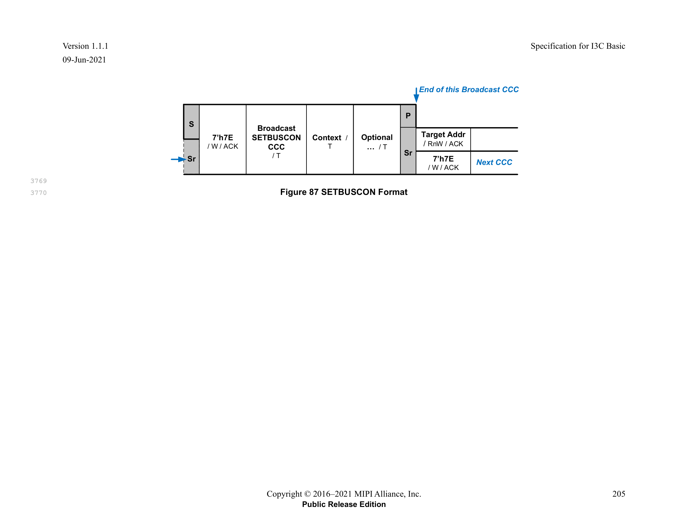

Copyright © 2016–2021 MIPI Alliance, Inc. 

205 

**Public Release Edition** 

Specification for I3C Basic 

Version 1.1.1 

09-Jun-2021 

```
3771
```

## **Table 57 SETBUSCON Context Values** 

|||**Table 57 SETBUSCON Context Values**|
|---|---|---|
|**Context Byte Value**|**Context Group**|**Context Description**|
|0|None|Reserved, do not use|
|**1 – 63**|**MIPI I3C Specification v1.Y**<br>**Minor Version**|**Bits[7:6]:**2’b00<br>**Bit[5]:**I3C Specification Editorial Revision (within Minor Version)<br>**1’b0:**Version 1.Y.0<br>**1’b1:**Version 1.Y.1 or greater<br>**Bit[4]:**I3C Specification Family<br>**1’b0:**MIPI I3C Specification<br>**_Note:_**An I3C Controller that supports the I3C Basic Specification<br>shall not use the value 1’b0 in this field.<br>**1’b1:**MIPI I3C Basic Specification<br>**Bits[3:0]:**I3C Specification Minor Version (v1.Y)<br>**4’b0000:**Illegal, do not use (see Note below)<br>(It would encode v1.0, but SETBUSCON was not available in I3C Basic v1.0)<br>**4’b0001–4’b1111:**Version 1.1 – Version 1.15<br>**Examples:**<br>Bit[5]  Bit[4]   Bits[3:0]<br>**I3C Basic v1.1.1:**<br>1’b1 || 1’b1 || 4’b0001<br>or<br>8’b00110001<br>**I3C Basic v1.2.0:**<br>1’b0 || 1’b1 || 4’b0010<br>or<br>8’b00010010|
|**64 – 127**|**Other MIPI Working**<br>**Groups**|Reserved for higher-level protocols defined by other MIPI Alliance specifications that use MIPI I3C<br>for communications|
|**128 – 191**|**Other Standards**<br>**Organizations**|Reserved for higher-level protocols defined by other standards developing organizations. The<br>values are assigned by MIPI Alliance I3C WG.<br>See public registry athttps://www.mipi.org/MIPI_I3C_bus_context_byte_values_public.html.|
|**192 – 255**|**Vendor Custom**|Available for private, per-vendor use (not tracked by MIPI Alliance)|


## **`3772`** _**Note:**_ 

**`3773`** _An I3C Controller that supports version 1.1 or greater of the full I3C Specification might emit the SETBUSCON CCC with Bit[4] set to 1’b0. In that case, an_ **`3774`** _I3C Target that supports version 1.1 or greater of the I3C Basic Specification should ignore Bit[4]._ 

**`3775`** _An I3C Controller that supports any version of the I3C Basic Specification shall not emit the SETBUSCON CCC with Bit[4] set to 1’b0; for an I3C Basic_ **`3776`** _Controller, 1’b1 is the only valid value for Bit[4]._ 

Copyright © 2016–2021 MIPI Alliance, Inc. 

206 

**Public Release Edition** 

Version 1.1.1 09-Jun-2021 

Specification for I3C Basic 

## **5.1.9.4 Direct CCCs and Group Addresses** 

> **`3777`** If a Target supports Group Address capabilities (see _**Section 5.1.4.4**_ ) and has been assigned a Group Address, **`3778`** then it may receive and acknowledge certain Direct SET or Direct Write CCCs sent to an assigned Group **`3779`** Address, for Direct CCCs that are either defined in _**Table 16**_ , or otherwise reserved for other MIPI WGs or **`3780`** custom definition. The Controller may send a Direct CCC as a Write to a Group Address, such that all Targets **`3781`** in the Group may receive and acknowledge such Direct CCCs (if supported). Each such Target that supports **`3782`** such CCCs shall ACK the Direct CCC as a Write sent to an assigned Group Address, as indicated in this **`3783`** section, using the same manner for acknowledging a Direct CCC as a Write that would be sent to its assigned **`3784`** Dynamic Address (per _**Section 5.1.9.2.2**_ ). **`3785`** _**Note:**_ **`3786`** _If no such Targets ACK a Direct SET or Direct Write CCC that is sent to an assigned Group Address,_ **`3787`** _then the Controller shall detect this as a NACK (i.e., a failure to ACK the CCC)._ 

- **`3788`** _**Table 58**_ specifies which Direct CCCs are either recommended for use (with possible limitations) or not **`3789`** supported for use with a Group Address. 

- **`3790`** • A Target that supports any of these CCCs marked as ‘Not supported’ that might otherwise be **`3791`** supported (i.e., when sent to its assigned Dynamic Address) shall not acknowledge the same CCC **`3792`** when sent to a Group Address to which it is currently assigned. 

- **`3793`** • A Target that supports any of these CCCs marked as ‘May use as multicast’ may choose to **`3794`** acknowledge the CCC when sent to either its Dynamic Address or any assigned Group Address, **`3795`** with identical meaning. Such ‘multicast’ writes may be used for convenience of configuration. 

- **`3796`** • The Controller should follow up with a Direct GET form of the same CCC (if applicable) to **`3797`** each Target’s Dynamic Address to confirm that the Direct SET to the Group Address was **`3798`** accepted. **`3799`** • If a Target does not support such a CCC when sent to a Group Address, then the Controller **`3800`** might not see its lack of acknowledgement. 

- **`3801`** • A Target that supports any of these CCCs marked as ‘Limited support’ or ‘Not recommended’ **`3802`** might support Group Addresses for certain formats or when used with certain Defining Bytes, for **`3803`** particular use cases only. In such cases, the Target might not support the CCC in the same manner **`3804`** as though it were sent to its Dynamic Address. 

Copyright © 2016–2021 MIPI Alliance, Inc. **Public Release Edition** 

207 

Specification for I3C Basic 

Version 1.1.1 09-Jun-2021 

```
3805
```

**Table 58 Direct CCC Support for Group Addresses** 

|**Command Name**|**Status**|**Notes and Limitations**|
|---|---|---|
|**ENEC**<br>**DISEC**|May use as multicast|Note that the event conditions that are controlled by these CCCs relate to<br>Target Interrupt Requests, which cannot be sent from a GroupAddress|
|**ENTAS0**<br>**ENTAS1**<br>**ENTAS2**<br>**ENTAS3**|May use as multicast|Activity State configuration generally applies to the whole Device. Note<br>that many uses of these CCCs are to communicate expected latencies to<br>expect in response to pulling SDA Low, which do not apply to an<br>assigned Group Address, since a Target Interrupt Request cannot be<br>generated from a GroupAddress.|
|**SETMWL**|May use as multicast|Maximum write length applies to the whole Device, not an individual<br>Group Address. No standard method is defined to read the maximum<br>write length for onlya GroupAddress, as opposed to a Dynamic Address.|
|**SETMRL**|_Not recommended_|Multicast configuration not recommended. Maximum read length does not|
|||usuallyapply, since Controller cannot read from a GroupAddress.|
|**SETDASA**<br>**SETNEWDA**|_Not supported_|CCCs that assign or change a Dynamic Address cannot be sent to any|
|||GroupAddress.|
|**SETBRGTGT**|_Not supported_|GroupAddressingis not defined for a Bridge Device.|
|**SETROUTE**|_Not supported_|GroupAddressingis not defined for a RoutingDevice.|
|**SETXTIME**|May use as multicast|Timing Control settings apply to the Device as a whole. Note that any<br>Timing Control settings sent to a Group Address should be used for<br>multicast configuration as an alternative to the Broadcast SETXTIME<br>CCC. Controllers should first confirm that all Targets in a Group support<br>the same Timing Control Mode before using the SETXTIME CCC with a<br>GroupAddress.|
|**ENDXFER**|May use as multicast|Controller should confirm that applied settings are accepted, using Direct<br>GET CCC to each Target’s Dynamic Address; see**_Section 5.2.2.3.4_**.|
|**D2DXFER**|_Not supported_|_This CCC is not included in the I3C Basic Specification._|
|**RSTACT**|Limited support, for|Target Reset Actions are not defined for a Group Address. Specific<br>Defining Bytes might be used with Group Addresses, for some special<br>use cases. Recommend using Dynamic Addresses, unless specific<br>situations require GroupAddresses.|
||defined uses only.||
||||
|**SETGRPA**|_Not supported_|SETGRPA CCC mayonlybe sent to a Target’s Dynamic Address.|
|**RSTGRPA**|Limited support, for|In one form, removes all Targets from this Group Address; see<br>**_Section 5.1.9.3.28_**.|
||defined uses only.||
|**MLANE**|Limited support, for|Sets the ML Frame format for subsequent transfers addressed to the<br>Group Address for an I3C Mode. May only be sent if all Targets in the<br>Groupsupport separate ML configurations(per**_Section 5.3.1.1_**).|
||defined uses only.||
||||
|MIPI WG Reserved|Not yet defined|Reserved for use by other MIPI Alliance Working Groups. Support for|
|||GroupAddressingmight be defined in another MIPI specification.|
|Vendor / Standards<br>Extension|For Vendor or Standards<br>use|Generally available for use (see**_Table 16_**), but MIPI Alliance<br>recommends careful consideration based on the intended use case.<br>Contact MIPI Alliance I3C Working Group for guidance and specific<br>recommendations.|


**`3806`** _**Note:**_ 

**`3807`** _For any Direct CCCs listed in_ _**Table 58** with either full or partial support for a Group Address, such_ **`3808`** _CCC definitions in the respective sub-sections of_ _**Section 5.1.9.3** that only have a Direct SET or Direct_ **`3809`** _Write CCC form using “Target Addr” in the Direct CCC framing (i.e., after the Repeated START, or_ **`3810`** _“Sr”) should also be interpreted as supporting a valid Group Address with that particular form, where a_ **`3811`** _Group Address may be used in place of the “Target Addr” in the framing (see_ _**Section 5.1.2.1.3** )._ 

**`3812`** _However, any CCCs that are listed as ‘Limited support’ or ‘Not recommended’ should generally not be_ **`3813`** _interpreted as supporting a Group Address in place of the “Target Addr” (per notes and limitations)._ **`3814`** _Additionally, any CCCs that are listed as ‘Not supported’ do not support a Group Address in place of_ **`3815`** _the “Target Addr”._ 

**`3816`** The Controller shall not send any Direct GET or Direct Read CCCs to a Group Address, and Targets shall **`3817`** not ACK any Direct CCCs that would attempt to read from an assigned Group Address. 

Copyright © 2016–2021 MIPI Alliance, Inc. **Public Release Edition** 

208 

Version 1.1.1 09-Jun-2021 

Specification for I3C Basic 

## **5.1.10 Error Detection and Recovery Methods for SDR** 

> **`3818`** The error detection and recovery methods specified in this Section are provided in order to avoid fatal **`3819`** conditions when errors occur. A set of required methods is specified for I3C Target Devices, and a separate **`3820`** set of required methods is specified for I3C Controller Devices. Origins for all of these SDR Error Types are **`3821`** shown in _**Figure 164**_ through _**Figure 167**_ . 

## **5.1.10.1 SDR Error Detection and Recovery Methods for I3C Target Devices** 

> **`3822`** The Error Types summarized in _**Table 59**_ shall be supported for all I3C Target Devices. Each Error Type is **`3823`** further explained in a sub-section below the table. **`3824`** _**Note:**_ **`3825`** _In previous versions of the I3C Specification, these Error Types for I3C Target Devices were named_ **`3826`** _“S0”, “S1”, etc. The purpose, detection methods, and recovery methods for these Error Types are_ **`3827`** _unchanged._ 

```
3828
```

**Table 59 SDR Target Error Types** 

|**Error**<br>**Type **|**Description**|**Error Detection Method**|**Error Recovery Method**|
|---|---|---|---|
|**TE0**|**Invalid Broadcast**<br>**Address/W**<br>(7’h7E/W)<br>or<br>**Dynamic**<br>**Address/RnW after**<br>**DA assignment**|Detect any of the following:<br>7’h3E / W<br>7’h5E / W<br>7’h6E / W<br>7’h76 / W<br>7’h7A / W<br>7’h7C / W<br>7’h7F / W<br>7’h7E / R1|a. Enable HDR Exit Detector and ignore all other<br>patterns<br>b. (Optional) If both SCL and SDA stay at High<br>level for a period greater than 60 µs, then enable<br>STOP or START detector to exit from the<br>TE0/TE1 error situation.|
|**TE1**|**CCC Code**|Parity Check, using T-Bit|a. Enable HDR Exit Detector and neglect other<br>patterns.<br>b. (Optional) If both SCL/SDA stay at High level<br>for a period greater than 60 µs, then enable<br>STOP or START detector to exit from the<br>TE0/TE1 error situation.|
|**TE2**|**Write Data**|Parity Check, using T-Bit|Enable STOP or Repeated START detector and<br>neglect otherpatterns.|
|**TE3**|**Assigned Address**<br>**during Dynamic**<br>**Address Arbitration**|Parity Check, using PAR Bit|Generate NACK (after PAR), then wait for<br>another Repeated START and 7E/R to re-<br>transmit the Provisioned ID.|
|**TE4**|**7’h7E/R missing after**<br>**Sr during Dynamic**<br>**Address Arbitration**|Detect 7’h7E/R missing after Sr during<br>Dynamic Address Arbitration|Generate NACK (after 7’h7E/R), then enable<br>STOP or Repeated START Detector and ignore<br>all other patterns|
|**TE5**|**Transaction after**<br>**detecting CCC**|Detect illegally formatted CCC|Generate NACK (after Target Address), then<br>enable STOP or Repeated START Detector and<br>ignore all otherpatterns|
|**TE6**<br>(optional)|**Monitoring Error**|Target detects (through monitoring) that<br>transmitted Data differs from what it<br>intended to transmit<br>(Does not apply during Dynamic<br>Address Arbitration)|Stop the transmission, then enable STOP or<br>Repeated START Detector (per Read type) and<br>ignore all other patterns|
|**DBR**<br>(optional)|**Dead Bus Recovery**|Controller acting as Target detects that<br>the I3C Bus is no longer being driven by<br>a Controller|Controller acting as Target retakes control of the<br>I3C Bus, becoming Active Controller|
|**_Note:_**<br>_1._<br>_In the ENTDAA mode, “7’h7E / R” is excluded from the TE0 error definition._||||


Copyright © 2016–2021 MIPI Alliance, Inc. **Public Release Edition** 

209 

Specification for I3C Basic 

Version 1.1.1 09-Jun-2021 

## **5.1.10.1.1 Error Type TE0** 

> **`3829`** If an error occurs during Broadcast Address/W or Dynamic Address/RnW after a Dynamic Address is **`3830`** assigned, then the Target will be unable to distinguish whether the transfer is a CCC transfer or a Private **`3831`** RnW transfer. For example, in the case of an ENTHDR CCC transfer the Target is not able to know that the **`3832`** I3C Bus has changed to HDR Mode. A potentially fatal situation could ensue if this case is not detected and **`3833`** handled, because the Target might become confused by seeing many STARTs and STOPs as illustrated in **`3834`** _**Figure 88**_ , and might attempt to interpret the HDR transfer as though the I3C Bus were still in SDR Mode. 

```
3835
```

```
3836
```

**==> picture [426 x 70] intentionally omitted <==**

**----- Start of picture text -----**<br>
STOP START STOP STOP START START<br>SDA<br>SCL<br>**----- End of picture text -----**<br>


## **Figure 88 Example Waveform for Error Type TE0** 

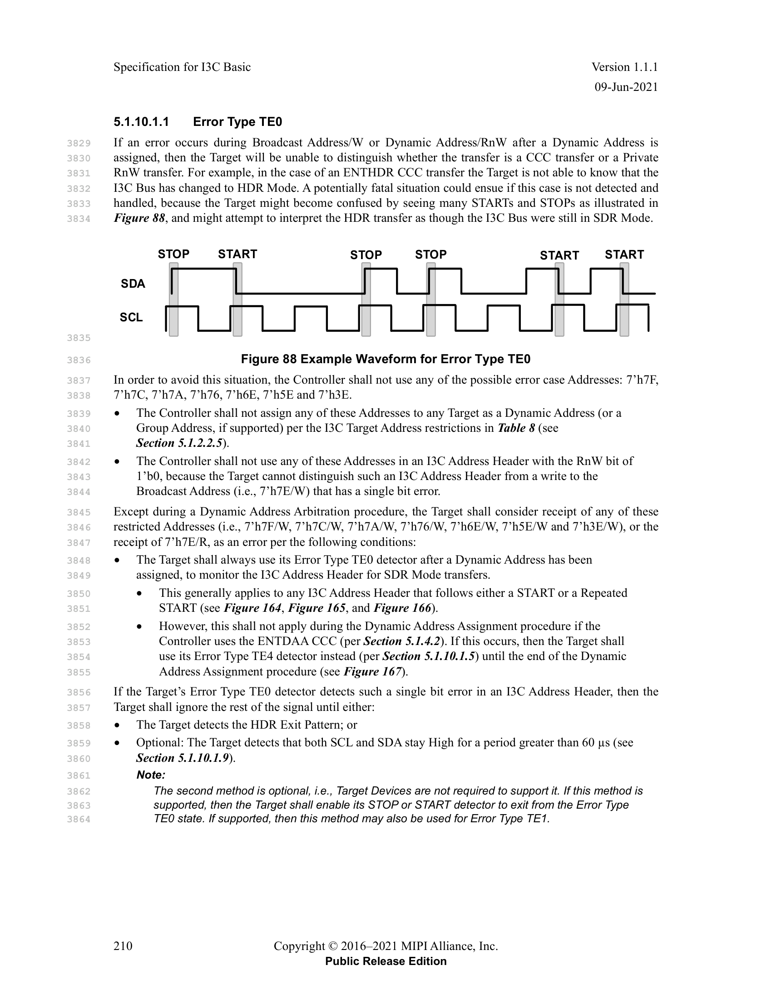

**`3837`** In order to avoid this situation, the Controller shall not use any of the possible error case Addresses: 7’h7F, **`3838`** 7’h7C, 7’h7A, 7’h76, 7’h6E, 7’h5E and 7’h3E. 

- **`3839`** • The Controller shall not assign any of these Addresses to any Target as a Dynamic Address (or a **`3840`** Group Address, if supported) per the I3C Target Address restrictions in _**Table 8**_ (see **`3841`** _**Section 5.1.2.2.5**_ ). 

- **`3842`** • The Controller shall not use any of these Addresses in an I3C Address Header with the RnW bit of **`3843`** 1’b0, because the Target cannot distinguish such an I3C Address Header from a write to the **`3844`** Broadcast Address (i.e., 7’h7E/W) that has a single bit error. 

**`3845`** Except during a Dynamic Address Arbitration procedure, the Target shall consider receipt of any of these **`3846`** restricted Addresses (i.e., 7’h7F/W, 7’h7C/W, 7’h7A/W, 7’h76/W, 7’h6E/W, 7’h5E/W and 7’h3E/W), or the **`3847`** receipt of 7’h7E/R, as an error per the following conditions: 

- **`3848`** • The Target shall always use its Error Type TE0 detector after a Dynamic Address has been **`3849`** assigned, to monitor the I3C Address Header for SDR Mode transfers. 

- **`3850`** • This generally applies to any I3C Address Header that follows either a START or a Repeated **`3851`** START (see _**Figure 164**_ , _**Figure 165**_ , and _**Figure 166**_ ). 

- **`3852`** • However, this shall not apply during the Dynamic Address Assignment procedure if the **`3853`** Controller uses the ENTDAA CCC (per _**Section 5.1.4.2**_ ). If this occurs, then the Target shall **`3854`** use its Error Type TE4 detector instead (per _**Section 5.1.10.1.5**_ ) until the end of the Dynamic **`3855`** Address Assignment procedure (see _**Figure 167**_ ). 

**`3856`** If the Target’s Error Type TE0 detector detects such a single bit error in an I3C Address Header, then the **`3857`** Target shall ignore the rest of the signal until either: 

```
3858
```

   - The Target detects the HDR Exit Pattern; or 

- **`3859`** • Optional: The Target detects that both SCL and SDA stay High for a period greater than 60 µs (see **`3860`** _**Section 5.1.10.1.9**_ ). 

```
3861
```

## _**Note:**_ 

**`3862`** _The second method is optional, i.e., Target Devices are not required to support it. If this method is_ **`3863`** _supported, then the Target shall enable its STOP or START detector to exit from the Error Type_ **`3864`** _TE0 state. If supported, then this method may also be used for Error Type TE1._ 

Copyright © 2016–2021 MIPI Alliance, Inc. **Public Release Edition** 

210 

Version 1.1.1 09-Jun-2021 

Specification for I3C Basic 

## **5.1.10.1.2 Error Type TE1** 

> **`3865`** If the Target detects a parity error during a CCC code, then the Target will not be able to know that the I3C **`3866`** Bus has changed to HDR Mode if the CCC is ENTHDR. This is similar to the situation in Error Type TE0. **`3867`** In order to avoid this situation, if the Target detects a parity error during a CCC code, then the Target shall **`3868`** ignore the rest of the signal, until: 

**`3869` Either:** 

## **`3870`** • The Target detects the HDR Exit Pattern, 

## **`3871` Or:** 

- **`3872`** • Optional: The Target detects that both SCL and SDA stay High for a period greater than 60 µs (see **`3873`** _**Section 5.1.10.1.9**_ ). 

## **`3874`** 

## _**Note:**_ 

**`3875`** _The second method is optional, i.e., Target Devices are not required to support it. If this method is_ **`3876`** _supported, then the Target shall enable its STOP or START detector to exit from the Error Type_ **`3877`** _TE1 state. If supported, then this method may also be used for Error Type TE0._ 

## **5.1.10.1.3 Error Type TE2** 

> **`3878`** If the Target detects a parity error during Write Data, then the Target shall wait for STOP or Repeated START. 

**`3879`** If the Target detects this error after receiving a CCC, then the Target shall: 

**`3880` Either:** 

- **`3881`** 1. Retain the CCC state until the Target detects the end of CCC command (i.e., when the Target is **`3882`** recovered by the Repeated START), 

```
3883
```

## **Or:** 

- **`3884`** 2. Disregard everything until the STOP. 

## **5.1.10.1.4 Error Type TE3** 

> **`3885`** If the Target detects a parity error in the PAR Bit of the Assigned Address during a Dynamic Address **`3886`** Arbitration procedure, then the Target shall generate NACK (after PAR) and then wait for another Repeated **`3887`** START and 7E/R to re-transmit the Provisioned ID. 

## **5.1.10.1.5 Error Type TE4** 

> **`3888`** During a Dynamic Address Arbitration procedure, if the Target detects any value other than 7’h7E/R **`3889`** following Repeated START, then the Target shall generate NACK (after 7’h7E/R) and then wait for STOP to **`3890`** exit the ENTDAA mode. 

Copyright © 2016–2021 MIPI Alliance, Inc. **Public Release Edition** 

211 

Specification for I3C Basic 

Version 1.1.1 09-Jun-2021 

## **5.1.10.1.6 Error Type TE5** 

> **`3891`** If the Target detects an illegally formatted CCC, then the Target shall generate NACK (after the Dynamic **`3892`** Address) and then wait for STOP or Repeated START. 

**`3893`** Examples of an illegally formatted CCC include: 

- **`3894`** • If the Target receives a matching Dynamic Address with Write during a Direct CCC that only has a **`3895`** Direct Read or Direct GET form (e.g., the GETBCR CCC) 

- **`3896`** • If the Target receives a matching Dynamic Address with Read during a Direct CCC that only has a **`3897`** Direct Write or Direct SET form (e.g., the SETGRPA CCC) 

**`3898`** If the Target detects this error after receiving a CCC, then the Target shall either: 

- **`3899`** 1. Retain the CCC state until the Target detects the end of CCC command (i.e., when the Target is **`3900`** recovered by the Repeated START), or else 

## **`3901`** 

2. Stop the CCC when the Target is recovered by the STOP. 

**`3902`** _**Note:**_ 

**`3903`** _This section does not provide all examples of illegally formatted CCCs._ 

**`3904`** _**Note:**_ 

**`3905`** _If the Target detects a Direct CCC that is formatted correctly, but that is not supported, then the Target_ **`3906`** _shall handle such CCCs, or unsupported Defining Bytes, as described in_ _**Section 5.1.9.2.2** ._ 

- **`3907`** _In an HDR Mode CCC, the Target would wait for the CCC to end as described in_ _**Section 5.2.1.2.1** ,_ **`3908`** _**Figure 98** ._ 

## **5.1.10.1.7 Error Type TE6 (Optional)** 

**`3909`** If an error occurs in the RnW Bit of the Address Header, then the Target might believe that it is responding **`3910`** to a Read, when what the Controller actually intends to initiate is a Write. If this happens, then the Write Data **`3911`** from the Controller might conflict with the Read Data from the Target. 

**`3912`** The Target should always monitor the Data it transmits for Read transactions. If the Target does so, then if **`3913`** the monitored Data differs from the Data the Target intended to transmit, the Target shall consider this **`3914`** condition to be an error. 

- **`3915`** _**Note:**_ 

- **`3916`** _The Controller should also monitor the Data it transmits. If this condition happens due to a Target’s_ **`3917`** _misinterpretation of the RnW bit during an intended Write transfer, then the Controller should also_ **`3918`** _detect this condition as Error Type CE1 (see_ _**Section 5.1.10.2.2** )._ 

**`3919`** _The Target shall not consider this condition to be an example of Error Type TE6 during the Arbitration_ **`3920`** _round of a Dynamic Address Assignment procedure (i.e., when the Controller has sent the ENTDAA_ **`3921`** _CCC) while the Target is attempting to drive its Provisioned ID, BCR and DCR (see_ _**Section 5.1.4.2** )._ 

**`3922`** If the Target detects such an error during an intended Private Write transfer (i.e., when the Target believes it **`3923`** is responding to a Private Read transfer), then it shall stop the transmission, allow the Controller to finish, **`3924`** and then wait for STOP or Repeated START. 

**`3925`** If the Target detects such an error during an intended Direct SET or Direct Write CCC (i.e., when the Target **`3926`** believes that it is responding to a Direct GET or Direct Read CCC), then the Target shall stop the transmission, **`3927`** allow the Controller to finish, and then either: 

- **`3928`** 1. Retain the CCC state until the Target detects the end of CCC command (i.e., when the Target is **`3929`** recovered by the Repeated START), or else 

- **`3930`** 2. Stop the CCC when the Target is recovered by the STOP. 

Copyright © 2016–2021 MIPI Alliance, Inc. **Public Release Edition** 

212 

Version 1.1.1 09-Jun-2021 

Specification for I3C Basic 

## **5.1.10.1.8 Error Type DBR (Optional)** 

> **`3931`** This error allows a Controller-capable Device that is acting as a Target (i.e., a Secondary Controller) to regain **`3932`** control of a dead Bus (i.e., where the Active Controller has stopped working for whatever reason). This works **`3933`** both for a Primary Controller acting as Target (i.e., while a Device that initialized as a Secondary Controller **`3934`** is acting as Active Controller), and for a Secondary Controller acting as a Target. **`3935`** The general model is that when the Controller acting as Target pulls SDA Low to request an IBI or CRR, it **`3936`** may measure the time before SCL goes Low (i.e., in response to this START Request). If SCL does not go **`3937`** Low in 50 ms (tCAS maximum for Activity State 3), then the Controller acting as a Target may take action to **`3938`** take over control of the Bus and become the new Active Controller. 

**`3939`** The steps are as follows: 

- **`3940`** 1. The Controller acting as Target pulls SDA Low to initiate an IBI or CRR. 

- **`3941`** a. It starts a timer. **`3942`** 2. If 50 ms has elapsed without SCL going Low, then the Controller acting as a Target assumes that **`3943`** the former Active Controller is not operational. **`3944`** a. If SCL is pulled Low before 50 ms, then all is well and Error Type DBR shall not apply. 

- **`3945`** b. Otherwise, Error Type DBR applies and as a result the Target acting as Controller may start a **`3946`** transition to Controller mode. 

- **`3947`** 3. Once in Controller mode, the Device shall verify that SCL is still High, and if so, pull SCL Low to **`3948`** complete a START. **`3949`** a. If SCL is not High by the time the Device is a Controller, then the Device must switch back to **`3950`** Target mode, as Error Type DBR no longer applies. This might occur due to another **`3951`** Controller-capable Device (i.e., a Secondary Controller) having taken control of the Bus first. 

- **`3952`** 4. After the START, the Controller may wish to check the status of the Targets. 

- **`3953`** a. It may also initiate an ENTDAA sequence to see whether any Devices need a Dynamic **`3954`** Address to be assigned (see _**Section 5.1.4.2**_ ). 

- **`3955`** b. If available, the last DEFTGTS information that might have been sent by a previous Active **`3956`** Controller (i.e., as a Broadcast CCC) should be used for proper Dynamic Address assignment. 

**`3957`** _**Note:**_ 

**`3958`** _A Controller-capable Device acting as Target may choose to monitor the Bus at all times. In the event_ **`3959`** _that SDA is pulled Low by any Target, the Device may then measure the time waiting for SCL to be_ **`3960`** _pulled Low. If 50 ms elapses without SCL being pulled Low, then it may start the Dead Bus Recovery_ **`3961`** _process above at step 3._ 

**`3962`** _If the former Active Controller eventually resumes operation and senses activity on SCL and/or SDA,_ **`3963`** _then it must assume that it has lost the Controller Role to the new Active Controller._ 

**`3964`** _Per_ **Section 5.1.11.4.1** _, the Primary Controller shall use a similar procedure after a Full/Chip reset, to_ **`3965`** _determine whether it should be the Active Controller of the Bus._ 

Copyright © 2016–2021 MIPI Alliance, Inc. **Public Release Edition** 

213 

Specification for I3C Basic 

Version 1.1.1 09-Jun-2021 

## **5.1.10.1.9 Optional Recovery Method for Error Types TE0 and TE1** 

- **`3966`** An I3C Target can recover from an Error Type TE0 or Error Type TE1 situation not only by detecting the **`3967`** HDR Exit Pattern, but also by monitoring the SCL and SDA lines. If the Target detects that both lines stay at **`3968`** High level for a period exceeding 60 µs, then the I3C Target can regard the Bus as operating in non-HDR **`3969`** mode. The I3C Target can then recover from the TE0 or TE1 situation, and wait for a STOP or a START to **`3970`** resume normal operation. 

- **`3971`** _**Note:**_ 

- **`3972`** _Regarding timing, HDR’s slowest clock rate is 10 kHz (100 µs total cycle). The period 60 µs is derived_ **`3973`** _by assuming that HDR (i.e., HDR-DDR Mode) will always keep an approximately even duty cycle,_ **`3974`** _especially at very slow clock rates (since the only reason to go so slow is for long lines and/or large_ **`3975`** _capacitive load on Bus lines). 60 µs represents 60% of the duty cycle, and therefore is a safe duration_ **`3976`** _to wait when seeing both lines High._ 

- **`3977`** _The Target can start measuring the period whenever it detects that both SCL and SDA are at High_ **`3978`** _level. There is no need to start timing this period at any particular signal pattern (for example, at the_ **`3979`** _STOP)._ 

Copyright © 2016–2021 MIPI Alliance, Inc. **Public Release Edition** 

214 

Version 1.1.1 09-Jun-2021 

Specification for I3C Basic 

## **5.1.10.2 SDR Error Detection and Recovery Methods for I3C Controller Devices** 

> **`3980`** _**Table 60**_ summarizes the defined Error Types for I3C Controller Devices. All I3C Controller Devices shall **`3981`** support Error Types CE0, CE2, and CE3, and should support Error Type CE1. Each Error Type is further **`3982`** explained in a sub-section below the table. Escalation and recovery is explained in _**Section 5.1.10.2.5**_ and **`3983`** _**Section 5.1.10.2.6**_ . **`3984`** _**Note:**_ **`3985`** _In previous versions of the I3C Specification, these Error Types for I3C Controller / Controller Devices_ **`3986`** _were named “M0”, “M1”, etc. The purpose, detection methods, and recovery methods for these Error_ **`3987`** _Types are unchanged._ 

```
3988
```

**Table 60 SDR Controller Error Types** 

|**Error**<br>**Type**|**Description**|**Error Detection Method**|**Error Recovery Method**|
|---|---|---|---|
|**CE0**|**Transaction after sending CCC**|Detect illegally formatted CCC|Stop the transmission, then send<br>STOP and retry the transmission.|
|**CE1**<br>(optional)|**Monitoring Error**|Controller detects (through<br>monitoring) transmitted Data<br>different from what it intended to<br>transmit (Does not apply during<br>Dynamic Address Arbitration)|Stop the transmission, then send<br>STOP and retry the transmission.|
|**CE2**|**No response to Broadcast**<br>**Address**(7’h7E)|Controller detects NACK after<br>Broadcast Address (7’h7E)<br>transmission|Upon detection of NACK,<br>Controller transmits HDR Exit<br>Pattern followed by STOP|
|**CE3**|**Failed Controller Handoff**|Active Controller detects New<br>Controller does not drive Bus after<br>handoff|Active Controller regains the<br>Controller Role and drives Bus to<br>assert its Controller Role|


## **5.1.10.2.1 Error Type CE0** 

**`3989`** If the Controller detects an illegally formatted CCC, then the Controller shall stop the transmission, send **`3990`** STOP, and retry the transmission. An example of an illegally formatted CCC would be the Controller **`3991`** receiving just one byte from the Target in a GETMWL CCC code, since the Controller expects two bytes. 

## **5.1.10.2.2 Error Type CE1 (Optional)** 

**`3992`** Error Type CE1 occurs when the I3C Controller detects that the transmitted data differs from what the **`3993`** Controller intended to transmit. This might happen when the I3C Controller or I3C Targets misinterpret the **`3994`** RnW bit or the ACK/NACK during transactions (including IBI) defined by the I3C specification. This **`3995`** Section describes only two kinds of occurrence conditions for Error Type CE1, and the recovery method for **`3996`** each kind. Note that Type CE1 errors are not an expected behavior. **`3997`** If an error occurs in a RnW Bit in a Private Write transfer, then the Write Data from the Controller might **`3998`** conflict with the Read Data from the Target. For example, the Target could misinterpret a Private Write **`3999`** transfer as a Read transfer if there is an error in the RnW Bit, and as a result Write Data from the Controller **`4000`** would conflict with Read Data from the Target. 

**`4001`** The Controller should always monitor the Data it transmits. If the Controller does so, then if the monitored **`4002`** Data differs from the Data the Controller intended to transmit (except for Data transferred during a Dynamic **`4003`** Address Arbitration procedure), the Controller shall consider that to be an error. If the Controller detects this **`4004`** error, then it shall stop the transmission, then send STOP and retry the transmission. 

Copyright © 2016–2021 MIPI Alliance, Inc. **Public Release Edition** 

215 

Specification for I3C Basic 

Version 1.1.1 09-Jun-2021 

## **5.1.10.2.3 Error Type CE2** 

> **`4005`** If the Controller does not receive an ACK of a transmitted Broadcast Address (7’h7E), then it shall transmit **`4006`** the HDR Exit Pattern followed by STOP in order to recover any Target after TE0, TE1, TE2, TE5, and TE6 **`4007`** errors. 

## **5.1.10.2.4 Error Type CE3** 

> **`4008`** After the Controller to Controller Handoff procedure (see _**Section 5.1.6.3**_ ), the former Active Controller shall **`4009`** release SCL to High-Z and disable its Open Drain class Pull-Up on SDA, setting SDA to High-Z. However, **`4010`** the former Active Controller shall monitor the Bus to ensure that the new Controller has successfully asserted **`4011`** its Controller Role. 

**`4012`** If the former Active Controller does not detect a START within a specified Handoff period, then it shall test **`4013`** the New Controller to determine whether it actually controls the Bus, and it shall regain control of the Bus if **`4014`** the New Controller has not asserted its Controller Role. The specified Handoff period shall be at least 100 μs, **`4015`** but may be longer if the new Controller indicates that it requires a longer Handoff period. 

**`4016`** Before initiating the Controller to Controller Handoff procedure, the Active Controller shall first determine **`4017`** whether the Secondary Controller that is about to receive the Controller Role supports the GETMXDS CCC **`4018`** with Defining Byte value CRHDLY (see _**Section 5.1.9.3.18**_ ). If the Secondary Controller needs a longer **`4019`** Handoff period to assert the Controller Role, then it shall do so by indicating an Activity State. The Active **`4020`** Controller shall wait for the time period associated with the indicated Activity State, or 100 μs (whichever is **`4021`** greater) before attempting to test the new Controller. 

**`4022`** Once the Handoff period has elapsed, if the former Active Controller has not detected a START, then it should **`4023`** use the following steps to test the new Controller: **`4024`** 1. The former Active Controller shall pull SDA Low. This may be unnecessary if another I3C Target **`4025`** also pulls SDA Low (since the Handoff period is longer than the Bus Available Condition), but the **`4026`** effect is the same. 

- **`4027`** 2. After SDA is pulled Low, the former Active Controller shall wait for another 100 μs, or the time **`4028`** indicated by the new Controller’s indicated Activity State (as above, read with the GETMXDS **`4029`** CCC with Defining Byte value CRHDLY, if supported), whichever is greater. **`4030`** a. If the new Controller responds by pulling SCL Low within that period, then all is well: the **`4031`** new Controller has successfully asserted its Controller Role of the Bus. This is equivalent to a **`4032`** START, so this flow has a successful outcome. The former Active Controller shall release **`4033`** SDA and allow the new Controller to proceed. **`4034`** b. If the new Controller does not respond by pulling SCL Low within that period, then the **`4035`** former Active Controller shall pull SCL Low to regain the Bus Controller Role. This is **`4036`** equivalent to a START, but initiated in this case by the former Active Controller. **`4037`** _**Note:**_ **`4038`** _This outcome is an error condition on the part of the new Controller, which has not_ **`4039`** _responded per its obligations. As a result, the new Controller shall return to being a Target,_ **`4040`** _or remain as a Target._ 

**`4041`** In either case, the Controller that eventually ‘wins’ shall become the Active Controller, and shall drive a valid **`4042`** Bus action to assert its Bus Controller Role. Since the START has been driven, the next step is the I3C **`4043`** Address Header (see _**Section 5.1.2.2**_ ). The Active Controller shall attempt to drive its own Address (7’h7E). **`4044`** If another I3C Target drives its own Address and wins Arbitration, then that Target may attempt to issue a **`4045`** Target Interrupt Request. However, if the Active Controller wins Address Arbitration but does not have any **`4046`** actions to take at that time, then it may follow with a STOP. Either is sufficient for the Active Controller to **`4047`** assert its Bus Controller Role. 

**`4048`** If the former Active Controller regains the Bus Controller Role due to inactivity by the new Controller, then **`4049`** it is responsible for taking any necessary actions to determine the reason why the handoff failed. It may use **`4050`** the GETSTATUS CCC or other commands to test for the presence of the new Controller, or to attempt to **`4051`** read its current status. 

Copyright © 2016–2021 MIPI Alliance, Inc. **Public Release Edition** 

216 

Version 1.1.1 09-Jun-2021 

Specification for I3C Basic 

## **5.1.10.2.5 Controller Error Detection and Escalation Handling** 

> **`4052`** If SDA is stuck Low, then see _**Section 5.1.10.2.6**_ . This section addresses situations in which the Target is not **`4053`** responding. 

**`4054`** If the Controller does not receive an ACK of a transmitted private Message to a Target, and if the following **`4055`** conditions are all true: 

- **`4056`** • Activity State is 0 

- **`4057`** • Either the Target Device has not indicated read-turnaround delays via GETMXDS, or the Target **`4058`** Device has indicated a GETMXDS period and a period longer than GETMXDS has elapsed **`4059`** • The Target Device has not notified the Controller that it will be going into a lower Activity State **`4060`** via a private contract In-Band Interrupt (and either GETSTATUS or a private activity state status), 

- **`4061`** then the Controller has the following escalation options to recover the system: 

- **`4062`** 1. If the Controller is aware that the Target might sometimes need extra time, then the Controller can **`4063`** choose to try again after a short delay. 

- **`4064`** 2. If that fails, then the Controller shall check whether the Target is responsive by issuing **`4065`** GETSTATUS to the Target. The idea here is that the Target might be forced to NACK a private **`4066`** Message due to its inner system being unready, whereas GETSTATUS is a lightweight request that **`4067`** does not necessarily involve the inner system. 

- **`4068`** 3. If that fails, then the Controller shall use CE2 error handling (see _**Section 5.1.10.2.3**_ ) to emit the **`4069`** sequence: 

## S | 7’h7E (W) | ACK/NACK* | HDR Exit Pattern | STOP 

**`4070`** _**Note:**_ **`4071`** _* The I3C Controller doesn’t care whether the I3C Targets’ response is ACK vs. NACK._ 

**`4072`** This ensures that the failure is not due to the Target thinking that the I3C Bus is in HDR Mode. 

- **`4073`** 4. If that fails, and if the Target is still not responsive, then the next step depends on the value of the **`4074`** BCR “Offline Capable” bit (Bit[3]): **`4075`** a. If the Target is not Offline Capable, then: **`4076`** i. The Controller can try slowing the SCL clock rate, or try slowing its effective rate by **`4077`** using duty cycle. **`4078`** ii. If that fails, then the Target Reset mechanism can be used. A first attempt can be tried to **`4079`** recover via the Peripheral, and if that fails, then a second attempt will cause a chip reset. **`4080`** The Target Reset mechanism is explained in _**Section 5.1.11**_ . **`4081`** iii. If that fails, then any further escalation is outside the scope of the I3C Specification. 

- **`4082`** b. If the Target is Offline Capable, then: **`4083`** i. If the Target goes offline and is to be awoken via Target Reset, then the Target Reset **`4084`** approach should be used (see _**Section 5.1.11**_ ). **`4085`** ii. If the Target is known (i.e., via a private contract) to have a long wake period, and also **`4086`** known to monitor the I3C Bus during that wake period, then the Controller simply delays **`4087`** and tries later, after a delay based on the known or expected wake up time. Escalation and **`4088`** the GETSTATUS ensure that the Target’s Dynamic Address was issued; that should serve **`4089`** as the wake trigger. Either the Target may issue an In-Band Interrupt at a later time to **`4090`** notify the Controller that it is ready, or else the Controller may initiate the retry. 

- **`4091`** iii. If Target is not known to have a long wake period and to always monitor the I3C Bus, **`4092`** then the Controller marks the Target as offline. The Controller may then either retain the **`4093`** Target’s Dynamic Address for re-use, or else discard it. The next action will be for the **`4094`** Target to issue a Hot-Join Request, in order to be re-joined to the I3C Bus. In the Hot- **`4095`** Join operation the Controller will assign the Target a Dynamic Address; the new Address **`4096`** may be either the same Address that the Target used before being marked as offline, or a **`4097`** different Address. 

Copyright © 2016–2021 MIPI Alliance, Inc. **Public Release Edition** 

217 

Specification for I3C Basic 

Version 1.1.1 09-Jun-2021 

## **5.1.10.2.6 Controller Stuck SDA Handling** 

> **`4098`** If SDA is not stuck, but the Target is not responding, then see _**Section 5.1.10.2.5**_ . If the Controller has **`4099`** recovered from a crash or unexpected reset, then see _**Section 5.1.10.2.7**_ . 

**`4100`** The steps to attempt a recovery from a stuck SDA are as follows: 

- **`4101`** 1. If reading from an I[2] C Device, and it is holding SDA Low, then: 

```
4102
```

   - a. Pulse out nine (9) SCL clocks, to get it to see the NACK on 9th bit to get it to let go. 

- **`4103`** 2. If reading from an I3C Device in SDR Mode, and it is holding SDA Low, then: 

- **`4104`** a. Pulse out one clock at a time (up to 8), as it is required to drive SDA High for the T-Bit **`4105`** (9[th] bit). 

```
4106
```

   - b. Watch for SDA going High, and abort the read by driving SDA Low when SCL is High. 

- **`4107`** 3. If reading from an I3C Device in SDR Mode, and SDA is being held Low, and the approach in **`4108`** step 2 did not work, then: 

- **`4109`** a. Hold SCL level (High or Low) for 150 µs. The Target might support the 100 µs read-abort **`4110`** approach (per _**Section 5.1.2.3**_ ), and if so, it will release SDA. 

- **`4111`** 4. If reading from an I3C Device in SDR Mode, and SDA is High, and the Device does not seem to **`4112`** abort when the Controller drove SDA Low on the T bit (i.e., when SCL was High), then: 

- **`4113`** 

   - a. First try a 150 µs SCL hold (as explained in step 3). 

- **`4114`** b. If that does not work, then do the same drive SDA Low for each SCL High, for up to 8 more **`4115`** times. If there is a framing misalignment, then this will ensure that the T-Bit is finally caught **`4116`** and the read aborted. 

- **`4117`** _**Note:**_ 

**`4118`** _This risks contrary drive, so Controller could lower its drive strength to reduce current, if_ **`4119`** _wanted._ 

- **`4120`** 5. If reading from an I3C Device in HDR-DDR Mode, and it goes wrong, then see _**Section 5.2.2.4**_ . 

Copyright © 2016–2021 MIPI Alliance, Inc. **Public Release Edition** 

218 

Version 1.1.1 09-Jun-2021 

Specification for I3C Basic 

## **5.1.10.2.7 Controller Recovery After a Crash or Unexpected Reset** 

> **`4121`** If the Controller is recovering from a crash or unexpected reset, and it does not know the context of the Bus, **`4122`** then the Controller must determine the state of the Bus. It is assumed that the Controller has tried to put the **`4123`** Bus into Bus Free condition (i.e., SCL High, SDA held High with a Pull-Up), and that enough time has **`4124`** elapsed for the Pull-Up to pull SDA High, if possible. 

## **`4125`** 

The status may be one of: 

- **`4126`** • **SDA is High and controlled by the Controller alone.** This is normal Bus Free Condition. In this 

- **`4127`** case the Controller should emit an HDR Exit Pattern (to be safe), and then work to recover the Bus **`4128`** in the usual manner (e.g., RSTDAA, etc.). 

- **`4129`** • **SDA is High, but a Target is holding it High from a previous Read.** See below for detection. 

- **`4130`** • **SDA is Low.** This might be a Target still holding Low from a previous Read, or it might be a Target **`4131`** pulling SDA Low for an In-Band Interrupt, a Controller Role Request, or a Hot-Join. 

**`4132` If SDA is High** , and the Controller needs to determine whether it is held High, then the Controller may use **`4133`** one of three ways to do so: 

- **`4134`** 1. The Controller uses a weak Pull-Down resistor in its pad for SDA and turns off any active Pull- **`4135`** Up. If the line goes Low (after a reasonable time), then it is controlled by the Controller, and the **`4136`** Controller may proceed normally. 

- **`4137`** 2. The Controller may drive SDA Low, risking contrary drive (e.g., 4 mA current), to determine **`4138`** whether the SDA is held High. 

- **`4139`** 3. The Controller may lower the drive current of the SDA pad and then drive Low, to minimize **`4140`** contrary drive effects. 

**`4141` If the Controller determines SDA to be held High** , then follow the instructions in _**Section 5.1.10.2.6**_ , step 4. 

**`4142`** This method can be used for both an SDR Read and an HDR-DDR Read, however an HDR-DDR Read will **`4143`** need 16 clocks (10 for data preamble, 16 in case last data into CRC). 

**`4144` If SDA is Low** , then the Controller needs to determine why it is held Low. The Controller can use the following **`4145`** steps to do so: 

- **`4146`** 1. The Controller drives SCL Low. If SDA is released (i.e., strong Pull-Up on SDA causes it to go **`4147`** High), then a Target was trying to perform an In-Band Interrupt, a Controller Role Request, or a **`4148`** Hot-Join. The Controller may pull SDA Low again and continue with a START, or emit a STOP **`4149`** (i.e., drive SCL High, then pull SDA High), and then proceed to restart the Bus by NACKing any **`4150`** In-Band Interrupt, Controller Role Request, or Hot-Join, and then using the RSTDAA CCC. 

- **`4151`** 2. If SDA is not released, then the Controller should emit 19 or more SCL clocks. If SDA goes High **`4152`** at some point, then it should emit more SCL clocks to ensure 19 clocks were used with SDA High **`4153`** (in case it was in HDR-DDR Mode). If SDA is now High, then the Bus is not in HDR-DDR Read **`4154`** and also not in an I[2] C Read. The Controller should test whether SDA is stuck High, as explained **`4155`** above (starting at “If SDA is High”). If SDA is not stuck High, then the Controller should issue an **`4156`** HDR Exit Pattern in case it had been in HDR-DDR Mode. 

Copyright © 2016–2021 MIPI Alliance, Inc. **Public Release Edition** 

219 

Specification for I3C Basic 

Version 1.1.1 09-Jun-2021 

## **5.1.11 Target Reset** 

> **`4157`** This Section specifies the Target Reset mechanism. 

**`4158`** The Target Reset mechanism: 

- **`4159`** • Allows the Controller to Reset one or more selected Targets, and avoid resetting any others 

- **`4160`** • Supports different levels of reset, ranging from resetting only the I3C Peripheral within a Target, **`4161`** to resetting the whole Target Device 

- **`4162`** • Supports I3C’s error escalation mechanism (see _**Section 5.1.10**_ ), including reset of an errant Target 

- **`4163`** The Target Reset mechanism is simple, relying on these principles: 

- **`4164`** • The uniqueness of the HDR Exit Pattern (i.e., cannot be confused with any other I3C Bus traffic) 

- **`4165`** • Use of an in-band Target Reset Pattern to trigger the actual reset action. (In contrast to a **`4166`** reset/break hold as used in UART, one-wire [R], etc., which would require timing.) 

- **`4167`** • A defined default reset action that all Targets will use until and unless a different reset action is **`4168`** configured via the RSTACT CCC (Broadcast and Directed formats) 

- **`4169`** • An error recovery escalation mechanism, for use when needed (e.g., Error Types TE0 and TE1). 

- **`4170`** The Target Reset mechanism applies these principles to address three distinct reset cases: 

```
4171
```

   1. Recovery from error/hang in the Target I3C Peripheral 

- **`4172`** 2. Recovery from more serious errors in the chip containing the I3C Peripheral 

- **`4173`** 3. Wake from deepest sleep, while minimizing the number of gates used in the always-on domain 

## **5.1.11.1 Theory of Operation** 

> **`4174`** The Target Reset mechanism uses a simple model ( _**Figure 89**_ ). In normal operation the Controller directs the **`4175`** Targets in their actions, and the Targets take those actions. When the Target is in a deep enough sleep, or is **`4176`** broken, then the Target Reset performs an appropriate action. The Controller uses the RSTACT CCC **`4177`** (Broadcast and/or Directed formats, as needed) to configure which Targets are to be reset, the level(s) of reset **`4178`** to be used, and which Targets are not to be reset. 

- **`4179` Controller:** To trigger the Reset action, the Controller shall emit the following sequence: 

- **`4180`** • START 

- **`4181`** • Zero or more Message components, including RSTACT CCCs (Broadcast and/or Directed, as **`4182`** needed) each optionally ending in Repeated START 

- **`4183`** • At this point in the sequence the Controller may emit a STOP, but it is recommended to instead **`4184`** keep the sequence within a single Frame (See Note below). 

- **`4185`** • The Target Reset Pattern, including the final Repeated START and STOP that trigger the actual **`4186`** reset action 

- **`4187`** • At this point in the sequence the Controller shall leave the Bus free for as long as needed (or **`4188`** desired) for the Targets to complete their reset cycles. 

- **`4189`** • START, with an I3C Address Header (directed to either 7’h7E or any other Address) 

**`4190`** _**Note:**_ 

- **`4191`** _It is preferable to emit the RSTACT CCCs and the Target Reset Pattern together in a single Frame_ **`4192`** _(i.e., before emitting a STOP) for several reasons:_ 

- **`4193`** • _To avoid the risk of the RSTACT getting disconnected from the Target Reset action, which would_ **`4194`** _be dangerous. A properly operating Target will cancel an RSTACT CCC when it sees an SCL_ **`4195`** _falling edge following a START (but not a Repeated START)._ 

- **`4196`** • _Because neither I3C nor I[2] C define the Bus condition of SCL falling from Bus Free, and as a_ **`4197`** _result some Devices might exhibit unknown or unexpected behavior._ 

- **`4198`** • _Because the Target Reset Pattern includes STOP, in order to preserve a clean Bus state for all_ **`4199`** _Targets (i.e., both Targets that are being reset, and Targets that are not being reset)._ 

- **`4200`** • _A Target could pull SDA Low after a STOP._ 

Copyright © 2016–2021 MIPI Alliance, Inc. **Public Release Edition** 

220 

Version 1.1.1 09-Jun-2021 

Specification for I3C Basic 

- **`4201` Target:** A Target shall react to receipt of the Target Reset Pattern based on its state at the time of reception: **`4202`** • If the Target had been configured via the RSTACT CCC to take a particular reset action (including **`4203`** taking no action) and was able to process that RSTACT CCC (i.e., not broken), then the Target **`4204`** shall perform the reset action as configured. 

- **`4205`** • If the Target had been in a deepest-sleep state, then it may Wake up (e.g., power up, etc.). This **`4206`** Wake operation itself may either reset the Device or not, per _**Section 5.1.11.5**_ . 

- **`4207`** • If a Target had been unable to recognize a RSTACT CCC (i.e., was broken), or if no RSTACT **`4208`** CCC had been sent to the Target, then the Target shall either: 

- **`4209`** • **If this is the first time that the Target has seen the Target Reset Pattern:** Then the Target shall **`4210`** reset the I3C Peripheral. If a processor is in use, then it will notify the application via internal **`4211`** interrupt, so that it can reconfigure the I3C Peripheral). 

- **`4212`** 

or 

- **`4213`** • **If the Target has previously reset the I3C Peripheral and is seeing a new Target Reset Pattern** **`4214` with no intervening RSTACT or GETSTATUS CCC:** Then the Target shall reset the whole chip, **`4215`** i.e., equivalent to an SRSTn pin being asserted (see _**Section 5.1.11.4**_ ). 

- **`4216`** _**Note:**_ 

**`4217`** _Any reset action (including inaction) configured via the RSTACT CCC shall be cleared by the next_ **`4218`** _SCL falling edge following a START (but not by the next Repeated START)._ 

- **`4219`** _**Note:**_ 

**`4220`** _This specification is silent regarding what Target internal memory is retained vs. cleared in a_ **`4221`** _Peripheral reset (where ‘memory’ could be either volatile or non-volatile, and could be implemented in_ **`4222`** _any number of ways). In particular, the Target’s Dynamic Address may be either retained or cleared. If_ **`4223`** _the Target clears its Dynamic Address, then it shall participate in an ENTDAA that follows the Target_ **`4224`** _Reset Pattern; if the Target retains its Dynamic Address, then it shall not participate._ 

**==> picture [402 x 273] intentionally omitted <==**

**----- Start of picture text -----**<br>
Enable I3C<br>Armed to<br>Peripheral Reset<br>Configure<br>Reset Action<br>RSTACT CCC Target Reset  Target into<br>Pattern Deepest Sleep<br>START Target Reset  Reset I3C  Target Reset<br>(but not Sr) Pattern Peripheral Pattern<br>Clear<br>Configured Take Configured<br>ActionReset Reset Action (or inaction) GETSTATUS RSTACTCCC  or Target Reset Pattern Wakeup<br>Clear<br>Escalation<br>Escalation<br>Reset Whole<br>Chip<br>**----- End of picture text -----**<br>


**Figure 89 Target Reset Operations Flow** 

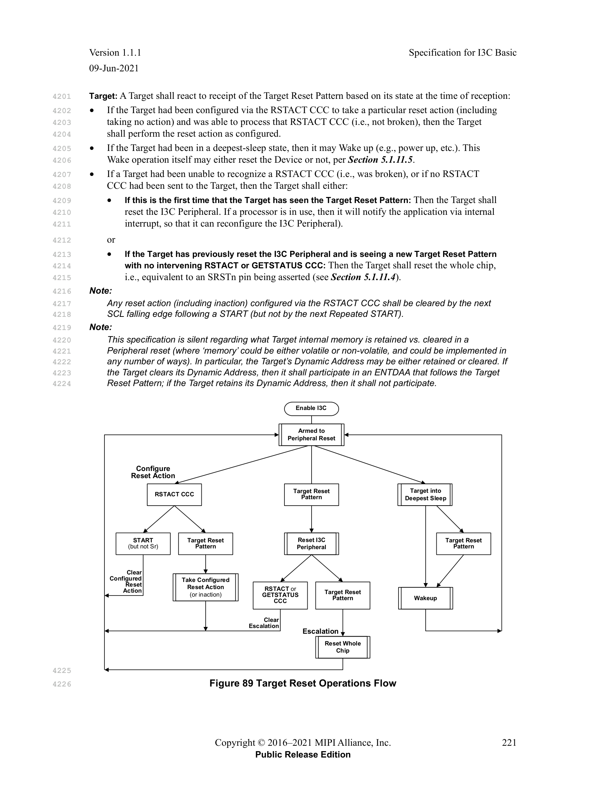

```
4225
4226
```

Copyright © 2016–2021 MIPI Alliance, Inc. **Public Release Edition** 

221 

Specification for I3C Basic 

Version 1.1.1 09-Jun-2021 

## **5.1.11.2 RSTACT CCC** 

> **`4227`** The RSTACT CCC (fully detailed in _**Section 5.1.9.3.26**_ ) has three formats with different uses: 

- **`4228`** • **Broadcast** to configure a Target Reset action for all Targets 

- **`4229`** • **Directed Write** to configure a Target Reset action for one or more specified Targets 

- **`4230`** • **Directed Read** to read the Reset recovery timing from each Target, including for reset of the **`4231`** Peripheral, Wakeup, and reset of the whole Device. 

## **5.1.11.3 Target Reset Pattern** 

> **`4232`** The Target Reset Pattern ( _**Figure 90**_ ) is used to trigger the default or configured reset action. The Target **`4233`** Reset Pattern begins with fourteen SDA transitions while SCL is kept Low, and ends with a Repeated START **`4234`** followed by a STOP which triggers the actual Reset action. The Target Reset Pattern is easily distinguished **`4235`** both from the shorter HDR Exit Pattern on which it is based (see _**Section 5.2.1.1.1**_ ), and from the HDR **`4236`** Restart Pattern. 

**==> picture [422 x 141] intentionally omitted <==**

**----- Start of picture text -----**<br>
See Errata 01, Item 20 Recognize 14 SDA Transitions Take Reset<br>while SCL Remains Low Action upon<br>(SDA Ends High) Sr  then  STOP<br>Set Up SDA<br>If Needed<br>SDA<br>Set Up<br>SCL<br>SCL<br>Set Up SCL<br>If Needed Sr STOP<br>**----- End of picture text -----**<br>


```
4237
```

```
4238
```

**Figure 90 Target Reset Pattern** 

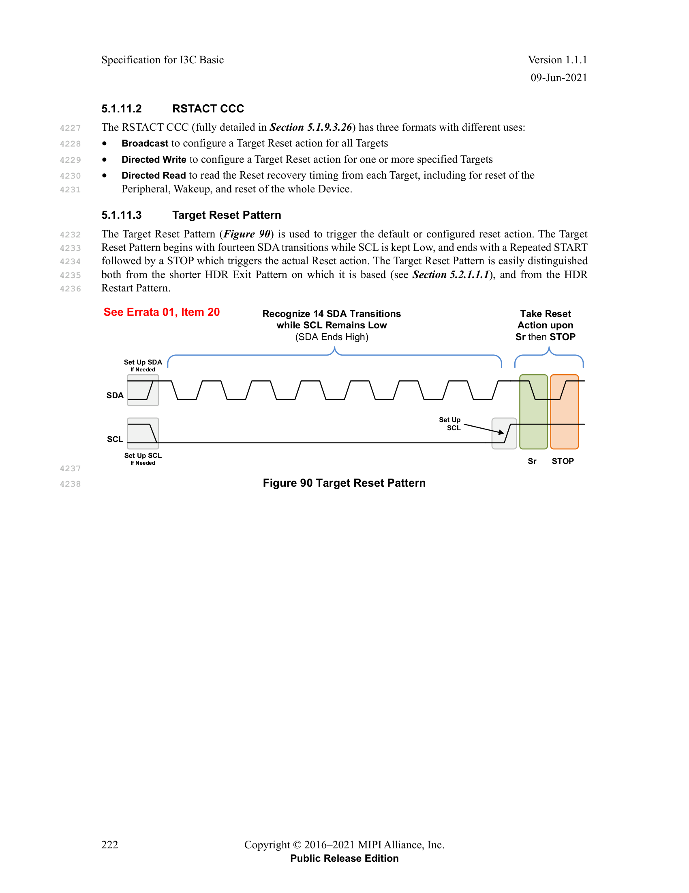

Copyright © 2016–2021 MIPI Alliance, Inc. **Public Release Edition** 

222 

Version 1.1.1 09-Jun-2021 

Specification for I3C Basic 

## **5.1.11.4 Full/Chip Reset Behavior** 

- **`4239`** Full/chip reset can be caused by either escalation of default (per _**Figure 89**_ ), or by a configured reset action **`4240`** via the RSTACT CCC with Defining Byte value 0x02 (per _**Table 53**_ ). This Specification does not strictly **`4241`** define behavior for a full/chip reset, however it is assumed to be similar to the behavior upon assertion of an **`4242`** SRSTn pin: 

- **`4243`** • Since this is a warm reset (i.e., power was not cut), the chip’s precise behavior as it comes back up **`4244`** is the responsibility of the implementation. 

- **`4245`** • It is assumed that the chip will need to participate in the Dynamic Address Assignment process **`4246`** (ENTDAA CCC) in order to receive a Dynamic Address. 

- **`4247`** • Any further steps after the DAA process are the responsibility of the driver controlling the **`4248`** Controller and Target. Such steps might be dictated by rules imposed by higher-level standardized **`4249`** protocols (e.g., Camera, Touch, Debug, etc.), and/or by other _a priori_ driver knowledge. 

## **`4250` Examples** 

- **`4251`** • **For a RAM-Based Target:** Determining whether another firmware download is needed 

- **`4252`** • **For a Sensor:** Determining whether a full calibration or a push of stored calibration data is **`4253`** needed 

Copyright © 2016–2021 MIPI Alliance, Inc. **Public Release Edition** 

223 

Specification for I3C Basic 

Version 1.1.1 09-Jun-2021 

## **5.1.11.4.1 Primary Controller Behavior After Full/Chip Reset** 

> **`4254`** There is a special condition where the Primary Controller acting as a Target (i.e., a Secondary Controller) is **`4255`** reset by the Active Controller. 

**`4256`** When the Primary Controller wakes up from the reset and it does not know why it was reset, it then needs to **`4257`** determine whether it was the Active Controller before the reset, or was acting as a Target (i.e., a Secondary **`4258`** Controller) and some other Controller-capable Device was the Active Controller. 

**`4259`** In order to do this, the Primary Controller shall monitor the Bus for activity on SCL for tIDLE. If the Bus is **`4260`** active, then the Device assumes it is not the Active Controller. If there is no activity, then the Device shall **`4261`** drive the SDA Low (if it wasn’t already Low) and wait for 50 ms (i.e., tCAS maximum for Activity State 3), **`4262`** and if an Active Controller that initiated the Reset does not respond by pulling down the SCL line, then the **`4263`** Primary Controller can assume that it is the Active Controller and start driving the SCL line. Then the Primary **`4264`** Controller shall broadcast the RSTDAA CCC and continue with the Bus initialization. 

- **`4265`** _**Note:**_ 

**`4266`** _This procedure is similar to the Dead Bus Recovery procedure for Error Type DBR (see_ **`4267` Section 5.1.10.1.8** _)._ 

## **5.1.11.5 Wake from Target Reset Behavior** 

**`4268`** This Specification does not mandate any particular implementation or behavior for Wake from Target Reset. **`4269`** Wake might or might not involve a reset (in whole or part); this will usually depend upon how the deepest- **`4270`** sleep/standby is implemented. 

**`4271`** Common types of Wake from Target Reset behavior include: 

- **`4272`** • **Wake Performs Reset:** The Target wakes from “power down” state with little or no restoration of **`4273`** saved information. In particular, the Target’s Dynamic Address is not saved. As a result, this case **`4274`** behaves like a normal reset: following the reset operation, the Target will need to participate in the **`4275`** Controller-initiated ENTDAA Dynamic Address Assignment process, in order to receive its **`4276`** assigned DA. 

- **`4277`** • **Wake with State Restoration:** Some amount of critical state information was previously saved **`4278`** somewhere outside the Target (e.g., always-on flops or the RTC domain), and is restored upon **`4279`** Target wake. This case works the same as offline wake model. This usually means saving and **`4280`** restoring the Target’s Dynamic Address, and can also involve additional state data. If the Target’s **`4281`** DA is restored in this manner, then the Controller will not need to take further steps to re-assign it **`4282`** (i.e., no need to then perform the ENTDAA CCC Dynamic Address Assignment procedure). 

- **`4283`** • **Wake with State Preserved:** In this case, Target state information does not need to be explicitly **`4284`** restored because it is preserved in place during the reset-wake interval. This case behaves the same **`4285`** as a wake from light sleep. Data preservation might be achieved via state-retention flops (SRFF), **`4286`** or simply by not actually cutting power during the reset-wake interval. 

Copyright © 2016–2021 MIPI Alliance, Inc. **Public Release Edition** 

224 

Version 1.1.1 09-Jun-2021 

Specification for I3C Basic 

## **5.1.12 Monitoring Device Early Termination Capability** 

- **`4287`** This capability is not included in the I3C Basic Specification. To gain access to this capability, please contact **`4288`** MIPI Alliance. The following information from the full I3C Specification is retained for the information of **`4289`** I3C Basic implementers. 

**`4290`** In complex systems, early termination of large data transactions can be useful in handling urgent situations, **`4291`** for example a lack of memory resources, or an immediate need for some different Receiver-side action. These **`4292`** situations can arise with large data transfers if the Receiver has insufficient memory available at the time of **`4293`** the transaction. 

- **`4294`** There also exist significant use cases where other Devices resident on the I3C Bus but not directly involved **`4295`** with a given transaction require Bus access. Examples include: Emergency situations, such as overheating; **`4296`** When a Device that monitors a transaction and collects its data runs out of resources; and touch display **`4297`** applications, where minimizing transfer latency is critically important. 

- **`4298`** This capability enables an I3C Device to optionally request that the Controller prematurely terminate an **`4299`** immediately following Bus transaction that it does not directly participate in. Such Devices are called **`4300`** Monitoring Devices. 

Copyright © 2016–2021 MIPI Alliance, Inc. **Public Release Edition** 

225 

Specification for I3C Basic 

Version 1.1.1 09-Jun-2021 

## **5.1.13 Device to Device(s) Tunneling** 

- **`4301`** This capability is not included in the I3C Basic Specification. To gain access to this capability, please contact **`4302`** MIPI Alliance. The following information from the full I3C Specification is retained for the information of **`4303`** I3C Basic implementers. 

- **`4304`** Data transfers on an I3C Bus are usually routed through the Active Controller, and this is suitable for a large **`4305`** majority of applications. However, there are some use cases in which data must flow from one Device to **`4306`** another, and neither the receiver nor the sender is the Active Controller. While it’s true that the Active **`4307`** Controller could collect the data and then transfer it to the Target, or one Target could acquire the Controller **`4308`** Role and then perform the data transfer, these procedures add latency and increase energy expenditure. 

- **`4309`** Device to Device(s) Tunneling (D2DT) exists to support specialized Message transfers between a Target and **`4310`** one or more other Targets, and from a Controller acting as though it were a Target transferring a Message to **`4311`** one or more other Targets. 

Copyright © 2016–2021 MIPI Alliance, Inc. **Public Release Edition** 

226 

Version 1.1.1 09-Jun-2021 

Specification for I3C Basic 

## **5.2 High Data Rate (HDR) Modes** 

**`4312`** This Section specifies the communication protocols for the two defined I3C High Data Rate (HDR) Modes **`4313`** that are available in I3C Basic. These HDR Modes are designed to transfer more data at the same Bus **`4314`** frequency: 

- **`4315`** • **HDR Double Data Rate (HDR-DDR) Mode** 

- **`4316`** • **HDR Bulk Transport (HDR-BT) Mode** 

- **`4317`** For information, the full I3C Specification also includes two additional HDR Modes using Ternary encoding: 

## **`4318`** 

```
4319
```

- _NOT INCLUDED IN I3C BASIC:_ HDR Ternary Symbol Pure-bus (HDR-TSP) Mode 

- _NOT INCLUDED IN I3C BASIC:_ HDR Ternary Symbol Legacy-inclusive-bus (HDR-TSL) Mode 

**`4320`** _**Note:**_ 

**`4321`** _It is important to note that the I3C Bus is always initialized and configured in SDR Mode, never in any_ **`4322`** _of the HDR Modes. The procedure for entering an HDR Mode from SDR Mode is detailed below. The_ **`4323`** _essential basic I3C specifications are found in_ _**Section 5.1** , including:_ 

|**Subject**|**Section**|
|---|---|
|Bus Configuration|**_5.1.1_**|
|Bus Communication|**_5.1.2_**|
|Bus Conditions|**_5.1.3_**|
|Bus Initialization and<br>Dynamic Address Assignment Mode|**_5.1.4_**|
|Hot-Join Mechanism|**_5.1.5_**|
|In-Band Interrupt|**_5.1.6_**|
|I3C Bus with Multiple Controllers|**_5.1.7_**|
|Timing Control|**_5.1.8_**|
|Common Command Codes (CCC)|**_5.1.9_**|
|Error Detection and Recovery Methods for SDR|**_5.1.10_**|
|Target Reset|**_5.1.11_**|


- **`4324`** Details common to all HDR Modes are detailed in this Section and in _**Section 5.2.1**_ . 

- **`4325`** Details unique to HDR Double Data Rate Mode (HDR-DDR) are specified in _**Section 5.2.2**_ . 

**`4326`** Placeholders for the two HDR Ternary Modes that are not included in I3C Basic appear at _**Section 5.2.3**_ . **`4327`** Details unique to HDR Bulk Transport Mode (HDR-BT) are specified in _**Section 5.2.4**_ . 

Copyright © 2016–2021 MIPI Alliance, Inc. **Public Release Edition** 

227 

Specification for I3C Basic 

Version 1.1.1 09-Jun-2021 

- **`4328`** Each HDR Mode is separate from all other HDR Modes: 

- **`4329`** • I3C Targets may choose to support any desired combination of the HDR Modes included in I3C **`4330`** Basic, including no HDR Modes. If the I3C Bus enters an HDR Mode that an I3C Target does not **`4331`** support, then that Target can simply wait and watch for the common HDR Exit Pattern. 

- **`4332`** • I3C Controllers may choose to support any desired combination of the HDR Modes included in **`4333`** I3C Basic, including no HDR Modes. However, manufacturers are generally encouraged to **`4334`** support all of these HDR Modes. 

- **`4335`** • I3C Devices that support HDR-BT may choose to support DUAL Lane or QUAD Lane **`4336`** configurations, in addition to SINGLE Lane configuration. 

- **`4337`** HDR Modes have Bus-wide effect. That is, the whole I3C Bus can be put into a given HDR Mode, and once **`4338`** entered that HDR Mode shall remain in effect until the end of that transaction. 

- **`4339`** HDR Modes may support CCCs as indicated by _**Table 61**_ . Generally, CCCs that assign Dynamic Addresses, **`4340`** alter I3C Bus Modes, or transfer the I3C Bus Controller Role are not allowed within HDR Modes. 

- **`4341`** An HDR Mode period on the I3C Bus involves five steps: 

- **`4342`** 1. The Controller Broadcasts an Enter HDR Mode CCC, indicating which particular HDR Mode to **`4343`** enter. (See the Command Codes **Enter HDR Mode 0** through **Enter HDR Mode 7 [ENTHDR0–** **`4344` ENTHDR7]** in _**Section 5.1.9.3.9**_ ). 

- **`4345`** 2. The I3C Bus switches from SDR Mode to the requested HDR Mode (see _**Section 5.2.1.3.1**_ ). 

- **`4346`** 3. The Controller issues the first structured protocol element per the HDR Mode framing. 

- **`4347`** Typically this is either a Command or Header, followed by optional Data sent by the Controller or **`4348`** Target Device, etc. 

- **`4349`** 4. An HDR Restart Pattern or HDR Exit Pattern (see _**Section 5.2.1**_ ) is sent. 

- **`4350`** • If an HDR Restart Pattern, then the Controller issues the first structured protocol element for **`4351`** the new HDR Mode transfer (i.e., another Command or Header, followed by optional Data, **`4352`** etc.; see _**Section 5.2.1.3.2**_ ). 

**`4353`** The Controller may repeat this process to remain in the HDR Mode, or send an HDR Exit Pattern **`4354`** to exit the HDR Mode. 

- **`4355`** 5. If the Controller sends an HDR Exit Pattern, then it is always followed by I3C STOP, which ends **`4356`** with the Bus Free Condition. 

Copyright © 2016–2021 MIPI Alliance, Inc. **Public Release Edition** 

228 

Version 1.1.1 09-Jun-2021 

Specification for I3C Basic 

## **5.2.1 HDR Common Flows and Framing** 

> **`4357`** This Section describes the flows and framings that are common to all HDR Modes. 

## **5.2.1.1 HDR Exit Pattern and HDR Restart Pattern** 

> **`4358`** Once an HDR Mode is entered, the HDR Exit Pattern is used to leave it, always exiting back to SDR Mode. **`4359`** The same HDR Exit Pattern is used to exit all HDR Protocols; that Pattern does not appear in any HDR **`4360`** Protocol’s normal data or command flow. All I3C Targets shall detect and respond to the HDR Exit Pattern, **`4361`** irrespective of whether the Target supports any particular HDR Mode. The HDR Exit Pattern Detector is **`4362`** specified in _**Section 5.2.1.1.3**_ . 

**`4363`** As an alternative to the HDR Exit Pattern, the HDR Restart Pattern is also available. The HDR Restart Pattern **`4364`** allows multiple Messages to be sent while in HDR Mode, without forcing intervening exits to SDR Mode. **`4365`** That is: While the I3C Bus is in a given HDR Mode, an HDR Command can be sent to or from a Target, and **`4366`** then the HDR Restart Pattern can be used to immediately send another HDR Command to or from the Target **`4367`** (or a different Target), without needing to exit the current HDR Mode between the HDR Commands. All I3C **`4368`** Targets shall detect and respond to the HDR Restart Pattern while operating in any HDR Mode that the Target **`4369`** supports. The HDR Restart Pattern Detector is specified in _**Section 5.2.1.1.4**_ . Note that unlike the HDR Exit **`4370`** Pattern, the HDR Restart Pattern is only detected by I3C Targets that support the current HDR Mode. 

## **5.2.1.1.1 HDR Exit Pattern** 

> **`4371`** The HDR Exit Pattern is defined thus: 

- **`4372`** • SDA starts High, SCL starts Low 

- **`4373`** • SDA falls (from High to Low) 4 times, while SCL remains Low for the whole time 

- **`4374`** • Each SDA transition is separated by a time interval of at least tDIG_H (see _**Section 6.2**_ ) 

- **`4375`** If necessary, then the HDR Exit Pattern shall be preceded by one additional edge on SCL and/or SDA to set **`4376`** each line up into the correct state (i.e., “Set Up SDA / Set Up SCL”). 

- **`4377`** A normal I3C STOP (i.e., SCL being High while SDA rises) always follows the HDR Exit Pattern, as shown **`4378`** in _**Figure 91**_ . 

```
4379
4380
```

**==> picture [346 x 161] intentionally omitted <==**

**----- Start of picture text -----**<br>
Fourth<br>falling<br>Set Up SDA<br>If Needed HDR Exit Pattern edge STOP<br>SDA<br>SCL<br>Set Up SCL Set Up SCL<br>If Needed for STOP<br>Figure 91 HDR Exit Pattern Followed by STOP<br>**----- End of picture text -----**<br>


**`4381`** _**Note:**_ 

**`4382`** _After the fourth SDA falling edge, the Controller shall drive SCL High in order to set up SCL to_ **`4383`** _prepare for the I3C STOP._ 

Copyright © 2016–2021 MIPI Alliance, Inc. **Public Release Edition** 

229 

Specification for I3C Basic 

Version 1.1.1 09-Jun-2021 

## **5.2.1.1.2 HDR Restart Pattern** 

## **`4384`** 

## **`4385`** 

```
4386
```

```
4387
```

The HDR Restart Pattern is based on a subset of the HDR Exit Pattern. It is defined thus: 

   - SDA starts High, SCL starts Low (same as HDR Exit Pattern) 

   - SDA toggles 4 times (fall, rise, fall, rise) 

   - The next edge is SCL rising. SDA may change with SCL rising, but SCL shall rise. 

- **`4388`** _**Figure 92**_ illustrates an HDR Restart Pattern (with edges to set SCL and SDA up into correct state) along **`4389`** with the necessary SCL ending edge. 

```
4390
4391
```

**==> picture [308 x 166] intentionally omitted <==**

**----- Start of picture text -----**<br>
HDR Restart Pattern<br>Possible<br>Set Up SDA Restart<br>If Needed<br>SDA<br>SCL SCL<br>Edge<br>Set Up SCL Validates<br>If Needed<br>**----- End of picture text -----**<br>


## **Figure 92 HDR Restart with Next Edge** 

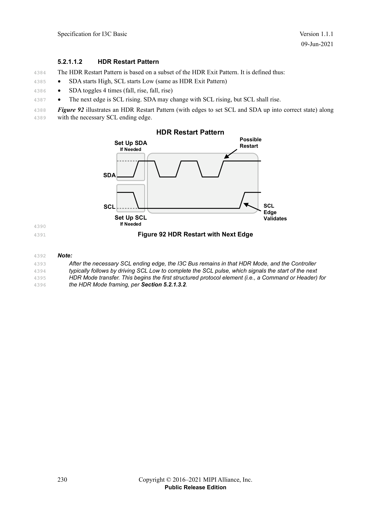

**`4392`** _**Note:**_ **`4393 4394 4395 4396`** 

_After the necessary SCL ending edge, the I3C Bus remains in that HDR Mode, and the Controller typically follows by driving SCL Low to complete the SCL pulse, which signals the start of the next HDR Mode transfer. This begins the first structured protocol element (i.e., a Command or Header) for the HDR Mode framing, per_ _**Section 5.2.1.3.2** ._ 

Copyright © 2016–2021 MIPI Alliance, Inc. **Public Release Edition** 

230 

Version 1.1.1 09-Jun-2021 

Specification for I3C Basic 

## **5.2.1.1.3 HDR Exit Pattern Detector** 

> **`4397`** All I3C Targets shall include an HDR Exit Pattern Detector. The HDR Exit Pattern Detector shall be enabled **`4398`** only after an HDR Mode is entered, and shall be disabled after an HDR Exit pattern is detected. The HDR **`4399`** Exit Pattern Detector may be implemented either in digital logic, or in software (Bit Banged). **`4400`** The remainder of this Section presents an example digital logic implementation in both schematic view and **`4401`** in RTL code. **`4402`** The basic logic model is that SCL is held Low (0), and so SCL High (1) will reset the detector. It also only **`4403`** uses falling edges of SDA, hence treats SDA as a clock. The HDR Exit Pattern Detector schematic is shown **`4404`** in _**Figure 93**_ . 

**==> picture [417 x 65] intentionally omitted <==**

**----- Start of picture text -----**<br>
1 D Q D Q D Q D Q STOP<br>~SDA R ~SDA R ~SDA R ~SDA R<br>~SCL & isHDR<br>**----- End of picture text -----**<br>


**`4405 4406` Figure 93 Example HDR Exit Pattern Detector (Schematic)** 

**`4407`** The Detector uses an inverted version of SDA as a clock (so positive edge logic, but can use negative edge **`4408`** logic), and is reset when SCL is High (1), or when the block is not in HDR Mode. The asynchronous nature **`4409`** of the reset makes this safe. This is shown in _**Figure 94**_ . If the HDR Exit Pattern Detector were only using **`4410`** clocking logic, then it would not see any change at all (SDA posedge would always see SCL Low in this **`4411`** example). Because the Detector uses an asynchronous reset on SCL, a change in SCL will impact the counter, **`4412`** even in case (b) above. Note that SCL and SDA will still be approximately 50 ns between changes. So, as **`4413`** shown, if SCL rises at any time, then the HDR Exit Pattern Detector shall be reset, and therefore will not **`4414`** mistakenly signal a false Exit. 

**==> picture [241 x 61] intentionally omitted <==**

**----- Start of picture text -----**<br>
SDA SDA<br>SCL SCL<br>a) As Emitted by HDR b) As Seen by Target<br>**----- End of picture text -----**<br>


**`4415 4416` Figure 94 Metastable Changes on SCL and SDA Do Not Break the Exit Pattern Detector** 

Copyright © 2016–2021 MIPI Alliance, Inc. **Public Release Edition** 

231 

Specification for I3C Basic 

Version 1.1.1 09-Jun-2021 

**`4417`** An example RTL implementation of the _**Figure 93**_ schematic is shown in _**Listing 1**_ . **`4418` Listing 1 Example RTL Code for HDR Exit Pattern Generator** **`4419`** `wire          scl_rst_n;` **`4420`** `wire          SDA_clk_n;      // ~SDA as clock` **`4421`** `reg[3:0]     stp_cnt;        // HDR STOP counter (shift chain)` **`4422 4423`** `assign scl_rst_n = ~iSCL & iIsInHDR; // SCL=1 resets` **`4424`** `// next uses glitch free XOR for SDA clock. Only inverts` **`4425`** `// SDA as clock if not in scan. Could add a clock mux` **`4426`** `// so uses one common clock in scan.` **`4427`** `SAFE_CLK_XOR sda_neg_clk(iSDA, ~scan_mode, SDA_clk_n);` **`4428 4429`** `// counter for 3 and 4 rising SDA when SCL is High` **`4430`** `// (else SCL resets). Whole thing held in reset if` **`4431`** `// not in HDR Mode` **`4432`** `always @ (posedge SDA_clk_n or negedge scl_rst_n)` **`4433`** `if (~scl_rst_n)` **`4434`** `stp_cnt <= 4'd0;          // SCL High or not HDR` **`4435`** `else` **`4436`** `stp_cnt <= {stp_cnt[2:0], 1'b1}; // shift chain counter` **`4437 4438`** `assign oHDR_STOP = stp_cnt[3]; // detects Exit (STOP)` 

Copyright © 2016–2021 MIPI Alliance, Inc. **Public Release Edition** 

232 

Version 1.1.1 09-Jun-2021 

Specification for I3C Basic 

## **5.2.1.1.4 HDR Restart and Exit Pattern Detector** 

> **`4439`** Any I3C Target that supports at least one HDR Mode shall include HDR Restart Pattern detection. While this **`4440`** function is easily incorporated into the required HDR Exit Pattern Detector, or may be part of HDR Mode **`4441`** support, the particular design is not mandated by this Specification (i.e., is up to the manufacturer). The HDR **`4442`** Restart Pattern Detector may be implemented either in digital logic or in software (Bit Banged). 

**`4443`** The remainder of this Section presents an example digital logic implementation in both schematic view and **`4444`** in RTL code, building upon the HDR Exit Pattern Detector presented in _**Section 5.2.1.1.3**_ . 

**`4445`** The basic logic model is that SCL is held Low (0) and so SCL High (1) will reset the main detector. It also **`4446`** uses falling edges of SDA primarily, hence treats SDA as a clock. The HDR Restart is then detected only **`4447`** when two falling edges have been seen, and verifies the rising edge and then SCL change that is required for **`4448`** an HDR Restart. 

**`4449`** The combined HDR Restart and Exit Pattern Detector schematic is shown in _**Figure 95**_ . 

**==> picture [415 x 119] intentionally omitted <==**

**----- Start of picture text -----**<br>
D Q D Q HDR<br>Restart<br>isHDR<br>SDA R SCL R<br>isHDR & ~restart_done<br>1 D Q D Q D Q D Q HDR<br>Stop<br>~SDA R ~SDA R ~SDA R ~SDA R<br>**----- End of picture text -----**<br>


```
4450
```

**~SCL & isHDR** 

**`4451` Figure 95 Combined HDR Restart and Exit Pattern Detector (Schematic)** 

**`4452`** This Detector design builds on the HDR Exit Pattern Detector. After exactly two SDA falling edges are seen, **`4453`** followed by a rising edge, the HDR Restart Pattern Detector checks for the rising edge of SCL. It does not **`4454`** matter whether SDA also falls at the same time; the rising SCL is the key. This works because even if SDA **`4455`** were falling (and therefore triggering the next flop in the HDR Exit Pattern Detector), the upper-left flop will **`4456`** still hold 1 because it has not yet seen a rising edge on SDA. **`4457`** An example RTL implementation of the _**Figure 95**_ schematic is shown in _**Listing 2**_ . 

Copyright © 2016–2021 MIPI Alliance, Inc. **Public Release Edition** 

233 

Specification for I3C Basic 

Version 1.1.1 09-Jun-2021 

## **Listing 2 Example RTL Code for Combined HDR Pattern Detector: Exit and Reset** 

```
4458
4459   wire          scl_rst_n;
4460   wire          restart_rst_n;
4461   wire          SDA_clk_n;      // ~SDA as clock
4462   reg[3:0]     stp_cnt;        // HDR STOP counter (shift chain)
4463   reg           poss_restart;   // possible restart
4464   reg           is_restart;
4465
4466   assign scl_rst_n     = ~iSCL & iIsInHDR; // SCL=1 resets
4467   assign restart_rst_n = ~iRestartDone & iIsInHDR;
4468
4469   // next uses glitch free XOR for SDA clock. Only inverts
4470   // SDA as clock if not in scan. Could add a clock mux
4471   // so uses one common clock in scan.
4472   SAFE_CLK_XOR sda_neg_clk(iSDA, ~scan_mode, SDA_clk_n);
4473
4474   // counter for 3 and 4 rising SDA when SCL is High
4475   // (else SCL resets). Whole thing held in reset if
4476   // not in HDR Mode
4477   always @ (posedge SDA_clk_n or negedge scl_rst_n)
4478     if (~scl_rst_n)
4479       stp_cnt <= 4'd0;          // SCL High or not HDR
4480     else
4481       stp_cnt <= {stp_cnt[2:0], 1'b1}; // shift chain counter
4482
4483   assign oHDR_STOP = stp_cnt[3];// detects Exit (STOP)
4484
4485   // Possible Restart means exactly 2 falling edges
4486   // of SDA and then rising edge of SDA. Actual
4487   // Restart is from SCL then rising
4488   always @ (posedge iSDA or negedge restart_rst_n)
4489     if (~restart_rst_n)
4490       poss_restart <= 1'b0;     // Restart ACK or not HDR
4491     else if (stp_cnt[1] & ~stp_cnt[2]) // after 2nd fall only
4492       poss_restart <= 1'b1;     // SDA rise after 2 falls
4493     else
4494       poss_restart <= 1'b0;     // else not possible restart
4495
4496   always @ (posedge SCL or negedge restart_rst_n)
4497     if (~restart_rst_n)
4498       is_restart <= 1'b0;       // Restart ACK or not HDR
4499     else if (poss_restart)
4500       is_restart <= 1'b1;       // SCL rises after SDA does
4501     else
4502       is_restart <= 1'b0;       // else not restart
```

## **5.2.1.1.5 Compatibility of HDR Pattern Detection and Ternary Modes** 

> **`4503`** This section is not included in the I3C Basic Specification because I3C Basic does not support the HDR **`4504`** Ternary Modes. To gain access to this capability, please contact MIPI Alliance. 

Copyright © 2016–2021 MIPI Alliance, Inc. **Public Release Edition** 

234 

Version 1.1.1 09-Jun-2021 

Specification for I3C Basic 

## **5.2.1.2 CCC Framing in HDR Modes** 

> **`4505`** Special framings are used for transmitting Common Command Codes in HDR Modes. CCCs that are **`4506`** supported in any HDR Modes may be sent by an Active Controller, so long as it has entered the HDR Mode **`4507`** using the Enter HDR Mode CCC (see CCCs **Enter HDR Mode 0** through **7** , _**Section 5.1.9.3.9**_ ). Both **`4508`** Broadcast and Direct CCCs are supported, with framing details specific to each HDR Mode. As noted in **`4509`** _**Table 61**_ , not all CCCs may be used in HDR Modes. Additionally, support for any CCCs in any particular **`4510`** HDR Mode for a Target is optional. Target Devices may implement support for some or all of the Command **`4511`** Codes that per _**Table 61**_ may be used in HDR Modes, as well as other Command Codes reserved for use by **`4512`** a particular MIPI Alliance Working Group or set aside for Vendor Extensions. Generally, Target Devices may **`4513`** implement support in HDR Modes for a subset of all permitted Command Codes that they might support in **`4514`** SDR Mode. **`4515`** The Controller shall authoritatively know which Targets are active and support a particular HDR Mode, in **`4516`** order to determine whether a given Target will understand any Broadcast or Direct CCCs sent within an **`4517`** active HDR Mode. The Controller shall also determine which Targets support I3C v1.1 or I3C Basic v1.1.1 **`4518`** or later, and if so, which of them support a CCC within that HDR Mode. The Controller should have _a priori_ **`4519`** knowledge, otherwise it may determine this by attempting to receive an acknowledgement of a Direct CCC **`4520`** in a manner specific to the HDR Mode (see _**Section 5.2.1.2.3**_ ). For any Targets that do not support a given **`4521`** CCC in that HDR Mode, the Controller may need to re-send that CCC in another supported HDR Mode, or **`4522`** in SDR Mode. **`4523`** _**Table 61**_ summarizes which CCCs are permitted in HDR Modes, noting any per-HDR-Mode limitations and **`4524`** other advisory information. 

Copyright © 2016–2021 MIPI Alliance, Inc. **Public Release Edition** 

235 

Specification for I3C Basic 

Version 1.1.1 09-Jun-2021 

```
4525
```

**Table 61 CCCs Permitted in HDR Modes, with Notes and Limitations** 

|**CCC**|**Type**|**Command**<br>**Name**|**Notes and Limitations**|
|---|---|---|---|
|**Broadcast**|**Direct**|||
|X|X|**ENEC**<br>**DISEC**|May not generally be useful in HDR Modes, as the Controller would need to exit<br>HDR and return to SDR Mode for the Target to be able to raise any of the request<br>types that are affected by these CCCs; see**_Section 5.2.1.2.4_**.|
|X|X|**ENTAS0**<br>**ENTAS1**<br>**ENTAS2**<br>**ENTAS3**|See**_Section 5.2.1.2.4_**.|
|X|–|**DEFTGTS**|Not recommended for use in HDR Modes; generally only used for Secondary<br>Controllers, to announce lists of known Targets, following changes to Target<br>Dynamic Addresses or Hot-Join events, neither of which are permitted within HDR<br>Modes|
|||||
|X|X|**SETMWL**<br>**SETMRL**|See**_Section 5.2.1.2.4_**.|
|–|X|**GETMWL**<br>**GETMRL**|No limitations|
|||||
|X|–|**SETBUSCON**|Not recommended for use in HDR Modes|
|X|X|**ENDXFER**|Not recommended for use in HDR Modes|
|X|X|**SETXTIME**|No limitations|
|–|X|**GETXTIME**|No limitations|
|X|X|**RSTACT**|Not recommended for use in HDR Modes|
|–|X|**SETGRPA**|Target support for Group Addresses may vary; Target support for receiving HDR<br>CCCs directed to Group Addresses may vary; see**_Section 5.2.1.2.4_**.|
|X|–|**DEFGRPA**|Generally only used for Secondary Controllers, to announce lists of Targets<br>assigned to a known Group Address after prior use of**SETGRPA**and**RSTGRPA**<br>CCCs|
|||||
|X|X|**RSTGRPA**|See**_Section 5.2.1.2.4_**.|
|X|X|**MLANE**|Broadcast or Direct SET versions of this CCC are generally not recommended for<br>use in HDR Modes; Targets that support Direct GET versions of this CCC shall<br>respond according to the HDR Mode framing for the active HDR Mode, instead of<br>the “test mode” which returns the same data on any Additional Data Lanes (as<br>defined in SDR Mode, see**_Figure 86_**); see**_Section 5.2.1.2.4_**. and<br>**_Section 5.2.1.2.5_**.|
|–|X|**GETBCR**<br>**GETDCR**|Not recommended for use in HDR Modes; usually only used once per Target,<br>during Bus Initialization|
|–|X|**GETSTATUS**|No limitations|
|–|X|**SETBRGTGT**|See**_Section 5.2.1.2.4_**.|
|–|X|**GETMXDS**|No limitations|
|–|X|**GETCAPS**|No limitations|
|–|X|**SETROUTE**|See**_Section 5.2.1.2.4_**.|
|–|X|D2DXFER|This CCC is not included in I3C Basic (see**_Table 16_**)|


Copyright © 2016–2021 MIPI Alliance, Inc. **Public Release Edition** 

236 

Version 1.1.1 09-Jun-2021 

Specification for I3C Basic 

**`4526`** _**Table 62**_ summarizes which CCCs are not permitted in any HDR Mode, with the reason for each CCC. 

```
4527
```

## **Table 62 CCCs Not Permitted in HDR Modes** 

|**CCC**|**Type**|**Command**<br>**Name**|**Reason**|
|---|---|---|---|
|**Broadcast**|**Direct**|||
|X|X|**RSTDAA**|Target Dynamic Address changes are a fundamental configuration change, which<br>should be done in SDR Mode only.|
|X|–|**ENTDAA**|Dynamic Address Assignment can only be performed in SDR Mode.|
|X|–|**ENTTM**|Test Mode can only be performed in SDR Mode. Test Mode is generally only used<br>for manufacturing or Device test.|
|||||
|X|–|**ENTHDR0**<br>through<br>**ENTHDR7**|HDR Modes can only be entered from SDR Mode. There is no provision for switching<br>directly to a different HDR Mode, it is necessary to exit to SDR Mode first.|
|||||
|X|–|**SETAASA**|Dynamic Address Assignment can be done in SDR Mode only. In addition,<br>SETAASA (if supported) is typically used only once per Bus, during Bus Initialization<br>which always takes place in SDR Mode.|
|||||
|–|X|**SETDASA**|Dynamic Address Assignment can be done in SDR Mode only. In addition,<br>SETDASA (if supported) is typically used only once per Target, during Bus<br>Initialization which always takes place in SDR Mode.|
|–|X|**SETNEWDA**|Target Dynamic Address changes are a fundamental configuration change, which<br>should be done in SDR Mode only.|
|–|X|**GETPID**|Usually only associated with the**ENTDAA**CCC, or when a Secondary Controller that<br>was not present during Bus Initialization becomes Active Controller (pursuant to a<br>GETACCCR CCC) and requests information about a Target Device.|
|–|X|**GETACCCR**|The Controller Handoff procedure is only supported in SDR Mode.|


Copyright © 2016–2021 MIPI Alliance, Inc. **Public Release Edition** 

237 

Specification for I3C Basic 

Version 1.1.1 09-Jun-2021 

## **5.2.1.2.1 Elements, Framing and Modality** 

> **`4528`** Within each HDR Mode, the framing for CCC flows differs from other HDR read/write transactions, **`4529`** providing a modality similar to the way CCCs are framed in SDR Mode. 

**`4530`** This Specification defines a number of common Flow Elements (such as Word and Blocks) that together **`4531`** provide a generic framing model that can be used to describe the CCC flows for each individual HDR Mode. 

**`4532`** The following Flow Elements are defined, where ‘x’ represents an HDR Mode: 

## **`4533`** • **HDR-x CCC Header Block** 

```
4534
```

```
4535
```

This Block has two variants: 

   - Type Indicator 

- **`4536`** • Type Selector 

## **`4537`** • **HDR-x Header Block** 

- **`4538`** This Block signals the end of a CCC Frame for the particular HDR Mode. It is neither an Indicator **`4539`** nor a Selector. 

## **`4540`** • **HDR-x CCC Data Block** 

**`4541`** This Block has three variants: 

```
4542
```

   - When sent by the Controller as part of a Broadcast CCC flow 

- **`4543`** • When sent by the Controller as part of a Direct Write or Direct SET CCC flow (i.e., in a Write **`4544`** Segment) 

- **`4545`** • When sent by an addressed Target as part of a Direct Read or Direct GET CCC flow (i.e., in a **`4546`** Read Segment) 

- **`4547`** • **HDR-x CCC Termination Marker** 

**`4548`** This marker is sent only as needed, i.e., is optional per the particular HDR Mode and per the **`4549`** position in a type of CCC flow. 

**`4550`** All of the above Flow Elements are common CCC Flow Elements, except the Write Segment and Read **`4551`** Segment variants of HDR-x CCC Data Block, and specific variants of the termination marker (optional). All **`4552`** Target Devices that support CCCs in an HDR Mode must be able to successfully receive and understand **`4553`** these common CCC Flow Elements, in order to track their place within the CCC flows, to know when to **`4554`** enter the modality (and to know when it has been ended), and to understand when they are being specifically **`4555`** addressed in a Direct CCC flow. 

**`4556`** The beginning of a CCC in an HDR Mode is indicated by use of an HDR-x CCC Header Block of type **`4557`** Indicator. This is an HDR-x Header Block containing a special byte value (i.e., the Broadcast Address, 7’h7E) **`4558`** instead of a Target Address. This is different from the beginning of other HDR transactions. 

**`4559`** The format of the Indicator HDR-x CCC Header Block is specified separately for each HDR Mode, but **`4560`** generally includes the Indicator, the Command Code, and the optional Defining Byte. If the HDR-x CCC **`4561`** Header Block includes a bitfield for the Defining Byte that is always present, then for CCCs that support an **`4562`** optional Defining Byte, a Defining Byte value of 8’h0 shall be equivalent to omitting the Defining Byte. This **`4563`** shall have the same effect as omitting the optional Defining Byte in SDR Mode for the same CCC. 

**`4564` For Broadcast CCCs** , the Controller shall send the HDR-x CCC Header Block of type ‘Indicator’, containing **`4565`** the Command Code and optional Defining Byte, followed by one or more HDR-x CCC Data Blocks, **`4566`** containing the data bytes to be Broadcast to all supported Target Devices. 

Copyright © 2016–2021 MIPI Alliance, Inc. **Public Release Edition** 

238 

Version 1.1.1 09-Jun-2021 

Specification for I3C Basic 

**`4567` For Direct CCCs** , the Controller shall send the HDR-x CCC Header Block of type ‘Indicator’, containing the **`4568`** Command Code and optional Defining Byte. The Controller shall then send the HDR Restart Pattern, and **`4569`** then start a new Segment by sending another HDR-x CCC Header Block, but of Selector type: it includes a **`4570`** Target Address and indicates whether the Direct CCC Segment is a Write Segment vs. a Read Segment. 

- **`4571`** • For a Direct Write or Direct SET CCC with data, the Controller generally sends one or more **`4572`** HDR-x CCC Data Blocks if the selected CCC’s defined format so indicates. However, if the **`4573`** CCC’s defined format includes no data to be sent to the Target (i.e., if a zero-byte ‘Write’ to the **`4574`** Target for a given Command Code and optional Defining Byte is sufficient to instruct the Target to **`4575`** take some action), then the Controller would send the minimum number of HDR-x CCC Data **`4576`** Blocks for the HDR Mode’s framing. In some cases, this might be zero Data Blocks, if the HDR **`4577`** Mode permits. 

- **`4578`** • If the Direct Write or Direct SET CCC requires a Sub-Command Byte, then the Controller **`4579`** shall send this Sub-Command Byte as the first byte in the Write Segment’s data message, **`4580`** which is the first HDR-x CCC Data Block. 

- **`4581`** • For a Direct Read or Direct GET CCC, the Controller shall allow the addressed Target to control **`4582`** the Bus, and the Target may send one or more HDR-x CCC Data Blocks if the selected CCC’s **`4583`** defined format so indicates. After the end of the Segment, the Controller shall resume control. 

**`4584` For either Broadcast or Direct CCCs** , the Controller and the Targets shall observe all HDR Mode specific **`4585`** framing requirements: 

- **`4586`** • For zero-byte CCCs or very short CCCs, if a minimum number of HDR-x CCC Data Blocks must **`4587`** be sent for the HDR Mode’s framing, then the sender shall provide dummy byte values of 0x00 in **`4588`** these Data Blocks, and the receiver shall correctly ignore these values, per the specific CCC **`4589`** definition. 

- **`4590`** • If the length of a CCC’s data message is not evenly aligned to the size of the HDR-x CCC Data **`4591`** Block, then the sender shall pad the end of the data message with dummy byte values of 0x00, and **`4592`** the receiver shall correctly ignore any dummy byte values, per the specific CCC definition. 

**`4593`** To end either a Broadcast CCC or a Direct CCC, the Controller shall use any HDR-x CCC End Procedure **`4594`** that is valid for that HDR Mode. 

**`4595`** As part of the data message that is either sent by the Controller (i.e., as part of a Broadcast CCC or a Write **`4596`** Segment for a Direct CCC), or sent by a Target (i.e., as part of a Read Segment for a Direct CCC), the sender **`4597`** shall denote the end of the data message by including an appropriately-constructed HDR-x CCC Termination **`4598`** Marker, in a format specific for the particular HDR Mode and transaction type. The Controller shall also **`4599`** include a Termination Marker at the end of the Selector type HDR-x CCC Header Block that begins the **`4600`** framing for a Direct CCC, before starting any Read or Write Segments. In both cases, this Termination Marker **`4601`** is required to allow the receiver to properly understand the end of the header block or data message and take **`4602`** the appropriate action to fit within the signaling for that HDR Mode. 

**`4603`** Because a Termination Marker can also serve as the transition before the next common CCC Flow Element, **`4604`** it may include signaling acknowledging the preceding Flow Element, or signaling that includes Bus **`4605`** Turnaround or other forms of Handoff between the Controller and an addressed Target. 

Copyright © 2016–2021 MIPI Alliance, Inc. **Public Release Edition** 

239 

Specification for I3C Basic 

Version 1.1.1 09-Jun-2021 

**`4606`** Depending on the specific HDR Mode and transaction type, this Termination Marker will take one of three **`4607`** possible forms: 

## **`4608`** 1. **CRC Block** 

## **`4609`** This Block includes valid CRC (checksum) data for the preceding HDR-x CCC Data Block(s) or **`4610`** HDR-x CCC Header Block. The receiver shall use the CRC data to verify that the data received **`4611`** from the sender is valid. 

- **`4612`** • For HDR-DDR Mode: The CRC Block is the HDR-DDR CRC Word (see _**Section 5.2.2.1**_ , **`4613`** _**Table 66**_ ). 

- **`4614`** • For HDR-BT Mode: The CRC Block is the HDR-BT CRC Block (see _**Section 5.2.4.3.3**_ ). 

**`4615`** 2. **Turnaround or Handoff Pattern** **`4616`** This form of Termination Marker is a specific pattern indicating Bus Turnaround or Handoff back **`4617`** to the Controller, if so indicated by the direction of transfer. 

- **`4618`** 3. **No Termination Marker** 

**`4619`** Under particular conditions, no Termination Marker _per se_ will be sent. 

**`4620`** After this optional Termination Marker, the Controller shall reassert its control of the Bus (if necessary) and **`4621`** then send (or complete) the HDR Restart Pattern, or else continue on to any valid HDR-x CCC End Procedure **`4622`** that is appropriate for that framing. 

**`4623`** Because the Termination Marker may take different forms, or may not exist on the I3C Bus at all depending **`4624`** on the particular HDR Mode or type of transaction, it is indicated generically in the following flow diagrams, **`4625`** using the label ‘TM’. 

**`4626`** At several points in the CCC flows it might be necessary for the Target to acknowledge receipt of a given **`4627`** Flow Element. In the following flow diagrams, such an acknowledgement may also serve as a Termination **`4628`** Marker; the label ‘ACK’ indicates such cases. 

**`4629`** _**Note:**_ 

**`4630`** _The exact location of an acknowledgement may vary, depending on the particular HDR Mode and the_ **`4631`** _flow control method used to indicate acknowledgement._ 

**`4632`** The framing for Direct CCCs also allows for multiple Target Addresses to be addressed, in a manner similar **`4633`** to the SDR Direct CCC framing model which addresses multiple Target Addresses as combinations of Read **`4634`** Segments (for Direct Read or Direct GET CCCs) and/or Write Segments (for Direct Write or Direct SET **`4635`** CCCs). The Controller may use this framing to address one or more Target Addresses by using multiple **`4636`** Segments, separated by the HDR Restart Pattern. When used in this manner the HDR Restart Pattern acts not **`4637`** as the end of the CCC (as it does with other, HDR traffic), but as the end of one Segment addressed to the **`4638`** indicated Target Address. 

**`4639`** _**Note:**_ **`4640`** _In this framing the HDR Restart Pattern serves as an equivalent of SDR Mode’s Repeated START in_ **`4641`** _Direct CCC framing (see_ _**Section 5.1.9.2.2** )._ 

**`4642`** Target Devices shall store the Command Code and its optional Defining Byte (as the Controller sent in the **`4643`** Indicator type HDR-x CCC Header Block) and act on them as individually addressed in this framing. The **`4644`** Command Code and optional Defining Byte values shall be stored for later use, if a Target matches its Target **`4645`** Address in a subsequent Selector type HDR-x CCC Header Block, until the end of the current modality is **`4646`** indicated via any HDR-x CCC End Procedure valid for the particular HDR Mode. 

Copyright © 2016–2021 MIPI Alliance, Inc. **Public Release Edition** 

240 

Version 1.1.1 09-Jun-2021 

Specification for I3C Basic 

**`4647`** The generic Broadcast CCC flow for the framings described above is shown in _**Figure 96**_ ; the generic Direct **`4648`** CCC flow for the framings described above is shown in _**Figure 97**_ . 

**==> picture [531 x 198] intentionally omitted <==**

**----- Start of picture text -----**<br>
HDR-x CCC Header Block (Indicator, CCC Command)<br>WRITE to Broadcast Address (7'h7E) Broadcast CCC, optional Defining Byte<br>S, Enter HDR or HDR RESTART (refer to specific HDR Mode coding) (refer to specific HDR Mode coding) ACK<br>HDR-x CCC Data Block TM #N VERSIONS<br>Selectable END of<br>Optional Data CCC Procedure END of this CCC<br>HDR-x CCC<br>(refer to specific HDR Mode coding) TM END PROCEDURE<br>From Controller to Target From Target to Controller<br>4649<br>4650  Figure 96 Begin Broadcast CCC Per HDR Mode<br>Write to all Targets  in this HDR Mode<br>**----- End of picture text -----**<br>


Copyright © 2016–2021 MIPI Alliance, Inc. **Public Release Edition** 

241 

Specification for I3C Basic 

Version 1.1.1 09-Jun-2021 

**==> picture [652 x 355] intentionally omitted <==**

**----- Start of picture text -----**<br>
HDR-x CCC Header Block (Indicator, CCC Command) TM<br>a<br>WRITE to Broadcast Address (7'h7E) Direct CCC, optional Defining Byte<br>Ld<br>S, Enter HDR or  TM +<br>(refer to specific HDR Mode coding) (refer to specific HDR Mode coding)<br>HDR RESTART ACK<br>a<br>HDR-x CCC Header Block (Selector) HDR-x CCC Data Block TM<br>oe<br>WRITE to Target or Group Address Repeat N times, for all Data<br>HDR<br>(refer to specific HDR Mode coding) ACK       (refer to specific HDR Mode coding)     TM<br>RESTART<br>HDR-x CCC Header Block (Selector) HDR-x CCC Data Block TM #N VERSIONS<br>Selectable END of<br>READ from Target Address Repeat N times, for all Data<br>CCC Procedure<br>HDR  HDR-x CCC<br>(refer to specific HDR Mode coding) ACK       (refer to specific HDR Mode coding)     TM<br>RESTART  END PROCEDURE<br>Controller to Target Handoff<br>END of this CCC<br>From Controller to Target From Target to Controller   Multi-Lane data permitted<br>4651  7 o<br>4652  Figure 97 Begin Direct CCC Per HDR Mode<br>(Direct SET)<br>Write segment<br>(Direct GET)<br>Read segment<br>**----- End of picture text -----**<br>


Copyright © 2016–2021 MIPI Alliance, Inc. **Public Release Edition** 

242 

Version 1.1.1 09-Jun-2021 

Specification for I3C Basic 

- **`4653`** The ending of the CCC modality shall be indicated by any HDR-x CCC End Procedure valid for the particular **`4654`** HDR Mode. The HDR Restart Pattern alone shall not indicate the end of the CCC flow, as it would end a **`4655`** normal HDR read/write command flow. All Target Devices that support CCCs in the particular HDR Mode **`4656`** shall detect the beginning of the CCC and interpret the HDR Restart Pattern appropriately for the CCC **`4657`** framing until they receive an HDR-x CCC End Procedure valid for that HDR Mode. Each HDR Mode may **`4658`** define several HDR-x CCC End Procedures, depending on the HDR Mode’s use cases and Frame formats. 

- **`4659`** Upon receiving a valid HDR-x CCC End Procedure, the Target shall either end the CCC modality and expect **`4660`** normal HDR traffic, or else immediately re-enter the CCC modality (depending on the type of procedure) by **`4661`** capturing a new Command Code and optional Defining Byte. Typically, a valid HDR-x CCC End Procedure **`4662`** starts with a common Flow Element, such as an Indicator type HDR-x CCC Header Block (or equivalent) to **`4663`** start a new CCC, or an HDR-x Header Block to end the CCC Frame. Such a Block shall be addressed to the **`4664`** Broadcast Address (7’h7E) and shall also indicate whether the modality is ended vs. re-entered for a new **`4665`** CCC. In this manner the Controller can use normal HDR traffic, Broadcast CCCs, and Direct CCCs in a **`4666`** continuous flow within a given HDR Mode, arranged in any sequential order, without needing to exit the **`4667`** HDR Mode to separate these commands or traffic flows. 

- **`4668`** _**Note:**_ 

- **`4669`** _A valid HDR-x CCC End Procedure for a particular HDR Mode that indicates the end of the CCC_ **`4670`** _modality might use the dummy command code 0x1F (see_ _**Table 16** ) instead of a valid CCC, if the_ **`4671`** _framing for that HDR Mode requires the Controller to use an additional Flow Element that would_ **`4672`** _otherwise contain the CCC in order to comply with valid transfers in that HDR Mode. This dummy_ **`4673`** _command code 0x1F is defined for this specific purpose. When using the dummy command code_ **`4674`** _0x1F, a dummy Defining Byte value 0x00 should also be used, if the additional Flow Element also has_ **`4675`** _a field that would otherwise contain a valid Defining Byte._ 

- **`4676`** The following HDR-x CCC End Procedures are recommended, but this is not an exhaustive list of End **`4677`** Procedures for any given HDR Mode: 

- **`4678`** • **HDR Restart Pattern followed by Indicator type HDR-x CCC Header Block** (or equivalent), **`4679`** indicating that the CCC modality is still active, but providing a new CCC and optional Defining **`4680`** Byte. Flow then proceeds as a new Broadcast or Direct CCC (see _**Figure 96**_ and _**Figure 97**_ ). 

- **`4681`** • **HDR Restart Pattern followed by HDR-x Header Block** (or equivalent) indicating that the CCC **`4682`** modality is ended or no longer in ‘continuation’, followed by an optional Termination Marker to **`4683`** indicate the end of a transfer, followed by another HDR Restart Pattern (see _**Figure 101**_ ). Flow **`4684`** then proceeds as standard HDR read/write transactions. 

- **`4685`** • Any End Procedure that indicates that the CCC modality is ended must be distinct from the **`4686`** previous End Procedure, in order that all Target Devices may clearly recognize it and interpret **`4687`** subsequent HDR transactions as standard HDR read/write transactions. Typically, this **`4688`** requires its first Flow Element (i.e., the HDR-x Header Block) to be clearly recognized as **`4689`** neither an Indicator nor a Selector. 

- **`4690`** • An **optional variant** of the above, which ends with the HDR Exit Pattern instead of the HDR **`4691`** Restart Pattern. HDR Mode is then exited, and the Bus returns to SDR Mode. 

- **`4692`** • **HDR Exit Pattern** 

- **`4693`** The recommended HDR-x CCC End Procedures are shown in _**Figure 98**_ . 

Copyright © 2016–2021 MIPI Alliance, Inc. **Public Release Edition** 

243 

Specification for I3C Basic 

Version 1.1.1 09-Jun-2021 

**==> picture [516 x 396] intentionally omitted <==**

**----- Start of picture text -----**<br>
Last HDR-x CCC Header or Data Block TM<br>Preceding Command or Data<br>PRECEDING WRITE TM<br>PRECEDING READ TM<br>HDR-x CCC Header Block (Indicator, CCC Command)<br>WRITE to Broadcast Address (7'h7E) New CCC  <Bcast or Direct + Opt Def Byte><br>HDR<br>RESTART  (refer to specific HDR Mode coding) (refer to specific HDR Mode coding)<br>END of this CCC<br>HDR-x Header Block (no Indicator or CCC) TM<br>End modality, Broadcast Address (7'h7E) No CCC<br>HDR  HDR RESTART<br>RESTART  (refer to specific HDR Mode coding) TM or HDR EXIT<br>END of this CCC<br>END of this CCC<br>HDR EXIT<br>From Controller to Target From Target to Controller<br>Figure 98 End of CCC Procedures Per HDR Mode<br>“modality”<br>Remain in CCC<br>Return to HDR  reads or writes<br>**----- End of picture text -----**<br>


```
4694
4695
```

Copyright © 2016–2021 MIPI Alliance, Inc. **Public Release Edition** 

244 

Version 1.1.1 09-Jun-2021 

Specification for I3C Basic 

**`4696`** In the figures above, the labels HDR-x CCC Header Block, HDR-x CCC Data Block, and Termination **`4697`** Marker (if supported) represent generic, higher-level elements of the flow for sending CCCs in all of the **`4698`** HDR Modes. In actual practice the specific sizes of the Blocks, their bitfield formats, and data encodings on **`4699`** the Bus vary depending on the particular HDR Mode being used. _**Table 63**_ shows, for each HDR Mode that **`4700`** supports CCCs, where to find the CCC coding details for each Flow Element when using that HDR Mode. 

```
4701
```

**Table 63 HDR CCC Details Per HDR Mode** 

|**HDR Mode**|**See Section**|**CCC Coding**<br>**Details Section**|**Begin**<br>**Broadcast CCC**|**Begin Direct**<br>**CCC**|**CCC End**<br>**Procedures**|
|---|---|---|---|---|---|
|HDR-DDR|**_5.2.2_**|**_5.2.2.2.1_**|**_Figure 108_**|**_Figure 109_**|**_Figure 110_**|
|HDR-BT|**_5.2.4_**|**_5.2.4.4_**|**_Figure 124_**|**_Figure 125_**|**_Figure 126_**|


Copyright © 2016–2021 MIPI Alliance, Inc. **Public Release Edition** 

245 

Specification for I3C Basic 

Version 1.1.1 09-Jun-2021 

## **5.2.1.2.2 Broadcast Address ACK** 

> **`4702`** When addressing all Targets using Broadcast CCCs, or when starting the Direct CCC flow, the Controller **`4703`** shall send an Indicator type HDR-x CCC Header Block to signal that it is trying to write to all Targets. This **`4704`** Indicator block shall include the Broadcast Address (7’h7E) and will generally take the form of a Write **`4705`** command for that HDR Mode. 

**`4706`** Each Target Device that supports CCC flows in that HDR Mode and receives an Indicator block shall use a **`4707`** valid HDR Flow Control method for that HDR Mode to acknowledge the Indicator block. This **`4708`** acknowledgement indicates that it has received the Indicator block, has acknowledged the beginning of the **`4709`** Broadcast CCC or Direct CCC (i.e., has entered the modality), and is ready to participate. The Target shall **`4710`** acknowledge even if it decides not to act on (or even if it does not support) the particular CCC or its optional **`4711`** Defining Byte. 

**`4712`** _**Note:**_ **`4713`** _Acknowledging the Indicator block is equivalent to SDR Mode CCC Framing, where all Targets must_ **`4714`** _acknowledge the Broadcast Address at the beginning of a CCC._ **`4715`** _For Direct CCC flows, acknowledgement of the Indicator block serves the important function of_ **`4716`** _ensuring that the Target Device agrees to capture the Command Code and optional Defining Byte,_ **`4717`** _and is ready to be addressed by any subsequent Selector blocks in this Direct CCC flow. By_ **`4718`** _acknowledging the Indicator block, the Target signals that will capture these values into its internal_ **`4719`** _state and use them to decide whether to respond to that particular Command Code and optional_ **`4720`** _Defining Byte, if it matches its Target Address in a subsequent Selector block that begins a Read or_ **`4721`** _Write Segment. In this case, the Target is considered to be ‘primed’ with the captured values, and_ **`4722`** _capable of making a rapid ACK/NACK decision at the correct point in the flow._ **`4723`** _If one such Target on the Bus is unable to respond and does not acknowledge the Indicator block,_ **`4724`** _then this is equivalent to a NACK of the Broadcast Address in the Indicator block, for that HDR Mode._ **`4725`** _However, if other Targets on the Bus are present and are able to acknowledge the Indicator block,_ **`4726`** _then one Target’s failure to acknowledge the Indicator block must not block the CCC flow from_ **`4727`** _continuing. This typically requires the HDR Mode to define a common flow control method that can be_ **`4728`** _used by multiple Targets (e.g., passive NACK, active ACK) for a Write command. If this flow control_ **`4729`** _method is not enabled by default, then the Controller must enable it for the Bus, as appropriate for the_ **`4730`** _HDR Mode, before sending any CCCs in that HDR Mode._ **`4731`** The Controller shall use this acknowledgement to ensure that the CCC flow is being received by at least one **`4732`** Target in that HDR Mode. If the Controller does not receive acknowledgement from at least one Target, then **`4733`** it should initiate an error recovery procedure, which might include exiting HDR Mode and attempting to re- **`4734`** send the CCC in SDR Mode. **`4735`** _**Note:**_ **`4736`** _If a Bus has multiple Target Devices that support CCC flows in that HDR Mode, then they shall all_ **`4737`** _acknowledge the Indicator block together._ **`4738`** In _**Figure 96**_ and _**Figure 97**_ , the location for acknowledgement is shown after the Indicator type HDR-x CCC **`4739`** Header Block. The specific location and method for the Target to indicate its acknowledgment of the Indicator **`4740`** block is specific to the particular HDR Mode, but generally includes some active state change that is driven **`4741`** by the Target, and that can be measured by the Controller. 

Copyright © 2016–2021 MIPI Alliance, Inc. **Public Release Edition** 

246 

Version 1.1.1 09-Jun-2021 

Specification for I3C Basic 

## **5.2.1.2.3 Direct CCC ACK/NACK and Retry** 

> **`4742`** When addressing specific Targets using Direct CCCs in HDR Modes, the Controller shall indicate whether **`4743`** it is trying to read from the Target (i.e., a Direct Read or Direct GET) or write to the Target (i.e., a Direct **`4744`** Write or Direct SET). The Target Device may use a valid HDR Flow Control method to indicate that it cannot **`4745`** respond to a read request, or decline a write request at any point, in a manner equivalent to SDR Mode CCC **`4746`** Framing where it would NACK its own Target Address for a Direct CCC (see _**Section 5.1.9.2.2**_ ). 

**`4747`** In _**Figure 97**_ , the acknowledgement is shown after the Selector type HDR-x CCC Header Block for a Read **`4748`** Segment and a Write Segment. The specific location and method for the Target to indicate its part in the **`4749`** acknowledgment of the Selector block and agreement to respond to the Direct CCC with optional Defining **`4750`** Byte is specific to the particular HDR Mode, but generally includes some active state change that is driven **`4751`** by the Target, and that can be measured by the Controller. 

**`4752`** Note that _**Figure 97**_ illustrates an example HDR Direct SET/GET CCC. However, this flow can also be **`4753`** applied to a Direct SET or a Direct GET, as the Read Segments and Write Segments are optional and can **`4754`** appear in any order as defined for the particular CCC. Some CCCs might not have any Write or Read **`4755`** Segments, and in some cases the HDR-x CCC Data Block might be omitted if the CCC doesn’t define any **`4756`** data to write to or read from a Target. Multiple Segments may address the same Target, or different Targets. **`4757`** If a Target is not able to respond to a Direct GET CCC immediately on the first attempt by the Controller, **`4758`** then it may use a method specific to the chosen HDR Mode to decline to respond, similar to a NACK of its **`4759`** own Target Address in SDR Mode. The Controller shall follow the same Direct GET CCC Retry model used **`4760`** in SDR Mode (see _**Section 5.1.9.2.3**_ ), and the Target should generally respond on the second attempt. 

**`4761`** A Target indicating a delayed response on the first attempt is not the same as a Target choosing to NACK its **`4762`** own Target Address to indicate that it does not support a given CCC and Defining Byte. As with SDR Mode, **`4763`** in this case the Controller would make a second attempt, and the Target would also decline to respond on the **`4764`** second attempt. 

**`4765`** However, if a Target declines to respond to another type of Direct CCC (i.e., not a Direct GET CCC) on the **`4766`** first attempt, then it might not support the given CCC and Defining Byte, in which case the Retry model **`4767`** would not necessarily apply. 

**`4768`** The Controller may also address Groups using Direct Write or Direct SET CCCs, if supported by the **`4769`** particular Direct CCC; other special conditions shall apply, per _**Section 5.2.1.2.6**_ . 

Copyright © 2016–2021 MIPI Alliance, Inc. **Public Release Edition** 

247 

Specification for I3C Basic 

Version 1.1.1 09-Jun-2021 

## **5.2.1.2.4 Implications for Device and Bus Configuration** 

> **`4770`** While it is not always recommended to use CCCs in HDR Modes that might change Bus configuration or **`4771`** Device configuration, this might be permitted if the Active Controller follows certain safety **`4772`** recommendations, and if the Target Devices obey a set of conventions per their optional support for these **`4773`** CCCs in HDR Modes. 

- **`4774`** • **For Direct SET CCCs that change a Device’s configuration** , a Target receiving that CCC shall **`4775`** verify such configuration changes after successfully receiving all data sent by the Controller (as **`4776`** indicated by a Termination Marker or other command coding elements specific to that HDR **`4777`** Mode) and then apply the configuration change immediately, at the end of the Frame for that **`4778`** Target. 

- **`4779`** • **For Broadcast CCCs that change Bus Configuration or Device Configuration for all valid Devices** , **`4780`** all Targets receiving that CCC shall verify such configuration changes after successfully receiving **`4781`** all data sent by the Controller (as indicated by a Termination Marker or other command coding **`4782`** elements specific to that HDR Mode) and then apply the configuration change immediately. 

**`4783`** It should also be clear that any Broadcast CCCs that announce updated Bus configuration data (e.g., **`4784`** DEFTGTS and DEFGRPA) while in HDR Mode will not be received by Target Devices that do not support **`4785`** that particular HDR Mode. In most circumstances, a Controller-capable Device should generally expect to **`4786`** use these CCCs in SDR Mode, unless it knows with certainty that all other Devices that need to receive this **`4787`** Bus configuration data (i.e., all Secondary Controllers) also support the same HDR Mode and support **`4788`** receiving these Broadcast CCCs in that HDR Mode. It is the Active Controller’s responsibility to ensure that **`4789`** all Secondary Controllers support the same HDR Mode before using these Broadcast CCCs in HDR Mode. 

**`4790`** Since custom CCCs can be defined by various MIPI Alliance WGs or Vendors for special purposes, some of **`4791`** these CCCs may also change additional aspects of Bus configuration or Device configuration, in order to **`4792`** enable as-yet-undefined use cases or features not yet covered by this Specification. **`4793`** _**Note:**_ **`4794`** _Groups that create their own CCCs (including MIPI Alliance WGs, outside standards groups, and_ **`4795`** _Vendors) may choose to define custom CCCs in any supported HDR Mode, and so should be aware_ **`4796`** _of the recommendations above when choosing whether to do so, and how to apply any configuration_ **`4797`** _changes based on data received from the Active Controller in HDR Mode._ 

## **5.2.1.2.5 Implications for Multi-Lane** 

> **`4798`** For I3C Buses that support Multi-Lane (ML) functionality (see _**Section 5.3**_ ), the Controller may configure **`4799`** any ML-compatible Target Devices to use additional data Lanes to increase data transfer rates, in a supported **`4800`** HDR Mode that supports multiple ML Frame formats using these additional data Lanes. 

**`4801`** _**Note:**_ 

**`4802`** _For I3C Basic, HDR-BT is the only HDR Mode that supports Multi-Lane (ML) functionality._ 

**`4803`** However, if some Target Devices that support this HDR Mode do not support the same ML Frame formats **`4804`** (i.e., if there is varying support for the number of additional data Lanes, or for alternate Data Transfer Codings **`4805`** with different ML Frame formatting), then compatibility issues can arise as these Target Devices would not **`4806`** be able to correctly receive and understand all the common CCC Flow Elements the Controller transmits. **`4807`** The same issues can arise if any of the Target Devices are configured to use ML Frame formats that are not **`4808`** mutually interoperable with the rest of the Target Devices, even if all Target Devices support such ML Frame **`4809`** formats. 

**`4810`** If a Controller chooses to use any ML Frame formats that use additional data Lanes and change the formatting **`4811`** of common CCC Flow Elements, then the Controller must ensure that all Target Devices can support (and **`4812`** are configured to use) mutually interoperable ML Frame formats before attempting to drive any CCC flows **`4813`** using such an ML Frame format. 

**`4814`** In general, all supported HDR Modes include a 1-Lane compatibility mode that is supported by all Multi- **`4815`** Lane capable Target Devices in their default configuration for that HDR Mode, as well as all Target Devices 

Copyright © 2016–2021 MIPI Alliance, Inc. **Public Release Edition** 

248 

Version 1.1.1 09-Jun-2021 

Specification for I3C Basic 

**`4816`** that only connect to one Lane. To ensure maximum compatibility, a Controller should generally use 1-Lane **`4817`** compatible ML Frame formats for the common CCC Flow Elements, so that all Target Devices can properly **`4818`** receive and understand the CCC flows. This includes all HDR-x CCC Header Blocks, and any HDR-x CCC **`4819`** Data Blocks that are part of Broadcast CCC flows. **`4820`** For such a Bus, if a Controller has previously configured some Target Devices to use an ML Frame format **`4821`** that uses additional data Lanes or different formatting, then the Controller must use a “compatibility mode” **`4822`** ML Frame format that uses the 1-Lane compatible Frame formatting to transmit all common CCC Flow **`4823`** Elements, and such Target Devices shall use the 1-Lane compatible Frame formatting to receive the common **`4824`** CCC Flow Elements. However, different formatting that uses additional data Lanes shall be used for per- **`4825`** Target transactions involving such Target Devices (if previously configured to do so) for the HDR-x CCC **`4826`** Data Blocks within the Read Segments or Write Segments of Direct CCC flows. 

**`4827`** Alternately, a Controller may configure all Target Devices to use an “alternate mode” Coding that uses **`4828`** additional data Lanes or different formatting, in order to increase the performance or efficiency of HDR CCC **`4829`** flows. Such an “alternate mode” Coding might intentionally be incompatible with the “compatibility mode” **`4830`** Coding for this HDR Mode, but it should not be used unless all Target Devices support it. The Controller **`4831`** must ensure that all Target Devices are configured to use a mutually interoperable “alternate mode” Coding, **`4832`** and the rules for the “alternate mode” Coding shall apply. 

**`4833`** The specifics of Multi-Lane support for each HDR Mode are listed in the Framing details (see _**Table 63**_ **`4834`** Each section describing a specific HDR Mode lists the Flow Elements that may utilize Multi-Lane Frame **`4835`** formatting, while maintaining compatibility with all other Target Devices that might not be configured to use **`4836`** ML Frame formats. The ML Frame formats that are mutually interoperable are also defined in this **`4837`** specification. 

**`4838`** Since the Controller has the responsibility for configuring Multi-Lane for the Bus and all compatible Target **`4839`** Devices as well as initiating the CCC flow, it shall conform to these requirements, and shall ensure that all **`4840`** configuration is successfully completed. Likewise, the Controller must ensure that any core CCC Flow **`4841`** Elements that must be received and understood by all Target Devices supporting that HDR Mode are sent in **`4842`** an appropriate ML Frame format, as defined in the ML Frame formats that have been configured for all Target **`4843`** Devices, and that all Target Devices are configured to be mutually interoperable with respect to these core **`4844`** CCC Flow Elements. Likewise, all Target Devices shall also correctly receive and understand the Indicator **`4845`** and Selector blocks of the CCC flow in that ML Frame format, even if they have been otherwise configured **`4846`** to use an ML Frame format that uses additional Lanes or a different ML Frame format for standard (i.e., non- **`4847`** CCC) HDR transactions. 

**`4848`** Use of the MLANE CCC within an HDR Mode should be managed carefully, since the Direct SET forms of **`4849`** this CCC provide the unique ability to change a Target Device’s ML Frame format, and that directly impacts **`4850`** a Target’s ability to receive and understand an HDR-x CCC Data Block sent by a Controller, and also impacts **`4851`** a Target’s ability to respond on the data Lanes in a format that the Controller expects it to utilize for a given **`4852`** ML Frame format. As such, any misunderstanding or mismatch of expectations between a Controller and a **`4853`** Target may result in communication errors, which would require the Controller to catch any resulting errors **`4854`** and initiate a recovery procedure to restore communications. 

**`4855`** In some situations, this may require temporarily resetting a Target’s ML Frame format using the MLANE **`4856`** CCC (see _**Section 5.1.9.3.30**_ ) with Defining Byte value 0x7F (see _**Table 56**_ ). The forthcoming Application **`4857`** Notes for I3C v1.1.1 _**[MIPI07]**_ is expected to include a more detailed recovery procedure which might require **`4858`** exiting HDR Mode if the Target fails to respond to this CCC with Defining Byte value 0x7F while in HDR **`4859`** Mode. To avoid these issues, it is strongly recommended to not use the Direct SET forms of this CCC within **`4860`** any HDR Mode, unless the Controller is able to ensure that all possible communication errors can be reliably **`4861`** detected and resolved. 

Copyright © 2016–2021 MIPI Alliance, Inc. **Public Release Edition** 

249 

Specification for I3C Basic 

Version 1.1.1 09-Jun-2021 

## **5.2.1.2.6 Implications for Group Addressing** 

> **`4862`** For I3C Target Devices that support Group Addresses, the Controller may choose to configure a Group **`4863`** Address and address multiple Targets in a Direct Write or Direct SET CCC form of any supported CCC **`4864`** within the HDR CCC flows, in a manner similar to Group Address support in Direct CCC flows within SDR **`4865`** Mode. In this manner, Group Addresses may be used in place of Dynamic (Target) Addresses in the common **`4866`** CCC Flow Elements (i.e., the Selector type HDR-x CCC Header Blocks for Direct CCC Write Segments), **`4867`** as long as the following conditions are met: 

- **`4868`** • The Selector Block must indicate a Direct CCC Write Segment, since per _**Section 5.1.4.4**_ a Group **`4869`** Address shall only be used for Write transfers in HDR Modes. 

- **`4870`** • All Targets that have been assigned to that Group Address using the SETGRPA CCC (see **`4871`** _**Section 5.1.9.3.27**_ ) must support CCC flows within that HDR Mode. 

- **`4872`** • All Targets in that Group shall ACK the Group Address when addressed by the Selector block for **`4873`** the Write Segment. 

- **`4874`** • If any Target in that Group is not able to respond to the Write Segment directed to the Group **`4875`** Address, then its failure to ACK the Group Address must not block the Write Segment from **`4876`** continuing, if the Controller detects that at least one other Target in that Group responds with an **`4877`** ACK. 

**`4878`** This typically requires the HDR Mode to define a common flow control method that must be **`4879`** enabled by the Controller before sending any CCCs to a Group Address (see _**Section 5.2.1.2.2**_ and **`4880`** _**Section 5.2.1.2.3**_ ). 

- **`4881`** For Bus configurations where Group Addressing is used in conjunction with Multi-Lane, the Controller shall **`4882`** ensure that all Targets that have been assigned to the same Group Address are configured to use mutually **`4883`** interoperable Data Transfer Codings, and have been configured to use the same ML Frame format (i.e., the **`4884`** same Data Transfer Coding and number of additional Lanes) for transfers addressed to that Group Address. **`4885`** The Controller must verify this before attempting to send a Direct Write or Direct SET CCC to a Group **`4886`** Address in a Bus configured for Multi-Lane with HDR CCC flows. 

- **`4887`** • If not all Targets in a Group are configured to use the same ML Frame format in a particular HDR **`4888`** Mode, then the Controller must configure such Targets to use a common ML Frame format that **`4889`** they all support. In some cases, this might mean using a 1-Lane compatible ML Frame format to **`4890`** send a Direct Write or Direct SET CCC to a Group Address. 

**`4891`** If a Target Device supports multiple current ML configurations for its assigned Group Addresses (per **`4892`** _**Section 5.3.1.1.1**_ ), then: 

- **`4893`** • Within the CCC flows in HDR Modes, such a Target shall use the Address in the Selector Block to **`4894`** determine which ML configuration to use, as it prepares to send or receive data in that Direct CCC **`4895`** Segment. If the Address matches a currently assigned Group Address, then it shall use the correct **`4896`** ML configuration for that Group Address instead of the ML configuration for its Dynamic **`4897`** Address. 

- **`4898`** • After assigning such a Target Device to any Group Address, that Target shall have an independent **`4899`** ML configuration associated with that Group Address, and the Controller might need to **`4900`** re-configure the Target’s ML configuration for CCCs directed to that Group Address (as a specific **`4901`** example of ML configuration requirements listed in _**Section 5.3.1.1.1**_ ). 

- **`4902`** • Such configuration changes shall not affect the ML configuration for the Target’s Dynamic **`4903`** Address(es), and the Controller may continue sending Direct CCCs to a Target’s Dynamic **`4904`** Address(es) using the previously configured ML Frame format for that Dynamic Address. 

Copyright © 2016–2021 MIPI Alliance, Inc. **Public Release Edition** 

250 

Version 1.1.1 09-Jun-2021 

Specification for I3C Basic 

> **`4905`** _**Note:**_ **`4906`** _The Target shall use the ML configuration (i.e., the currently configured ML Frame format) for its_ **`4907`** _Dynamic Address in order to properly receive all common CCC Flow Elements as defined in_ **`4908`** _**Section 5.2.1.2.1**_ ) _. This includes any HDR-x transfers that are addressed to the Broadcast Address,_ **`4909`** _which generally include the Indicator type HDR-x CCC Header Block as well as various HDR-x CCC_ **`4910`** _End Procedures that are defined for that HDR Mode. Such common CCC Flow Elements must be_ **`4911`** _sent by the Controller in a form that all Target Devices supporting that HDR Mode are configured to_ **`4912`** _understand and properly receive, in a mutually interoperable manner; and each such Target Device_ **`4913`** _shall respond according to such configuration, according to the current ML Frame format for that HDR_ **`4914`** _Mode._ 

**`4915`** _The requirements in this section are a specific application of other normative requirements in this_ **`4916`** _Specification (e.g.,_ _**Section 5.1.4.4** ,_ _**Section 5.1.9.3.30** , and_ _**Section 5.3.1.1.1** ). Such other sections_ **`4917`** _also include other requirements, restrictions, and recommendations for Target Devices, as well as the_ **`4918`** _Active Controller of the Bus. As the requirements in this section are intended for a specific use case_ **`4919`** _of HDR transfers as applied to CCC flows in HDR Modes, readers are warned not to interpret this_ **`4920`** _section as contradictory to any such requirements or restrictions in such other sections that govern all_ **`4921`** _Multi-Lane configuration and all HDR transfers (including HDR transfers sent to Group Addresses)._ 

## **5.2.1.2.7 Bus Efficiency** 

**`4922`** It should be expected that remaining within a given HDR Mode is more efficient for specific, traffic-intensive **`4923`** use cases, and that using CCCs while in HDR Mode will help maintain this efficiency by avoiding the need **`4924`** for the Controller to exit HDR Mode in order to send a CCC (as with SDR Mode). It is also likely that CCC **`4925`** data can be sent more quickly, by taking advantage of the increased data rates of the HDR Modes and Multi- **`4926`** Lane functionality (if supported and configured). **`4927`** However, depending on the Bus Configuration and its application and use cases, the Controller might **`4928`** occasionally need to exit HDR Mode, in order to provide a window for Target Devices to request In-Band **`4929`** Interrupts, the Controller Role, or Hot-Joins as may be required per the Bus Configuration and its application **`4930`** and use cases. 

Copyright © 2016–2021 MIPI Alliance, Inc. **Public Release Edition** 

251 

Specification for I3C Basic 

Version 1.1.1 09-Jun-2021 

## **5.2.1.3 Transition to HDR Mode Transfer** 

> **`4931`** The Controller is responsible for starting the HDR Mode transfer, which consists of sending the first **`4932`** structured protocol element, per the HDR Mode framing. The Controller shall do this after entering the HDR **`4933`** Mode for the first transfer in that HDR Mode (see _**Section 5.2.1.3.1**_ ), or after the HDR Restart Pattern for **`4934`** subsequent transfers in that same HDR Mode (see _**Section 5.2.1.3.2**_ ). 

**`4935`** In both cases, the specific timing of when the Controller drives SDA in relation to SCL depends on the HDR **`4936`** Mode signaling. In this section and its sub-sections, a possible example signaling method is provided: 

- **`4937`** • For HDR Modes that use SCL as an edge-triggering clock (i.e., like SDR Mode), the first bit starts **`4938`** on the next SCL rising edge, and the Controller shall drive SDA when SCL is Low (i.e., before the **`4939`** rising edge). This ensures that the Target samples SDA on the SCL rising edge. 

**`4940`** _**Note:**_ 

**`4941`** _The signaling method described in this section is intended to be used as a template for the HDR_ **`4942`** _Modes defined in the I3C Basic Specification. Since other signaling methods are possible, this section_ **`4943`** _does not provide an exhaustive list of possible signaling methods that might be defined for future_ **`4944`** _HDR Modes, or other HDR Modes that are not included in the I3C Basic Specification._ 

Copyright © 2016–2021 MIPI Alliance, Inc. **Public Release Edition** 

252 

Version 1.1.1 09-Jun-2021 

Specification for I3C Basic 

## **5.2.1.3.1 Entering the HDR Mode After ENTHDRx CCC** 

> **`4945`** To enter an HDR Mode, the Controller sends the Broadcast CCC for a particular HDR Mode and then drives **`4946`** SDA after the completion of the T-Bit (i.e., on or after the falling edge of the SCL pulse for C9) to begin the **`4947`** first structured protocol element in that HDR Mode, according to the HDR Mode framing. **`4948`** From that point, the Controller follows the common timing rules for starting a transfer in that HDR Mode **`4949`** per _**Section 5.2.1.3**_ . Note that the I3C Bus transitions from SDR Mode to that HDR Mode after the falling **`4950`** edge of the SCL pulse for C9. 

**`4951`** _**Figure 99**_ illustrates the signaling for entering a generic HDR Mode (shown as “HDR- _x_ ”) after the **`4952`** ENTHDRx CCC. In this example, this HDR Mode uses SCL as a dedicated, edge-triggering clock, so the **`4953`** Controller sets up SDA before the next SCL rising edge, to start sending the first structured protocol element **`4954`** (i.e., a Command or Header) for the first HDR Mode transfer. 

**==> picture [439 x 215] intentionally omitted <==**

**----- Start of picture text -----**<br>
Begin first structured protocol<br>ENTHDRx CCC (0x20 thru 0x27) element per  HDR- x  Mode framing<br>I I |<br>wee ge pecccccccccccge poecccccccccccg e<br>ve ve |<br>SDA vevwa vevw8 T-Bit ||<br>ity a |<br>oean oe.oe %‘ I<br>I I|<br>II |<br>II|<br>IIII|| First HDR edge<br>II |<br>II|<br>|I|<br>SCL C7 C8 C9 I<br>I<br>II|<br>I<br>I I '<br>II<br>II<br>CCC sent in SDR Mode II HDR Mode transfer<br>II<br>II<br>I [I]<br>| I LOW SCL<br>—== Controller drives Push-Pull  I I<br>eceecooe I<br>4955  I' T-Bit falling edge <= end of SCL pulse<br>4956  Figure 99 Entering HDR Mode After ENTHDRx CCC (Dedicated Edge Clock)<br>**----- End of picture text -----**<br>


**`4957`** _**Note:**_ **`4958`** _In_ _**Figure 99** , the I3C Bus enters the HDR Mode after the T-Bit, since the ENTHDRx Broadcast CCCs_ **`4959`** _do not support Defining Bytes._ 

Copyright © 2016–2021 MIPI Alliance, Inc. **Public Release Edition** 

253 

Specification for I3C Basic 

Version 1.1.1 09-Jun-2021 

## **5.2.1.3.2 Next HDR Mode Transfer After HDR Restart Pattern** 

> **`4960`** To remain in an HDR Mode after the completion of an HDR Mode transfer that ends with the HDR Restart **`4961`** Pattern (see _**Figure 92**_ ), the Controller completes the SCL pulse by driving SCL Low, and then drives SDA **`4962`** to begin the first structured protocol element in that HDR Mode, according to the HDR Mode framing. **`4963`** From that point, the Controller follows the common timing rules for starting a transfer in that HDR Mode **`4964`** per _**Section 5.2.1.3**_ . Note that the I3C Bus remains in the same HDR Mode through the HDR Restart Pattern. **`4965`** _**Figure 100**_ illustrates the signaling for an HDR Restart Pattern followed by starting the next HDR Mode **`4966`** transfer, in a generic HDR Mode (shown as “HDR- _x_ ”) that uses SCL as a dedicated, edge-triggering clock. **`4967`** This diagram might be a continuation of the signaling shown in _**Figure 99**_ : if so, then the I3C Bus remains **`4968`** in the same HDR Mode through the HDR Restart Pattern and the next HDR Mode transfer. After the **`4969`** completion of the SCL pulse that validates the HDR Restart Pattern, the Controller sets up SDA before the **`4970`** next SCL rising edge, to start sending the first structured protocol element for the next HDR Mode transfer **`4971`** (similar to _**Figure 99**_ ). 

**==> picture [462 x 213] intentionally omitted <==**

**----- Start of picture text -----**<br>
Set Up SDA HDR Restart Pattern Begin first structured protocol<br>If Needed element per  HDR- x  Mode framing<br>SDA<br>First HDR edge<br>SCL Edge<br>Validates Restart<br>SCL<br>Set Up SCL HDR Mode transfer<br>If Needed<br>C d<br>7 Controller drives Push-Pull  LOW SCL <= SDA change<br>4972  SCL falling edge <= end of SCL pulse<br>4973  Figure 100 Next HDR Mode Transfer After HDR Restart Pattern (Dedicated Edge Clock)<br>**----- End of picture text -----**<br>


Copyright © 2016–2021 MIPI Alliance, Inc. **Public Release Edition** 

254 

Version 1.1.1 09-Jun-2021 

Specification for I3C Basic 

## **5.2.2 HDR Double Data Rate Mode (HDR-DDR)** 

> **`4974`** Like SDR Mode, HDR-DDR Mode uses SCL as a clock; however unlike SDR, Data and Commands change **`4975`** SDA on both SCL edges (when High and when Low), effectively doubling the data rate. By contrast, in SDR **`4976`** Mode SDA is changed only when SCL is Low. Since SDR Mode defines it as a START or a STOP for SDA **`4977`** to change while SCL remains High, HDR-DDR Mode is classified as an HDR Mode in order to prevent **`4978`** confusion. 

- **`4979`** HDR-DDR moves data by Words. A Word generally contains 16 payload bits, as two bytes in a byte stream, **`4980`** and two parity bits. Four HDR-DDR Word Types are defined: Command Word, Data Word, CRC Word, and **`4981`** Reserved Word. 

**`4982`** The HDR-DDR Protocol precedes each 18-bit Word with a 2-bit Preamble, for a total of 20 bits per Word. 

**`4983`** The Preamble: 

- **`4984`** • Indicates the type of data that follows: either Command, Data, or CRC 

- **`4985`** • Allows the Controller to terminate a Read, and to determine whether the Target is willing to **`4986`** respond to a Read 

- **`4987`** • Allows the Target to request a Write termination 

- **`4988`** The related procedures are described in _**Section 5.2.2.3**_ . 

Copyright © 2016–2021 MIPI Alliance, Inc. **Public Release Edition** 

255 

Specification for I3C Basic 

Version 1.1.1 09-Jun-2021 

## **HDR-DDR Command Word** 

**==> picture [640 x 314] intentionally omitted <==**

**----- Start of picture text -----**<br>
2'b01 Preamble 8-bit Command Code 7-bit Target Address Reserved 2-bit Parity<br>C.7 C.6 C.5 C.4 C.3 C.2 C.1 C.0 A.7 A.6 A.5 A.4 A.3 A.2 A.1 R<br>SDA<br>PR1 PR0 15 14 13 12 11 10 9 8 7 6 5 4 3 2 1 0 PA1 PA0<br>SCL<br>HDR-DDR Data Word<br>2'b10 or 2'b11 Preamble Data Byte 0 Data Byte 1 2-bit Parity<br>D0.7 D0.6 D0.5 D0.4 D0.3 D0.2 D0.1 D0.0 D1.7 D1.6 D1.5 D1.4 D1.3 D1.2 D1.1 D1.0<br>SDA<br>PR1 PR0 15 14 13 12 11 10 9 8 7 6 5 4 3 2 1 0 PA1 PA0<br>SCL<br>HDR-DDR CRC Word LEGEND<br>2'b01 Preamble 4-bit 4'hC Token 5-bit CRC5 Value<br>Preamble Bits<br>Define the subsequent Word Types<br>Then: Command, Data, or CRC Bits<br>1 1 0 0 C.4 C.3 C.2 C.1 C.0<br>Write: Controller parks High, Based on Preamble (2-bit MSB)<br>SDA            then HDR Restart Pattern<br>PR1 PR0 8 7 6 5 4 3 2 1 0            or HDR Exit PatternRead: Target parks High, then High-Z Parity Bits<br>           to transition to Controller PAR1: Odd Parity bit<br>SCL PAR0: Even Parity bit<br>PRE1 PRE0 PAR1 PAR0<br>PRE1 PRE0 PAR1 PAR0<br>PRE1 PRE0<br>**----- End of picture text -----**<br>


**Figure 101 HDR-DDR Word Formats** 

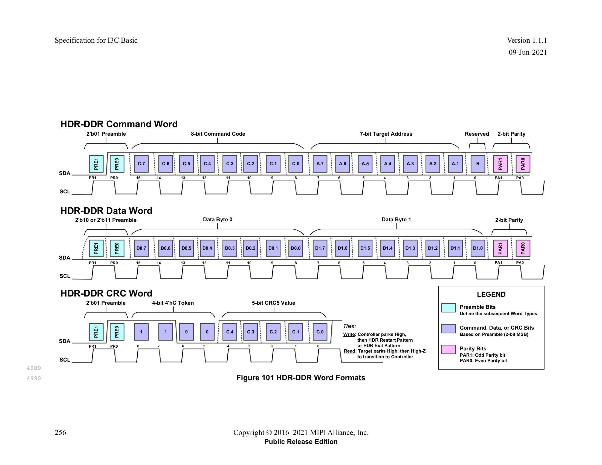

```
4989
```

```
4990
```

Copyright © 2016–2021 MIPI Alliance, Inc. **Public Release Edition** 

256 

Version 1.1.1 09-Jun-2021 

Specification for I3C Basic 

**`4991`** Preamble bit interpretation depends on the context, as shown in _**Table 64**_ . The context controls the roles of **`4992`** Controller and Target, such that for Data, the Target or Controller drives the second Preamble bit after the **`4993`** other I3C Device has Parked High. The Preamble value of 2’b00 is reserved for special use, as indicated **`4994`** when such use is defined. 

## **`4995`** 

## **Table 64 HDR-DDR Preamble Values** 

|**Context**||**Preamble Value and Interpretation**|**Preamble Value and Interpretation**||
|---|---|---|---|---|
||**2’b00**|**2’b01**|**2’b10**|**2’b11**|
|**After Enter HDR**|Reserved<br>for special<br>use cases|Command Word follows|–|–|
|**After Read CMD**||–|Target ACK,<br>Data follows|Target NACK,<br>Aborted|
|**After Read DATA**||CRC Word follows|Controller Aborts,<br>Target yields.<br>_Controller drives_<br>_second 0._|Data follows.<br>_Controller does not_<br>_drive second bit._|
|**After Write CMD**||–|Target ACK,<br>Data follows|Target NACK,<br>Aborted|
|**After Write DATA**||CRC Word follows|Target requests END<br>Controller complies|Data follows|


**`4996`** HDR-DDR Mode defines four Word Types (see _**Figure 101**_ ): 

- **`4997`** • **Command Word** : 

- **`4998`** • The Preamble before a Command Word shall have the value 2’b01. 

- **`4999`** • The length of a Command Word shall be 18 bits (16 value bits, 2 parity bits). 

- **`5000`** HDR-DDR Mode Command Codes allow up to 128 Write or Read Commands, **`5001`** respectively (see _**Section 5.2.2.2**_ ). 

## **`5002`** • **Data Word** : 

- **`5003`** • The Preamble before a Data Word shall contain the value 2’b10 or 2’b11 (see _**Table 64**_ ). 

- **`5004`** • The length of a normal Data Word shall be 18 bits (16 value bits as two bytes, 2 parity bits). 

- **`5005`** • **CRC Word** : 

- **`5006`** • The Preamble before a CRC Word shall have the value 2’b01. 

- **`5007`** • The length of a CRC Word shall be 10 clocked bits (4 bit 4’hC token, 5 bits of CRC-5 **`5008`** checksum, 1 bit of 1’b1 setup to prepare the Bus for the following HDR Exit Pattern or HDR **`5009`** Restart Pattern). 

- **`5010`** • The value of the upper nibble (first 4 bits after the Preamble) of a CRC Word shall be 4’hC. 

- **`5011`** • There is no parity checking for a CRC Word. 

- **`5012`** • Following the falling edge of the last SCL pulse, the SDA shall be kept High (i.e., Open Drain **`5013`** class Pull-Up from Controller, while Target is in High-Z), for a time at least equal to tDIG_H. 

- **`5014`** • Following transmission of a CRC Word, an I3C Device shall set up SCL and SDA to allow for **`5015`** an HDR Restart Pattern or HDR Exit Pattern. 

**`5016`** The CRC-5 algorithm is specified in _**Section 5.2.2.5**_ . 

- **`5017`** • **Reserved Word** (For special use only): 

- **`5018`** • The Preamble before a Reserved Word (i.e., not a CRC Word) shall have the value 2’b01. 

- **`5019`** • The length of a Reserved Word shall be 18 bits (4-bit token 4’hD / 4’hE / 4’hF, 12 reserved **`5020`** bits, and 2 parity bits). 

Copyright © 2016–2021 MIPI Alliance, Inc. **Public Release Edition** 

257 

Specification for I3C Basic 

Version 1.1.1 09-Jun-2021 

## **`5021`** _**Note:**_ 

**`5022`** _HDR-DDR Mode also allows for special use cases to be defined in the future, via Preamble value_ **`5023`** _2’b00._ 

**==> picture [384 x 408] intentionally omitted <==**

**----- Start of picture text -----**<br>
SDR Mode<br>STOP .. START<br>HDR Exit HDR Restart<br>Enter HDR<br>Pattern Pattern<br>HDR-DDR Frame End HDR-DDR Frame Start<br>2’b01 2’b01<br>READ WRITE<br>CMD Word CMD Word<br>2’b11<br>(Target NACK)<br>2’b11 2’b10 2’b10<br>(Target NACK)<br>DATA Word 2’b11 DATA Word 2’b11<br>2’b10<br>(READ) (WRITE)<br>(Controller Abort)<br>2’b10<br>(Target Requests<br>END) 2’b01<br>2’b01  (Controller)<br>(Target)<br>Done CRC Word<br>**----- End of picture text -----**<br>


**`5024 5025` Figure 102 HDR-DDR Preamble Bits State Diagram** 

Copyright © 2016–2021 MIPI Alliance, Inc. **Public Release Edition** 

258 

Version 1.1.1 09-Jun-2021 

Specification for I3C Basic 

## **5.2.2.1 HDR-DDR Overview** 

> **`5026`** The HDR-DDR Protocol uses the same signaling as SDR, but operates with SDA changing after each SCL **`5027`** edge. 

- **`5028`** • A normal HDR-DDR Read Request shall be composed of a Command Word from the Controller, **`5029`** followed by one or more Data Words from the Target, followed by one CRC Word from the Target **`5030`** as shown in _**Figure 103**_ . 

- **`5031`** • An HDR-DDR Write Request shall be composed of a Command Word, followed by one or more **`5032`** Data Words, and one CRC, all from the Controller, as shown in _**Figure 106**_ . 

- **`5033`** • A NACKed HDR-DDR Read Request shall be composed of a Command Word, followed by the 

- **`5034`** Target not ACKing (driving Low SDA) in the second pre-amble bit, before what would be the first **`5035`** Data Word. 

**`5036`** Each Command Word and each Data Word is 20 bits in length (i.e., 20 clock edges) including a two-bit **`5037`** Preamble. At 10MHz the raw bit rate is 20 Mbps; at 12.5 MHz the raw bit rate is 25 Mbps. Because each **`5038`** Word includes two Preamble bits and two Parity bits, the real data rate (considering only the two bytes in the **`5039`** 16 payload bits per Word) is the raw rate times 16/20, or 16 Mbps at 10 MHz (20 Mbps at 12.5 MHz), which **`5040`** is a measure of the 16-bit data rate. 

**`5041`** HDR-DDR Command Words indicate the direction of data movement: either Write (Controller to Target), or **`5042`** Read (Target to Controller). After the Command Word, one or more Data Words are sent by the Controller or **`5043`** by the Target (unless NACKed) until done, followed by the CRC Word (unless NACKed). Finally, the **`5044`** Controller issues either an HDR Restart Pattern or an HDR Exit Pattern. The Controller may also terminate **`5045`** a Read prematurely, per _**Section 5.2.2.3.3**_ , however this is not a normal end for a Read, and should be used **`5046`** sparingly. The Target may request the termination of a Write, per _**Section 5.2.2.3.6**_ . 

**`5047`** In HDR-DDR Mode, just as in SDR Mode, only the I3C Bus Controller drives the SCL line. For Commands, **`5048`** the SDA line is driven by the Controller. For Data, the SDA line is driven either by the Target or by the **`5049`** Controller, depending on the Command direction. Bus Turnaround behavior is specified in _**Section 5.2.2.3**_ . 

**`5050`** The common format used by HDR-DDR Command Words, Data Words, and Reserved Words is illustrated **`5051`** in _**Table 65**_ . The Command details are explained in _**Section 5.2.2.2**_ . The format used by HDR-DDR CRC **`5052`** Words is a subset of the Command Word and the Data Word (see _**Section 5.2.2.5**_ ). 

```
5053
```

**Table 65 HDR-DDR Word Format: Command, Data, Reserved** 

|**Preamble**|**Payload**|**Parity**<br>(not the CRC)|**Parity**<br>(not the CRC)|
|---|---|---|---|
|**2 bits**|**16 bits**|**1 bit**|**1 bit**|
|2’b00: Not used<br>**2’b01: Command or CRC**<br>**2’b10, 2’b11: Data or Abort**|Command Code or<br>Data Values|XOR of<br>Odd index Payload<br>bits|XOR of<br>1 and Even index<br>Payload bits|


**`5054`** The two parity bits are formed from the payload bits, using an XOR function: 

- **`5055`** • **PA1** = Parity of the odd index Payload bits: 

## **`5056`** 

D[15] ^ D[13] ^ D[11] ^ D[9] ^ D[7] ^ D[5] ^ D[3] ^ D[1] 

- **`5057`** • **PA0** = Parity of the even index Payload bits and 1: 

```
5058
```

D[14] ^ D[12] ^ D[10] ^ D[8] ^ D[6] ^ D[4] ^ D[2] ^ D[0] ^ 1 

Copyright © 2016–2021 MIPI Alliance, Inc. **Public Release Edition** 

259 

Specification for I3C Basic 

Version 1.1.1 09-Jun-2021 

**`5059`** _**Table 66**_ summarizes the format of all four HDR-DDR Word Types. 

```
5060
```

**Table 66 HDR-DDR Word Formats** 

|**Word Type**|**Preamble**|**Payload**|**Parity**|**Parity**|**Notes**|
|---|---|---|---|---|---|
||**2 bits**|**16 bits**|**1b**|**1b**||
|**Command**|**2’b01**|15:8<br>Command Code (8 bits)|**PA1**|**PA0**|Command may follow only<br>Enter HDR or HDR Restart.<br>**Command Codes:**<br> **Write:**8’h00 to 8’h7F<br> **Read:**8’h80 to 8’hFF|
|||7:1<br>Target Address (7 bits)||||
|||0<br>Reserved (1 bit)||||
|**Data**|**2’b10**<br>**2’b11**|15:8<br>First Data Byte (8 bits)|**PA1**|**PA0**|One or more Data Words shall<br>follow Command, unless<br>NACKed. Only CRC may follow<br>Data.|
|||**7:0**<br>**Second Data Byte**(8 bits)||||
|**CRC**|**2’b01**|**15:12**<br>**4’hC (token value)**(4 bits)|||CRC value ends at bit 6,<br>followed by either HDR Restart<br>Pattern or HDR Exit Pattern.<br>See signal diagrams in<br>**_Figure 104_**and**_Figure 105_**.|
|||**11:7**<br>**CRC-5 checksum**(5 bits)||||
|||**6**<br>**1’b1 setup bit**, followed by<br>High level for a time of at<br>least tDIG_H, starting from the<br>falling edge of the last SCL<br>clock pulse||||
||||Not Used|||
|||||||
|||5:0<br>Reserved (6 bits), No clocks||||
|**Reserved**|**2’b01**|15:12<br>4’hD to 4’hF (4 bits)|**PA1**|**PA0**|Reserved for future use|
|||11:0<br>Reserved (12 bits)||||
|–|2’b00|Reserved for special use cases||||


**`5061`** HDR-DDR Mode is entered in the standard way, using the Enter HDR CCC (see _**Section 5.1.9.3.8**_ ). After the **`5062`** Enter HDR CCC and its ninth bit (the T-Bit), the SCL falling edge begins the HDR Mode. The first HDR- **`5063`** DDR bit starts on the next SCL rising edge; that is, the Controller drives SDA when SCL is Low, and the **`5064`** Target samples SDA on the SCL rising edge. This allows the entry to HDR-DDR Mode, as shown in _**Figure**_ **`5065`** _**106**_ . 

**`5066`** Once in HDR-DDR Mode the Controller issues a Command Word to start every transfer (unless NACKed). **`5067`** In HDR-DDR Mode, Commands shall be issued only by a Controller. Data Words may be issued by a **`5068`** Controller or by a Target, depending on the particular Command (Write or Read). At least one Data Word **`5069`** shall be issued, unless the Target does not accept (ACK) the Command per _**Section 5.2.2.3**_ . 

Copyright © 2016–2021 MIPI Alliance, Inc. **Public Release Edition** 

260 

Version 1.1.1 09-Jun-2021 

Specification for I3C Basic 

**`5070`** _**Figure 103**_ illustrates a typical HDR-DDR Mode Frame with two HDR Commands and their associated data: **`5071`** • I3C START or Repeated START **`5072`** • I3C CCC to Enter HDR-DDR Mode 

   - I3C CCC to Enter HDR-DDR Mode 

- **`5073`** • After entering HDR-DDR Mode, there is one HDR-DDR Command Word, followed by one or **`5074`** more HDR-DDR Data Words, and then an HDR-DDR CRC Word 

**`5075`** 

   - Then an HDR Restart Pattern 

- **`5076`** • Then another HDR-DDR Command Word, HDR-DDR Data Word, and HDR-DDR CRC Word **`5077`** • Finally, HDR Mode is ended via the HDR Exit Pattern followed by I3C STOP **`5078`** _**Note:**_ **`5079`** _An HDR-DDR CRC Word might also be emitted after an abort, per_ _**Section 5.2.2.3** ._ 

**==> picture [421 x 198] intentionally omitted <==**

**----- Start of picture text -----**<br>
SDR HDR<br>S or Sr I3C Reserved byte  ACK Enter HDR-DDR  T HDR-DDR  HDR DDR Data  HDR DDR  HDR Restart<br>(7'h7E) (R/W=0) CCC (ENTHDR0) Command (1 or more words) CRC Pattern<br>HDR Bus Free<br>HDR-DDR  HDR Data  HDR DDR HDR Exit<br>P<br>Command (1 or more words) CRC Pattern<br>ACK = Acknowledge (SDA Low)<br>NACK = Not Acknowledge (NACK) LEGEND<br>SSr = START Condition= Repeated START Condition SDR From Controller to Target S Framing<br>P = STOP Condition  HDR P (START or STOP)<br>=»<br>T = Transition Bit Alternative to ACK/NACK<br>From Target to Controller SDR Current I3C Mode<br>HDR (SDR or HDR)<br>Transition Bit =<br>= (Parity Bit for CCC)<br>Bus Bus Free (after STOP)<br>**----- End of picture text -----**<br>


## **`5080`** 

## **`5081` Figure 103 Typical HDR-DDR Mode Frame** 

**`5082`** Following the HDR-DDR CRC Word, the Controller provides either the HDR Restart Pattern or the HDR **`5083`** Exit Pattern. 

**`5084`** On a WRITE transaction, the Controller controls the whole transfer; as a result, the transition from the CRC **`5085`** Word to either the HDR Restart Pattern or the HDR Exit Pattern is done with only the Controller driving the **`5086`** SDA, while the Target’s SDA IO is on High-Z (see _**Figure 104)**_ . 

Copyright © 2016–2021 MIPI Alliance, Inc. 261 **Public Release Edition** 

Specification for I3C Basic 

Version 1.1.1 09-Jun-2021 

**==> picture [689 x 404] intentionally omitted <==**

**----- Start of picture text -----**<br>
Beginning of CRC  HDR Restart or HDR EXIT<br>[15] [14] [13] [12] [11] [10] [9] [8] [7] [6] [5]<br>PRE1 PRE0 1'b1 1'b1 1'b0 1'b0 CRC[4] CRC[3] CRC[2] CRC[1] CRC[0] SDA H<br>SDA 0.7 X VDD<br>0.3 X VDD<br>DATA [15:0] PAR1 PAR0<br>T_SDA 0.7 X VDD<br>0.3 X VDD<br>CR_SDA 0.7 X VDD<br>0.3 X VDD<br>0.7 X VDD<br>T_SCL 0.3 X VDD<br>0.7 X VDD<br>CR_SCL 0.3 X VDD<br>DATA [15:0] PAR1 PAR0 PRE1 PRE0<br>0.7 X VDD<br>SCL C10 CRC_CLK1 CRC_CLK2 CRC_CLK3 CRC_CLK4 CRC_CLK5 CRC_CLK6 0.3 X VDD<br>NOTE:<br>Vertical lines are tDIG_H apart = Active Drive by Controller or Target<br>= Open-Drain class Pull-Up by Controller<br>= High-Z by Controller<br>= High-Z by Target<br>**----- End of picture text -----**<br>


**Figure 104 HDR-DDR CRC and HDR Restart Pattern or HDR Exit Pattern in Write Transaction** 

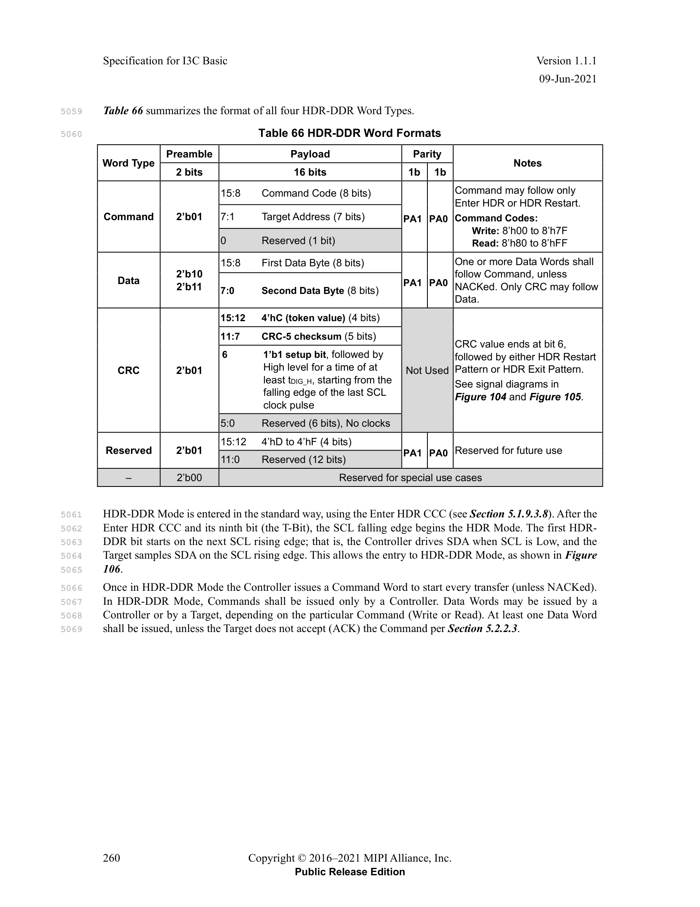

```
5087
5088
```

Copyright © 2016–2021 MIPI Alliance, Inc. **Public Release Edition** 

262 

Version 1.1.1 09-Jun-2021 

Specification for I3C Basic 

- **`5089`** On a Read transaction, the Target drives the CRC and the Controller takes over generation of the HDR Restart **`5090`** Pattern or HDR Exit Pattern. See _**Figure 105**_ for the signal diagram for this SDA handoff. 

- **`5091`** This procedure has the following steps: 

- **`5092`** 1. The Target actively transfers the data, while the Controller is in High-Z. 

- **`5093`** 2. The Target actively drives the CRC Word, including pulling the setup bit (bit[6]) High. 

- **`5094`** 3. After a time of tSCO elapses after the falling edge of CRC_CLK6, the Target releases SDA on **`5095`** High-Z ( _**Figure 105**_ , point 3) 

- **`5096`** 4. The Controller keeps its SDA output on High-Z until the start of rising edge of CRC_CLK6, when **`5097`** it enables the Open Drain class Pull-Up ( _**Figure 105**_ , point 1). The SDA line remains driven by the **`5098`** Target. 

- **`5099`** 5. The Controller starts driving SDA High when it starts the falling edge of CRC_CLK6 (point 2 in **`5100`** the diagram). Since the Target was driving the setup bit (bit[6]) High, the two Devices are now **`5101`** driving in parallel. 

- **`5102`** 6. After a time of at least tDIG_H elapses after the falling edge of CRC_CLK6, the Controller may start **`5103`** the first falling edge of the SDA, commencing either the HDR Restart Pattern or the HDR Exit **`5104`** Patterns ( _**Figure 105**_ , point 4). 

- **`5105`** 7. The result of this procedure is a safe handoff of the SDA line from the Target to the Controller. 

Copyright © 2016–2021 MIPI Alliance, Inc. **Public Release Edition** 

263 

Specification for I3C Basic 

Version 1.1.1 09-Jun-2021 

```
5106
5107
```

**==> picture [692 x 384] intentionally omitted <==**

**----- Start of picture text -----**<br>
Beginning of CRC  HDR Restart or HDR EXIT<br>[15] [14] [13] [12] [11] [10] [9] [8] [7] [6] [5]<br>PRE1 PRE0 1'b1 1'b1 1'b0 1'b0 CRC[4] CRC[3] CRC[2] CRC[1] CRC[0] SDA H<br>SDA 0.7 X VDD<br>0.3 X VDD<br>DATA [15:0] PAR1 PAR0<br>3<br>T_SDA 0.7 X VDD<br>0.3 X VDD<br>2 4<br>CR_SDA 0.7 X VDD<br>0.3 X VDD<br> ≥ tDIG_H<br>0.7 X VDD<br>T_SCL 0.3 X VDD<br>0.7 X VDD<br>CR_SCL 0.3 X VDD<br>DATA [15:0] PAR1 PAR0 PRE1 PRE0<br>0.7 X VDD<br>SCL C10 CRC_CLK1 CRC_CLK2 CRC_CLK3 CRC_CLK4 CRC_CLK5 CRC_CLK6 0.3 X VDD<br>tSCO tDIG_H<br>1<br>NOTE:<br>Vertical lines are tDIG_H apart if<br>not stated otherwise = Active Drive by Controller or Target<br>= Open-Drain class Pull-Up by Controller<br>= High-Z by Controller<br>= High-Z by Target<br>**----- End of picture text -----**<br>


**Figure 105 HDR-DDR CRC and HDR Restart Pattern or HDR Exit Pattern in Read Transaction** 

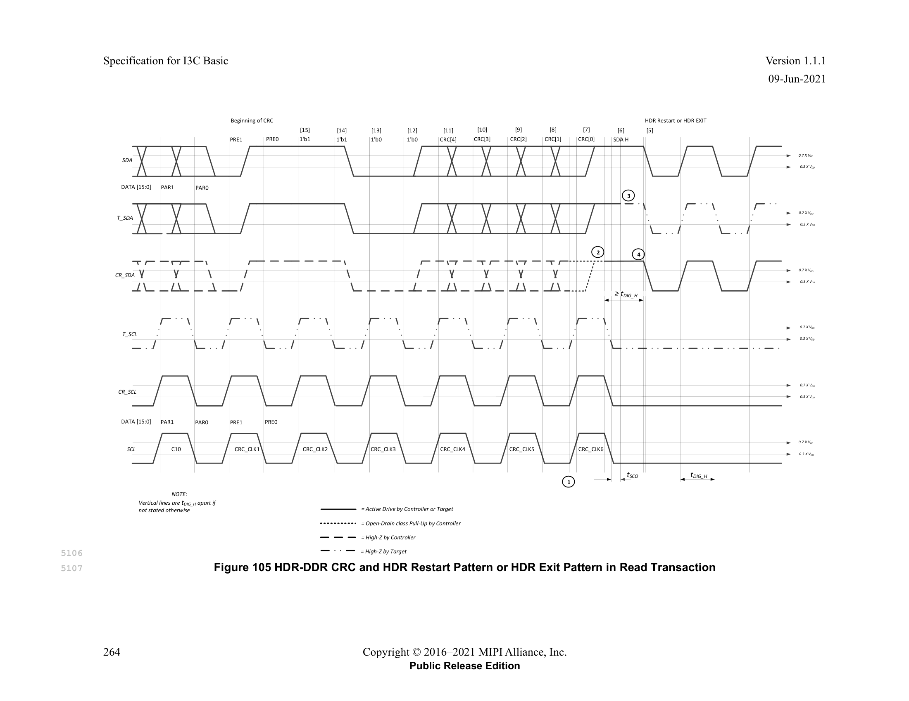

Copyright © 2016–2021 MIPI Alliance, Inc. **Public Release Edition** 

264 

Version 1.1.1 09-Jun-2021 

Specification for I3C Basic 

## **5.2.2.2 HDR-DDR Command Coding** 

> **`5108`** In HDR-DDR Mode a Command Word follows the initial Enter HDR CCC (and any HDR Restart). This **`5109`** Command Word uses the normal 18-bit model. _**Table 67**_ illustrates the Command Word format for HDR- **`5110`** DDR Mode. 

```
5111
```

**Table 67 HDR-DDR Command Word Format** 

|**Bits**|**Field**|**Size**<br>**(bits)**|**Notes**|
|---|---|---|---|
|**15**|**Read/Write**|1|**1:**Read (Target to Controller)<br>**0:**Write (Controller to Target)|
|**14:8**|**Command Code**|7|128 possible Write commands<br>128 possible Read commands|
|**7:1**|**Target Address**|7|Same Dynamic Address as used in I3C SDR<br>Protocol|
|**0**|**Parity Adjustment**|1|Ensures that PA0 contains 1’b1, which allows<br>for easier Bus Turnaround1|
|**_Note:_**<br>_1)_<br>_Because PA0 is the XOR of the even index Payload bits and 1, it is equal to:_<br>XOR_outer( 1, this bit, XOR_inner( 2, 4, 6, 8, 10, 12, 14 ) )<br>_As a result, this bit should be set to the result of XOR_inner()._||||


**`5112`** Regarding bits 15:8 together, the possible Command Code spaces for Read Commands and Write Commands **`5113`** in HDR-DDR Mode are illustrated in _**Table 68**_ . 

```
5114
```

**Table 68 Read and Write Command Spaces for HDR-DDR Mode** 

|**Command**<br>**Codes**|**Command Functions**|
|---|---|
|**0x00 – 0x7F**|Available for any use for writes|
|**0x80 – 0xFF**|Available for any use for reads|


Copyright © 2016–2021 MIPI Alliance, Inc. **Public Release Edition** 

265 

Specification for I3C Basic 

Version 1.1.1 09-Jun-2021 

**`5115`** Signal diagrams for starting the HDR-DDR Command Codes are shown in _**Figure 106**_ and _**Figure 107**_ . **`5116`** _**Figure 106**_ shows the HDR-DDR Command Code after ENTHDR0, and _**Figure 107**_ shows the HDR-DDR **`5117`** Command Code after HDR Restart Pattern. 

**==> picture [419 x 207] intentionally omitted <==**

**----- Start of picture text -----**<br>
HDR-DDR Command Word<br>SDA<br>ENTHDR0 = 0x20 T = 0<br>PRE1 PRE0 C.7 C.6<br>SCL C8 C9<br>Second DDR edge, P0=1<br>First DDR edge, P1=0<br>LOW SCL<br>Controller drives Push-Pull<br>5118  T-Bit falling edge <= end of SCL pulse<br>5119  Figure 106 HDR-DDR Command Code After ENTHDR0<br>**----- End of picture text -----**<br>


**`5120`** As _**Figure 106**_ shows: 

- **`5121`** 1. First the SCL pulse is ended by its falling edge (as is necessary for the Targets’ logic design). 

- **`5122`** 2. Then on the SCL Low that follows, the Controller positions the SDA (i.e., sets SDA either High or **`5123`** Low) as necessary to be read on the first SCL rising edge, using Push-Pull timing. 

Copyright © 2016–2021 MIPI Alliance, Inc. **Public Release Edition** 

266 

Version 1.1.1 09-Jun-2021 

Specification for I3C Basic 

**==> picture [449 x 250] intentionally omitted <==**

**----- Start of picture text -----**<br>
09-Jun-2021<br>Set Up SDA HDR Restart Pattern<br>If Needed HDR-DDR Command Word<br>SDA<br>PRE1 PRE0 C.7 C.6<br>SCL Edge<br>Validates Restart<br>SCL<br>Second DDR edge, P0=1<br>Set Up SCL<br>If Needed First DDR edge, P1=0<br>Controller drives Push-Pull  LOW SCL <= SDA change, prepare for P1<br>5124  SCL falling edge <= end of SCL pulse<br>5125  Figure 107 HDR-DDR Command Code After HDR Restart Pattern<br>**----- End of picture text -----**<br>


- **`5126`** As _**Figure 107**_ shows: 

- **`5127`** 1. After the SCL rising edge for validating the HDR Restart pattern, an SCL falling edge is provided. **`5128`** The result is an SCL pulse, identical to the SCL pulse of T-Bit (see _**Figure 106**_ ). 

- **`5129`** 2. Any possible changes on SDA are ignored until the SCL rising edge that follows (labeled “First **`5130`** DDR edge”). 

- **`5131`** 3. On the SCL Low following the SCL pulse falling edge, the Controller positions the SDA (i.e., sets **`5132`** SDA either High or Low) as necessary to be read on the first SCL rising edge, using Push-Pull **`5133`** timing. 

**`5134`** 4. The waveform that follows is identical to the same segment in _**Figure 106**_ 

Copyright © 2016–2021 MIPI Alliance, Inc. **Public Release Edition** 

267 

Specification for I3C Basic 

Version 1.1.1 09-Jun-2021 

## **5.2.2.2.1 CCC Transmission in HDR-DDR Mode** 

> **`5135`** A special HDR-DDR syntax is used for transmitting Common Command Codes in the HDR-DDR protocol. The following formats are defined, as specific **`5136`** instantiations of the generic HDR CCC flows (see _**Section 5.2.1.2**_ ). The Broadcast CCC flow is shown in _**Figure 108**_ , and the Direct CCC flow is shown in **`5137`** _**Figure 109**_ . 

**`5138 5139`** 

**==> picture [618 x 337] intentionally omitted <==**

**----- Start of picture text -----**<br>
HDR-DDR CCC Indicator Word HDR-DDR CCC Command Word<br>WRITE, Broadcast Address (7'h7E) Broadcast CCC, Optional Defining Byte<br>[i Go<br>HDR-DDR Command Word HDR-DDR Data Word<br>S, Enter HDR or  [15] 1'b0 (Write) [7:1] Broadcast Address [15:8] Broadcast CCC value [7:0] Defining Byte value,<br>ACK<br>HDR RESTART [14:8] Reserved [0] Parity Adj. (P0 = 1'b1) or 8'h00 if none used<br>HDR-DDR CCC Data Word CRC Word THREE VERSIONS<br>Selectable END of<br>Optional Data END of Data<br>CCC Procedure<br>END of this CCC<br>HDR-DDR Data Word HDR-DDR CRC Word<br>[15:8] First Data Byte [7:0] Second Data Byte CRC for all Data HDR-DDR CCC<br>END PROCEDURE<br>From Controller to Target<br>7<br>Figure 108 HDR-DDR Broadcast CCC Format<br>Write to all Targets<br>**----- End of picture text -----**<br>


Copyright © 2016–2021 MIPI Alliance, Inc. **Public Release Edition** 

268 

Version 1.1.1 09-Jun-2021 

Specification for I3C Basic 

**==> picture [663 x 369] intentionally omitted <==**

**----- Start of picture text -----**<br>
HDR-DDR CCC Indicator Word HDR-DDR CCC Command Word CRC Word<br>oy<br>WRITE, Broadcast Address (7'h7E) Direct CCC, Optional Defining Byte END of Indicator<br>oo<br>HDR-DDR Command Word HDR-DDR Data Word HDR-DDR CRC Word<br>S, Enter HDR or  [15] 1'b0 (Write) [7:1] Broadcast Address ACK [15:8] Direct CCC value [7:0] Defining Byte value,  CRC for Indicator<br>HDR RESTART [14:8] Reserved [0] Parity Adj. (P0 = 1'b1) or 8'h00 if none used<br>HDR-DDR CCC Selector Word HDR-DDR CCC Data Word CRC Word<br>WRITE to Target or Group Address Repeat N times, for all Data END of Data<br>HDR-DDR Command Word HDR-DDR Data Word HDR-DDR CRC Word<br>HDR  [15] 1'b0 (Write) [7:1] Target/Group Address ACK Multiple Data Bytes, per ML  CRC for all Data<br>RESTART  [14:8] Reserved [0] Parity Adj. (P0 = 1'b1) Frame format<br>HDR-DDR CCC Selector Word HDR-DDR CCC Data Word CRC Word THREE VERSIONS<br>Selectable END of<br>READ from Target Address Repeat N times, for all Data END of Data CCC Procedure<br>END of this CCC<br>HDR-DDR Command Word HDR-DDR Data Word HDR-DDR CRC Word<br>HDR  [15] 1'b1 (Read) [7:1] Target Address ACK Multiple Data Bytes, per ML CRC for all Data HDR-DDR CCC<br>RESTART  [14:8] Reserved [0] Parity Adj. (P0 = 1'b1) Frame format (park at end) END PROCEDURE<br>Controller to Target Handoff Target to Controller Handoff<br>From Controller to Target From Target to Controller   Multi-Lane Data/CRC not permitted (in I3C Basic)<br>5140  - nl<br>5141  Figure 109 HDR-DDR Direct CCC Format<br>(Direct SET)<br>Write segment<br>Read segment (Direct GET)<br>**----- End of picture text -----**<br>


Copyright © 2016–2021 MIPI Alliance, Inc. **Public Release Edition** 

269 

Specification for I3C Basic 

Version 1.1.1 09-Jun-2021 

## **HDR-DDR CCC Header Block** 

- **`5142`** The HDR-DDR CCC Header Block has several different formats that are used in the framing of CCC flows **`5143`** in HDR-DDR Mode. Two of these formats are commonly used: an ‘Indicator’ type, used at the start of every **`5144`** CCC, and a ‘Selector’ type, used at the start of a Write Segment or Read Segment for Direct CCCs. A generic **`5145`** Header Block (which is neither an ‘Indicator’ type nor a ‘Selector’ type) may also be used for other purposes, **`5146`** such as CCC End Procedures. 

**`5147`** The HDR-DDR CCC Header Block always begins with an HDR-DDR Command Word, which shall take its **`5148`** structure (see _**Table 66**_ and _**Table 67**_ ). All Targets that support CCC flows in HDR-DDR Mode must **`5149`** acknowledge the HDR-DDR Header Block’s Command Word if addressed, unless defined otherwise for a **`5150`** particular usage in CCC flows. If an acknowledgement is required, then Bit[0] shall contain a value chosen **`5151`** to ensure that the PA0 field (Parity bit 0, see _**Table 68**_ ) contains the value 1’b1, per _**Section 5.2.2.3.1**_ . 

**`5152` Start of CCC:** An HDR-DDR CCC Header Block that begins the framing for a Broadcast CCC or a Direct **`5153`** CCC shall consist of one HDR-DDR CCC Indicator Word, followed by one HDR-DDR CCC Command **`5154`** Word: 

- **`5155`** • The HDR-DDR CCC Indicator Word shall take the structure of the HDR-DDR Command Word **`5156`** Format (see _**Table 66**_ and _**Table 67**_ ): 

- **`5157`** • **Bit[15]** shall contain 1’b0, indicating a WRITE command (Controller to Target). 

- **`5158`** • **Bits[14:8]** are reserved, and shall be ignored by the Target Devices. 

- **`5159`** • **Bits[7:1]** shall contain the Broadcast Address (7’h7E). 

- **`5160`** • Acknowledgement is always required, so Bit[0] shall contain a value chosen to ensure that all **`5161`** Targets supporting CCC flows in HDR-DDR Mode will acknowledge this Indicator Word. 

- **`5162`** • The HDR-DDR CCC Command Word shall take the structure of the HDR-DDR Data Word **`5163`** Format (see _**Table 67)**_ . 

- **`5164`** • **Bits[15:8]** shall contain the Command Code, which may be a Broadcast CCC or a Direct CCC. 

- **`5165`** • **Bits[7:0]** shall contain the optional Defining Byte for the Command Code. If the CCC does **`5166`** not support an optional Defining Byte, then this field shall contain the value 8’h00. 

**`5167` Start of Segment:** An HDR-DDR CCC Header Block that begins a Read Segment or Write Segment in Direct **`5168`** CCC framing shall consist of one HDR-DDR CCC Selector Word. 

- **`5169`** • The HDR-DDR CCC Selector Word shall take the structure of the HDR-DDR Command Word **`5170`** Format: 

- **`5171`** • **Bit[15]** distinguishes a Read Segment vs. a Write Segment: 

- **`5172`** • **For the start of a Write Segment** (i.e., a Direct Write or Direct SET CCC) this field shall **`5173`** contain 1’b0 to indicate a Write (Controller to Target). 

- **`5174`** • **For the start of a Read Segment** (i.e., a Direct Read or Direct GET CCC) this field shall **`5175`** contain 1’b1 to indicate a Read (Target to Controller). 

- **`5176`** • **Bits[14:8]** are reserved, and shall be ignored by the Target Devices. 

- **`5177`** • **Bits[7:1]** shall contain the Dynamic Address of the Target to be addressed for Write or Read in **`5178`** this Segment. For Write Segments, Bits[7:1] might also contain a valid Group Address (per **`5179`** _**Section 5.2.1.2.6**_ ). 

- **`5180`** • Acknowledgement is always required, so Bit[0] shall contain a value chosen to ensure that the **`5181`** addressed Target (or all Targets in the addressed Group) will acknowledge this Selector Word. **`5182`** This facilitates ACK/NACK for a Target (or Group) addressed by a Direct Write or Direct **`5183`** SET CCC (per _**Section 5.2.2.3.1**_ ), and facilitates both ACK/NACK and Bus Turnaround for a **`5184`** Target addressed by a Direct Read or Direct GET CCC (per _**Section 5.2.2.3.2**_ ). 

Copyright © 2016–2021 MIPI Alliance, Inc. **Public Release Edition** 

270 

Version 1.1.1 09-Jun-2021 

Specification for I3C Basic 

## **HDR-DDR CCC Data Block** 

**`5185`** An HDR-DDR CCC Data Block may follow an HDR-DDR CCC Header Block, in the appropriate location **`5186`** for either a Broadcast CCC flow (see _**Figure 108**_ ) or a Direct CCC flow (see _**Figure 109**_ ). 

- **`5187`** • **Broadcast:** The HDR-DDR CCC Data Block in a Broadcast CCC flow shall take the structure of **`5188`** the HDR-DDR Data Word Format (see _**Table 66**_ ) and shall contain 16 bits (2 bytes) of data in its **`5189`** payload. 

- **`5190`** • Per _**Section 5.2.1.2**_ , all HDR-DDR CCC Data Blocks shall be transmitted using SDA[0] (i.e., **`5191`** 1-Lane mode) in order to ensure that all Target Devices that support HDR-DDR are always **`5192`** able to receive and understand the Broadcast CCC data, regardless of their currently **`5193`** configured ML Frame format, or the number of additional Lanes they might support. 

- **`5194`** • **Direct:** The HDR-DDR CCC Data Block in a Direct CCC flow shall have the same structure as **`5195`** that of a Broadcast CCC flow (i.e., an HDR-DDR Data Word using SDA[0] in 1-Lane mode). 

- **`5196`** • If the total data length is an odd number of bytes, then the sender shall pad the Data Block **`5197`** with an extra byte with value 8’d0, and the receiver shall discard the extra padding byte. 

**`5198`** _**Note:**_ 

**`5199`** _Multi-Lane support for HDR-DDR Mode is not included in I3C Basic. The above configuration_ **`5200`** _advisory is provided in order to maintain full compatibility with I3C Target Devices that might support_ **`5201`** _Multi-Lane for HDR-DDR Mode, as defined in version 1.1 or higher of the full I3C Specification._ 

## **HDR-DDR CRC Block** 

**`5202`** An HDR-DDR CRC Block serves as the Termination Marker, as described in the HDR-x generic CCC flows. **`5203`** To conform to the HDR-DDR Mode Framing model (see _**Figure 103**_ ), this Termination Marker uses the same **`5204`** structure as the standard HDR-DDR CRC Word. 

- **`5205`** • For the end of Broadcast data sent in a Broadcast CCC flow, the HDR-DDR CRC Block shall be a **`5206`** single HDR-DDR CRC Word transmitted by the Controller in 1-Lane mode (see _**Table 66**_ and **`5207`** _**Figure 104**_ ), sent as a common CCC flow element, to ensure that all Targets will receive it. 

- **`5208`** • For the end of the HDR-DDR CCC Command Word sent in a Direct CCC flow, the HDR-DDR **`5209`** CRC Block shall be a single HDR-DDR CRC Word transmitted by the Controller in 1-Lane mode **`5210`** as described above. 

- **`5211`** • For the end of a Read Segment or Write Segment in a Direct CCC flow, the HDR-DDR CRC **`5212`** Block shall be a single HDR-DDR CRC Word (i.e., the same as both flows above). 

- **`5213`** The HDR-DDR CRC Block shall be included with all common CCC Flow Elements, as it must be received 

- **`5214`** and understood by all HDR-DDR Targets, including those that only support 1-Lane mode. 

- **`5215`** _**Note:**_ 

- **`5216`** _Both Broadcast and Direct CCC flows are special types of standard HDR-DDR transfers, so the_ **`5217`** _HDR-DDR CRC Block is used, per standard HDR-DDR transfer requirements. As noted above (i.e.,_ **`5218`** _for the HDR-DDR CCC Data Block definition) Multi-Lane support for HDR-DDR Mode is not included_ **`5219`** _in I3C Basic, so the HDR-DDR CRC Block must always use the same format (i.e., Data Transfer_ **`5220`** _Coding) as the HDR-DDR Data Block that precedes it._ 

## **HDR-DDR CCC Indicator Word and Header ACK** 

**`5221`** Per _**Section 5.2.1.2.2**_ , a Target that supports CCCs in HDR-DDR Mode shall indicate acknowledgement of **`5222`** the receipt of the HDR-DDR CCC Indicator Word, as well as the HDR-DDR CCC Header Block’s Command **`5223`** Word when used for other purposes, using the standard method of acknowledging an HDR-DDR write, per **`5224`** _**Section 5.2.2.3.1**_ and _**Figure 111**_ . Such a Target shall detect matching Command Words in CCC flows **`5225`** (including Indicator Words) that are addressed to the Broadcast Address (i.e., 7’h7E) and have a correctly **`5226`** calculated PA0 field (i.e., Parity bit 0, see _**Table 66**_ ) that contains the value 1’b1. 

- **`5227`** • This applies to the Indicator Word when used with both Broadcast CCC flows and Direct CCC **`5228`** flows, since the same HDR-DDR CCC Indicator Word format is used to signal the beginning of **`5229`** both flows. 

Copyright © 2016–2021 MIPI Alliance, Inc. 

271 

**Public Release Edition** 

Specification for I3C Basic 

Version 1.1.1 09-Jun-2021 

- **`5230`** • This also applies to the Command Word when used appropriately for other purposes in CCC **`5231`** flows, such as CCC End Procedures. 

**`5232`** If the Controller does not receive acknowledgement from at least one Target, then it shall use any valid **`5233`** HDR-DDR CCC End Procedure. Additionally, it may initiate an error recovery procedure, which might **`5234`** include exiting HDR-DDR Mode and attempting to re-send the CCC in SDR Mode. 

## **HDR-DDR Direct CCC Write Segment** 

**`5235`** An HDR-DDR CCC Write Segment for a Direct Write or Direct SET CCC shall start with an HDR-DDR **`5236`** CCC Selector Word to indicate the Address of the Target (or Group) to receive the data, followed by one or **`5237`** more HDR-DDR CCC Data Blocks of the appropriate structure, as required by the CCC definition. 

- **`5238`** After the Controller sends the HDR-DDR CCC Selector Word, the Target shall then either indicate acceptance **`5239`** of the Direct CCC by acknowledging the WRITE Command, or else reject the Direct CCC by not responding **`5240`** to the Controller. The Target shall use the cached Command Code and optional Defining Byte from the **`5241`** previously received HDR-DDR CCC Command Word, and shall decide whether to accept or reject the Direct **`5242`** CCC immediately after receiving the HDR-DDR CCC Selector Word and matching its own Dynamic Address **`5243`** (or Group Address, if assigned and applicable). 

**`5244`** _**Note:**_ 

**`5245`** _If the CCC definition does not require data to be written to the Target or Group, then the Controller_ **`5246`** _shall send a single HDR-DDR CCC Data Block that contains padding bytes (i.e., values of 8’d0). The_ **`5247`** _Target shall discard the extra padding bytes, based on the cached Command Code and optional_ **`5248`** _Defining Byte that were sent previously, as part of the CCC Framing in HDR-DDR Mode._ 

**`5249`** The Target shall use the standard HDR-DDR Flow Control methods to either accept or reject an HDR-DDR **`5250`** WRITE Command, as defined in _**Section 5.2.2.3.1**_ and as illustrated in _**Figure 111**_ (accept) or _**Figure 112**_ **`5251`** (reject). 

- **`5252` If the Target rejects the Direct CCC** , then the Controller shall either send the HDR Restart Pattern and attempt **`5253`** another Read or Write Segment for this CCC, or else use any valid HDR-DDR CCC End Procedure. For **`5254`** Direct Write or Direct SET CCCs to a Group Address, the Controller only sees this rejection if no Targets **`5255`** accept the Direct CCC. 

**`5256` If the Target accepts the Direct CCC** , then the Controller shall send one or more HDR-DDR CCC Data Blocks **`5257`** of the appropriate structure, if required by the CCC definition. Then the Controller shall send an HDR-DDR **`5258`** CRC Word to terminate the data and end the Write Segment. 

**`5259`** At the end of a Write Segment, the Controller shall either send the HDR Restart Pattern and attempt another **`5260`** Read or Write Segment for this CCC, or else use any valid HDR-DDR CCC End Procedure. 

## **HDR-DDR Direct CCC Read Segment** 

**`5261`** An HDR-DDR CCC Read Segment for a Direct Read or Direct GET CCC shall start with an HDR-DDR **`5262`** CCC Selector Word to indicate the Address of the Target to provide data for the CCC, followed by a Bus **`5263`** Turnaround. In response, the indicated Target will either accept the Direct CCC by transmitting one or more **`5264`** HDR-DDR CCC Data Blocks of the appropriate structure, or else reject the Direct CCC by not responding **`5265`** to the Bus Turnaround condition. 

**`5266`** The Target shall use the standard HDR-DDR Flow Control methods to either accept or reject an HDR-DDR **`5267`** READ Command, as defined in _**Section 5.2.2.3.2**_ and as illustrated in _**Figure 113**_ (accept) or _**Figure 114**_ **`5268`** (reject). 

**`5269` If the Target accepts the Direct CCC** , then the Controller shall yield control of the Bus to the Target so that it **`5270`** can control the Bus to send the Data Blocks. After sending the last Data Block, the Target shall send an **`5271`** HDR-DDR CRC Word, indicating the end of the read transfer. Upon receiving the HDR-DDR CRC Word **`5272`** the Target shall yield control of the Bus, and the Controller shall resume control. 

**`5273`** At the end of a Read Segment, the Controller shall **either** send the HDR Restart Pattern and attempt another **`5274`** Read or Write Segment for this CCC, **or else** use any valid HDR-DDR CCC End Procedure. 

Copyright © 2016–2021 MIPI Alliance, Inc. **Public Release Edition** 

272 

Version 1.1.1 09-Jun-2021 

Specification for I3C Basic 

## **HDR-DDR CCC End Procedures** 

**`5275`** As illustrated in _**Figure 110**_ , the HDR-DDR CCC ends using one of three possible CCC End Procedures. 

## **`5276` Option 1: END HDR-DDR CCC Followed by New HDR-DDR CCC** 

**`5277`** This End Procedure indicates the end of a Broadcast or Direct CCC in HDR-DDR Mode, and the beginning **`5278`** of a new Broadcast or Direct CCC in HDR-DDR Mode. 

**`5279`** This End Procedure begins with an HDR Restart Pattern, followed by an HDR-DDR CCC Header Block **`5280`** containing a new CCC and optional Defining Byte. This starts either a Broadcast CCC flow ( _**Figure 108**_ ) or **`5281`** a Direct CCC flow (see _**Figure 109**_ ) while remaining in the CCC modality. 

**`5282`** The Controller starts a new CCC by sending one HDR-DDR Command Word, acting as the HDR-DDR CCC **`5283`** Indicator Word and containing the Broadcast Address; followed by one HDR-DDR Data Word, acting as the **`5284`** HDR-DDR CCC Command Word and containing the Command Code and optional Defining Byte for the **`5285`** new CCC. 

**`5286`** Additional HDR-DDR Words shall follow, per the CCC flow type. 

**`5287`** The flow steps are: 

- **`5288`** 1. Controller sends HDR Restart Pattern. 

- **`5289`** 2. Controller sends HDR-DDR CCC Indicator Word, using the same format as described above. 

- **`5290`** 3. Targets acknowledge receipt of Indicator Word, as defined above. 

- **`5291`** 4. Controller sends HDR-DDR CCC Command Word, including the Command Code and optional **`5292`** Defining Byte. 

- **`5293`** 5. Flow continues as Broadcast CCC or Direct CCC, as shown above. 

## **`5294` Option 2: END HDR-DDR CCC Followed by Another HDR-DDR Generic Transaction (+ Optional HDR Exit)** 

**`5295`** This End Procedure indicates the end of CCCs in HDR-DDR, and either a return to standard HDR-DDR **`5296`** transactions or a subsequent exit from HDR-DDR Mode. 

**`5297`** This End Procedure begins with an HDR Restart Pattern, followed by an HDR-DDR Command Word which **`5298`** ends the CCC flow, but is neither an Indicator nor a Selector. This Command Word is a common flow element **`5299`** that is sent to all Targets and must be acknowledged (i.e., like the Indicator Word). 

**`5300`** This is followed by an HDR-DDR Data Word, a common flow element that is required for HDR-DDR **`5301`** WRITE transfers (per _**Section 5.2.2.1**_ ). This Data Word contains the dummy command code value (i.e., 0x1F, **`5302`** see _**Table 16**_ ) to indicate the end of the CCC modality in HDR-DDR Mode, per _**Section 5.2.1.2.1**_ . 

**`5303`** _**Note:**_ 

**`5304`** _This HDR-DDR Data Word is not an HDR-DDR CCC Command Word._ 

**`5305`** This is followed by an HDR-DDR CRC Word as a common flow element. This CRC Word’s checksum is **`5306`** computed from the contents of the preceding HDR-DDR Data Word. 

**`5307`** After this, the HDR Restart Pattern signals the end of CCC modality, and that the next HDR-DDR Command **`5308`** Word must be treated as a standard HDR-DDR transaction (not as a CCC flow). Alternatively, the HDR Exit **`5309`** Pattern signals the end of HDR-DDR Mode and a subsequent return to SDR Mode. 

**`5310`** In either case, the HDR-DDR Command Word that indicates a write to the Broadcast Address followed by **`5311`** an HDR-DDR Data Word that contains the dummy command code value (i.e., 0x1F) is distinct from any **`5312`** other valid CCC flow in HDR-DDR Mode. Target Devices shall interpret this flow as the ending of the CCC **`5313`** modality. 

Copyright © 2016–2021 MIPI Alliance, Inc. **Public Release Edition** 

273 

Specification for I3C Basic 

Version 1.1.1 09-Jun-2021 

- **`5314`** The flow steps are: **`5315`** 1. Controller sends HDR Restart Pattern. **`5316`** 2. Controller sends HDR-DDR Command Word (i.e., not Indicator or Selector), using the following **`5317`** values: 

- **`5318`** • **Bit[15]** shall contain the value 1’b0, indicating a WRITE command (Controller to Target). 

- **`5319`** • **Bits[14:8]** are reserved, and shall be ignored by the Target Devices. 

- **`5320`** • **Bits[7:1]** shall contain the Broadcast Address (7’h7E). 

- **`5321`** • **Bit[0]** shall follow the general rule for all Command Words in HDR-DDR CCC Header **`5322`** Blocks, to facilitate ACK/NACK by all Targets. 

- **`5323`** 3. Targets acknowledge receipt of the HDR-DDR Command Word, as above. **`5324`** 4. Controller sends HDR-DDR Data Word, using the following values: **`5325`** • **Bits[15:8]** shall contain the dummy command code (0x1F) to end the CCC modality. **`5326`** • **Bits[7:0]** are reserved, and shall contain zeros. **`5327`** 5. Controller sends HDR-DDR CRC Word. **`5328`** Targets detect this flow (i.e., Command Word, one Data Word with dummy Command Code, and **`5329`** CRC Word) and end CCC modality. 

- **`5330`** 6. Controller either sends HDR Restart Pattern, or HDR Exit Pattern. 

**`5331`** If HDR Exit Pattern, then the Controller exits HDR-DDR Mode and returns the Bus to SDR **`5332`** Mode. 

## **`5333` Option 3: END HDR-DDR CCC and Return to SDR Mode** 

**`5334`** This is the simplest End Procedure. It indicates the end of CCCs in HDR-DDR Mode and an immediate exit **`5335`** from HDR-DDR Mode. 

- **`5336`** The flow steps are: 

- **`5337`** 1. Controller sends HDR Exit Pattern. 

- **`5338`** 2. Controller exits HDR-DDR Mode and returns the Bus to SDR Mode. 

Copyright © 2016–2021 MIPI Alliance, Inc. **Public Release Edition** 

274 

Version 1.1.1 

Specification for I3C Basic 

09-Jun-2021 

**==> picture [619 x 411] intentionally omitted <==**

**----- Start of picture text -----**<br>
Last HDR-DDR CCC Word CRC Word<br>END of Data<br>Preceding CCC Data or Indicator<br>SY<br>HDR-DDR Data Word HDR-DDR CRC Word<br>CRC for all Data<br>PRECEDING WRITE<br>HDR-DDR Data Word HDR-DDR CRC Word<br>CRC for all Data<br>PRECEDING READ (park at end)<br>Target to Controller Handoff<br>HDR-DDR CCC Indicator Word HDR-DDR CCC Command Word<br>WRITE, Broadcast Address (7'h7E) New CCC:  Broadcast or Direct ...<br>HDR-DDR Command Word HDR-DDR Data Word<br>RESTART HDR  [15][14:8] Reserved1'b0 (Write) [7:1][0] Broadcast AddressParity Adj. (P0 = 1'b1) ACK [15:8] Broadcast or Direct  CCC value [7:0]8'h00 if none usedDefining Byte value, or  BEGIN new CCC<br>END of this CCC<br>HDR-DDR Command Word HDR-DDR Data Word CRC Word<br>WRITE, Broadcast Address (7'h7E) End of CCC:  Broadcast  0x1F  (dummy) End of CCC<br>END of modality<br>HDR-DDR Command Word HDR-DDR Data Word HDR-DDR CRC Word<br>HDR  [15] 1'b0 (Write) [7:1] Broadcast Address ACK [15:8] Dummy command code  [7:0] Reserved CRC for CCC End  HDR RESTART<br>RESTART  [14:8] Reserved [0] Parity Adj. (P0 = 1'b1) 8'h1F , ends CCC modality (8'h00) Procedure or HDR EXIT<br>END of this CCC END of this CCC<br>HDR EXIT<br>From Controller to Target From Target to Controller<br>5339  a Oo<br>5340  Figure 110 HDR-DDR CCC End Procedures<br>Remain in CCC modality<br>Return to generic HDR read/write transactions<br>**----- End of picture text -----**<br>


Copyright © 2016–2021 MIPI Alliance, Inc. **Public Release Edition** 

275 

Specification for I3C Basic 

Version 1.1.1 09-Jun-2021 

## **5.2.2.3 HDR-DDR Flow Control Elements** 

> **`5341`** The I3C HDR-DDR protocol provides several procedures that allow either the Controller or the Target to **`5342`** control the progress of data transfers. This Section describes these flow control elements. 

## **5.2.2.3.1 Command to Write Data to Target** 

> **`5343`** In response to a Write Command in HDR-DDR Mode, a Target shall either accept one or more Data Words, **`5344`** or else ignore the Write Command. 

## **`5345`** _**Note:**_ 

**`5346`** _Per_ _**Table 64** , the Target’s decision to accept or ignore the Write Command shall determine the_ **`5347`** _Preamble Value of the first HDR-DDR Data Word. See_ _**Figure 111** and_ _**Figure 112** ._ 

## **`5348` Accepting the Write Command** 

**`5349`** To accept the DDR WRITE from the Controller, the Target actively drives SDA Low before the C1 falling **`5350`** edge (i.e., while SCL is High) for the first HDR-DDR Data Word. 

**`5351`** _**Figure 111**_ illustrates Target acceptance (ACK) signaling for the Controller’s DDR WRITE command, using **`5352`** numbered blue dots that correspond to the numbered steps below. 

**`5353`** The significant steps are: 

- **`5354`** 1. The Controller: 

- **`5355`** a. Has selected bit 0 of the Command Word (the Parity Adjustment bit) to ensure that parity bit **`5356`** PA0 (the last bit in the Word) is High (1’b1) 

- **`5357`** b. Disables the active drive of SDA 

- **`5358`** c. Enables the Open Drain class Pull-Up structure on SDA, keeping SDA High 

- **`5359`** 2. The first Preamble bit, PRE1, is found to be High (1’b1) 

- **`5360`** 3. Once tSCO elapses after the C1 rising edge, the Target actively drives SDA Low 

- **`5361`** 4. The Controller then: 

- **`5362`** a. Finds that the second Preamble bit, PRE0, is Low (1’b0), and that therefore the Target has **`5363`** accepted the DDR WRITE command, and 

- **`5364`** b. Disables the Open Drain class Pull-Up, and 

- **`5365`** c. Drives actively SDA Low, in parallel with the Target 

- **`5366`** 5. Once tSCO elapses after the C1 falling edge, the Target releases the SDA on High-Z 

- **`5367`** 6. After a suitable delay, the Controller then starts actively driving SDA High or Low, as required by **`5368`** the value of the first data bit (D0.7) 

**`5369`** The Controller continues transmitting the data, eventually ending the transfer with the CRC Word. The **`5370`** procedure for the Controller ending the data stream is specified in _**Section 5.2.2.3.2**_ . 

Copyright © 2016–2021 MIPI Alliance, Inc. **Public Release Edition** 

276 

Version 1.1.1 

Specification for I3C Basic 

09-Jun-2021 

**==> picture [409 x 533] intentionally omitted <==**

**----- Start of picture text -----**<br>
Beginning of new DATA Word<br>0.7 X VDD<br>SDA<br>0.3 X VDD<br>DDR WRITE  PAR1 PAR0 PRE1 PRE0 D0.7 D0.6<br>Cmnd [15:0]<br>0.7 X VDD<br>T_SDA<br>0.3 X VDD<br>0.7 X VDD<br>CR_SDA<br>0.3 X VDD<br>0.7 X VDD<br>T_SCL<br>0.3 X VDD<br>0.7 X VDD<br>CR_SCL<br>0.3 X VDD<br>PAR1 PAR0 PRE1 PRE0 D0.7 D0.6<br>0.7 X VDD<br>SCL C10 C1 C2<br>0.3 X VDD<br>tSCO<br>1 2 3 4 5 6<br>NOTE: = Active Drive by Controller or Target<br>The Target SDA change starts after the tSCO, as shown by<br>the vertical timing lines = Open-Drain class Pull-Up by Controller<br>The Controller drives SDA with a suitable delay, so as to<br>achieve the set-up timing = High-Z by Controller<br>= High-Z by Target<br>**----- End of picture text -----**<br>


**`5371 5372` Figure 111 Target Accepts DDR WRITE Command from Controller** 

Copyright © 2016–2021 MIPI Alliance, Inc. **Public Release Edition** 

277 

Specification for I3C Basic 

Version 1.1.1 09-Jun-2021 

## **`5373` Ignoring the Write Command** 

**`5374`** To ignore the DDR WRITE from the Controller, the Target allows SDA to remain High through the C1 falling **`5375`** edge (i.e., while SCL goes from High to Low) for the first HDR-DDR Data Word. 

**`5376`** _**Note:**_ 

**`5377`** _Reasons for the lack of a response could include that the Target might not be present on the Bus, or_ **`5378`** _that the Target might not want to accept the DDR WRITE command._ 

**`5379`** _**Figure 112**_ illustrates signaling when the Target does not respond to the Controller’s DDR WRITE command, **`5380`** using numbered blue dots that correspond to the numbered steps below. 

**`5381`** The significant steps are: 

- **`5382`** 1. The Controller: 

- **`5383`** a. Has selected bit 0 of the Command Word (the Parity Adjustment bit) to ensure that parity bit **`5384`** PA0 (last bit of the Word) has the value High (1’b1) 

- **`5385`** b. Enables the Open Drain class Pull-Up structure on SDA, keeping SDA High 

```
5386
```

   2. The Controller finds the first Preamble bit, PRE1, to be High (1’b1) 

- **`5387`** 3. Because the Target does not control SDA, the second Preamble bit, PRE0, is also found to be High **`5388`** (1’b1) 

**`5389`** As a result, the Controller can consider the Target to be non-responsive to the DDR WRITE **`5390`** Command 

- **`5391`** 4. The Controller concludes by starting either an HDR Restart, or an HDR Exit Pattern, respectively. 

Copyright © 2016–2021 MIPI Alliance, Inc. **Public Release Edition** 

278 

Version 1.1.1 

Specification for I3C Basic 

09-Jun-2021 

**==> picture [412 x 504] intentionally omitted <==**

**----- Start of picture text -----**<br>
Beginning of HDR Restart  Pattern or HDR Exit Pattern<br>0.7 X VDD<br>SDA<br>0.3 X VDD<br>DDR WRITE  PAR1 PAR0 PRE1 PRE0<br>Cmnd [15:0]<br>0.7 X VDD<br>T_SDA<br>0.3 X VDD<br>0.7 X VDD<br>CR_SDA<br>0.3 X VDD<br>0.7 X VDD<br>T_SCL<br>0.3 X VDD<br>0.7 X VDD<br>CR_SCL<br>0.3 X VDD<br>PAR1 PAR0 PRE1 PRE0<br>0.7 X VDD<br>SCL C10 C1<br>0.3 X VDD<br>tSCO<br>1 2 3 4<br>NOTE: = Active Drive by Controller or Target<br>The Target SDA change starts after the tSCO, as shown by<br>the vertical timing lines = Open-Drain class Pull-Up by Controller<br>The Controller drives SDA with a suitable delay, so as to<br>= High-Z by Controller<br>achieve the set-up timing<br>= High-Z by Target<br>**----- End of picture text -----**<br>


**`5392 5393` Figure 112 Target Does Not Respond to DDR WRITE Command from Controller** 

Copyright © 2016–2021 MIPI Alliance, Inc. **Public Release Edition** 

279 

Specification for I3C Basic 

Version 1.1.1 09-Jun-2021 

## **5.2.2.3.2 Command to Read Data from Target** 

In response to a Read Command in HDR-DDR Mode, a Target shall either return one or more Data Words, or else ignore the Read Command. If the Command asks the Target to return one or more Data Words, then the I3C Bus Turnaround occurs on the Preamble value 2’b10 immediately preceding the Data. 

**`5394 5395 5396 5397`** _**Note:**_ 

- **`5398`** _Per_ _**Table 64** , the Target’s decision to accept or ignore the Read Command shall determine the_ **`5399`** _Preamble Value of the first HDR-DDR Data Word. See_ _**Figure 113** and_ _**Figure 114** below._ 

## **`5400` Accepting the Read Command** 

**`5401`** To accept the DDR READ from the Controller, the Target actively drives SDA Low before the C1 falling **`5402`** edge (i.e., while SCL is High) for the first HDR-DDR Data Word. 

**`5403`** _**Figure 113**_ illustrates Target acceptance (ACK) signaling for the Controller’s DDR READ command, using **`5404`** numbered blue dots that correspond to the numbered steps below. 

- **`5405`** The significant steps are: 

- **`5406`** 1. The Controller: 

- **`5407`** a. Has selected bit 0 of the Command Word (the Parity Adjustment bit) to ensure that parity bit **`5408`** PA0 (the last bit in the Word) is High (1’b1) 

- **`5409`** b. Disable the active drive of SDA 

```
5410
```

   - c. Enables the Open Drain class Pull-Up structure on SDA, keeping SDA High 

- **`5411`** 2. The first Preamble bit, PRE1, is found to be High (1’b1) 

- **`5412`** 3. Once tSCO elapses after the C1 rising edge, the Target actively drives SDA Low 

- **`5413`** 4. The Controller then: 

- **`5414`** a. Finds that the second Preamble bit, PRE0, is Low (1’b0), and that therefore the Target has **`5415`** accepted the DDR READ command, and 

- **`5416`** b. Disables the Open Drain class Pull-Up and releases SDA on High-Z 

- **`5417`** 5. Once tSCO elapses after the C1 falling edge, the Target actively drives SDA either High or Low, as **`5418`** required by the value of the first data bit (D0.7) 

**`5419`** The Target continues transmitting the data, eventually ending the transfer with the CRC Word. The procedure **`5420`** for the Target ending the data stream is specified in _**Section 5.2.2.3.3**_ . 

Copyright © 2016–2021 MIPI Alliance, Inc. **Public Release Edition** 

280 

Version 1.1.1 09-Jun-2021 

Specification for I3C Basic 

**==> picture [414 x 550] intentionally omitted <==**

**----- Start of picture text -----**<br>
Beginning of new DATA Word<br>0.7 X VDD<br>SDA<br>0.3 X VDD<br>DDR READ  PAR1 PAR0 PRE1 PRE0 D0.7 D0.6<br>Cmnd [15:0]<br>0.7 X VDD<br>T_SDA<br>0.3 X VDD<br>0.7 X VDD<br>CR_SDA<br>0.3 X VDD<br>0.7 X VDD<br>T_SCL<br>0.3 X VDD<br>0.7 X VDD<br>CR_SCL<br>0.3 X VDD<br>DATA [15:0] PAR1 PAR0 PRE1 PRE0 D0.7 D0.6<br>0.7 X VDD<br>SCL C10 C1 C2<br>0.3 X VDD<br>tSCO<br>1 2 3 4 5<br>NOTE: = Active Drive by Controller or Target<br>The Target SDA change starts after the tSCO, as shown by<br>the vertical timing lines = Open-Drain class Pull-Up by Controller<br>The Controller drives SDA with a suitable delay, so as to<br>achieve the set-up timing = High-Z by Controller<br>= High-Z by Target<br>**----- End of picture text -----**<br>


**`5421 5422` Figure 113 Target Accepts DDR READ Command from Controller** 

Copyright © 2016–2021 MIPI Alliance, Inc. **Public Release Edition** 

281 

Specification for I3C Basic 

Version 1.1.1 09-Jun-2021 

## **`5423` Ignoring the Read Command** 

**`5424`** To ignore the DDR READ from the Controller, the Target allows SDA to remain High through the C1 falling **`5425`** edge (i.e., while SCL goes from High to Low) when the Controller tries to drive the first HDR-DDR Data **`5426`** Word. 

```
5427
```

## _**Note:**_ 

**`5428`** _Reasons for the lack of a response could include that the Target might not be present on the Bus, or_ **`5429`** _that the Target might not want to accept the DDR READ command._ 

**`5430`** _**Figure 114**_ illustrates signaling when the Target does not respond to the Controller’s DDR READ command, **`5431`** using numbered blue dots that correspond to the numbered steps below. 

**`5432`** The significant steps are: 

- **`5433`** 1. The Controller: 

- **`5434`** a. Has selected bit 0 of the Command Word (the Parity Adjustment bit) to ensure that parity bit **`5435`** PA0 (last bit of the Word) has the value High (1’b1) 

- **`5436`** b. Enables the Open Drain class Pull-Up structure on SDA, keeping SDA High 

- **`5437`** 

   2. The Controller finds the first Preamble bit, PRE1, to be High (1’b1) 

- **`5438`** 3. Because the Target does not control SDA, the second Preamble bit, PRE0, is also found to be High **`5439`** (1’b1) 

- **`5440`** a. As a result, the Controller can consider the Target to be non-responsive to the DDR READ 

- **`5441`** 4. The Controller concludes by starting either an HDR Restart, or an HDR Exit Pattern, respectively. 

Copyright © 2016–2021 MIPI Alliance, Inc. **Public Release Edition** 

282 

Version 1.1.1 

Specification for I3C Basic 

09-Jun-2021 

**==> picture [418 x 510] intentionally omitted <==**

**----- Start of picture text -----**<br>
Beginning of HDR Restart  Pattern or HDR Exit Pattern<br>0.7 X VDD<br>SDA<br>0.3 X VDD<br>DDR READ<br>Cmnd [15:0] PAR1 PAR0 PRE1 PRE0<br>0.7 X VDD<br>T_SDA<br>0.3 X VDD<br>0.7 X VDD<br>CR_SDA<br>0.3 X VDD<br>0.7 X VDD<br>T_SCL<br>0.3 X VDD<br>0.7 X VDD<br>CR_SCL<br>0.3 X VDD<br>DATA [15:0] PAR1 PAR0 PRE1 PRE0<br>0.7 X VDD<br>SCL C10 C1<br>0.3 X VDD<br>tSCO<br>1 2 3 4<br>NOTE: = Active Drive by Controller or Target<br>The Target SDA change starts after the tSCO, as shown by<br>the vertical timing lines = Open-Drain class Pull-Up by Controller<br>The Controller drives SDA with a suitable delay, so as to<br>achieve the set-up timing = High-Z by Controller<br>= High-Z by Target<br>**----- End of picture text -----**<br>


**`5442 5443` Figure 114 Target Does Not Respond to DDR READ Command from Controller** 

Copyright © 2016–2021 MIPI Alliance, Inc. **Public Release Edition** 

283 

Specification for I3C Basic 

Version 1.1.1 09-Jun-2021 

## **5.2.2.3.3 End of a Complete Data Frame Transfer** 

> **`5444`** The number of Data Words associated with a Command is in many cases a contract between the Controller **`5445`** and Target; that is, it depends on the particular Command Code. However, the HDR-DDR Protocol supports **`5446`** the transmission of variable length Data by the Controller (for a Write) by the Target (for a Read). **`5447`** Additionally, a Controller may terminate a Read (see _**Section 5.2.2.3.4**_ ) or a Target can request a termination **`5448`** of a WRITE (see _**Section 5.2.2.3.5**_ ). 

**`5449`** For a Write (Controller to Target), the Target shall know that Data transmission is done when a CRC Word **`5450`** followed by the HDR Restart Pattern or HDR Exit Pattern is detected. 

**`5451`** For a Read (Target to Controller), the Target shall issue a CRC Word upon conclusion of the data transmission, **`5452`** and then shall Park the SDA line High on the first bit after the CRC 5-bit value, followed by tri-stating the **`5453`** SDA line. The Controller shall see the CRC Word, and then expect to see the 1 (Parked). The Controller shall **`5454`** then make sure that the SCL line is Low, and then transmit an HDR Restart Pattern or HDR Exit Pattern, **`5455`** after the Target has High-Z’ed the SDA line. 

## **5.2.2.3.4 HDR-DDR Early Transfer Termination Set-Up** 

> **`5456`** The Controller usually ends a Write Message with a CRC Word, and then continues with either an HDR **`5457`** Restart Pattern or an HDR Exit Pattern. For HDR-DDR Mode, the normal model is that the Target ends a **`5458`** Read with a CRC Word, and then hands control of the I3C Bus back to the Controller. Both these cases are **`5459`** described in _**Section 5.2.2.3.3.**_ 

**`5460`** However, HDR-DDR Mode also allows the Controller to terminate a Read early if necessary, for example if **`5461`** there is an unexpected need to regain the Bus. HDR-DDR Mode also allows the Target to request early **`5462`** termination of a Write data transfer if necessary, for example if the Target’s internal storage overflows. 

**`5463`** Early termination signaling is accomplished using the two Preamble bits that the Controller or Target transmit **`5464`** before every Data Word. As _**Table 66**_ illustrates, the first Preamble bit (PRE1) is always High (1’b1) and is **`5465`** read on the rising edge of SCL. The second Preamble bit (PRE0) is read on the falling edge of the same SCL **`5466`** pulse. If PRE0 is Low (1’b0), then this indicates termination of the data transfer; if PRE0 is High (1’b1), then **`5467`** the data transfer continues. 

**`5468`** There are two possibilities for the sender to end the transmission: either providing the corresponding CRC **`5469`** Word, or ending the data string without it. Since the CRC is computed on the complete Message, there are **`5470`** implementations where CRC could not be calculated in time. In order to accommodate both types of design, **`5471`** the HDR-DDR early Message termination offers the option of either providing the CRC Word, or not **`5472`** providing it. 

**`5473`** To avoid any possible collision between active drivers in the Target and Controller, the choice of whether to **`5474`** provide the CRC is controlled by a set-up procedure which is acknowledged by the Devices involved in the **`5475`** particular HDR-DDR data transfer. 

**`5476`** The ENDXFER CCC ( _**Section 5.1.9.3.25**_ ) controls the set-up and invocation of the Data Transfer Early **`5477`** Termination Procedure for the HDR-DDR protocol. The related ENDXFER CCC’s Defining Byte acts as a **`5478`** sub-command that determines the follow-up actions. 

Copyright © 2016–2021 MIPI Alliance, Inc. **Public Release Edition** 

284 

Version 1.1.1 09-Jun-2021 

Specification for I3C Basic 

**`5479`** ENDXFER’s Broadcast or Direct sub-command 0xF7 shall be used during Data Transfer Protocol **`5480`** configuration. The sub-command byte 0xF7 is followed by one additional data byte (see _**Table 69**_ ) containing **`5481`** the parameters for the HDR-DDR Data Transfer Early Termination procedure. 

**`5482` Table 69 ENDXFER CCC Additional Data Byte for Sub-Command 0xF7 (HDR-DDR Protocol)** 

|**Bits**|**Description**|**Values**|
|---|---|---|
|**[7:6]**|**CRC Word Indicator**|**2’b11:**No CRC Word follows Early<br>Termination request<br>**2’b01:**CRC Word follows Early<br>Termination request<br>**Other:**Reserved for future definition<br>by MIPI Alliance|
|**[5]**|**Enable WRITE Early Termination Request**|**1’b0:**Enable<br>**1’b1:**Disable|
|**[4]**|**Enable ACK/NACK Capability for WRITE**<br>**Command**|**1’b0:**Enable<br>**1’b1:**Disable|
|[3:0]|Reserved for future use.|–|


**`5483`** The Controller starts the set-up procedure by sending the ENDXFER CCC with sub-command 0xF7 and the **`5484`** additional data byte, indicating the desired set of parameters. If the Controller uses the Direct version of **`5485`** ENDXFER, then the RnW bit shall be 1’b0 (WRITE) for the directly addressed Devices. **`5486`** Then the Controller sends the Direct ENDXFER CCC with sub-command 0xF7. It addresses each distinct **`5487`** recipient of the previous ENDXFER with the RnW bit set to 1’b1 (READ). Note that a READ command **`5488`** cannot be sent to a Group Address. Each addressed Device shall respond with its active additional data byte; **`5489`** if the value is identical to what was sent, then the Controller receives confirmation that the set-up is correct. **`5490`** If the value is different, then the Controller can repeat the ENDXFER CCC with the 0xF7 sub-command, **`5491`** using either the Broadcast version or the Direct version, with RnW set to 1’b0 (WRITE) for the directly **`5492`** addressed Devices. 

**`5493`** If the Controller determines that the set-up was successful, then it shall then send the ENDXFER CCC with **`5494`** sub-command 0xAA. If the Direct version of ENDXFER is used, then RnW is set to 1’b0 (WRITE) for the **`5495`** directly addressed Devices and the data is set to 0xAA (i.e., the sub-command value is reused for the data **`5496`** byte value, to facilitate error detection). 

**`5497`** The Controller then checks for correct receipt of the command by using the Direct ENDXFER CCC with **`5498`** sub-command 0xAA, and with RnW set to 1’b1 (READ), for each directly addressed Device (not for a Group **`5499`** Address). Each addressed Device shall respond with a data byte containing the additional data byte pertaining **`5500`** to ENDXFER sub-command 0xF7 that is currently active in its system. If this value is correct, then the **`5501`** Controller shall begin communications using the agreed-upon Data Transfer Early Termination procedure. If **`5502`** the value is not correct, then the Controller shall either abort the Data Transfer Early Termination procedure, **`5503`** or else repeat the set-up process. 

**`5504`** The Controller may start a new set-up at any time during the configuration process, or during the running **`5505`** stage, by sending an ENDXFER CCC with sub-command 0xF7 and a new additional data byte. The new set- **`5506`** up overwrites the old set-up. 

Copyright © 2016–2021 MIPI Alliance, Inc. **Public Release Edition** 

285 

Specification for I3C Basic 

Version 1.1.1 09-Jun-2021 

## **5.2.2.3.5 Controller Ends or Continues the Read Transfer** 

- **`5507`** The Controller has the option to either end, or continue, a Read transfer from the Target. The early ending **`5508`** can be done either with or without the CRC Word, as described in this Section. 

- **`5509`** _**Note:**_ 

- **`5510`** _Per_ _**Table 64** , the Controller’s decision to continue the Read Transfer shall determine the Preamble_ **`5511`** _Value of the next HDR-DDR Data Word, whereas the Controller’s decision to end the Read Transfer_ **`5512`** _is effectively a Preamble Value of 2’b10 followed by an HDR Restart Pattern or HDR Exit Pattern. See_ **`5513`** _**Figure 115** ,_ _**Figure 116** , and_ _**Figure 117** ._ 

- **`5514`** _The procedures for ending the Read Transfer without the CRC Word and with the CRC Word are_ **`5515`** _identical for the first 7 steps, as shown below. The Target shall determine whether to emit the CRC_ **`5516`** _Word based on prior configuration using the ENDXFER CCC, per_ _**Section 5.2.2.3.4** ._ 

- **`5517` Ending the Read Transfer without CRC Word** 

**`5518`** To end the DDR Read transfer, the Controller actively drives SDA Low before the C1 falling edge (i.e., while **`5519`** SCL is High), to signal the Target to stop returning data. 

**`5520`** _**Figure 115**_ illustrates the ending of the Read transfer without the CRC Word, using numbered blue dots that **`5521`** correspond to the numbered steps below. 

- **`5522`** The significant steps are: 

- **`5523`** 1. After the last parity bit (PAR0), the Target drives SDA High for the next Preamble bit (PRE1) **`5524`** which has the value 1’b1 

- **`5525`** 2. The Controller then: 

- **`5526`** a. On SCL, starts the Rising edge of clock pulse C1, and 

- **`5527`** b. Enables the Open Drain class Pull-Up structure on SDA 

- **`5528`** 3. Once tSCO elapses after C1’s rising edge, the Target then: 

- **`5529`** a. Stops actively driving SDA, and 

- **`5530`** b. Releases SDA on High-Z 

- **`5531`** 4. After a time period longer than the Target’s tSCO, the Controller starts driving SDA Low. 

**`5532`** One of the simplest ways to determine the necessary delay is to use a half cycle of the SCL clock. **`5533`** It could be even the full cycle, which would preserve the phase on the driver’s logic block. The **`5534`** resultant SCL pulse is longer than the 50 ns that is required for coexistence on the Bus with **`5535`** Legacy I[2] C Devices. The signal waveform is a typical Repeated START; this is acceptable, since **`5536`** in the case of a Mixed Bus it is required to be followed by the HDR Exit Pattern and a STOP. 

- **`5537`** 5. After another delay similar to the one described in step 4, the Controller starts driving SCL Low, **`5538`** starting C1’s falling edge 

- **`5539`** 6. The Target finds SDA being driven Low by the Controller, setting the second Preamble bit (PRE0) **`5540`** to 1’b0. Since this means the end of the Read transaction, the Target keeps SDA on High-Z. 

- **`5541`** 7. After another delay similar to the one described in step 4, the Controller starts driving SDA High **`5542`** in order to prepare for either the HDR Restart Pattern or the HDR Exit Pattern. 

**`5543`** At this point, SCL is Low and SDA becomes High (actively driven by the Controller), while the **`5544`** Target has both lines on High-Z 

**`5545`** At this point the Target-to-Controller Read data transfer has concluded. 

Copyright © 2016–2021 MIPI Alliance, Inc. **Public Release Edition** 

286 

Version 1.1.1 

Specification for I3C Basic 

09-Jun-2021 

**==> picture [417 x 515] intentionally omitted <==**

**----- Start of picture text -----**<br>
Beginning of HDR Restart  Pattern or HDR Exit Pattern<br>0.7 X VDD<br>SDA<br>0.3 X VDD<br>DDR READ<br>Cmnd [15:0] PAR1 PAR0 PRE1 PRE0<br>0.7 X VDD<br>T_SDA<br>0.3 X VDD<br>0.7 X VDD<br>CR_SDA<br>0.3 X VDD<br>0.7 X VDD<br>T_SCL<br>0.3 X VDD<br>0.7 X VDD<br>CR_SCL<br>0.3 X VDD<br>DATA [15:0] PAR1 PAR0 PRE1 PRE0<br>0.7 X VDD<br>SCL C10 C1<br>0.3 X VDD<br>tSCO<br>1 2 3 4<br>NOTE:<br>The Target SDA change starts after the tSCO, as shown by  = Active Drive by Controller or Target<br>the vertical timing lines<br>= Open-Drain class Pull-Up by Controller<br>The Controller drives SDA with a suitable delay, so as to<br>achieve the set-up timing<br>= High-Z by Controller<br>= High-Z by Target<br>**----- End of picture text -----**<br>


**`5546 5547` Figure 115 Controller Ends DDR Read and Provides Either HDR Restart Pattern or HDR** **`5548` Exit Pattern** 

Copyright © 2016–2021 MIPI Alliance, Inc. **Public Release Edition** 

287 

Specification for I3C Basic 

Version 1.1.1 09-Jun-2021 

## **`5549` Ending the Read Transfer with CRC Word** 

**`5550`** To end the DDR Read transfer, the Controller actively drives SDA Low before the C1 falling edge (i.e., while **`5551`** SCL is High), to signal the Target to stop returning data and return the CRC Word. 

**`5552`** _**Figure 116**_ shows the signal diagram for the case where the READ transfer ends with the Target providing **`5553`** the CRC Word, with the 4’hC token. The figure uses numbered blue and red dots that correspond to the **`5554`** numbered steps below. 

- **`5555`** 

The significant steps are: 

- **`5556`** 1. After the last parity bit (PAR0), the Target drives SDA High for the next Preamble bit (PRE1), **`5557`** which must be 1’b1 

- **`5558`** 2. The Controller: 

- **`5559`** a. Starts the SCL Rising edge of C1 clock pulse, and 

- **`5560`** b. Enables the Open Drain class pull-up structure on SDA 

- **`5561`** 3. Once tSCO elapses after the rising edge of C1, the Target then: 

- **`5562`** a. Stops the active drive of SDA, and 

- **`5563`** b. Releases SDA on High-Z 

- **`5564`** 4. After a period of time longer than the Target’s tSCO, the Controller then starts driving SDA Low. **`5565`** One of the simplest ways to determine the necessary delay is to use a half cycle of the SCL clock. **`5566`** It could be even the full cycle, which would preserve the phase on the driver’s logic block. The **`5567`** resultant SCL pulse is longer than the 50 ns required for coexistence with Legacy I[2] C Devices. **`5568`** The signal waveform is a typical Repeated START; this is acceptable, since in the case of a Mixed **`5569`** Bus it is required to be followed by the HDR Exit Pattern and a STOP. 

- **`5570`** 5. After another delay similar to that described in step 4, the Controller Starts driving SCL Low, **`5571`** starting the falling edge of C1 

- **`5572`** 6. The Target then: 

- **`5573`** a. Finds SDA being driven Low by the Controller, setting the second Preamble bit (PRE0) to 1’b0 **`5574`** b. Since this condition means the end of the Read transaction, the Target preserves the SDA on **`5575`** High-Z 

- **`5576`** 7. From this point on, the red bordered dots apply. After another delay similar to that descried in step **`5577`** 4, the Controller starts driving SDA High. This can be done even immediately after the falling **`5578`** edge of the C1, since it is under the Controller’s control. 

- **`5579`** 8. The Controller has provided the rising edge of the first SCL of the CRC Word, CLK_CRC1. Since **`5580`** SDA was HIGH, the Target assesses the first bit of the CRC token as 1’b1. 

- **`5581`** 9. At the falling edge of CLK_CRC1, the Target reads the second bit of the CRC token as 1’b1, since **`5582`** the Controller was still driving SDA High. 

```
5583
```

   10. The Controller then drives SDA Low 

- **`5584`** 11. At the rising edge of CLK_CRC2, the Target read the third bit of the CRC token as 1’b0, since the **`5585`** Controller was driving SDA Low. 

- **`5586`** 12. After its tSCO the Target starts driving SDA Low, in parallel with the Controller (there is no **`5587`** conflict, both lines are driven Low by the Devices). 

- **`5588`** 13. The Controller then: 

- **`5589`** a. Starts driving the falling edge of the CLK_CRC2 Low, and 

- **`5590`** b. Releases SDA on High-Z 

- **`5591`** 14. The Target (and the Controller) reads the fourth bit of the CRC token as 1’b0, since the Target was **`5592`** driving SDA Low 

- **`5593`** 15. After a period of time longer than the Target’s tSCO, the Target starts driving SDA per the **`5594`** calculated CRC. The Target has had enough time to switch its output to the calculated CRC **`5595`** (almost two SCL clocks). 

Copyright © 2016–2021 MIPI Alliance, Inc. **Public Release Edition** 

288 

Version 1.1.1 09-Jun-2021 

Specification for I3C Basic 

**`5596`** At this point, the Read data transfer from the Target to the Controller has entered the CRC-based Ending **`5597`** Procedure. 

**`5598`** _**Note:**_ 

**`5599`** _Up until dot 7, the steps are identical to_ _**Figure 115** . The numbered blue dots (steps 1–7) are the_ **`5600`** _same as ending the Read Transfer without the CRC Word, and the numbered red dots (steps 8–15)_ **`5601`** _show the additional steps for ending the Read Transfer with the CRC Word._ 

**==> picture [421 x 376] intentionally omitted <==**

**----- Start of picture text -----**<br>
Beginning of CRC<br>1'b1 1'b1 1'b0 1'b0<br>SDA 0.7 X VDD<br>0.3 X VDD<br>DATA [15:0] PAR1 PAR0 PRE1 PRE0<br>T_SDA 0.7 X VDD<br>0.3 X VDD<br>CR_SDA 0.7 X VDD<br>0.3 X VDD<br>0.7 X VDD<br>T_SCL 0.3 X VDD<br>0.7 X VDD<br>CR_SCL 0.3 X VDD<br>DATA [15:0] PAR1 PAR0 PRE1 PRE0<br>0.7 X VDD<br>SCL C10 C1 CLK_CRC1 CLK_CRC2 CLK_CRC3 0.3 X VDD<br>tSCO<br>1 2 3 4 5 6 7 8 9 10 11 12 13 14 15<br>7<br>NOTE: = Active Drive by Controller or Target<br>The Target SDA change starts after the tSCO, as shown by<br>the vertical timing lines = Open-Drain class Pull-Up by Controller<br>Controller aborts the DDR READ from Target  = High-Z by Controller<br>**----- End of picture text -----**<br>


_**Controller aborts the DDR READ from Target and Target provides the CRC**_ 

**==> picture [44 x 5] intentionally omitted <==**

**----- Start of picture text -----**<br>
= High-Z by Target<br>**----- End of picture text -----**<br>


**`5602`** _= High-Z by Target_ **`5603` Figure 116 Controller Ends DDR Read and Target Provides CRC** 

Copyright © 2016–2021 MIPI Alliance, Inc. **Public Release Edition** 

289 

Specification for I3C Basic 

Version 1.1.1 09-Jun-2021 

## **`5604` Continuing the Read Transfer** 

**`5605`** To continue the DDR Read data transfer from the Target, the Controller allows SDA to remain High through **`5606`** the C1 falling edge (i.e., while SCL goes from High to Low) at the start of the next HDR-DDR Data Word. 

**`5607`** _**Figure 117**_ illustrates continuation of the Read data transfer, using numbered blue dots that correspond to the **`5608`** numbered steps below. 

**`5609`** The significant steps are: 

- **`5610`** 1. After the last parity bit (PAR0), the Target drives SDA High for the next Preamble bit (PRE1) **`5611`** which must have the value 1’b1 

- **`5612`** 2. The Controller then: 

- **`5613`** a. On SCL, starts the Rising edge of clock pulse C1, and 

- **`5614`** b. Enables the Open Drain class Pull-Up structure on SDA 

- **`5615`** 3. Once the Target’s tSCO elapses after C1’s rising edge, the Target then: 

- **`5616`** a. Stops actively driving SDA, and 

- **`5617`** b. Releases SDA on High-Z 

- **`5618`** 4. At clock pulse C2’s falling edge, the Target finds that SDA is High 

- **`5619`** 5. After the Target’s **tSCO** elapses, the Target then starts actively driving SDA for the payload’s first **`5620`** data bit (D0.7) 

- **`5621`** 6. After a suitable delay, the Controller then: 

- **`5622`** a. Disables the Open Drain class Pull-Up structure on SDA, and 

- **`5623`** b. Sets SDA on High-Z 

**`5624`** This delay shall be greater than or equal to Target’s **tSCO** . The start of C2’s rising edge would be a **`5625`** safe moment. Depending upon the Controller’s design, a shorter delay could be used. 

- **`5626`** 7. After the Target’s **tSCO** , elapses, the Target starts driving SDA for the payload’s second data bit **`5627`** (D0.6) 

**`5628`** After step 7, the Target-to-Controller data transfer continues. 

Copyright © 2016–2021 MIPI Alliance, Inc. **Public Release Edition** 

290 

Version 1.1.1 09-Jun-2021 

Specification for I3C Basic 

**==> picture [373 x 570] intentionally omitted <==**

**----- Start of picture text -----**<br>
Beginning of new DATA Word<br>0.7 X VDD<br>SDA<br>0.3 X VDD<br>DATA [15:0] PAR1 PAR0 PRE1 PRE0 D0.7 D0.6<br>0.7 X VDD<br>T_SDA<br>0.3 X VDD<br>0.7 X VDD<br>CR_SDA<br>0.3 X VDD<br>0.7 X VDD<br>T_SCL<br>0.3 X VDD<br>0.7 X VDD<br>CR_SCL<br>0.3 X VDD<br>DATA [15:0] PAR1 PAR0 PRE1 PRE0 D0.7 D0.6<br>0.7 X VDD<br>SCL C10 C1 C2<br>0.3 X VDD<br>tSCO<br>1 2 3 4 5 6 7<br>NOTE: = Active Drive by Controller or Target<br>The Target SDA change starts after the tSCO,<br>as shown by the vertical timing lines = Open-Drain class Pull-Up by Controller<br>= High-Z by Controller<br>= High-Z by Target<br>**----- End of picture text -----**<br>


**`5629 5630` Figure 117 Controller Continues DDR Read from Target** 

Copyright © 2016–2021 MIPI Alliance, Inc. **Public Release Edition** 

291 

Specification for I3C Basic 

Version 1.1.1 09-Jun-2021 

## **5.2.2.3.6 Target Ends or Continues the Write Transfer** 

- **`5631`** The Target has the option to either end, or continue, a Write transfer from the Controller. The early ending **`5632`** can be done either with or without the CRC Word, as detailed in this Section. 

- **`5633`** 

## _**Note:**_ 

- **`5634`** _Per_ _**Table 64** , the Target’s decision to continue or end the Write Transfer shall determine the_ **`5635`** _Preamble Value of the next HDR-DDR Data Word. See_ _**Figure 118** ,_ _**Figure 119** , and_ _**Figure 120** ._ 

- **`5636`** _The procedures for ending the Read Transfer without the CRC Word and with the CRC Word are_ **`5637`** _identical for the first 6 steps, as shown below. The Controller shall determine whether to emit the CRC_ **`5638`** _Word based on prior agreement with the Target(s) as configured with the ENDXFER CCC, per_ **`5639`** _**Section 5.2.2.3.4** ._ 

- **`5640`** 

## **Ending the Write Transfer without CRC Word** 

**`5641`** To end the DDR Write transfer, the Target actively drives SDA Low before the C1 falling edge (i.e., while **`5642`** SCL is High), to request the Controller to end the transfer. 

- **`5643`** _**Figure 118**_ illustrates the ending of the Write transfer without the CRC Word, using numbered blue dots that **`5644`** correspond to the numbered steps below. 

- **`5645`** The significant steps are: 

- **`5646`** 1. After the last parity bit (PAR0), the Controller drives SDA High for the next Preamble bit (PRE1) **`5647`** which must have the value 1’b1 

- **`5648`** 2. The Controller then: 

- **`5649`** a. On SCL, starts the rising edge of clock pulse C1, and 

- **`5650`** b. Disables the active drive of SDA, and 

- **`5651`** c. Enables the Open Drain class Pull-Up structure on SDA 

- **`5652`** 3. After the Target’s tSCO elapses, the Target actively drives SDA Low 

- **`5653`** 4. The Controller then: 

- **`5654`** a. On SCL, starts the falling edge of clock pulse C1 

- **`5655`** The Controller knows that SDA was pulled Low by the Target; therefore, PRE0 is 1’b0 

- **`5656`** b. The Controller then starts actively driving SDA Low 

- **`5657`** At this point both the Controller and the Target are actively driving SDA Low, in parallel 

- **`5658`** 5. Once the Target’s tSCO elapses, the Target releases SDA on High-Z 

- **`5659`** 6. After a suitable delay, the Controller then starts actively driving SDA High 

- **`5660`** One way to determine the necessary delay is to use one half of an SCL clock cycle. 

- **`5661`** 7. At this point, following another delay similar to the one in step 6: 

- **`5662`** a. SDA is High, actively driven by the Controller 

- **`5663`** b. SCL is Low, actively driven by the Controller 

- **`5664`** c. The Target has both SCL and SDA released on High-Z 

- **`5665`** d. The Controller can start either an HDR Restart Pattern, or an HDR Exit Pattern 

- **`5666`** At this point, the Controller-to-Target data transfer has concluded. 

Copyright © 2016–2021 MIPI Alliance, Inc. **Public Release Edition** 

292 

Version 1.1.1 

Specification for I3C Basic 

09-Jun-2021 

**==> picture [420 x 482] intentionally omitted <==**

**----- Start of picture text -----**<br>
Beginning of HDR Restart  Pattern or HDR Exit Pattern<br>SDA 0.7 X VDD<br>0.3 X VDD<br>DATA [15:0] PAR1 PAR0 PRE1 PRE0<br>T_SDA 0.7 X VDD<br>0.3 X VDD<br>CR_SDA 0.7 X VDD<br>0.3 X VDD<br>0.7 X VDD<br>T_SCL<br>0.3 X VDD<br>0.7 X VDD<br>CR_SCL<br>0.3 X VDD<br>DATA [15:0] PAR1 PAR0 PRE1 PRE0<br>0.7 X VDD<br>SCL C10 C1<br>0.3 X VDD<br>tSCO<br>1 2 3 4 5 6 7<br>NOTE:<br>The Target SDA change starts after the tSCO, as shown by  = Active Drive by Controller or Target<br>the vertical timing lines<br>= Open-Drain class Pull-Up by Controller<br>The Controller drives SDA with a suitable delay, so as to<br>achieve the set-up timing<br>= High-Z by Controller<br>= High-Z by Target<br>**----- End of picture text -----**<br>


**`5667 5668` Figure 118 Target Requests DDR Write Termination and Controller Provides HDR Restart** **`5669` Pattern or HDR Exit Pattern** 

Copyright © 2016–2021 MIPI Alliance, Inc. **Public Release Edition** 

293 

Specification for I3C Basic 

Version 1.1.1 09-Jun-2021 

## **`5670` Ending the Write Transfer with CRC Word** 

**`5671`** To end the DDR Write transfer, the Target actively drives SDA Low before the C1 falling edge (i.e., while **`5672`** SCL is High), to request the Controller to end the transfer. 

**`5673`** _**Figure 119**_ shows the signal diagram for the case where the WRITE transfer ends with the Controller **`5674`** providing the CRC, with 4’hC token. The figure uses numbered blue and red dots that correspond to the **`5675`** numbered steps below. 

- **`5676`** 

The significant steps are: 

- **`5677`** 1. After the last parity bit (PAR0), the Controller drives SDA High for the next Preamble bit (PRE1) **`5678`** which must be 1’b1 

- **`5679`** 2. The Controller then: 

- **`5680`** a. Starts the rising edge of C1, and 

- **`5681`** b. Disables the active drive of SDA, and 

- **`5682`** c. Enables the Open Drain class pull-up structure on SDA 

- **`5683`** 3. After the Target’s tSCO elapses, the Target actively drives SDA Low 

- **`5684`** 4. The Controller tan: 

- **`5685`** a. Starts the falling edge of C1, and 

- **`5686`** b. Knows that, since the Target pulled SDA Low, the PRE0 bit has value 1’b0; and 

- **`5687`** c. Starts actively driving SDA Low, in parallel with the Target 

- **`5688`** 5. After the Target’s tSCO elapses, the Target releases SDA on High-Z 

- **`5689`** 6. From this point on, the red bordered dots apply. After a suitable delay, the Controller starts **`5690`** actively driving SDA High. 

- **`5691`** 7. The Controller has provided the rising edge of the first SCL of the CRC Word (CLK_CRC1). **`5692`** Since SDA was HIGH, the Target reads the first bit of the CRC token as 1’b1. 

- **`5693`** 8. At the falling edge of CLK_CRC1, the Target reads the second bit of the CRC token as 1’b1, since **`5694`** the Controller was still driving SDA High. 

- **`5695`** 9. The Controller then drives SDA Low 

- **`5696`** 10. At the rising edge of CLK_CRC2, the Target reads the third bit of the CRC token as 1’b0, since **`5697`** the Controller drove SDA Low. 

- **`5698`** 11. At the falling edge of CLK_CRC2, the Target (and the Controller) reads the fourth bit of the CRC **`5699`** token as 1’b0, since the Target drove SDA Low. 

- **`5700`** 12. The Controller then starts driving the SDA per the calculated CRC. 

**`5701`** At this point, the WRITE data transfer from Controller to Target has entered the CRC-based Ending **`5702`** Procedure. 

- **`5703`** _**Note:**_ 

**`5704`** _Up until dot 6, the transactions are identical to_ _**Figure 118** . The numbered blue dots (steps 1–6) are_ **`5705`** _the same as ending the Write Transfer without the CRC Word, and the numbered red dots (steps 7–_ **`5706`** _12) show the additional steps for ending the Write Transfer with the CRC Word._ 

Copyright © 2016–2021 MIPI Alliance, Inc. **Public Release Edition** 

294 

Version 1.1.1 

Specification for I3C Basic 

09-Jun-2021 

**==> picture [420 x 419] intentionally omitted <==**

**----- Start of picture text -----**<br>
Beginning of CRC<br>1'b1 1'b1 1'b0 1'b0<br>SDA 0.7 X VDD<br>0.3 X VDD<br>DATA [15:0] PAR1 PAR0 PRE1 PRE0<br>T_SDA 0.7 X VDD<br>0.3 X VDD<br>CR_SDA 0.7 X VDD<br>0.3 X VDD<br>0.7 X VDD<br>T_SCL 0.3 X VDD<br>0.7 X VDD<br>CR_SCL<br>0.3 X VDD<br>DATA [15:0] PAR1 PAR0 PRE1 PRE0<br>0.7 X VDD<br>SCL C10 C1 CLK_CRC1 CLK_CRC2 CLK_CRC3<br>0.3 X VDD<br>tSCO 1 2 3 4 5 6 7<br>6 7 8 9 10 11 12<br>NOTE:<br>The Target SDA change starts after the tSCO, as shown by  = Active Drive by Controller or Target<br>the vertical timing lines<br>The Controller drives SDA with a suitable delay, so as to  = Open-Drain class Pull-Up by Controller<br>achieve the set-up timing<br>= High-Z by Controller<br>= High-Z by Target<br>**----- End of picture text -----**<br>


**`5707 5708` Figure 119 Target Requests DDR Write Termination and Controller Provides CRC** 

Copyright © 2016–2021 MIPI Alliance, Inc. **Public Release Edition** 

295 

Specification for I3C Basic 

Version 1.1.1 09-Jun-2021 

**`5709` Continuing the Write Transfer** 

**`5710`** To continue the DDR Write data transfer, the Target allows SDA to remain High through the C1 falling edge **`5711`** (i.e., while SCL goes from High to Low) at the start of the next HDR-DDR Data Word. 

**`5712`** _**Figure 120**_ illustrates continuation of the Write data transfer, using numbered blue dots that correspond to **`5713`** the numbered steps below. 

**`5714`** The significant steps are: 

- **`5715`** 1. After the last parity bit (PAR0), the Controller drives SDA High for the next Preamble bit (PRE1) **`5716`** which must have the value 1’b1 

- **`5717`** 2. The Controller then: 

- **`5718`** a. On SCL, starts the rising edge of clock pulse C1, and 

- **`5719`** b. Disables the active drive of SDA, and 

- **`5720`** c. Enables the Open Drain class Pull-Up structure on SDA 

- **`5721`** 3. The Controller then: 

- **`5722`** a. On SCL, starts the falling edge of clock pulse C1 

- **`5723`** The Controller knows that the Target left SDA High; therefore, PRE0 is 1’b1 

- **`5724`** b. The Controller then starts actively driving SDA High 

- **`5725`** 4. After a suitable delay, the Controller then starts actively driving SDA either High or Low, as **`5726`** required for the payload’s first data bit (D0.7). 

- **`5727`** One simple way to determine the delay is to use one half of an SCL clock cycle. 

- **`5728`** 5. On SCL, the Controller then starts the rising edge of clock pulse C2. 

- **`5729`** At this point, the Target has both SCL and SDA on High-Z 

- **`5730`** 6. The Target then registers the value of the payload’s first data bit (D0.7) 

- **`5731`** 7. The Target then registers the value of the payload’s second data bit (D0.6) 

- **`5732`** After step 7, the Controller-to-Target data transfer continues. 

Copyright © 2016–2021 MIPI Alliance, Inc. **Public Release Edition** 

296 

Version 1.1.1 09-Jun-2021 

Specification for I3C Basic 

**==> picture [371 x 569] intentionally omitted <==**

**----- Start of picture text -----**<br>
Beginning of new DATA Word<br>0.7 X VDD<br>SDA<br>0.3 X VDD<br>DATA [15:0] PAR1 PAR0 PRE1 PRE0 D0.7 D0.6<br>0.7 X VDD<br>T_SDA<br>0.3 X VDD<br>0.7 X VDD<br>CR_SDA<br>0.3 X VDD<br>0.7 X VDD<br>T_SCL<br>0.3 X VDD<br>0.7 X VDD<br>CR_SCL<br>0.3 X VDD<br>DATA [15:0] PAR1 PAR0 PRE1 PRE0 D0.7 D0.6<br>0.7 X VDD<br>SCL C10 C1 C2<br>0.3 X VDD<br>tSCO<br>1 2 3 4 5 6 7<br>NOTE:<br>= Active Drive by Controller or Target<br>The Target SDA change starts after the tSCO, as<br>shown by the vertical timing lines<br>= Open-Drain class Pull-Up by Controller<br>The Controller drives SDA with a suitable delay,<br>so as to achieve the set-up timing = High-Z by Controller<br>= High-Z by Target<br>**----- End of picture text -----**<br>


**`5733 5734` Figure 120 Target Continues the DDR Write From Controller** 

Copyright © 2016–2021 MIPI Alliance, Inc. **Public Release Edition** 

297 

Specification for I3C Basic 

Version 1.1.1 09-Jun-2021 

## **5.2.2.4 HDR-DDR Error Detection** 

> **`5735`** Four error types are defined for HDR-DDR Mode: **`5736`** 1. Framing – the Preamble 2-bits before Command and Data shall be valid values per _**Table 64**_ . This **`5737`** supports a positional error detection mechanism: **`5738`** • A Command Word shall always follow the Enter HDR CCC and HDR Restart Pattern, and **`5739`** shall never appear in any other position. It is an error condition for a Command Word to **`5740`** appear in any other position, or to be missing where expected. **`5741`** • A Data Word shall always follow either a Command Word or another Data Word, and shall **`5742`** never appear in any other position. It is an error condition for a Data Word to appear in any **`5743`** other position, or to be missing where expected. **`5744`** • A single CRC Word shall always follow the last Data Word for a Command, such that it ends **`5745`** the Message. As a result, a CRC Word shall always be followed by either the HDR Restart **`5746`** Pattern or the HDR Exit Pattern. It is error condition for a CRC Word to appear in any other **`5747`** position, or to be missing where expected. **`5748`** • The first nibble of a valid CRC shall contain the allowed value 4’hC. Any other value in the **`5749`** first nibble should be considered a framing error. **`5750`** 2. Parity encoding (for transmitters) parity checking (for receivers) shall be performed on all **`5751`** Command Words and Data Words. Mismatched parity is an error condition. **`5752`** 3. CRC-5 encoding (for transmitters) and CRC-5 checking (for receivers) shall be performed on all **`5753`** payload bits for Command Words and Data Words. Mismatched CRC is an Error. **`5754`** 4. NACK by the Target on a Read command is not a normal behavior (ACK is normal). The **`5755`** Controller may choose to treat a NACK on a Read command as a possible framing error, and take **`5756`** the actions detailed below. **`5757`** Any error detected by the Target should result solely in waiting for HDR Exit Pattern or HDR Restart Pattern **`5758`** to be safe. 

**`5759`** If the Controller detects an error in a Read, then it shall issue SCL clocks until 19 SCL clocks (38 bits) have **`5760`** been seen with SDA High. Because a continuous High run of this length cannot occur in a valid data **`5761`** transmission, this ensures that the Target has released the line. The Controller shall emit either an HDR Exit **`5762`** Pattern or an HDR Restart Pattern. **`5763`** _**Note:**_ **`5764`** _The Controller can choose to treat the NACK of a Read command as a possible line error, and_ **`5765`** _therefore use the same approach in order to ensure that the Target is not driving the Bus._ 

**`5766`** If an error occurs in the RnW Bit during a Private Read Transfer, then the Write Data from the Controller **`5767`** might conflict with the Read Data from the Target. Both the Controller and the Target should always monitor **`5768`** the Data that they each transmit. If the Controller or Target performs such monitoring, and if the monitored **`5769`** Data differs from the Data that the Controller or Target intended to send (except for Data transferred during **`5770`** a Dynamic Address Arbitration procedure), then this shall be considered an error. After detecting this error, **`5771`** both the Controller and the Target should stop the transmission; if they do so, then the Target shall wait for **`5772`** an HDR Exit Pattern or HDR Restart Pattern. After the Controller sends the HDR Exit Pattern or HDR Restart **`5773`** Pattern, then it may retry the transmission. 

Copyright © 2016–2021 MIPI Alliance, Inc. **Public Release Edition** 

298 

Version 1.1.1 09-Jun-2021 

Specification for I3C Basic 

## **5.2.2.5** 

## **HDR-DDR CRC-5 Algorithm** 

> **`5774`** The CRC-5 checksum is computed on a complete Message, including the Command Word and all Data **`5775`** Words. 

- **`5776`** • For a Command Word, the CRC-5 checksum is computed based on the value of the 16-bit **`5777`** payload, including: 

- **`5778`** • The Read vs. Write bit 

- **`5779`** • The Command Value 

- **`5780`** • The Target Address, and 

- **`5781`** • The lowest-order bit (Parity adjustment). 

- **`5782`** • For Data Words, the CRC-5 checksum is computed based on all Data 16-bit values transmitted for **`5783`** that Command. 

- **`5784`** The CRC-5 value is initialized to 0x1F. The CRC-5 polynomial is the same as used in _**[USB01]**_ : 

**`5785`** CRC5 = X[5 ] + X[2 ] + X[0] 

**`5786`** The reason why CRC-5 is adequate is that most errors will be caught by the Parity bits, or by incorrect **`5787`** Preamble bits. The Parity bits will detect runs of one, two, three, or more errors in a row. Any Clock errors **`5788`** not detected by the Parity bits would generally be detected as framing errors. That is, the Preamble would **`5789`** not match the allowed patterns, including 2’b01 leading into the CRC. As a result, any error that could be **`5790`** missed by the Parity bits will result in a shift of the CRC polynomial, and therefore will be detected as a CRC **`5791`** error. There would have to be two separated errors in the same Word, with either both errors occurring in **`5792`** even-index bits or with both errors occurring in odd-index bits, to produce correct Parity bits. However these **`5793`** two errors would not correct the CRC, and as a result would still be detected. Even with two such error pairs **`5794`** in two different Words, the probability of producing the same CRC value is very low, even though the CRC-5 **`5795`** checksum has only 32 possible values. Since any higher error density would render the I3C Bus generally **`5796`** unusable, it can be concluded that the protection that CRC-5 provides is sufficient for the use cases addressed **`5797`** by this Specification. 

**`5798`** CRC-5 is specified in _**[USB01]**_ . Two versions of the logic for computing the CRC-5 checksum are shown **`5799`** below: 

- **`5800`** • First, for one bit at a time, 

- **`5801`** • Second, for the more practical situation of two bits at a time (i.e., on SCL falling edge). 

```
5802
5803 // CRC5 builds from each bit as it comes in, using the registered SDA_r.
5804 // The next_CRC5 is registered on each cycle as CRC5[4:0].
5805 // But note that it would have to be on each SCL edge, so two
5806 // alternating buffers would be needed.
5807 assign next_crc0 = SDA_r ^ CRC5[4];
5808 assign next_CRC5[4:0] = {CRC5[3:2], next_crc0^CRC5[1],
5809                          CRC5[0],   next_crc0};
```

```
5810
5811 // CRC5 builds from 2 bits at a time (registered d_rise_r and live d_fall),
5812 // on falling edge of SCL (by convention - could be on rising instead).
5813 // The d_fall could be d_fall_r, but then order must match input order
5814 // of the data bits.
5815 // The CRC therefore processes the two bits by combining the 2 bit shifts.
5816 // The next_CRC5 is registered on each cycle as CRC5[4:0]
5817 assign next_CRC5 = {CRC5[2], d_rise_r^CRC5[4]^CRC5[1], d_fall^CRC5[3]^CRC5[0],
5818                     d_rise_r^CRC5[4], d_fall^CRC5[3]};
```

Copyright © 2016–2021 MIPI Alliance, Inc. **Public Release Edition** 

299 

Specification for I3C Basic 

Version 1.1.1 09-Jun-2021 

## **5.2.3 HDR Ternary Modes (HDR-TSP / HDR-TSL)** 

- **`5819`** This capability is not included in the I3C Basic Specification. To gain access to this capability, please contact **`5820`** MIPI Alliance. The following summary of information from the full I3C Specification is presented for the **`5821`** information of I3C Basic implementers. 

- **`5822`** The full version of the I3C Specification defines two HDR Modes that use Ternary Coding: 

- **`5823`** • **HDR-TSP:** Ternary Symbol for Pure Bus (no I[2] C Devices) 

- **`5824`** • **HDR-TSL:** Ternary Symbol Legacy-inclusive-Bus 

- **`5825`** In the full version of the I3C Specification these HDR Ternary Modes are entered in the standard way (see **`5826`** _**Section 5.1.9.3.9**_ ), followed by a Command and then zero or more Data Words. 

- **`5827`** In HDR Ternary Modes, Commands shall be issued only by a Controller, and Data Words may be issued by **`5828`** a Controller or by a Target, depending on the particular Command (Write or Read). 

- **`5829`** _**Note:**_ 

- **`5830`** _Since an I3C Target Device that supports the I3C Basic Specification does not support these HDR_ **`5831`** _Modes, it shall listen on the I3C Bus to detect whether the Active Controller uses the ENTHDR1 CCC_ **`5832`** _or ENTHDR2 CCC (see_ _**Section 5.1.9.3.9** ), which indicates that the Bus has been switched into an_ **`5833`** _HDR Mode that this I3C Target does not support. If the Active Controller sends either of these_ **`5834`** _Broadcast CCCs, then such an I3C Target Device must enable its HDR Exit Pattern Detector (see_ **`5835`** _**Section 5.2.1.1.3** ) so it can detect and respond to the HDR Exit Pattern (see_ _**Section 5.2.1.1.1** )_ **`5836`** _which indicates that the Bus has returned to SDR Mode._ 

Copyright © 2016–2021 MIPI Alliance, Inc. **Public Release Edition** 

300 

Version 1.1.1 09-Jun-2021 

Specification for I3C Basic 

## **5.2.4 HDR Bulk Transport Mode (HDR-BT)** 

> **`5837`** HDR-BT is provided to give the highest possible throughput using a Clock-and-Data transmission model. **`5838`** Based on the number of SDA Lanes (4 for Quad Lane configuration, 2 for Dual Lane, or 1 for Single Lane), **`5839`** HDR-BT provides 8x, 4x, and 2x the raw SDR rate, respectively, at the same clock frequency. Real data rates **`5840`** are about 8.7x, 4.36x, and 2.18x SDR real data rates, and 4.8x, 2.4x, and 1.2x HDR-DDR real data rates. In **`5841`** particular, at 12.5 MHz HDR-BT can move real data at 97 Mbps (12 Mbytes/second) over Quad Lane **`5842`** (SDA[3:0]), and ½ and ¼ that respectively for the Dual Lane and Single Lane configurations. 

**`5843`** HDR-BT is an I3C HDR mode like the others. As a result, it is entered in the standard way (see the CCC **`5844` ENTHDR3** , _**Section 5.1.9.3.9**_ ) and exited via the HDR Exit Pattern. As with the other HDR modes, Messages **`5845`** while in the HDR-BT mode are separated using the HDR Restart pattern. 

- **`5846`** HDR-BT also brings other key features in addition to speed: 

**`5847`** • CRC-16 (and optionally CRC-32) for data integrity. 

- **`5848`** Significantly, HDR-BT also has the receiver verify to the sender whether the transmitted CRC **`5849`** value for each Message Frame actually matched the CRC value calculated from the received data. **`5850`** This allows the transmitter to know with certainty whether it can release the buffer and proceed, or **`5851`** will have to re-send the data (whether immediately or scheduled for a later time). 

- **`5852`** • Allows the option for the Target to drive the SCL Clock during Read, when the Target supports it. **`5853`** This can be useful with long transmission lines, as there is no Clock-out to Data-in roundtrip time. 

- **`5854`** • Decouples Command and Control from Data, allowing division of labor between the Peripheral **`5855`** and system: 

- **`5856`** • Fully supportive of classical I[2] C and I3C protocol models, including write of Index or **`5857`** Command byte (or bytes) preceding the Data (for write) or the Read request (for read) 

- **`5858`** • Also appropriate for writing and reading file equivalents, where the command is the offset, **`5859`** using up to 32-bit offsets 

- **`5860`** • Uses a wide data block model to facilitate more natural processing for higher rate data. 

- **`5861`** • In particular, because of the use of wide data blocks, HDR-BT is well suited to direct mapping **`5862`** to internal SRAM (e.g., 32-bit, 64-bit, etc.), wide internal buses (e.g., AXI, OCP, etc.), and **`5863`** Encryption/decryption cipher modes with inherent block sizes (e.g., 64-bit, 128-bit). 

- **`5864`** • Although HDR-BT moves data in 32-byte data blocks, the last data block can “be ragged” and **`5865`** transmit fewer than 32 data bytes (i.e., 2, 4, 6, … to 32 bytes). 

- **`5866`** • HDR-BT is consistent no matter how many Data Lanes are used (1, 2, or 4 SDA Lanes). 

- **`5867`** • Further, HDR-BT is intended to allow a fully-registered interface on both sides – no **`5868`** combinatorial decisions required 

**`5869`** While HDR-BT is primarily aimed at Multi-Lane Buses, it can also be used in a Single-Lane context, **`5870`** providing about 1.2x the real data rate of HDR-DDR. This provides the option of using a single high-rate **`5871`** protocol regardless of the number of data Lanes needed. The rest of this section will focus on Dual Lane and **`5872`** Quad Lane configurations, but HDR-BT protocol in Single Lane configuration works exactly the same – it **`5873`** just takes 2x or 4x more clocks to move the same amount of data. 

**`5874`** The transport form of HDR-BT is purely byte-oriented. Unlike other I3C forms, the protocol has no extra **`5875`** bits, just a pure byte stream, even for control and data bytes. 

Copyright © 2016–2021 MIPI Alliance, Inc. **Public Release Edition** 

301 

Specification for I3C Basic 

Version 1.1.1 09-Jun-2021 

**`5876`** The wire form of HDR-BT is a DDR style, meaning that the 1, 2, or 4 SDA Lanes change on each clock edge **`5877`** and are read on the following edge, using a Setup time model (vs. Hold): 

- **`5878`** • For the Controller on Write, which Drives the clock and data, this means the SDA(s) change(s) **`5879`** only after the SCL has completely transitioned (as with normal I3C). 

- **`5880`** • For the Target on Read, when only driving the SDA(s) but not SCL, the SDA(s) change(s) only **`5881`** after the SCL change has been received/detected. 

- **`5882`** • For the Target on Read, when the Target is driving both clock and data, this means the SDA(s) **`5883`** change(s) only after the SCL has completely transitioned. 

- **`5884`** Signal diagrams for starting HDR-BT Mode transfers are shown in _**Figure 121**_ and _**Figure 122**_ . _**Figure 121**_ 

- **`5885`** shows the HDR-BT Header Block (see _**Section 5.2.4.3.1**_ ) after ENTHDR3, and _**Figure 122**_ shows the **`5886`** HDR-BT Header Block after the HDR Restart Pattern. 

**==> picture [458 x 454] intentionally omitted <==**

**----- Start of picture text -----**<br>
HDR-BT Header Block<br>(per Lane configuration)<br>SDA ENTHDR3 = 0x23 T = 0<br>EE<br>ADDR [0]<br>ADDR [x] […] […]<br>(RnW)<br>SCL C7 C8 C9 C1 C2<br>Second BT edge<br>First BT edge<br>LOW SCL<br>Controller drives Push-Pull<br>5887  T-Bit falling edge <= end of SCL pulse<br>5888  Figure 121 HDR-BT Header Block After ENTHDR3<br>Set Up SDA HDR Restart Pattern HDR-BT Header Block<br>If Needed (per Lane configuration)<br>SDA<br>i \_} hood<br>ADDR [0]<br>ADDR [x] […] […]<br>(RnW)<br>SCL Edge<br>Validates Restart<br>SCL C1 C2<br>Quran<br>Second BT edge<br>Set Up SCL First BT edge<br>If Needed<br>LOW SCL <= SDA change, prepare for P1<br>5889  Controller drives Push-Pull  SCL falling edge <= end of SCL pulse<br>5890  Figure 122 HDR-BT Header Block After HDR Restart Pattern<br>**----- End of picture text -----**<br>


Copyright © 2016–2021 MIPI Alliance, Inc. **Public Release Edition** 

302 

Version 1.1.1 09-Jun-2021 

Specification for I3C Basic 

> **`5891`** _**Note:**_ 

**`5892`** _Both_ _**Figure 121** and_ _**Figure 122** are derived from the edge-triggering examples shown in_ **`5893`** _**Section 5.2.1.3** . In both cases, the Controller positions SDA[0] (i.e., SDA) after the falling SCL edge,_ **`5894`** _and before the SCL rising edge labeled “C1”. This bit shall be read by the addressed Target (or_ **`5895`** _Group) as Bit[0] of the Target Address, which is the “RnW” bit for the transfer (per_ _**Section 5.2.4.3** )._ 

**`5896`** _The HDR-BT Header Block is always sent according to the Lane configuration of the currently_ **`5897`** _configured HDR-BT Data Transfer Coding for Multi-Lane (see_ _**Section 5.3.2.4.1** ) which is a global_ **`5898`** _setting for the I3C Bus, using the defined Bit Packing for Data Bytes and Transition Bytes._ 

**`5899`** _**Figure 123**_ illustrates a typical HDR-BT Mode Frame with two HDR-BT transfers and associated data: 

- **`5900`** • I3C START or Repeated START 

- **`5901`** • I3C CCC to Enter HDR-BT Mode 

- **`5902`** • After entering HDR-BT Mode, there is one HDR-BT transfer. It starts with an HDR-BT Header **`5903`** Block, followed by one or more HDR-BT Data Blocks, and then an HDR-BT CRC Block. 

- **`5904`** • Then an HDR Restart Pattern, followed by another HDR-BT transfer having a similar flow. 

- **`5905`** • Finally, HDR-BT Mode is ended via the HDR Exit Pattern followed by I3C STOP. 

**==> picture [451 x 275] intentionally omitted <==**

**----- Start of picture text -----**<br>
SDR<br>S or Sr I3C Reserved byte  ACK Enter HDR-BT  T<br>(7'h7E) (R/W=0) CCC (ENTHDR3)<br>HDR<br>HDR-BT Header HDR-BT Data  HDR-BT HDR Restart<br>(with Command) (1 or more Blocks) CRC Block Pattern<br>HDR Bus Free<br>HDR-BT Header  HDR-BT Data  HDR-BT HDR Exit<br>P<br>(with Command) (1 or more Blocks) CRC Block Pattern<br>ACK = Acknowledge (SDA Low)<br>NACK = Not Acknowledge (NACK) LEGEND<br>SSr = START Condition= Repeated START Condition SDR From Controller to Target S Framing<br>P = STOP Condition  HDR P (START or STOP)<br>==<br>T = Transition Bit Alternative to ACK/NACK<br>From Controller to Master SDR Current I3C Mode<br>HDR (SDR or HDR)<br>Transition Bit =<br>= (Parity Bit for CCC)<br>Bus Bus Free (after STOP)<br>**----- End of picture text -----**<br>


**`5906 5907`** 

## **Figure 123 Typical HDR-BT Mode Frame** 

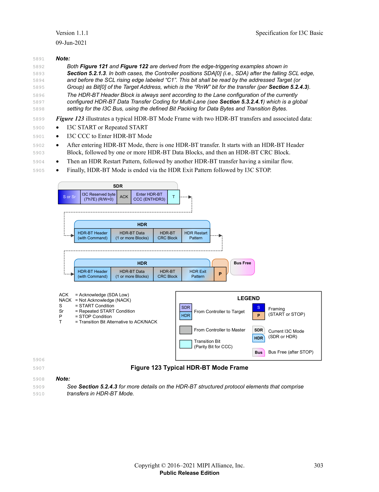

## _**Note:**_ 

**`5908`** _**Note:**_ **`5909`** _See_ _**Section 5.2.4.3** for more details on the HDR-BT structured protocol elements that comprise_ **`5910`** _transfers in HDR-BT Mode._ 

Copyright © 2016–2021 MIPI Alliance, Inc. **Public Release Edition** 

303 

Specification for I3C Basic 

Version 1.1.1 09-Jun-2021 

## **5.2.4.1 SDA Lane Bit Packing: Data Bytes (Commands, Data, CRC)** 

> **`5911`** On the SDA[x] Lanes, HDR-BT always packs bytes of Data in the same way, based on number of Lanes as **`5912`** shown in _**Table 70**_ through _**Table 72**_ . **`5913`** Note that Transition control packing is different, per _**Section 5.2.4.2**_ . **`5914`** _**Note:**_ **`5915`** _Unlike SDR Mode, the bits are transmitted starting with LSb and progressing to MSb._ 

## **`5916`** 

**Table 70 Data Byte Bit Packing: Single Lane** 

|**SDA Lane**|**Clock 0**|**Clock 0**|**Clock 1**|**Clock 1**|**Clock 2**|**Clock 2**|**Clock 3**|**Clock 3**|
|---|---|---|---|---|---|---|---|---|
|SDA[0]|Bit0|Bit1|Bit2|Bit3|Bit4|Bit5|Bit6|Bit7|


## **`5917`** 

**Table 71 Data Byte Bit Packing: Dual Lane** 

|**SDA Lane**|**Clock 0**|**Clock 0**|**Clock 1**|**Clock 1**|
|---|---|---|---|---|
|SDA[0]|Bit0|Bit2|Bit4|Bit6|
|SDA[1]|Bit1|Bit3|Bit5|Bit7|


## **`5918`** 

**Table 72 Data Byte Bit Packing: Quad Lane** 

|**SDA Lane**|**Clock 0**|**Clock 0**|
|---|---|---|
|SDA[0]|Bit0|Bit4|
|SDA[1]|Bit1|Bit5|
|SDA[2]|Bit2|Bit6|
|SDA[3]|Bit3|Bit7|


Copyright © 2016–2021 MIPI Alliance, Inc. **Public Release Edition** 

304 

Version 1.1.1 09-Jun-2021 

Specification for I3C Basic 

## **5.2.4.2 SDA Lane Bit Packing: Transition Bytes** 

> **`5919`** HDR-BT always packs bytes of Transition content, whether pure Transition or Transition and Control, in a **`5920`** consistent way. In particular, the SDA[0] Lane always follows the I3C “Park1,High-Z” convention for the **`5921`** first two half-clocks of the byte. As a result, SDA[0] is always 1 (Parked) for the rising SCL edge, and then **`5922`** treated as High-Z for the falling SCL edge, to enable flow control. **`5923`** To keep things simple, the convention is to treat the “Park1” and “High-Z” as Bit[0] and Bit[1] of the byte, **`5924`** with the low-level logic handling the repositioning based on number of Lanes as shown in _**Table 73**_ through **`5925`** _**Table 75**_ . That is, the byte received will have 2’b11 in Bits[1:0] when the High-Z was not driven Low, with **`5926`** the remaining bits representing the content. 

- **`5927`** When compared with the bit packing for data bytes, the transition bytes change as follows: **`5928`** • **For Single Lane:** No changes, since all Bits are sent in order. **`5929`** • **For Dual Lane:** Bit[2] is sent where Bit[1] would typically be sent for a data byte (i.e., the rising **`5930`** edge of SDA[1] for Clock 0). **`5931`** • **For Quad Lane:** Bit[4] is sent where Bit[1] would typically be sent for a data byte (i.e., the rising **`5932`** edge of SDA[1] for Clock 0). **`5933` Table 73 Transition Byte Bit Packing: Single Lane** 

|**SDA Lane**|**Clock 0**|**Clock 0**|**Clock 1**|**Clock 1**|**Clock 2**|**Clock 2**|**Clock 3**|**Clock 3**|
|---|---|---|---|---|---|---|---|---|
|SDA[0]|Park1|High-Z|Bit2|Bit3|Bit4|Bit5|Bit6|Bit7|
|**_Note:_**<br>_Compared to a data byte, Bits[7:2] are unchanged. See_**_Table 70_**_for comparison._|||||||||


## **`5934` Table 74 Transition Byte Bit Packing: Dual Lane with Bit2 Swizzle** 

|**SDA Lane**|**Clock 0**|**Clock 0**|**Clock 1**|**Clock 1**|
|---|---|---|---|---|
|SDA[0]|Park1|High-Z|Bit4|Bit6|
|SDA[1]|Bit2 (See Note 1)|Bit3|Bit5|Bit7|
|**_Note:_**<br>_1._<br>_Bit2 takes the typical place for Bit1 (i.e., for a data byte), since the High-Z bit on_<br>_SDA[0] is always Bit1 for a transition byte._<br>_2._<br>_Compared to a data byte, Bits[7:3] are unchanged. See_**_Table 71_**_for comparison._|||||


```
5935
```

**Table 75 Transition Byte Bit Packing: Quad Lane with Bit4 Swizzle** 

|**SDA Lane**|**Clock 0**|**Clock 0**|
|---|---|---|
|SDA[0]|Park1|High-Z|
|SDA[1]|Bit4_(See Note 1)_|Bit5|
|SDA[2]|Bit2|Bit6|
|SDA[3]|Bit3|Bit7|
|**_Note:_**<br>_1._<br>_Bit4 takes the typical place for Bit1 (i.e., for a data byte), since the High-Z bit on_<br>_SDA[0] is always Bit1 for a transition byte._<br>_2._<br>_Compared to a data byte, Bits[3:2] and Bits[7:5] are unchanged. See_**_Table 72_**_for_<br>_comparison._|||


Copyright © 2016–2021 MIPI Alliance, Inc. **Public Release Edition** 

305 

Specification for I3C Basic 

Version 1.1.1 09-Jun-2021 

## **5.2.4.3 HDR-BT Mode Structured Protocol Elements** 

> **`5936`** The main structuring of the HDR-BT mode is broken into 3 top-level units: 

|**Header Block**<br>7 bytes|**N * Data Blocks**<br>Each block is 32 bytes data + 1 byte control|**CRC-16**or**CRC-32**<br>6 bytes|
|---|---|---|
||Target may emit SCL if Read||


- **`5937`** Where: **`5938`** • The **Header** indicates the Target (or Group) and the Direction for the transfer, as well as 4 bytes **`5939`** optionally associated with command/index/offset and/or expected length. 

- **`5940`** This follows the normal I[2] C and I3C protocol of the first byte(s) on Write being the **`5941`** index/command, and Write preceding Read containing the index/command. 

## **`5942`** _**Note:**_ 

**`5943`** _The actual interpretation is a contract between Controller and Target._ 

- **`5944`** • **Data** is 0 or more 32-byte Data Blocks. The _processed_ length of the last block may be ragged. 

- **`5945`** Data Blocks use 33 bytes for each 32 bytes of real data, with one byte used for transition and **`5946`** control. 

- **`5947`** • **CRC** shall be either a CRC-16 or a CRC-32 verification at the end of the Message, occupying 6 **`5948`** bytes. The selection between CRC-16 and CRC-32 shall be made by the Controller, and shall be **`5949`** indicated in the Header. 

Copyright © 2016–2021 MIPI Alliance, Inc. **Public Release Edition** 

306 

Version 1.1.1 09-Jun-2021 

Specification for I3C Basic 

> **`5950`** The Header Block shall be 7 bytes in length, formed as 6 bytes + 1 Transition byte: 

## **5.2.4.3.1 Header Block** 

|**Byte 0**|**Byte 1**|**Byte 2**|**Byte 3**|**Byte 4**|**Byte 5**|**Byte 6**|
|---|---|---|---|---|---|---|
|**Address**|**Cmd0**|**Cmd1**|**Cmd2**|**Cmd3**|**Control**|**Transition**|


## **`5951`** Where: 

```
5952
```

   - **Address** shall be **either** : 

- **`5953`** • The 7-bit I3C Dynamic Address of the Target to be addressed for this transfer, in Bits[7:1], **`5954`** with Bit[0] = 0 for a Write, or = 1 for a Read; **or** 

- **`5955`** • A valid 7-bit Group Address (if assigned and supported) in Bits[7:1], with Bit[0] set to 0 (as **`5956`** this case is always a Write); **or** 

- **`5957`** • The I3C Broadcast Address (i.e., 7’h7E), which indicates framing for CCC transmission in **`5958`** HDR-BT Mode (per _**Section 5.2.4.4**_ ). 

- **`5959`** • **Cmd0** to **Cmd3** may be used as the indicator to the Target (or Group) as to the meaning/context of **`5960`** the data: 

**`5961`** • If **Address** is a Dynamic Address or Group Address (i.e., is not 7’h7E), then this transfer is a **`5962`** generic Write or Read transfer. **`5963`** For a generic Write or Read transfer, fields **Cmd0** through **Cmd3** would typically be used **`5964`** as with standard I3C SDR protocols, for command/index/offset and length (actual or **`5965`** maximum), but the exact meaning is a contract between the Controller and the Target (or **`5966`** all Targets in an assigned Group). 

- **`5967`** • If **Address** is 7’h7E (as defined above), then per _**Section 5.2.4.4**_ this is a CCC. 

**`5968`** • If this is the first HDR-BT Header Block with Address 7’h7E, then **Cmd0** shall be the CCC **`5969`** Code, and the Controller starts the CCC modality. **`5970`** • Subsequent HDR-BT Header Blocks shall comprise CCC flows, until the Controller exits **`5971`** the CCC modality by using a valid HDR-BT CCC End Procedure per _**Section 5.2.4.4.7**_ . **`5972`** _**Note:**_ **`5973`** _Per_ _**Table 16** , only some CCCs may be used in HDR-BT Mode._ 

- **`5974`** • **Control** is a byte and shall be formatted thus: 

- **`5975`** • **Bit[0]** = 0 for a Write, or = 1 for a Read. It shall match **Address** Bit[0]. 

- **`5976`** • **Bit[1]** = 0 if CRC-16 is used, or = 1 if CRC-32 is used. 

- **`5977`** • The Controller shall not select CRC-32 if the addressed Target (or Group) does not support **`5978`** CRC-32. **`5979`** • The Target shall not accept a Message indicating CRC-32 if it does not support CRC-32. **`5980`** (If **Address** indicates a Group Address, then all Targets assigned to that Group Address **`5981`** must support CRC-32.) 

- **`5982`** • **Bit[2]** : 

- **`5983`** • **For a Read,** Bit[2] = 0 if the Controller transmits SCL, or = 1 if the Target transmits SCL. 

- **`5984`** The Controller shall not select “Target transmits SCL” unless the Target supports **`5985`** it. The Target shall not accept a Message indicating that it supplies SCL if it does **`5986`** not actually support driving SCL. 

- **`5987`** • **For a Write** , Bit[2] is Reserved and shall be set to 1’b0. 

- **`5988`** • **Bit[3]** = 0 for a normal Message, or = 1 for a continuation of a Direct CCC (GET or SET). 

- **`5989`** • **Bits[5:4]** are Reserved and shall be set to 2’b00. 

Copyright © 2016–2021 MIPI Alliance, Inc. **Public Release Edition** 

307 

Specification for I3C Basic 

Version 1.1.1 09-Jun-2021 

**`5990`** • **Bits[7:6]** = Parity 0 and Parity 1 on the whole Header (up through this **Control** byte), using the **`5991`** even and odd positioned bits respectively. This follows a model similar to HDR-DDR (see **`5992`** _**Section 5.2.2.1**_ ), using an XOR function: **`5993`** Bit[6] = Parity of the even index bits, from Header Bytes 0 through 5, and 1: **`5994` Address** [0] ^ **Address** [2] ^ **Address** [4] ^ **Address** [6] ^ **`5995` Cmd0** [0] ^ **Cmd0** [2] ^ **Cmd0** [4] ^ **Cmd0** [6] ^ **`5996` Cmd1** [0] ^ **Cmd1** [2] ^ **Cmd1** [4] ^ **Cmd1** [6] ^ **`5997` Cmd2** [0] ^ **Cmd2** [2] ^ **Cmd2** [4] ^ **Cmd2** [6] ^ **`5998` Cmd3** [0] ^ **Cmd3** [2] ^ **Cmd3** [4] ^ **Cmd3** [6] ^ **`5999` Control** [0] ^ **Control** [2] ^ **Control** [4] ^ 1 **`6000`** Bit[7] = Parity of the odd index bits, from Header Bytes 0 through 5: **`6001` Address** [1] ^ **Address** [3] ^ **Address** [5] ^ **Address** [7] ^ **`6002` Cmd0** [1] ^ **Cmd0** [3] ^ **Cmd0** [5] ^ **Cmd0** [7] ^ **`6003` Cmd1** [1] ^ **Cmd1** [3] ^ **Cmd1** [5] ^ **Cmd1** [7] ^ **`6004` Cmd2** [1] ^ **Cmd2** [3] ^ **Cmd2** [5] ^ **Cmd2** [7] ^ **`6005` Cmd3** [1] ^ **Cmd3** [3] ^ **Cmd3** [5] ^ **Cmd3** [7] ^ **`6006` Control** [1] ^ **Control** [3] ^ **Control** [5] **`6007`** _**Note:**_ **`6008`** _The Controller shall compute the Parity for all other bits in the Header Block, including any_ **`6009`** _reserved fields; but not for any fields in the following_ _**Transition** byte, which would not yet_ **`6010`** _have been sent on the SDA Lane(s) by the time the_ _**Control** byte was sent._ 

**`6011`** • **Transition** occupies one byte, and shall use the SDA[0] Line for the first 2 half-clocks, and shall **`6012`** follow the I3C “Park1,High-Z” approach for Bus transition and acceptance (see _**Section 5.2.4.2**_ ). **`6013`** • **Bits[1:0]** : **`6014`** • Bit[0] as SDA[0]’s first half-clock shall be Parked High by the Controller **`6015`** • Bit[1] as SDA[0]’s second half-clock shall be High-Z by Controller; the Target (or all **`6016`** Targets in the Group) shall either drive it Low in order to accept the Write or Read, or else **`6017`** leave it undriven to not accept (see _**Section 5.2.4.7**_ ). **`6018`** _**Note:**_ **`6019`** _If there is a Read request, and if the Target sources the Clock, then the Controller shall_ **`6020`** _also release the clock during the second half-clock period if the Target is accepting (i.e.,_ **`6021`** _if SDA[0] is driven to zero), so that the Target drives the next Edge._ **`6022`** _The SCL handoff follows the convention that if the Target is accepting, then it shall_ **`6023`** _drive/hold the SCL line High (i.e., the same as the Controller) during this half-clock, so_ **`6024`** _that they overlap._ **`6025`** _If the Target does not drive the clock within_ _**tBT_HO** (i.e., the HDR-BT handoff period)_ **`6026`** _after accepting, then the Controller shall regain control._ **`6027`** • **Bit[2]** : 

- **`6028`** • **For a Read** : 

- **`6029`** • Bit[2] = 0 indicates that the Target is permitted to use the Data Block Delay **`6030`** mechanism if it needs extra time to prepare data to return for the Read transfer. See **`6031`** _**Section 5.2.4.3.4**_ for more details. **`6032`** The Controller may not use Bit[2] = 0 if it already allowed or previously **`6033`** configured another Target to terminate a long transfer (per **`6034`** _**Section 5.2.4.3.4**_ ). **`6035`** • Bit[2] = 1 indicates that the Target may not use Data Block Delay for this read **`6036`** transfer. **`6037`** • **For a Write** , Bit[2] is Reserved and shall be set to 1’b0 **`6038`** • **Bits[7:3]** are Reserved and shall be set to 5’d0 

Copyright © 2016–2021 MIPI Alliance, Inc. **Public Release Edition** 

308 

Version 1.1.1 09-Jun-2021 

Specification for I3C Basic 

## **5.2.4.3.2 Data Blocks** 

> **`6039`** Each Data block shall be formed as 33 bytes: 

**Transition_Control Data 0 to 31** 

## **`6040`** Where: 

- **`6041`** • **Transition_Control** occupies one byte, and shall use the SDA[0] line for the first two half-clocks, **`6042`** and follows the I3C “Park1,High-Z” approach for termination by the receiver (see **`6043`** _**Section 5.2.4.2**_ ). **`6044`** • **Bits[1:0]** : **`6045`** • Bit[0] as SDA[0]’s first half-clock shall be Parked High by the transmitter of the data (i.e., by **`6046`** the Controller for a Write, or by the Target for a Read). **`6047`** • Bit[1] as SDA[0]’s second half-clock shall be High-Z’ed by the transmitter of the data (i.e., by **`6048`** the Controller for a Write, or by the Target for a Read). The receiver may drive SDA[0] Low to **`6049`** terminate the transmission, otherwise the receiver leaves it undriven to allow the data to **`6050`** continue normally. **`6051`** _**Note:**_ **`6052`** _If terminated, then the transmitter will emit a CRC Block as the next byte (see_ **`6053`** _**Section 5.2.4.7** )._ **`6054`** • **Bit[2]** = 0 if not the Last Data Block, or = 1 if the Last Data Block before the CRC Block. **`6055`** • **Bit[3]** = Odd Parity of this **Transition_Control** byte bits [2] to [7]. This is not parity of the data. **`6056`** The data validity is handled by the CRC at the end (i.e., in the CRC Block; see _**Section 5.2.4.3.3**_ ). **`6057`** _**Note:**_ **`6058`** _If the_ _**Transition_Control** parity does not match, or if the “Park1” is not 1, then there is a_ **`6059`** _framing error. The High-Z may be 0 if the other side has terminated or if a separate_ **`6060`** _Target was permitted to terminate and has done so. See_ **Section 5.2.4.3.4** _for details._ **`6061`** If this is the Last Data Block before the CRC Block, then: **`6062`** • **Bits[7:4]** = Byte-pairs in Data Block minus 1 (i.e., 0xF if all 32, or 0x0 for 2 bytes) **`6063`** If this is not the Last Data Block, then: **`6064`** • **Bits[7:5]** are Reserved and shall be set to 3’d0 **`6065`** • **Bit[4]** : **`6066`** • **For a Read:** **`6067`** • Bit[4] = 0 indicates that the Target (as transmitter) is sending a valid Data Block. **`6068`** • Bit[4] = 1 indicates that the Target (as transmitter) is using the Data Block Delay **`6069`** mechanism, to delay sending the next Data Block in this transfer. The Target **`6070`** may only use the Data Block Delay mechanism if the Controller indicated that **`6071`** the Target was permitted to do so (i.e., if it sent the **Transition** byte with Bit[2] = **`6072`** 0 in the Header Block for this Read transfer; see _**Section 5.2.4.3.4**_ for more **`6073`** details). **`6074`** • **For a Write:** Bit[4] shall be set to 0. 

**`6075`** • **Data** shall be transmitted from Byte 0 to Byte 31 **`6076`** _**Note:**_ **`6077`** _For the Last Data Block, the receiver shall ignore padding Bytes past the ragged length. These extra_ **`6078`** _bytes should be set to 8’d0, but may contain any value._ 

**`6079`** _**Note:**_ 

**`6080`** _It is recommended for the Last Data Block length to match the receiver’s natural data width, such as_ **`6081`** _32 bits or 64 bits to match internal memory or buses. Further, if the data is encrypted, then the_ **`6082`** _encryption algorithm’s blocking size should be considered (e.g., 128-bit for AES)._ 

Copyright © 2016–2021 MIPI Alliance, Inc. **Public Release Edition** 

309 

Specification for I3C Basic 

Version 1.1.1 09-Jun-2021 

## **5.2.4.3.3 CRC Block** 

> **`6083`** The CRC Block is formed as 6 bytes: 

|**Byte 0**|**Byte 1**|**Byte 2**|**Byte 3**|**Byte 4**|**Byte 5**|
|---|---|---|---|---|---|
|**Control**|**CRC0**|**CRC1**|**CRC2**<br>_if CRC-32_|**CRC3**<br>_if CRC-32_|**Transition_**<br>**Verify**|


- **`6084`** Where: **`6085`** • **Control** is a byte that indicates that this CRC Block is not another Data Block, since Bit[0] is 0 **`6086`** (Low) instead of 1 (i.e., Parked High). 

**`6087`** The CRC Block should be expected, since either the previous Data Block indicated it was the Last **`6088`** Data Block, or else the transfer was terminated (i.e., High-Z driven Low by the receiver). 

**`6089`** The **Control** byte also verifies the CRC type previously selected in the Header Block, and whether **`6090`** the previous Data Block was a Last Data Block, or was Terminated. 

**`6091`** Therefore, the **Control** byte shall contain: 

- **`6092`** • **Bits[2:0]** = 3’b0 always. 

**`6093`** • **Bit[3]** = Odd Parity of this **Control** byte’s Bits[7:2] **`6094`** _**Note:**_ **`6095`** _If the parity does not match, or if Bit[0] is not = 0, or if Bit[1] is not = 0, then there is a framing_ **`6096`** _error._ **`6097`** • **Bit[4]** = 0 always **`6098`** • **Bit[5]** = Same value as the Header Block’s **Control** byte, Bit[1]: 1’b0 for CRC-16, or 1’b1 for **`6099`** CRC-32. **`6100`** _**Note:**_ **`6101`** _If this value does not match the value from the Header bit, then there is an error._ 

- **`6102`** • **Bit[6]** = 0 if the transaction ended normally, or = 1 if the previous Data Block was terminated **`6103`** (i.e., if its High-Z was driven to 0 by the receiver). **`6104`** _**Note:**_ **`6105`** _If this bit does not agree with what the receiver believes actually happened, then there is an_ **`6106`** _error. That is, if the receiver did not see the last Data Block terminated (either by itself, or by_ **`6107`** _a separate Device), and the transmitter says it was terminated, then there is an error._ **`6108`** _Likewise, if the receiver did not see the last Data Block marked as Last, but the transmitter_ **`6109`** _says it ended normally, then there is an error._ **`6110`** • **Bit[7]** = Reserved and shall be set to 1’b0. 

Copyright © 2016–2021 MIPI Alliance, Inc. **Public Release Edition** 

310 

Version 1.1.1 09-Jun-2021 

Specification for I3C Basic 

- **`6111`** • Bytes **CRC0** to **CRC3** shall contain the value of the specified CRC algorithm, as computed by the **`6112`** transmitter: either CRC-16, or CRC-32 (if supported). 

**`6113`** The transmitter shall calculate the checksum based on the valid contents of all previous Data **`6114`** Blocks that were sent before this CRC Block, using the following requirements: 

- **`6115`** • For each Data Block except the Last Data Block, this includes the entire 33-byte contents of **`6116`** the Data Block (i.e., the value in the **Transition_Control** byte, as well as all 32 Data bytes). 

- **`6117`** • For the Last Data Block, this includes the **Transition_Control** byte, as well as the number of **`6118`** valid Data bytes in the Last Data Block (i.e., as indicated by the number of byte-pairs, sent in **`6119`** Bits[7:4] of the **Transition_Control** byte). However, any padding bytes in the Last Data Block **`6120`** shall be ignored. 

- **`6121`** • In either case, all bits in the **Transition_Control** byte shall always be included, even if the **`6122`** receiver terminates the transfer during the **Transition_Control** byte (i.e., by driving SDA[0] to **`6123`** Low). 

- **`6124`** • For terminated transfers, the actual values driven on the SDA[0] Lane shall be used, and **`6125`** the transmitter shall include only the **Transition_Control** byte. Note that the transmitter **`6126`** will start emitting a CRC Block as the next byte after the **Transition_Control** byte, if the **`6127`** receiver terminates the transfer (see _**Section 5.2.4.3.2**_ ). 

- **`6128`** In this case, for the purposes of checksum calculation, the transmitter shall not **`6129`** include any subsequent data bytes that it intended to send, but would have been **`6130`** skipped due to a terminated transfer. 

**`6131`** The following structured protocol elements shall not be included in the checksum calculation: 

- **`6132`** • The Header Block shall be ignored. 

- **`6133`** • If this is a Read transfer, and if the Target (as transmitter) was permitted to use the Data Byte **`6134`** Delay mechanism (see _**Section 5.2.4.3.4**_ ), then the transmitter shall ignore any Delay bytes **`6135`** that it might send in place of valid Data Blocks. Only valid Data Blocks shall be used in the **`6136`** calculation of the checksum. 

- **`6137`** • The **Control** byte in the CRC Block shall be ignored. 

**`6138`** The receiver shall also calculate the checksum based on the same requirements, as it receives each **`6139`** Data Block during the transfer. 

**`6140` If Bit[1] in the Header Block’s Control byte is 1’b0, then the transmitter shall use CRC-16:** 

**`6141`** For CRC-16, the generator polynomial is: 

```
6142
```

X[16] + X[15] + X[2] + 1 

**`6143`** _**Note:**_ 

**`6144`** _For shift register implementations, this polynomial is expressed as 0x8005 in big-endian_ **`6145`** _notation, or 0xA001 in little-endian notation._ 

```
6146
```

   - The initial value is all 1s (i.e., 0xFFFF). 

- **`6147`** • The natural bit order of data in HDR-BT Mode is little endian, so Bytes 1 and 2 (fields **`6148` CRC0** and **CRC1** ) shall contain the calculated checksum: 

- **`6149`** • Byte 1 ( **CRC0** ) shall contain bits[7:0] of the checksum 

- **`6150`** • Byte 2 ( **CRC1** ) shall contain bits[15:8] of the checksum 

- **`6151`** • Bytes 3 and 4 (fields **CRC2** and **CRC3** ) shall contain all 0s. 

Copyright © 2016–2021 MIPI Alliance, Inc. **Public Release Edition** 

311 

Specification for I3C Basic 

Version 1.1.1 09-Jun-2021 

**`6152` If Bit[1] in the Header Block’s Control byte is 1’b1, then the transmitter shall use CRC-32:** **`6153`** For CRC-32, the generator polynomial is: **`6154`** X[32] + X[26] + X[23] + X[22] + X[16] + X[12] + X[11] + X[10] + X[8] + X[7] + X[5] + X[4] + X[2] + X + 1 

## **`6155`** _**Note:**_ 

**`6156`** _For shift register implementations, this polynomial is expressed as 0x04C11DB7 in_ **`6157`** _big-endian notation, or 0xEDB88320 in little-endian notation._ 

- **`6158`** • The initial value is all 1s (i.e., 0xFFFFFFFF). **`6159`** • The natural bit order of data in HDR-BT Mode is little-endian, so Bytes 1 through 4 (fields **`6160` CRC0** through **CRC3** ) shall contain the calculated checksum, as follows: **`6161`** • Byte 1 ( **CRC0** ) shall contain bits[7:0] of the checksum **`6162`** • Byte 2 ( **CRC1** ) shall contain bits[15:8] of the checksum **`6163`** • Byte 3 ( **CRC2** ) shall contain bits[23:16] of the checksum **`6164`** • Byte 4 ( **CRC3** ) shall contain bits[31:24] of the checksum 

```
6165
```

## **Example CRC Checksum Calculations** 

**`6166`** _**Table 76**_ presents example CRC checksum calculations as a reference. All values are presented **`6167`** using big-endian notation, and the CRC-16 and CRC-32 values are based on the initial value of all **`6168`** 1s. For each example it is assumed that the CRC checksum is calculated from a data message **`6169`** having a single byte. 

```
6170
```

**Table 76 Example CRC Checksum Calculations** 

|**Data Byte**|**CRC-16**|**CRC-32**|
|---|---|---|
|0x00|0x40BF|0x2DFD1072|
|0x91|0xEC7E|0xAAF5B3A0|
|0xF7|0xC6FE|0x0E2477CD|


## _**Note:**_ 

**`6171`** _**Note:**_ **`6172`** _In the examples above, the computed checksum after the single data byte could also be viewed_ **`6173`** _as the state after processing the first byte of a longer message. The example for data byte 0xF7 is_ **`6174`** _relevant, as this matches the expected value of the_ _**Transition_Control** byte for a Last Data Block_ **`6175`** _that contains 32 valid data bytes (see_ _**Section 5.2.4.3.2** )._ 

Copyright © 2016–2021 MIPI Alliance, Inc. **Public Release Edition** 

312 

Version 1.1.1 09-Jun-2021 

Specification for I3C Basic 

- **`6176`** • The **Transition_Verify** byte serves two purposes: **`6177`** • For a Read, it is used to hand the SDA[x] lines off, back to the Controller; similarly, if the **`6178`** Target is sourcing SCL, then **Transition_Verify** allows handing the SCL sourcing role back as **`6179`** well. **`6180`** • For a Read or Write, it allows the receiver (which could be either the Controller or the Target) **`6181`** to verify that the value provided in the **CRC** field (i.e., sent in fields **CRC0** through **CRC3** ) **`6182`** matched the output of the selected CRC algorithm, and therefore that the Message was **`6183`** correctly received. The receiver shall use the same method for computing the CRC checksum **`6184`** as the transmitter, by using the valid contents of all received Data Blocks (as defined above). **`6185` Transition_Verify** shall use the SDA[0] line for the first two half-clocks, and shall follow **`6186`** the I3C “Park1,High-Z” approach for completion by the receiver (see _**Section 5.2.4.2**_ ). **`6187`** • **Bits[1:0]** : **`6188`** • Bit[0] as SDA[0]’s first half-clock shall be Parked High by the transmitter of the data (i.e., **`6189`** by the Controller for a Write, or by the Target for a Read). **`6190`** • Bit[1] as SDA[0]’s second half-clock shall be High-Z’ed by the transmitter of the data **`6191`** (i.e., by the Controller for a Write, or by the Target for a Read). **`6192`** To confirm that the CRC field value matched the output of the selected CRC **`6193`** algorithm, the receiver shall drive SDA[0] Low. Alternatively, if the CRC did **`6194`** not match, then the receiver shall leave the SDA[0] line undriven (and therefore **`6195`** High) for Bit[1]. **`6196`** _**Note:**_ **`6197`** _If the Target was driving the SCL during a Read, then it shall hand off the SCL on the_ **`6198`** _second half-clock. The Controller shall drive/hold the SCL line High during this second_ **`6199`** _half-clock, matching the Target, and then drive the next SCL clock edge._ **`6200`** _For error handling, if the Target stops driving the Clock for more than tBT_FREQ, then the_ **`6201`** _Controller will take over the clock. This would happen in the event that the Controller_ **`6202`** _has lost framing due to an error._ **`6203`** 

- **`6204`** • **Bits[4:2]** = 3’b0 always. 

```
6205
```

## _**Note:**_ 

**`6206`** _Due to the different bit packing schemes for HDR-BT transition bytes (which depend on_ **`6207`** _the Multi-Lane configuration of the addressed Target or Group for a transfer) these bits_ **`6208`** _cannot be usable for any meaningful purpose by the receiver, and thus may never be_ **`6209`** _used by the receiver to indicate any post-transfer status or subsequent actions._ **`6210`** • **Bits[7:5]** : **`6211`** • Reserved for future use by MIPI I3C WG. These bits shall be set to 3’d0. 

Copyright © 2016–2021 MIPI Alliance, Inc. **Public Release Edition** 

313 

Specification for I3C Basic 

Version 1.1.1 09-Jun-2021 

**`6212` For HDR-BT Read transfers** , the Target shall release SDA[0] after the second half-clock (i.e., **`6213`** Bit[1]). Subsequent actions shall depend on the bit packing scheme, per _**Section 5.2.4.2**_ , as **`6214`** follows: 

- **`6215`** • **If the Target was configured to use a bit packing scheme with multiple clock cycles (i.e.,** **`6216` Single Lane or Dual Lane):** If the Controller (as receiver) does not verify the transfer and **`6217`** leaves SDA[0] undriven for the second half-clock, then it shall pull SDA[0] Low after Bit[1] **`6218`** (i.e., the following half-clock), unless it loses framing or there is an error. **`6219`** • **If the Target was configured to use a bit packing scheme with a single clock cycle (i.e., Quad** **`6220` Lane):** If the Controller (as receiver) does not verify the transfer and leaves SDA[0] undriven **`6221`** for the second half-clock, then SDA[0] shall remain High through the end of the **`6222` Transition_Verify** byte. After this, the CRC Block ends and the Controller typically drives **`6223`** either the HDR Restart Pattern or the HDR Exit Pattern. 

**`6224` For HDR-BT Read transfers that use additional Data Lanes** , the Target shall drive these Data Lanes **`6225`** (e.g., SDA[1:3]) to Low for the first half-clock, and then High-Z these Lanes for the second half- **`6226`** clock (i.e., along with the High-Z of SDA[0]). If the Target was providing SCL clock, then this **`6227`** coincides with the handoff of SCL and SDA[0] to the Controller (as receiver). Unless the **`6228`** Controller encounters a framing issue and must use an error recovery procedure (i.e., without **`6229`** verifying the Read transfer), the Controller shall take ownership of these additional Data Lanes for **`6230`** the second half-clock, and shall drive them Low at the appropriate time to either verify or not **`6231`** verify the transfer. **`6232` For HDR-BT Write transfers** , the Controller (as transmitter) shall drive SDA[0] to Low as required **`6233`** by the configured bit packing scheme, after providing the receiver (i.e., the addressed Target or **`6234`** Group) an opportunity to verify the transfer for the second half-clock. After this opportunity, the **`6235`** Controller shall control and drive SDA[0] as required by the bit packing scheme to ensure that **`6236`** Bits[4:2] are always 3’d0: **`6237`** • **If the receiver was configured to use a bit packing scheme with multiple clock cycles (i.e.,** **`6238` Single Lane or Dual Lane):** If the receiver does not verify the transfer and leaves SDA[0] **`6239`** undriven (i.e., High) for the second half-clock, then the Controller shall pull SDA[0] Low **`6240`** after Bit[1] (i.e., the following half-clock); and subsequently shall either hold SDA[0] Low **`6241`** through the end of the **Transition_Verify** byte, or optionally (i.e., by prior agreement and **`6242`** configuration) High-Z or drive to High SDA[0] as needed (i.e., for any such reserved **`6243`** Bits[7:5] that might be used) per the bit packing scheme. Following the last clock cycle, the **`6244`** Controller shall pull SDA[0] High before it drives either the HDR Restart Pattern or the HDR **`6245`** Exit Pattern. **`6246`** • **If the receiver was configured to use a bit packing scheme with a single clock cycle (i.e.,** **`6247` Quad Lane):** If the receiver does not verify the transfer and leaves SDA[0] undriven (i.e., **`6248`** High) for the second half-clock, then SDA[0] shall remain High through the end of the **`6249` Transition_Verify** byte. After this, the CRC Block ends and the Controller shall drive either **`6250`** the HDR Restart Pattern or the HDR Exit Pattern. 

**`6251` For HDR-BT Write transfers that use additional Data Lanes** , the Controller shall drive these Data **`6252`** Lanes (e.g., SDA[1:3]) to Low (i.e., 0 values) for the first half-clock. Subsequently, the Controller **`6253`** shall either hold these Data Lanes to Low for the remaining clock cycles of the **Transition_Verify** **`6254`** byte; or optionally (i.e., by prior agreement and configuration) High-Z or drive to High any **`6255`** relevant Data Lanes as needed (i.e., for any such reserved Bits[7:5] that might be used) for the **`6256`** receiver’s bit packing scheme. **`6257`** _**Note:**_ **`6258`** _The HDR-BT CRC Block diagrams in_ _**Section 5.2.4.6** show the reserved Bits[7:5] as 3’d0._ 

Copyright © 2016–2021 MIPI Alliance, Inc. **Public Release Edition** 

314 

Version 1.1.1 09-Jun-2021 

Specification for I3C Basic 

## **5.2.4.3.4 Data Block Delay Mechanism** 

> **`6259`** The Data Block Delay mechanism is intended to allow Targets to get additional time when returning Read **`6260`** data. It is mainly intended for situations where the Controller provides the clock (i.e., controls SCL for a **`6261`** Read transfer). However, it may still be useful when the Target controls SCL for a Read transfer, because it **`6262`** allows the Controller to terminate the Read transfer instead of requiring the Controller to continue waiting **`6263`** for the Target to provide data (i.e., where the Controller would become stuck for up to the maximum number **`6264`** of delay attempts). 

**`6265` Operational Flow** 

**`6266`** At the start of each HDR-BT Read transfer, the Controller shall determine whether the Target is permitted to **`6267`** use the Data Block Delay mechanism, and indicate this in Bit[2] of the **Transition** byte of the Header Block: **`6268`** if Bit[2] has a value of 1, then the Target is not permitted to use the Data Block Delay mechanism. However, **`6269`** if Bit[2] has a value of 0, then the Target (as transmitter) is permitted to use the Data Block Delay mechanism **`6270`** (see _**Section 5.2.4.3.1**_ ). **`6271`** _**Note:**_ **`6272`** _The remainder of this section assumes that the Controller indicated that the Target was permitted to_ **`6273`** _use the Data Block Delay mechanism during an HDR-BT Read transfer._ 

**`6274`** During the Read transfer, as the Target (as transmitter) prepares to send each Data Block except the Last Data **`6275`** Block (per _**Section 5.2.4.3.2**_ ), it may choose either of two options: 

**`6276` Either:** 

- **`6277`** • Send the next Data Block with a full 32 bytes of data. 

**`6278`** First, the Target sends the **Transition_Control** byte, with Bit[4] having a value of 0; then the Target **`6279`** sends the remaining 32 bytes of Data (i.e., Byte 0 to Byte 31). This is a complete Data Block. 

**`6280` Or:** 

- **`6281`** • Delay sending the Data Block, and send a Delay byte in its place. 

**`6282`** The Target sends a single **Transition_Control** byte (per _**Section 5.2.4.3.2**_ ), using the same **`6283`** “Park1,High-Z” mechanism on SDA[0]. In Bit[4] the Target sends a value of 1, indicating that it is **`6284`** delaying the next Data Block and not providing a full Data Block at this time. 

**`6285`** The Target (as transmitter) may send up to the maximum number of Delay bytes (i.e., up to **tBT_DBD** at each **`6286`** opportunity) before it must either send the next real Data Block (i.e., with a full 32 bytes of data), or send a **`6287`** Last Data Block to end the HDR-BT Read transfer. 

```
6288
```

## **Usage Notes** 

**`6289`** The Controller (as receiver) shall examine the value of Bit[4] to determine whether the first byte is the **`6290` Transition_Control** byte (i.e., is the start of a valid Data Block), or is a Delay byte. Upon making this **`6291`** determination, the Controller may decide that it does not wish to continue waiting for delayed Data Blocks **`6292`** and instead wishes to end the transfer, and it may do so using the “Park1,High-Z” mechanism on SDA[0], at **`6293`** any of the Delay bytes (i.e., as it would with a typical Data Block). 

**`6294`** _**Note:**_ 

**`6295`** _HDR-BT packs bytes of Transition content using different bit packing schemes, based on the Multi-_ **`6296`** _Lane configuration of the Target that is addressed in the Header Block (per_ _**Section 5.2.4.2** ). Since_ **`6297`** _these bit packing schemes have different locations for Bit[4] with respect to the timing and the_ **`6298`** _“Park1,High-Z” mechanism, the knowledge that a received byte is a Delay byte (and not the first valid_ **`6299`** _**Transition_Control** byte in a real Data Block) might be transmitted_ _**after** the Controller’s opportunity_ **`6300`** _to drive SDA[0] Low to terminate the transmission. In QUAD Lane configuration, the Target sends_ **`6301`** _Bit[4] early enough to give the Controller the opportunity to terminate the transmission. However, in_ **`6302`** _DUAL Lane or SINGLE Lane configurations, the Target sends Bit[4] later, so Controller must react_ **`6303`** _afterwards. As a result, the next opportunity for the Controller to use the “Park1,High-Z” mechanism_ **`6304`** _(for DUAL Lane and SINGLE Lane configurations) is at the start of the next Delay byte, or the next_ **`6305`** _real Data Block._ 

Copyright © 2016–2021 MIPI Alliance, Inc. **Public Release Edition** 

315 

Specification for I3C Basic 

Version 1.1.1 09-Jun-2021 

**`6306`** The Target may use the Data Block Delay mechanism repeatedly throughout the HDR-BT Read transfer, **`6307`** before the first Data Block or any subsequent Data Block, so long as Bit[2] of **Transition_Control** is 0 (i.e., **`6308`** not a Last Data Block). 

**`6309`** The Data Block Delay mechanism should not be used when the Controller has activated any other Targets **`6310`** wishing to have the right to terminate the transaction, as they may not be able to track this mechanism **`6311`** properly. That is, when the Controller is Reading from Target A, but has also activated Target B in order to **`6312`** be able to terminate the transaction, then it should indicate that Data Block Delay is not permitted. 

**`6313`** If the Controller controls the SCL for a Read transfer, and if the Target is not permitted to use the Data Block **`6314`** Delay mechanism but still cannot provide Data Blocks to safely maintain the HDR-BT Read transfer (i.e., **`6315`** due to internal data readiness), then the Controller might need to slow the SCL (i.e., reduce the data rate) to **`6316`** better match the Target’s capability. This either should be arranged by private contract between the Controller 

**`6317`** and Target, or should be discovered from the Target before the Controller starts the HDR-BT Read transfer. **`6318`** _**Note:**_ **`6319`** _The I3C Basic Specification does not define a mechanism for discovering a Target’s capability to_ **`6320`** _provide Read data using HDR-BT, or whether it can sustain HDR-BT Read transfers at a given_ **`6321`** _minimum transfer rate. It is assumed that this mechanism could be a private contract between the_ **`6322`** _Controller and the Target, or could be discovered and controlled by other configuration methods._ 

**`6323`** Alternatively, if the Target is unable to provide the next Data Block that contains a full 32 bytes of data, then **`6324`** it may emit a Last Data Block and end the transaction early. **`6325`** _**Note:**_ 

**`6326`** _The I3C Basic Specification does not define a mechanism for the Target (as transmitter) to explicitly_ **`6327`** _inform the Controller (as receiver) that a Last Data Block was unexpected, in cases where the Target_ **`6328`** _was unable to provide a Data Block that contained a full 32 bytes of data. This may happen if the_ **`6329`** _Target was unable to provide a full 32 bytes of data at a sustained rate due to extended delay_ **`6330`** _conditions (i.e., a prolonged stall from other application logic). The Target may encounter this_ **`6331`** _situation, even when using the Data Block Delay mechanism, if it had already sent the maximum_ **`6332`** _number of Delay bytes before the next Data Block. The Target may also encounter this situation if it_ **`6333`** _was not permitted to use the Data Block Delay mechanism. In either case, the Controller must handle_ **`6334`** _such a situation where the full data message for a Read transfer is shorter than expected, based on_ **`6335`** _the specific I3C content protocol or a private contract between Controller and Target._ 

Copyright © 2016–2021 MIPI Alliance, Inc. **Public Release Edition** 

316 

Version 1.1.1 09-Jun-2021 

Specification for I3C Basic 

> **`6336`** The Bus efficiency can be seen in _**Table 77**_ using 12.5 MHz; all numbers can be scaled to Freq: 

## **5.2.4.3.5 Performance** 

## **`6337`** 

## **Table 77 Bus Efficiency** 

|**Measurement**|**Raw Rate**<br>**(Single / Dual / Quad)**|**Real Data Rate**<br>**Calculation1**|**Single / Dual / Quad**<br>**Real Data Rate**<br>**(Rounded)**|
|---|---|---|---|
|Data blocks|25 Mbps / 50 Mbps / 100 Mbps|32 / 33 * freq|24 Mbps / 48 Mbps /<br>96.97 Mbps|
|1 KByte Message|“ / ”|1024 / (1024+12) * 32 / 33 * freq|23.96 Mbps / 47.9 Mbps /<br>95.8 Mbps|
|10 KByte Message|“ / ”|10K / (10K+12) * 32 / 33 * freq|24 Mbps / 48 Mbps /<br>96.86 Mbps|
|**_Note:_**<br>_1. The equation for Messages (vs. just data blocks) factors in the header and CRC as overhead._<br>_However, to keep it simple, the expression is incorrect by 12*33/32 or 0.375*freq, so about 1 KHz_<br>_worst case._||||


- **`6338`** Worst case and average delay when terminating a Message early at 12.5 MHz: 

- **`6339`** • **Single Lane:** Worst Case: 10.5 µs, Average: 5.28 µs. Plus 1.92 µs for CRC **`6340`** • **Dual Lane:** Worst Case: 5.28 µs, Average: 2.64 µs. Plus 960 ns for CRC **`6341`** • **Quad Lane:** Worst Case: 2.64 µs, Average 1.32 µs. Plus 480 ns for CRC **`6342`** _**Note:**_ 

- **`6343`** • _Parity is only lightly used in this protocol. It is mainly used to catch framing errors. The positive_ **`6344`** _Verification at the end (after the CRC) ensures that the transmission was correct in terms of bits_ **`6345`** _and framing._ 

- **`6346`** • _The Verify model allows the I3C Controller’s Host system to operate a TCP/IP style windowing_ **`6347`** _mechanism to avoid the processor having to check too often. This means that the Host can_ **`6348`** _queue up blocks of, e.g., 1 K to 10 K bytes, and then pipeline back the verify successes/failures,_ **`6349`** _allowing the Host to resubmit any that failed, freeing up ones that succeeded._ 

Copyright © 2016–2021 MIPI Alliance, Inc. **Public Release Edition** 

317 

Specification for I3C Basic 

Version 1.1.1 09-Jun-2021 

## **5.2.4.4 CCC Transmission in HDR-BT Mode** 

> **`6350`** A special HDR-BT syntax is used for transmitting Common Command Codes in the HDR-BT protocol. The **`6351`** following formats are defined, as specific instantiations of the generic HDR CCC flows (see _**Section 5.2.1.2**_ ). **`6352`** The Broadcast CCC flow is shown in _**Figure 124**_ , and the Direct CCC flow is shown in _**Figure 125**_ . 

**==> picture [419 x 177] intentionally omitted <==**

**----- Start of picture text -----**<br>
HDR-BT CCC Indicator Block (CCC Command)<br>WRITE, Broadcast Address (7'h7E), Broadcast CCC, etc...<br>SY<br>HDR-BT Header Block<br>S, Enter HDR or  Byte 0: Broadcast Address Bytes 2-4: optional Defining Byte  Control  Transition<br>HDR RESTART Byte 1: Broadcast CCC value and/or data message (WR, 1'b0) (ACK)<br>HDR-BT CCC Data Block CRC Block THREE VERSIONS<br>Selectable END of<br>add’l Optional Data CCC Procedure<br>END of this CCC<br>HDR-BT Data Block HDR-BT CRC Block<br>Transition  Bytes 1-32: optional data message  Control Byte,  Transition  HDR-BT CCC<br>Control (continued) CRC for Data Verify END PROCEDURE<br>Write to all Targets<br>**----- End of picture text -----**<br>


From Controller to Target 

**`6353 6354`** 

**Figure 124 Begin Broadcast CCC in HDR-BT** 

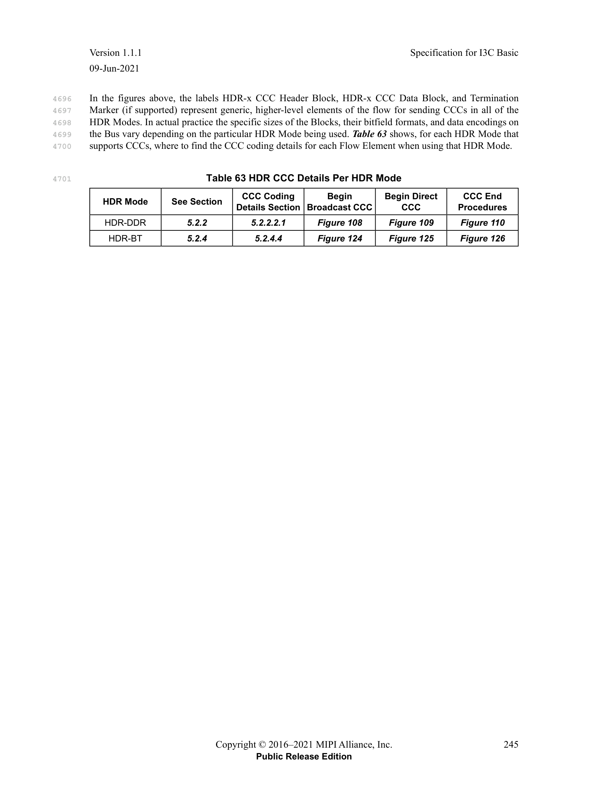

Copyright © 2016–2021 MIPI Alliance, Inc. **Public Release Edition** 

318 

Version 1.1.1 09-Jun-2021 

Specification for I3C Basic 

**==> picture [660 x 332] intentionally omitted <==**

**----- Start of picture text -----**<br>
HDR-BT CCC Indicator Block (CCC Command) CRC Block<br>WRITE, Broadcast Address (7'h7E), Direct CCC, etc...<br>Td<br>HDR-BT Header Block HDR-BT CRC Block<br>S, Enter HDR or  Byte 0: Broadcast Address Byte 2: optional Defining Byte Control  Transition  Control Byte, CRC  Transition<br>HDR RESTART Byte 1: Direct CCC value Bytes 3-4: reserved (WR, 1'b0) (ACK) for Indicator Verify<br>HDR-BT CCC Selector Block (Target) HDR-BT CCC Data Block CRC Block<br>WRITE to Target Indicator, Target Address Repeat N times, for all Data<br>HDR-BT Header Block HDR-BT Data Block HDR-BT CRC Block<br>HDR  Byte 0: Target/Group Address Bytes 2-4: reserved Control  Transition  Transition  Bytes 1-32: Control Byte, Transition<br>RESTART  Byte 1: reserved (WR, 1'b0) (ACK) Control data message CRC for Data Verify<br>HDR-BT CCC Selector Block (Target) HDR-BT CCC Data Block CRC Block THREE VERSIONS<br>Selectable END of<br>READ from Source Indicator, Target Address Repeat N times, for all Data CCC Procedure<br>END of this CCC<br>HDR-BT Header Block HDR-DDR Data Block HDR-BT CRC Block<br>HDR  Byte 0: Target Address Bytes 2-4: reserved Control  Transition  Transition  Bytes 1-32: Control Byte, Transition  HDR-BT CCC<br>RESTART  Byte 1: reserved (RD, 1'b1) (ACK) Control data message CRC for Data Verify END PROCEDURE<br>Controller to Target Handoff Target to Controller Handoff<br>From Controller to Target From Target to Controller   Multi-Lane data permitted (per Target config)<br>6355  7 7<br>6356  Figure 125 Begin Direct CCC in HDR-BT<br>Write segment (Direct SET)<br>Read segment (Direct GET)<br>**----- End of picture text -----**<br>


Copyright © 2016–2021 MIPI Alliance, Inc. **Public Release Edition** 

319 

Specification for I3C Basic 

Version 1.1.1 09-Jun-2021 

## **5.2.4.4.1 HDR-BT CCC Header Block** 

> **`6357`** Two versions of the HDR-BT Header Block are defined: HDR-BT CCC Indicator Block and HDR-BT CCC **`6358`** Selector Block. 

## **HDR-BT CCC Indicator Block** 

**`6359`** An HDR-BT CCC Header Block that begins the framing for a Broadcast CCC or a Direct CCC shall be **`6360`** referred to as the HDR-BT CCC Indicator Block. 

**`6361`** The HDR-BT CCC Indicator Block shall take the structure of the HDR-BT Header Block Format (see **`6362`** _**Section 5.2.4.3.1**_ ). It is a common CCC Flow Element, and shall always be transmitted according to the bit **`6363`** packing format for the currently configured HDR-BT Coding (see _**Section 5.3.2.4.1**_ ). 

- **`6364`** • The **Address** field (byte 0) shall contain the Broadcast Address (7’h7E). 

- **`6365`** • The **Cmd0** field (byte 1) shall contain the Command Code. 

- **`6366`** • For Direct CCCs, the **Cmd1** field (byte 2) shall contain the optional Defining Byte for the **`6367`** Command Code. If the CCC does not support an optional Defining Byte, then the **Cmd1** field shall **`6368`** contain the value 8’h00 for a Direct CCC framing. 

- **`6369`** • For a Broadcast CCC framing, fields **Cmd1** / **Cmd2** / **Cmd3** may store the first three data bytes of the **`6370`** Broadcast data, as needed: 

- **`6371`** • If the Broadcast data is less than three bytes, then the unused fields shall contain the value **`6372`** 8’h00, and Targets shall ignore any fields whose bytes are not part of the data format defined **`6373`** for this Broadcast CCC. 

- **`6374`** • If the Broadcast data is longer than three bytes, then the Controller shall also send those **`6375`** subsequent bytes in additional Data Blocks following the Header Block. However, Targets **`6376`** shall first acknowledge receipt of the Header Block, as defined below. 

- **`6377`** • The **Control** field (byte 5) shall be set to indicate the start of a CCC: 

- **`6378`** • Bit[0] contains 1’b0 to indicate a Write. 

- **`6379`** • Bit[3] contains 1’b0 to indicate the beginning of a CCC framing. 

- **`6380`** • Other bitfields shall be set accordingly. 

## **HDR-BT CCC Selector Block** 

**`6381`** An HDR-BT CCC Header Block that begins a Read Segment or a Write Segment in Direct CCC framing **`6382`** shall be referred to as the HDR-BT CCC Selector Block. 

**`6383`** The HDR-BT CCC Selector Block shall take the structure of the HDR-BT Header Block Format (see **`6384`** _**Section 5.2.4.3.1**_ ). It is a common CCC Flow Element, and shall always be transmitted according to the bit **`6385`** packing format for the currently configured HDR-BT Coding (see _**Section 5.3.2.4.1**_ ). 

- **`6386`** • The **Address** field (byte 0) shall contain the Address of the Target (or Group) to be addressed in **`6387`** this Segment of the Direct CCC. 

- **`6388`** • The **Cmd0** / **Cmd1** / **Cmd2** / **Cmd3** fields (bytes 1-4) shall be reserved, and shall each be set to 8’h00. 

- **`6389`** • The **Control** field (byte 5) shall be set to indicate the continuation of a Direct CCC: 

- **`6390`** • **Bit[0]** contains 1’b0 to indicate a Write Segment (i.e., Direct Write or Direct SET), or 1’b1 to **`6391`** indicate a Read Segment (i.e., Direct Read or Direct GET). Note that Group Addresses may **`6392`** only be used with Write Segments. 

- **`6393`** • **Bit[3]** contains 1’b1 to indicate the continuation of a Direct CCC framing. 

- **`6394`** • Other bitfields shall be set accordingly. 

Copyright © 2016–2021 MIPI Alliance, Inc. **Public Release Edition** 

320 

Version 1.1.1 09-Jun-2021 

Specification for I3C Basic 

## **5.2.4.4.2 HDR-BT CCC Data Block** 

> **`6395`** An HDR-BT CCC Data Block may follow an HDR-BT CCC Header Block, in the appropriate place for either **`6396`** a Broadcast CCC flow or a Direct CCC flow (see _**Figure 124**_ or _**Figure 125**_ ). 

## **Broadcast CCC Flow** 

**`6397`** The HDR-BT CCC Data Block in a Broadcast CCC flow shall take the structure of the HDR-BT Data Block **`6398`** Format (see _**Section 5.2.4.3.2**_ ), and shall contain up to 32 bytes of data in its payload. **`6399`** As described in _**Section 5.2.1.2**_ , HDR-BT CCC Data Blocks are common CCC Flow Elements and shall **`6400`** always be transmitted according to the bit packing format for the currently configured HDR-BT Coding (see **`6401`** _**Section 5.3.2.4.1**_ ). 

## **Direct CCC Flow** 

**`6402`** The HDR-BT CCC Data Block in a Direct CCC flow (as part of a Write Segment or Read Segment) is a per- **`6403`** Target CCC Flow Element, and shall be transmitted according to the bit packing format of the currently **`6404`** configured Multi-Lane Frame format and Data Transfer Coding (see _**Section 5.3.2.4.1**_ ) for the addressed **`6405`** Target (or Group). 

**`6406`** This may use a different bit packing format, and may use more additional data Lanes than the preceding **`6407`** HDR-BT CCC Selector Word. If so, then the Controller and indicated Target (or Targets in a Group, if **`6408`** applicable) shall correctly switch from one bit-packing format to another, as part of the CCC flow. 

## **5.2.4.4.3 HDR-BT CRC Block** 

**`6409`** An HDR-BT CRC Block serves as the Termination Marker, as described in the HDR-x generic CCC flows. **`6410`** To conform to the HDR-BT Mode Framing model (see _**Section 5.2.4.3**_ ), this Termination Marker uses the **`6411`** same structure as the standard HDR-BT CRC Block. 

## **Broadcast CCC Flow** 

**`6412`** For the end of Broadcast data in a Broadcast CCC flow, the Controller shall transmit the HDR-BT CRC Block **`6413`** (see _**Section 5.2.4.3.3**_ ) at the end of the Broadcast data message. 

**`6414`** As described in _**Section 5.2.1.2**_ , HDR-BT CCC CRC Blocks are common CCC Flow Elements and shall **`6415`** always be transmitted according to the bit packing format for the currently configured HDR-BT Coding (see **`6416`** _**Section 5.3.2.4.1**_ ). This bit packing format shall be the same as that used in the preceding Block. 

## **Direct CCC Flow** 

**`6417` Indicator Block:** When used after the HDR-BT CCC Indicator Block and any optional HDR-BT CCC Data **`6418`** Blocks for the framing of a Direct CCC flow (i.e., before the first Read or Write Segment), the HDR-BT **`6419`** CRC Block shall be transmitted by the Controller, as described above. This is also a common CCC flow **`6420`** element. 

**`6421` Segment :** For the end of a Read or Write Segment sent in a Direct CCC flow, the HDR-BT CRC Block is a **`6422`** per-Target CCC Flow Element, and shall be transmitted according to the bit packing format of the currently **`6423`** configured Multi-Lane Frame format and Data Transfer Coding (see _**Section 5.3.2.4.1**_ ) for the addressed **`6424`** Target or Group. This bit packing format shall be the same as that used in the preceding HDR-BT CCC Data **`6425`** Block. 

Copyright © 2016–2021 MIPI Alliance, Inc. **Public Release Edition** 

321 

Specification for I3C Basic 

Version 1.1.1 09-Jun-2021 

## **5.2.4.4.4 HDR-BT CCC Indicator Block ACK** 

> **`6426`** Per _**Section 5.2.1.2.2**_ , a Target that supports CCCs in HDR-BT Mode shall indicate acknowledgement of the **`6427`** receipt of the HDR-BT CCC Indicator Block, using the standard method of acknowledging an HDR-BT **`6428`** write, i.e., by using Bits[1:0] of the Transition byte in the HDR-BT Header Block (per _**Section 5.2.4.3.1**_ ). 

**`6429`** All such Targets shall acknowledge the Indicator Block for both Broadcast CCC flows and Direct CCC flows, **`6430`** since the same HDR-BT CCC Indicator Block format is used to signal the beginning of both flows. 

**`6431`** If the Indicator Block’s Command Code (byte 1) indicates a Direct CCC, then all Targets receiving that **`6432`** Indicator Block shall capture the new Command Code and optional Defining Byte (byte 2) and use these if **`6433`** they are addressed in a future Write or Read Segment in the Direct CCC framing. 

**`6434`** _**Note:**_ 

**`6435`** _For Direct CCC flows, acknowledgement serves the important function of ensuring that a Target_ **`6436`** _Device has captured the Command Code and optional Defining Byte from the Indicator Block, and is_ **`6437`** _ready to match the Address on the next HDR-BT Header Block that is a Selector Block, and make a_ **`6438`** _decision to respond to the Direct CCC if addressed, per_ _**Section 5.2.1.2.2** ._ 

**`6439`** If the Controller does not receive acknowledgement from at least one Target, then it shall use any valid HDR- **`6440`** BT CCC End Procedure. Additionally, the Controller may initiate an error recovery procedure, which might **`6441`** include exiting HDR-BT Mode and attempting to re-send the CCC in SDR Mode. 

## **5.2.4.4.5 HDR-BT CCC Write Segment** 

**`6442`** An HDR-BT CCC Write Segment for a Direct Write or Direct SET CCC shall start with an HDR-BT CCC **`6443`** Selector Block to indicate the Address of the Target (or Group) to receive the data, followed by one or more **`6444`** HDR-BT CCC Data Blocks of the appropriate structure and format, if required by the CCC definition. 

**`6445`** If the CCC definition does not require data to be written to the Target, then no additional Data Blocks shall **`6446`** be sent. 

**`6447`** After the Controller sends the HDR-BT CCC Selector Block, the Target shall either indicate acceptance of **`6448`** the Direct CCC by acknowledging the write, or else reject the Direct CCC by not responding to the Controller. **`6449`** The Target shall use the cached Command Code and optional Defining Byte from the previously received **`6450`** HDR-BT CCC Indicator Block, and shall decide whether to accept or reject the Direct CCC immediately **`6451`** after receiving the HDR-BT CCC Selector Block and matching its own Dynamic Address (or Group Address, **`6452`** if assigned and applicable). 

**`6453`** The Target shall use the standard methods to either accept or reject an HDR-BT write, as defined in **`6454`** _**Section 5.2.4.3.1**_ regarding the handling of Bits[1:0] of the HDR-BT Header Block’s Transition Byte field. 

**`6455`** If the Target rejects the Direct CCC, then the Controller shall either send the HDR Restart Pattern and attempt **`6456`** another Read or Write Segment for this CCC, or else use any valid HDR-BT CCC End Procedure. For Direct **`6457`** CCCs to a Group Address, the Controller only sees this rejection if no Targets accept the Direct CCC. 

**`6458`** If the Target accepts the Direct CCC, then the Controller shall send one or more HDR-BT CCC Data Blocks **`6459`** of the appropriate structure, if required by the CCC definition. Then the Controller shall send an HDR-BT **`6460`** CRC Block to terminate the data and end the Segment. 

**`6461`** At the end of a Write Segment, the Controller shall either send the HDR Restart Pattern and attempt another **`6462`** Read or Write segment for this CCC, or else use any valid HDR-BT CCC End Procedure, per **`6463`** _**Section 5.2.4.4.7**_ . 

Copyright © 2016–2021 MIPI Alliance, Inc. **Public Release Edition** 

322 

Version 1.1.1 09-Jun-2021 

Specification for I3C Basic 

## **5.2.4.4.6 HDR-BT CCC Read Segment** 

- **`6464`** An HDR-BT CCC Read Segment for a Direct Read or Direct GET CCC shall start with an HDR-BT CCC **`6465`** Selector Block to indicate the Address of the Target to provide data for the CCC, followed by a Bus **`6466`** Turnaround. In response, the indicated Target will either accept the Direct CCC by transmitting one or more **`6467`** HDR-BT CCC Data Blocks of the appropriate structure, or else reject the Direct CCC by not responding to **`6468`** the Bus Turnaround condition. 

- **`6469`** The Target shall use the standard methods to either accept or reject an HDR-BT read, as defined in **`6470`** _**Section 5.2.4.3.1**_ regarding the handling of Bits[1:0] of the HDR-BT Header Block’s Transition Byte field. 

- **`6471`** If the Target accepts the Direct CCC, then the Controller shall yield control of the Bus to the Target, so that **`6472`** it can control the Bus to send the Data Blocks. After sending the Last Data Block, the Target shall send an **`6473`** HDR-BT CRC Block, indicating the end of the read transfer. Upon receiving the HDR-BT CRC Block the **`6474`** Target shall yield control of the Bus, and the Controller shall resume control. 

- **`6475`** At the end of a Read Segment, the Controller shall either send the HDR Restart Pattern and attempt another **`6476`** Read or Write Segment for this CCC, or else use any valid HDR-BT CCC End Procedure per **`6477`** _**Section 5.2.4.4.7**_ . 

## **5.2.4.4.7 HDR-BT CCC End Procedures** 

> **`6478`** As illustrated in _**Figure 126**_ , the HDR-BT CCC ends using one of three possible CCC End Procedures. 

## **Option 1: End HDR-BT CCC Followed by New HDR-BT CCC** 

- **`6479`** This End Procedure indicates the end of a Broadcast or Direct CCC in HDR-BT Mode, and the beginning of **`6480`** a new Broadcast or Direct CCC in HDR-BT Mode. 

- **`6481`** This End Procedure begins with an HDR Restart Pattern, followed by an HDR-BT CCC Indicator Block **`6482`** which provides a new CCC with optional Defining Byte. Since the Indicator Block’s Control field (byte 5) **`6483`** signals the beginning of a CCC framing (i.e., Bit[3] is set to 1’b0) the Target shall interpret this as the end of **`6484`** a Direct CCC framing (if present). 

- **`6485`** Following the Indicator Block, additional HDR-BT Blocks shall follow, per the CCC flow type. 

**`6486`** The flow steps are: 

- **`6487`** 1. Controller sends HDR Restart Pattern. 

- **`6488`** 2. Controller sends HDR-BT CCC Indicator Block, using the same format described above. 

- **`6489`** The bit packing format of this Block shall be appropriate for the current Coding’s common CCC **`6490`** flow elements (see _**Section 5.3.2.4.1**_ ). 

- **`6491`** 3. Targets acknowledge receipt of Indicator Block, as defined above. 

- **`6492`** 4. Flow continues as Broadcast CCC or Direct CCC, as shown above. 

Copyright © 2016–2021 MIPI Alliance, Inc. **Public Release Edition** 

323 

Specification for I3C Basic 

Version 1.1.1 09-Jun-2021 

## **Option 2: End HDR-BT CCC Followed by HDR-BT Generic Transaction (+ Optional HDR Exit)** 

**`6493`** This End Procedure indicates the end of CCCs in HDR-BT Mode, and either a return to standard HDR-BT **`6494`** transactions, or a subsequent exit from HDR-BT Mode. 

**`6495`** This End Procedure begins with an HDR Restart Pattern, followed by an HDR-BT Header Block which ends **`6496`** the CCC flow, but is neither an Indicator nor a Selector. This is followed by an HDR-BT CRC Block **`6497`** containing a checksum of the payload from the preceding Header Block. Since the preceding Header Block **`6498`** is neither an Indicator nor a Selector, no CCC or optional Defining Byte is included. 

**`6499`** After this, the HDR Restart Pattern signals the end of CCC modality, and that the next HDR-BT Header **`6500`** Block must be treated as a standard HDR-BT transaction (not as a CCC flow). Alternatively, the HDR Exit **`6501`** Pattern signals the end of HDR-BT Mode and a subsequent return to SDR Mode. 

**`6502`** In either case, the HDR-BT Header Block is distinguished from an HDR-BT CCC Indicator Block because **`6503`** it indicates a ‘Read’ command from the Broadcast Address (7’h7E), which would otherwise be an invalid **`6504`** combination for HDR-BT transactions. Target Devices shall interpret this condition followed by the CRC **`6505`** Block as the Termination Marker ending CCC modality, since this condition is distinct from the start of a **`6506`** new Broadcast CCC or Direct CCC (per CCC End Procedure Option 1, above). 

**`6507`** The flow steps are: 

- **`6508`** 1. Controller sends HDR Restart Pattern. 

- **`6509`** 2. Controller sends HDR-BT Header Block, using the following values: **`6510`** • The **Address** field (byte 0) shall contain the Broadcast Address (7’h7E). **`6511`** • The **Control** field (byte 5) shall be set to indicate the end of the CCC modality: **`6512`** • **Bit[0]** contains 1’b1 to indicate a Read. **`6513`** • **Bit[3]** contains 1’b0 to indicate that Direct CCC framing is not continued from a prior **`6514`** Selector Block (if applicable). 

- **`6515`** • Other bitfields shall be set accordingly. 

- **`6516`** • The bit packing format of this Block shall be appropriate for the current Coding’s common **`6517`** CCC flow elements (see _**Section 5.3.2.4.1**_ ). 

- **`6518`** 3. Targets do not acknowledge receipt of the HDR-BT Header Block. 

- **`6519`** 4. Controller sends the HDR-BT CRC Block. 

- **`6520`** • The bit packing format of this Block shall be appropriate for the current Coding’s common **`6521`** CCC flow elements (see _**Section 5.3.2.4.1**_ ). 

- **`6522`** • Targets detect this distinct pattern (i.e., Read from 7’h7E with no Data Block) and end CCC **`6523`** modality. 

- **`6524`** 5. Controller sends either HDR Restart Pattern, or HDR Exit Pattern. 

- **`6525`** • If HDR Exit Pattern, then Controller exits HDR-BT Mode and returns the Bus to SDR Mode. 

## **Option 3: End HDR-BT CCC and return to SDR Mode** 

**`6526`** This is the simplest End Procedure option. It indicates the end of CCCs in HDR-BT Mode and an immediate **`6527`** exit from HDR-BT Mode. 

**`6528`** The flow steps are: 

- **`6529`** 1. Controller sends HDR Exit Pattern. 

- **`6530`** 2. Controller exits HDR-BT Mode and returns the Bus to SDR Mode. 

Copyright © 2016–2021 MIPI Alliance, Inc. **Public Release Edition** 

324 

Version 1.1.1 

Specification for I3C Basic 

09-Jun-2021 

**==> picture [595 x 403] intentionally omitted <==**

**----- Start of picture text -----**<br>
Last HDR-BT CCC Data Block CRC Block<br>Preceding Command or Data END of Previous CCC<br>a<br>HDR-BT Header or Data Block HDR-BT CRC Block<br>Control Byte, CRC  Transition<br>PRECEDING WRITE for Header/Data Verify<br>HDR-DDR Data Block HDR-BT CRC Block<br>Control Byte, CRC  Transition<br>PRECEDING READ for Data Verify<br>Target to Controller Handoff<br>HDR-BT CCC Indicator Block (CCC Command)<br>WRITE, Broadcast Address (7'h7E),  New  Broadcast or Direct CCC, etc...<br>HDR-BT Header Block<br>RESTART HDR  Byte 0: Broadcast AddressByte 1: Broadcast or Direct CCC value Bytes 2-4: as defined for new CCC Control (WR, 1'b0) Transition (ACK) BEGIN new CCC<br>END of this CCC<br>HDR-BT Header Block (no Indicator or Selector) CRC Block<br>READ , Broadcast Address (7'h7E) End CCC<br>END of modality<br>HDR-BT Header Block HDR-BT CRC Block<br>HDR  Byte 0: Broadcast Address Bytes 2-4: reserved Control  Transition  Control Byte, CRC  Transition  HDR RESTART<br>RESTART  Byte 1: reserved ( RD , 1'b1) (No ACK) for Header Verify or HDR EXIT<br>END of this CCC<br>HDR EXIT<br>From Controller to Target From Target to Controller<br>6531  | o<br>6532  Figure 126 HDR-BT CCC End Procedure Options<br>Remain in CCC modality<br>Return to generic HDR  read/write transactions<br>**----- End of picture text -----**<br>


Copyright © 2016–2021 MIPI Alliance, Inc. **Public Release Edition** 

325 

Specification for I3C Basic 

Version 1.1.1 09-Jun-2021 

## **5.2.4.5 Options** 

> **`6533`** Targets that support HDR-BT shall support CRC-16. 

**`6534`** Targets that support HDR-BT may optionally also support CRC-32. When the **GETCAPS** Format 1 CCC is **`6535`** sent (see _**Section 5.1.9.3.19**_ ), a Target that supports CRC-32 in HDR-BT Mode shall return a value of 1’b1 **`6536`** in bit 5 of the GETCAP3 byte (the third returned data byte). A Controller that sees the value 1’b1 in that bit **`6537`** will know that the Target is capable of supporting CRC-32 in HDR-BT Mode. 

**`6538`** Targets that support HDR-BT shall support SCL from the Controller on Read. They may also optionally **`6539`** support emitting their own SCL on Read. **`6540`** _**Note:**_ **`6541`** _The I3C Basic Specification does not define a mechanism for discovering a Target’s capability to_ **`6542`** _control SCL for Read transfers. The Controller may select whether the Target should control SCL or_ **`6543`** _not control SCL, using Bit[2] of the_ _**Control** byte in the Header Block. Per_ _**Section 5.2.4.3.1** , a Target_ **`6544`** _that does not actually support driving SCL for Read transfers shall not accept (i.e., must provide_ **`6545`** _NACK for) the Read transfer request, if it receives such a Header Block with Bit[2] set to 1 in the_ **`6546`** _**Control** byte. In this case, the Controller should retry the same Read transfer with Bit[2] set to 0, to_ **`6547`** _indicate that the Controller will control SCL for the Read transfer. If the Read transfer request’s_ **`6548`** _Header Block was otherwise valid, then the Target should accept (i.e., should provide ACK for) this_ **`6549`** _Read transfer._ 

**`6550`** Targets may choose to support the Data Block Delay mechanism for Read transfers. This mechanism allows **`6551`** the Target to delay sending a Data Block (when permitted by the Controller, as indicated in the Header Block) **`6552`** if it does not have enough data bytes to fill the Data Block (see _**Section 5.2.4.3.4**_ ). 

**`6553`** _**Note:**_ **`6554`** _The I3C Basic Specification does not define a mechanism for discovering whether the Target_ **`6555`** _supports the Data Block Delay mechanism. If the Target does not support the Data Block Delay_ **`6556`** _mechanism, then it shall ignore the value of Bit[2] in the_ _**Control** byte of the Header Block, when the_ **`6557`** _Header Block indicates that this is a Read transfer. In such a case, the Target must either return full_ **`6558`** _Data Blocks, except for the Last Data Block; or mitigate the situation, depending on whether it_ **`6559`** _controls SCL for this Read transfer._ 

**`6560`** _A) If the Target controls SCL for this Read transfer, then it must either reduce the data rate or end_ **`6561`** _the transfer early, if it is unable to sustain the transfer of data bytes._ 

**`6562`** _B) If the Target does not control SCL for this Read transfer, or if it does not have that capability, then_ **`6563`** _it must end the transfer early, if it is unable to sustain the transfer of data bytes._ 

**`6564`** _If the Target does support the Data Block Delay mechanism, and if it was permitted to use this_ **`6565`** _mechanism for a Read transfer, then the Target may use either of these methods above, that might_ **`6566`** _be valid or permitted, and for which it has the capability; alternately, it may also use Delay bytes, per_ **`6567`** _**Section 5.2.4.3.4** ._ 

Copyright © 2016–2021 MIPI Alliance, Inc. **Public Release Edition** 

326 

Version 1.1.1 

Specification for I3C Basic 

09-Jun-2021 

## **5.2.4.6 Diagrams** 

**==> picture [650 x 281] intentionally omitted <==**

**----- Start of picture text -----**<br>
HEADER BLOCK<br>ADDRESS COMMAND 0 COMMAND 1 ...<br>SDA[0] (RnW)ADDR[0] ADDR[1] ADDR[2] ADDR [3] ADDR [4] ADDR [5] ADDR [6] ADDR [7] Cmd0[0] Cmd0[1] Cmd0 [2] Cmd0 [3] Cmd0[4] Cmd0 [5] Cmd0[6] Cmd0[7] Cmd1[0] Cmd1[1] Cmd1 [2] Cmd1 [3] Cmd1[4] Cmd1 [5] Cmd1[6] Cmd1[7]<br>SCL C1 C2 C3 C4 C5 C6 C7 C8 C9 C10 C11 C12<br>COMMAND 2 COMMAND 3 CONTROL ...<br>SDA[0] Cmd2[0] Cmd2[1] Cmd2[2] Cmd2[3] Cmd2 [4] Cmd2 [5] Cmd2 [6] Cmd2 [7] Cmd3[0] Cmd3[1] Cmd3 [2] Cmd3 [3] Cmd3[4] Cmd3 [5] Cmd3[6] Cmd3[7] CTRL[0] CTRL[1] CTRL [2] CTRL [3] CTRL[4] CTRL [5] CTRL[6] CTRL[7]<br>SCL C13 C14 C15 C16 C17 C18 C19 C20 C21 C22 C23 C24<br>TRANSITION TRANSITIONCONTROL (Data Block)<br>SDA[0] Park 1 High-Z TRANS [2] TRANS [3] TRANS [4] TRANS [5] TRANS [6] TRANS [7] If Target takes over the clock at time window marked with  red , then Controller High-Zs SCL while keeping SDA on<br>High-Z, and Target drives falling edge after SDA Low.<br>SCL C25 C26 C27 C28 If Target does not drive SDA Low or fails to drive SCL<br>within  tBT_HO , then Controller takes back.<br>**----- End of picture text -----**<br>


## **Figure 127 Header Block for Single Lane** 

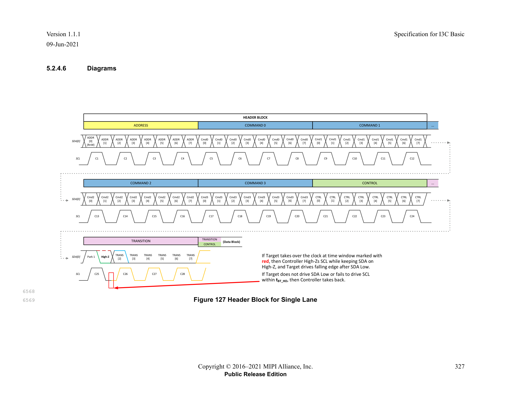

```
6568
6569
```

Copyright © 2016–2021 MIPI Alliance, Inc. **Public Release Edition** 

327 

Specification for I3C Basic 

Version 1.1.1 09-Jun-2021 

```
6570
```

```
6571
```

**==> picture [610 x 295] intentionally omitted <==**

**----- Start of picture text -----**<br>
HEADER BLOCK (Data Block)<br>TRANSITION<br>ADDRESS COMMAND 0 COMMAND 1 COMMAND 2 COMMAND 3 CONTROL TRANSITION CONTROL<br>SDA[1] ADDR ADDR  ADDR  ADDR  Cmd0 Cmd0  Cmd0  Cmd0 Cmd1 Cmd1  Cmd1  Cmd1 Cmd2 Cmd2  Cmd2  Cmd2 Cmd3 Cmd3  Cmd3  Cmd3 CTRL CTRL CTRL CTRL TRANS  TRANS  TRANS  TRANS<br>[1] [3] [5] [7] [1] [3] [5] [7] [1] [3] [5] [7] [1] [3] [5] [7] [1] [3] [5] [7] [1] [3] [5] [7] [2] [3] [5] [7]<br>SDA[0] (RnW)ADDR[0] ADDR[2] ADDR [4] ADDR [6] Cmd0[0] Cmd0 [2] Cmd0[4] Cmd0[6] Cmd1[0] Cmd1 [2] Cmd1[4] Cmd1[6] Cmd2[0] Cmd2 [2] Cmd2[4] Cmd2[6] Cmd3[0] Cmd3 [2] Cmd3[4] Cmd3[6] CTRL[0] CTRL[2] CTRL[4] CTRL[6] Park 1 High-Z TRANS [4] TRANS [6]<br>SCL C1 C2 C3 C4 C5 C6 C7 C8 C9 C10 C11 C12 C13 C14<br>HEADER BLOCK (Data Block)<br>TRANSITION<br>ADDRESS COMMAND 0 COMMAND 1 COMMAND 2 COMMAND 3 CONTROL TRANSITION CONTROL<br>SDA[3] ADDR [3] ADDR [7] Cmd0 [3] Cmd0[7] Cmd1 [3] Cmd1[7] Cmd2 [3] Cmd2[7] Cmd3 [3] Cmd3[7] CTRL[3] CTRL[7] TRANS [3] TRANS [7]<br>If Target takes over the clock at time window marked with<br>SDA[2] ADDR ADDR  Cmd0  Cmd0 Cmd1  Cmd1 Cmd2  Cmd2 Cmd3  Cmd3 CTRL CTRL TRANS  TRANS  red , then Controller High-Zs SCL while keeping SDA on<br>[2] [6] [2] [6] [2] [6] [2] [6] [2] [6] [2] [6] [2] [6] High-Z, and Target drives falling edge after SDA Low.<br>If Target does not drive SDA Low or fails to drive SCL<br>SDA[1] ADDR ADDR  Cmd0 Cmd0  Cmd1 Cmd1  Cmd2 Cmd2  Cmd3 Cmd3  CTRL CTRL TRANS  TRANS  within  tBT_HO , then Controller takes back.<br>[1] [5] [1] [5] [1] [5] [1] [5] [1] [5] [1] [5] [4] [5]<br>SDA[0] (RnW)ADDR[0] ADDR [4] Cmd0[0] Cmd0[4] Cmd1[0] Cmd1[4] Cmd2[0] Cmd2[4] Cmd3[0] Cmd3[4] CTRL[0] CTRL[4] Park 1 High-Z<br>SCL C1 C2 C3 C4 C5 C6 C7 C8<br>Figure 128 Header Block for Dual Lane and Quad Lane<br>**----- End of picture text -----**<br>


Copyright © 2016–2021 MIPI Alliance, Inc. **Public Release Edition** 

328 

Version 1.1.1 09-Jun-2021 

Specification for I3C Basic 

**==> picture [690 x 257] intentionally omitted <==**

**----- Start of picture text -----**<br>
DATA BLOCK<br>TRANSITION<br>CONTROL DATA 0 DATA 1 ...<br>SDA[0] Park 1 High-Z T_CTRL T_CTRL T_CTRL T_CTRL T_CTRL T_CTRL Data0 Data0 Data0 Data0 Data0 Data0 Data0 Data0 Data1 Data1 Data1 Data1<br>[2] [3] [4] [5] [6] [7] [0] [1] [2] [3] [4] [5] [6] [7] [0] [1] [2] [3]<br>SCL C1 C2 C3 C4 C5 C6 C7 C8 C9 C10<br>... DATA 30 DATA 31 ... (Data Block  ...<br>... or CRC Block)<br>Data30 Data30 Data30 Data30 Data31 Data31 Data31 Data31 Data31 Data31 Data31 Data31<br>SDA[0] [4] [5] [6] [7] [0] [1] [2] [3] [4] [5] [6] [7] In Transition_Control byte, transmitter High-Zs SDA[0] for  second<br>half-clock  of C1. If receiver drives SDA[0] to Low ( shown in orange ),<br>this terminates the transmission after the Transition_Control byte.<br>SCL C127 C128 C129 C130 C131 C132 C1 Transmitter then emits a CRC Block Transition_Control). as the next byte  (after<br>If Data Block Delay is permitted: Target as transmitter may drive<br>Transition_Control Bit[4] High ( shown in blue ) to indicate delayed<br>data. Target may repeat for maximum of  tBT_DBD  Delay bytes.  (Does<br>not apply for Last Data Block before CRC Block.)<br>**----- End of picture text -----**<br>


**Figure 129 Data Block for Single Lane** 

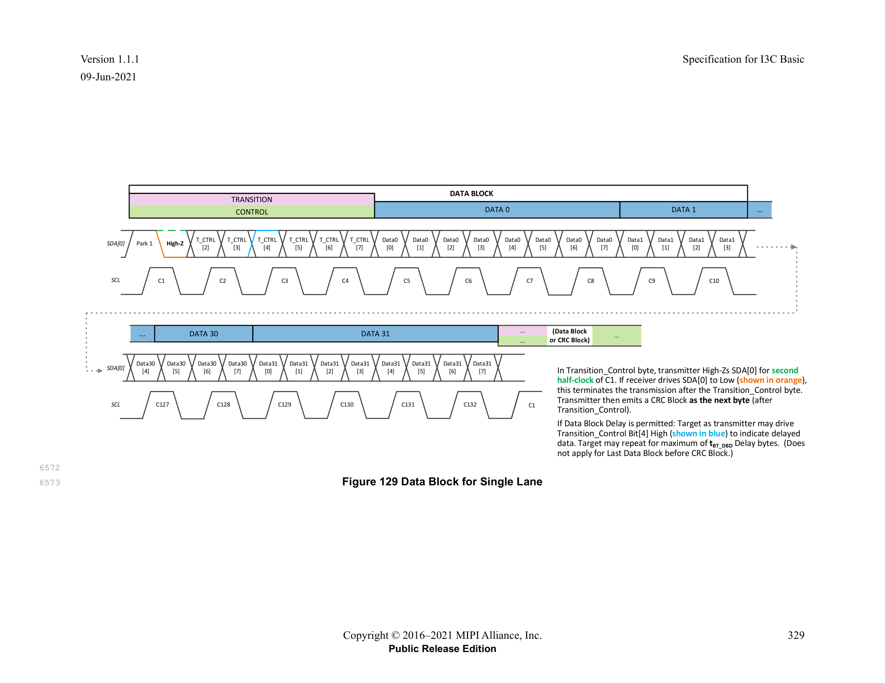

```
6572
6573
```

Copyright © 2016–2021 MIPI Alliance, Inc. 329 **Public Release Edition** 

Specification for I3C Basic 

Version 1.1.1 09-Jun-2021 

**==> picture [561 x 109] intentionally omitted <==**

**----- Start of picture text -----**<br>
DATA BLOCK …<br>TRANSITION<br>CONTROL DATA 0 DATA 1 DATA 30 DATA 31<br>SDA[1] T_CTRL T_CTRL T_CTRL T_CTRL Data0 Data0 Data0 Data0 Data1 Data1 Data1 Data1 Data30 Data30 Data30 Data30 Data31 Data31 Data31 Data31<br>[2] [3] [5] [7] [1] [3] [5] [7] [1] [3] [5] [7] [1] [3] [5] [7] [1] [3] [5] [7]<br>SDA[0] Park 1 High-Z T_CTRL T_CTRL Data0 Data0 Data0 Data0 Data1 Data1 Data1 Data1 Data30 Data30 Data30 Data30 Data31 Data31 Data31 Data31<br>[4] [6] [0] [2] [4] [6] [0] [2] [4] [6] [0] [2] [4] [6] [0] [2] [4] [6]<br>SCL C1 C2 C3 C4 C5 C6 C63 C64 C65 C66 C1<br>**----- End of picture text -----**<br>


**==> picture [307 x 171] intentionally omitted <==**

**----- Start of picture text -----**<br>
DATA BLOCK …<br>TRANSITION<br>CONTROL DATA 0 DATA 1 DATA 30 DATA 31<br>SDA[3] T_CTRL T_CTRL Data0 Data0 Data1 Data1 Data30 Data30 Data31 Data31<br>[3] [7] [3] [7] [3] [7] [3] [7] [3] [7]<br>SDA[2] T_CTRL T_CTRL Data0 Data0 Data1 Data1 Data30 Data30 Data31 Data31<br>[2] [6] [2] [6] [2] [6] [2] [6] [2] [6]<br>SDA[1] T_CTRL T_CTRL Data0 Data0 Data1 Data1 Data30 Data30 Data31 Data31<br>[4] [5] [1] [5] [1] [5] [1] [5] [1] [5]<br>SDA[0] Park 1 High-Z Data0 Data0 Data1 Data1 Data30 Data30 Data31 Data31<br>[0] [4] [0] [4] [0] [4] [0] [4]<br>SCL C1 C2 C3 C32 C33 C1<br>**----- End of picture text -----**<br>


In Transition_Control byte, transmitter High-Zs SDA[0] for **second half-clock** of C1. If receiver drives SDA[0] to Low ( **shown in orange** ), this terminates the transmission after the Transition_Control byte. Transmitter then emits a CRC Block **as the next byte** (after Transition_Control). 

If Data Block Delay is permitted: Target as transmitter may drive Transition_Control Bit[4] High ( **shown in blue** ) to indicate delayed data. Target may repeat for maximum of **tBT_DBD** Delay bytes.  (Does not apply for Last Data Block before CRC Block.) 

**Figure 130 Data Block for Dual Lane and Quad Lane** 

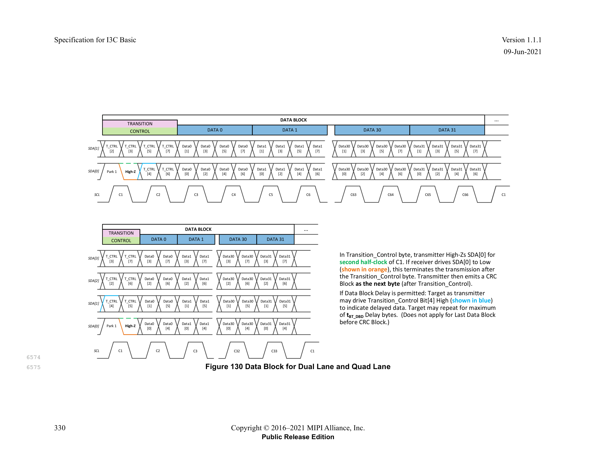

```
6574
6575
```

Copyright © 2016–2021 MIPI Alliance, Inc. **Public Release Edition** 

330 

Version 1.1.1 

Specification for I3C Basic 

09-Jun-2021 

**==> picture [694 x 360] intentionally omitted <==**

**----- Start of picture text -----**<br>
CRC BLOCK<br>CONTROL CRC 0 CRC 1 ...<br>SDA[0] CTRL [0] CTRL [1] CTRL[2] CTRL[3] CTRL[4] CTRL[5] CTRL[6] CTRL[7] CRC0[0] CRC0[1] CRC0[2] CRC0[3] CRC0[4] CRC0[5] CRC0[6] CRC0[7] CRC1[0] CRC1[1] CRC1[2] CRC1[3] CRC1[4] CRC1[5] CRC1[6] CRC1[7]<br>SCL C1 C2 C3 C4 C5 C6 C7 C8 C9 C10 C11 C12<br>For Read transfers:<br>CRC 2 CRC 3 TRANSITION_VERIFY<br>If Target drives SCL,<br>handoff occurs with<br>High−Z of SDA[0], then<br>SDA[0] CRC2[0] CRC2[1] CRC2[2] CRC2[3] CRC2[4] CRC2[5] CRC2[6] CRC2[7] CRC3[0] CRC3[1] CRC3[2] CRC3[3] CRC3[4] CRC3[5] CRC3[6] CRC3[7] Park 1 High-Z TRANS[2] TRANS[3] TRANS[4] TRANS[5] TRANS[6] TRANS[7] Controller drives SCL falling edge (C21)<br>Continue directly to<br>HDR Exit Pattern or<br>SCL C13 C14 C15 C16 C17 C18 C19 C20 C21 C22 C23 C24 HDR Restart Pattern<br>6576<br>6577  Figure 131 CRC Block for Single Lane<br>CRC BLOCK<br>CONTROL CRC 0 CRC 1 CRC 2 CRC 3 TRANSITION_VERIFY<br>SDA[1] CTRL[1] CTRL[3] CTRL[5] CTRL[7] CRC0[1] CRC0[3] CRC0[5] CRC0[7] CRC1[1] CRC1[3] CRC1[5] CRC1[7] CRC2[1] CRC2[3] CRC2[5] CRC2[7] CRC3[1] CRC3[3] CRC3[5] CRC3[7] TRANS[2] TRANS[3] TRANS[5] TRANS[7] For Read transfers:<br>If Target drives SCL,<br>handoff occurs with<br>High−Z of SDA[0], then<br>SDA[0] CTRL[0] CTRL[2] CTRL[4] CTRL[6] CRC0[0] CRC0[2] CRC0[4] CRC0[6] CRC1[0] CRC1[2] CRC1[4] CRC1[6] CRC2[0] CRC2 [2] CRC2[4] CRC2[6] CRC3[0] CRC3[2] CRC3[4] CRC3[6] Park 1 High-Z TRANS[4] TRANS[6] Controller drives SCL falling edge (C11)<br>Continue directly to<br>HDR Exit Pattern or<br>SCL C1 C2 C3 C4 C5 C6 C7 C8 C9 C10 C11 C12 HDR Restart Pattern<br>6578<br>6579  Figure 132 CRC Block for Dual Lane<br>**----- End of picture text -----**<br>


Copyright © 2016–2021 MIPI Alliance, Inc. **Public Release Edition** 

331 

Specification for I3C Basic 

Version 1.1.1 09-Jun-2021 

```
6580
6581
```

**==> picture [393 x 214] intentionally omitted <==**

**----- Start of picture text -----**<br>
CRC BLOCK<br>TRANSITION_<br>CONTROL CRC 0 CRC 1 CRC 2 CRC 3 VERIFY<br>CTRL CTRL CRC0 CRC0 CRC1 CRC1 CRC2 CRC2 CRC3 CRC3 TRANS TRANS<br>SDA[3]<br>[3] [7] [3] [7] [3] [7] [3] [7] [3] [7] [3] [7]<br>CTRL CTRL CRC0 CRC0 CRC1 CRC1 CRC2  CRC2 CRC3 CRC3 TRANS TRANS<br>SDA[2]<br>[2] [6] [2] [6] [2] [6] [2] [6] [2] [6] [2] [6]<br>CTRL CTRL CRC0 CRC0 CRC1 CRC1 CRC2 CRC2 CRC3 CRC3 TRANS TRANS<br>SDA[1]<br>[1] [5] [1] [5] [1] [5] [1] [5] [1] [5] [4] [5]<br>CTRL CTRL CRC0 CRC0 CRC1 CRC1 CRC2 CRC2 CRC3 CRC3<br>SDA[0] Park 1 High-Z<br>[0] [4] [0] [4] [0] [4] [0] [4] [0] [4]<br>SCL C1 C2 C3 C4 C5 C6<br>**----- End of picture text -----**<br>


For Read transfers: If Target drives SCL, handoff occurs with High−Z of SDA[0], then Controller drives SCL falling edge (C6) 

Continue directly to HDR Exit Pattern or HDR Restart Pattern 

**Figure 133 CRC Block for Quad Lane** 

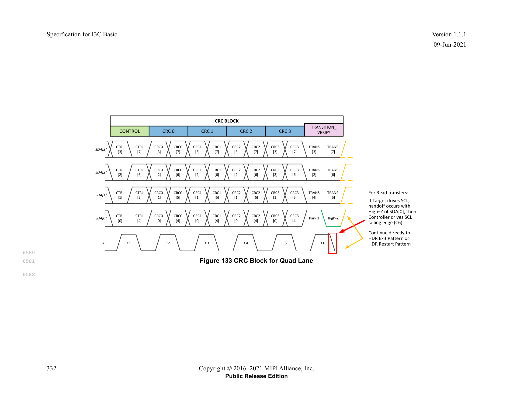

```
6582
```

Copyright © 2016–2021 MIPI Alliance, Inc. **Public Release Edition** 

332 

Version 1.1.1 09-Jun-2021 

Specification for I3C Basic 

## **5.2.4.7 Transfer Flow Control** 

> **`6583`** The Target can use the **Transition** byte, **Transition_Control** byte, and **Transition_Verify** byte to accept or reject **`6584`** a Write transfer, or to provide flow control at defined points during the Write transfer. 

**`6585`** 

   - _**Figure 134**_ shows several examples of Write transfer flow control: 

- **`6586`** • A Target that does not accept the Write transfer; 

- **`6587`** 

- **`6588`** 

   - A Target that accepts the Write transfer and receives all Data Blocks; 

   - A Target that terminates the Write transfer before the Controller has sent all Data Blocks; and 

- **`6589`** • A Target that indicates a CRC mismatch (or other error) after it has received the Data Blocks. 

**==> picture [305 x 361] intentionally omitted <==**

**----- Start of picture text -----**<br>
HDR<br>HDR-BT Header HDR Restart Pattern<br>(with Command) T or HDR Exit Pattern<br>\<br>Target does not accept Write  Controller must either retry, send another<br>transfer in  Transition  byte HDR-BT transfer, or exit HDR-BT Mode<br>HDR<br>HDR-BT Header(with Command) T CT (1 or more Blocks)HDR-BT Data  C CRC BlockHDR-BT VT HDR RestartPattern<br>LN<br>Target accepts Write  Controller sends Data Block(s)<br>transfer in  Transition  byte for typical HDR-BT Write transfer<br>HDR<br>HDR-BT Header(with Command) T CT (1 or more Blocks)HDR-BT Data  CT C CRC BlockHDR-BT VT HDR Restart Pattern or HDR Exit Pattern<br>\<br>Target terminates Write transfer in  Controller sends CRC Block<br>Transition_Control  byte of Data Block as the next byte<br>HDR<br>HDR-BT Header(with Command) T CT (1 or more Blocks)HDR-BT Data  C CRC BlockHDR-BT VT HDR RestartPattern<br>Target indicates CRC mismatch in<br>Transition_Verify  byte of CRC Block<br>LEGEND<br>HDR From Controller to Target T CT Transition, control and verification bytes in<br>Oo Hu HDR-BT Blocks<br>co HDR From Target to Controller UU C VT (structured protocol elements)<br>Transaction rejected or  Current I3C Mode<br>terminated HDR<br>x D (SDR or HDR-BT)<br>**----- End of picture text -----**<br>


**`6590 6591`** 

**Figure 134 HDR-BT Flow Control for Write Transfers** 

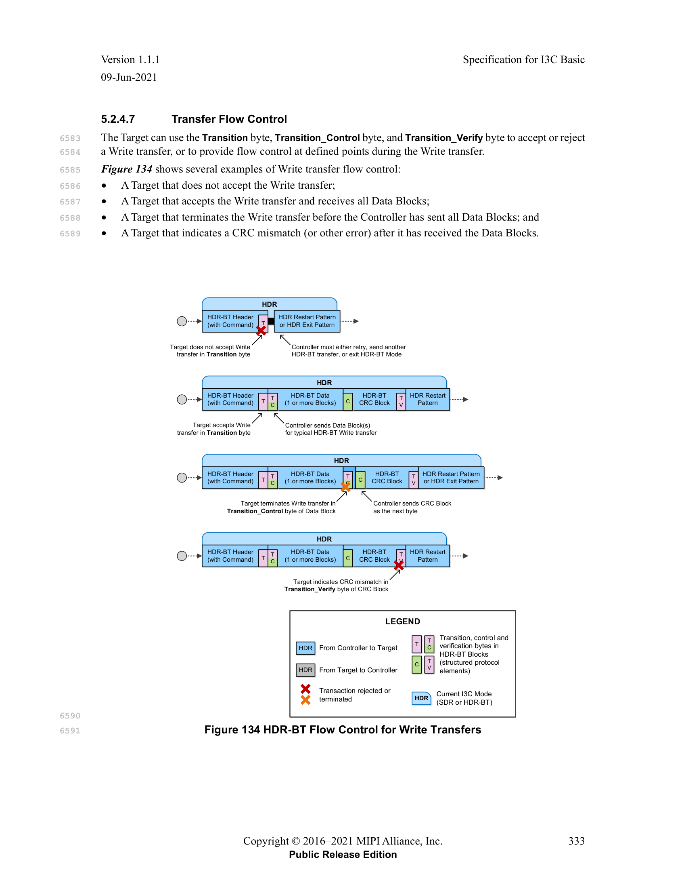

Copyright © 2016–2021 MIPI Alliance, Inc. **Public Release Edition** 

333 

Specification for I3C Basic 

Version 1.1.1 09-Jun-2021 

- **`6592`** The Target can also use the same **Transition** byte, **Transition_Control** byte, and **Transition_Verify** byte to **`6593`** accept or reject a Read transfer, or to provide flow control at defined points during the Read transfer. If the **`6594`** Data Block Delay mechanism is permitted (per _**Section 5.2.4.3.4**_ ), then the Target may also use this **`6595`** mechanism to delay sending Data Blocks while it prepares data to send to the Controller. 

- **`6596`** _**Figure 135**_ shows several examples of Read transfer flow control: 

- **`6597`** • A Target that does not accept the Read transfer; 

- **`6598`** • A Target that accepts the Read transfer and sends all Data Blocks (i.e., without any delay or **`6599`** termination); 

- **`6600`** • A Target that handles the Controller terminating the Read transfer, and subsequently provides the **`6601`** CRC Block after the last Data Block that it sent; and 

- **`6602`** • A Target that uses the Data Block Delay mechanism before sending the first Data Block. 

**`6603 6604`** 

**==> picture [325 x 444] intentionally omitted <==**

**----- Start of picture text -----**<br>
HDR<br>HDR-BT Header HDR Restart Pattern<br>(with Command) T or HDR Exit Pattern<br>Target does not accept Read  Controller must either retry, send another<br>transfer in  Transition  byte HDR-BT transfer, or exit HDR-BT Mode<br>HDR<br>HDR-BT Header(with Command) T CT (1 or more Blocks)HDR-BT Data  C CRC BlockHDR-BT VT HDR RestartPattern<br>Target accepts Read  Target sends Data Block(s)<br>transfer in  Transition  byte for typical HDR-BT Read transfer<br>HDR<br>HDR-BT Header(with Command) T CT (1 or more Blocks)HDR-BT Data  CT C CRC BlockHDR-BT VT HDR Restart Pattern or HDR Exit Pattern<br>Controller terminates Read transfer in  Controller must either confirm CRC<br>Transition_Control  byte of Data Block match, or indicate CRC mismatch<br>Target sends CRC Block as  in  Transition_Verify  byte<br>the next byte after termination<br>CO HDR<br>HDR-BT Header(with Command) T D! D! D! D! CT (1 or more Blocks)HDR-BT Data  C CRC BlockHDR-BT VT HDR RestartPattern<br>Target eventually sends Data Block(s)<br>Controller indicates that for  delayed HDR-BT Read transfer<br>Data Block Delay  is permitted;     - or -<br>Target accepts Read transfer in  Target sends  Delay bytes Target must send Last Data Block, if<br>Transition  byte using  Data Block Delay  maximum number of  Delay bytes<br>mechanism , while it  has been sent (for this point in the transfer)<br>prepares to return data for      - or -<br>HDR-BT Read transfer Controller may terminate the Read transfer<br>LEGEND<br>HDR From Controller to Target T CT Transition, control and verification bytes in<br>Oo HDR From Target to Controller Wu C VT HDR-BT Blocks (structured protocol elements)<br>Data Block Delay byte Current I3C Mode<br>HDR<br>(SDR or HDR-BT)<br>= Transaction rejected or  =<br>terminated<br>Figure 135 HDR-BT Flow Control for Read Transfers<br>**----- End of picture text -----**<br>


Copyright © 2016–2021 MIPI Alliance, Inc. **Public Release Edition** 

334 

Version 1.1.1 09-Jun-2021 

Specification for I3C Basic 

## **5.3 Multi-Lane (ML) Data Transfer** 

**`6605`** Although I3C’s HDR Modes achieve high data rates using two physical wires and advanced data transfer **`6606`** protocols, some applications would benefit from further increases in data throughput. Multi-Lane Data **`6607`** Transfer (ML) is one approach for achieving such increases, by employing any available additional physical **`6608`** wires to transfer the data payload faster. In ML the normal I3C SDA line is referred to as SDA[0], and the **`6609`** additional wires are called SDA[1], SDA[2], and SDA[3]. 

**`6610`** ML’s advantages include reducing energy consumption and increased flexibility in adding features (e.g., **`6611`** procedures to improve data integrity). 

**`6612` Example:** An application with a Camera module using Quad Lanes, an IMU using Dual Lanes, and **`6613`** a simple sensor (such as a temperature sensor) using only I3C SCL and SDA[0] wires, would **`6614`** benefit from ML capability. 

**`6615`** ML data transfer is available for data transfers between ML-capable I3C Devices that have ML functionality **`6616`** enabled. 

**`6617`** Depending upon the Bus design, a given ML-capable Device could reside on the same 2-wire I3C Bus as **`6618`** other non-ML-capable Devices (and/or other ML-capable Devices not currently in an ML-enabled state). **`6619`** Because ML performs all I3C Bus management functions (i.e., START, EXIT, Enter HDR, CCC, Flow **`6620`** Control, etc.) in the ordinary manner using only the SCL and SDA[0] lines, they remain valid and unchanged **`6621`** for all I3C Devices. As a result, ML transfers on an I3C Bus do not adversely affect any non-ML Devices **`6622`** resident on that Bus. 

**`6623`** ML data transfer is available for supported I3C Modes (e.g., HDR-BT), using a per-Mode ML Frame format **`6624`** that specifies how SCL, SDA (referred to as SDA[0]), and the additional data wire(s) are used for ML data **`6625`** transfers in that Mode (see _**Section 5.3.2**_ ). During each ML Frame, ML-capable (and ML-enabled) Devices **`6626`** transfer data using SCL, SDA[0], and the additional data wires supported by that ML Frame format, while **`6627`** any non-ML Devices use only SCL and SDA[0] as usual. 

**`6628`** For HDR-BT Mode, _**Section 5.3.2.4**_ specifies ML Codings for each of the following ML Frame formats: 

- **`6629`** • **DUAL format** supporting three lines: SCL, SDA[0], and SDA[1] 

- **`6630`** • **QUAD format** supporting five lines: SCL, SDA[0], SDA[1], SDA[2], and SDA[3] 

**`6631`** For each supported I3C Mode, the ML Frame formats might be similar in sequence and timing to I3C’s **`6632`** normal (i.e., non-ML) Frame formats, or they might differ substantially, depending on the Data Transfer **`6633`** Coding. 

**`6634`** During ML data transfers, activity on the additional data wire(s) (i.e., SDA[1], SDA[2], and SDA[3]) would **`6635`** not be visible to any non-ML Devices that might be resident on that Bus. Additionally, any ML-capable **`6636`** Devices that support the same I3C Mode but might not be connected to the same additional data wires, or **`6637`** that have not been enabled and configured to utilize these data wires, might not see or properly understand **`6638`** any ML transfers that use more data wires. For such cases, this might lead to failure of interoperability **`6639`** between Devices supporting the same I3C Mode. The specific nature of interoperability failures might depend **`6640`** on the currently configured Data Transfer Coding of such Devices, as well as the ML Frame format used for **`6641`** a particular ML transfer. To prevent such situations, Controllers shall ensure that all Devices supporting that **`6642`** same I3C Mode are configured to use a compatible (i.e., interoperable) Data Transfer Coding that enables **`6643`** interoperability on the I3C Bus. The recommended Data Transfer Coding(s) to use for such situations **`6644`** requiring interoperability shall be defined for each I3C Mode that supports Multi-Lane. **`6645`** _**Note:**_ **`6646`** _Multi-Lane (ML) Frame Formats for other I3C Modes (e.g. SDR, HDR-DDR and HDR-TSP) are not_ **`6647`** _included in I3C Basic. Placeholders for these I3C Modes appear under_ _**Section 5.3.2** ._ 

Copyright © 2016–2021 MIPI Alliance, Inc. **Public Release Edition** 

335 

Specification for I3C Basic 

Version 1.1.1 09-Jun-2021 

## **5.3.1 ML Data Transfer Setup** 

> **`6648`** Set-up of an ML data transfer on an ML-capable I3C Bus has two main parts: 

- **`6649`** 1. Configure and enable the I3C Devices capable of ML transfers using the MLANE CCC **`6650`** ( _**Section 5.3.1.1**_ ) 

```
6651
```

2. The ML Frame format ( _**Section 5.3.2**_ ) 

**`6652`** ML-capable Devices shall default to SINGLE Lane configuration (i.e., basic 2-wire I3C), unless the system **`6653`** designer selects a different default configuration. 

## **5.3.1.1 ML Device Configuration** 

> **`6654`** Controllers shall use the MLANE CCC (see _**Section 5.1.9.3.30**_ ) to set up and control ML functionality for **`6655`** ML-capable Devices. The MLANE CCC sets or gets, for a given I3C Mode ( _**Table 56**_ ), the number of **`6656`** Additional Data Lanes ( _**Table 78**_ ) and the Data Transfer Coding number (see _**Section 5.3.2**_ ) to use while **`6657`** communicating to one or more ML-capable Target Devices using that I3C Mode. 

**`6658`** Controllers shall configure and enable ML-capable Devices via the MLANE CCC prior to starting ML data **`6659`** transfers, for each I3C Mode for which ML data transfers are to be used. An ML-capable Device may be **`6660`** configured to use any supported number of Additional Data Lanes for any supported I3C Mode. 

**`6661`** The Controller shall configure each ML-capable Device with knowledge of its capabilities, and with **`6662`** awareness of the other Devices that support the same I3C Mode(s) and would also be used with ML data **`6663`** transfers, ensuring that such configuration is compatible with the configuration and ML capabilities of such **`6664`** other Devices. 

**`6665`** It is the Controller’s responsibility to successfully manage the configuration of all Target Devices on the Bus **`6666`** when ML data transfers are used. This depends on capability, connectivity, coordination, and configuration. **`6667`** To build a successful Multi-Lane configuration for all Devices on the I3C Bus, the Controller shall first **`6668`** determine which Target Devices are ML-capable, and then test each such Target Device’s connectivity to the **`6669`** Additional Data Lanes (i.e., by using the Direct GET version of the MLANE CCC). For each I3C Mode in **`6670`** which Multi-Lane Transfers will be used, the Controller shall then determine which ML Frame formats are **`6671`** supported by a ML-capable Target Device, and coordinate this with similar data collected from all other ML- **`6672`** capable Target Devices that support that I3C Mode. Finally, once it determines the correct settings that use **`6673`** interoperable Data Transfer Codings, the Controller shall appropriately configure the I3C Bus and all Target **`6674`** Devices, using the MLANE CCC to set the ML Frame Format that shall be used in each I3C Mode. 

**`6675`** An ML-capable Target Device shall have only one ML configuration setting (i.e., number of Additional Data **`6676`** Lanes and Data Transfer Coding number) per I3C Mode at a time, which is associated with its Dynamic **`6677`** Address, unless such a Device has multiple Dynamic Addresses per _**Section 5.3.1.1.2**_ . The Controller shall **`6678`** choose the appropriate Defining Byte as the Sub-Command to configure an ML-capable Target Device for **`6679`** ML transfers in that I3C Mode. 

**`6680`** _**Note:**_ 

**`6681`** _The appropriate ML configuration setting (i.e., ML Frame format) for a particular I3C Mode might_ **`6682`** _depend on the other Devices on the I3C Bus that also support that same I3C Mode (per_ **`6683`** _**Section 5.2.4.7** ). Controllers shall ensure interoperability by choosing an ML configuration setting that_ **`6684`** _is known to be interoperable with other such Devices (i.e., a compatible Data Transfer Coding) that_ **`6685`** _also support that I3C Mode. A recommended procedure for Multi-Lane configuration should include_ **`6686`** _using the MLANE CCC with the Sub-Command for Get ML Capabilities (i.e., Defining Byte 0xFF) to_ **`6687`** _discover the supported capabilities (i.e., the possible ML configurations) of all ML-capable Devices,_ **`6688`** _before using the MLANE CCC with other Sub-Commands to configure any ML-capable Devices for_ **`6689`** _ML transfers for specific I3C Modes._ 

**`6690`** _Controllers should use the GETCAPS Format 1 CCC (see_ _**Section 5.1.9.3.19** and_ _**Table 37** ) to_ **`6691`** _determine whether a Target Device is ML-capable, before using the MLANE CCC to configure and_ **`6692`** _enable it for ML transfers. Additionally, for ML transfers in any HDR Mode, Controllers should also_ **`6693`** _ensure that the HDR Mode is supported by such a Target Device, by using the GETCAPS Format 1_ **`6694`** _CCC (see_ _**Table 35** ). Controllers must also ensure that each Target Device that advertises ML_ 

Copyright © 2016–2021 MIPI Alliance, Inc. **Public Release Edition** 

336 

Version 1.1.1 09-Jun-2021 

Specification for I3C Basic 

**`6695`** _transfer capability is indeed connected to the appropriate number of additional data lanes (per_ _**Figure**_ **`6696`** _**86** ), before configuring such a Target Device to use a ML Frame format requiring such data lanes._ **`6697`** _Special additional configuration requirements apply for ML-capable Devices that support Group_ **`6698`** _Addressing (see_ _**Section 5.3.1.1.1** ), ML-capable Devices that present Virtual Targets with multiple_ **`6699`** _Dynamic Addresses (see_ _**Section 5.3.1.1.2** ), and ML-capable Devices that do both of the above._ 

**`6700`** Once received by the Target, the ML configuration for the Target’s Dynamic Address shall remain in effect **`6701`** until a later MLANE CCC is correctly received, or until a RESET sequence that includes ML configuration **`6702`** is performed by the Controller. 

**`6703`** The default Lane configuration for ML-capable Devices shall be SINGLE Lane (3’b000). As a result, the **`6704`** default value of the MLANE Data Byte is 0x00. **`6705`** 

**Table 78 ML Lane Configurations** 

|**Number of**<br>**Additional**<br>**Data Wires**|**Lane**<br>**Configuration**|**Description**|**Multi-**<br>**Lane?**|**Data**<br>**Wires**|**Total**<br>**Wires**|**Wires Supported**|**Wires Supported**|**Wires Supported**|**Wires Supported**|**Wires Supported**|
|---|---|---|---|---|---|---|---|---|---|---|
|||||||**SCL**|**SDA[0]**|**SDA[1]**|**SDA[2]**|**SDA[3]**|
|**0**|**SINGLE**|Ordinary<br>2-Wire I3C|N|1|2||||–|–|
|||||||||–|||
||||||||||||
|**1**|**DUAL**|Multi-Lane<br>Data Transfer|Y|2|3||||–|–|
|**3**|**QUAD**||Y|4|5||||||
|2,<br>4 through 7|Reserved for future definition by MIPI Alliance||||||||||


Copyright © 2016–2021 MIPI Alliance, Inc. **Public Release Edition** 

337 

Specification for I3C Basic 

Version 1.1.1 09-Jun-2021 

## **5.3.1.1.1 ML Devices with Group Addresses** 

> **`6706`** An ML-capable Target Device may also support Group Address capabilities (see _**Section 5.1.4.4**_ ) as indicated **`6707`** by bits[5:4] of the GETCAPS CCC’s GETCAP2 byte (see _**Section 5.1.9.3.19**_ and _**Table 36**_ ), and a Controller **`6708`** may assign such a Target to a Group Address and then subsequently send transactions to that Group Address **`6709`** or to the Target’s Dynamic Address using Multi-Lane formatting. The Controller needs to know the ML **`6710`** capabilities of each Target Device in a Group, and configure them appropriately, such that all transactions **`6711`** sent to that Group Address are properly understood and received by all Target Devices that have been assigned **`6712`** to that Group Address. **`6713`** _**Note:**_ 

- **`6714`** _Per_ _**Section 5.1.4.4** , a Target Device that supports Group Address capabilities shall receive transfers_ **`6715`** _addressed to its Dynamic Address, as well as any assigned Group Addresses; all such addresses are_ **`6716`** _in effect simultaneously. If such a Target also supports any HDR Modes, then the assigned Group_ **`6717`** _Addresses are in effect for HDR Write transfers as well as SDR Write transfers, and the Controller_ **`6718`** _may send transfers to the Group Address using any I3C Mode that this Target (and other Targets_ **`6719`** _assigned to the same Group Address) might support._ 

**`6720`** Before the Controller assigns a Group Address to an ML-capable Target Device on an I3C Bus that supports **`6721`** Multi-Lane, it also needs to know the ML configuration of the other Target Devices that are assigned to that **`6722`** Group Address, and take steps to ensure that all such Target Devices are configured to use the same number **`6723`** of Additional Data Lanes and the same Data Transfer Coding, when it sends transfers to that Group Address. **`6724`** The Controller also needs to know whether the Target only supports a single ML configuration (i.e., variant **`6725`** 2’b00) that applies to its Dynamic Address as well as any currently-assigned Group Addresses, or whether **`6726`** the Target supports separate ML configurations (i.e., a different number of Additional Data Lanes or an **`6727`** alternate Data Transfer Coding) for each assigned Group Address (i.e., variant 2’b01). 

## **`6728` For I3C Basic:** 

- **`6729`** • An I3C Controller Device that supports Multi-Lane and also supports Group Address capabilities **`6730`** shall only recognize and configure I3C Target Devices that report as variant 2’b01, when **`6731`** configuring Multi-Lane transfers involving Group Addresses. 

- **`6732`** • An I3C Target Device that supports Multi-Lane and also supports Group Address capabilities must **`6733`** also support multiple ML configurations within a Target Device (i.e., variant 2’b01 must be **`6734`** reported by the MLANE Direct GET CCC with the Sub-Command for Group ML Capabilities). 

**`6735`** _**Note:**_ 

- **`6736`** _Per_ _**Section 5.3.1.1.2** , a composite Device that has shared Peripheral Logic and supports a separate_ **`6737`** _Dynamic Address for each Virtual Target that is presented on the Bus shall support a separate ML_ **`6738`** _configuration for each Dynamic Address. If such a composite Device also supports Group Address_ **`6739`** _capabilities, then it shall also support separate ML configurations for each currently assigned Group_ **`6740`** _Address (i.e., variant 2’b01) per this section, such that each Dynamic Address may be assigned to_ **`6741`** _Group Addresses in a similar manner (i.e., act according to the requirements for variant 2’b01 as_ **`6742`** _detailed below)._ 

**`6743`** If an I3C Bus contains ML-capable Targets of both variants (i.e., variant 2’b00 and variant 2’b01), then the **`6744`** Controller shall not assign the same Group Address to Target Devices of both variants, due to the increased **`6745`** complexity of configuring Multi-Lane transfers for such a Group Address, as well as the possibility of **`6746`** misconfiguration among such Target Devices. 

**`6747`** _**Note:**_ 

**`6748`** _Support for variant 2’b00 is not included in the I3C Basic Specification. However, an I3C Controller_ **`6749`** _that supports any version of the I3C Basic Specification might receive a response from an ML-_ **`6750`** _capable I3C Target that supports the full I3C Specification and reports as variant 2’b00, when used_ **`6751`** _with the MLANE Direct GET CCC with the Sub-Command for Group ML Capabilities (i.e., Defining_ **`6752`** _Byte 0x9B). Such an I3C Controller must not attempt to configure any variant 2’b00 Targets for ML_ **`6753`** _transfers involving Group Addresses, as the I3C Controller would not support this variant._ 

Copyright © 2016–2021 MIPI Alliance, Inc. **Public Release Edition** 

338 

Version 1.1.1 09-Jun-2021 

Specification for I3C Basic 

## **Variant 2’b01** 

## **`6754`** _**Note:**_ 

**`6755`** _This is the only supported variant for I3C Basic._ **`6756`** If an ML-capable Target that supports Group Address capabilities also supports separate ML configurations **`6757`** (i.e., variant 2’b01), then it shall maintain a configuration for each currently assigned Group Address, once **`6758`** assigned by the Controller using the SETGRPA CCC (see _**Section 5.1.9.3.27**_ ). A Target’s initial ML **`6759`** configuration for a newly-assigned Group Address shall be set to the common ML configuration (i.e., ML **`6760`** Frame format) for the I3C Mode and the configuration of the Device, per _**Section 5.3.1.1**_ : **`6761`** • For HDR-BT Mode, the initial common ML configuration shall be SINGLE-lane with the default **`6762`** Data Transfer Coding. This is equivalent to Data Byte 0x00, as used with the MLANE Direct SET **`6763`** CCC Sub-Command to set the ML Configuration for that I3C Mode, when sent to the Group **`6764`** Address (per _**Section 5.1.9.3.30**_ ). **`6765`** • However, the common ML configuration may subsequently be changed if the Controller **`6766`** configures the Device to use an ML Frame format that is based on any alternate Data Transfer **`6767`** Coding (per _**Section 5.3.2.4**_ ): **`6768`** • For Group Address assignments that were present before configuring such a Device to use an **`6769`** alternate Data Transfer Coding, the Device shall change the ML configuration to use the new **`6770`** common ML Frame format for this alternate Data Transfer Coding. In some cases, this might **`6771`** result in an ML configuration for an assigned Group Address changing to reflect the common **`6772`** ML Frame format, which may include a different number of additional data lanes than what **`6773`** was originally configured for that Group Address. **`6774`** • For Group Address assignments that were configured with the SETGRPA CCC after such a **`6775`** Device was configured to use an alternate Data Transfer Coding, the Device shall use the new **`6776`** common ML configuration for this alternate Data Transfer Coding. **`6777`** • In both cases, the data returned in response to the MLANE Direct GET CCC with the Sub- **`6778`** Command for Get Group Report (i.e., Defining Byte 0x9C) shall always reflect the correct **`6779`** status of each Group Address assignment. **`6780`** • Additional requirements may apply for ML-capable Devices that also present multiple Virtual **`6781`** Targets (per _**Section 5.3.1.1.2**_ ). **`6782`** The Controller may subsequently configure all such Targets that support separate ML configurations and are **`6783`** assigned to this Group Address to use a different ML Frame format for write transactions directed to the **`6784`** Group, by sending the MLANE Direct SET CCC to the Group Address. The Controller shall only use the **`6785`** Group Address with the MLANE CCC, if and only if all such Targets (i.e., members assigned to that Group **`6786`** Address) support separate ML configurations, and only if all such Targets support the indicated ML Frame **`6787`** format. It is the responsibility of the Controller to make this determination before assigning ML-capable **`6788`** Targets to a Group Address, and before sending the MLANE Direct SET CCC to a Group Address with a **`6789`** particular Data Byte value with the intent to configure the Group (i.e., to set the ML Frame format for all **`6790`** Targets that are members assigned to that Group Address). **`6791`** The Controller should determine whether an ML-capable Target does support separate ML configurations by **`6792`** using the MLANE Direct GET CCC (see _**Section 5.1.9.3.30**_ ) with the Sub-Command for Group ML **`6793`** Capabilities (i.e., Defining Byte 0x9B). A Target that supports separate ML configurations shall indicate this **`6794`** support (see _**Table 56**_ ) as well as the number of Group Addresses to which it is currently assigned. To verify **`6795`** that an ML configuration change sent to the Group Address was successfully applied, the Controller should **`6796`** use the MLANE Direct GET CCC with the Sub-Command for Get Group ML Report (i.e., Defining Byte **`6797`** 0x9C) for each Target assigned to that Group (i.e., by sending the MLANE Direct GET CCC with Defining **`6798`** Byte 0x9C to each Target’s Dynamic Address) to read its current ML configurations for all currently assigned **`6799`** Group Addresses. 

Copyright © 2016–2021 MIPI Alliance, Inc. **Public Release Edition** 

339 

Specification for I3C Basic 

Version 1.1.1 09-Jun-2021 

- **`6800`** The Controller may also reset all current ML configurations for a Target (including any configured Group **`6801`** Address configurations) by sending the MLANE CCC with the Sub-Command for Reset ML (i.e., Defining **`6802`** Byte 0x7F). This shall reset all such Targets assigned to the Group Address to a known common ML Frame **`6803`** format. 

- **`6804`** If a Target supports multiple current ML configurations for all its assigned Group Addresses, then each ML **`6805`** configuration may be set to any of the supported ML Frame formats, as returned by the MLANE Direct GET **`6806`** CCC with the Sub-Command for Get ML Capabilities (i.e., Defining Byte 0xFF), as long as they are all **`6807`** configured to be mutually interoperable within the same I3C Mode. 

- **`6808`** _**Note:**_ 

- **`6809`** _Special restrictions apply for certain ML Frame formats that are not interoperable with the current ML_ **`6810`** _Frame format that is configured for the Dynamic Address to which the Group Address is assigned._ **`6811`** _Such restrictions apply for I3C Modes (such as HDR-BT) that define alternate Data Transfer Codings_ **`6812`** _that are not interoperable with the default Data Transfer Coding. In no case shall a Device allow any_ **`6813`** _assigned Group Address to be configured to use an ML Frame format that is based on a Data_ **`6814`** _Transfer Coding that is not interoperable with the Data Transfer Coding of the Dynamic Address’s_ **`6815`** _currently configured ML Frame format._ 

- **`6816`** The Controller may use the MLANE CCC to configure the current ML Frame format for transfers addressed 

- **`6817`** to the Group Address (i.e., by sending the MLANE Direct SET CCC to the Group Address) to set this **`6818`** configuration, which will not change the current ML configuration for the Target’s Dynamic Address of any **`6819`** such Target within that Group. Such a Target will keep track of its multiple current configurations for its **`6820`** assigned Addresses, and will use the Address received for each transaction to match and select the correct **`6821`** ML configuration based on the Address. 

- **`6822`** _**Note:**_ 

- **`6823`** _The variant is a global option that applies to the Target Device, for all I3C Modes in which Multi-Lane_ **`6824`** _transfers are supported. For I3C Basic, HDR-BT Mode is the only I3C Mode that supports Multi-Lane_ **`6825`** _transfers (see_ _**Section 5.3.2** )._ 

- **`6826`** _Per_ _**Section 5.1.9.3.30** , such an ML-capable Target shall also support the MLANE CCC as a_ **`6827`** _Broadcast SET CCC in addition to a Direct SET CCC addressed to an assigned Group Address, for_ **`6828`** _supported I3C Modes. In such a case, the MLANE Broadcast SET CCC shall change the ML_ **`6829`** _configuration for all currently assigned Group Addresses as well as the assigned Dynamic Address,_ **`6830`** _and shall also set (or reset) the common ML configuration for newly-assigned Group Addresses._ 

## **Variant 2’b00** 

**`6831`** Support for this variant is not included in I3C Basic. To gain access to this capability, please contact MIPI **`6832`** Alliance. 

Copyright © 2016–2021 MIPI Alliance, Inc. **Public Release Edition** 

340 

Version 1.1.1 09-Jun-2021 

Specification for I3C Basic 

## **5.3.1.1.2 ML Devices with Multiple Dynamic Addresses** 

> **`6833`** If an ML-capable Target Device is a Virtual Target with its BCR bit[4] set to 1 (see _**Table 5**_ ), and also shares **`6834`** its Peripheral logic with other Virtual Targets within the same composite Device (see _**Section 5.1.2.1.2**_ and **`6835`** _**Section 5.1.9.3.26**_ , i.e., the RSTACT CCC with Defining Byte 0x04 in _**Table 53**_ ), then the Device shall **`6836`** support separate ML configurations for each Dynamic Address that such a Device presents to the I3C Bus. **`6837`** _**Note:**_ **`6838`** _Before assigning separate ML configurations to each Virtual Target, the Controller should use the_ **`6839`** _GETCAPS Format 2 CCC with Defining Byte VTCAPS (see_ _**Section 5.1.9.3.19** ) to determine which_ **`6840`** _Devices present Virtual Targets using shared Peripheral logic; and also use the RSTACT CCC with_ **`6841`** _Defining Bytes 0x04 and 0x84 (see_ _**Section 5.1.9.3.26** ) to correctly identify which Dynamic_ **`6842`** _Addresses are associated together within the same composite Device having shared Peripheral logic._ **`6843`** _With this knowledge, the Controller can prepare for any interactions that might result from sending the_ **`6844`** _MLANE Direct SET CCC to one Dynamic Address, if such interactions or side effects are defined for_ **`6845`** _a particular I3C Mode._ 

**`6846`** For such composite Devices, using the MLANE Direct SET CCC to read or change the current ML **`6847`** configuration for one Virtual Target’s Dynamic Address shall only act on that Virtual Target, and shall not **`6848`** affect any other Virtual Targets within the same Device, unless the Controller sends a MLANE Direct SET **`6849`** CCC for a particular I3C Mode to configure one Dynamic Address to use an Data Transfer Coding that is not **`6850`** interoperable with the default Data Transfer Coding or current Data Transfer Coding of the ML-capable **`6851`** Device. Such exceptions are specifically defined in the appropriate sub-sections of _**Section 5.3.2**_ that define **`6852`** alternate Data Transfer Codings for such I3C Modes (i.e., for HDR-BT Mode) that have interoperability **`6853`** advisories. Note that such alternate Data Transfer Codings also carry special requirements that apply to the **`6854`** entire ML-capable Device with respect to its support for ML transfers in such I3C Modes. **`6855`** In all other cases, the Controller may send an MLANE Direct SET CCC to configure one Dynamic Address **`6856`** with a valid ML configuration, and the Device shall apply that valid ML configuration to only the Virtual **`6857`** Target using that assigned Dynamic Address (i.e., with no effect on other Virtual Targets using other assigned **`6858`** Dynamic Addresses). **`6859`** _**Note:**_ **`6860`** _An ML-capable Target Device that presents multiple Virtual Targets might also support Group_ **`6861`** _Addressing (see_ _**Section 5.3.1.1.1** ) in addition to multiple Dynamic Addresses. If so, then the_ **`6862`** _conditions in that section shall also apply, and each assigned Dynamic Address may be assigned to_ **`6863`** _any available Group Address._ **`6864`** _Per_ _**Section 5.1.9.3.30** , such an ML-capable Target shall also support the MLANE CCC as a_ **`6865`** _Broadcast SET CCC in addition to a Direct SET CCC addressed to an assigned Group Address, for_ **`6866`** _supported I3C Modes. In such a case, this shall attempt to change the ML configuration for all_ **`6867`** _currently assigned Group Addresses as well as the assigned Dynamic Address, and may also set (or_ **`6868`** _reset) the common ML configuration for newly-assigned Group Addresses. For HDR-BT, this may_ **`6869`** _also change the common Data Transfer Coding that is used for ML transfers that are addressed to the_ **`6870`** _Broadcast Address (e.g., for CCC flows in HDR Modes)._ 

**`6871`** All Virtual Targets within the same Device should return the same output when using the MLANE Direct **`6872`** GET CCC with Defining Byte 0xFF (see _**Table 56**_ ) to read the supported ML Frame formats. In cases where **`6873`** a Device has been set to use an alternate Data Transfer Coding (i.e., one that is not interoperable with the **`6874`** default Data Transfer Coding, as above) then the Device may filter the output of the MLANE Direct GET **`6875`** CCC, and only return the possible ML Frame formats that may be chosen within the currently configured **`6876`** Data Transfer Coding. 

Copyright © 2016–2021 MIPI Alliance, Inc. **Public Release Edition** 

341 

Specification for I3C Basic 

Version 1.1.1 09-Jun-2021 

**`6877`** If the Controller uses the MLANE Direct SET CCC with Defining Byte 0x7F, then the Sub-Command for **`6878`** Reset ML shall only apply to the addressed Virtual Target (i.e., the Dynamic Address to which it was sent), **`6879`** and shall not affect any other Virtual Targets within the same Device. In all cases, the Sub-Command for **`6880`** Reset ML as a Direct SET CCC shall not cause the Device to cause (or attempt to apply) an inconsistent set **`6881`** of ML configurations that might have a mix of Data Transfer Codings for different Virtual Targets that are **`6882`** not interoperable; for such special cases, the defined behavior of a Sub-Command for Reset ML as a Direct **`6883`** SET CCC shall be specifically defined in the appropriate sub-sections of _**Section 5.3.2**_ that might define **`6884`** alternate Data Transfer Codings for a particular I3C Mode (as above). If not so defined, then the Sub- **`6885`** Command for Reset ML as a Direct SET CCC shall have the effect of returning one Virtual Target’s Dynamic **`6886`** Address to the default Data Transfer Coding with the default Lane Configuration. **`6887`** If the Controller uses the MLANE Broadcast CCC with the Sub-Command for Reset ML (i.e., Defining Byte **`6888`** 0x7F), then this action shall apply to all Virtual Targets (i.e., all assigned Dynamic Addresses within the **`6889`** Device) and return them all to the default Data Transfer Coding with the default Lane Configuration. 

Copyright © 2016–2021 MIPI Alliance, Inc. **Public Release Edition** 

342 

Version 1.1.1 09-Jun-2021 

Specification for I3C Basic 

## **5.3.1.2 The ML Frame** 

> **`6890`** Before starting any ML data transfers, the Controller shall configure the resident ML-capable Devices using **`6891`** the appropriate version of the MLANE CCC (see _**Section 5.1.9.3.30**_ ). Controllers should use MLANE’s **`6892`** Direct GET Sub-Command for the relevant I3C Modes, to check that the current ML configuration of each **`6893`** ML-capable Device is correct for all I3C Modes in which Multi-Lane transfers will be used. A Device’s ML **`6894`** configuration parameters (i.e., Data Transfer Coding number and number of Additional Data Lanes) per I3C **`6895`** Mode remain in effect until a new MLANE SET CCC for that I3C Mode is correctly received, or until the **`6896`** Controller uses the MLANE CCC with the Sub-Command for Reset ML (i.e., Defining Byte 0x7F) to reset **`6897`** a single Device using its Dynamic Address (i.e., via Direct CCC) or to reset all Devices on the Bus (i.e., via **`6898`** Broadcast CCC). 

- **`6899`** Since all I3C Bus management is done using only the SCL and SDA[0] lines, an I3C ML Frame starts as **`6900`** specified by the ordinary framing rules for the selected I3C Mode. That is, the START, Address Arbitration, **`6901`** and entry into an HDR Mode (if so chosen) are all done in the same manner as for I3C SINGLE Lane **`6902`** configuration. During the ML data transfer, and within the Frame, ML-capable (and ML-enabled) Devices **`6903`** shall automatically communicate using the configured number of additional data Lanes and according to the **`6904`** configured Data Transfer Coding. EXIT from the I3C Frame follows the ordinary I3C rules specified for the **`6905`** selected I3C Mode. 

**`6906`** For Multi-Lane transfers using any HDR Mode, the following common structured protocol elements are **`6907`** defined for ML transfers while in that HDR Mode: 

- **`6908`** • **HDR-x Header Element** , which typically indicates the Dynamic Address (or Group Address, if **`6909`** supported) to which the transfer is directed 

- **`6910`** In HDR-BT Mode, this is the HDR-BT Header Block (see _**Section 5.2.4.3.1**_ ). 

- **`6911`** • **HDR-x Data Element** , which typically contains data bytes using Additional Data Lane(s) 

- **`6912`** In HDR-BT Mode, this is the HDR-BT Data Block (see _**Section 5.2.4.3.2**_ ). 

- **`6913`** • **HDR-x Termination Element** , which indicates the end of the transfer 

- **`6914`** In HDR-BT Mode, this is the HDR-BT CRC Block (see _**Section 5.2.4.3.3**_ ). 

**`6915`** _**Note:**_ 

**`6916`** _The I3C Basic Specification does not include the structured protocol elements for other HDR Modes,_ **`6917`** _as I3C Basic does not include support for Multi-Lane (ML) transfers in other HDR Modes. To gain_ **`6918`** _access to Multi-Lane (ML) Data Transfer support for other HDR Modes, contact MIPI Alliance._ 

**`6919`** _**Section 5.3.2.4**_ provides examples of typical ML Frames in HDR-BT Mode using the specific structured **`6920`** protocol elements arranged into ML transfers in the supported Lane Configurations, for each of the supported **`6921`** HDR-BT Data Transfer Codings. The ML Framing model extends the standard HDR read/write transfer **`6922`** model, using the same typical flow of structured protocol elements (e.g., one HDR-BT Header Block, **`6923`** followed by one or more HDR-BT Data Blocks, and one HDR-BT CRC Block) and then either ending the **`6924`** ML Frame with the HDR Exit Pattern, or continuing to the next ML transfer after the HDR Restart Pattern. 

Copyright © 2016–2021 MIPI Alliance, Inc. **Public Release Edition** 

343 

Specification for I3C Basic 

Version 1.1.1 09-Jun-2021 

## **5.3.2 ML Frame Formats** 

> **`6925`** _**Table 79**_ indicates which section of this specification describes the ML Frame format used for each I3C Mode **`6926`** that supports Multi-Lane. For each supported I3C Mode, the 1-Lane (Default) Mode is also detailed in the **`6927`** referenced section. 

## **`6928`** 

## **Table 79 All ML Frame Formats** 

|**I3C Mode**|**ML Data Transfer**|**MLANE CCC Fields**|**MLANE CCC Fields**|**Coding**|**Additional**<br>**Data**<br>**Lanes**|<br>**Section**|**For More**<br>**Details**<br>**See**|
|---|---|---|---|---|---|---|---|
|||**Defining**<br>**Byte**|**Data Byte**|||||
|HDR-BT|HDR-BT**DUAL**|0x23|0x01|0|1|**_5.3.2.4.2_**|**_Table 80_**|
|||0x23|0x19|3|1|||
||HDR-BT**QUAD**|0x23|0x03|0|3|**_5.3.2.4.3_**||
|||0x23|0x1B|3|3|||
|||0x23|0x3B|7|3|||


## **`6929`** _**Note:**_ 

**`6930`** _In addition to the above, the full I3C Specification includes definitions for more ML Frame formats:_ **`6931`** _SDR Based ML Frame Formats:_ **`6932`** _SDR-ML DUAL Coding_ **`6933`** _SDR-ML QUAD Coding_ **`6934`** _HDR-DDR Based ML Frame Formats:_ **`6935`** _HDR-DDR-ML DUAL Coding_ **`6936`** _HDR-DDR-ML QUAD Coding_ **`6937`** _HDR-TSP Based ML Frame Formats:_ **`6938`** _HDR-TSP-ML DUAL Coding_ **`6939`** _HDR-TSP-ML QUAD Coding_ **`6940`** _To gain access to these capabilities, please contact MIPI Alliance._ 

## **5.3.2.1 SDR Based ML Frame Formats** 

**`6941`** This section is not included in the I3C Basic Specification because I3C Basic does not support Multi-Lane **`6942`** (ML) Data Transfers in SDR Mode. To gain access to this capability, please contact MIPI Alliance. 

## **5.3.2.2 HDR-DDR Based ML Frame Formats** 

> **`6943`** This section is not included in the I3C Basic Specification because I3C Basic does not support Multi-Lane **`6944`** (ML) Data Transfers in HDR-DDR Mode. To gain access to this capability, please contact MIPI Alliance. 

## **5.3.2.3 HDR-TSP Based ML Frame Formats** 

> **`6945`** This section is not included in the I3C Basic Specification because I3C Basic does not support Multi-Lane **`6946`** (ML) Data Transfers in HDR-TSP Mode. To gain access to this capability, please contact MIPI Alliance. 

Copyright © 2016–2021 MIPI Alliance, Inc. **Public Release Edition** 

344 

Version 1.1.1 09-Jun-2021 

Specification for I3C Basic 

## **5.3.2.4 HDR-BT Based ML Frame Formats** 

> **`6947`** For all HDR-BT Based ML Frame formats the MLANE Defining Byte value shall be 0x23 (i.e., the same **`6948`** numerical value as the ENTHDR3 CCC). **`6949`** Within Defining Byte 0x23 there could be several Data Transfer Coding schemes specifying the data payload **`6950`** format and optional additional information being transferred. Additionally, several “alternate mode” Data **`6951`** Transfer Codings have been defined, which allow for enhanced performance by using additional data Lanes **`6952`** for transferring HDR-BT Header Blocks, as well as the common CCC flow elements in the HDR-BT CCC **`6953`** flows (see _**Section 5.3.2.4.1**_ and _**Table 80**_ ). 

**`6954`** The default Data Transfer Coding is HDR-BT Coding 0 (compatible mode). Other Data Transfer Codings **`6955`** could be added, as suitable for specific applications or performance requirements. **`6956`** The currently defined ML Frame formats for HDR-BT Based ML Frames are shown in _**Table 80**_ . 

```
6957
```

**Table 80 HDR-BT Frame Formats in Multi-Lane** 

|**I3C Mode**|**ML Data**<br>**Transfer**|**MLANE CCC**<br>**Fields**|**MLANE CCC**<br>**Fields**|**Coding**|**Additional**<br>**Data**<br>**Lanes**|**Formatting Notes**|**Section**|
|---|---|---|---|---|---|---|---|
|||**Defining**<br>**Byte**|**Data**<br>**Byte**|||||
|**HDR-BT**|HDR-BT<br>(1-Lane)|0x23|0x00|0|0|All HDR-BT Blocks use 1-Lane formatting<br>(Compatible Mode)<br>**_Note:_**_This is the initial default ML_<br>_configuration for all HDR-BT Target_<br>_Devices_|**_5.3.2.4.1_**|
||HDR-BT<br>**DUAL**|0x23|0x01|0|1|Header Blocks and common CCC flow<br>elements use 1-Lane formatting<br>(Compatible Mode)|**_5.3.2.4.2_**|
|||0x23|0x19|3|1|Header Blocks and common CCC flow<br>elements use 2-Lane formatting (“Alternate<br>Mode”)||
||HDR-BT<br>**QUAD**|0x23|0x03|0|3|Header Blocks and common CCC flow<br>elements use 1-Lane formatting<br>(Compatible Mode)|**_5.3.2.4.3_**|
|||0x23|0x1B|3|3|Header Blocks and common CCC flow<br>elements use 2-Lane formatting (“Alternate<br>Mode”)||
|||0x23|0x3B|7|3|Header Blocks and common CCC flow<br>elements use 4-Lane formatting (“Alternate<br>Mode”)||


## **`6958`** _**Note:**_ 

**`6959`** _The “Alternate Mode” Codings for HDR-BT Mode may not be used unless all HDR-BT Target Devices_ **`6960`** _on the Bus are ML-capable and have been configured to use interoperable Codings._ 

**`6961`** _Configuring an HDR-BT capable Target Device to use an “Alternate Mode” Coding shall change how_ **`6962`** _the Device interprets the HDR-BT Header Block, which affects its ability to match an assigned_ **`6963`** _Address for subsequent HDR-BT transfers. This includes Devices that support Group Addressing per_ **`6964`** _**Section 5.3.1.1.1** , as well as Devices that support multiple Dynamic Addresses as Virtual Targets_ **`6965`** _(per_ _**Section 5.3.1.1.2** )._ 

**`6966`** _Selecting an “Alternate Mode” Coding requires the Controller to use a different formatting for all_ **`6967`** _HDR-BT Header Blocks, as well as all common CCC flow elements in the HDR-BT CCC flows. If any_ **`6968`** _HDR-BT Target Device is unable to understand that formatting due to an incompatible configuration,_ **`6969`** _or due to being non-ML-capable, then it will not properly receive and understand many of the HDR-BT_ **`6970`** _Blocks, and this might cause communication errors. See_ _**Section 5.3.2.4.1** for more details on which_ **`6971`** _HDR-BT Multi-Lane Frame formats are interoperable for “Alternate Mode”._ 

Copyright © 2016–2021 MIPI Alliance, Inc. **Public Release Edition** 

345 

Specification for I3C Basic 

Version 1.1.1 09-Jun-2021 

**`6972`** _**Figure 136**_ illustrates a common ML Frame for HDR-BT, using Coding 0. This Coding supports HDR-BT Target Devices that use any number of additional **`6973`** data Lanes (including no additional data Lanes). 

**==> picture [414 x 369] intentionally omitted <==**

**----- Start of picture text -----**<br>
SDA[3] Co OPTIONAL DATA EXCHANGE<br>SDA[2] —_+.,!.— Repeat for All Data<br>SDA[1] (Add’l lanes idle)<br>SDA[0] S or Sr I3C Reserved byte (7'h7E) (RnW=0) ACK CCC (ENTHDR3)Enter HDR-BT  T ADR HDR-BT Header CTL XT CTL (DUAL Lane format)HDR-BT Data Block CTL (DUAL Lane format)HDR-BT CRC Block XT RestartHDR<br>SCL SCL SCL 28 SCL 66 SCL 12 SCL SCL<br>pod<br>pono n noncancer n nnn nana naan ncn nc a!<br>a OPTIONAL DATA EXCHANGE<br>Repeat for All Data<br>——<br>SDA[3]<br>SDA[2] (Add’l lanes idle)<br>CTL (QUAD Lane format)HDR-BT Data Block CTL (QUAD Lane format)HDR-BT CRC Block XT<br>SDA[1]<br>SDA[0] ADR HDR-BT Header CTL XT RestartHDR<br>SCL 28 SCL 33 SCL 6 SCL SCL<br>jf<br>SDA[3]<br>poco naan ccna  aaa<br>SDA[2] a OPTIONAL DATA EXCHANGE<br>Repeat for All Data<br>SDA[1] «(,<br>SDA[0] ADR HDR-BT Header CTL XT CTL HDR-BT Data Block CTL HDR-BT CRC Block XT HDR ExitPattern P<br>SCL 28 SCL 132 SCL 24 SCL SCL<br>LEGEND<br>ACK  = Acknowledge (SDA Low)<br>SCL and Data ADR Address NACK = Not Acknowledge (NACK)<br>CJ U S  = START Condition<br>Sr  = Repeated START Condition<br>O From Target to Controller O CTL Control P T = STOP Condition = Transition Bit Alternative to ACK/NACK<br>Transition Bit XT Transition<br>(Parity Bit for CCC)<br>OO O<br>**----- End of picture text -----**<br>


**Figure 136 Typical ML I3C Frame Based on HDR-BT Mode (Coding 0)** 

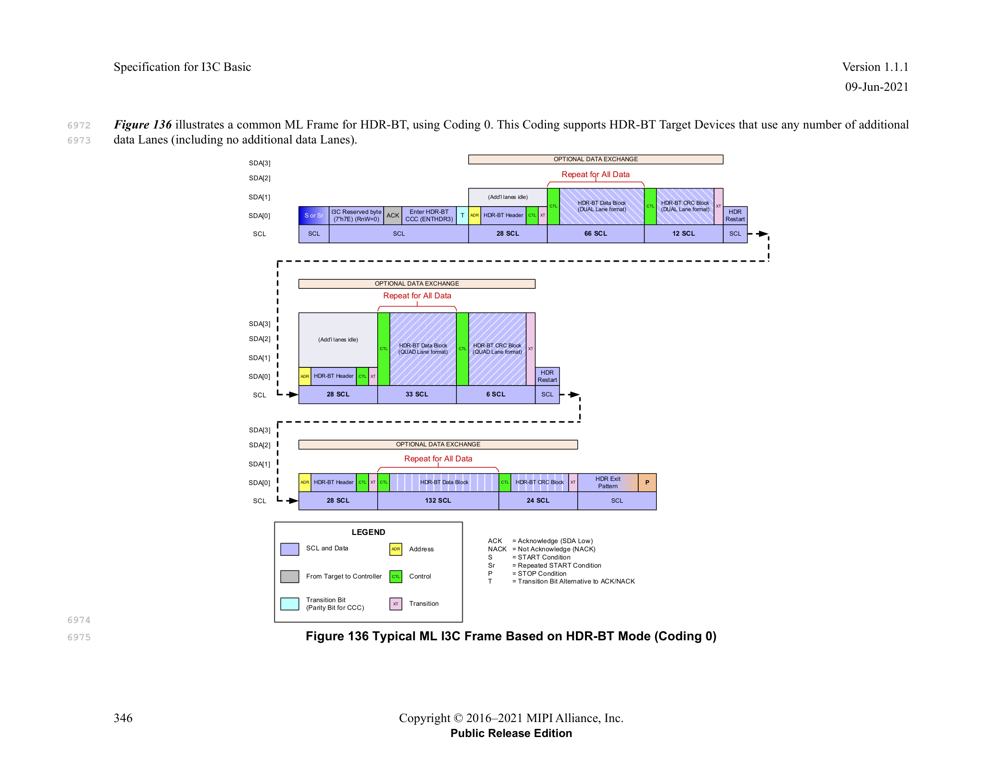

**`6974 6975`** 

Copyright © 2016–2021 MIPI Alliance, Inc. **Public Release Edition** 

346 

Version 1.1.1 09-Jun-2021 

Specification for I3C Basic 

**`6976`** _**Figure 137**_ illustrates a common ML Frame for HDR-BT, using Coding 3. When using this Coding, no 1-Lane HDR-BT Target Devices are supported. 

SDA[3] ~~CT~~ OPTIONAL DATA EXCHANGE Repeat for All Data SDA[2] —_1_—. SDA[1] SDA[0] S or Sr I3C Reserved byte (7'h7E) (RnW=0) ACK CCC (ENTHDR3)Enter HDR-BT T ADR HDR-BT Header(DUAL Lane) CTL XT CTL (DUAL Lane format)HDR-BT Data Block CTL (DUAL Lane format)HDR-BT CRC Block XT RestartHDR SCL SCL SCL **14 SCL 66 SCL 12 SCL** SCL ~~ee~~ | ~~ee~~ Poca ~~assoc ass~~ css n sss c cna s cscs ssa s cscs ssc c ccs a ~~ccc) oO"~~ OPTIONAL DATA EXCHANGE Repeat for All Data —_—_—__, SDA[3] (Add’l lanes idle) SDA[2] CTL (QUAD Lane format)HDR-BT Data Block CTL (QUAD Lane format)HDR-BT CRC Block XT SDA[1] ADR HDR-BT Header(DUAL Lane) CTL XT HDR Exit SDA[0] Pattern **P** SCL **14 SCL 33 SCL 6 SCL** SCL **LEGEND** ACK = Acknowledge (SDA Low) SCL and Data ADR Address NACK = Not Acknowledge (NACK) L LI S = START Condition Sr = Repeated START Condition From Target to Controller CTL Control P = STOP Condition ~~4~~ a T = Transition Bit Alternative to ACK/NACK Transition Bit XT Transition | (Parity Bit for CCC) LI ~~L~~ **`6977 6978` Figure 137 Typical ML I3C Frame Based on HDR-BT Mode (Coding 3)** 

Copyright © 2016–2021 MIPI Alliance, Inc. **Public Release Edition** 

347 

Specification for I3C Basic 

Version 1.1.1 09-Jun-2021 

|**6979**|**_Figure 138_**illustrates a common ML Frame for HDR-BT, using Coding 7. When using this Coding, no 1-Lane or 2-Lane ML HDR-BT Target Devices are|**_Figure 138_**illustrates a common ML Frame for HDR-BT, using Coding 7. When using this Coding, no 1-Lane or 2-Lane ML HDR-BT Target Devices are|**_Figure 138_**illustrates a common ML Frame for HDR-BT, using Coding 7. When using this Coding, no 1-Lane or 2-Lane ML HDR-BT Target Devices are|**_Figure 138_**illustrates a common ML Frame for HDR-BT, using Coding 7. When using this Coding, no 1-Lane or 2-Lane ML HDR-BT Target Devices are|**_Figure 138_**illustrates a common ML Frame for HDR-BT, using Coding 7. When using this Coding, no 1-Lane or 2-Lane ML HDR-BT Target Devices are|illustrates a common ML Frame for HDR-BT, using Coding 7. When using this Coding, no 1-Lane or 2-Lane ML HDR-BT Target Devices are|illustrates a common ML Frame for HDR-BT, using Coding 7. When using this Coding, no 1-Lane or 2-Lane ML HDR-BT Target Devices are|illustrates a common ML Frame for HDR-BT, using Coding 7. When using this Coding, no 1-Lane or 2-Lane ML HDR-BT Target Devices are|illustrates a common ML Frame for HDR-BT, using Coding 7. When using this Coding, no 1-Lane or 2-Lane ML HDR-BT Target Devices are|illustrates a common ML Frame for HDR-BT, using Coding 7. When using this Coding, no 1-Lane or 2-Lane ML HDR-BT Target Devices are|illustrates a common ML Frame for HDR-BT, using Coding 7. When using this Coding, no 1-Lane or 2-Lane ML HDR-BT Target Devices are|illustrates a common ML Frame for HDR-BT, using Coding 7. When using this Coding, no 1-Lane or 2-Lane ML HDR-BT Target Devices are|illustrates a common ML Frame for HDR-BT, using Coding 7. When using this Coding, no 1-Lane or 2-Lane ML HDR-BT Target Devices are|illustrates a common ML Frame for HDR-BT, using Coding 7. When using this Coding, no 1-Lane or 2-Lane ML HDR-BT Target Devices are|illustrates a common ML Frame for HDR-BT, using Coding 7. When using this Coding, no 1-Lane or 2-Lane ML HDR-BT Target Devices are|illustrates a common ML Frame for HDR-BT, using Coding 7. When using this Coding, no 1-Lane or 2-Lane ML HDR-BT Target Devices are|illustrates a common ML Frame for HDR-BT, using Coding 7. When using this Coding, no 1-Lane or 2-Lane ML HDR-BT Target Devices are|illustrates a common ML Frame for HDR-BT, using Coding 7. When using this Coding, no 1-Lane or 2-Lane ML HDR-BT Target Devices are|illustrates a common ML Frame for HDR-BT, using Coding 7. When using this Coding, no 1-Lane or 2-Lane ML HDR-BT Target Devices are|illustrates a common ML Frame for HDR-BT, using Coding 7. When using this Coding, no 1-Lane or 2-Lane ML HDR-BT Target Devices are|illustrates a common ML Frame for HDR-BT, using Coding 7. When using this Coding, no 1-Lane or 2-Lane ML HDR-BT Target Devices are|
|---|---|---|---|---|---|---|---|---|---|---|---|---|---|---|---|---|---|---|---|---|---|
|**6980**|supported.|||supported.||||||||||||||||||
||||||||||||||OPTIONAL DATA EXCHANGE<br>Repeat for All Data<br>~~TO~~|||||||||
|||SCL<br>SDA[0]<br>SDA[1]<br>SDA[3]<br>SDA[2]||S or Sr<br>I3C Reserved byte<br>(7'h7E) (RnW=0)<br>ACK<br>Enter HDR-BT<br>CCC (ENTHDR3)<br>T<br>HDR-BT Header<br>(QUAD Lane)<br>ADR<br>XT<br>CTL<br>HDR-BT Data Block<br>(QUAD Lane format)<br>HDR-BT CRC Block<br>(QUAD Lane format)<br>CTL<br>CTL<br>XT<br>HDR Exit<br>Pattern<br>**P**<br>SCL<br>SCL<br>**7 SCL**<br>**6 SCL**<br>**33 SCL**<br>SCL<br>~~aa~~||||||||||||||||||
||||||**LEGEND**|||||||||||||||||
||||SCL and Data<br>=||||ADR<br>LJ|||Address|||||ACK<br>= Acknowledge (SDA Low)<br>NACK<br>= Not Acknowledge (NACK)<br>S<br>= START Condition|||||||
||||||||||||||||Sr<br>= Repeated START Condition|||||||
||||From Target to Controller<br>=||||CTL<br>LJ|||Control|||||P<br>= STOP Condition<br>T<br>= Transition Bit Alternative to ACK/NACK|||||||
|||||||||||||||||||||||
||||Transition Bit<br>(Parity Bit for CCC)<br>=||||XT<br>LJ|||Transition||||||||||||


**`6981`** 

**`6982`** 

**Figure 138 Typical ML I3C Frame Based on HDR-BT Mode (Coding 7)** 

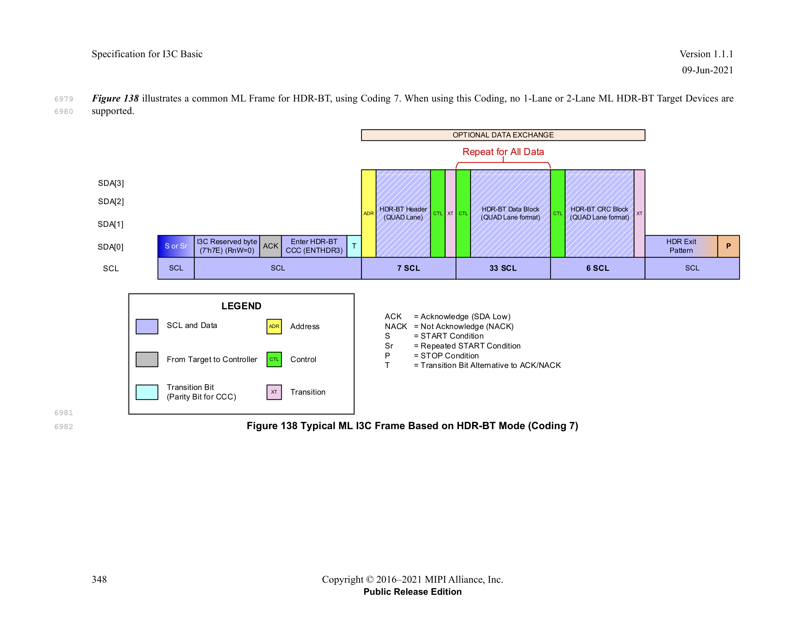

Copyright © 2016–2021 MIPI Alliance, Inc. **Public Release Edition** 

348 

Version 1.1.1 09-Jun-2021 

Specification for I3C Basic 

> **`6983`** HDR-BT defines several “Alternate Mode” ML Frame formats that may optionally be used for increased performance efficiency. However, not all of these are **`6984`** mutually interoperable. _**Table 81**_ lists the supported Codings and defines how they affect the formatting of various CCC flow elements that comprise CCC **`6985`** flows in HDR-BT Mode. 

## **5.3.2.4.1 HDR-BT Codings and Interoperability for CCCs** 

```
6986
```

**Table 81 HDR-BT Frame Format Details and Coding Interoperability for CCCs in Multi-Lane** 

|**Coding and**<br>**Meaning**|**HDR-BT Header**<br>**Block Format**|**HDR-BT Data Blocks**<br>**and CRC Block Format**|**Common ML**<br>**Frame**<br>**Format**<br>**(i.e., Default**<br>**Data Byte)**|**Common**<br>**CCC Flow**<br>**Elements**|**Per-Target CCC**<br>**Flow Elements**|**Notes**|
|---|---|---|---|---|---|---|
|**0**<br>(Compatible<br>Mode)|SINGLE Lane<br>(see**_Figure 127_**)|1-Lane:**_Table 70_**and**_Table 73_**<br>2-Lane ML:**_Table 71_**and**_Table 74_**<br>4-Lane ML:**_Table 72_**and**_Table 75_**|0x00<br>(SINGLE<br>Lane)|Use 1-Lane<br>HDR-BT<br>Frame<br>formatting|May use 1-Lane,<br>2-Lane ML,<br>or 4-Lane ML<br>(as configured per<br>Target’s ML<br>Frame format)|The only Coding that is<br>compatible with 1-Lane<br>(non-ML) HDR-BT Targets|
|**3**<br>(“Alternate<br>Mode”)|DUAL Lane<br>(see**_Figure 128_**)|1-Lane:_Not Supported_<br>2-Lane ML:**_Table 71_**and**_Table 74_**<br>4-Lane ML:**_Table 72_**and**_Table 75_**|0x19<br>(DUAL Lane)|Use 2-Lane<br>ML HDR-BT<br>Frame<br>formatting|May use 2-Lane ML<br>or 4-Lane ML<br>(as configured per<br>Target’s ML<br>Frame format)|Requires all HDR-BT Targets<br>to support at least 1 additional<br>data Lane|
|**7**<br>(“Alternate<br>Mode”)|QUAD Lane<br>(see**_Figure 128_**)|1-Lane:_Not Supported_<br>2-Lane ML:_Not Supported_<br>4-Lane ML:**_Table 72_**and**_Table 75_**|0x3B<br>(QUAD Lane)|Use 4-Lane<br>ML HDR-BT<br>Frame<br>formatting|Use 4-Lane ML only|Requires all HDR-BT Targets<br>to support all 3 additional data<br>Lanes|


**`6987`** All supported ML Frame formats shown in _**Table 79**_ shall indicate which of these Data Transfer Codings they support, which in a mixed ML-configuration **`6988`** Bus determines their level of interoperability with other ML Frame formats. 

Copyright © 2016–2021 MIPI Alliance, Inc. **Public Release Edition** 

349 

Specification for I3C Basic 

Version 1.1.1 09-Jun-2021 

- **`6989`** As noted in _**Section 5.3.2.4**_ , configuring the I3C Bus (i.e., all HDR-BT capable Targets) to use an “Alternate **`6990`** Mode” Data Transfer Coding requires all such Targets to be configured to use the “Alternate Mode” Coding. **`6991`** This configuration may be done individually for each Target, by sending the MLANE Direct SET CCC with **`6992`** Defining Byte 0x23 for each HDR-BT capable Target; or it may be done simultaneously for all Targets, by **`6993`** sending the MLANE Broadcast CCC with Defining Byte 0x23. 

- **`6994`** However, the Controller shall not attempt to configure any ML-capable HDR-BT Targets to use any **`6995`** “Alternate Mode” Coding, unless it first ensures that all other HDR-BT Targets are capable of interoperating **`6996`** with this Coding and may be configured to use a mutually interoperable ML Frame format that is based on **`6997`** the same Coding. 

- **`6998`** When a Target that supports any HDR-BT “Alternate Mode” Codings first receives either an MLANE Direct **`6999`** SET CCC with Defining Byte 0x23 sent to an assigned Dynamic Address, or an MLANE Broadcast CCC **`7000`** with Defining Byte 0x23 that is sent to the I3C Bus; and either CCC has a message with a Data Byte that **`7001`** selects an ML Frame format based on such an “Alternate Mode” Coding which is not interoperable with **`7002`** Coding 0, this shall change the HDR-BT configuration for the Device, and affect how the Device and its **`7003`** Peripheral logic must interpret HDR-BT Header Blocks for all subsequent HDR-BT transfers. For HDR-BT **`7004`** Mode, this configuration is defined as a ‘sticky’ state, and shall also determine how subsequent MLANE **`7005`** CCCs are either accepted or rejected. 

- **`7006`** • Such a change shall become ‘sticky’ if accepted, and shall affect the Peripheral logic that receives **`7007`** HDR-BT transfers within the Device: 

- **`7008`** • **If the Device receives the MLANE Direct SET CCC with Defining Byte 0x23** , then such a **`7009`** change shall only be accepted if the Device was previously configured to use Coding 0 (i.e., **`7010`** not in the ‘sticky’ state). 

- **`7011`** • **If the Device receives the MLANE Broadcast CCC with Defining Byte 0x23** , then such a change **`7012`** shall always be accepted. 

- **`7013`** • While in a ‘sticky’ state, the Device shall not accept a configuration change via the MLANE **`7014`** Direct SET CCC with Defining Byte 0x23 to use any other ML Frame formats that are not **`7015`** interoperable with that “Alternate Mode” Coding. 

- **`7016`** • However, the Device shall continue to accept configuration changes via the MLANE Broadcast **`7017`** CCC with Defining Byte 0x23 to use any other ML Frame formats that are valid and supported. **`7018`** For such MLANE Broadcast CCCs, ‘sticky’ state checking is bypassed. 

Copyright © 2016–2021 MIPI Alliance, Inc. **Public Release Edition** 

350 

Version 1.1.1 09-Jun-2021 

Specification for I3C Basic 

**`7019`** For HDR-BT Targets that support multiple assigned Addresses, HDR-BT defines several sets of conditions **`7020`** as valid actions (per _**Section 5.3.1.1**_ ) that apply to the use of the MLANE CCC with “Alternate Mode” **`7021`** Codings: 

- **`7022`** • Entering the ‘sticky’ state (i.e., switching from Coding 0 to any “Alternate Mode” Coding) affects **`7023`** all assigned Addresses within the Device (i.e., the shared Peripheral logic that receives HDR-BT **`7024`** transfers and matches assigned Addresses within HDR-BT Header Blocks). The Device shall not **`7025`** accept any subsequent MLANE Direct SET CCCs that would attempt to re-configure one assigned **`7026`** Address to use a Data Transfer Coding that is incompatible (i.e., not interoperable) with the first **`7027`** “Alternate Mode” Coding that was used to put the Device into the ‘sticky’ state. 

- **`7028`** • If the Device supports separate ML configurations for Group Addresses (per _**Section 5.3.1.1.1**_ ), **`7029`** then: 

- **`7030`** • On entering the ‘sticky’ state, the Device shall change the ML configuration for all currently **`7031`** assigned Group Addresses to the common ML Frame format for that “Alternate Mode” **`7032`** Coding, per _**Table 79**_ . The Device shall also apply this same common ML Frame format as the **`7033`** initial ML configuration for any subsequently assigned Group Addresses. 

- **`7034`** • Such a configuration change shall also limit the available ML Frame formats that the Device **`7035`** might accept upon subsequent use of the MLANE Direct SET CCC with Defining Byte 0x23. **`7036`** This shall prevent any assigned Group Address from being re-configured to use a Coding that **`7037`** is not interoperable with the Dynamic Address (or one of the Dynamic Addresses, if multiple **`7038`** Dynamic Addresses are supported). 

- **`7039`** • Per _**Section 5.3.1.1.1**_ , an MLANE Direct SET CCC sent to an assigned Group Address shall **`7040`** not cause the Device to enter or leave the ‘sticky’ state, nor shall the Device change the ML **`7041`** configuration for any assigned Dynamic Address as a result. The Device shall only accept an **`7042`** MLANE Direct SET CCC with an ML Frame format sent to an assigned Group Address if **`7043`** that ML Frame format is compatible (i.e., interoperable) with the current ML configuration of **`7044`** the associated Dynamic Address. 

- **`7045`** • If the Device supports multiple assigned Dynamic Addresses (i.e., a composite Device that **`7046`** presents multiple Virtual Targets, per _**Section 5.3.1.1.2**_ ), then: 

- **`7047`** • The first such MLANE Direct SET CCC sent to any assigned Dynamic Address with an ML **`7048`** Frame format based on an “Alternate Mode” Coding shall also change the ML configuration **`7049`** for the Device’s other assigned Dynamic Addresses, to use the common ML Frame format for **`7050`** that “Alternate Mode” Coding. 

- **`7051`** In this case, the Controller may (and should) send subsequent MLANE Direct SET CCCs **`7052`** to the Device’s other assigned Dynamic Addresses, with compatible ML Frame formats **`7053`** (or the same ML Frame format). 

- **`7054`** • Similarly, the MLANE Broadcast CCC shall cause a simultaneous ML configuration change **`7055`** to all assigned Dynamic Addresses, as though the Device had received (and accepted) a series **`7056`** of MLANE Direct SET CCCs that were sent to each of its assigned Dynamic Addresses. 

- **`7057`** • Note that the provided ML Frame format (i.e., the Data Byte after the Defining Byte) for each **`7058`** MLANE SET CCC (either Direct or Broadcast) must be valid and supported for the Device, if **`7059`** such configuration changes are to take effect, per _**Section 5.1.9.3.30**_ . 

- **`7060`** • Subsequent MLANE Direct SET CCCs sent to any assigned Dynamic Address shall only be **`7061`** accepted if the provided ML Frame format is compatible with that same “Alternate Mode” **`7062`** Coding (i.e., uses the same Coding, or one that is expressly defined to be interoperable). This **`7063`** shall prevent any assigned Dynamic Address from being subsequently re-configured to use a **`7064`** Coding that is not interoperable with other Dynamic Addresses. 

- **`7065`** • If the Device supports both Group Addresses and multiple Dynamic Addresses (i.e., the union of **`7066`** both), then both sets of conditions listed above shall apply. 

Copyright © 2016–2021 MIPI Alliance, Inc. **Public Release Edition** 

351 

Specification for I3C Basic 

Version 1.1.1 09-Jun-2021 

**`7067`** Once the Controller has configured the I3C Bus and all known HDR-BT capable Target Devices to use an **`7068`** “Alternate Mode” Coding, it must avoid such situations that might arise, in cases where a new Target Device **`7069`** might join or re-join the Bus (i.e., a Hot-Join Request, or a return from a deep sleep state with loss of **`7070`** configuration) and the Controller has not yet determined whether the Target Device supports HDR-BT Mode **`7071`** (and, if so, whether it also supports and can be configured to use an interoperable Coding). For some **`7072`** situations, the Controller must immediately stop all HDR-BT transfers if it detects an unknown Target Device, **`7073`** until it can fully determine such a Target Device’s capabilities and current configuration. 

**`7074`** An HDR-BT Target that has been configured to use Coding 0 with additional data Lanes (i.e., DUAL or **`7075`** QUAD transfers in Coding 0) may be switched back to 1-Lane compatibility mode (in Coding 0) via the **`7076`** MLANE CCC, using Defining Byte 0x23 and Data Byte 0x00, via Broadcast CCC or Direct CCC. This result **`7077`** can also be achieved by sending the MLANE CCC with the Sub-Command for Reset ML (i.e., Defining Byte **`7078`** 0x7F) in its Broadcast CCC or Direct SET CCC formats. However, an HDR-BT Target that has been **`7079`** configured to use an “Alternate Mode” Coding may only be configured back to 1-Lane compatibility mode **`7080`** (i.e., back to Coding 0 and leaving the ‘sticky’ state) by sending the MLANE Broadcast CCC (i.e., not a **`7081`** Direct SET CCC) with Defining Byte 0x23 and Data Byte 0x00, or by sending the MLANE Broadcast CCC **`7082`** with the Sub-Command for Reset ML. 

**`7083`** _**Note:**_ 

**`7084`** _When an HDR-BT Target that has been configured to use an “Alternate Mode” Coding leaves the_ **`7085`** _‘sticky’ state or accepts a new ML Frame format based on an “Alternate Mode” Coding (i.e., by_ **`7086`** _receiving the MLANE Broadcast CCC with either sub-command, as defined above), the ML_ **`7087`** _configurations for all assigned Addresses shall be simultaneously configured back to either 1-Lane_ **`7088`** _compatibility mode (i.e., with the Sub-Command for Reset ML), or to the new ML Frame format (i.e.,_ **`7089`** _with Defining Byte 0x23)._ 

Copyright © 2016–2021 MIPI Alliance, Inc. **Public Release Edition** 

352 

Version 1.1.1 09-Jun-2021 

Specification for I3C Basic 

**`7090`** _**Figure 139**_ illustrates the valid state transitions for HDR-BT Targets that support any “Alternate Mode” **`7091`** Codings, when used with the MLANE SET CCC with Defining Byte 0x23. 

**==> picture [377 x 342] intentionally omitted <==**

**----- Start of picture text -----**<br>
0x3B<br>Coding 7<br>(QUAD)<br>_©<br>0x19 0x1B<br>Coding 3<br>(DUAL) (QUAD)<br>[ O-0<br>0x00 0x01 0x03<br>Coding 0<br>(SINGLE) (DUAL) (QUAD)<br>Default ML<br>configuration<br>Entering the ‘sticky’ state via MLANE  Valid configuration within same Coding<br>SET CCC with Defining Byte 0x23 (i.e., ‘sticky’ state for Alternate Mode)<br>**----- End of picture text -----**<br>


## **LEGEND** 

**`7092 7093` Figure 139 Valid State Transitions for HDR-BT Data Transfer Codings** 

**`7094`** _**Note:**_ 

**`7095`** _In_ _**Figure 139** , the solid lines show the valid state transitions for entering the ‘sticky’ state from Coding_ **`7096`** _0, via the MLANE Direct SET CCC or the MLANE Broadcast CCC. The dashed lines show the valid_ **`7097`** _state transitions within a currently configured Coding, via the MLANE Direct SET CCC with Defining_ **`7098`** _Byte 0x23. Such state transitions apply to Devices that support a single Address (i.e., only a Dynamic_ **`7099`** _Address) as well as Devices that support multiple Addresses (i.e., any combination of Virtual Targets_ **`7100`** _with multiple Dynamic Addresses, or currently assigned Group Addresses). The circles with double_ **`7101`** _lines show the common ML configurations for each Coding, which shall be used for each newly_ **`7102`** _assigned Group Address (if supported). This diagram does not show the valid state transitions for_ **`7103`** _leaving the ‘sticky’ state or changing to a different ‘Alternate Mode’ Coding via the MLANE Broadcast_ **`7104`** _CCC, although such valid state transitions are always possible via the MLANE Broadcast CCC with_ **`7105`** _Defining Byte 0x23._ 

Copyright © 2016–2021 MIPI Alliance, Inc. **Public Release Edition** 

353 

Specification for I3C Basic 

Version 1.1.1 09-Jun-2021 

- **`7106`** In a Bus that mixes 1-Lane Target Devices (or ML-capable Target Devices in their default 1-Lane **`7107`** configuration) with 2-Lane ML and/or 4-Lane ML Target Devices that are all configured for Coding 0, any **`7108`** Target Devices that are configured for SINGLE Lane Coding 0 shall ignore any HDR-BT Data Blocks and **`7109`** HDR-BT CRC Blocks that are part of a transaction (either generic, or Direct CCC flow) addressed to another **`7110`** Target Device that is configured for DUAL Lane Coding 0 or QUAD Lane Coding 0. Because these DUAL **`7111`** Lane or QUAD Lane formatted Blocks might not have the same format and length that a Target Device in its **`7112`** default configuration can understand, such a Target Device may instead ignore these HDR-BT Blocks and **`7113`** wait for the HDR Restart Pattern, after which it will be able to receive and understand a subsequent HDR- **`7114`** BT Header Block and correctly parse its **Address** field. 

- **`7115`** CCC transactions in HDR-BT that use Multi-Lane shall conform to the special requirements of the CCC **`7116`** framing and modality for HDR-BT (see _**Section 5.2.4.4**_ ), as a specific instantiation of the generic CCC **`7117`** framing and modality for all HDR Modes (see _**Section 5.2.1.2**_ ). Such HDR-BT-capable Targets shall monitor **`7118`** the Bus for HDR-BT transactions that are either HDR-BT generic write/read transfers, or common CCC flow **`7119`** elements, according to the currently configured Data Transfer Coding of the Device: 

- **`7120`** • **If such a Target only has a single Dynamic Address:** Then the ML configuration (i.e., currently **`7121`** configured ML Frame format) for the Target’s Dynamic Address shall apply to match either the **`7122`** assigned Dynamic Address or the Broadcast Address (i.e., 7’h7E) for common CCC flow **`7123`** elements, according to the Data Transfer Coding for this ML configuration. 

- **`7124`** • **If such a Target has multiple Dynamic Addresses** (i.e., a composite Device that presents Virtual **`7125`** Targets, per _**Section 5.3.1.1.2**_ ) **:** Then the ML configuration (i.e., currently configured ML Frame **`7126`** format) for all such Dynamic Addresses must be interoperable, so that the Target can match the **`7127`** Broadcast Address (i.e., 7’h7E) with the specified ML Frame formatting of the Data Transfer **`7128`** Coding, for common CCC flow elements (per _**Table 79**_ ). 

## **Coding 0** 

- **`7129`** The default ML Frame format for HDR-BT Devices is Coding 0 (Compatible Mode) which requires no **`7130`** additional data Lanes. 

- **`7131`** Coding 0 is intended for Buses with HDR-BT Targets of mixed support for Multi-Lane’s additional data **`7132`** Lanes. It is interoperable with all 1-Lane, 2-Lane ML, and 4-Lane ML HDR-BT Targets that support **`7133`** Coding 0. 

**`7134`** In Coding 0: 

- **`7135`** • All HDR-BT Header Blocks shall be transmitted using SDA[0] (i.e., 1-Lane mode) in order to **`7136`** ensure that all Targets that support HDR-BT are always able to receive and understand the format **`7137`** of the Header Block. This includes the specific variants of the Header Block used for the common **`7138`** CCC flow elements in the HDR-BT CCC flows. The bit packing shall follow the formats shown in **`7139`** _**Table 70**_ for Data Bytes and _**Table 73**_ for the Transition Byte. 

- **`7140`** • For generic HDR-BT transactions (i.e., not part of the HDR-BT CCC flows), all subsequent **`7141`** HDR-BT Data Blocks and the HDR-BT CRC Block shall be transmitted in a bit packing format **`7142`** appropriate for the Target’s currently configured ML Frame format (see _**Table 79**_ ). If the Target is **`7143`** not ML-capable, or has not been configured to use a ML Frame format that uses additional data **`7144`** Lanes, then this bit packing format shall be the standard 1-Lane HDR-BT format (i.e., SDA[0] **`7145`** only). 

- **`7146`** • For all HDR-BT CCC flows, all common CCC flow elements shall be transmitted using SDA[0] **`7147`** (i.e., 1-Lane mode), so that all HDR-BT Targets can participate in the CCC flows regardless of **`7148`** their currently configured ML Frame format or the number of additional data Lanes they support. **`7149`** In this manner, all ML Frame formats that support Coding 0 are mutually interoperable for the **`7150`** common CCC flow elements. 

- **`7151`** • Following the HDR-BT CCC Selector Block in a Direct CCC flow, all subsequent HDR-BT Data **`7152`** Blocks and the HDR-BT CRC Block that are addressed to a Target currently configured for **`7153`** Coding 0 shall be transmitted in a bit packing format appropriate for the Target’s currently **`7154`** configured ML Frame format (see _**Table 79**_ ). 

Copyright © 2016–2021 MIPI Alliance, Inc. 

354 

**Public Release Edition** 

Version 1.1.1 09-Jun-2021 

Specification for I3C Basic 

## **Coding 3** 

**`7155`** An optional Coding for HDR-BT Devices is Coding 3 (“Alternate Mode”), which requires at least one **`7156`** additional data Lane. 

**`7157`** Coding 3 is intended for Buses with HDR-BT Targets that support at least one additional data Lane for Multi- **`7158`** Lane. It is interoperable with all other “Alternate Mode” Codings marked as Coding 3 in _**Table 78**_ , and **`7159`** expressly not interoperable with any 1-Lane HDR-BT Targets, or any 2-Lane ML HDR-BT Targets that do **`7160`** not support Coding 3. When addressing HDR-BT Targets that support three additional data Lanes, it provides **`7161`** additional transfer speed for these per-Target transactions, while still allowing interoperability with any other **`7162`** HDR-BT Targets that only support one additional data Lane and have been configured for Coding 3. 

**`7163`** In Coding 3: 

- **`7164`** • All HDR-BT Header Blocks shall be transmitted using SDA[0] and SDA[1], using the DUAL **`7165`** Lane bit packing formats shown in _**Table 71**_ for Data Bytes and _**Table 74**_ for the Transition Byte. **`7166`** See _**Figure 128**_ for the HDR-BT Header Block format, _**Figure 130**_ for the HDR-BT Data Block **`7167`** format, and _**Figure 133**_ for the HDR-BT CRC Block format. 

- **`7168`** • For generic HDR-BT transactions (i.e., not part of the HDR-BT CCC flows), all subsequent **`7169`** HDR-BT Data Blocks and the HDR-BT CRC Block shall be transmitted in a bit packing format **`7170`** appropriate for the Target’s currently configured ML Frame format, using either DUAL Lane or **`7171`** QUAD Lane formats (see _**Table 79**_ ). 

- **`7172`** • For all HDR-BT CCC flows, all common CCC flow elements shall be transmitted using SDA[0] **`7173`** and SDA[1], using the same DUAL Lane bit packing formats. All HDR-BT Targets that are **`7174`** currently configured for Coding 3 can participate in the CCC flows regardless of the number of **`7175`** additional Lanes (i.e., Lanes beyond SDA[1]) that they are configured to use. In this manner, all **`7176`** ML Frame formats that support Coding 3 are mutually interoperable, for the common CCC flow **`7177`** elements. 

- **`7178`** • Following the HDR-BT CCC Selector Block in a Direct CCC flow, all subsequent HDR-BT Data **`7179`** Blocks and the HDR-BT CRC Block addressed to a Target currently configured for Coding 3 shall **`7180`** be transmitted in a bit packing format appropriate for the Target’s currently configured ML Frame **`7181`** format, using either DUAL Lane or QUAD Lane formats (see _**Table 79**_ ). 

**`7182`** This “Alternate Mode” is not compatible with other ML-capable HDR-BT Targets not configured to use an **`7183`** “Alternate Mode” Coding marked as Coding 3, or other HDR-BT Targets that are not ML-capable. Such **`7184`** Targets will not correctly receive and understand any HDR-BT Header Blocks transmitted in this bit packing **`7185`** format, and as a result they will not participate in any HDR-BT transactions, and could even cause **`7186`** communication errors. 

**`7187`** _**Note:**_ 

- **`7188`** _In Coding 3, the Controller shall not use the SINGLE Lane formats for any HDR-BT structured_ **`7189`** _protocol elements, such as the HDR-BT Header Block, Data Block or CRC Block._ 

- **`7190`** _Once an HDR-BT capable Target that supports Coding 3 has been configured to use an ML Frame_ **`7191`** _format that uses Coding 3 or any other “Alternate Mode” Coding that is interoperable, the entire_ **`7192`** _Device enters a ‘sticky’ state and shall not accept any configuration changes via the MLANE CCC_ **`7193`** _that might use any other Coding not interoperable with Coding 3, except for certain MLANE sub-_ **`7194`** _commands sent as a Broadcast CCC. If the MLANE Direct SET CCC is used, then such a Device_ **`7195`** _may only enter the ‘sticky’ state from Coding 0._ 

**`7196`** A Controller shall not enable any ML-capable HDR-BT Targets to use any “Alternate Mode” Coding marked **`7197`** as Coding 3, unless it first ensures that all other HDR-BT Targets are capable of interoperating with Coding **`7198`** 3. A Controller shall not initiate any HDR-BT transactions using DUAL Lane or QUAD Lane bit packing **`7199`** formats for all HDR-BT Blocks, unless it has previously configured all HDR-BT Targets on the Bus to use **`7200`** an “Alternate Mode” Coding marked as Coding 3. Once a Controller has configured all HDR-BT Targets on **`7201`** the Bus to use Coding 3, it must drive all HDR-BT transactions using the correct bit packing format for each **`7202`** HDR-BT Block, according to the conditions above. 

Copyright © 2016–2021 MIPI Alliance, Inc. **Public Release Edition** 

355 

Specification for I3C Basic 

Version 1.1.1 09-Jun-2021 

## **Coding 7** 

- **`7203`** An optional Coding for HDR-BT Devices is Coding 7 (“Alternate Mode”), which requires three additional **`7204`** data Lanes. 

- **`7205`** Coding 7 is intended for Buses with HDR-BT Targets that support three additional data Lanes for Multi- **`7206`** Lane. It is not interoperable with any other Codings in _**Table 79**_ , and is expressly not interoperable with any **`7207`** 1-Lane or 2-Lane ML HDR-BT Targets, nor with any 4-Lane ML HDR-BT Targets that do not support Coding **`7208`** 7. 

- **`7209`** In Coding 7: 

- **`7210`** • All HDR-BT Blocks shall be transmitted using SDA[0], SDA[1], SDA[2], and SDA[3], using the **`7211`** QUAD Lane bit packing formats shown in _**Table 72**_ for Data Bytes and _**Table 75**_ for the Transition **`7212`** Byte. See _**Figure 128**_ for the HDR-BT Header Block format, _**Figure 130**_ for the HDR-BT Data **`7213`** Block format, and _**Figure 133**_ for the HDR-BT CRC Block format. 

- **`7214`** • For generic HDR-BT transactions and for all HDR-BT CCC flows, all HDR-BT Data Blocks and **`7215`** HDR-BT CRC Blocks shall also be transmitted in the same QUAD Lane bit packing format. 

- **`7216`** This “Alternate Mode” is not compatible with other ML-capable HDR-BT Targets that are not configured to **`7217`** use an “Alternate Mode” Coding marked as Coding 7, or other HDR-BT Targets that are not ML-capable. **`7218`** Such Targets will not correctly receive and understand any HDR-BT Header Blocks transmitted in this bit **`7219`** packing format, and as a result they will not participate in any HDR-BT transactions, and could even cause **`7220`** communication errors. 

**`7221`** _**Note:**_ 

- **`7222`** _In Coding 7, the Controller shall not use the SINGLE Lane or DUAL Lane formats for any HDR-BT_ **`7223`** _structured protocol elements, such as the HDR-BT Header Block, Data Block or CRC Block._ **`7224`** _Once an HDR-BT capable Target that supports Coding 7 has been configured to use an ML Frame_ **`7225`** _format that uses Coding 7 or any other “Alternate Mode” Coding that is interoperable, the entire_ **`7226`** _Device enters a ‘sticky’ state and shall not accept any configuration changes via the MLANE CCC_ **`7227`** _that might use any other Coding not interoperable with Coding 7, except for certain MLANE sub-_ **`7228`** _commands sent as a Broadcast CCC. If the MLANE Direct SET CCC is used, then such a Device_ **`7229`** _may only enter the ‘sticky’ state from Coding 0._ 

**`7230`** A Controller shall not enable any ML-capable HDR-BT Targets to use any “Alternate Mode” Coding marked **`7231`** as Coding 7, unless it first ensures that all other HDR-BT Targets are capable of interoperating with Coding **`7232`** 7. A Controller shall not initiate any HDR-BT transactions using QUAD Lane bit packing formats for all **`7233`** HDR-BT Blocks, unless it has previously configured all HDR-BT Targets on the Bus to use an “Alternate **`7234`** Mode” Coding marked as Coding 7. Once a Controller has configured all HDR-BT Targets on the Bus to use **`7235`** Coding 7, it must drive all HDR-BT transactions using QUAD Lane bit packing formats for all HDR-BT **`7236`** Blocks. 

Copyright © 2016–2021 MIPI Alliance, Inc. **Public Release Edition** 

356 

Version 1.1.1 09-Jun-2021 

Specification for I3C Basic 

## **5.3.2.4.2 HDR-BT DUAL Coding** 

> **`7237`** The default Coding for HDR-BT DUAL is Coding 0 (compatible mode); its additional Data Byte used by the **`7238`** MLANE CCC is 0x01 (i.e., {5’d0, 3’d1}). 

**`7239`** In this ML Frame format, all HDR-BT Blocks that are part of generic HDR-BT transactions (except for the **`7240`** HDR-BT Header Blocks), or that comprise the per-Target CCC flow elements, shall be transmitted using **`7241`** SDA[0] and SDA[1], using the DUAL Lane bit packing formats shown in _**Table 71**_ for Data Bytes and _**Table**_ **`7242`** _**74**_ for the Transition Byte. See _**Figure 130**_ for the HDR-BT Data Block format, and _**Figure 133**_ for the **`7243`** HDR-BT CRC Block format. For additional details, see also Coding 0 in _**Section 5.3.2.4.1**_ . 

**`7244`** Any Targets that are not configured for DUAL Lane Coding 0 might not be able to receive and understand **`7245`** any HDR-BT Data Blocks and HDR-BT CRC Blocks that are not part of a transaction (either generic, or **`7246`** Direct CCC flow) addressed to their Target Address. Because these Blocks might not have the same format **`7247`** and length as their currently configured ML Frame format, such a Target may instead ignore these HDR-BT **`7248`** Blocks and wait for the HDR Restart Pattern, after which it will be able to receive and understand a **`7249`** subsequent HDR-BT Header Block and correctly parse its **Address** field. 

## **“Alternate Mode” Codings for DUAL Lane: Coding 3** 

**`7250`** In some Bus configurations, it might be desirable to utilize one additional data Lane for HDR-BT Blocks, for **`7251`** increased performance and Bus efficiency. This requires all Targets on the Bus that support HDR-BT to be **`7252`** configured to support ML Frame formats that are interoperable (i.e., that expect to use the same number of **`7253`** additional data Lanes in the same locations in HDR-BT transactions). 

**`7254`** One “Alternate Mode” Coding for HDR-BT DUAL is Coding 3; its additional Data Byte used by the MLANE **`7255`** CCC is 0x19 (i.e., {5’d3, 3’d1}). 

**`7256`** In this ML Frame format, HDR-BT Blocks that are part of generic HDR-BT transactions (except for the **`7257`** HDR-BT Header Blocks), or that comprise the per-Target CCC flow elements, shall be transmitted using **`7258`** SDA[0] and SDA[1], using the DUAL Lane bit packing formats listed above. For additional details, see also **`7259`** Coding 3 in _**Section 5.3.2.4.1**_ . 

**`7260`** As previously stated, the HDR-BT Header Blocks and all HDR-BT Blocks comprising the core CCC flow **`7261`** elements shall be transmitted in DUAL Lane bit packing format. 

**`7262`** In a Bus that mixes 2-Lane ML and 4-Lane ML Targets, all of which are configured for Coding 3, any Targets **`7263`** configured for DUAL Lane Coding 3 shall ignore any HDR-BT Data Blocks and HDR-BT CRC Blocks that **`7264`** are part of a transaction (either generic, or Direct CCC flow) addressed to another Target configured for **`7265`** QUAD Lane Coding 3. 

**`7266`** Any Targets not configured for DUAL Lane Coding 3 might not be able to receive and understand any HDR- **`7267`** BT Data Blocks and HDR-BT CRC Blocks that are not part of a transaction (either generic, or Direct CCC **`7268`** flow) addressed to their Target Address. Because these Blocks might not have the same format and length as **`7269`** their currently configured ML Frame format, such a Target may instead ignore these HDR-BT Blocks and **`7270`** wait for the HDR Restart Pattern, after which it will be able to receive and understand a subsequent HDR- **`7271`** BT Header Block and correctly parse its **Address** field. 

Copyright © 2016–2021 MIPI Alliance, Inc. **Public Release Edition** 

357 

Specification for I3C Basic 

Version 1.1.1 09-Jun-2021 

## **5.3.2.4.3 HDR-BT QUAD Coding** 

> **`7272`** The default Coding for HDR-BT QUAD is Coding 0 (Compatible Mode); its additional Data Byte used by **`7273`** the MLANE CCC is 0x03 (i.e., {5’d0, 3’d3}). 

**`7274`** In this ML Frame format, all HDR-BT Blocks that are part of generic HDR-BT transactions (except for the **`7275`** HDR-BT Header Blocks), or that comprise the per-Target CCC flow elements, shall be transmitted using **`7276`** SDA[0], SDA[1], SDA[2], and SDA[3], using the QUAD Lane bit packing formats shown in _**Table 72**_ for **`7277`** Data Bytes and _**Table 75**_ for the Transition Byte. See _**Figure 130**_ for the HDR-BT Data Block format, and **`7278`** _**Figure 133**_ for the HDR-BT CRC Block format. For additional details, see also Coding 0 in _**Section 5.3.2.4.1**_ 

```
7279
```

```
7280
7281
7282
```

```
7283
```

```
7284
```

Any Targets not configured for QUAD Coding 0 might not be able to receive and understand any HDR-BT Data Blocks and HDR-BT CRC Blocks that are not part of a transaction (either generic, or Direct CCC flow) addressed to their Target Address. Because these Blocks might not have the same format and length as their currently configured ML Frame format, such a Target may instead ignore these HDR-BT Blocks and wait for the HDR Restart Pattern, after which it will be able to receive and understand a subsequent HDR-BT Header Block and correctly parse its **Address** field. 

## **“Alternate Mode” Codings for QUAD Lane** 

```
7285
7286
7287
7288
```

In some Bus configurations, it might be desirable to utilize the three additional data Lanes for HDR-BT Blocks, for increased performance and Bus efficiency. This requires all Targets on the Bus that support HDRBT to be configured to support ML Frame formats that are interoperable (i.e., that expect to use the same number of additional data Lanes in the same locations in HDR-BT transactions). 

## **`7289` Coding 3** 

**`7290`** One “Alternate Mode” Coding for HDR-BT QUAD is Coding 3; its additional Data Byte used by the **`7291`** MLANE CCC is 0x1B (i.e., {5’d3, 3’d3}). 

**`7292`** In this ML Frame format, HDR-BT Blocks that are part of generic HDR-BT transactions (except for the **`7293`** HDR-BT Header Blocks), or that comprise the per-Target CCC flow elements, shall be transmitted using **`7294`** SDA[0], SDA[1], SDA[2], and SDA[3], using the QUAD Lane bit packing formats listed above. See also **`7295`** Coding 3 in _**Section 5.3.2.4.1**_ . 

**`7296`** As previously stated, the HDR-BT Header Blocks and all HDR-BT Blocks comprising the core CCC flow **`7297`** elements shall be transmitted in DUAL Lane bit packing format. 

**`7298`** In a Bus that mixes 2-Lane ML and 4-Lane ML Targets, all of which are configured for Coding 3, any Targets **`7299`** configured for QUAD Lane Coding 3 shall ignore any HDR-BT Data Blocks and HDR-BT CRC Blocks that **`7300`** are part of a transaction (either generic, or Direct CCC flow) addressed to another Target configured for **`7301`** DUAL Lane Coding 3. 

**`7302`** Any Targets not configured for QUAD Lane Coding 3 might not be able to receive and understand any HDR- **`7303`** BT Data Blocks and HDR-BT CRC Blocks that are not part of a transaction (either generic, or Direct CCC **`7304`** flow) addressed to their Target Address. Because these Blocks might not have the same format and length as **`7305`** their currently configured ML Frame format, such a Target may instead ignore these HDR-BT Blocks and **`7306`** wait for the HDR Restart Pattern, after which it will be able to receive and understand a subsequent HDR- **`7307`** BT Header Block and correctly parse its **Address** field. 

- **`7308`** 

## **Coding 7** 

- **`7309`** Another “Alternate Mode” Coding for HDR-BT QUAD is Coding 7; its additional Data Byte used by the **`7310`** MLANE CCC is 0x3B (i.e., {5’d7, 3’d3}). 

**`7311`** In this ML Frame format, all HDR-BT Blocks shall be transmitted using SDA[0], SDA[1], SDA[2], and **`7312`** SDA[3], using the QUAD Lane bit packing formats listed above. See also Coding 7 in _**Section 5.3.2.4.1**_ . 

**`7313`** As QUAD Lane Coding 7 is not interoperable with any other Codings, nor with any other HDR-BT Targets **`7314`** supporting fewer than 3 additional data Lanes, it shall not be used in any Bus configuration in which it could **`7315`** cause communication errors. 

Copyright © 2016–2021 MIPI Alliance, Inc. 

358 

**Public Release Edition** 

Version 1.1.1 09-Jun-2021 

Specification for I3C Basic 

## **6 I3C Electrical Specifications** 

## **6.1 DC I/O Characteristics** 

- **`7316`** This Section describes the DC operating parameters of the I3C interface in two modes: Push-Pull Mode and **`7317`** Open Drain Mode. In Push-Pull Mode, the SDA pin drives at higher speeds with a totem-pole driver. 

- **`7318`** Two important parameters should be noted for I3C: 

- **`7319`** • The I3C interface targets nominal operating voltages of 1.2V, 1.8V, and 3.3V or less. The I3C **`7320`** interface is not characterized for 5V systems, but could be extended to support 5V if sufficient **`7321`** driver strength, reduced diameter, and/or reduced speed is used in the system. 

- **`7322`** • For peak speeds the capacitance loading allowed is reduced to 50 pF, which is much lower than **`7323`** Legacy I[2] C. With I3C higher capacitance Busses are possible, but only at reduced speeds and with **`7324`** reduced features (e.g., if no I[2] C Devices are supported). 

- **`7325`** Optionally, the I3C Basic interface also targets a nominal operating voltage of 1.0V and a 100 pF capacitive **`7326`** loading for new usages, such as Serial Presence Detect (SPD) in DDR5. 

Copyright © 2016–2021 MIPI Alliance, Inc. **Public Release Edition** 

359 

Specification for I3C Basic 

Version 1.1.1 09-Jun-2021 

```
7327
```

**Table 82 I3C I/O Stage Characteristics Common to Push-Pull Mode and Open Drain Mode** 

|**Parameter **|**Symbol**|**Conditions**|**Min**|**Min**|**Typ**|**Typ**||**Max**|**Unit**|**Notes**|
|---|---|---|---|---|---|---|---|---|---|---|
|**Operating Voltage**|**VDD**||1.10||1.20|||1.30|V|1|
|||–|1.65||1.80|||1.95|||
||||2.97||3.30|||3.63|||
|**Low-Level Input Voltage**|**VIL**|–|-0.1 * VDD||–|||0.3 * VDD|V|8|
|**High-Level Input Voltage**|**VIH**|–|0.7 * VDD||–|||1.1 * VDD|V|8|
|**Schmitt Trigger Inputs Hysteresis**|**Vhys**|–|0.1 * VDD||–|||–|V|–|
|**Output Low Level**|**VOL**|For VDD< 1.4V: IOL= 2 mA|–||–|||0.18|V|2|
|||For VDD≥ 1.4V: IOL= 3 mA|–||–|||0.27|V|2|
|**Input Current**<br>**(per Input-Only I/O Pin)**|**Ii**|-100 mV < Vi< VDD+ 100 mV for ≥ 1.8V nominal|-10||–|||10|µA|2|
|||-100 mV < Vi< VDD+ 100 mV for < 1.8V nominal|-5||–|||5|µA|2|
|**Capacitance**<br>**(per I/O Pin)**|**Ci**|For < 1.8V nominal|–||–|||5|pF|5|
|||For ≥ 1.8V nominal|–||–|||10|pF|5|
|**Capacitance Mismatch Between Pins**|**ΔC**|Difference between SDA and SCL capacitance CI ≤5pF|–||–|||1.5|pF|5|
|||Difference between SDA and SCL capacitance CI> 5pF|–||–|||3|pF|5|
|**Push-Pull Only**|||||||||||
|**Output High Level**|**VOH**|For VDD< 1.4V: IOH= -2 mA|VDD– 0.18||–|||–|V|2, 9|
|||For VDD≥ 1.4V: IOH= -3 mA|VDD– 0.27||–|||–|V|2, 9|
|**Legacy Mode with Pull-Up**|||||||||||
|**Pull-Up for Open Drain**|**Rp**|tr = Max rise time<br>Cb = Bus Capacitance<br>VDD = 1.2V, 1.8V, or 3.3V|𝑉𝐷−𝑉𝑂<br>3 𝑚<br>for VDD≥ 1.4V<br>𝑉𝐷−𝑉𝑂<br>2 𝑚<br>for VDD< 1.4V||||𝑡𝑟<br>0.8473 ∗ 𝐶||Ω|3, 4,<br>6, 7|
|||tr = 120 ns<br>Cb= 50 pF|||||2833||||


Copyright © 2016–2021 MIPI Alliance, Inc. 

360 

**Public Release Edition** 

Version 1.1.1 09-Jun-2021 

Specification for I3C Basic 

## _**Note:**_ 

- _1) This I3C Basic Specification considered only 1.2V, 1.8V, and 3.3V, with associated tolerances, for typical cases requiring peak speeds using reduced capacitance loading. Other voltage ranges are not prohibited; for example, see_ _**Table 83** . Any I3C Bus implementation shall ensure the correct operation of the Devices resident on the Bus, notably the inter-compatibility of their voltage ranges._ 

- _2) Negative sign for currents indicates that the Device is sinking current in this condition; see note 9._ 

- _3) The current of the Pull-Up must balance the time to pull SDA High against the capacitance of the line, with the current that a Target Device must sink in order to hold SDA at VOL. Unless all Target Devices are known to have sufficiently strong drive (i.e., to pull SDA below VOL in time), the Pull-Up should be sized between the minimum and maximum values._ 

   - _V(t1) = 0.3_ ∗ _VDD = VDD (1_ − _e_[−] _[t1 / RC] ); then t1 = 0.3566749_ ∗ _RC V(t2) = 0.7_ ∗ _VDD = VDD (1_ − _e_[−] _[t2 / RC] ); then t2 = 1.2039729_ ∗ _RC T = t2_ − _t1 = 0.8473_ ∗ _RC_ 

- _4) Pull-Up for Open Drain shall be switched off during I3C Push-Pull operation. May be implemented as: A Pull-Up internally; A current source internally; or an external Pull-Up resistor driven by a pin._ 

- _5) For Devices that support both 1.8V and 3.3V, the larger capacitance may be used._ 

## _6) Open Drain never occurs on SCL_ 

- _7) A weak Pull-Up or High-Keeper is separately sized, whether passive or active; this needs to be applied for both Controller handoff (see_ _**Section 5.1.7.2** ) and “Park1,High-Z” uses in HDR-BT Mode (see_ _**Section 5.2.4.2** )._ 

- _8)The VIL min and VIH max allow for normal undershoot and overshoot on a Bus. Voltages that are lower than VIL min and higher than VIH max will be handled by protection circuits (i.e., ESD protection) as with any GPIO or standard pad Peripheral. The board designer should be made aware of any deviations outside VIL min and VIH max._ 

- _9) A Device shall be able to continuously sink the indicated current (indicated as a negative number) in this condition. For most pad types, the drive strength must be rated at twice the indicated current, since the rated drive strength is normally the peak current when the voltage difference is at its maximum. For VOL, this is SDA at VDD; for VOH, this is SDA at ground._ 

Copyright © 2016–2021 MIPI Alliance, Inc. **Public Release Edition** 

361 

Specification for I3C Basic 

Version 1.1.1 09-Jun-2021 

```
7328
```

**Table 83 I3C Low Voltage / High Capacitive Load I/O Stage Characteristics for Push-Pull Mode and Open Drain Mode** 

|**Parameter**|**Symbol**|**Conditions**|**Min**|**Min**|**Typ**|**Typ**|**Max**|**Unit**|**Notes**|
|---|---|---|---|---|---|---|---|---|---|
|Operating Voltage|VDD|–|0.95||1.0||1.25|V|–|
|Low-Level Input Voltage|VIL|–|-0.3||–||0.3|V|–|
|High-Level Input Voltage|VIH|–|0.7||–||1.25|V|1|
|Schmitt Trigger Inputs Hysteresis|Vhys|–|0.1 * VDD||–||0.4 * VDD|V|–|
|Output Low Level|VOL|IOL= 4 mA|–||–||0.3|V|2|
|Input Current<br>(per Input-Only I/O Pin)|Ii|-100 mV < Vi < VDD|-5||||5|µA|2|
||||||–|||||
|||||||||||
|Capacitance<br>(per I/O Pin)|Ci||||||5|pF|–|
|||–|–||–|||||
|||||||||||
|||||||||||
|Capacitance Mismatch Between<br>Pins|ΔC||||||1.5|pF|–|
|||–|–||–|||||
|||||||||||
|||||||||||
|**Push-Pull Only**||||||||||
|Output High Level|VOH|IOH= -3 mA|0.75||–||–|V|2|
|**Legacy Mode with Pull-Up**<br>**See Errata 01, Item 21**||||||||||
|Pull-Up for Open Drain|Rp|tr= Max rise time (100 ns)<br>Cb= Bus Capacitance (100 pf)<br>VDD= 1V||𝑉𝐷−𝑉𝑂<br>4 𝑚||𝑡𝑟<br>0.8473 ∗ 𝐶||Ω|3, 4,<br>6, 7, 8|
|**_Note:_**<br>_1) VDD with respect to Typical VDD_<br>_2) Negative sign for currents indicates current direction._<br>_3) V(t1) = 0.3 * VDD = VDD (1_−_e_−_t1 / RC); then t1 = 0.3566749 * RC_<br>_V(t2) = 0.7 * VDD = VDD (1_−_e_−_t2 / RC); then t2 = 1.2039729 * RC_<br>_T = t2_−_t1 = 0.8473 * RC_<br>_4) For higher capacitance Buses, Pull-Up for Open Drain should be switched off during I3C Push-Pull operation. This may be implemented as: A Pull-Up_<br>_internally; a current source internally; an external Pull-Up resistor driven by a pin; or any combination of the above. The effective resistance comprising the_<br>_Open Drain Pull-Up and High-Keeper Pull-Up shall be sized sufficiently to allow the Target to pull SDA Low within tDIG_L for adjusted clock speeds, and to_<br>_allow SDA to rise within trDA, per_**_Section 5.1.3.1_**_._<br>_6) Open-Drain never occurs on SCL_<br>_7) A weak pull-up needs to be applied as well for Controller handoff_<br>_8) Rp Min should be decided based on the VIL specification_||||||||||


Copyright © 2016–2021 MIPI Alliance, Inc. 

362 

**Public Release Edition** 

Version 1.1.1 09-Jun-2021 

Specification for I3C Basic 

**`7329`** I3C supports Legacy I[2] C Targets. An important feature of an I[2] C Target is the 50 ns Spike Filter on the SDA **`7330`** and SCL pads. If a Spike Filter is implemented on all I[2] C Devices present on the I3C Bus, then the I3C Bus **`7331`** may operate at maximum rated clock frequency. If any I[2] C Device does not have a Spike Filter, then the I3C **`7332`** Bus speed is determined by the slowest Legacy I[2] C Device without a Spike Filter. Other requirements of an **`7333`** I[2] C Legacy Target are listed in _**Table 84**_ . 

```
7334
```

**Table 84 Legacy I[2] C Device Requirements When Operating on I3C** 

|**Feature**|**Required**|**Desirable**|**Not Used**|**Not Allowed**|**Notes**|
|---|---|---|---|---|---|
|**Fm Speed**|X|–|–|–|–|
|**Fm+ Speed**|–|X|–|–|–|
|**HS and UFm**|–|–|X|–|2|
|**Static I2C Address**|X|–|–|–|–|
|**50 ns Spike Filter**|–|X|–|–|1|
|**Clock Stretching**<br>**by Target**|–|–|–|X|–|
|**I2C Extended**<br>**Address (10 bit)**|–|–|X|–|2|
|**I3C Reserved**<br>**Address**|–|–|–|X|–|
|**_Note:_**<br>_1)_<br>_Lack of Spike Filter will severely degrade Bus performance and eliminate certain I3C Bus features_<br>_2)_<br>_“Not Used” means that the I3C Controller will not make use of the I2C feature, however if the Target_<br>_supports the feature, then it will not interfere with I3C Bus operation._||||||


Copyright © 2016–2021 MIPI Alliance, Inc. **Public Release Edition** 

363 

Specification for I3C Basic 

Version 1.1.1 09-Jun-2021 

## **6.2 Timing Specification** 

**`7335`** A key feature of I3C is to maximize the speed of data transfer and minimize the time required for low-power **`7336`** Devices to remain in non-sleep states. In SDR (Single Data Rate) Mode this is accomplished by keeping Bus **`7337`** capacitance low and clock speed high. For large packets of data an additional speed improvement is possible **`7338`** using HDR Modes, where data is transferred on every clock edge. I3C supports Legacy I[2] C Fm and Fm+ **`7339`** Modes. _**Table 85**_ gives reference timing requirements used in Legacy Mode. 

Copyright © 2016–2021 MIPI Alliance, Inc. **Public Release Edition** 

364 

Version 1.1.1 09-Jun-2021 

Specification for I3C Basic 

```
7340
```

**Table 85 I3C Timing Requirements When Communicating With I[2] C Legacy Devices** 

|**Parameter**|**Symbol**|**Timing**<br>**Diagram**|**Legacy Mode**<br>**400kHz / Fm**||**Legacy Mode**<br>**1MHz / Fm+**||**Units**|**Notes**|
|---|---|---|---|---|---|---|---|---|
||||**Min**|**Max**|**Min**|**Max**|||
|**SCL Clock Frequency**|**fSCL**|–|0|0.4|0|1.0|MHz|–|
|**Setup Time for a Repeated START**|**tSU_STA**|**_Figure 140_**|600|–|260|–|ns|–|
|**Hold Time for a (Repeated) START**|**tHD_STA**|**_Figure 140_**|600|–|260|–|ns|–|
|**SCL Clock Low Period**|**tLOW**|**_Figure 140_**<br>**_Figure 141_**|1300||500||ns|–|
|||||–||–|||
||||||||||
||||||||||
||**tDIG_L**|**_Figure 141_**|tLOW+ trCL|–|tLOW+ trCL|–|ns|–|
|**SCL Clock High Period**|**tHIGH**|**_Figure 140_**<br>**_Figure 141_**|600||260||ns|–|
|||||–||–|||
||||||||||
||||||||||
||**tDIG_H**|**_Figure 141_**|tHIGH- trCL|–|tHIGH+ trCL|–|ns|–|
|**Data Setup Time**|**tSU_DAT**|**_Figure 140_**|100|–|50|–|ns|–|
|**Data Hold Time**|**tHD_DAT**|**_Figure 140_**|–|–|–|–|ns|–|
|**SCL Signal Rise Time**|**trCL**|**_Figure 140_**|20|300|–|120|ns|–|
|**SCL Signal Fall Time**|**tfCL**|**_Figure 140_**|20 * (VDD/ 5.5V)|300|20 * (VDD/ 5.5V)|120|ns|–|
|**SDA Signal Rise Time**|**trDA**<br>**trDA_OD**|**_Figure 140_**<br>**_Figure 144_**|20|300||120|ns|–|
||||||–||||
||||||||||
||||||||||
|**SDA Signal Fall Time**|**tfDA**|**_Figure 140_**|20 * (VDD/ 5.5V)|300|20 * (VDD/ 5.5V)|120|ns|–|
|**Setup Time for STOP**|**tSU_STO**|**_Figure 140_**|600|–|260|–|ns|–|
|**Bus Free Time Between a STOP and a**<br>**START**|**tBUF**||1.3||0.5||µs|–|
|||**–**||–||–|||
||||||||||
||||||||||
|**Pulse Width of Spikes that the**<br>**Spike Filter Must Suppress**|**tSPIKE**|**_Figure 156_**|0|50|0|50|ns|–|
||||||||||


Copyright © 2016–2021 MIPI Alliance, Inc. **Public Release Edition** 

365 

Specification for I3C Basic 

Version 1.1.1 09-Jun-2021 

```
7343
```

**`7341`** During an I3C communication the drive on the SDA pin shall have the ability to dynamically switch between **`7342`** Push-Pull and Open Drain. 

**Table 86 I3C Open Drain Timing Parameters** 

|**Parameter**|**Symbol**|**Timing**<br>**Diagram**|**I3C Open Drain Mode**|**I3C Open Drain Mode**|**Units**|**Notes**|
|---|---|---|---|---|---|---|
||||**Min**|**Max**|||
|**Low Period of**<br>**SCL Clock**|**tLOW_OD**|**_Figure 144_**|200|–|ns|1, 2|
||**tDIG_OD_L**|**_Figure 144_**|tLOW_ODmin+ tfDA_ODmin|–|ns|–|
|**High Period of**<br>**SCL Clock**<br>**(for First Broadcast**<br>**Address)**|**tHIGH_INIT**||200||ns|9|
|||–||–|||
||||||||
|**High Period of**<br>**SCL Clock**<br>**(for Mixed Bus)**|**tHIGH**|**_Figure 141_**|–|41|ns|3, 4|
||**tDIG_H**|**_Figure 141_**<br>**_Figure 156_**||tHIGH+ tCF|ns||
||||–|||–|
||||||||
|**High Period of**<br>**SCL Clock**<br>**(for Pure Bus)**|**tHIGH**|**_Figure 141_**|24<br>(tHIGHmin from Push-Pull)||ns||
|||||–||–|
||||||||
||**tDIG_H**|**_Figure 141_**<br>**_Figure 156_**|32<br>(tDIG_Hmin from Push-Pull)||ns||
|||||–||–|
||||||||
|**Fall Time of**<br>**SDA Signal**|**tfDA_OD**|**_Figure 144_**||12|ns||
||||–|||–|
||||||||
|**SDA Data Setup Time**<br>**During Open Drain**<br>**Mode**|<br>**tSU_OD**|**_Figure 142_**<br>**_Figure 144_**|3||ns||
|||||–||–|
||||||||
|**Clock After START**<br>**(S) Condition**|**tCAS**|**_Figure 144_**|38.4 nano|For ENTAS0: 1 µ|seconds|5, 6|
|||||For ENTAS1: 100 µ|||
|||||For ENTAS2: 2 milli|||
|||||For ENTAS3: 50 milli|||
|**Clock Before STOP**<br>**(P) Condition**|**tCBP**|**_Figure 145_**|tCASmin/ 2||seconds||
|||||–||–|
||||||||
|**Active Controller to**<br>**Secondary Controller**<br>**Overlap time during**<br>**handoff**|<br>**tCRHPOverlap**|**_Figure 155_**|tDIG_OD_Lmin||ns|8|
|||||–|||
||||||||
|**Bus Available**<br>**Condition**|**tAVAL**||1||µs|7|
|||–||–|||
||||||||
|**Bus Idle Condition**|**tIDLE**|–|200|–|µs|–|
|**Time Internal Where**<br>**New Controller Not**<br>**Driving SDA Low**|**tNEWCRLock**|**_Figure 155_**|tAVALmin||µs||
|||||–||–|
||||||||


Copyright © 2016–2021 MIPI Alliance, Inc. **Public Release Edition** 

366 

Version 1.1.1 09-Jun-2021 

Specification for I3C Basic 

## _**Note:**_ 

- _1) tLOW_OD Min was specified to be enough time for a pull-up resistor to pull the SDA line High in a typical system. 2) The Controller may use a shorter Low period if it knows that this is safe, i.e., that SDA is already above VIH 3) Based on tSPIKE, rise and fall times, and interconnect_ 

- _4) This maximum High period may be exceeded when the signals can be safely seen by Legacy I[2] C Devices, and/or in consideration of the interconnect (e.g., a short Bus)_ 

- _5) On a Legacy Bus where I[2] C Devices need to see Start, the tCAS Min value is further constrained (see_ _**Section 5.1.3.3** )_ 

- _6) Targets that do not support the optional ENTASx CCCs (see_ _**Section 5.1.9.3.2** ) shall use the tCAS Max value shown for ENTAS3_ 

- _7) On a Mixed Bus with Fm Legacy I[2] C Devices, tAVAL is 300ns shorter than the Fm Bus Free Condition time (tBUF)_ 

- _8) This timing can be disregarded when external passive High-Keepers are applied on both SCL and SDA lines._ 

- _9) The Controller uses this timing to send the first Broadcast Address after Bus initialization, in order to disable the I[2] C Spike Filter for applicable I3C Target Devices (see_ _**Section 5.1.2.2.2** )._ 

Copyright © 2016–2021 MIPI Alliance, Inc. **Public Release Edition** 

367 

Specification for I3C Basic 

Version 1.1.1 09-Jun-2021 

```
7344
```

## **Table 87 I3C Push-Pull Timing Parameters for SDR, ML, HDR-DDR, and HDR-BT Modes** 

|**Parameter**||**Symbol**|**Timing Diagram**|**Min**|**Typ**|**Max**|**Units**|**Notes**|
|---|---|---|---|---|---|---|---|---|
|**SCL Clock Frequency**||**fSCL**|–|0.01|12.5|12.9|MHz|1|
|**SCL Clock Low Period**||**tLOW**|**_Figure 140_**|24|–|–|ns|–|
|||**tDIG_L**|**_Figure 141_**|32|–|–|ns|2, 4|
|**SCL Clock High Period**<br>**(for Mixed Bus)**||**tHIGH_MIXED**|**_Figure 141_**|24|–|–|ns|–|
|||**tDIG_H_MIXED**|**_Figure 141_**|32|–|45|ns|2, 3|
|**SCL Clock High Period**<br>**(for Pure Bus)**||**tHIGH**|**_Figure 140_**|24|–|–|ns|–|
|||**tDIG_H**|**_Figure 141_**<br>**_Figure 140_**|32|||ns|2|
||||||–|–|||
||||||||||
|**Clock in to Data Out for Target**||**tSCO**|**_Figure 147_**|–|–|12|ns|7, 8|
|**SCL Clock Rise Time**||**tCR**|**_Figure 141_**|||150e06 * 1 / fSCL<br>(capped at 60)|ns|5|
|||||–|–||||
||||||||||
|**SCL Clock Fall Time**||**tCF**|**_Figure 141_**|||150e06 * 1 / fSCL<br>(capped at 60)|ns|5|
|||||–|–||||
||||||||||
|**SDA Signal Data Hold**<br>**in Push-Pull Mode**|**Controller**|**tHD_PP**|**_Figure 146_**|tCR+ 3 and tCF+ 3|–|–|–|4, 6|
||**Target**|**tHD_PP**|**_Figure 148 Figure 149_**<br>**_Figure 150 Figure 151_**|0||||6|
||||||–|–|–||
||||||||||
|**SDA Signal Data Setup in Push-Pull Mode**||**tSU_PP**|**_Figure 146 Figure 147_**|3|–|N/A|ns|–|
|**Clock After Repeated START (Sr) Condition**||**tCASr**|**_Figure 153_**|tCASmin/ 2|–|N/A|ns|9|
|**Clock Before Repeated START (Sr) Condition**||**tCBSr**|**_Figure 153_**|tCASmin/ 2|–|N/A|ns|–|
|**Capacitive Load per Bus Line (SDA/SCL)**||**Cb**|–|–|–|50|pF|–|
|**HDR-BT SCL Clock Frequency**||**tBT_FREQ**|–|0.1|12.5|12.9|MHz|–|
|**HDR-BT Controller to Target Hand Off Delay**||**tBT_HO**|–|–|–|10|µS|–|
|**HDR-BT Delay Bytes during Read**<br>**(for Data-Block Delay mechanism)**||**tBT_DBD**||||1024|Bytes|10|
||||–|–|–||||
||||||||||


Copyright © 2016–2021 MIPI Alliance, Inc. **Public Release Edition** 

368 

Version 1.1.1 

Specification for I3C Basic 

09-Jun-2021 

_**Note:** 1) FSCL = 1 / (tDIG_L + tDIG_H) 2) tDIG_L and tDIG_H are the clock Low and High periods as seen at the receiver end of the I3C Bus using VIL and VIH (see_ _**Figure 140** ). The tDIG_L, tDIG_H, and tDIG_MIXED minimum values of 32 ns are provided to allow an extreme 40/60 duty cycle at typical clock frequency of 12.5 MHz. 3) When communicating with an I3C Device on a Mixed Bus, the tDIG_H_MIXED period must be constrained to make sure that I[2] C Devices do not interpret I3C signaling as valid I[2] C signaling. The tHIGH, tLOW, and tHIGH_MIXED minimum values of 24 ns are provided as a safe corner case, in order to allow enough time for processing under extreme conditions. 4) As both edges are used, the hold time needs to be satisfied for the respective edges; i.e., tCF + 3 for falling edge clocks, and tCR + 3 for rising edge clocks. 5) The clock maximum rise/fall time is capped at 60 ns. For lower frequency rise and fall, the maximum value is limited at 60 ns, and is not dependent upon the clock frequency. 6) tHD_PP is a Hold time parameter for Push-Pull Mode that has a different value for Controller mode vs. Target mode. Push-Pull Mode includes both SDR Mode and DDR Mode. In SDR Mode the Hold time parameter is referred to as tHD_SDR, and in DDR Mode it is referred to as tHD_DDR 7) Devices with more than 12 ns of tSCO delay shall set the limitation bit in the BCR, and shall support the GETMXDS CCC to allow the Controller to read this value and adjust computations accordingly. For purposes of system design and test conformance, this parameter should be considered together with pad delay, Bus capacitance, propagation delay, and clock triggering points. 8) Pad delay based on 90 Ω / 4 mA driver and 50 pF load. Note that Controller may be a Target in a Multi-Controller system, and thus shall also adhere to this requirement 9) Targets with speed limitations inform the Controller via the Bus Characteristics Register that the minimum may not be acceptable. As a result, if the given SCL HIGH period is 50 ns or greater, then the Controller needs to accommodate for Legacy I[2] C Devices that might see it. 10) This parameter represents the maximum number of Delay bytes that a Target may use during HDR-BT Read transfers, at each opportunity where the Target is unable to transmit or chooses to delay transmitting a complete Data Block. This is fundamentally different from Stalling the clock. See_ _**Section 5.2.4.3.4** ._ _**Note:** It is not expected (and it would be unrealistic to expect) that all corner conditions will be present concurrently (i.e., that maximum frequency, worst duty cycle, slower edge, etc., would all occur at the same time)._ 

Copyright © 2016–2021 MIPI Alliance, Inc. **Public Release Edition** 

369 

Specification for I3C Basic 

Version 1.1.1 09-Jun-2021 

**`7345`** The timing diagram in _**Figure 140**_ depicts I3C Legacy Mode for I[2] C Devices. The timing parameters **`7346`** referenced in this timing diagram appear in _**Table 85**_ . 

**==> picture [472 x 388] intentionally omitted <==**

**----- Start of picture text -----**<br>
Sr Sr P<br>tfDA trDA tHD_DAT<br>0.7 X VDD<br>SDA<br>0.3 X VDD<br>tSU_STA<br>tHD_STA<br>tSU_DAT tSU_STO<br>tfCL trCL<br>0.7 X VDD<br>SCL<br>0.3 X VDD<br>tHIGH tLOW tLOW tHIGH<br>= Open Drain With Open Drain Class Pull-Up = High Speed Active Push-Pull Drive<br>7347<br>7348  Figure 140 I3C Legacy Mode Timing<br>tHIGH tCF tLOW<br>0.7xVDD<br>0.3xVDD<br>tCR tDIG_H tDIG_L<br>7349<br>**----- End of picture text -----**<br>


```
7349
7350
```

**Figure 141 tDIG_H and tDIG_L** 

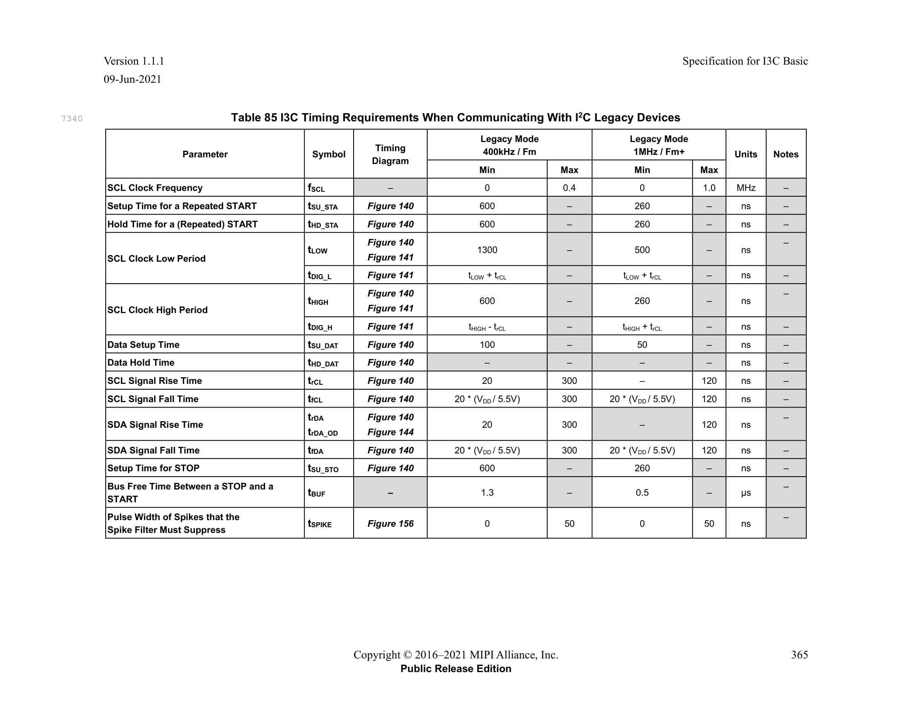

**`7351`** The start of a typical I3C communication in SDR Mode is shown in _**Figure 142**_ . The initial communication **`7352`** looks very similar to I[2] C, with additional commands that follow as described in _**Section 4**_ . The key difference **`7353`** is that higher clock speed is supported, up to 12.5 MHz. The higher clock speed allows Legacy I[2] C Devices **`7354`** with 50 ns Spike Filters to ignore the communications. The Controller can then run in SDR Mode for I3C **`7355`** Devices using full 12.5 MHz timing, though it will have to slow down in order to communicate with Legacy **`7356`** I[2] C Devices. _**Figure 142**_ shows the beginning of a transaction, where the Target acknowledges its Address. 

**`7357`** _**Figure 143**_ shows the possible continuation of an I3C SDR communication, in the case where the Target **`7358`** does not acknowledge its Address. The Controller may either STOP the communication, or else continue with **`7359`** a Repeated START. 

Copyright © 2016–2021 MIPI Alliance, Inc. **Public Release Edition** 

370 

Version 1.1.1 09-Jun-2021 

Specification for I3C Basic 

|_SD_<br>_SC_<br>_SD_<br>_C_<br>_TG_<br>_SC_<br>_p_||||||||||||||||||||||||||||||||||||_SDR Transfer_|_SDR Transfer_|_SDR Transfer_|_SDR Transfer_|_SDR Transfer_|_SDR Transfer_|_SDR Transfer_|_SDR Transfer_|_SDR Transfer_|_SDR Transfer_|_SDR Transfer_|_D_<br>_0.3 X VDD_<br>_0.7 X VDD_<br>_0.7 X VDD_<br>_0.7 X VDD_<br>_0.7 X VDD_<br>_0.3 X VDD_<br>_0.3 X VDD_<br>_0.3 X VDD_<br>_-Pull_<br>_C2_<br>_D6_|
|---|---|---|---|---|---|---|---|---|---|---|---|---|---|---|---|---|---|---|---|---|---|---|---|---|---|---|---|---|---|---|---|---|---|---|---|---|---|---|---|---|---|---|---|---|---|---|---|
|||||_A5_<br>_A6_|||||||||||_A0_<br>_RnW_<br>_ACK_|||||||||||||||||||||_D0_<br>_T_|||||||||||_D_|
||_A_||||||||_A5_||||||||_A0_|||||||||||_D7_|||_D6_|||||||_D0_||||||||||
|||||||||||||||||||||||||||||||||||||||||||||||||
|||||||||||||||||||||||||||||||||||||||||||||||||
||_L_|||||||||||||||||||||||||||||||||||||||||||||||
|||||||_C1_||||_C2_||||||||_C7_|||_C8_||||_C9_||||_C1_|||_C2_|||||||_C8_|||_C9_||||||
||||||||||||||||_s_<br>_Pull Drive_|||||||||||||||||||||_CL clocks are shown i_<br>_even though they_||||||||||||
|||||||||||||||||||||||||||||||||||||||||||||||||
||_A_||_RnW_|||||||||||||||||||||||||_ACK_||||||||||||||||_D7_|||_D6_|
|||||||||||||||||||||||||||||||||||||||||||||||||
|||||||||||||||||||||||||||||||||||||||||||||||||
||_R_SDA_|||||||||||||||||||||||||||||||||||||||||||||||
|||||||||||||||||||||||||||||||||||||||||||||||||
|||||||||||||||||||||||||||||||||||||||||||||||||
|||||||||||||||||||||||||||||||||||||||||||||||||
||_T_SDA_|||||||||||||||||||||||||||||||||||||||||||||||
|||||||||||||||||||||||||||||||||||||||||||||||||
|||||||||||||||||||||||||||||||||||||||||||||||||
|||||||||||||||||||||||||||||||||||||||||||||||||
||_L_<br>_C_||_8_|||||||||||||||||||||||||_C9_||||||||||||||||_C1_|||_C2_|
||_Timing_<br>_arameters used_||||||_tSCO*_|||||_Open-Drain_<br>_tSU_OD_|||||||||||_tSCO*_|||||_Open-Drain_<br>_or Push-Pull_||||||||||||_tSU_PP_||||_Push-Pull_||_Push_|_-Pull_|
|||||||||||||||||||||||||||||||||||||||||||||||||
||_NOTE:_<br>_Open-Drain: Controller releases SDA after a suitable delay from SCL edges_<br>_Push-Pull: Controller drives SDA after a suitable delay from SCL edges_|||||||||||||||||||||||||||||||||||_=_<br>_=_<br>_=_||||_High-Z by Target_<br>_Open-Drain Pull-Up class_<br>_Active Drive by Controlle_|||||_by Controller_<br>_r or Target_|||
|||||||||||||||||||||||||||||||||||||||||||||||||
|||||||||||||||||||||||||||||||||||||||||||||||||
|||||||||||||||||||||||||||||||||||||||||||||||||


_*tSCO is depicted for informative purposes only_ 

**Figure 142 I3C Write Address ACK** 

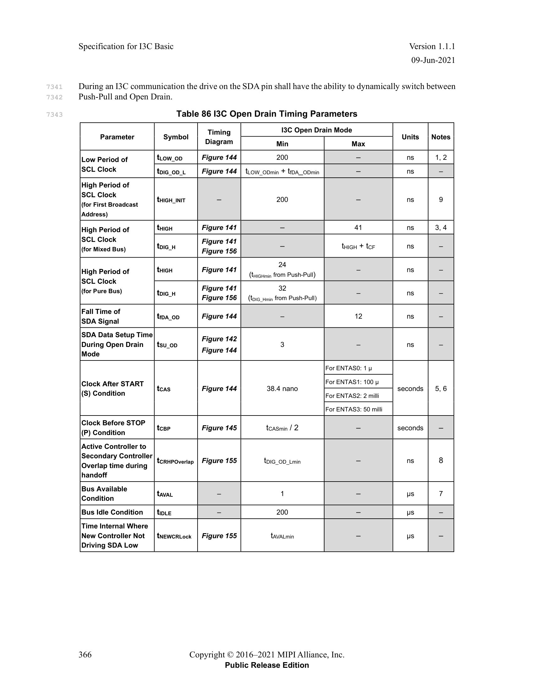

```
7360
7361
```

Copyright © 2016–2021 MIPI Alliance, Inc. **Public Release Edition** 

371 

Specification for I3C Basic 

Version 1.1.1 09-Jun-2021 

**==> picture [470 x 452] intentionally omitted <==**

**----- Start of picture text -----**<br>
STOP<br>0.7 X VDD<br>SDA A6 A5 A0 RnW NACK 0.3 X VDD<br>Repeated START<br>0.7 X VDD<br>SCL C9 0.3 X VDD<br>Transition from<br>= Open-Drain Pull-Up class<br>Open-Drain to<br>= High Speed Active Push-Pull Drive Push-Pull<br>0.7 X VDD<br>SDA 0.3 X VDD<br>0.7 X VDD<br>CR_SDA<br>0.3 X VDD<br>0.7 X VDD<br>TGT_SDA<br>0.3 X VDD<br>0.7 X VDD<br>SCL C9 0.3 X VDD<br>Open-Drain<br>Timing<br>Open-Drain or Push-Pull<br>parameters used Push-Pull* tSU_PP<br>NOTE:<br>Open-Drain: Controller releases SDA after<br>a suitable delay from SCL edges = Active Drive by Controller or Target = Controller drives Push-Pull HIGH,<br>prepares for Repeated START<br>Push-Pull: Controller drives SDA after = Open-Drain Pull-Up class by Controller = Controller drives Push-Pull LOW,<br>a suitable delay from SCL edges<br>prepares for STOP<br>= High-Z by Target<br>**----- End of picture text -----**<br>


_*C9: High phase may be Push-Pull timing if address optimization is used_ 

## **Figure 143 I3C Write Address NACK** 

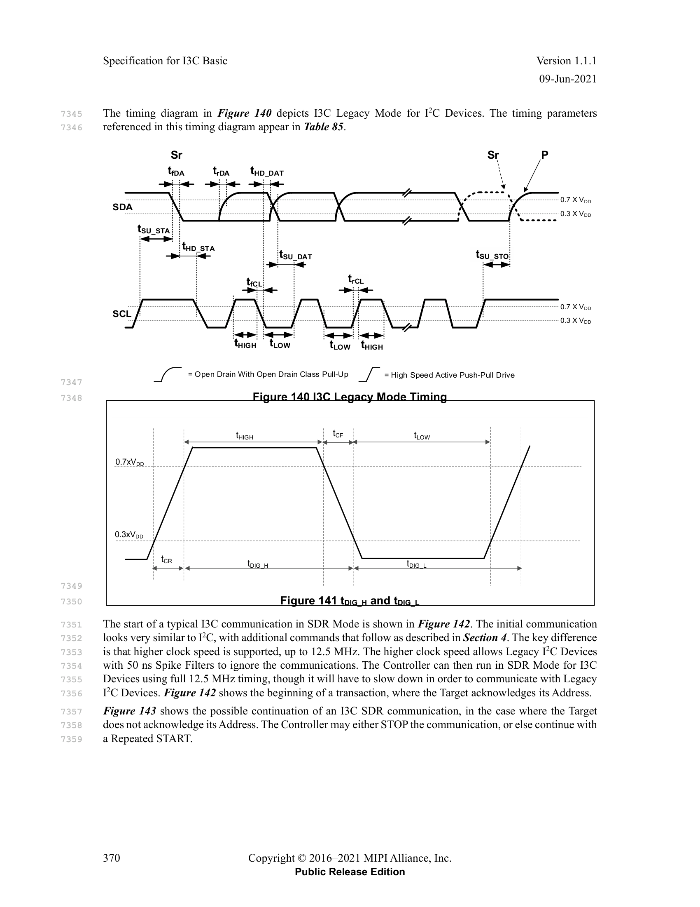

```
7362
7363
```

Copyright © 2016–2021 MIPI Alliance, Inc. **Public Release Edition** 

372 

Version 1.1.1 09-Jun-2021 

Specification for I3C Basic 

**`7364`** _**Figure 144**_ shows the timing parameters for an I3C START (not Repeated START), and _**Figure 145**_ shows **`7365`** the timing parameters for an I3C STOP. 

**==> picture [449 x 517] intentionally omitted <==**

**----- Start of picture text -----**<br>
t t t<br>fDA_OD DS_OD SU_OD<br>0.7 X VDD<br>SDA<br>0.3 X VDD<br>t<br>rDA_OD<br>0.7 X VDD<br>SCL<br>0.3 X VDD<br>tCAS tCF tLOW_OD tCR<br>7366<br>7367  Figure 144 I3C START Timing<br>0.7 X VDD<br>SDA<br>0.3 X VDD<br>0.7 X VDD<br>SCL<br>0.3 X VDD<br>tCR tCBP<br>7368<br>7369  Figure 145 I3C STOP Timing<br>**----- End of picture text -----**<br>


Copyright © 2016–2021 MIPI Alliance, Inc. **Public Release Edition** 

373 

Specification for I3C Basic 

Version 1.1.1 09-Jun-2021 

**`7370`** _**Figure 146**_ and _**Figure 147**_ illustrate the timing parameters that are unique to the Controller Device and to **`7371`** the Target Device, as specified in _**Table 87**_ . The primary difference between the two is that a Controller **`7372`** always transmits the clock (SCL), whereas the Target is receiver-only on the SCL pin. 

```
7373
7374
```

```
7375
7376
```

**==> picture [295 x 514] intentionally omitted <==**

**----- Start of picture text -----**<br>
0.7 X VDD<br>SDA<br>0.3 X VDD<br>tHD_PP tSU_PP<br>0.7 X VDD<br>SCL<br>0.3 X VDD<br>tCF tCR<br>Figure 146 I3C Controller Out Timing<br>0.7 X VDD<br>SDA<br>0.3 X VDD<br>tSCO tSU_PP<br>0.7 X VDD<br>SCL<br>0.3 X VDD<br>tCF tCR<br>**----- End of picture text -----**<br>


**Figure 147 I3C SDR Target Out Timing** 

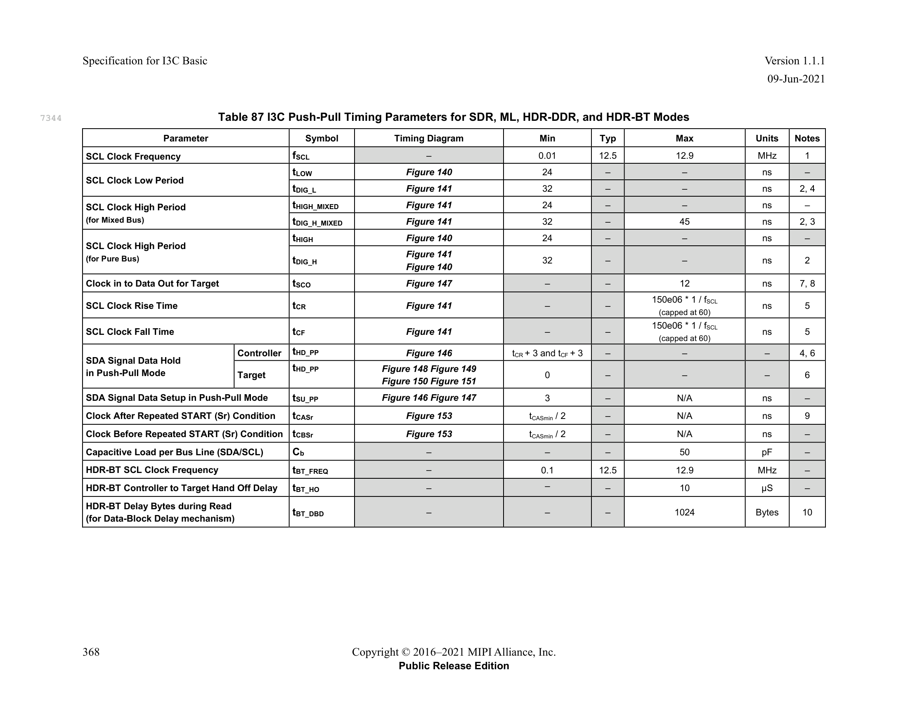

Copyright © 2016–2021 MIPI Alliance, Inc. **Public Release Edition** 

374 

Version 1.1.1 09-Jun-2021 

Specification for I3C Basic 

**==> picture [356 x 231] intentionally omitted <==**

**----- Start of picture text -----**<br>
0.7 X VDD<br>SDA<br>0.3 X VDD<br>0.7 X VDD<br>SCL<br>0.3 X VDD<br>t t<br>SU_PP HD_PP<br>**----- End of picture text -----**<br>


**`7377 7378` Figure 148 Controller SDR Timing** 

**==> picture [356 x 231] intentionally omitted <==**

**----- Start of picture text -----**<br>
0.7 X VDD<br>SDA<br>0.3 X VDD<br>0.7 X VDD<br>SCL<br>0.3 X VDD<br>t t t t<br>SU_PP HD_PP SU_PP HD_PP<br>**----- End of picture text -----**<br>


**`7379 7380` Figure 149 Controller DDR Timing** 

Copyright © 2016–2021 MIPI Alliance, Inc. **Public Release Edition** 

375 

Specification for I3C Basic 

Version 1.1.1 09-Jun-2021 

**==> picture [417 x 420] intentionally omitted <==**

**----- Start of picture text -----**<br>
STOP (P)<br>0.7 X VDD<br>SDA D7 D6 D0 T<br>0.3 X VDD<br>SCL C1 C8 C9 0.7 X VDD<br>0.3 X VDD<br>= High Speed Active Push-Pull Drive<br>STOP (P)<br>0.7 X VDD<br>SDA<br>0.3 X VDD<br>CR_SDA 0.7 X VDD<br>0.3 X VDD<br>TGT_SDA 0.7 X VDD<br>0.3 X VDD<br>0.7 X VDD<br>SCL C9<br>0.3 X VDD<br>tSCO tSCO<br>= Active Drive by Controller or Target  = High-Z by Controller<br>= Open-Drain class Pull-Up by Controller = High-Z by Target<br>**----- End of picture text -----**<br>


_Target terminates the Read transfer by pulling SDA Low in 9[th] bit and allowing Controller Device to generate either STOP or RESTART_ 

**Figure 150 T-Bit When Target Ends Read and Controller Generates STOP** 


```
7381
7382
```

Copyright © 2016–2021 MIPI Alliance, Inc. **Public Release Edition** 

376 

Version 1.1.1 09-Jun-2021 

Specification for I3C Basic 

**==> picture [490 x 427] intentionally omitted <==**

**----- Start of picture text -----**<br>
Repeated<br>START (Sr)<br>0.7 X VDD<br>SDA D7 D6 D0 T<br>0.3 X VDD<br>SCL C1 C8 C9 0.7 X VDD<br>0.3 X VDD<br>= High Speed Active Push-Pull Drive<br>Repeated<br>START (Sr)<br>0.7 X VDD<br>SDA<br>0.3 X VDD<br>0.7 X VDD<br>CR_SDA<br>0.3 X VDD<br>0.7 X VDD<br>TGT_SDA<br>0.3 X VDD<br>0.7 X VDD<br>SCL C9<br>0.3 X VDD<br>tSCO tSCO<br>Target terminates the Read transfer by pulling SDA  = Active Drive by Controller or Target  = High-Z by Controller<br>Low in 9 [th]  bit and allowing Controller Device to<br>generate either STOP or RESTART = Open-Drain class Pull-Up by Controller = High-Z by Target<br>**----- End of picture text -----**<br>


**Figure 151 T-Bit When Target Ends Read and Controller Generates Repeated START** 

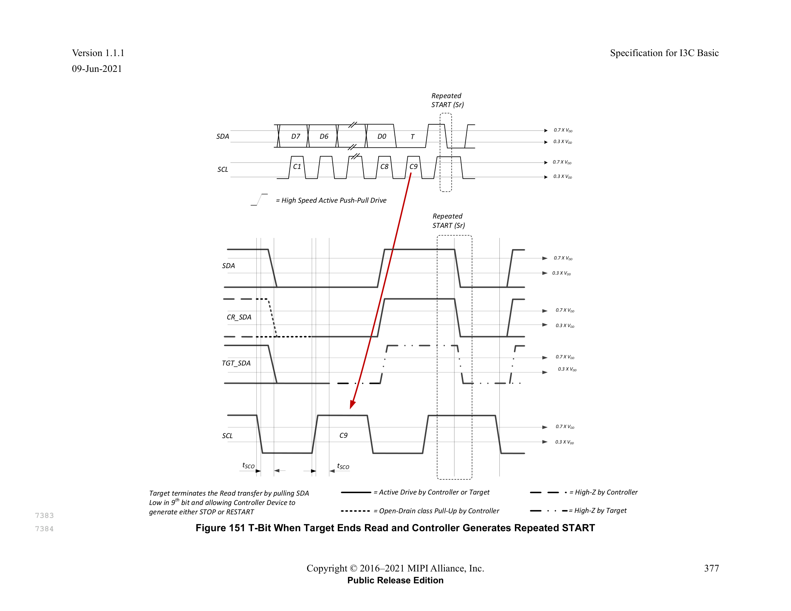

```
7383
7384
```

Copyright © 2016–2021 MIPI Alliance, Inc. **Public Release Edition** 

377 

Specification for I3C Basic 

Version 1.1.1 09-Jun-2021 

**==> picture [468 x 418] intentionally omitted <==**

**----- Start of picture text -----**<br>
SDA D7 D6 D0 T D7 0.7 X VDD<br>0.3 X VDD<br>SCL C1 C8 C9 C1 0.7 X VDD<br>0.3 X VDD<br>= High Speed Active Push-Pull Drive<br>0.7 X VDD<br>SDA<br>0.3 X VDD<br>CR_SDA 0.7 X VDD<br>0.3 X VDD<br>TGT_SDA 0.7 X VDD<br>0.3 X VDD<br>0.7 X VDD<br>C9<br>SCL<br>0.3 X VDD<br>tSCO tSCO tSCO<br>= Active Drive by Controller or Target  = High-Z by Controller<br>= Open-Drain class Pull-Up by Controller = High-Z by Target<br>**----- End of picture text -----**<br>


**Figure 152 T-Bit When Target and Controller Agree to Continue Read Message** 

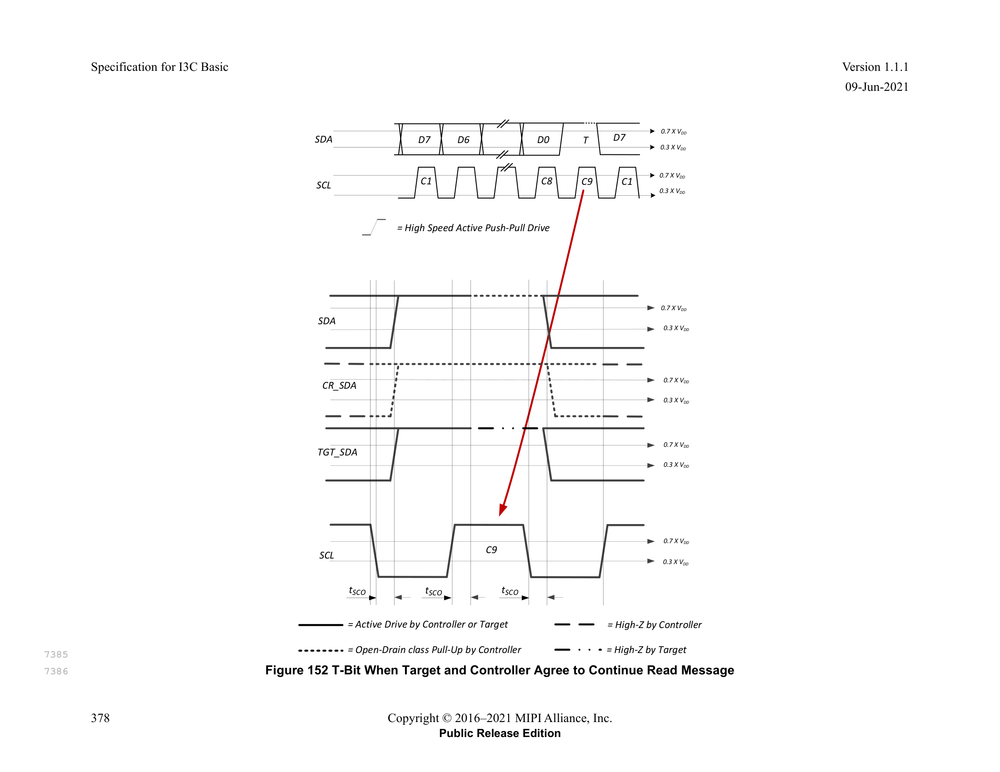

```
7385
7386
```

Copyright © 2016–2021 MIPI Alliance, Inc. **Public Release Edition** 

378 

Version 1.1.1 09-Jun-2021 

Specification for I3C Basic 

**==> picture [505 x 426] intentionally omitted <==**

**----- Start of picture text -----**<br>
Repeated<br>START (Sr) STOP (P)<br>SDA D7 D6 D0 T 0.7 X VDD<br>0.3 X VDD<br>SCL C1 C8 C9 0.7 X VDD<br>0.3 X VDD<br>= High Speed Active Push-Pull Drive<br>Repeated<br>START (Sr) STOP (P)<br>0.7 X VDD<br>SDA<br>0.3 X VDD<br>0.7 X VDD<br>CR_SDA<br>0.3 X VDD<br>TGT_SDA 0.7 X VDD<br>0.3 X VDD<br>0.7 X VDD<br>SCL C9<br>0.3 X VDD<br>tSCO tSCO<br>tCBSr tCASr<br>Note:<br>Sr immediately followed by P is  illegal for I [2] C  = Active Drive by Controller or Target  = High-Z by Controller<br>devices, however many devices are not<br>adversely affected by it. = Open-Drain class Pull-Up by Controller = High-Z by Target<br>The condition is not illegal for I3C devices<br>**----- End of picture text -----**<br>


**Figure 153 T-Bit When Controller Ends Read with Repeated START and STOP** 


```
7387
7388
```

Copyright © 2016–2021 MIPI Alliance, Inc. **Public Release Edition** 

379 

Specification for I3C Basic 

Version 1.1.1 09-Jun-2021 

**==> picture [391 x 433] intentionally omitted <==**

**----- Start of picture text -----**<br>
Repeated<br>START (Sr)<br>SDA D7 D6 D0 T 0.7 X VDD<br>0.3 X VDD<br>SCL C1 C8 C9 C1 0.7 X VDD<br>0.3 X VDD<br>= High Speed Active Push-Pull Drive<br>Repeated<br>START (Sr)<br>0.7 X VDD<br>SDA<br>0.3 X VDD<br>CR_SDA 0.7 X VDD<br>0.3 X VDD<br>TGT_SDA 0.7 X VDD<br>0.3 X VDD<br>0.7 X VDD<br>SCL C9<br>0.3 X VDD<br>tSCO tSCO<br>tCBSr tCASr<br>= Active Drive by Controller or Target  = High-Z by Controller<br>= Open-Drain class Pull-Up by Controller = High-Z by Target<br>**----- End of picture text -----**<br>


**Figure 154 T-Bit When Controller Ends Read via Repeated START and Further Transfer** 

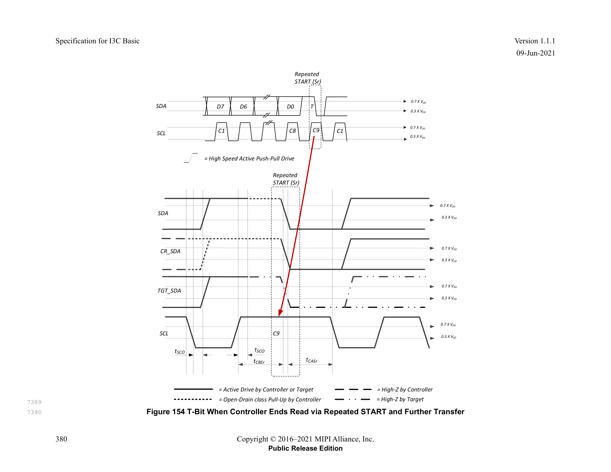

```
7389
7390
```

Copyright © 2016–2021 MIPI Alliance, Inc. **Public Release Edition** 

380 

Version 1.1.1 09-Jun-2021 

Specification for I3C Basic 

**==> picture [628 x 395] intentionally omitted <==**

**----- Start of picture text -----**<br>
STOP START<br>0.7 X VDD<br>SDA A6 A5 0.3 X VDD<br>0.7 X VDD<br>NCR_SDA 0.3 X VDD<br>0.7 X VDD<br>CCR_SDA 0.3 X VDD<br>0.7 X VDD<br>NCR_SCL 0.3 X VDD<br>0.7 X VDD<br>CCR_SCL 0.3 X VDD<br>0.7 X VDD<br>SCL C1 C2<br>0.3 X VDD<br>tNEWCRLock<br>Timing<br>parameters  tCRHPOverlap Open-Drain OD or PP Open-Drain OD or PP<br>used tSU_STO tSCO tCAS<br>= Active Drive by Controller<br>NOTE:<br>Controller releases or drives SDA  = Open-Drain Pull-Up class by Controller<br>after a suitable delay from SCL edges<br>= High-Z by Controller<br>**----- End of picture text -----**<br>


**Figure 155 Controller to Controller Bus Handoff** 

```
7391
7392
```

Copyright © 2016–2021 MIPI Alliance, Inc. **Public Release Edition** 

381 

Specification for I3C Basic 

Version 1.1.1 09-Jun-2021 

**`7393`** _**Figure 156**_ illustrates the I3C timing parameters related to the Spike Filter present on Legacy I[2] C Devices. **`7394`** This Spike Filter suppresses pulses shorter than 50 ns. **`7395`** I3C Mixed Bus clocking rates are chosen to prevent Legacy I[2] C Devices from seeing I3C Bus **`7396`** communications, by keeping at least the SCL High periods under 50 ns. To a Legacy I[2] C Device, SCL will **`7397`** simply appear to remain Low, i.e., no clock pulses will be received. In other words, I3C Bus communication **`7398`** uses SCL High periods of less than 50 ns, which are invisible to Legacy I[2] C Devices. (Low periods are also **`7399`** generally less than 50 ns, though longer in some cases.) 

**`7400`** _**Figure 156**_ details how when the slower Open Drain timing ( **tDIG_H** ) is used both I3C Devices (bottom trace) **`7401`** and Legacy I[2] C Devices (middle trace) can see its longer periods, and therefore both can see the Bus traffic. **`7402`** But when I3C’s faster Push-Pull timing ( **tDIG_H_MIXED** ) is used, the shorter periods will only reach the I3C **`7403`** Devices and not the Legacy I[2] C Devices, so only I3C Devices can participate in the Bus. I3C Push-Pull **`7404`** timing is specified in _**Table 87**_ . 

**==> picture [422 x 318] intentionally omitted <==**

**----- Start of picture text -----**<br>
Note: Not to scale<br>0.7 X VDD<br>Input to<br>SDA/SCL Pins<br>0.3 X VDD<br>Legacy I [2] C 0.7 X VDD<br>SDA/SCL Pins<br>After Spike Filter<br>Suppressed by 0.3 X VDD<br>50 ns filter<br>0.7 X VDD<br>I3C SDA/SCL Pins<br>Without Spike Filter<br>0.3 X VDD<br>t t t t<br>DIG_H_MIXED DIG_H DIG_L DIG_L_MIXED<br>**----- End of picture text -----**<br>


```
7405
7406
```

**Figure 156 I[2] C Spike Filter Behavior** 

![Figure 156 I[2] C Spike Filter Behavior](figures/fig_140_p392.png)

Copyright © 2016–2021 MIPI Alliance, Inc. **Public Release Edition** 

382 

Version 1.1.1 09-Jun-2021 

Specification for I3C Basic 

**`7407`** _**Table 88**_ through _**Table 90**_ detail how timing and drive strength are adjusted during transmission of an I3C **`7408`** Message. 

## **`7409`** 

**Table 88 Timing and Drive for Start of New Frame: No Contention on A6** 

||**S**|**Header**|**Header**|**Header**|**Header**|**Data**|**P**|
|---|---|---|---|---|---|---|---|
||START|Addr[6]<br>(Arbitrated)|Addr[5:0]|RnW|ACK|N Data +<br>T-Bit|STOP|
|**SDA Mode**|Open<br>Drain|Open<br>Drain|Push-Pull|Push-Pull|Open Drain|Push-Pull|Push-Pull|
|**Clocks**|1|1|6|1|1|9 * N|1|
|**_Note:_**<br>_No contention on Addr[6], so the Controller may optionally use Push-Pull for Addr[5:0] and RnW, per_<br>**_Section 5.1.2.2.2_**_._||||||||


## **`7410` Table 89 Timing and Drive for Start of New Frame: With Contention on A6** 

||**S**|**Header**|**Header**|**Header**|**Header**|**Data**|**P**|
|---|---|---|---|---|---|---|---|
||START|Addr[6]<br>(Arbitrated)|Addr[5:0]<br>(Arbitrated)|RnW<br>(Arbitrated)|ACK|N Data +<br>T-Bit|STOP|
|**SDA Mode**|Open<br>Drain|Open<br>Drain|Open<br>Drain|Open<br>Drain|Open<br>Drain|Push-Pull|Push-Pull|
|**Clocks**|1|1|6|1|1|9 * N|1|
|**_Note:_**<br>_Contention on Addr[6], so Arbitration continues through Addr[5:0] and RnW._||||||||


```
7411
```

**Table 90 Timing and Drive for Continuation of Frame Using Repeated START** 

||**S**|**Header /**<br>**Data…**|**Sr**|**Header**|**Header**|**Data**|**P**|
|---|---|---|---|---|---|---|---|
||START|…|START|Addr/RnW|ACK|N Data +<br>T-Bit|STOP|
|**SDA Mode**|Open<br>Drain|…|Push-Pull|Push-Pull|Open<br>Drain|Push-Pull|Push-Pull|
|**Clocks**|1|…|1|8|1|9 * N|1|
|**_Note:_**<br>_There may be any number of Repeated STARTs before the STOP._||||||||


**See Errata 01, Item 22** 

Copyright © 2016–2021 MIPI Alliance, Inc. **Public Release Edition** 

383 

Specification for I3C Basic 

Version 1.1.1 09-Jun-2021 

This page intentionally left blank. 

Copyright © 2016–2021 MIPI Alliance, Inc. **Public Release Edition** 

384 

Version 1.1.1 09-Jun-2021 

Specification for I3C Basic 

## **Annex A I3C Communication Format Details** 

**==> picture [450 x 403] intentionally omitted <==**

**----- Start of picture text -----**<br>
A.1  I3C CCC Transfers<br>Previous transfer Sr I3C Reserved Byte (7'h7E) (RnW=0) ACK I3C Broadcast CCC (0x00 to 0x7F) T Optional Write Data T Sr or P<br>I3C Broadcast CCC Write<br>eS, SS<br>S  I3C Reserved Byte ACK<br>(7'h7E) (RnW=0)<br>I3C Directed CCC  T Sr I3C Target  ACK Optional Write  T<br>(0x80 to 0xFE) Address (RnW=0) Data<br>LEGEND<br>From Controller to Target Sr I3C Target  ACK Optional Write  T (Sr ..7'h7E)<br>Address (RnW=0) Data or P<br>From Target to Controller<br>I3C Directed CCC Write<br>- | LI<br>Transition Bit<br>(Parity Bit for CCC Write Data)<br>Transition Bit(End-of-Data for CCC Read Data) I3C Directed CCC (0x80 to 0xFE) T Sr Address (RnW=1)I3C Target  ACK Read Data T<br>o a 2 2<br>ACK ACK with Handoff<br>ACK ACK without Handoff Sr I3C Target  ACK Read Data T (Sr ..7'h7E)<br>Address (RnW=1) or P<br>ACK = Acknowledge (SDA Low) I3C Directed CCC Read<br>NACK = Not Acknowledge (NACK)<br>S = START Condition<br>Sr = Repeated START Condition NOTE: 1.  Optional Write data can be 0/1/n bytes, based on the CCC<br>P = STOP Condition 2.  Read Data can be 1/n bytes, based on the CCC<br>7412  T = Transition Bit alternative to ACK/NACK<br>7413  Figure 157 I3C CCC Transfers<br>**----- End of picture text -----**<br>


Copyright © 2016–2021 MIPI Alliance, Inc. **Public Release Edition** 

385 

Specification for I3C Basic 

Version 1.1.1 09-Jun-2021 

**A.2 I3C Private Write and Read Transfers** 

**==> picture [414 x 346] intentionally omitted <==**

**----- Start of picture text -----**<br>
S  I3C Reserved Byte(7'h7E) (RnW=0) ACK Sr Address (RnW=0)I3C Target  ACK  Write Data-1 T ...  Write Data-N T Sr or P<br>mT Ut CU ET<br>I3C Private Write Transfer Initiated with START Condition<br>... Previous transfer Sr Address (RnW=0)I3C Target  ACK  Write Data-1 T ...  Write Data-N T Sr or P<br>ttTrtbE tt<br> I3C Private Write Transfer Initiated with Repeated START Condition<br>S  I3C Reserved Byte(7'h7E) (RnW=0) ACK Sr Address (RnW=1)I3C Target  ACK Read Data-1 T ... Read Data-N T Sr or P<br>eee<br> I3C Private Read Transfer Initiated with START Condition<br>... Previous transfer Sr Address (RnW=1)I3C Target  ACK  Read Data-1 T ... Read Data-N T Sr or P<br>| LE T t tt Ltt<br> I3C Private Read Transfer Initiated with Repeated START Condition<br>LEGEND<br>ACK = Acknowledge (SDA Low)<br>From Controller to Target ACK ACK with Handoff NACK = Not Acknowledge (NACK)<br>S = START Condition<br>LJ LJ<br>Sr = Repeated START Condition<br>P = STOP Condition<br>From Target to Controller ACK ACK without Handoff T = Transition Bit alternative to ACK/NACK<br>LJ ZA<br>Transition Bit Transition Bit<br>(Parity Bit for Write Data) (End-of-Data for Read Data)<br>**----- End of picture text -----**<br>


**`7414 7415` Figure 158 I3C Private Write and Read Transfers with 7’h7E Address** 

Copyright © 2016–2021 MIPI Alliance, Inc. **Public Release Edition** 

386 

Version 1.1.1 09-Jun-2021 

Specification for I3C Basic 

**==> picture [340 x 92] intentionally omitted <==**

**----- Start of picture text -----**<br>
S  I3C Target Address (RnW=0) ACK  Write Data-1 T ...  Write Data-N T Sr ...<br>mt!hE<br> I3C Private Write Transfer (from START) without 7'h7E Address<br>... Previous Write Sr Address (RnW=1)I3C Target  ACK  Read Data-1 T ...  Read Data-N T Sr or P<br>2 7 ee<br>**----- End of picture text -----**<br>


**I3C Private Read Transfer (from Repeated START) after Private Write** 

**==> picture [312 x 23] intentionally omitted <==**

**----- Start of picture text -----**<br>
S  I3C Target Address (RnW=1) ACK  Read Data-1 T ...  Read Data-N T Sr or P<br>ee<br>**----- End of picture text -----**<br>


|**I3C Private Read Transfer (from START) without 7'h7E Address**|**I3C Private Read Transfer (from START) without 7'h7E Address**|**I3C Private Read Transfer (from START) without 7'h7E Address**||||
|---|---|---|---|---|---|
|**I3C Private Read Transfer (from START) without 7'h7E Address**|**I3C Private Read Transfer (from START) without 7'h7E Address**|**I3C Private Read Transfer (from START) without 7'h7E Address**||||
|**LEGEND**||||ACK|= Acknowledge (SDA Low)|
|From Controller to Target<br>ACK<br>ACK with Handoff<br>L_]||||NACK<br>S<br>Sr|= Not Acknowledge (NACK)<br>= START Condition<br>= Repeated START Condition|
|From Target to Controller<br>ACK<br>ACK without Handoff<br>~~Z~~||||P<br>T|= STOP Condition<br>= Transition Bit alternative to ACK/NACK|
|Transition Bit<br>(Parity Bit for Write Data)<br>L_]|L_]|Transition Bit<br>(End-of-Data for Read Data)<br>L_]||||


**`7416 7417` Figure 159 I3C Private Write and Read Transfers without 7’h7E Address** 

Copyright © 2016–2021 MIPI Alliance, Inc. **Public Release Edition** 

387 

Specification for I3C Basic 

Version 1.1.1 09-Jun-2021 

**A.3 Legacy I[2] C Write and Read Transfers on the I3C Bus** 

**==> picture [422 x 350] intentionally omitted <==**

**----- Start of picture text -----**<br>
S  I3C Reserved Byte(7'h7E) (RnW=0) ACK Sr Legacy IAddress (RnW=0) [2] C Target  ACK  Write Data-1 ACK ...  Write Data-N NACKACK/ Sr or P<br>eee<br>Legacy I [2] C Write Transfer Initiated with START Condition<br>... Previous transfer Sr Legacy IAddress (RnW=0) [2] C Target  ACK  Write Data-1 ACK ...  Write Data-N NACKACK/ Sr or P<br>tt Tr Ti - Tt<br>Legacy I [2] C Write Transfer Initiated with Repeated START Condition<br>S  I3C Reserved Byte(7'h7E) (RnW=0) ACK Sr Legacy IAddress (RnW=1) [2] C Target  ACK Read Data-1 ACK ... Read Data-N NACK Sr or P<br>eee<br>Legacy I [2] C Read Transfer Initiated with START Condition<br>... Previous transfer Sr Address (RnW=1)I3C Target  ACK  Read Data-1 ACK ... Read Data-N NACK Sr or P<br>2 ee eee<br>Legacy I [2] C Read Transfer Initiated with Repeated START Condition<br>LEGEND<br>ACK = Acknowledge (SDA Low)<br>From Controller to Target ACK ACK (from Target) NACK = Not Acknowledge (NACK)<br>(Accept Write Data) S = START Condition<br>L_] L]<br>Sr = Repeated START Condition<br>From Target to Controller ACK ACK (from Controller) P = STOP Condition<br>(Continue Read Data)<br>L_] LJ<br>NACK NACK (from Controller)<br>(End of Read Data)<br>**----- End of picture text -----**<br>


**`7418 7419` Figure 160 Legacy I[2] C Write and Read Transfers in I3C Bus with 7’h7E Address** 

Copyright © 2016–2021 MIPI Alliance, Inc. **Public Release Edition** 

388 

Version 1.1.1 09-Jun-2021 

Specification for I3C Basic 

**==> picture [417 x 330] intentionally omitted <==**

**----- Start of picture text -----**<br>
S  Legacy IAddress (RnW=0) [2] C Target  ACK  Write Data-1 ACK ...  Write Data-N NACKACK/ Sr ...<br>a Tt Ut<br>Legacy I [2] C Write Transfer (from START) without 7'h7E Address<br>... Previous Write Sr Legacy IAddress (RnW=1) [2] C Target  ACK  Read Data-1 ACK ...  Read Data-N NACK Sr or P<br>| LE Tt tT) Lt<br>Legacy I [2] C Read Transfer (from Repeated START) after Write<br>S  Legacy IAddress (RnW=1) [2] C Target  ACK  Read Data-1 ACK ...  Read Data-N NACK Sr or P<br>eee<br>Legacy I [2] C Read Transfer (from START) without 7'h7E Address<br>LEGEND<br>ACK = Acknowledge (SDA Low)<br>From Controller to Target ACK ACK (from Target) (Accept Write Data) SNACK = Not Acknowledge (NACK)= START Condition<br>L] L_] Sr = Repeated START Condition<br>P = STOP Condition<br>From Target to Controller ACK ACK (from Controller)<br>(Continue Read Data)<br>L] [|<br>NACK NACK (from Controller)<br>(End of Read Data)<br>**----- End of picture text -----**<br>


**`7420 7421` Figure 161 Legacy I[2] C Write and Read Transfers in I3C Bus without 7’h7E Address** 

Copyright © 2016–2021 MIPI Alliance, Inc. **Public Release Edition** 

389 

Specification for I3C Basic 

Version 1.1.1 09-Jun-2021 

## **A.4 Dynamic Address and Enter HDR** 

**==> picture [512 x 284] intentionally omitted <==**

**----- Start of picture text -----**<br>
S or Sr I3C Reserved Byte  ACK I3C Modal Broadcast  T<br>(7'h7E) (RnW=0) CCC (ENTDAA)<br>Sr I3C Reserved Byte  ACK Read Data: 8 Bytes Assign Address to PAR ACK/<br>(7'h7E) (RnW=1) (48-bit Unique ID, BCR, DCR) the Target (7 bits) NACK<br>Repeat per each Target assigned<br>Sr I3C Reserved Byte  NACK P<br>(7'h7E) (RnW=1)<br>LEGEND<br>Exit procedure<br>ACK/NACK<br>From Controller to Target ACK<br>== (with Handoff)<br>ACK = Acknowledge (SDA Low)<br>NACK = Not Acknowledge (NACK) From Target to Controller ACK ACK/NACK<br>S = START Condition = L_ (without Handoff)<br>Sr = Repeated START Condition<br>P = STOP Condition  Transition Bit<br>T = Transition Bit alternative to ACK/NACK = (Parity Bit for CCC)<br>PAR = Parity Bit<br>7422<br>7423  Figure 162 Dynamic Address Allocation ENTDAA CCC Bus Modal<br>**----- End of picture text -----**<br>


Copyright © 2016–2021 MIPI Alliance, Inc. **Public Release Edition** 

390 

Version 1.1.1 

Specification for I3C Basic 

09-Jun-2021 

**==> picture [456 x 294] intentionally omitted <==**

**----- Start of picture text -----**<br>
SDR<br>S or Sr I3C Reserved Byte  ACK I3C Modal Broadcast CCC  T<br>(7'h7E) (RnW=0) (ENTHDR0 – ENTHDR7)<br>HDR Mode entered after T-Bit<br>HDR<br>HDR Command HDR Data  HDR  HDR Restart<br>or Header (1 or more words/blocks) CRC* Pattern<br>HDR Bus Free<br>HDR Command HDR Data  HDR  HDR Exit<br>P<br>or Header (1 or more words/blocks) CRC* Pattern<br>ACK = Acknowledge (SDA Low)<br>NACK = Not Acknowledge (NACK) LEGEND<br>S = START Condition<br>Sr = Repeated START Condition SDR From Controller to Target S Framing<br>P = STOP Condition  HDR P (START or STOP)<br>=L<br>T = Transition Bit alternative<br>to ACK/NACK<br>From Target to Controller SDR Current I3C Mode<br>NOTE: Certain HDR Modes might not use CRC. Transition Bit = HDR (SDR or HDR)<br>Refer to HDR Mode framing and protocol.<br>= (Parity Bit for CCC)<br>Bus Bus Free (after STOP)<br>**----- End of picture text -----**<br>


**`7424 7425`** 

**Figure 163 Enter HDR Mode CCC Bus Modal** 

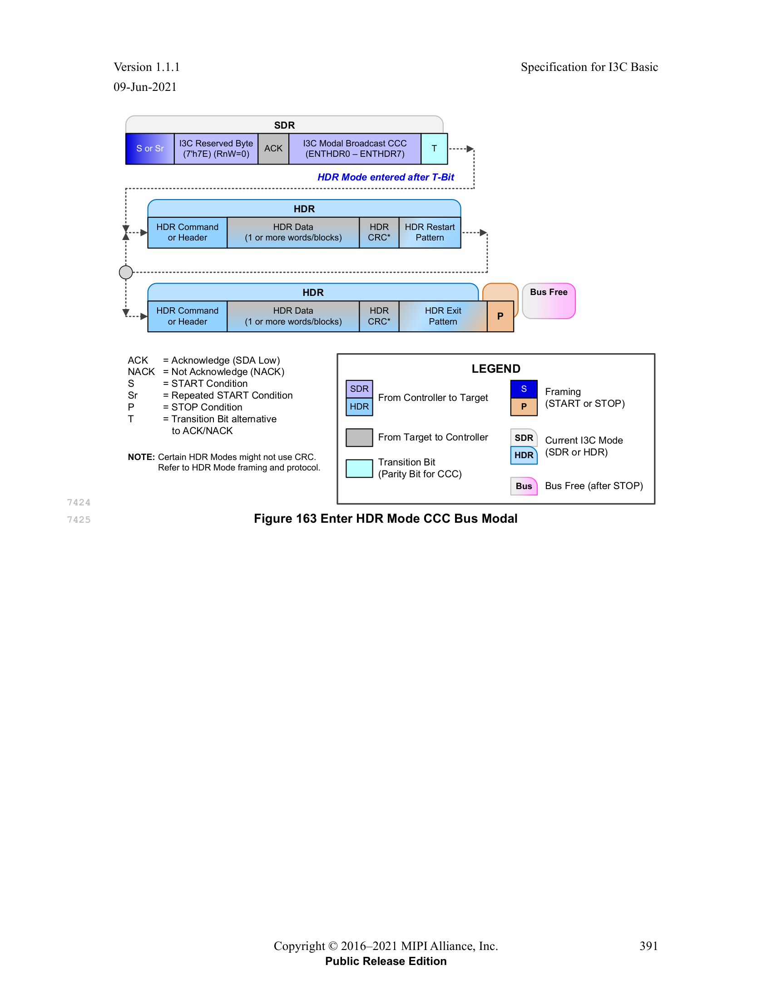

Copyright © 2016–2021 MIPI Alliance, Inc. **Public Release Edition** 

391 

Specification for I3C Basic 

Version 1.1.1 09-Jun-2021 

This page intentionally left blank. 

Copyright © 2016–2021 MIPI Alliance, Inc. **Public Release Edition** 

392 

Version 1.1.1 09-Jun-2021 

Specification for I3C Basic 

## **Annex B SDR Mode Error Type Origins** 

## **B.1 Error Types in I3C CCC Transfers** 

**==> picture [466 x 384] intentionally omitted <==**

**----- Start of picture text -----**<br>
Type TE0 Type TE1 Type TE2, Type TE5<br>Previous transfer Sr I3C Reserved Byte (7'h7E) (RnW=0) ACK I3C Broadcast CCC (0x00 to 0x7F) T Optional Write Data T Sr or P<br>fe Th.<br>I3C Broadcast CCC Write<br>ee<br>S  I3C Reserved Byte ACK Type TE5<br>(7'h7E) (RnW=0)<br>Type TE1 Type TE0 [(1)] Type TE2<br>I3C Directed CCC  T Sr I3C Target  ACK Optional Write  T<br>(0x80 to 0xFE) Address (RnW=0) Data<br>Type TE0 [(1)] Type TE2<br>Sr I3C Target  ACK Optional Write  T (Sr ..7'h7E)<br>Address (RnW=0) Data or P<br>LEGEND<br>From Controller to Target I3C Directed CCC Write<br>Type CE0, Type TE5<br>From Target to Controller<br>Type TE1 Type TE0 [(1)]<br>= \<br>Transition Bit I3C Directed CCC  T Sr I3C Target  ACK Read Data T<br>(0x80 to 0xFE) Address (RnW=1)<br>(Parity Bit for CCC Write Data)<br>Transition Bit<br>(End-of-Data for CCC Read Data)<br>Type TE0 [(1)]<br>Sr I3C Target  ACK Read Data T (Sr ..7'h7E)<br>(1)   The probability of error detection is quite low. Address (RnW=1) or P<br>ACK = Acknowledge (SDA Low) I3C Directed CCC Read<br>NACK = Not Acknowledge (NACK)<br>S = START Condition<br>Sr = Repeated START Condition NOTE: 1. 2.  Read Data can be 1/n bytes, based on the CCCOptional Write data can be 0/1/n bytes, based on the CCC<br>P = STOP Condition<br>T = Transition Bit alternative to ACK/NACK<br>7426<br>7427  Figure 164 Error Type Origins: I3C CCC Transfers<br>**----- End of picture text -----**<br>


Copyright © 2016–2021 MIPI Alliance, Inc. 393 **Public Release Edition** 

Specification for I3C Basic 

Version 1.1.1 

09-Jun-2021 

**==> picture [333 x 13] intentionally omitted <==**

**----- Start of picture text -----**<br>
B.2  Error Types in I3C Private Read and Write Transfers<br>**----- End of picture text -----**<br>


**==> picture [423 x 397] intentionally omitted <==**

**----- Start of picture text -----**<br>
Type TE0 Type TE0 [(1)] Type TE2 Type TE2<br>S  I3C Reserved Byte(7'h7E) (RnW=0) ACK Sr Address (RnW=0)I3C Target  ACK  Write Data-1 T ...  Write Data-N T Sr or P<br>eee<br>I3C Private Write Transfer Initiated with START Condition<br>Type TE0 [(1)] Type TE2 Type TE2<br>... Previous transfer Sr Address (RnW=0)I3C Target  ACK  Write Data-1 T ...  Write Data-N T Sr or P<br>| [CDOT]<br> I3C Private Write Transfer Initiated with Repeated START Condition<br>Type TE0 Type TE0 [(1)]<br>S  I3C Reserved Byte(7'h7E) (RnW=0) ACK Sr Address (RnW=1)I3C Target  ACK Read Data-1 T ... Read Data-N T Sr or P<br>eee<br> I3C Private Read Transfer Initiated with START Condition<br>Type TE0 [(1)]<br>... Previous transfer Sr Address (RnW=1)I3C Target  ACK  Read Data-1 T ... Read Data-N T Sr or P<br>LE Tt tT Ltt<br> I3C Private Read Transfer Initiated with Repeated START Condition<br>LEGEND<br>(1)  The probability of error detection is quite low.<br>From Controller to Target<br>L_]<br>ACK = Acknowledge (SDA Low)<br>NACK = Not Acknowledge (NACK)<br>From Target to Controller<br>L_] S = START Condition<br>Sr = Repeated START Condition<br>Transition Bit P = STOP Condition<br>L_] (Parity Bit for Write Data) T = Transition Bit alternative to ACK/NACK<br>Transition Bit<br>(End-of-Data for Read Data)<br>**----- End of picture text -----**<br>


**`7428`** 

**`7429` Figure 165 Error Type Origins: I3C Private Write & Read Transfers with 7’h7E Address** 

Copyright © 2016–2021 MIPI Alliance, Inc. **Public Release Edition** 

394 

Version 1.1.1 09-Jun-2021 

Specification for I3C Basic 

**==> picture [340 x 343] intentionally omitted <==**

**----- Start of picture text -----**<br>
Type TE0 [(1)] Type TE2 Type TE2<br>S  I3C Target Address (RnW=0) ACK  Write Data-1 T ...  Write Data-N T Sr ...<br>ee<br> I3C Private Write Transfer (from START) without 7'h7E Address<br>Type TE0 [(1)]<br>... Previous Write Sr Address (RnW=1)I3C Target  ACK  Read Data-1 T ...  Read Data-N T Sr or P<br>LE tt tL _tt<br> I3C Private Read Transfer (from Repeated START) after Private Write<br>Type TE0 [(1)]<br>S  I3C Target Address (RnW=1) ACK  Read Data-1 T ...  Read Data-N T Sr or P<br>ma | UEC<br> I3C Private Read Transfer (from START) without 7'h7E Address<br>LEGEND<br>(1)  The probability of error detection is quite low.<br>From Controller to Target<br>L_] ACK = Acknowledge (SDA Low)<br>NACK = Not Acknowledge (NACK)<br>S = START Condition<br>L_] From Target to Controller Sr = Repeated START Condition<br>P = STOP Condition<br>T = Transition Bit alternative to ACK/NACK<br>LJ Transition Bit(Parity Bit for Write Data)<br>Transition Bit<br>(End-of-Data for Read Data)<br>**----- End of picture text -----**<br>


**`7430 7431` Figure 166 Error Type Origins: I3C Private Write & Read Transfers without 7’h7E Address** 

Copyright © 2016–2021 MIPI Alliance, Inc. **Public Release Edition** 

395 

Specification for I3C Basic 

Version 1.1.1 09-Jun-2021 

## **B.3 Error Types in Dynamic Address Arbitration** 

**==> picture [517 x 316] intentionally omitted <==**

**----- Start of picture text -----**<br>
Type TE0 Type TE1<br>S or Sr I3C Reserved Byte  ACK I3C Modal Broadcast  T<br>(7'h7E) (RnW=0) CCC (ENTDAA)<br>Type CE0, Type TE5<br>Type TE4 Type TE3<br>Sr I3C Reserved Byte  ACK Read Data: 8 Bytes Assign Address to PAR ACK/<br>(7'h7E) (RnW=1) (48-bit Unique ID, BCR, DCR) the Target (7 bits) NACK<br>—— Repeat per each Target assigned i e<br>Type TE4<br>Sr I3C Reserved Byte  NACK P<br>(7'h7E) (RnW=1)<br>LEGEND<br>Exit procedure<br>ACK/NACK<br>From Controller to Target ACK<br>-= (with Handoff)<br>ACK = Acknowledge (SDA Low)<br>NACK = Not Acknowledge (NACK) From Target to Controller ACK ACK/NACK<br>S = START Condition = [J (without Handoff)<br>Sr = Repeated START Condition<br>P = STOP Condition  Transition Bit<br>T = Transition Bit alternative to ACK/NACK L_] (Parity Bit for CCC)<br>PAR = Parity Bit<br>7432<br>7433  Figure 167 Error Type Origins: Dynamic Address Arbitration<br>**----- End of picture text -----**<br>


Copyright © 2016–2021 MIPI Alliance, Inc. **Public Release Edition** 

396 

Version 1.1.1 09-Jun-2021 

Specification for I3C Basic 

## **Annex C I3C Controller FSMs** 

**`7434`** _**Figure 168**_ shows the key transmission Modes and their entry, resume, and exit sequences. It includes the **`7435`** SDR transmission states, and differentiates these from other capabilities and Modes. It captures the states at **`7436`** which Arbitration happens as well. 

**==> picture [416 x 387] intentionally omitted <==**

**----- Start of picture text -----**<br>
Hot-Join<br>Request SDA arbitration<br>Idle Controller  happens<br>(Bus Free) Role<br>I [2] C Legacy  Request<br>mode I3C transmission<br>IBI (Target  mode<br>Interrupt)<br>start DAA Request<br>enter HDR  START I3C capability<br>mode<br>I3C Directed<br>CCC<br>SDR<br>I3C Address<br>I3C Target  Pvt Msg  I3C BCAST<br>Addr[7:1] &   Entry  7E/W Directed<br>CMD Repeated Start CCC<br>Repeated<br>bcast  Start<br>Next  CCC<br>Pvt msg txn<br>After no data<br>CCC I3C BCAST  Directed<br>CCC<br>CCC<br>Tx/Rx Data<br>Pvt Msg<br>Tx/Rx Data<br>Pvt Msg<br>Repeated<br>Start<br>Bcast CCC  non-data<br>TX Data CCC & hold bus<br>Next CCC<br>txn<br>T, data complete non-data CCC &<br> & hold bus release bus<br>Bcast<br>Repeated  release<br>Start bus<br>release bus<br>to START or<br>STOP<br>Idle  (Bus Free)<br>ACK<br>**----- End of picture text -----**<br>


```
7437
7438
```

**Figure 168 I3C Primary Controller FSM** 

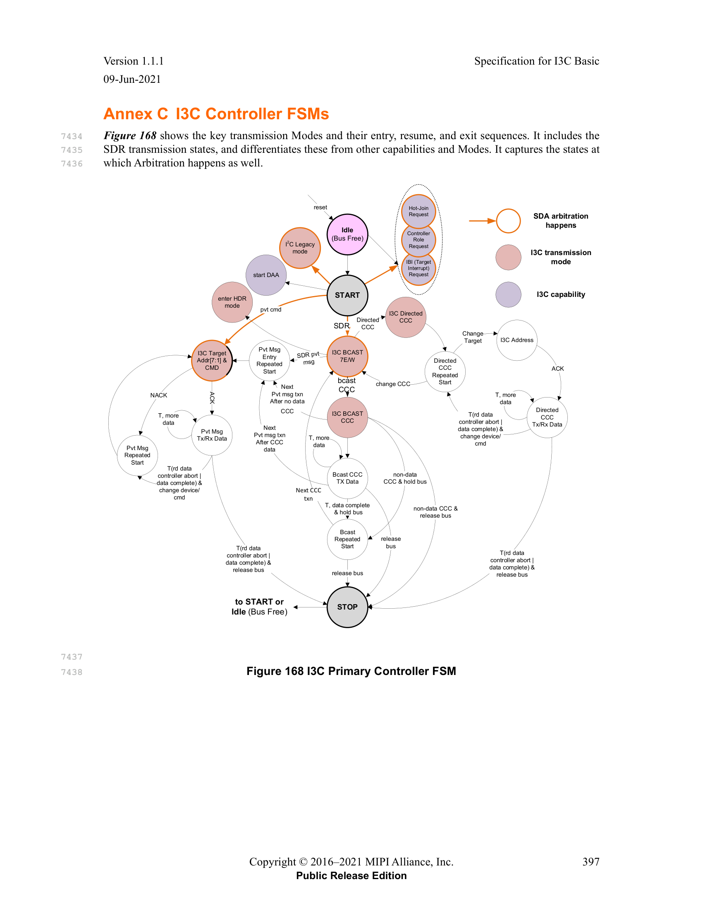

Copyright © 2016–2021 MIPI Alliance, Inc. **Public Release Edition** 

397 

Specification for I3C Basic 

Version 1.1.1 09-Jun-2021 

**`7439`** _**Figure 169**_ through _**Figure 173**_ represent I3C features including In-Band Interrupts, Secondary Controller, **`7440`** Dynamic Address Assignment, and Hot-Join. 

**==> picture [429 x 471] intentionally omitted <==**

**----- Start of picture text -----**<br>
START<br>Issue Repeated<br>bus cmd  START, follow<br>detected ==  I3C traffic modes<br>Start<br>Addr==<br>Target Addr<br>[7:1]<br>Broadcast  Direct CCC<br>CCC DISEC  DISEC w/<br>w/ DISINT DISINT<br>RnW == 1<br>Disable all<br>Targets?<br>Is BCR bit[2]<br>set to 1'b1?<br>Disable Target<br>Interrupts?<br>Broadcast<br>Addr (7'h7E)<br>w/ RnW=0<br>Read MDB and<br>any add’l Data<br>End IBI w/<br>Bytes<br>Repeated<br>START or<br>STOP<br>Repeated<br>START<br>Follow I3C traffic<br>modes, or  STOP<br>**----- End of picture text -----**<br>


```
7441
7442
```

**Figure 169 In-Band Interrupt (Target Interrupt) Request FSM** 

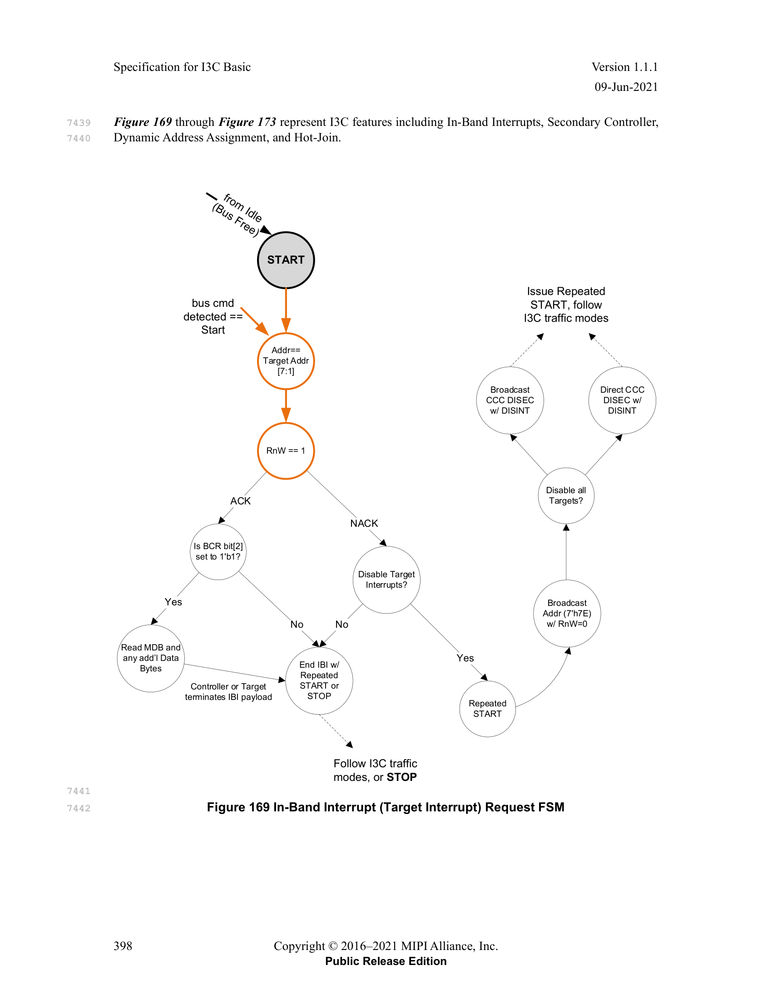

Copyright © 2016–2021 MIPI Alliance, Inc. **Public Release Edition** 

398 

Version 1.1.1 

Specification for I3C Basic 

09-Jun-2021 

## **from START** 

```
7443
7444
```

**==> picture [394 x 476] intentionally omitted <==**

**----- Start of picture text -----**<br>
I3C<br>BCAST<br>7E/W<br>Broadcast<br>I3C  CCC<br>BCAST  SETAASA<br>Direct CCC  7E/W*<br>SETDASA<br>to Target<br>I3C  Repeated<br>BCAST  Broadcast  START<br>7E/W* CCC<br>ENTDAA<br>from<br>1 Hot-Join<br>Target  Target ACK Request<br>Static  Read 48<br>Addr, W Sr, 7E/R bit Prov<br>(NACK  ID (NACK<br>#1) #1)<br>BCR<br>Read<br>(NACK<br>Repeated<br>#1)<br>START<br>Dynamic  Dyn Addr<br>Addr [7:1],  [7:1], DCR<br>Parity 0 (NACK #1)Parity  Read<br>(NACK<br>#1)<br>Error<br>Handling<br>STOP<br>**----- End of picture text -----**<br>


**==> picture [225 x 11] intentionally omitted <==**

**----- Start of picture text -----**<br>
Figure 170 Dynamic Address Assignment FSM<br>**----- End of picture text -----**<br>


Copyright © 2016–2021 MIPI Alliance, Inc. **Public Release Edition** 

399 

Specification for I3C Basic 

Version 1.1.1 09-Jun-2021 

**==> picture [383 x 545] intentionally omitted <==**

**----- Start of picture text -----**<br>
START<br>bus cmd<br>detected ==<br>Start<br>Hot-Join<br>Address == 7'h02 Target typically<br>attempts again<br>RnW == 0<br>Hot-Join rejected<br>ACK NACK (for now)<br>STOP<br>Repeated<br>START Repeated<br>START<br>STOP<br>May perform<br>other valid<br>START<br>Bus activity<br>(etc.) I3C BCAST<br>7E/W I3C BCAST<br>7E/W<br>May also send Private<br>Write/Read, CCC, or end<br>SDR Frame with  STOP<br>ENTDAA  BCAST<br>CCC DISEC CCC<br>w/ DISHJ<br>(Disable Hot<br>Join)<br>Note:  Not all<br>follow DAA<br>possible paths<br>Flow<br>are shown. 1<br>**----- End of picture text -----**<br>


**Figure 171 Hot-Join FSM** 

```
7445
7446
```

Copyright © 2016–2021 MIPI Alliance, Inc. **Public Release Edition** 

400 

Version 1.1.1 09-Jun-2021 

Specification for I3C Basic 

```
7447
7448
```

**==> picture [202 x 341] intentionally omitted <==**

**----- Start of picture text -----**<br>
START<br>bus cmd<br>detected ==<br>Start<br>Addr ==<br>Secondary<br>Controller Dyn<br>Addr [7:1]<br>RnW == 0<br>Active Controller<br>Request<br>prepares to pass<br>Denied<br>Controller Role<br>**----- End of picture text -----**<br>


**Figure 172 Controller Role Request FSM** 

Copyright © 2016–2021 MIPI Alliance, Inc. **Public Release Edition** 

401 

Specification for I3C Basic 

Version 1.1.1 09-Jun-2021 

**==> picture [324 x 607] intentionally omitted <==**

**----- Start of picture text -----**<br>
Secondary Controller Active Controller<br>(as Target)<br>Controller<br>Role Target Role Prepare for Handoff<br>Request<br>Controller<br>Role Handoff<br>Respond to Procedure<br>GETACCCR<br>Assumed<br>Handoff<br>successful<br>Cancel<br>or retry<br>Monitor New<br>Cancel<br>Active<br>or retry Become  Controller<br>Active  (release SCL)<br>Controller<br>Bus Idle<br>(100 µs)<br>Controller<br>Role<br>Asserted<br>Test New<br>Active<br>Controller<br>(pull SDA Low)<br>Respond<br>to SDA Low<br>(pull SCL Low)<br>Reclaim<br>Controller<br>End<br>CE3 Role<br>(pull SCL Low)<br>Error<br>Target Role<br>is Active<br>Active Controller  Error<br>Recovery<br>former Active Controller<br>(monitoring)<br>End<br>Secondary Controller<br>**----- End of picture text -----**<br>


**Figure 173 Controller Regaining Bus Ownership FSM** 

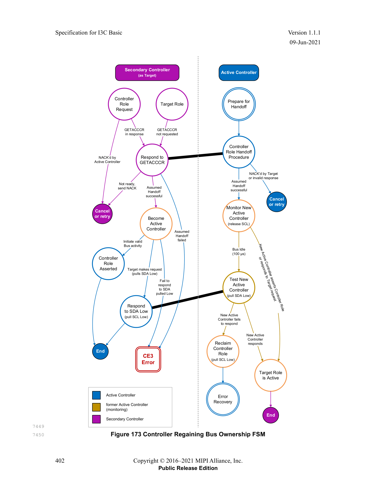

```
7449
7450
```

Copyright © 2016–2021 MIPI Alliance, Inc. **Public Release Edition** 

402 

Version 1.1.1 09-Jun-2021 

Specification for I3C Basic 

**`7451`** The FSM in _**Figure 174**_ represents the Controller states when in HDR-DDR transmission Mode, including **`7452`** Entry, Restart, and Exit sequence for ~~HDR-DDR M~~ ode. 

**==> picture [382 x 552] intentionally omitted <==**

**----- Start of picture text -----**<br>
I3C BCAST<br>7E/W<br>bcast CCC<br>I3C BCAST<br>ENTHDRx<br>Preamble =<br>01<br>CMD word<br>WrCmdPrea<br>mble1<br>CmdPreamb<br>more le1 RX data<br> tx data word<br>TX data  WrDataPrea<br>word mble1<br>RdDataPrea<br>HDR Restart<br>mble1<br>label<br>WrDataPrea<br>mble0<br>RdDataPrea<br>Tx CRC  Tx CRC  mble0<br>word word<br>HDR Exit<br>to I3C stop<br>**----- End of picture text -----**<br>


**Figure 174 HDR-DDR Mode FSM** 

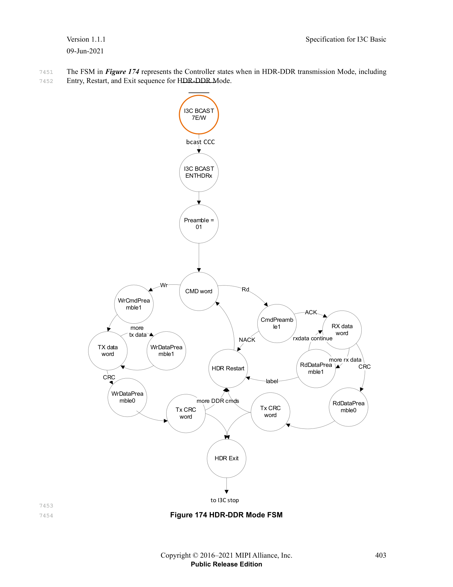

```
7453
7454
```

Copyright © 2016–2021 MIPI Alliance, Inc. 

403 

**Public Release Edition** 

Specification for I3C Basic 

Version 1.1.1 09-Jun-2021 

**`7455`** _**Figure 175**_ is for reference only. 

```
7456
7457
```

**==> picture [375 x 355] intentionally omitted <==**

**----- Start of picture text -----**<br>
Idle<br>START<br>cmd to 10-bit<br>Target addr<br>cmd to 7-bit  {11110,Addr [9:8]} RnW = 0<br>Target addr Addr<br>Phase 2<br>Sr<br>Target Addr<br>[7:1]<br>ACK,  Target Addr<br>Sr Wrdata[7:0] more data [7:1]<br>RnW = 0<br>RnW = 1 RnW = 0<br>WrData[7:0]<br>Rcv  RnW = 1<br>to stop RdData[7:0]<br>Rcv  end txns<br>RdData[7:0]<br>Rd ACK<br>Rd NACK Rd ACK<br>last byte<br>STOP<br>**----- End of picture text -----**<br>


**Figure 175 I[2] C Legacy Controller FSM** 

![Figure 175 I[2] C Legacy Controller FSM](figures/fig_175_p431.png)

Copyright © 2016–2021 MIPI Alliance, Inc. **Public Release Edition** 

404 

Version 1.1.1 09-Jun-2021 

Specification for I3C Basic 

## **Annex D Typical I3C Protocol Communications** 

**`7458`** _**Figure 176**_ through _**Figure 180**_ illustrate a typical communication for each of the supported I3C Protocols. **`7459`** While these figures do not exhaustively illustrate all possible I3C communications, they do serve as useful **`7460`** introductions to the signaling and transmission formatting used in each supported I3C Protocol. 

## **D.1 Typical SDR Private Read** 

**`7461`** _**Figure 176**_ illustrates example communication using I3C Single Data Rate (SDR) Mode. It shows the **`7462`** Controller reading a byte of data from the Target at Address 0x2B in SDR Mode. 

**`7462`** Controller reading a byte of data from the Target at Address 0x2B in SDR Mode. **`7463`** From the Bus Free Condition, the Controller issues a START by driving the SDA line Low while keeping the **`7464`** SCL line High. It then issues the Broadcast Address (7’h7E) followed by RnW (0 for Write). Then the **`7465`** Controller turns on a Pull-Up resistor and goes to Open Drain. All Targets ACK by pulling the SDA line Low **`7466`** (in the Figure, pink fill means the Target is in control of the SDA line at this time). The Controller then issues **`7467`** a Repeated START, then the Address of the Target (0x2B) it wants to read followed by RnW (1 for Read). **`7468`** The Controller then turns on a Pull-Up resistor and goes to Open Drain, allowing the Target to acknowledge **`7469`** by pulling the SDA line Low. At this point, the Controller continues to toggle the SCL line and release the **`7470`** SDA line, allowing the Target to drive SDA to send one byte of data (0x4A) followed by ‘T’. T = 1 informs **`7471`** the Controller that there is additional data, whereas T = 0 signals the end. Here there is additional data, so the **`7472`** Target drives SDA High until SCL goes High, at which time it releases SDA. The Controller has the option **`7473`** of holding SDA High with a weak Pull-Up, which signals to the Target that the Controller allows another **`7474`** byte to be transmitted, or to pull SDA Low (while SCL is High – hence a Repeated START), which would **`7475`** signal to the Target that the Controller has terminated the Read and is taking over. 

**`7476`** SDR Mode is backwards compatible with Legacy I[2] C Devices, because the High time of an SCL pulse is **`7477`** always less than 50 ns and therefore SCL will always appear to be Low because of the I[2] C 50 ns Spike Filter. 

```
7478
7479
```

**==> picture [476 x 280] intentionally omitted <==**

**----- Start of picture text -----**<br>
I3C SDR SDR Message 1<br>START Broadcast Sr Addr Data… Data…, STOP<br>2B + Read 4A Note:<br>Slight dip on SDA indicates weak Pull-Up. Controller<br>may choose to terminate Read and take over.<br>Hex Binary<br>0x4A     = 0b01001010 T<br>SDA<br>SCL<br>Hex Binary<br>Sr 7'h2B      = 0b0101011 R ACK<br>SDA<br>SCL<br>Hex Binary<br>7'h7E     = 0b1111110 W ACK<br>SDA<br>Target driving SDA line<br>SCL<br>**----- End of picture text -----**<br>


**==> picture [364 x 11] intentionally omitted <==**

**----- Start of picture text -----**<br>
Figure 176 Example Communication Using I3C SDR Mode with Private Read<br>**----- End of picture text -----**<br>


Copyright © 2016–2021 MIPI Alliance, Inc. **Public Release Edition** 

405 

Specification for I3C Basic 

Version 1.1.1 09-Jun-2021 

## **D.2 Typical Direct CCC in SDR Mode** 

**`7480`** _**Figure 177**_ shows the Controller issuing a Direct CCC to a single Target. This particular command (GETPID) **`7481`** reads the Provisioned ID of a Target. 

**`7482`** From the Bus Free Condition, the Controller issues a START by driving the SDA line Low while keeping the **`7483`** SCL line High. It then issues the Broadcast Address (7’h7E) followed by RnW (0 for Write). Then the **`7484`** Controller turns on a Pull-Up resistor and goes to Open Drain. All Targets ACK by pulling SDA Low (in the **`7485`** Figure, pink fill means the Targets are in control of SDA at this time). The Controller then issues the Direct **`7486`** Common Command Code for GETPID (0x8D) followed by parity bit ‘T’ (odd parity = 1 for 0x8D) then the **`7487`** 7-bit Dynamic Address of the Target (chosen arbitrarily here to be 0x2B) followed by a RnW bit (1 for Read). **`7488`** Then the Controller turns on a Pull-Up resistor and goes to Open Drain, allowing the Target at Address 0x2B **`7489`** to ACK by pulling SDA Low, which tells the Controller that the Target Acknowledges the command and will **`7490`** comply. (Alternatively, the Target may NACK by not pulling SDA Low, which would inform the Controller **`7491`** that the Target will not comply – in this case, that an error occurred.) Following the ACK the Target outputs **`7492`** its 48-bit PID one byte at a time, and then the Controller issues a Repeated START (this part of the waveform **`7493`** sequence is not shown in the Figure). 

**==> picture [480 x 276] intentionally omitted <==**

**----- Start of picture text -----**<br>
I3C SDR SDR Message 1<br>START Broadcast SDR Cmd Sr Address Reply Data…, Sr<br>Directed 2B + Read<br>CCC_GETPID<br>Hex Binary SPECIFIC<br>7'h2B     = 0b0101011 R ACK TARGET<br>SDA<br>SCL<br>Hex Binary<br>0x8D      = 0b10001101 T<br>SDA<br>SCL<br>7'h7E W ACK  ALL TARGETS<br>SDA<br>Target driving SDA line<br>7494  SCL<br>7495  Figure 177 Example Communication Using I3C SDR Mode with Direct CCC<br>**----- End of picture text -----**<br>


Copyright © 2016–2021 MIPI Alliance, Inc. **Public Release Edition** 

406 

Version 1.1.1 09-Jun-2021 

Specification for I3C Basic 

## **D.3 Typical Broadcast CCC in SDR Mode** 

**`7496`** _**Figure 178**_ illustrates example SDR communication with a Broadcast CCC. The command used in this **`7497`** example sets the Maximum Read Length of all Targets to 43 bytes (0x002B). **`7498`** From the Bus Free Condition, the Controller issues a START by driving the SDA line Low while keeping the **`7499`** SCL line High. It then issues the Broadcast Address (7’h7E) followed by RnW (0 for Write). Then the **`7500`** Controller turns on a Pull-Up resistor and goes to Open Drain. All Targets ACK by pulling SDA Low (in the **`7501`** Figure, pink fill means the Targets are in control of SDA at this time). The Controller then issues the Broadcast **`7502`** Common Command Code for SETMRL (0x0A) followed by parity bit ‘T’ (odd parity = 1 for 0x0A), and **`7503`** then 2 data bytes (MSB first, and MSb first within each byte) to define the maximum number of bytes that **`7504`** can be read from a Target in a single read operation. Each data byte is followed by a ‘T’ bit (parity bit – odd **`7505`** parity). After this the Controller issues a Repeated START. 

**==> picture [483 x 322] intentionally omitted <==**

**----- Start of picture text -----**<br>
I3C SDR SDR Message 1<br>START Broadcast SDR_Cmd Data…, MSB Data…,LSB Sr<br>Broadcast 00 2B<br>CCC_SETMRL<br>Hex Binary T<br>0x00  = 0b00000000   1<br>(this segment not shown)<br>Hex Binary<br>0x2B     = 0b00101011 T Sr<br>SDA<br>SCL<br>0x0A     = 0b00001010 T<br>SDA<br>SCL<br>7'h7E W ACK<br>SDA<br>Target driving SDA line<br>SCL<br>7506<br>7507  Figure 178 Example Communication Using I3C SDR Mode with Broadcast CCC<br>**----- End of picture text -----**<br>


Copyright © 2016–2021 MIPI Alliance, Inc. **Public Release Edition** 

407 

Specification for I3C Basic 

Version 1.1.1 09-Jun-2021 

## **D.4 Typical HDR-DDR Read** 

**`7508`** _**Figure 179**_ illustrates use of the HDR-DDR (Double Data Rate) Mode. It shows how the Controller can **`7509`** change the Mode from SDR (Single Data Rate) Mode to HDR-DDR Mode, and a sample of the HDR-DDR **`7510`** data format. 

**`7511`** From the Bus Free Condition, the Controller issues a START by driving the SDA line Low while keeping the **`7512`** SCL line High. The Controller then issues the Broadcast Address (7’h7E) followed by RnW (0 for Write). **`7513`** Then the Controller turns on a Pull-Up resistor and goes to Open Drain. All Targets ‘ACK’ by pulling SDA **`7514`** Low (in the Figure, pink fill means the Targets are in control of SDA at this time). The Controller then issues **`7515`** the Broadcast Common Command Code for ENTHDR0 (0x20), followed by parity bit ‘T’ (odd parity = 0 for **`7516`** 0x20). At this point, the Bus is in HDR-DDR Mode. In the HDR-DDR protocol, the SDA line is sampled on **`7517`** every SCL edge (both Low-to-High and High-to-Low transitions of SCL). The HDR-DDR Word consists of **`7518`** a 2-bit Preamble, followed by two bytes of data, followed by two parity bits. The waveform for the 5-bit CRC **`7519`** and following traffic is not shown in the Figure. 

**`7520`** HDR-DDR Mode is backwards-compatible with Legacy I[2] C Devices, because the High time of an SCL pulse **`7521`** is always less than 50 ns and as a result SCL will always appear to be Low because of the I[2] C 50 ns Spike **`7522`** Filter. 

```
7523
7524
```

**==> picture [430 x 262] intentionally omitted <==**

**----- Start of picture text -----**<br>
I3C SDR HDR Message 1 HDR Message 2 I3C HDR<br>START Broadcast [Enter HDR] ENTHDR0 [HDR Cmd] Data…,CRC Restart HDR  HDR Cmd Data…,CRC HDR Exit STOP<br>HDR-DDR Read 2B<br>Hex Binary<br>2 bit preamble +  0x852B + 2 parity bits  = 0b01  1000010100101011 01<br>SDA<br>SCL<br>0x20  T<br>SDA<br>SCL<br>7'h7E W ACK<br>SDA<br>Target driving SDA line<br>SCL<br>**----- End of picture text -----**<br>


**==> picture [299 x 10] intentionally omitted <==**

**----- Start of picture text -----**<br>
Figure 179 Example Communication Using HDR-DDR Protocol<br>**----- End of picture text -----**<br>


## **D.5 Typical HDR-TSL Read** 

**`7525`** This section is not included in the I3C Basic Specification because I3C Basic does not support HDR-TSL **`7526`** Mode. To gain access to this capability, please contact MIPI Alliance. 

## **D.6 Typical HDR-TSP Read** 

**`7527`** This section is not included in the I3C Basic Specification because I3C Basic does not support HDR-TSP **`7528`** Mode. To gain access to this capability, please contact MIPI Alliance. 

Copyright © 2016–2021 MIPI Alliance, Inc. **Public Release Edition** 

408 

Version 1.1.1 09-Jun-2021 

Specification for I3C Basic 

## **D.7 Typical HDR-BT Read** 

**`7529`** _**Figure 180**_ illustrates use of the HDR-BT (Bulk Transport) Mode. It shows how the Controller can change **`7530`** the Mode from SDR (Single Data Rate) Mode to HDR-BT Mode, and a sample of the HDR-BT data format **`7531`** using 1-lane configuration (i.e., Coding 0). Note that other ML lane configurations and Codings are possible. 

**`7532`** From the Bus Free Condition, the Controller issues a START by driving the SDA line Low while keeping the **`7533`** SCL line High. The Controller then issues the Broadcast Address (7’h7E) followed by RnW (0 for Write). **`7534`** Then the Controller turns on a Pull-Up resistor and goes to Open Drain. All Targets ‘ACK’ by pulling SDA **`7535`** Low (in the Figure, pink fill means the Targets are in control of SDA at this time). The Controller then issues **`7536`** the Broadcast Common Command Code for ENTHDR3 (0x23), followed by parity bit ‘T’ (odd parity = 0 for **`7537`** 0x23). At this point, the Bus is in HDR-BT Mode. In the HDR-BT protocol, the SDA line is sampled on every **`7538`** SCL edge (both Low-to-High and High-to-Low transitions of SCL). Note that this example shows a Read, **`7539`** so the Controller sets up the SDA line appropriately such that the first bit (ADDR[0]) is sampled correctly **`7540`** for a Read transfer (i.e., RnW = 1’b1). 

**`7541`** In this example, the Controller starts the transfer by sending the HDR-BT Header Block in 1-lane form, and **`7542`** the Controller drives the SDA line to send the Address and RnW bit, to indicate the addressed Target (0x2B) **`7543`** as well as the direction of transfer; the Cmd0 byte (0x85) and additional Cmd1–Cmd3 bytes, to indicate **`7544`** which data to read; and the additional Control byte for transfer settings. The Controller then uses the **`7545`** Transition byte to set up SDA for the Target to accept, and the Target drives SDA Low to indicate acceptance. **`7546`** The Target then drives the SDA line (and optionally the SCL line, if supported) for one or more HDR-BT **`7547`** Data Blocks and the HDR-BT CRC Block that follows, with up to 32 bytes per Data Block. (The waveforms **`7548`** for the Data Blocks and CRC Block are not shown in the Figure; see _**Section 5.2.4.6**_ for reference.) 

**`7549`** HDR-BT Mode is backwards compatible with Legacy I[2] C Devices, because the High time of an SCL pulse **`7550`** is always less than 50 ns and as a result SCL will always appear to be Low because of the I[2] C 50 ns Spike **`7551`** Filter. 

**==> picture [469 x 272] intentionally omitted <==**

**----- Start of picture text -----**<br>
I3C SDR HDR Message 1 HDR Message 2 I3C HDR<br>START Broadcast [Enter HDR] Header Data…, HDR  Header Data…, HDR Exit STOP<br>ENTHDR3 CRC Restart  CRC<br>HDR-BT Read 2B<br>Hex Binary Hex Binary<br>0x57 = 11101010 0x85 = 10100001<br>SDA<br>SCL<br>Address + RnW Cmd0 byte Cmd1-Cmd3 bytes, etc.<br>0x23  T<br>SDA<br>Set up SDA for first<br>SCL HDR-BT Header Block<br>with ADDR[0] (RnW)<br>7'h7E W ACK<br>SDA<br>Target driving SDA line<br>SCL<br>7552<br>7553  Figure 180 Example Communication Using HDR-BT Protocol<br>**----- End of picture text -----**<br>


Copyright © 2016–2021 MIPI Alliance, Inc. **Public Release Edition** 

409 

Specification for I3C Basic 

Version 1.1.1 09-Jun-2021 

This page intentionally left blank. 

Copyright © 2016–2021 MIPI Alliance, Inc. **Public Release Edition** 

410 

Version 1.1.1 09-Jun-2021 

Specification for I3C Basic 

## **Annex E MIPI I3C Basic Specification Supplemental Patent Licensing Terms** 

**`7554`** This agreement (the “Agreement”) between MIPI Alliance Inc. (“MIPI”) and each MIPI member or other **`7555`** party that has manifest agreement to these terms (each a “Licensor” and collectively the “Licensors”) is **`7556`** effective as of the date the I3C Basic Specification (defined below) is first approved by the MIPI Board (the **`7557`** “Effective Date”). Capitalized terms used in this Agreement that are not expressly defined here have the **`7558`** meaning identified in the MIPI Membership Agreement or MIPI Bylaws, as applicable. For convenience, **`7559`** key definitions are reproduced in Attachment A. For the avoidance of doubt: (a) in connection with this **`7560`** Agreement, any reference to a “MIPI Specification” means the MIPI I3C Basic Specification as described in **`7561`** Section 2, and (b) any rights or obligations created under this Agreement are independent of any rights or **`7562`** obligations created under the MIPI Membership Agreement, Bylaws or any other agreements, and nothing in **`7563`** this Agreement is intended to alter rights or obligations established elsewhere. 

**`7564` 1. Background.** Typically, MIPI specifications are implemented only by MIPI members. MIPI **`7565`** members make certain intellectual property licensing commitments to other members under the MIPI **`7566`** Membership Agreement, with different rules applying to “Mobile Terminals” and “Accessories,” in contrast **`7567`** to other types of implementations. The MIPI Board intends to make the MIPI I3C Basic Specification **`7568`** available for implementation by parties who are non-members of MIPI, however. Further, both MIPI **`7569`** members and non-members may use this specification inside and outside of Mobile Terminals or Accessories. **`7570`** The Licensors contributed to the development of the MIPI I3C Basic Specification, and desire to see it widely **`7571`** used. MIPI and the Licensors believe that making licenses available (as set forth in this Agreement) to both **`7572`** member and non-member implementers, for all types of implementations, will facilitate widespread adoption **`7573`** of the MIPI I3C Basic Specification, to the benefit of MIPI, the Licensors, and the broader community that **`7574`** MIPI serves. 

**`7575` 2. MIPI I3C Basic Specification** . “MIPI I3C Basic Specification” means the specification titled “I3C **`7576`** Basic 1.0” as approved by the MIPI Board, and all subsequent versions of such specification approved by the **`7577`** MIPI Board after the Effective Date. Any party implementing the MIPI I3C Basic Specification, whether or **`7578`** not a MIPI member, is an “Implementer.” For the avoidance of doubt: the MIPI I3C Basic Specification is **`7579`** distinct from the MIPI I3C Specification version 1.0 approved by the MIPI Board on Dec. 31, 2016. The **`7580`** terms of this Agreement apply exclusively to the MIPI I3C Basic Specification. 

**`7581` 3. License commitment.** 

**`7582`** _a. RAND-Z license obligation._ For the MIPI I3C Basic Specification only, Licensor hereby **`7583`** agrees to grant, and to cause its Affiliates to grant, to any requesting Implementer a worldwide, **`7584`** non-exclusive, non-sublicensable license under the Necessary Claims of Licensor or its Affiliates, **`7585`** with zero royalties or other compensation, under terms and conditions that are reasonable and **`7586`** nondiscriminatory, to make, have made, use, import, offer to sell, lease, sell, promote and **`7587`** otherwise distribute Compliant Portions. Licensor shall not be obligated to license any part or **`7588`** function of a product in which a Compliant Portion is incorporated that is not itself a Compliant **`7589`** Portion. 

**`7590`** _b. Reciprocity; defensive suspension_ . Licensor shall not be obligated to license any Implementer **`7591`** if that Implementer does not agree to make patent licenses available under any Necessary Claims **`7592`** of that Implementer and its Affiliates to Licensors and all other Implementers under terms **`7593`** substantially identical to the terms described in this Agreement. Further, a Licensor may suspend **`7594`** any license granted under this Agreement to any Implementer if that Implementer or its Affiliate **`7595`** initiates against any party litigation that alleges infringement of a Necessary Claim of Implementer **`7596`** or its Affiliate in connection with the MIPI I3C Basic Specification. Additionally, subject to **`7597`** Section 3.1(f) of the MIPI Membership Agreement as between MIPI Members, a Licensor may **`7598`** terminate, ab initio, any license granted pursuant to this Agreement to any Implementer that **`7599`** initiates litigation against the Licensor alleging infringement of any patent claim of the **`7600`** Implementer or its Affiliate. For the purposes of this Agreement, a party that files a suit which is 

Copyright © 2016–2021 MIPI Alliance, Inc. **Public Release Edition** 

411 

Specification for I3C Basic 

Version 1.1.1 09-Jun-2021 

**`7601`** defensive based on a patent infringement claim or suit by another party will not be deemed to have **`7602`** initiated litigation. 

**`7603`** _c. Circumvention or transfer._ Licensor agrees that it has not transferred and will not transfer any **`7604`** patent having Necessary Claims solely for the purpose of circumventing the obligations described **`7605`** in this Agreement. In addition, Licensor agrees that any transfers by Licensor to a third party of a **`7606`** patent having relevant Necessary Claims, whether or not recognized as Necessary Claims at the **`7607`** time of transfer, shall be subject to (i) the terms and conditions of this Agreement, and (ii) the **`7608`** agreement that the third party shall grant licenses under said Necessary Claims to Implementers **`7609`** pursuant to the terms of this Agreement in like manner and to the same extent as the third party **`7610`** would be required to do if it had executed this Agreement. A transfer of ownership in a business **`7611`** entity which owns or has the right to license a patent having Necessary Claims shall be considered **`7612`** a transfer of such patent. 

**`7613` 4. Termination of obligation to license future versions.** Each Licensor may terminate its **`7614`** participation in this Agreement at any time by providing written notice to the MIPI Managing Director; **`7615`** termination will be effective 30 days after such notice is actually received, subject to the survival points **`7616`** below. Promptly upon receipt of such notice, the MIPI Managing Director will alert the MIPI Board and will **`7617`** use reasonable efforts to notify all Licensors of such termination. After termination, the agreement to grant a **`7618`** license as provided in Section 3 shall survive in full force and effect only: (a) for versions of the MIPI I3C **`7619`** Basic Specification which the Board had approved before the effective date of termination; (b) for Necessary **`7620`** Claims relating to any version of the MIPI I3C Basic Specification approved after the effective date of **`7621`** termination that are used in a substantially similar manner and to a substantially similar extent with a **`7622`** substantially similar result as the Necessary Claims that were used in a prior version for which the Licensor **`7623`** is obligated to grant licenses under this Agreement; and (c) for those Necessary Claims that directly result **`7624`** from inclusion of Licensor-provided material in the draft version of the specification that existed immediately **`7625`** prior to Licensor’s withdrawal. Termination of this Agreement by one Licensor does not impact the **`7626`** Agreement among MIPI or the other Licensors, not does it not impact Licensor’s MIPI Membership **`7627`** Agreement, which will remain in full force and effect. 

**`7628` 5. Third party beneficiaries.** All Implementers, whether or not they are MIPI members, are intended **`7629`** third party beneficiaries of this Agreement. 

```
7630
7631
7632
```

**6. Counterparts; additional Licensors.** This Agreement may be signed in any number of counterparts. If additional parties manifest agreement to terms substantially identical to this Agreement, those parties will be deemed Licensors under this Agreement. 

Copyright © 2016–2021 MIPI Alliance, Inc. **Public Release Edition** 

412 

Version 1.1.1 09-Jun-2021 

Specification for I3C Basic 

**`7633`** 

**`7634`** 

**`7635`** 

**`7636`** 

**`7637`** 

## **Attachment A** 

**`7638`** 

Copyright © 2016–2021 MIPI Alliance, Inc. **Public Release Edition** 

413 

Specification for I3C Basic 

Version 1.1.1 09-Jun-2021 

This page intentionally left blank. 

Copyright © 2016–2021 MIPI Alliance, Inc. **Public Release Edition** 

414 

Version 1.1.1 09-Jun-2021 

Specification for I3C Basic 

## **Annex F I3C Basic Development Companies** 

- **`7639`** Analog Devices, Inc. 

- **`7640`** Analogix Semiconductor, Inc. 

- **`7641`** Avery Design Systems, Inc. 

- **`7642`** Cadence Design Systems, Inc. 

- **`7643`** Intel Corporation 

- **`7644`** Introspect Test Technology Inc. 

- **`7645`** InvenSense, Inc. 

- **`7646`** L&T Technology Services 

- **`7647`** Lattice Semiconductor Corp. 

- **`7648`** MediaTek Inc. 

- **`7649`** NXP Semiconductors 

- **`7650`** Qualcomm Incorporated (provided notice of termination effective August 13, 2018) 

- **`7651`** Robert Bosch GmbH **`7652`** SmartDV Technologies India Private Limited **`7653`** STMicroelectronics **`7654`** Synaptics **`7655`** Synopsys, Inc. **`7656`** Toshiba Memory Corporation **`7657`** Valens Semiconductor 

Copyright © 2016–2021 MIPI Alliance, Inc. **Public Release Edition** 

415 

Specification for I3C Basic 

Version 1.1.1 09-Jun-2021 

This page intentionally left blank. 

Copyright © 2016–2021 MIPI Alliance, Inc. **Public Release Edition** 

416 

Version 1.1.1 09-Jun-2021 

Specification for I3C Basic 

## **Participants** 

The list below includes those persons who participated in the Ad Hoc Working Group that developed this Specification and who consented to appear on this list. 

Rajesh Bhaskar, Intel Corporation Anamitra Chakrabarti, Synopsys, Inc. Kenneth Foust, Intel Corporation Chris Grigg, MIPI Alliance (Team) Janusz Jurski, Intel Corporation Paul Kimelman, NXP Semiconductors 

Tim McKee, Intel Corporation Matthew Schnoor, Intel Corporation Amit Srivastava, Intel Corporation Eyuel Zewdu Teferi, STMicroelectronics James Wang, InvenSense, Inc. 

Past contributors to v1.0: 

Eugen Becker, Robert Bosch GmbH Rajesh Bhaskar, Intel Corporation Enrico Carrieri, Intel Corporation Geraud Cheenne, STMicroelectronics Ladvine D Almeida, Synopsys, Inc. Kenneth Foust, Intel Corporation Chris Grigg, MIPI Alliance (Team) Paul Kimelman, NXP Semiconductors Abinaya Kubendran, L&T Technology Services 

Peter Lefkin, MIPI Alliance (Team) Satwant Singh, Lattice Semiconductor Corp. Przemyslaw Sroka, Cadence Design Systems, Inc. Greg Stewart, Analogix Semiconductor, Inc. Eyuel Zewdu Teferi, STMicroelectronics Suresh Venkatachalam, Synopsys, Inc. James Wang, InvenSense, Inc. Miles Williams, Introspect Test Technology Inc. 

Copyright © 2016–2021 MIPI Alliance, Inc. **Public Release Edition** 

Specification for I3C Basic 

Version 1.1.1 09-Jun-2021 

This page intentionally left blank. 

Copyright © 2016–2021 MIPI Alliance, Inc. **Public Release Edition** 

2 

